# Lattice Java 重构技术方案设计文档

**文档版本**：v1.3
**编写日期**：2026-04-13  
**适用范围**：星巴克数字商品与履约生态系统知识库编译器重构项目  
**技术路线**：Option B — Spring AI Alibaba + PostgreSQL + Redis（详见下方选型说明）  
**机密等级**：内部技术评审

---

## 技术路线选型说明

在正式设计之前，团队对三条技术路线进行了横向评估，最终选定 **Option B**。

### 三条候选路线概览

| | Option A | **Option B（本文档采用）** | Option C |
|--|---------|--------------------------|---------|
| **AI 编排框架** | LangChain4j | **Spring AI Alibaba Graph + Agent Framework（按需）** | 自研 DAG 调度器 |
| **大模型接入** | OpenAI 兼容接口 | **OpenAI（编译）+ Claude（审查）** | 仅 DeepSeek API |
| **持久化层** | MySQL + Milvus（向量库分离） | **PostgreSQL + pgvector（合一）** | MongoDB + Elasticsearch |
| **缓存层** | Caffeine（本地缓存） | **Redis 7（v1.0 单节点，v2.0 Cluster）** | 无缓存 |
| **MCP 暴露方式** | 自实现 HTTP Server | **Spring AI MCP Server（`@McpTool` + HTTP/SSE）** | 无 MCP，仅 REST |
| **适用场景** | 小规模 PoC，快速验证 | **企业级生产，先单应用落地再演进** | 强检索场景，弱 AI 编排 |

### Option B 各技术组件职责说明

```
┌─────────────────────────────────────────────────────────────────┐
│  Spring Boot 3.x + JDK 21                                       │
│  ──────────────────────────────────────────────────────────     │
│  提供基础运行容器、虚拟线程（IO 密集型 LLM 调用并发）、          │
│  Actuator 健康检查、Micrometer 指标采集                          │
├─────────────────────────────────────────────────────────────────┤
│  Spring AI Alibaba Graph + Agent Framework（按需）              │
│  ──────────────────────────────────────────────────────────     │
│  声明式 DAG 引擎，将原版 pipeline.ts 的手写 for-await 循环      │
│  替换为可视化节点图。Graph 负责：                                │
│    · 节点并行执行（对应原版串行编译的性能瓶颈）                  │
│    · 节点状态持久化与断点恢复                                    │
│    · 超时熔断（对应原版 Promise.race 120s）                      │
│    · 条件分支与重试编排                                          │
│  大模型接入：                                                    │
│    · CompilerAgent → OpenAI ChatModel（模型名配置化）           │
│    · ReviewerAgent → Anthropic ChatModel（模型名配置化）        │
│  v1.0 保持单轮审查 + 单次修复；若后续验证 Agent Framework 中      │
│  的 LoopAgent 适配度足够，再在 v2.0 演进为多轮审查循环           │
├─────────────────────────────────────────────────────────────────┤
│  Spring AI MCP Server（`@McpTool` 注解 + WebMVC/SSE）           │
│  ──────────────────────────────────────────────────────────     │
│  将知识库能力以 MCP 协议暴露给 Claude Desktop / Cursor 等客户端 │
│  原版使用 stdio 传输（本地进程），Java 版升级为 HTTP/SSE         │
│  支持 Sa-Token 鉴权、Rate Limit、审批流拦截                     │
├─────────────────────────────────────────────────────────────────┤
│  PostgreSQL 16 + pgvector + 中文检索配置（P0 锁定）             │
│  ──────────────────────────────────────────────────────────     │
│  替代原版 SQLite（search.db + llm-cache.db）。三合一：          │
│    · pgvector：语义向量检索（原版无此能力）                     │
│    · FTS + setweight：带字段权重的中文全文检索                  │
│      对应原版 FTS5 bm25(articles_fts, 1.0, 1.0, 5.0) 权重配置 │
│    · JSONB + GIN 索引：元数据快速路径查询                       │
│  注：RDS 可直接支持 pgvector；中文分词扩展是否可用需在 P0 验证   │
├─────────────────────────────────────────────────────────────────┤
│  Redis 7（v1.0 单节点 / v2.0 Cluster）                          │
│  ──────────────────────────────────────────────────────────     │
│  替代原版三处本地文件存储：                                      │
│    · llm-cache.db（SQLite）→ Redis Hash，跨节点共享 LLM 缓存   │
│    · _staging/ 目录 → Redis Hash，幂等提交暂存区                │
│    · pending-queries.jsonl → Redis SETEX，TTL 自动过期          │
│  同时承载 Sa-Token Session 存储                                  │
└─────────────────────────────────────────────────────────────────┘
```

### 为什么不选 Option A（LangChain4j）

LangChain4j 在 2026 年生态仍以 Chain 模式为主，Graph/DAG 支持尚不成熟。Spring AI（含 Spring AI Alibaba）由 Spring 官方维护，对 OpenAI 和 Claude 均有一类公民支持，且与 Spring Boot Actuator / Micrometer 深度集成，无需额外观测性配置。

### 为什么不选 Option C（自研调度器）

原版 `pipeline.ts` 已经是一个自研调度器，带来的问题（串行、无恢复、无观测）正是本次重构要解决的。重复造轮子没有意义。

---

## 第一章：执行摘要与架构演进价值

### 1.1 原版痛点诊断

通过对原版 Node.js Lattice 代码库的深度审计（`src/compiler/pipeline.ts`、`src/compiler/llm.ts`、`src/compiler/pending-queries.ts`），识别出以下四类系统性缺陷：

| 维度 | 原版缺陷 | 风险等级 |
|------|---------|---------|
| **并发控制** | `pipeline.ts` 业务层使用 `for...of + await` 串行调度，LLM 调用逐概念顺序等待，7637 个源文件场景下编译耗时不可接受（注：非 Node.js 平台限制，而是串行调度设计） | 🔴 P0 |
| **状态持久化** | Pending Query 状态存储于本地 `.jsonl` 文件（`_meta/pending-queries.jsonl`），进程崩溃即丢失；7 天 TTL 依赖内存计算无法跨实例 | 🔴 P0 |
| **LLM 缓存** | `llm-cache.db`（SQLite）为单文件库，无法跨部署节点共享；缓存失效策略（1% 概率 LRU）为随机性触发，存在雪崩风险 | 🟠 P1 |
| **可观测性** | 日志仅输出到 stdout，无 Trace ID 贯穿、无 Metrics 埋点、无告警链路，审查超时只能靠 `Promise.race` 的 120s 兜底 | 🟠 P1 |
| **单点架构** | 全部逻辑运行于单机进程，无水平扩展能力，MCP Server 以 stdio 传输，无法接入公司级 API Gateway | 🟡 P2 |

### 1.2 目标架构价值主张

选择 **Spring AI Alibaba + PostgreSQL + Redis** 技术组合，核心原因如下：

#### 1.2.1 为什么是 Spring AI Alibaba Graph（而非 LangChain4j / 自研）？

```
原版 Pipeline = 手写的 DAG 调度逻辑
                ↓ 包含：分批 → 分析 → 合并 → 编译 → 审查 → 落盘

Spring AI Alibaba Graph = 声明式 DAG 引擎
                         ↓ 内置：节点状态机、中断/恢复、超时熔断、并行分支
```

Spring AI Alibaba Graph 直接将原版 `pipeline.ts` 中手写的 `while/for` 调度逻辑声明化，适合承载 Phase1-Phase5 的节点编排、并行分支、超时和状态恢复。对于“审查-修复循环”能力，本文档不再默认假设 Graph 原生内置 `LoopAgent`；`LoopAgent` 视为 Agent Framework 可选增强，v1.0 先以单轮审查 + 单次修复落地，避免把框架能力假设写成实施前提。同时，其与 Spring Boot 3.x Actuator / Micrometer 的集成，仍然适合暴露节点耗时、重试次数和成功率等指标。

#### 1.2.2 为什么是 PostgreSQL（而非 MySQL + 向量库分离）？

| 能力 | MySQL | PostgreSQL + pgvector |
|------|-------|----------------------|
| 全文检索（BM25 权重） | 仅支持简单 FULLTEXT，无法为字段设置权重 | `setweight(to_tsvector(...), 'A/B/C/D')` 支持 4 级权重 |
| 向量检索 | 不支持（需要独立 Milvus/Weaviate） | pgvector 扩展，与 FTS 同表同事务 |
| JSONB 索引 | 有限支持 | GIN 索引，亚毫秒级 JSONB 路径查询 |
| 并发写入 | 行锁竞争明显 | MVCC 无读写互斥，适合高并发编译落盘 |
| 运维复杂度 | 两套系统（MySQL + 向量库）各自 HA | 单一 PG 集群；pgvector 可直接落地，中文分词方案需按部署环境锁定 |

原版 SQLite FTS5 中为 `referential_keywords` 分配 `5.0` 最高权重的需求，在 PostgreSQL 中可以通过 `setweight(..., 'A')` 精确映射（A 权重在 FTS 排名中权值最高），此为**核心差异化能力**。

#### 1.2.3 为什么是 Redis（而非继续使用本地文件）？

原版 `_staging/` 目录充当跨节点的临时落盘区，本质是用文件系统模拟 WAL（Write-Ahead Log）。Redis 提供：

- **原子性**：`SET NX + EXPIRE` 替代文件锁，天然防并发冲突
- **TTL 状态流转**：Pending Query 的 7 天 TTL 直接由 Redis Key TTL 托管，无需进程内计算
- **防抖去重**：LLM 结果缓存通过 Redis Hash 实现跨节点共享，消除 `llm-cache.db` 的单机限制
- **Pub/Sub**：Graph 节点间状态变更通知，支持分布式进度追踪

#### 1.2.4 综合架构对比

| 指标 | 原版 Node.js Lattice | Java 重构版（Option B） |
|-----|---------------------|----------------------|
| 并发编译吞吐 | 单线程，受限于 Node Event Loop | 虚拟线程（JDK 21）+ Spring AI Graph 并行节点，理论 10x+ |
| LLM 缓存命中率 | 单实例 SQLite，多节点部署时命中率为 0 | Redis 共享缓存（v1.0 单节点 / v2.0 Cluster），命中率持续累积 |
| 状态持久化 SLA | 进程级（崩溃即丢失） | Redis AOF + PG 双写，RPO < 1s |
| 可观测性 | stdout 日志 | Trace ID 全链路、Micrometer Prometheus、Graph 节点粒度 Span |
| 水平扩展 | 不支持 | 无状态 Pod，HPA 自动扩缩 |
| MCP 接入 | stdio 进程间通信 | HTTP/SSE + Spring AI MCP Server，接入公司 API Gateway |

---

## 第二章：总体架构设计图

### 2.1 微服务边界划分

> **架构演进路径说明**：原版 Lattice 是一个单进程 CLI 工具（31 个 TypeScript 文件）。本文档的 4 微服务拆分面向 **v2.0 生产部署目标**。v1.0 落地建议将 `lattice-compiler` 和 `lattice-query` 合并为单个 Spring Boot 应用，对外暴露不同 Controller 路径，等规模增长后再拆分，避免过早引入分布式系统复杂度。

本系统拆分为 4 个独立微服务 + 1 个共享基础设施层：

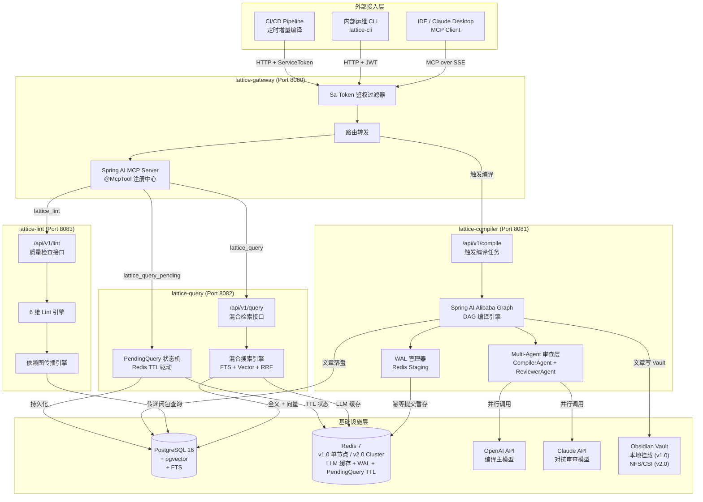
```mermaid
graph TB
    subgraph 外部接入层
        IDE[IDE / Claude Desktop<br/>MCP Client]
        CLI[内部运维 CLI<br/>lattice-cli]
        CICD[CI/CD Pipeline<br/>定时增量编译]
    end

    subgraph lattice-gateway["lattice-gateway (Port 8080)"]
        GW_AUTH[Sa-Token 鉴权过滤器]
        GW_ROUTE[路由转发]
        MCP_REGISTRY[Spring AI MCP Server<br/>@McpTool 注册中心]
    end

    subgraph lattice-compiler["lattice-compiler (Port 8081)"]
        INGEST_API["/api/v1/compile<br/>触发编译任务"]
        GRAPH_ENGINE[Spring AI Alibaba Graph<br/>DAG 编译引擎]
        MULTI_AGENT[Multi-Agent 审查层<br/>CompilerAgent + ReviewerAgent]
        WAL_MGR[WAL 管理器<br/>Redis Staging]
    end

    subgraph lattice-query["lattice-query (Port 8082)"]
        QUERY_API["/api/v1/query<br/>混合检索接口"]
        HYBRID_SEARCH[混合搜索引擎<br/>FTS + Vector + RRF]
        PENDING_MGR[PendingQuery 状态机<br/>Redis TTL 驱动]
    end

    subgraph lattice-lint["lattice-lint (Port 8083)"]
        LINT_API["/api/v1/lint<br/>质量检查接口"]
        SIX_DIM[6 维 Lint 引擎]
        DEP_GRAPH[依赖图传播引擎]
    end

    subgraph 基础设施层
        PG[(PostgreSQL 16<br/>+ pgvector<br/>+ FTS)]
        REDIS[(Redis 7<br/>v1.0 单节点 / v2.0 Cluster<br/>LLM 缓存 + WAL + PendingQuery TTL)]
        OPENAI[OpenAI API<br/>编译主模型]
        CLAUDE[Claude API<br/>对抗审查模型]
        OBS_VAULT["Obsidian Vault<br/>本地挂载 (v1.0)<br/>NFS/CSI (v2.0)"]
    end

    IDE -->|MCP over SSE| GW_AUTH
    CLI -->|HTTP + JWT| GW_AUTH
    CICD -->|HTTP + ServiceToken| GW_AUTH

    GW_AUTH --> GW_ROUTE
    GW_ROUTE --> MCP_REGISTRY
    MCP_REGISTRY -->|lattice_query| QUERY_API
    MCP_REGISTRY -->|lattice_query_pending| PENDING_MGR
    MCP_REGISTRY -->|lattice_lint| LINT_API
    GW_ROUTE -->|触发编译| INGEST_API

    INGEST_API --> GRAPH_ENGINE
    GRAPH_ENGINE --> MULTI_AGENT
    GRAPH_ENGINE --> WAL_MGR
    WAL_MGR -->|幂等提交暂存| REDIS
    MULTI_AGENT -->|并行调用| OPENAI & CLAUDE

    QUERY_API --> HYBRID_SEARCH
    HYBRID_SEARCH -->|全文 + 向量| PG
    HYBRID_SEARCH -->|LLM 缓存| REDIS

    LINT_API --> SIX_DIM --> DEP_GRAPH
    DEP_GRAPH -->|传递闭包查询| PG

    GRAPH_ENGINE -->|文章落盘| PG
    GRAPH_ENGINE -->|文章写 Vault| OBS_VAULT
    PENDING_MGR -->|TTL 状态| REDIS
    PENDING_MGR -->|持久化| PG
```

### 2.2 完整数据流转图（AOT 编译路径）

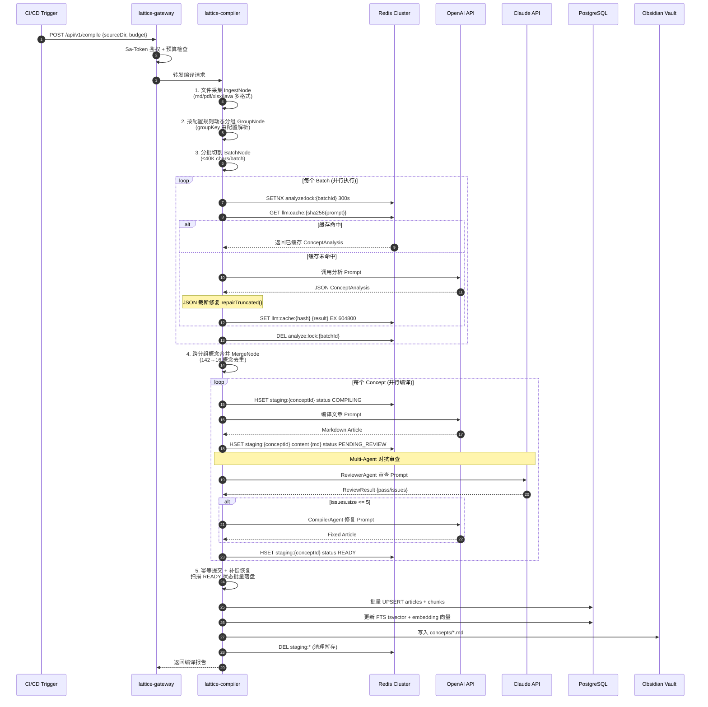
```mermaid
sequenceDiagram
    autonumber
    participant CI as CI/CD Trigger
    participant GW as lattice-gateway
    participant COMP as lattice-compiler
    participant REDIS as Redis Cluster
    participant OPENAI as OpenAI API
    participant CLAUDE as Claude API
    participant PG as PostgreSQL
    participant VAULT as Obsidian Vault

    CI->>GW: POST /api/v1/compile {sourceDir, budget}
    GW->>GW: Sa-Token 鉴权 + 预算检查
    GW->>COMP: 转发编译请求

    COMP->>COMP: 1. 文件采集 IngestNode<br/>(md/pdf/xlsx/java 多格式)
    COMP->>COMP: 2. 按配置规则动态分组 GroupNode<br/>(groupKey 由配置解析)
    COMP->>COMP: 3. 分批切割 BatchNode<br/>(≤40K chars/batch)

    loop 每个 Batch (并行执行)
        COMP->>REDIS: SETNX analyze:lock:{batchId} 300s
        COMP->>REDIS: GET llm:cache:{sha256(prompt)}
        alt 缓存命中
            REDIS-->>COMP: 返回已缓存 ConceptAnalysis
        else 缓存未命中
            COMP->>OPENAI: 调用分析 Prompt
            OPENAI-->>COMP: JSON ConceptAnalysis
            Note over COMP: JSON 截断修复 repairTruncated()
            COMP->>REDIS: SET llm:cache:{hash} {result} EX 604800
        end
        COMP->>REDIS: DEL analyze:lock:{batchId}
    end

    COMP->>COMP: 4. 跨分组概念合并 MergeNode<br/>(142→16 概念去重)

    loop 每个 Concept (并行编译)
        COMP->>REDIS: HSET staging:{conceptId} status COMPILING
        COMP->>OPENAI: 编译文章 Prompt
        OPENAI-->>COMP: Markdown Article
        COMP->>REDIS: HSET staging:{conceptId} content {md} status PENDING_REVIEW

        Note over COMP,CLAUDE: Multi-Agent 对抗审查
        COMP->>CLAUDE: ReviewerAgent 审查 Prompt
        CLAUDE-->>COMP: ReviewResult {pass/issues}

        alt issues.size <= 5
            COMP->>OPENAI: CompilerAgent 修复 Prompt
            OPENAI-->>COMP: Fixed Article
        end

        COMP->>REDIS: HSET staging:{conceptId} status READY
    end

    COMP->>COMP: 5. 幂等提交 + 补偿恢复<br/>扫描 READY 状态批量落盘
    COMP->>PG: 批量 UPSERT articles + chunks
    COMP->>PG: 更新 FTS tsvector + embedding 向量
    COMP->>VAULT: 写入 concepts/*.md
    COMP->>REDIS: DEL staging:* (清理暂存)
    COMP-->>GW: 返回编译报告
```

### 2.3 查询路径数据流

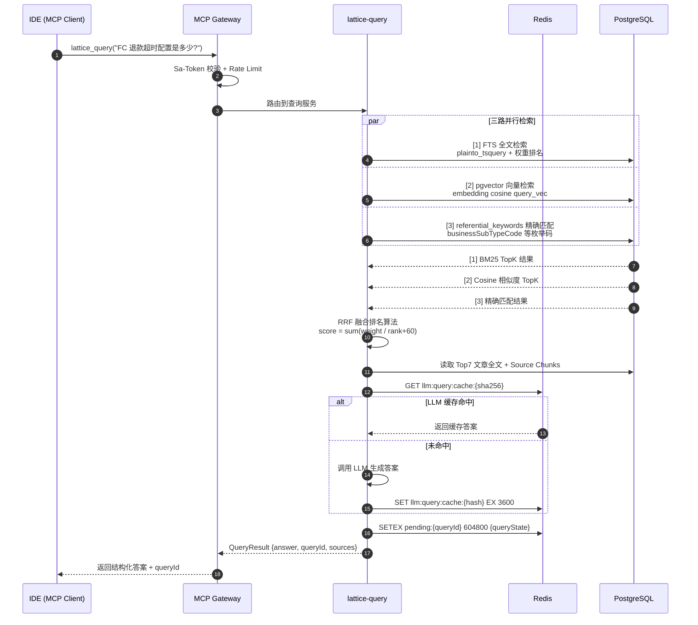
```mermaid
sequenceDiagram
    autonumber
    participant IDE as IDE (MCP Client)
    participant GW as MCP Gateway
    participant QUERY as lattice-query
    participant REDIS as Redis
    participant PG as PostgreSQL

    IDE->>GW: lattice_query("FC 退款超时配置是多少?")
    GW->>GW: Sa-Token 校验 + Rate Limit
    GW->>QUERY: 路由到查询服务

    par 三路并行检索
        QUERY->>PG: [1] FTS 全文检索<br/>plainto_tsquery + 权重排名
    and
        QUERY->>PG: [2] pgvector 向量检索<br/>embedding cosine query_vec
    and
        QUERY->>PG: [3] referential_keywords 精确匹配<br/>businessSubTypeCode 等枚举码
    end

    PG-->>QUERY: [1] BM25 TopK 结果
    PG-->>QUERY: [2] Cosine 相似度 TopK
    PG-->>QUERY: [3] 精确匹配结果

    QUERY->>QUERY: RRF 融合排名算法<br/>score = sum(weight / rank+60)

    QUERY->>PG: 读取 Top7 文章全文 + Source Chunks
    QUERY->>REDIS: GET llm:query:cache:{sha256}
    alt LLM 缓存命中
        REDIS-->>QUERY: 返回缓存答案
    else 未命中
        QUERY->>QUERY: 调用 LLM 生成答案
        QUERY->>REDIS: SET llm:query:cache:{hash} EX 3600
    end

    QUERY->>REDIS: SETEX pending:{queryId} 604800 {queryState}
    QUERY-->>GW: QueryResult {answer, queryId, sources}
    GW-->>IDE: 返回结构化答案 + queryId
```

---

## 第三章：核心流水线设计（基于 Spring AI Alibaba Graph）

### 3.1 DAG 节点设计总览

整个编译流水线被建模为一个 Spring AI Alibaba Graph，每个阶段对应一个 `GraphNode`。

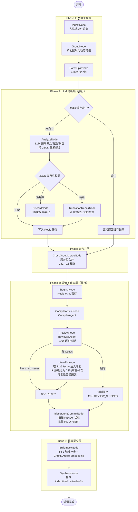
```mermaid
graph TD
    START([开始]) --> INGEST

    subgraph Phase1["Phase 1: 数据采集层"]
        INGEST[IngestNode<br/>多格式文件采集]
        GROUP[GroupNode<br/>按配置规则动态分组]
        BATCH[BatchSplitNode<br/>40K字符分批]
        INGEST --> GROUP --> BATCH
    end

    subgraph Phase2["Phase 2: LLM 分析层（并行）"]
        ANALYZE[AnalyzeNode<br/>LLM 提取概念/关系/争议<br/>带 JSON 截断修复]
        CACHE_CHECK{Redis 缓存命中?}
        BATCH --> CACHE_CHECK
        CACHE_CHECK -->|命中| SKIP_LLM[直接返回缓存结果]
        CACHE_CHECK -->|未命中| ANALYZE
        ANALYZE --> REPAIR{JSON 完整性校验}
        REPAIR -->|截断| TRUNCATION_FIX[TruncationRepairNode<br/>正则抢救已完成概念]
        REPAIR -->|空结果| DISCARD[DiscardNode<br/>不写缓存 防毒化]
        REPAIR -->|正常| CACHE_WRITE[写入 Redis 缓存]
        TRUNCATION_FIX --> CACHE_WRITE
    end

    subgraph Phase3["Phase 3: 合并层"]
        MERGE[CrossGroupMergeNode<br/>跨分组合并<br/>142→16 概念]
        CACHE_WRITE --> MERGE
        SKIP_LLM --> MERGE
    end

    subgraph Phase4["Phase 4: 编译 + 审查层（并行）"]
        STAGE[StagingNode<br/>Redis WAL 暂存]
        COMPILE[CompileArticleNode<br/>CompilerAgent]
        REVIEW[ReviewNode<br/>ReviewerAgent<br/>120s 超时熔断]
        MERGE --> STAGE --> COMPILE --> REVIEW

        REVIEW -->|Pass / no issues| MARK_READY[标记 READY]
        REVIEW -->|有 Issues| AUTOFIX["AutoFixNode<br/>取 Top5 Issue 注入修复<br/>⚑ 原版行为：1轮审查+1次修复后直接提交"]
        REVIEW -->|超时| FORCE_COMMIT[强制提交<br/>标记 REVIEW_SKIPPED]
        AUTOFIX --> MARK_READY
        MARK_READY --> IDEMPOTENT_COMMIT
        FORCE_COMMIT --> IDEMPOTENT_COMMIT
    end

    subgraph Phase5["Phase 5: 幂等提交层"]
        IDEMPOTENT_COMMIT[IdempotentCommitNode<br/>扫描 READY 状态<br/>批量 PG UPSERT]
        BUILD_INDEX[BuildIndexNode<br/>FTS 触发补全 + Chunk/Article Embedding]
        SYNTH[SynthesisNode<br/>生成 index/timeline/tradeoffs]
        IDEMPOTENT_COMMIT --> BUILD_INDEX --> SYNTH
    end

    SYNTH --> END([编译完成])
```

### 3.2 节点详细规格

**分组策略说明：**

`GroupNode` 的职责是把源文件归入动态 `groupKey`，而不是写死固定系统名。分组规则由配置驱动，建议支持三层解析顺序：

1. 显式规则优先：路径前缀 / glob / regex 命中后直接映射到 `groupKey`
2. 顶层目录回退：未命中显式规则时，可将顶层目录名作为 `groupKey`
3. 默认分组兜底：目录结构不稳定或无法归类时，落入 `defaultGroup`

这样新增系统、共享目录、临时模块和后续业务域扩展都只需要改配置，不需要改代码或图中的固定系统名。

#### 3.2.1 IngestNode — 多格式采集

| 参数 | 值 |
|-----|---|
| 输入 | `sourceDir: String` |
| 输出 | `List<RawSource>` |
| 并行策略 | `VirtualThreadTaskExecutor`，IO 密集型 |
| 支持格式 | `.md .java .xml .yml .json .vue .js`（文本类）/ `.pdf`（Apache PDFBox）/ `.xlsx`（Apache POI） |
| 跳过规则 | `node_modules`, `.git`, `target`, `dist`, `.class`, `.jar` |
| 大文件策略 | 超过 8KB 的源文件仅索引前 8K 字符（与原版一致） |

#### 3.2.2 AnalyzeNode — 分析节点（含截断修复）

这是整个系统最关键的节点，也是最容易出现 LLM 输出质量问题的位置。

**核心设计：4 层 JSON 容错解析策略**

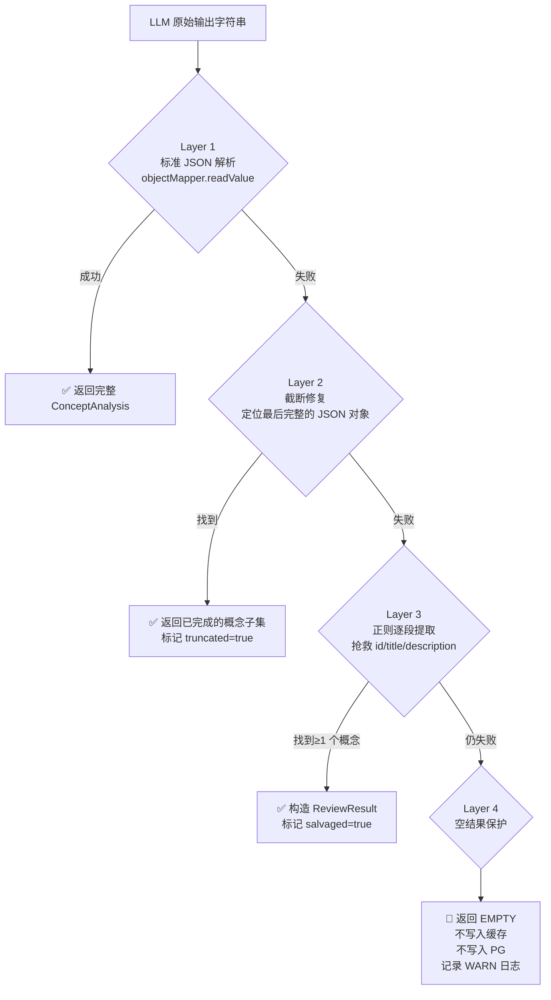
```mermaid
flowchart TD
    LLM_OUT[LLM 原始输出字符串] --> L1{Layer 1<br/>标准 JSON 解析<br/>objectMapper.readValue}
    L1 -->|成功| OK[✅ 返回完整 ConceptAnalysis]
    L1 -->|失败| L2{Layer 2<br/>截断修复<br/>定位最后完整的 JSON 对象}
    L2 -->|找到| PARTIAL[✅ 返回已完成的概念子集<br/>标记 truncated=true]
    L2 -->|失败| L3{Layer 3<br/>正则逐段提取<br/>抢救 id/title/description}
    L3 -->|找到≥1 个概念| SALVAGED[✅ 构造 ReviewResult<br/>标记 salvaged=true]
    L3 -->|仍失败| L4{Layer 4<br/>空结果保护}
    L4 --> DISCARD2[🚫 返回 EMPTY<br/>不写入缓存<br/>不写入 PG<br/>记录 WARN 日志]
```

**Layer 2 截断修复正则设计（对应原版 `repairTruncatedAnalysis()`）：**

```
目标：从如下截断 JSON 中抢救已完成的概念

原始输入（截断示例）：
{
  "concepts": [
    {"id": "fulfillment-center", "title": "FC履约中心", ...},
    {"id": "unified-payment-platform", "title": "UPP支付平台", ...},
    {"id": "s4-coupon-system", "title": "S4卡券系统",  ← 此处截断

正则策略（精确映射原版 repairTruncatedAnalysis 逻辑）：
┌─────────────────────────────────────────────────────────────┐
│ 步骤1: 定位 concepts 数组开始                               │
│   Pattern: (?s)"concepts"\s*:\s*\[(.*)                     │
│                                                             │
│ 步骤2: 逐个提取完整的 concept 对象                          │
│   Pattern: \{[^{}]*(?:\{[^{}]*\}[^{}]*)?\}                │
│   （匹配平衡花括号，支持1层嵌套）                           │
│                                                             │
│ 步骤3: 验证每个候选对象必须包含 id 和 title                 │
│   Pattern: (?:"id"\s*:\s*"([^"]+)")                       │
│   Pattern: (?:"title"\s*:\s*"([^"]+)")                    │
│                                                             │
│ 步骤4: 对于 sources/relationships 数组字段                  │
│   若末尾不完整，注入空数组 [] 兜底                         │
│   Pattern: "sources"\s*:\s*(?!\[)  → 替换为 "sources": [] │
└─────────────────────────────────────────────────────────────┘
```

**Layer 3 深度抢救正则（应对极端截断场景）：**

```
单概念最小结构抢救：
Pattern: (?:\{\s*"id"\s*:\s*"([^"]+)"\s*,\s*"title"\s*:\s*"([^"]+)")

此正则可从如下片段中抢救出 id 和 title：
  {"id": "fc-timeout-config", "title": "FC超时配置"
   ^^^^^^^^^^^^^^^^^^^^^^^^^^^^^^^^^^^^^^^^^^^^
   ← 即使后续字段全部截断，仍可构造最小有效 concept 对象
```

#### 3.2.3 WAL 管理器 — Redis Staging 替代 `_staging/` 目录

**状态机设计：**

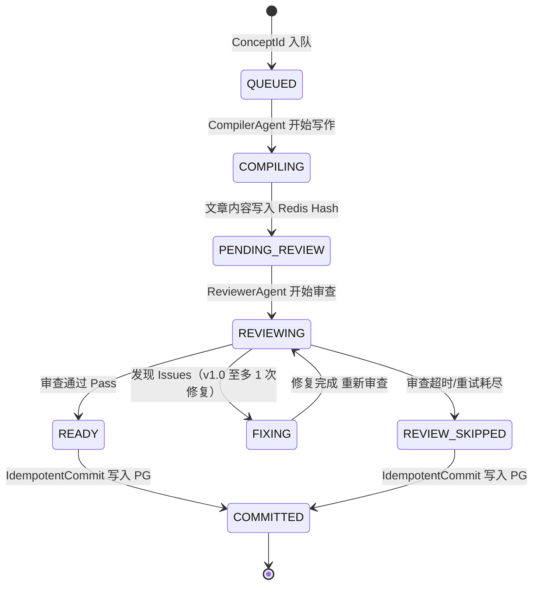
```mermaid
stateDiagram-v2
    [*] --> QUEUED: ConceptId 入队
    QUEUED --> COMPILING: CompilerAgent 开始写作
    COMPILING --> PENDING_REVIEW: 文章内容写入 Redis Hash
    PENDING_REVIEW --> REVIEWING: ReviewerAgent 开始审查
    REVIEWING --> READY: 审查通过 Pass
    REVIEWING --> FIXING: 发现 Issues（v1.0 至多 1 次修复）
    FIXING --> REVIEWING: 修复完成 重新审查
    REVIEWING --> REVIEW_SKIPPED: 审查超时/重试耗尽
    READY --> COMMITTED: IdempotentCommit 写入 PG
    REVIEW_SKIPPED --> COMMITTED: IdempotentCommit 写入 PG
    COMMITTED --> [*]
```

**Redis 数据结构设计：**

```
Key 设计：
┌──────────────────────────────────────────────────────────┐
│ Hash: staging:{compilationJobId}:{conceptId}             │
│   Field: status     → QUEUED/COMPILING/.../COMMITTED    │
│   Field: content    → Markdown 文章内容（压缩存储）      │
│   Field: retry_cnt  → 审查重试次数（最大 2）             │
│   Field: review_result → ReviewerAgent 原始输出         │
│   Field: created_at → ISO8601 时间戳                    │
│   TTL: 7200s（2小时，防止僵死任务泄漏）                  │
├──────────────────────────────────────────────────────────┤
│ Set: staging:ready:{compilationJobId}                    │
│   Member: conceptId（状态为 READY 的概念集合）           │
│   TTL: 3600s                                             │
├──────────────────────────────────────────────────────────┤
│ String: staging:lock:{batchId}                           │
│   Value: instanceId（分布式锁）                          │
│   TTL: 300s（单 Batch 分析超时上限）                     │
└──────────────────────────────────────────────────────────┘
```

**幂等提交与补偿恢复机制（WAL 保证）：**

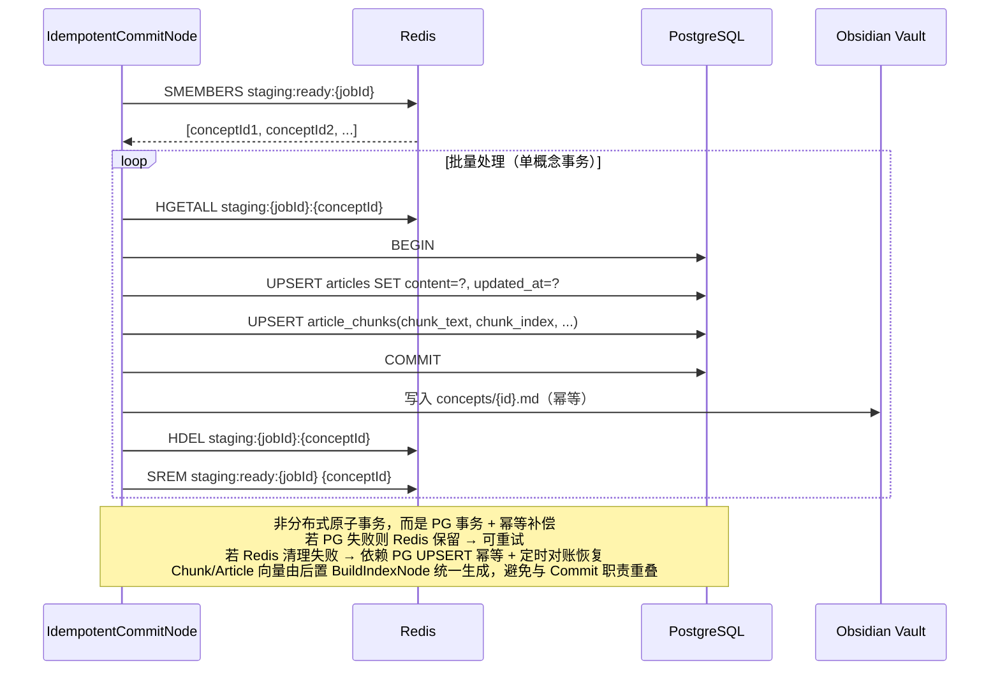
```mermaid
sequenceDiagram
    participant COMMIT as IdempotentCommitNode
    participant REDIS as Redis
    participant PG as PostgreSQL
    participant VAULT as Obsidian Vault

    COMMIT->>REDIS: SMEMBERS staging:ready:{jobId}
    REDIS-->>COMMIT: [conceptId1, conceptId2, ...]

    loop 批量处理（单概念事务）
        COMMIT->>REDIS: HGETALL staging:{jobId}:{conceptId}
        COMMIT->>PG: BEGIN
        COMMIT->>PG: UPSERT articles SET content=?, updated_at=?
        COMMIT->>PG: UPSERT article_chunks(chunk_text, chunk_index, ...) 
        COMMIT->>PG: COMMIT
        COMMIT->>VAULT: 写入 concepts/{id}.md（幂等）
        COMMIT->>REDIS: HDEL staging:{jobId}:{conceptId}
        COMMIT->>REDIS: SREM staging:ready:{jobId} {conceptId}
    end

    Note over COMMIT,PG: 非分布式原子事务，而是 PG 事务 + 幂等补偿<br/>若 PG 失败则 Redis 保留 → 可重试<br/>若 Redis 清理失败 → 依赖 PG UPSERT 幂等 + 定时对账恢复<br/>Chunk/Article 向量由后置 BuildIndexNode 统一生成，避免与 Commit 职责重叠
```

### 3.3 文章生命周期管理（对应原版 `lifecycle.ts`）

原版通过对比源文件 `mtime` 与文章 `compiled_at` 字段检测过时文章。Java 版在 `ARTICLES` 中存储 `source_paths`，在 `SOURCE_FILES` 中存储 `file_mtime`，由定时任务负责比对检测。

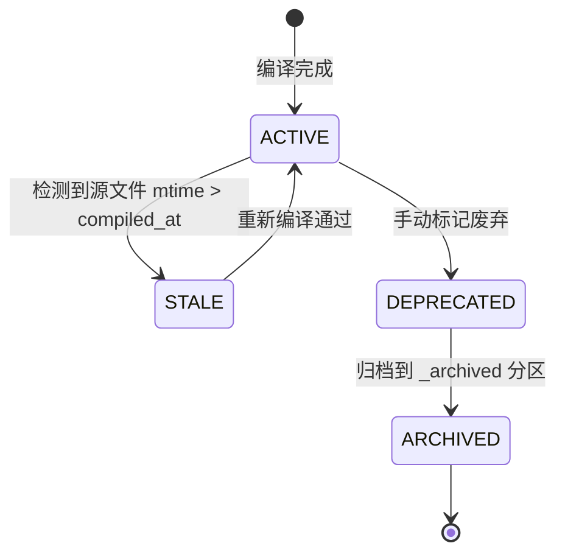
```mermaid
stateDiagram-v2
    [*] --> ACTIVE: 编译完成
    ACTIVE --> STALE: 检测到源文件 mtime > compiled_at
    STALE --> ACTIVE: 重新编译通过
    ACTIVE --> DEPRECATED: 手动标记废弃
    DEPRECATED --> ARCHIVED: 归档到 _archived 分区
    ARCHIVED --> [*]
```

**过时检测机制：**

| 机制 | 原版实现 | Java 版等效方案 |
|-----|---------|--------------|
| 检测时机 | `lattice lint` 命令触发扫描 | Spring `@Scheduled` 定时任务，每日凌晨执行 |
| 比较依据 | `stat(srcPath).mtimeMs > compiledAt` | PG 中 `source_files.file_mtime > articles.compiled_at` |
| 标记方式 | 修改 YAML frontmatter `lifecycle: stale` | `UPDATE articles SET lifecycle='STALE'` |
| 触发重编 | 手动运行 `lattice compile` | 发布 `ArticleStaleEvent`，由 `lattice-compiler` 消费 |

**文章表补充字段（需在 5.1 ER 图基础上新增）：**

```
ARTICLES 表新增字段：
  lifecycle       VARCHAR(20)   DEFAULT 'ACTIVE'   -- ACTIVE/STALE/DEPRECATED/ARCHIVED
  compiled_at     TIMESTAMP                        -- 最近一次编译时间
  source_paths    TEXT[]                           -- 来源文件路径列表（用于 mtime 比对）
  review_rounds   INTEGER       DEFAULT 0          -- 实际经历的审查轮次
```

### 3.4 用户贡献写入闭环（对应原版 `contributions.ts` + `answers-import.ts`）

原版通过 MCP 的 `correct / confirm / discard` 流程维护 pending 查询并在确认后写入贡献。Java 版保留完整闭环，其中 `correct` 必须返回“修订后的答案，且状态仍保持 pending”：

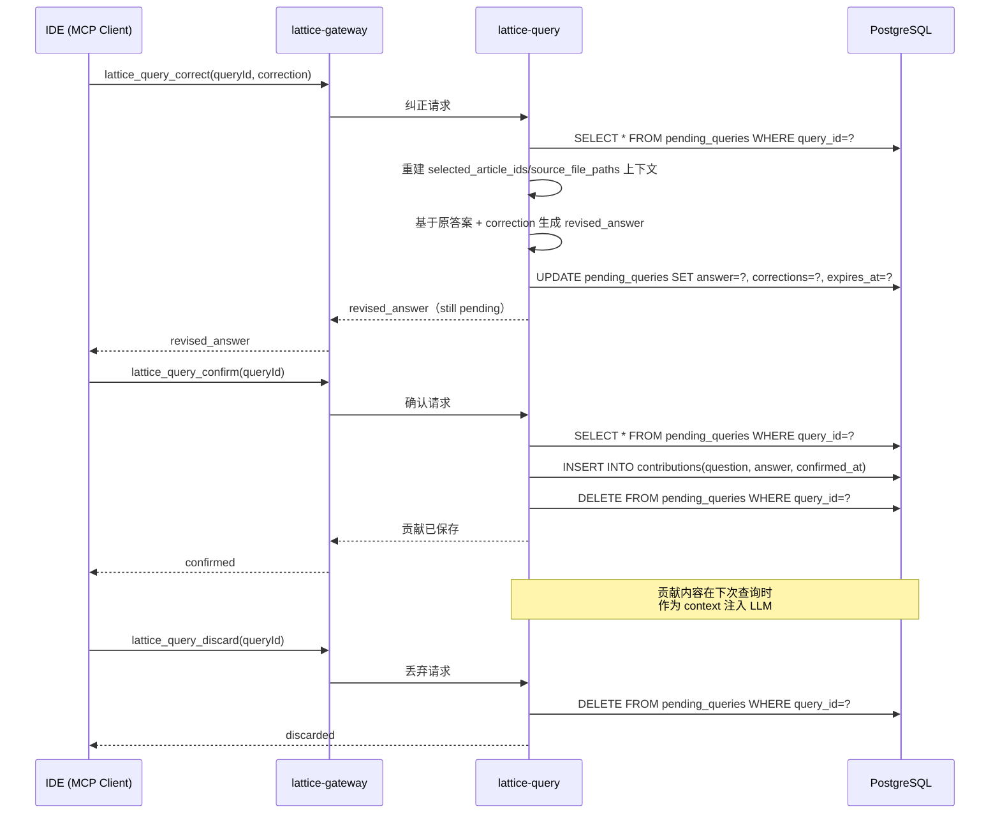
```mermaid
sequenceDiagram
    participant IDE as IDE (MCP Client)
    participant GW as lattice-gateway
    participant QUERY as lattice-query
    participant PG as PostgreSQL

    IDE->>GW: lattice_query_correct(queryId, correction)
    GW->>QUERY: 纠正请求
    QUERY->>PG: SELECT * FROM pending_queries WHERE query_id=?
    QUERY->>QUERY: 重建 selected_article_ids/source_file_paths 上下文
    QUERY->>QUERY: 基于原答案 + correction 生成 revised_answer
    QUERY->>PG: UPDATE pending_queries SET answer=?, corrections=?, expires_at=?
    QUERY-->>GW: revised_answer（still pending）
    GW-->>IDE: revised_answer

    IDE->>GW: lattice_query_confirm(queryId)
    GW->>QUERY: 确认请求
    QUERY->>PG: SELECT * FROM pending_queries WHERE query_id=?
    QUERY->>PG: INSERT INTO contributions(question, answer, confirmed_at)
    QUERY->>PG: DELETE FROM pending_queries WHERE query_id=?
    QUERY-->>GW: 贡献已保存
    GW-->>IDE: confirmed

    Note over QUERY,PG: 贡献内容在下次查询时<br/>作为 context 注入 LLM

    IDE->>GW: lattice_query_discard(queryId)
    GW->>QUERY: 丢弃请求
    QUERY->>PG: DELETE FROM pending_queries WHERE query_id=?
    QUERY-->>IDE: discarded
```

**贡献表设计：**

```
CONTRIBUTIONS 表：
  id            UUID PRIMARY KEY
  question      TEXT NOT NULL
  answer        TEXT NOT NULL
  corrections   JSONB            -- 纠错历史
  confirmed_at  TIMESTAMP
  confirmed_by  VARCHAR(100)     -- 操作人（Sa-Token userId）
  fts_vector    TSVECTOR         -- 贡献内容也参与 FTS 检索
```

---

## 第四章：防御性 AI 与对抗审查设计（基于 Multi-Agent）

### 4.1 双智能体角色定位

| 维度 | CompilerAgent（写作者） | ReviewerAgent（审查者） |
|-----|----------------------|----------------------|
| **核心职责** | 基于源材料编译结构化 Markdown 知识文章 | 以"找茬专家"视角挑战 CompilerAgent 的输出 |
| **使用模型** | OpenAI API（gpt-4o 系列，强推理、支持长上下文） | Claude API（跨模型对抗，避免同质化盲区） |
| **输入** | ConceptAnalysis + 相关源文件 Chunks | 编译好的 Markdown 文章 + 原始 ConceptAnalysis |
| **输出** | 完整 Markdown 文章 | `ReviewResult { pass: boolean, issues: Issue[] }` |
| **超时设置** | 180s（允许长思考） | 120s（超时直接 FORCE_COMMIT） |
| **对应原版** | `pipeline.ts: compileSingleArticle()` | `reviewer.ts: reviewArticle()` |

### 4.2 审查-修复流程设计

> **原版行为 vs Java 版增强对比**
>
> | 维度 | 原版 Node.js（`pipeline.ts`） | Java 版（本文档） |
> |-----|---------------------------|----------------|
> | 审查轮次 | **1 轮**审查 + **1 次**修复 → 直接提交 | **v1.0 保持 1 轮**；v2.0 再评估扩展到最多 2 轮 |
> | Issues 数量判断 | 无论数量多少均尝试修复（fix prompt 内部 cap Top5） | 可配置阈值，超阈值直接跳过修复 |
> | 超时处理 | `Promise.race` 120s 超时跳过审查 | 通过客户端超时配置 + TimeLimiter/熔断器，超时标记 REVIEW_SKIPPED |
> | 二次审查 | **不存在**（`MAX_REVIEW_ROUNDS=2` 声明了但未被循环使用） | 仅作为 v2.0 预留增强；不作为 v1.0 开工前提 |
>
> **v1.0 实现建议**：与原版保持一致，实现单轮审查 + 单次修复。`maxReviewRounds` 在配置中固定为 `1`；只有在 P0/P3 验证 Agent Framework 适配度和质量收益都成立后，才在 v2.0 演进到双轮审查。

**原版实际流程（单轮，v1.0 对齐目标）：**

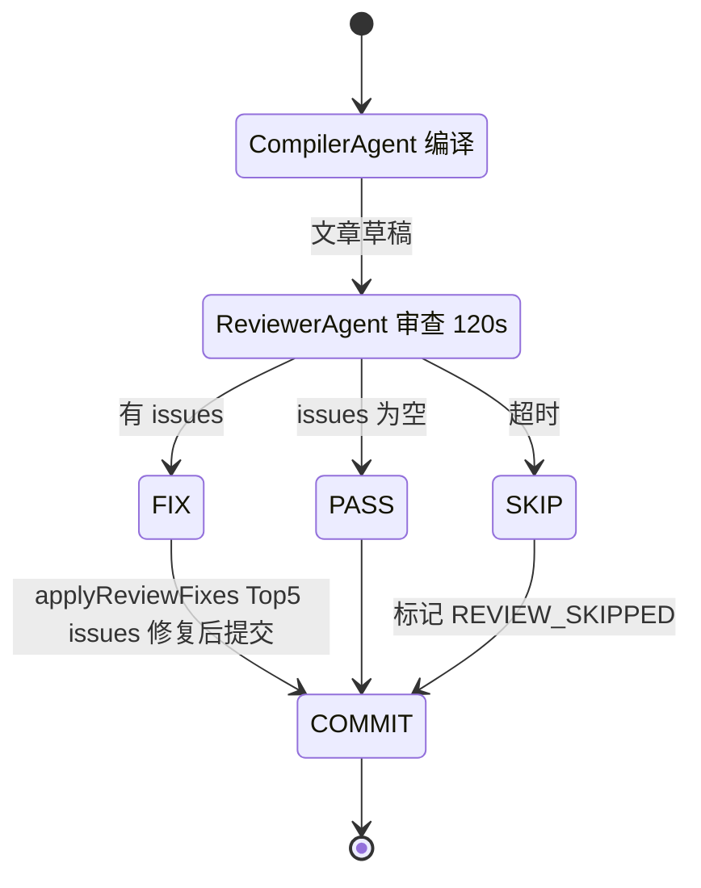
```mermaid
stateDiagram-v2
    state "CompilerAgent 编译" as CA
    state "ReviewerAgent 审查 120s" as RA

    [*] --> CA
    CA --> RA: 文章草稿
    RA --> PASS: issues 为空
    RA --> FIX: 有 issues
    RA --> SKIP: 超时
    FIX --> COMMIT: applyReviewFixes Top5 issues 修复后提交
    PASS --> COMMIT
    SKIP --> COMMIT: 标记 REVIEW_SKIPPED
    COMMIT --> [*]
```

**增强流程（双轮，v2.0 可选启用）：**

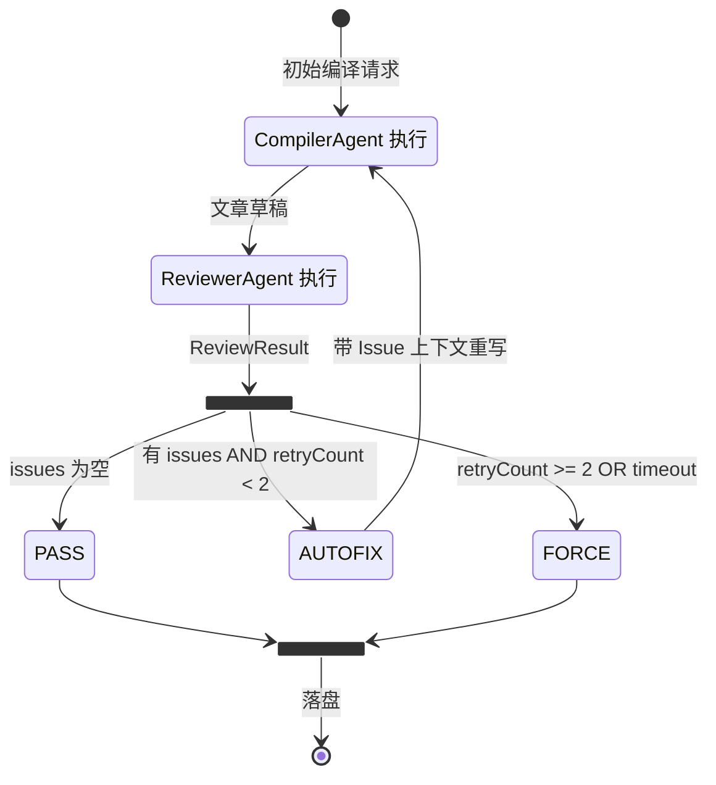
```mermaid
stateDiagram-v2
    state "CompilerAgent 执行" as CA
    state "ReviewerAgent 执行" as RA
    state fork_state <<fork>>
    state join_state <<join>>

    [*] --> CA: 初始编译请求
    CA --> RA: 文章草稿
    RA --> fork_state: ReviewResult

    fork_state --> PASS: issues 为空
    fork_state --> AUTOFIX: 有 issues AND retryCount < 2
    fork_state --> FORCE: retryCount >= 2 OR timeout

    PASS --> join_state
    FORCE --> join_state
    AUTOFIX --> CA: 带 Issue 上下文重写

    join_state --> [*]: 落盘
```

**关键参数（可外化为配置）：**

| 参数 | v1.0 默认值 | v2.0 可调范围 | 对应原版 |
|-----|-----------|------------|---------|
| `maxReviewRounds` | 1 | 1-3 | `MAX_REVIEW_ROUNDS=2`（声明未使用） |
| `maxIssuesForFix` | 无上限（fix prompt 内 Top5） | 5-20 | `prioritized.slice(0, 5)` |
| `reviewTimeoutSec` | 120 | 60-300 | `setTimeout(..., 120_000)` |
| `sourceMaxCharsForReview` | 12000 | 8000-20000 | `MAX_SOURCE_CHARS=12000` |
| `sourceMaxCharsForFix` | 10000 | 6000-15000 | `MAX_SOURCE_CHARS=10000` |

### 4.3 ReviewerAgent 专项检查清单

针对星巴克业务特性，ReviewerAgent 的 System Prompt 中强制嵌入以下检查项（与原版 `SYSTEM_COMPILE_ARTICLE` 中明确性知识规范对应）：

```
【检查维度 1 - 明确性知识完整性】
强制验证以下字段类型的穷举完整性：
- businessSubTypeCode（业务子类型码）
- orderType / fulfillmentType（订单/履约类型）
- 超时配置具体数值（如 retryInterval, maxRetry）
- 卡券 bizType 枚举值

如发现文章仅描述"存在多种业务子码"但未穷举列出，
必须标记 Issue: "遗漏明确性知识，缺少 businessSubTypeCode 枚举列表"

【检查维度 2 - 源文件溯源标注】
文章中每个数值性断言（如超时=30s, 重试=3次）必须有
[→ source_path, section] 标注。缺少则标记 Issue。

【检查维度 3 - 系统间依赖一致性】
FC 调用 UPP 的接口名/参数名，是否与 UPP 侧文章中描述一致。
发现矛盾则标记 Issue: "跨系统描述不一致"。

【检查维度 4 - 知识分类正确性】
概念性知识（FC 是编排中心）允许适度概括。
明确性知识（businessSubTypeCode=1210 对应退款）不允许概括，必须精确。
```

### 4.4 ReviewerAgent 输出格式的 4 层降级解析策略

ReviewerAgent（Claude API）在高负载或输出异常时，可能返回格式错乱的内容。设计 4 层降级解析：

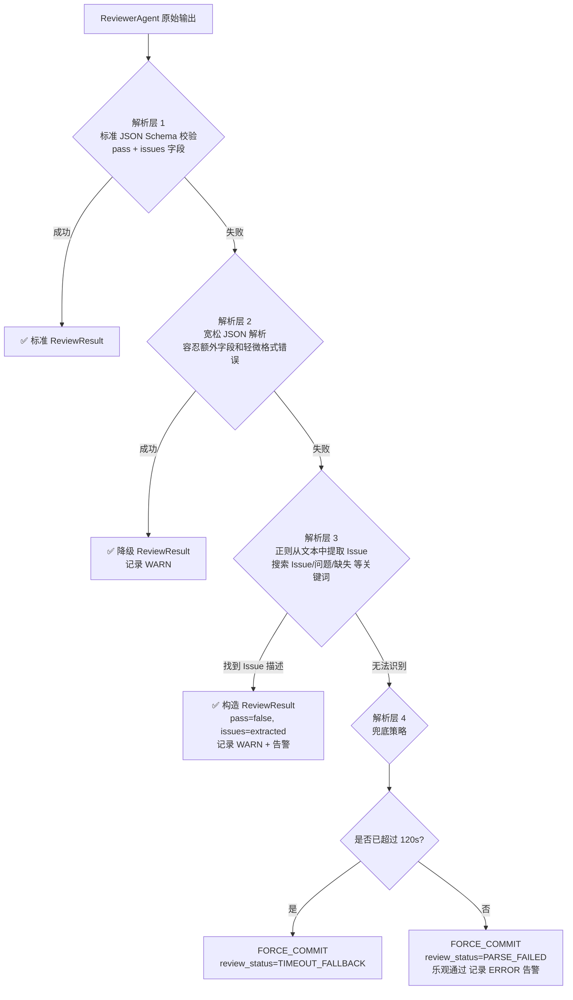
```mermaid
flowchart TD
    RAW[ReviewerAgent 原始输出] --> P1{解析层 1\n标准 JSON Schema 校验\npass + issues 字段}
    P1 -->|成功| DONE1[✅ 标准 ReviewResult]
    P1 -->|失败| P2{解析层 2\n宽松 JSON 解析\n容忍额外字段和轻微格式错误}
    P2 -->|成功| DONE2[✅ 降级 ReviewResult\n记录 WARN]
    P2 -->|失败| P3{解析层 3\n正则从文本中提取 Issue\n搜索 Issue/问题/缺失 等关键词}
    P3 -->|找到 Issue 描述| DONE3[✅ 构造 ReviewResult\npass=false, issues=extracted\n记录 WARN + 告警]
    P3 -->|无法识别| P4{解析层 4\n兜底策略}
    P4 --> TIMEOUT_CHECK{是否已超过 120s?}
    TIMEOUT_CHECK -->|是| SKIP[FORCE_COMMIT\nreview_status=TIMEOUT_FALLBACK]
    TIMEOUT_CHECK -->|否| OPTIMISTIC[FORCE_COMMIT\nreview_status=PARSE_FAILED\n乐观通过 记录 ERROR 告警]
```

**解析层 3 的关键正则（应对中英文混合输出）：**

```
Issue 提取 Pattern（多行模式）：
(?:问题|Issue|缺失|missing|遗漏|incorrect)[^\n]*?：?\s*([^\n]{10,200})

解析后对每条提取文本构造 Issue 对象：
{
  "severity": "HIGH",   // 无法确定严重程度时默认 HIGH
  "description": <extracted>,
  "category": "PARSE_RESCUED"
}
```

### 4.5 CompilerAgent 修复 Prompt 注入机制

当重试循环机制检测到需要重试时（v2.0 可选择 LoopAgent 或自定义 while 循环），注入结构化的修复上下文：

```
修复上下文注入格式（发送给 CompilerAgent）：

=== 审查意见（第 {N} 轮）===
以下问题必须在本轮修复中全部解决：

[Issue 1 - 严重度: HIGH]
遗漏明确性知识：文章描述了"存在多种业务子码"，但未列出：
- businessSubTypeCode=1210 (退款)
- businessSubTypeCode=1310 (部分退款)
来源参考: [→ s4-refund-bizcode.xlsx, Sheet1:A1:B20]

[Issue 2 - 严重度: MEDIUM]
缺少溯源标注：第3段"超时重试间隔为30秒"无 [→ source] 标注

=== 原始文章（待修复版本）===
{original_article_content}

=== 相关源材料（新增注入）===
{additional_source_chunks_for_missing_codes}
```

---

## 第五章：搜索引擎落地设计（基于 PostgreSQL）

### 5.1 PostgreSQL 核心表结构设计

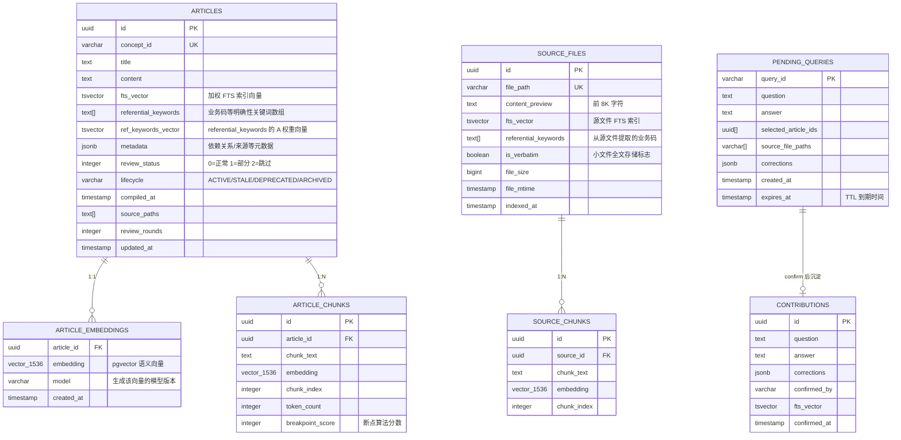
```mermaid
erDiagram
    ARTICLES {
        uuid id PK
        varchar concept_id UK
        text title
        text content
        tsvector fts_vector "加权 FTS 索引向量"
        text[] referential_keywords "业务码等明确性关键词数组"
        tsvector ref_keywords_vector "referential_keywords 的 A 权重向量"
        jsonb metadata "依赖关系/来源等元数据"
        integer review_status "0=正常 1=部分 2=跳过"
        varchar lifecycle "ACTIVE/STALE/DEPRECATED/ARCHIVED"
        timestamp compiled_at
        text[] source_paths
        integer review_rounds
        timestamp updated_at
    }

    ARTICLE_EMBEDDINGS {
        uuid article_id FK
        vector_1536 embedding "pgvector 语义向量"
        varchar model "生成该向量的模型版本"
        timestamp created_at
    }

    ARTICLE_CHUNKS {
        uuid id PK
        uuid article_id FK
        text chunk_text
        vector_1536 embedding
        integer chunk_index
        integer token_count
        integer breakpoint_score "断点算法分数"
    }

    SOURCE_FILES {
        uuid id PK
        varchar file_path UK
        text content_preview "前 8K 字符"
        tsvector fts_vector "源文件 FTS 索引"
        text[] referential_keywords "从源文件提取的业务码"
        boolean is_verbatim "小文件全文存储标志"
        bigint file_size
        timestamp file_mtime
        timestamp indexed_at
    }

    SOURCE_CHUNKS {
        uuid id PK
        uuid source_id FK
        text chunk_text
        vector_1536 embedding
        integer chunk_index
    }

    PENDING_QUERIES {
        varchar query_id PK
        text question
        text answer
        uuid[] selected_article_ids
        varchar[] source_file_paths
        jsonb corrections
        timestamp created_at
        timestamp expires_at "TTL 到期时间"
    }

    CONTRIBUTIONS {
        uuid id PK
        text question
        text answer
        jsonb corrections
        varchar confirmed_by
        tsvector fts_vector
        timestamp confirmed_at
    }

    ARTICLES ||--o{ ARTICLE_EMBEDDINGS : "1:1"
    ARTICLES ||--o{ ARTICLE_CHUNKS : "1:N"
    SOURCE_FILES ||--o{ SOURCE_CHUNKS : "1:N"
    PENDING_QUERIES ||--o| CONTRIBUTIONS : "confirm 后沉淀"
```

### 5.2 核心难点：referential_keywords 高权重 FTS 索引设计

这是与原版 SQLite FTS5 差异最大的地方，也是本方案的核心设计。

**原版 SQLite FTS5 的权重配置：**

```sql
-- 原版 search-index.ts 中对 referential_keywords 分配最高权重
SELECT bm25(articles_fts, 1.0, 1.0, 5.0) as score
--                         title  body  referential_keywords ↑ 最高权重
```

**PostgreSQL 等效实现 — `setweight` 四级权重体系：**

PostgreSQL 的 `ts_rank` 函数对不同权重标记（A/B/C/D）的默认权值为：
- **A** = 1.0（最高，映射原版 `5.0` 的 referential_keywords）
- **B** = 0.4（次高，映射原版 title）
- **C** = 0.2（中等，映射原版 article body）
- **D** = 0.1（最低，用于摘要/描述字段）

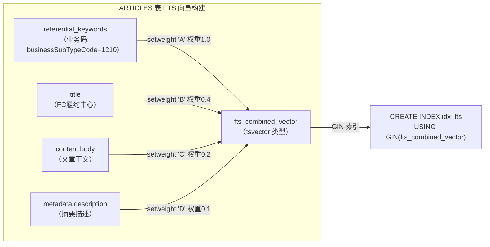
```mermaid
graph LR
    subgraph "ARTICLES 表 FTS 向量构建"
        A["referential_keywords\n（业务码: businessSubTypeCode=1210）"]
        B["title\n（FC履约中心）"]
        C["content body\n（文章正文）"]
        D["metadata.description\n（摘要描述）"]

        A -->|setweight 'A' 权重1.0| VEC["fts_combined_vector\n（tsvector 类型）"]
        B -->|setweight 'B' 权重0.4| VEC
        C -->|setweight 'C' 权重0.2| VEC
        D -->|setweight 'D' 权重0.1| VEC
    end

    VEC -->|GIN 索引| IDX["CREATE INDEX idx_fts\nUSING GIN(fts_combined_vector)"]
```

**FTS 向量生成触发器设计（保证实时更新）：**

```
触发器策略：
┌──────────────────────────────────────────────────────┐
│ BEFORE INSERT OR UPDATE ON articles                  │
│ FOR EACH ROW                                         │
│                                                      │
│ NEW.fts_vector =                                     │
│   setweight(                                         │
│     to_tsvector('lattice_fts_cfg',                  │
│       coalesce(array_to_string(NEW.referential_keywords, ' '), '')  │
│     ), 'A'   ← 业务码字段：最高权重                 │
│   ) ||                                               │
│   setweight(                                         │
│     to_tsvector('lattice_fts_cfg', coalesce(NEW.title,'')), 'B'    │
│   ) ||                                               │
│   setweight(                                         │
│     to_tsvector('lattice_fts_cfg',                  │
│       left(coalesce(NEW.content,''), 50000)),   'C'  │
│   ) ||                                               │
│   setweight(                                         │
│     to_tsvector('lattice_fts_cfg',                  │
│       coalesce(NEW.metadata->>'description','')), 'D'              │
│   )                                                  │
│                                                      │
│ `lattice_fts_cfg` 为 P0 锁定的检索配置别名：         │
│ 可映射到 pg_jieba / zhparser / fallback 方案         │
└──────────────────────────────────────────────────────┘
```

**星巴克业务码的特殊处理 — 数字码精确匹配增强：**

由于 `businessSubTypeCode=1210` 等数字编码在中文分词中可能被切割，需要额外处理：

```
问题场景：
  "businessSubTypeCode=1210" 被中文分词器切割为:
  ["businessSubTypeCode", "=", "1210"] 三个 token

解决方案：双写策略
  referential_keywords 数组同时存储：
  ├── "businessSubTypeCode=1210"  （完整字符串，用于精确正则匹配）
  ├── "1210"                      （纯数字，用于 FTS token 匹配）
  └── "业务子码_退款"              （语义标签，用于中文 FTS）

  额外增加 GIN 索引在 referential_keywords 数组字段上：
  CREATE INDEX idx_ref_keywords ON articles USING GIN(referential_keywords);

  精确匹配查询通过 @> 操作符执行：
  WHERE referential_keywords @> ARRAY['1210']
  权重 weight=3.0（对应原版 RefKey 的最高权重）
```

### 5.3 pgvector 语义检索设计

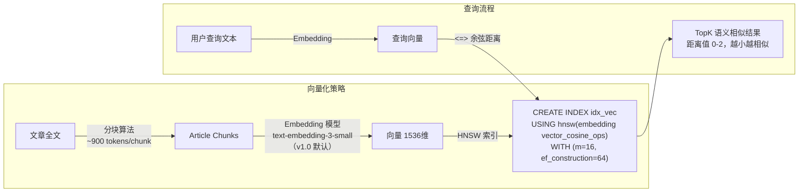
```mermaid
graph LR
    subgraph 向量化策略
        ART[文章全文] -->|分块算法\n~900 tokens/chunk| CHUNKS[Article Chunks]
        CHUNKS -->|Embedding 模型\ntext-embedding-3-small（v1.0 默认）| VEC[向量 1536维]
        VEC -->|HNSW 索引| HNSW["CREATE INDEX idx_vec\nUSING hnsw(embedding vector_cosine_ops)\nWITH (m=16, ef_construction=64)"]
    end

    subgraph 查询流程
        Q[用户查询文本] -->|Embedding| QV[查询向量]
        QV -->|<=> 余弦距离| HNSW
        HNSW --> TOP_K[TopK 语义相似结果\n距离值 0-2，越小越相似]
    end
```

**HNSW vs IVFFlat 选择依据：**

| 索引类型 | 构建速度 | 查询速度 | 召回率 | 适用场景 |
|---------|---------|---------|-------|---------|
| IVFFlat | 快 | 中 | 95%+ | 数据量 > 100 万，离线批量建索引 |
| **HNSW** | **慢** | **快** | **98%+** | **数据量 < 50 万（知识库文章），在线查询优先** |

本项目知识库预估 Article 数量 < 1000，Chunk 数量 < 50000，选择 **HNSW** 以获得最优查询延迟。

### 5.4 RRF 融合排名算法（Java 业务层实现）

原版 `search-engine.ts` 中的 RRF 公式：`score[doc] = Σ weight / (60 + rank + 1) + position_bonus`

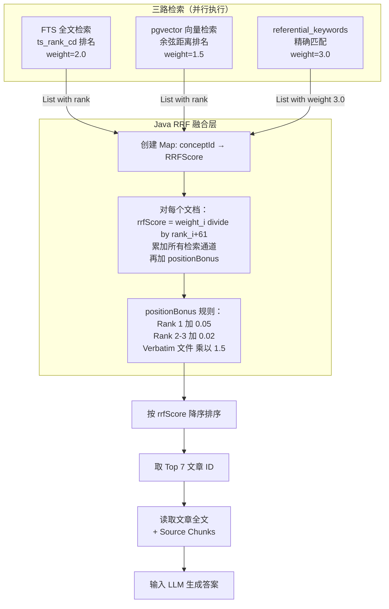
```mermaid
graph TD
    subgraph "三路检索（并行执行）"
        R1["FTS 全文检索\nts_rank_cd 排名\nweight=2.0"]
        R2["pgvector 向量检索\n余弦距离排名\nweight=1.5"]
        R3["referential_keywords\n精确匹配\nweight=3.0"]
    end

    subgraph "Java RRF 融合层"
        MERGE_MAP["创建 Map: conceptId → RRFScore"]

        R1 -->|List with rank| MERGE_MAP
        R2 -->|List with rank| MERGE_MAP
        R3 -->|List with weight 3.0| MERGE_MAP

        MERGE_MAP --> CALC["对每个文档：\nrrfScore = weight_i divide by rank_i+61\n累加所有检索通道\n再加 positionBonus"]

        CALC --> BONUS["positionBonus 规则：\nRank 1 加 0.05\nRank 2-3 加 0.02\nVerbatim 文件 乘以 1.5"]
    end

    BONUS --> SORT[按 rrfScore 降序排序]
    SORT --> TOP7[取 Top 7 文章 ID]
    TOP7 --> READ_CONTENT["读取文章全文\n+ Source Chunks"]
    READ_CONTENT --> LLM[输入 LLM 生成答案]
```

**RRF 融合算法说明：**

```
输入：
  ftsResults:    [(fc-timeout, rank=1), (upp-payment, rank=2), ...]
  vectorResults: [(fc-timeout, rank=1), (fc-lifecycle, rank=2), ...]
  refkeyResults: [(s4-coupon-bizcode, rank=1, weight=3.0), ...]

融合步骤：
  1. 初始化 scoreMap: Map<String, Double>
  2. 遍历 ftsResults:    score += 2.0 / (60 + rank + 1)
  3. 遍历 vectorResults: score += 1.5 / (60 + rank + 1)
  4. 遍历 refkeyResults: score += 3.0 / (60 + rank + 1)  ← 最高权重
  5. 对 score 加 positionBonus
  6. 对 verbatim 文件（xlsx/pdf/小文件）score *= 1.5
  7. 按 score 降序，取 Top7

输出：
  [(s4-coupon-bizcode, score=0.287), (fc-timeout, score=0.134), ...]
```

### 5.5 全文检索 SQL 设计（核心查询模板）

```sql
-- ① FTS 全文检索（利用 setweight 权重）
SELECT concept_id,
       ts_rank_cd(fts_vector, query, 32) AS rank_score,
       ROW_NUMBER() OVER (ORDER BY ts_rank_cd(fts_vector, query, 32) DESC) AS rank
FROM articles,
     plainto_tsquery('lattice_fts_cfg', :userQuery) query
WHERE fts_vector @@ query
ORDER BY rank_score DESC
LIMIT 20;

-- ② pgvector 语义检索（HNSW ANN）
SELECT ac.article_id AS concept_id,
       (1 - (ac.embedding <=> :queryVector)) AS similarity,
       ROW_NUMBER() OVER (ORDER BY ac.embedding <=> :queryVector) AS rank
FROM article_chunks ac
ORDER BY ac.embedding <=> :queryVector
LIMIT 20;

-- ③ referential_keywords 精确匹配（绝对高权重）
SELECT concept_id,
       1 AS rank_score,
       ROW_NUMBER() OVER () AS rank
FROM articles
WHERE referential_keywords @> :extractedCodes
   OR EXISTS (
     SELECT 1 FROM unnest(referential_keywords) kw
     WHERE kw ~* :regexPattern
   )
LIMIT 10;
```

---

## 第六章：MCP 网关融合与外部交互

### 6.1 Spring AI MCP Server 工具暴露设计

使用 Spring AI 官方 MCP Server 注解 `@McpTool`，将核心能力注册为 MCP 工具；Spring AI Alibaba 的扩展能力如 Registry/Admin 视为后续增强，而非 v1.0 必选前置：

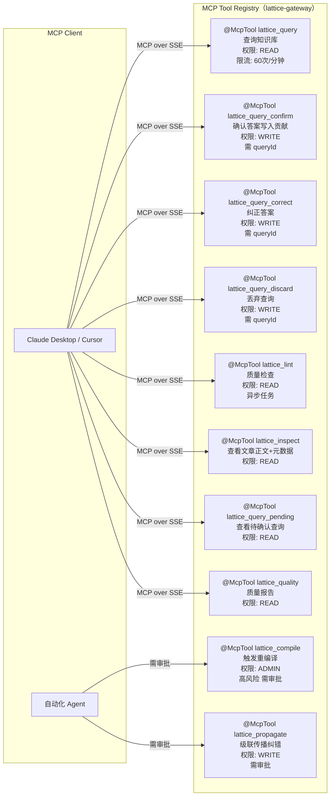
```mermaid
graph LR
    subgraph "MCP Tool Registry（lattice-gateway）"
        T1["@McpTool lattice_query\n查询知识库\n权限: READ\n限流: 60次/分钟"]
        T2a["@McpTool lattice_query_confirm\n确认答案写入贡献\n权限: WRITE\n需 queryId"]
        T2b["@McpTool lattice_query_correct\n纠正答案\n权限: WRITE\n需 queryId"]
        T2c["@McpTool lattice_query_discard\n丢弃查询\n权限: WRITE\n需 queryId"]
        T3["@McpTool lattice_lint\n质量检查\n权限: READ\n异步任务"]
        T4["@McpTool lattice_compile\n触发重编译\n权限: ADMIN\n高风险 需审批"]
        T5["@McpTool lattice_propagate\n级联传播纠错\n权限: WRITE\n需审批"]
        T6["@McpTool lattice_inspect\n查看文章正文+元数据\n权限: READ"]
        T7["@McpTool lattice_query_pending\n查看待确认查询\n权限: READ"]
        T8["@McpTool lattice_quality\n质量报告\n权限: READ"]
    end

    subgraph "MCP Client"
        IDE[Claude Desktop / Cursor]
        AGENT[自动化 Agent]
    end

    IDE -->|MCP over SSE| T1 & T2a & T2b & T2c & T3 & T6 & T7 & T8
    AGENT -->|需审批| T4 & T5
```

> **工具使用约定**：Agent 调用 `lattice_query` 后**必须**将答案呈现给用户，然后根据用户反馈调用三个后续工具之一。这是用户贡献闭环的入口，不可省略。

> **v1.0 工具面收敛说明**：Java 版 v1.0 有意收敛为 10 个 MCP 工具，优先保留“查询闭环 + 质量 + 编译治理”。原版 `lattice_search`、`lattice_status`、`lattice_correct` 暂不作为 MCP 暴露；`lattice_get` 升级为 `lattice_inspect`，返回文章正文与元数据；`propagate` 从原版 CLI 能力升级为 MCP 可调用能力。

**v1.0 收敛后的 10 个工具规格：**

| 工具名 | 对应原版 | 危险等级 | 认证级别 | 说明 |
|-------|---------|---------|---------|------|
| `lattice_query` | `lattice_query` | 低 | JWT Token | 查询并创建 pending 记录 |
| `lattice_query_confirm` | `lattice_query_confirm` | 低 | JWT + queryId | 用户确认 → 写入 contributions 表 |
| `lattice_query_correct` | `lattice_query_correct` | 中 | JWT + queryId | 用户纠正 → 修订答案 |
| `lattice_query_discard` | `lattice_query_discard` | 低 | JWT + queryId | 丢弃 pending 记录 |
| `lattice_lint` | `lattice_lint` | 低 | JWT Token | 6 维质量检查 |
| `lattice_compile` | `lattice_compile` | **高** | ServiceToken + 审批流 | 触发全量/增量重编译 |
| `lattice_propagate` | CLI `lattice propagate` | **高** | ServiceToken + 审批流 | 级联纠错传播 |
| `lattice_inspect` | `lattice_get`（增强版） | 低 | JWT Token | 查看文章正文与元数据 |
| `lattice_query_pending` | `lattice_query_pending` | 低 | JWT Token | 列出待确认查询 |
| `lattice_quality` | `lattice_quality` | 低 | JWT Token | 质量统计报告 |

### 6.2 Sa-Token 鉴权整合设计

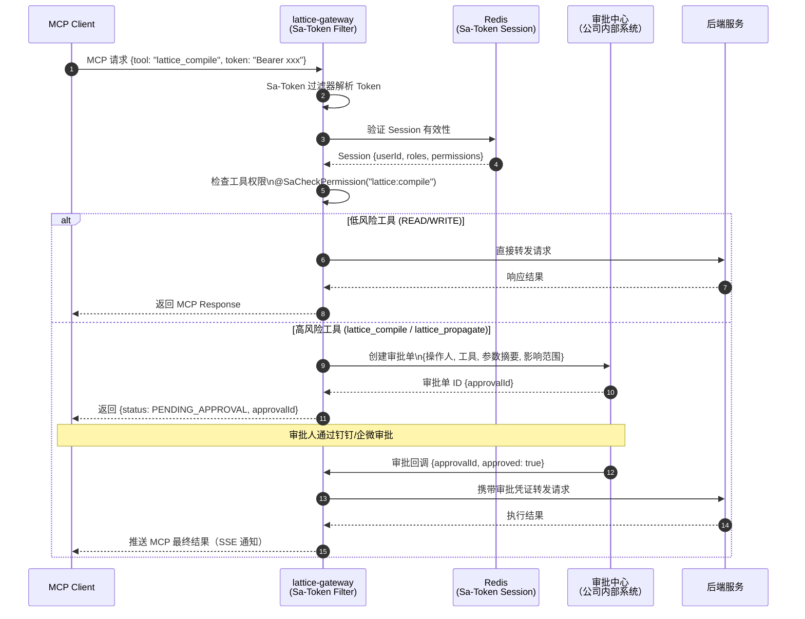
```mermaid
sequenceDiagram
    autonumber
    participant CLIENT as MCP Client
    participant GW as lattice-gateway<br/>(Sa-Token Filter)
    participant REDIS as Redis<br/>(Sa-Token Session)
    participant APPROVAL as 审批中心<br/>（公司内部系统）
    participant SVC as 后端服务

    CLIENT->>GW: MCP 请求 {tool: "lattice_compile", token: "Bearer xxx"}

    GW->>GW: Sa-Token 过滤器解析 Token
    GW->>REDIS: 验证 Session 有效性
    REDIS-->>GW: Session {userId, roles, permissions}

    GW->>GW: 检查工具权限\n@SaCheckPermission("lattice:compile")

    alt 低风险工具 (READ/WRITE)
        GW->>SVC: 直接转发请求
        SVC-->>GW: 响应结果
        GW-->>CLIENT: 返回 MCP Response
    else 高风险工具 (lattice_compile / lattice_propagate)
        GW->>APPROVAL: 创建审批单\n{操作人, 工具, 参数摘要, 影响范围}
        APPROVAL-->>GW: 审批单 ID {approvalId}
        GW-->>CLIENT: 返回 {status: PENDING_APPROVAL, approvalId}
        Note over CLIENT,APPROVAL: 审批人通过钉钉/企微审批
        APPROVAL->>GW: 审批回调 {approvalId, approved: true}
        GW->>SVC: 携带审批凭证转发请求
        SVC-->>GW: 执行结果
        GW-->>CLIENT: 推送 MCP 最终结果（SSE 通知）
    end
```

### 6.3 高风险操作拦截规则

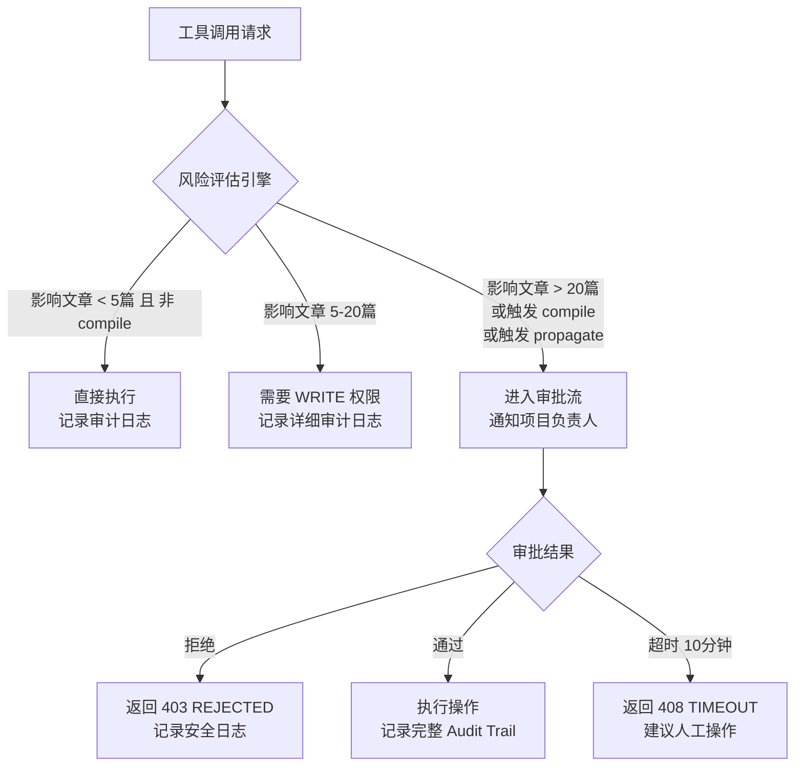
```mermaid
graph TD
    TOOL[工具调用请求] --> RISK{风险评估引擎}

    RISK -->|影响文章 < 5篇 且 非 compile| LOW[直接执行\n记录审计日志]
    RISK -->|影响文章 5-20篇| MEDIUM[需要 WRITE 权限\n记录详细审计日志]
    RISK -->|影响文章 > 20篇\n或触发 compile\n或触发 propagate| HIGH[进入审批流\n通知项目负责人]

    HIGH --> APPROVAL_CHECK{审批结果}
    APPROVAL_CHECK -->|拒绝| REJECT[返回 403 REJECTED\n记录安全日志]
    APPROVAL_CHECK -->|通过| EXEC[执行操作\n记录完整 Audit Trail]
    APPROVAL_CHECK -->|超时 10分钟| TIMEOUT[返回 408 TIMEOUT\n建议人工操作]
```

### 6.4 MCP over SSE vs stdio 对比

| 维度 | 原版 stdio 传输 | Java 版 HTTP/SSE |
|-----|----------------|----------------|
| 接入方式 | Claude Desktop 本地进程 | 标准 HTTP 端点，支持任意 MCP Client |
| 认证 | 无（本地信任） | Sa-Token JWT，支持多租户 |
| 负载均衡 | 不支持 | 接入 Nginx/Gateway，多实例 |
| 审计日志 | 无 | 完整请求/响应日志 + OpenTelemetry Trace |
| 流式输出 | stdout 流 | Server-Sent Events，断点续传 |
| 协议版本 | MCP 0.6 | MCP 1.0+（Spring AI 维护最新版） |

---

## 附录：关键技术决策矩阵

| 决策点 | 备选方案 | 选择方案 | 决策理由 |
|-------|---------|---------|---------|
| 中文 FTS 分词器 | PGroonga / zhparser / pg_jieba / fallback | **P0 锁定，优先自建 PG + 可插拔分词扩展** | pgvector 可直接落地；中文分词需结合部署环境验证，无法装扩展时退化到 `pg_trgm + 精确匹配` |
| Embedding 模型与维度 | `text-embedding-3-small` / `text-embedding-3-large` | **v1.0 锁定 `text-embedding-3-small + vector(1536)`** | 先降低迁移复杂度，避免在 v1.0 阶段引入向量列维度变更 |
| 向量索引类型 | IVFFlat / HNSW | **HNSW** | 知识库规模 < 50K chunks，HNSW 查询延迟 < 10ms |
| LLM 缓存粒度 | 按请求 / 按 Prompt 模板 | **SHA256(model+system+user)** | 与原版 `llm-cache.db` 设计完全一致，保证升级期间缓存可迁移 |
| LLM 分析缓存 TTL | 1天 / 7天 / 永久 | **7 天（604800s）** | 原版文件缓存永久保留；Redis 需要 TTL，7 天覆盖跨天增量编译场景 |
| Graph 节点并行策略 | CompletableFuture / VirtualThread | **VirtualThread + Spring AI Graph 并行分支** | JDK 21 虚拟线程 IO 密集型场景吞吐提升 5-10x |
| PendingQuery 存储 | 纯 Redis / 纯 PG / 双写 | **Redis（TTL 主）+ PG（审计副）** | Redis 负责 7 天 TTL 状态机，PG 负责持久化审计，各司其职 |
| 审查模型选择 | 同模型审查 / 跨模型对抗 | **跨模型对抗（OpenAI 编译 + Claude 审查）** | 消除同质化盲区，与原版 deepseek+claude 双后端策略一致 |
| 审查轮次 | 1轮（原版行为） / 2轮（增强） | **v1.0 单轮，v2.0 可配置双轮** | 原版 `MAX_REVIEW_ROUNDS=2` 声明未用；Java 版预留配置项，验证质量后启用 |
| 源文件优先级规则 | 硬编码 / 外化配置 | **`application.yml` 配置列表** | 原版 `selectKeyFiles()` 优先级规则硬编码于 pipeline.ts；Java 版外化以便业务调整 |
| Vault 文件存储 | 本地 FS / NFS / 对象存储 | **v1.0 本地 FS，v2.0 评估 NFS** | NFS 在 K8s 环境有锁定和延迟风险；v1.0 单副本部署本地 FS 足够 |

---

**文档审阅状态**：Draft v1.3，待 TRC 评审

**v1.3 变更说明**：
- 修正第二章总体架构图中的 MCP 路由示例：由错误的 `lattice_correct -> PendingQuery` 改为 `lattice_query_pending -> PendingQuery`
- 修正第三章幂等提交口径：`IdempotentCommitNode` 仅负责文章与 chunk 文本落盘，Chunk/Article 向量统一由 `BuildIndexNode` 后置生成
- 补齐第三章用户贡献闭环：明确 `lattice_query_correct` 必须重建上下文、返回修订答案，并保持 pending 状态
- 收敛第六章 MCP 工具口径：统一为 v1.0 的 10 个工具，并明确与原版 `search/status/get/correct` 的取舍关系
- 统一工具命名：`lattice_query_pending` 作为待确认查询工具的唯一名称，避免 `pending_queries/pending_list` 混用

**v1.2 变更说明**：
- 修正第一章并发控制痛点描述（业务层串行调度，非 Node.js 平台限制）
- 第二章增加微服务演进路径说明（v1.0 模块化 → v2.0 微服务）
- 第三章新增 3.3 文章生命周期管理、3.4 用户贡献写入闭环两节（对应 `lifecycle.ts` / `contributions.ts`）
- 修正 LLM 分析缓存 TTL：86400s → 604800s（7天）
- 第四章区分原版审查行为（单轮）与 Java 版增强设计（可选双轮），补充关键参数配置表
- 第六章 MCP 工具列表从 8 个补全为 10 个，补充 `confirm` 和 `discard` 两个闭环工具
- 附录决策矩阵新增 3 条：LLM 缓存 TTL / 审查轮次 / 源文件优先级 / Vault 存储选型
- 统一 `v1.0` 范围：单应用部署、单轮审查 + 单次修复、Redis 单节点优先
- 修正 MCP 落地口径：使用 Spring AI `@McpTool` + WebMVC/SSE，Alibaba Registry/Admin 视为后续增强
- 修正数据模型口径：ER 图补齐 `lifecycle / compiled_at / source_paths / review_rounds / file_mtime / contributions`
- 将“Atomic Commit”更名为“幂等提交与补偿恢复”，避免与分布式原子事务混淆
- 将中文 FTS、Embedding 模型与维度收敛为 P0 必验项

**下一步行动**：
1. 完成 `P0-0 技术基线验证`：锁定 Graph / Agent Framework / OpenAI / Anthropic / MCP Server 的精确 artifact 与版本
2. 确认 PostgreSQL 中文检索方案：优先验证自建 PG + 可插拔分词扩展，若受限则定义 fallback 检索路径
3. 锁定 v1.0 Embedding 基线：`text-embedding-3-small + vector(1536)`，并同步到迁移脚本与实体设计
4. 与安全团队确认 Sa-Token 审批流对接方案；v1.0 无外部审批接口时先提供 Mock 实现
5. v1.0 按单应用推进，待性能瓶颈和流量数据明确后再进入 v2.0 微服务拆分
