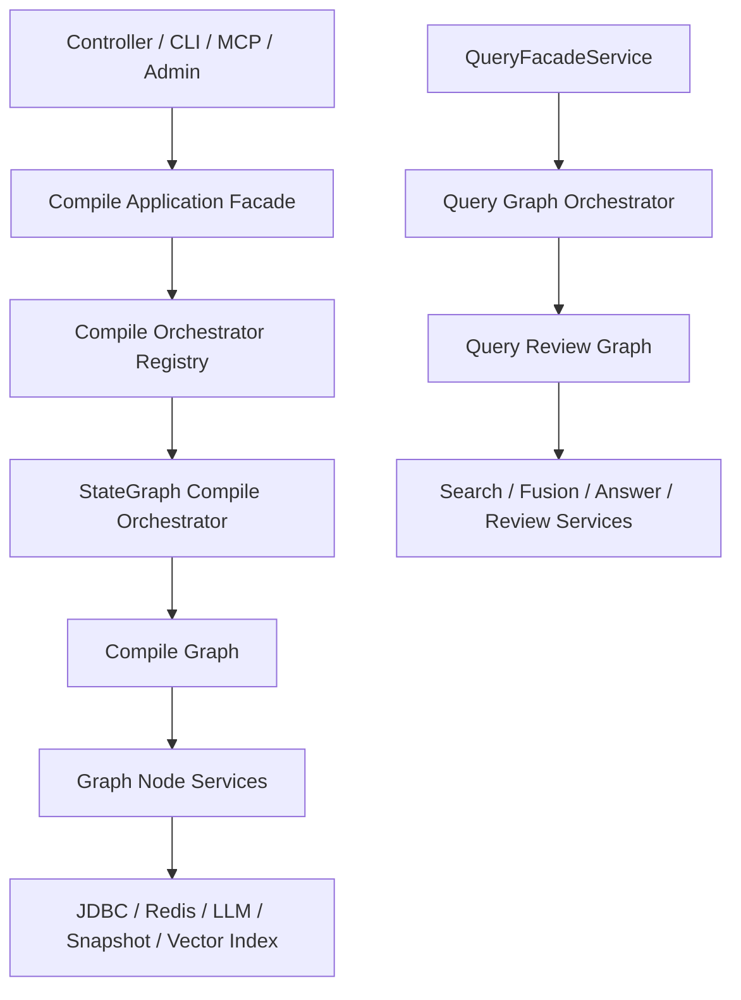
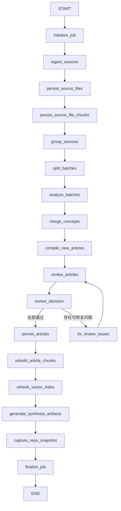
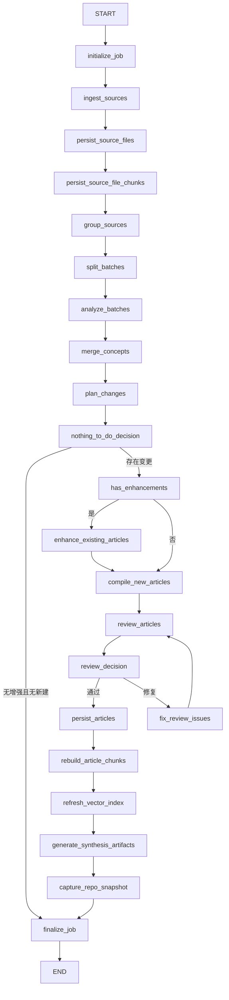
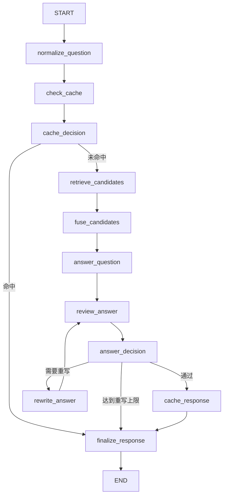

# Spring AI Alibaba Graph 完整接入设计方案

## 1. 文档目标

本文档用于定义 `Lattice-java` 项目中 `Spring AI Alibaba Graph` 的完整接入方案，目标不是“补一个可选编排器”，而是把 Graph 升级为编译与审查链路的主执行骨架。

本文档面向：

- 当前项目维护者
- 后续参与实现或审查的 AI / 人类开发者
- 需要判断本次重构是否“真正用上 Spring AI Alibaba Graph”的评审者

本文档约束前提：

- 本项目按“从 0 到 1 重构”处理，不需要兼容旧数据、旧迁移策略、旧运行方式
- 可以接受对当前编译主链路、增量链路、审查链路做结构性重构
- 可以接受把 `state_graph` 升级为默认编排模式

配套技术验证记录见：

- [Spring AI Alibaba Graph 技术验证记录.md](/Users/sxie/xbk/Lattice-java/.codex/Spring AI Alibaba Graph 技术验证记录.md)

---

## 2. 现状评估

### 2.1 已引入但未真正用满 Graph

项目已经引入 `spring-ai-alibaba-graph-core` 依赖，见 [pom.xml](/Users/sxie/xbk/Lattice-java/pom.xml#L76)。

但当前 Graph 使用方式仍然是“单节点包装”：

- [StateGraphCompileOrchestrator.java](/Users/sxie/xbk/Lattice-java/src/main/java/com/xbk/lattice/compiler/service/StateGraphCompileOrchestrator.java#L57)
- 图中只有一个 `"compile"` 节点
- 节点内部仍然直接调用 `compilePipelineService.compile(...)` 或 `incrementalCompile(...)`

这意味着 Graph 目前只承担了“入口包装器”角色，并未承担真正的业务编排职责。

### 2.2 默认模式仍然不是 Graph

当前 `CompileOrchestrationModes.normalize(...)` 对空值或非法值会回退到 `service`，见 [CompileOrchestrationModes.java](/Users/sxie/xbk/Lattice-java/src/main/java/com/xbk/lattice/compiler/service/CompileOrchestrationModes.java#L27)。

数据库基线中 `compile_jobs.orchestration_mode` 的默认值也是 `service`，见 [V1__baseline_schema.sql](/Users/sxie/xbk/Lattice-java/src/main/resources/db/migration/V1__baseline_schema.sql#L273)。

这会直接导致 Graph 只是“可选模式”，而不是默认主路径。

### 2.3 编译主链路仍是大一统 Service

当前全量编译核心流程集中在 [CompilePipelineService.java](/Users/sxie/xbk/Lattice-java/src/main/java/com/xbk/lattice/compiler/service/CompilePipelineService.java#L220)：

1. `ingest`
2. `persistSourceFiles`
3. `persistSourceFileChunks`
4. `group`
5. `batchSplit`
6. `analyze`
7. `crossGroupMerge`
8. `compilationWalStore.stage`
9. `commitPendingConcepts`
10. `generateAll`
11. `captureRepoSnapshot`

这条链路目前没有节点级可观测性、条件边建模、分阶段重试能力。

### 2.4 增量编译仍是 Service 串联

当前增量编译核心逻辑集中在 [IncrementalCompileService.java](/Users/sxie/xbk/Lattice-java/src/main/java/com/xbk/lattice/compiler/service/IncrementalCompileService.java#L222)。

当前流程大致为：

1. ingest / persist
2. analyze merged concepts
3. `planIncrementalChanges`
4. enhance existing articles
5. create new articles
6. refresh synthesis artifacts
7. capture snapshot

它与全量链路共享大量阶段，但没有被统一到同一张图里。

### 2.5 审查逻辑被埋在文章编译节点内部

[CompileArticleNode.java](/Users/sxie/xbk/Lattice-java/src/main/java/com/xbk/lattice/compiler/service/CompileArticleNode.java#L116) 当前同时承担：

- 文章生成
- 文章审查
- 自动修复
- `review_status` 决策

这会导致以下问题：

- Graph 无法在“生成后、审查前、修复后、落库前”做显式分支
- 审查结果无法独立持久化或统计
- 自动修复无法作为可观察、可替换、可关闭的节点存在

### 2.6 问答侧审查也没有图编排

[QueryFacadeService.java](/Users/sxie/xbk/Lattice-java/src/main/java/com/xbk/lattice/query/service/QueryFacadeService.java#L112) 当前是线性串联：

1. 多路检索
2. RRF 融合
3. 答案生成
4. `ReviewerAgent.review(...)`
5. 缓存

[ReviewerAgent.java](/Users/sxie/xbk/Lattice-java/src/main/java/com/xbk/lattice/query/service/ReviewerAgent.java#L42) 仍是单次调用，且默认实现 [LocalReviewerGateway.java](/Users/sxie/xbk/Lattice-java/src/main/java/com/xbk/lattice/query/service/LocalReviewerGateway.java#L24) 基本恒定返回 pass。

因此，当前“编译 + 审查”并没有真正体现 Spring AI Alibaba Graph 的编排优势。

### 2.7 并非所有编译入口都走编排器注册表

后台作业入口已经可以通过 [CompileOrchestratorRegistry.java](/Users/sxie/xbk/Lattice-java/src/main/java/com/xbk/lattice/compiler/service/CompileOrchestratorRegistry.java#L46) 路由不同模式。

但以下入口仍然直连 `CompilePipelineService`：

- [CompileController.java](/Users/sxie/xbk/Lattice-java/src/main/java/com/xbk/lattice/api/compiler/CompileController.java#L43)
- [CompileCommand.java](/Users/sxie/xbk/Lattice-java/src/main/java/com/xbk/lattice/cli/command/CompileCommand.java#L28)
- [LatticeMcpTools.java](/Users/sxie/xbk/Lattice-java/src/main/java/com/xbk/lattice/mcp/LatticeMcpTools.java#L1156)

只要这些入口还绕过编排器，Graph 就不可能成为“唯一主骨架”。

### 2.8 当前 Graph API 能力已完成本地初步核验

针对“条件边是否可用、生命周期监听是否可挂、状态是否能承载复杂对象”这三个阻塞问题，已在本机依赖上完成初步核验。

本地依赖核验结论：

- `spring-ai-alibaba-graph-core:1.1.2.0` 的 `StateGraph` 确实提供：
  - `addConditionalEdges(...)`
  - `addParallelConditionalEdges(...)`
- `CompileConfig.Builder` 确实提供：
  - `withLifecycleListener(GraphLifecycleListener listener)`
- `OverAllState` 是 `Map<String, Object>` 语义容器，支持存取复杂对象

本地最小 Demo 已验证：

- 条件边可按布尔状态在 `nothing_to_do / compile_new_articles` 两个分支间切换
- `GraphLifecycleListener` 的 `before / after` 可被稳定触发
- `OverAllState` 可以承载 `List<DemoConcept>` 这类对象集合并跨节点读取

但需要强调：

- 这只能证明“API 能力存在且基础行为可用”
- 不能据此推出“适合长期承载全量大对象”
- 因此正式设计仍采用“轻状态 + 外部工作集存储”方案，而不是把全部大对象直接塞进图状态

建议在正式实现前保留一个可执行的仓内验证用例，作为 Phase 0 的准入门槛。

---

## 3. 重构目标

### 3.1 核心目标

1. 把 `Spring AI Alibaba Graph` 升级为编译与审查链路的默认主编排框架
2. 把全量编译与增量编译统一到共享图骨架中
3. 把文章生成、文章审查、自动修复、持久化、切块、向量索引、快照等阶段显式建模为节点
4. 让所有编译入口都经由统一编排层执行
5. 让问答侧答案生成与审查也具备图编排能力
6. 为节点级观测、失败定位、重试恢复、条件分支、后续扩展留出结构空间

### 3.2 业务效果目标

1. 编译链路可清晰回答“卡在哪一步”
2. 审查链路可清晰回答“是生成失败、审查失败、修复失败还是落库失败”
3. 增量编译不再是平行的第二套大 service，而是共享主图骨架的分支流
4. 后续接多模型、多审查轮次、人工审核分流时无需再推翻结构

### 3.3 非目标

1. 本轮不追求把所有检索子系统都 graph 化到极致
2. 本轮不强制引入复杂的多 Agent 协同框架
3. 本轮不追求兼容旧数据或旧迁移历史
4. 本轮不以最小改动为优先级，而以结构正确为优先级

---

## 4. 设计原则

### 4.0 先验证框架能力，再铺开大图

在进入正式编码前，必须先完成仓内可执行 Demo 或测试，验证以下三点：

1. `addConditionalEdges(...)` 在当前依赖版本可正常工作
2. `GraphLifecycleListener` 能稳定拿到 `before / after / onError`
3. `OverAllState` 在放入中等体量对象集合时不会出现序列化或合并异常

若上述任一项失败，则本方案中的条件边与统一监听设计需要立即回退重评，而不能带着假设继续实现。

### 4.1 Graph 作为 Case 层主骨架

按 DDD / 六边形架构理解：

- Trigger 层：Controller / CLI / MCP
- Case 层：Graph Orchestrator
- Domain 层：各个编译、审查、修复、索引、合成服务
- Infrastructure 层：JDBC / Redis / LLM Client / Repo Snapshot / Vector Store

也就是说，Graph 应当位于 Case 层，负责编排，而不是只是简单包装 Domain Service。

### 4.2 生成、审查、修复、落库必须解耦

同一个节点不应同时承担：

- 生成内容
- 审查内容
- 自动修复
- 决定最终状态
- 落库

这些动作必须拆开，否则 Graph 只会退化成“巨大节点的顺序调用器”。

### 4.3 全量与增量统一骨架

全量和增量共享以下前半段步骤：

- ingest
- persist source files
- persist source file chunks
- group
- split
- analyze
- merge

差异主要在“merge 后如何处理文章”：

- 全量：直接面向全部 concept 新建文章
- 增量：先做 plan，再分别增强已有文章和创建新文章

因此应该使用统一图骨架加条件分支，而不是维护两套主流程。

### 4.4 所有入口只认编排层

无论是：

- HTTP API
- Admin 后台作业
- CLI
- MCP Tool

都必须只通过统一编排层触发编译，禁止再直连 `CompilePipelineService`。

### 4.5 节点必须可观测

每个关键节点都必须至少能输出：

- jobId
- stepName
- startedAt
- finishedAt
- status
- summary
- errorMessage

否则 Graph 的价值会因为缺乏观察面而被抵消。

### 4.6 轻状态优先，重载荷外置

Graph 状态只承载：

- 路由判断所需的最小字段
- 当前步骤的引用键
- 计数器、布尔标记、摘要和错误信息

以下大对象不直接长期驻留在 `OverAllState`：

- 全量 `RawSource`
- 全量 `SourceBatch`
- 全量 `AnalyzedConcept`
- 全量 `MergedConcept`
- 完整 Markdown `ArticleRecord`

这些对象统一放入 `CompileWorkingSetStore / QueryWorkingSetStore` 一类外部工作集存储，Graph 状态中只保留引用键和数量摘要。

### 4.7 写库节点独立事务 + 幂等写

本方案不假设 Spring AI Alibaba Graph 提供跨节点事务传播能力。

正式实现采用：

- 每个写库节点独立事务
- 所有写操作必须幂等
- 节点失败后通过补偿或重试恢复，而不是依赖跨节点大事务回滚

这是一条显式设计决策，不允许由实现者自由发挥。

---

## 5. 目标架构

## 5.1 总体结构



### 5.2 关键角色定义

| 角色 | 定位 | 说明 |
|---|---|---|
| CompileApplicationFacade | 编译统一门面 | 对外暴露单一调用入口，负责参数校验、默认 mode 选择、异常转换、同步/异步调用收口 |
| CompileOrchestratorRegistry | 编排器路由 | 只负责根据 mode 路由到具体 Orchestrator 实例，不承担参数校验与异常转换 |
| StateGraphCompileOrchestrator | 图编排执行器 | 负责构建、编译、执行全量/增量图 |
| CompileGraphDefinitionFactory | 图定义工厂 | 负责声明节点、边、条件边 |
| CompileGraphState | 图状态对象 | 只承载轻量状态、路由字段和工作集引用 |
| Node Services | 节点能力提供者 | 只做单阶段动作，不做总控 |
| QueryGraphOrchestrator | 问答图编排器 | 负责任务检索、生成、审查的图化执行 |
| CompileWorkingSetStore | 编译工作集存储 | 保存跨节点的大对象载荷，Graph 状态只保留 ref |
| CompileGraphLifecycleListener | 图生命周期监听器 | 把框架 `before/after/onError` 回调统一转换为步骤日志 |

---

## 6. 编译域目标设计

## 6.1 统一编译状态模型

建议新增 `CompileGraphState`，作为图内部唯一共享状态模型。

设计决策：

- `CompileGraphState` 只放轻量字段
- 大对象通过 `CompileWorkingSetStore` 外置
- 所有条件边只依赖轻量状态字段判断

建议字段如下：

| 字段 | 类型 | 用途 |
|---|---|---|
| jobId | String | 编译任务唯一标识 |
| sourceDir | Path/String | 输入目录 |
| compileMode | String | `full` / `incremental` |
| orchestrationMode | String | 固定为 `state_graph` |
| rawSourcesRef | String | 已摄入源文件集合引用 |
| groupedSourcesRef | String | 分组结果引用 |
| sourceBatchesRef | String | 分批结果引用 |
| analyzedConceptsRef | String | 分析结果引用 |
| mergedConceptsRef | String | 跨组归并结果引用 |
| incrementalPlanRef | String | 增量规划结果引用 |
| conceptsToEnhanceRef | String | 需增强概念映射引用 |
| conceptsToCreateRef | String | 需创建概念引用 |
| draftArticlesRef | String | 待审查文章集合引用 |
| reviewedArticlesRef | String | 已审查文章集合引用 |
| persistedArticleIds | List<String> | 已落库文章 conceptId 集合 |
| conceptCount | Integer | 当前概念数量摘要 |
| persistedCount | Integer | 实际落库数 |
| hasEnhancements | boolean | 是否存在增强对象 |
| hasCreates | boolean | 是否存在新建对象 |
| nothingToDo | boolean | 增量场景是否无变更 |
| fixAttemptCount | Integer | 当前图内修复轮次计数 |
| maxFixRounds | Integer | 最大修复轮次 |
| synthesisRequired | boolean | 是否需要刷新合成产物 |
| snapshotRequired | boolean | 是否需要生成 repo snapshot |
| stepSummaries | List<String> | 节点摘要 |
| errors | List<String> | 过程错误信息 |

说明：

- Graph 内部不要依赖松散字符串键拼来拼去，建议引入强类型状态对象
- 若当前 Graph API 只接受 Map，可在编排层维护 `CompileGraphState <-> Map<String, Object>` 的适配器
- `CompileWorkingSetStore` 推荐以 `jobId + payloadType` 作为键组织数据，支持 TTL 或任务完成后清理
- `persistedArticleIds` 放在状态中是合理的，因为它是轻量主键集合，不是全文内容

### 6.1.2 `CompileGraphStateMapper` 与 key 常量契约

这是 Phase 1 的必实现组件，目的是防止各节点直接面向 `OverAllState` 用字符串 key 读写。

建议最小接口：

```java
public interface CompileGraphStateMapper {

    CompileGraphState fromMap(Map<String, Object> state);

    Map<String, Object> toMap(CompileGraphState state);

    Map<String, Object> toDeltaMap(CompileGraphState state);
}
```

约束说明：

- `fromMap(...)`
  - 负责把 `OverAllState.data()` 或普通 `Map<String, Object>` 转换为强类型 `CompileGraphState`
- `toMap(...)`
  - 负责把完整 `CompileGraphState` 转成可注入 Graph 的 Map
- `toDeltaMap(...)`
  - 负责只输出当前节点应写回的增量字段，避免节点把整份状态全量覆盖回去

同时必须新增统一 key 常量定义，禁止在节点内手写裸字符串。

建议形式二选一：

- `CompileGraphStateKeys` 常量类
- 或 `CompileGraphStateKey` 枚举

建议至少覆盖这些 key：

- `JOB_ID`
- `SOURCE_DIR`
- `COMPILE_MODE`
- `ORCHESTRATION_MODE`
- `RAW_SOURCES_REF`
- `GROUPED_SOURCES_REF`
- `SOURCE_BATCHES_REF`
- `ANALYZED_CONCEPTS_REF`
- `MERGED_CONCEPTS_REF`
- `INCREMENTAL_PLAN_REF`
- `CONCEPTS_TO_ENHANCE_REF`
- `CONCEPTS_TO_CREATE_REF`
- `DRAFT_ARTICLES_REF`
- `REVIEWED_ARTICLES_REF`
- `PERSISTED_ARTICLE_IDS`
- `CONCEPT_COUNT`
- `PERSISTED_COUNT`
- `HAS_ENHANCEMENTS`
- `HAS_CREATES`
- `NOTHING_TO_DO`
- `FIX_ATTEMPT_COUNT`
- `MAX_FIX_ROUNDS`
- `SYNTHESIS_REQUIRED`
- `SNAPSHOT_REQUIRED`
- `STEP_SUMMARIES`
- `ERRORS`

实现要求：

- Graph Node 内部先通过 `CompileGraphStateMapper.fromMap(...)` 读取状态
- 节点输出统一通过 `CompileGraphStateMapper.toDeltaMap(...)` 返回
- 不允许在节点实现中出现未登记的状态 key 字符串常量

### 6.1.1 循环退出计数器与读取者

这是阻塞级设计约束，不能留给实现者自由发挥。

编译图：

- `fixAttemptCount` 放在 `CompileGraphState`
- `maxFixRounds` 放在 `CompileGraphState`
- 这两个字段只允许由以下两类组件读写：
  - `FixReviewIssuesNode`
    - 进入修复节点后把 `fixAttemptCount + 1`
  - `ReviewDecisionPolicy`
    - 读取 `fixAttemptCount / maxFixRounds / autoFixEnabled / reviewResult`
    - 决定走 `fix_review_issues` 还是 `persist_articles`

问答图：

- `rewriteAttemptCount` 放在 `QueryGraphState`
- `maxRewriteRounds` 放在 `QueryGraphState`
- 这两个字段只允许由以下两类组件读写：
  - `RewriteAnswerNode`
    - 每次重写后将 `rewriteAttemptCount + 1`
  - `QueryReviewDecisionPolicy`
    - 读取 `rewriteAttemptCount / maxRewriteRounds / reviewResult`
    - 决定走 `rewrite_answer`、`cache_response` 或 `finalize_response`

明确禁止：

- 在节点内部用局部变量记录循环次数
- 在条件边 lambda 中临时推断次数而不落状态
- 由 Controller/Facade 持有循环计数器

## 6.2 节点拆分方案

建议编译图最少拆成以下节点：

| 节点名 | 职责 | 输入 | 输出 |
|---|---|---|---|
| initialize_job | 初始化 jobId / mode / state | sourceDir, mode | 初始化状态 |
| ingest_sources | 读取输入目录 | sourceDir | rawSources |
| persist_source_files | 落盘源文件记录 | rawSources | source file rows |
| persist_source_file_chunks | 落盘源文件 chunks | rawSources | source chunks |
| group_sources | 源文件分组 | rawSources | groupedSources |
| split_batches | 组内切批 | groupedSources | sourceBatches |
| analyze_batches | LLM/规则分析批次 | sourceBatches | analyzedConcepts |
| merge_concepts | 概念归并 | analyzedConcepts | mergedConcepts |
| plan_changes | 仅增量时规划增强/新建 | mergedConcepts | incrementalPlan |
| enhance_existing_articles | 仅增量，增强旧文章 | incrementalPlan | draftArticles |
| compile_new_articles | 编译新文章草稿 | mergedConcepts / conceptsToCreate | draftArticles |
| review_articles | 文章审查 | draftArticles | reviewedArticles |
| fix_review_issues | 自动修复 | reviewedArticles | reviewedArticles |
| persist_articles | 正式落库文章 | reviewedArticles | persistedArticles |
| rebuild_article_chunks | 文章切块重建 | persistedArticles | chunk rebuild result |
| refresh_vector_index | 向量索引刷新 | persistedArticles | vector index result |
| generate_synthesis_artifacts | 刷新 index/timeline/tradeoffs/gaps | mergedConcepts / persistedArticles | synthesis result |
| capture_repo_snapshot | 快照落盘 | persistedCount | snapshot result |
| finalize_job | 汇总结果并返回 | state | CompileResult |

## 6.3 节点职责边界

必须遵守以下边界：

- `CompileArticleNode` 只负责把概念编译成文章草稿
- `ArticleReviewerGateway` 只负责对文章做审查
- `ReviewFixService` 只负责修复已知问题
- `ArticleJdbcRepository` 相关写入只在 `persist_articles` 节点发生
- `ArticleChunkJdbcRepository` 相关写入只在 `rebuild_article_chunks` 节点发生
- `ArticleVectorIndexService` 只在 `refresh_vector_index` 节点触发
- 所有节点只读写 `CompileGraphState` 的轻量字段与 `CompileWorkingSetStore` 的引用对象
- 路由条件统一由 `CompileGraphConditions / ReviewDecisionPolicy` 计算，不允许散落在各节点实现中

禁止再出现“一个节点里既生成又审查又修复又落库”的大而全逻辑。

---

## 7. 全量编译图设计

## 7.1 全量编译流程



## 7.2 全量编译规则

1. `merge_concepts` 后得到的全部概念都默认进入“新文章编译”路径
2. `review_articles` 节点只负责审查，不直接改写状态以外的数据
3. `fix_review_issues` 只允许做有限轮次修复，推荐先保留 `1` 轮
4. `CompileGraphState.fixAttemptCount` 在每次进入 `fix_review_issues` 后加一
5. `ReviewDecisionPolicy` 判断逻辑必须固定为：
   - `pass=true` -> `persist_articles`
   - `pass=false && autoFixEnabled && fixAttemptCount < maxFixRounds` -> `fix_review_issues`
   - `pass=false && fixAttemptCount >= maxFixRounds` -> `persist_articles`，但将文章标记为 `needs_human_review`
6. 若修复后仍失败，可允许文章带 `needs_human_review` 状态落库，也可按配置直接阻断落库
7. `generate_synthesis_artifacts` 只在 `persistedCount > 0` 时执行
8. `capture_repo_snapshot` 只在存在实际持久化变更时执行
9. `synthesisRequired / snapshotRequired` 的跳过逻辑默认由节点内部读取状态标记决定，不额外拆条件边
10. 因此 flowchart 中 `generate_synthesis_artifacts`、`capture_repo_snapshot` 虽画为顺序边，但允许节点内部 no-op 返回

---

## 8. 增量编译图设计

## 8.1 增量编译流程



## 8.2 增量编译规则

`plan_changes` 节点需要产出两类计划：

- enhancement
- new_article

建议建模为：

- `conceptsToEnhance`
- `conceptsToCreate`
- `nothingToDo`

其中：

- `enhance_existing_articles` 根据文章与概念映射关系生成更新后的 draft
- `compile_new_articles` 只负责新文章的 draft
- 两路产物在 `review_articles` 前统一汇合
- `nothingToDo=true` 时直接跳转 `finalize_job`，禁止空跑后续节点

实现说明：

- Mermaid 中的 `nothing_to_do_decision`、`has_enhancements` 是路由决策标记，不是实际 Node 类
- Phase 1 实现时不要额外创建这两个空节点
- 正式实现应通过 `StateGraph.addConditionalEdges(...)` 把条件函数挂在 `plan_changes` 之后
- 若实现上更简洁，也可以把“nothingToDo 判断”和“hasEnhancements 判断”合并为同一个条件函数，只要分支语义保持一致

这样可以保证：

- 审查、修复、持久化、切块、索引、合成不再区分全量/增量两套逻辑
- 增量链路只有“文章生成前”部分不同

---

## 9. 审查链路设计

## 9.1 编译侧文章审查图内化

当前 [CompileArticleNode.java](/Users/sxie/xbk/Lattice-java/src/main/java/com/xbk/lattice/compiler/service/CompileArticleNode.java#L123) 内嵌了审查和修复逻辑，这一设计必须拆解。

重构后建议形成以下职责：

| 组件 | 重构后职责 |
|---|---|
| CompileArticleNode | 只生成草稿文章 |
| ArticleReviewNode | 调用 `ArticleReviewerGateway.review(...)` 审查 |
| ReviewFixNode | 调用 `ReviewFixService.applyFix(...)` 修复 |
| ReviewDecisionPolicy | 根据审查结果做状态决策 |

## 9.2 审查输出统一封装

建议新增 `ArticleReviewEnvelope` 或等价对象，至少包含：

| 字段 | 含义 |
|---|---|
| article | 当前文章版本 |
| reviewResult | 原始审查结果 |
| reviewStatus | `pending / passed / needs_human_review` |
| fixed | 是否经过修复 |
| reviewAttemptCount | 审查轮次 |
| fixAttemptCount | 修复轮次 |

这样可以避免把中间状态散落在多个变量和 YAML frontmatter 字符串替换里。

补充约束：

- `ArticleReviewEnvelope` 是图执行期间的临时中间对象
- 它不会在 Phase 2 单独持久化
- 在 `persist_articles` 节点统一 flatten 为最终 `ArticleRecord`
- 若后续确有“审查历史查询”需求，再单独新增 `article_review_runs` 表，而不是让 `ArticleReviewEnvelope` 直接入库

flatten 规则必须明确为：

1. `ArticleReviewEnvelope.article` 作为内容来源
2. `ArticleReviewEnvelope.reviewStatus` 回填到 `ArticleRecord.reviewStatus`
3. frontmatter 中的 `review_status` 由最终 Markdown 渲染器统一写入
4. `ArticleReviewEnvelope` 在 `persist_articles` 成功后即可从工作集存储释放

## 9.3 审查策略

推荐默认策略：

1. 草稿文章进入审查
2. 审查通过则直接进入持久化
3. 审查失败且存在问题列表时进入自动修复
4. 自动修复后再次审查
5. 再次失败则标记 `needs_human_review`
6. 是否允许带 `needs_human_review` 落库由配置决定

必须补充的非功能约束：

- 当 `lattice.llm.review-enabled=false` 时，不能继续使用“恒 pass”审查器
- Phase 2 必须引入一个 `RuleBasedArticleReviewerGateway`
- 该实现至少要能识别以下问题中的若干项：
  - 缺失 sources/frontmatter 字段
  - 内容存在 `TODO`、`TBD`、占位符
  - 正文为空或摘要为空
  - sources 与正文引用完全不一致

这样即使在无真实 LLM 审查时，也能真实触发 `fix_review_issues / needs_human_review` 分支，避免图编排流于形式。

对现有 `LocalReviewerGateway` 的处理决策：

- 不再保留“恒定通过”的实现语义
- Phase 2 开始时，`LocalReviewerGateway` 必须二选一：
  - 直接替换为 `RuleBasedArticleReviewerGateway`
  - 或保留类名，但内部实现改为规则审查

禁止继续存在“只要 prompt 非空就 pass”的默认实现，因为这会让审查分支失去验收价值。

## 9.4 Frontmatter 更新策略

不建议继续使用“先生成 Markdown 再正则替换 `review_status`”作为长期主方案。

建议改为：

1. 文章在内存中保持结构化元数据对象
2. 审查结束后统一渲染最终 Markdown
3. frontmatter 的 `review_status` 由最终渲染阶段写入

这样更稳，也更适合后续加入：

- `reviewed_at`
- `review_model`
- `review_issue_count`

---

## 10. 问答侧 Graph 设计

## 10.1 目标

问答侧不是本轮唯一重点，但如果要说“完整用上 Graph”，问答审查链路也应 graph 化。

## 10.2 建议图骨架



## 10.3 问答图节点建议

| 节点名 | 职责 |
|---|---|
| normalize_question | 规范化查询 |
| check_cache | 查询缓存 |
| retrieve_candidates | FTS / refkey / source / contribution / vector 检索 |
| fuse_candidates | RRF 融合 |
| answer_question | 答案生成 |
| review_answer | 审查答案 |
| rewrite_answer | 基于审查意见重写 |
| cache_response | 写缓存 |
| finalize_response | 返回 QueryResponse |

建议同步定义 `QueryGraphState` 轻量字段：

| 字段 | 类型 | 用途 |
|---|---|---|
| question | String | 原始问题 |
| normalizedQuestion | String | 规范化问题 |
| cacheHit | boolean | 是否命中缓存 |
| fusedHitsRef | String | 融合结果引用 |
| draftAnswerRef | String | 草稿答案引用 |
| reviewResultRef | String | 审查结果引用 |
| rewriteAttemptCount | Integer | 重写轮次 |
| maxRewriteRounds | Integer | 最大重写轮次 |
| reviewStatus | String | 当前审查状态 |

问答图中的 `answer_decision` 判断逻辑必须固定为：

- 审查通过 -> `cache_response`
- 审查失败且 `rewriteAttemptCount < maxRewriteRounds` -> `rewrite_answer`
- 审查失败且 `rewriteAttemptCount >= maxRewriteRounds` -> `finalize_response`

禁止把退出条件留给具体节点的 if/else 自由发挥。

## 10.4 QueryFacadeService 的新定位

[QueryFacadeService.java](/Users/sxie/xbk/Lattice-java/src/main/java/com/xbk/lattice/query/service/QueryFacadeService.java#L112) 不再直接串联所有步骤，而是改成：

- 参数规范化
- graph 调用
- 返回结果封装

也就是说，和编译域一样，`QueryFacadeService` 应当退居“门面”，而不是“总控流程 service”。

---

## 11. 入口层改造方案

## 11.1 统一编译入口

当前以下入口仍绕过编排层：

- [CompileController.java](/Users/sxie/xbk/Lattice-java/src/main/java/com/xbk/lattice/api/compiler/CompileController.java#L43)
- [CompileCommand.java](/Users/sxie/xbk/Lattice-java/src/main/java/com/xbk/lattice/cli/command/CompileCommand.java#L28)
- [LatticeMcpTools.java](/Users/sxie/xbk/Lattice-java/src/main/java/com/xbk/lattice/mcp/LatticeMcpTools.java#L1156)

必须改为统一走：

- `CompileApplicationFacade`
- `CompileOrchestratorRegistry`

建议规则：

1. 所有同步编译入口只调用统一门面
2. 所有异步作业入口只通过 `CompileJobService`
3. `CompilePipelineService` 不再对外暴露“总控能力”，只保留节点级支撑逻辑

职责边界明确化：

- `CompileApplicationFacade`
  - 校验 `sourceDir`
  - 归一化 `orchestrationMode`
  - 处理同步 / 异步入口差异
  - 做 API/CLI/MCP 统一异常转换
- `CompileOrchestratorRegistry`
  - 只负责 `mode -> orchestrator` 路由
  - 不做参数校验
  - 不做异常转换
  - 不处理作业提交语义

可执行边界表：

| 能力 | CompileApplicationFacade | CompileOrchestratorRegistry |
|---|---|---|
| sourceDir 校验 | 负责 | 不负责 |
| 默认 mode 选择 | 负责 | 不负责 |
| mode -> orchestrator 路由 | 不负责 | 负责 |
| 同步/异步调用收口 | 负责 | 不负责 |
| API/CLI/MCP 异常转换 | 负责 | 不负责 |
| 直接执行图编排 | 不负责 | 不负责 |

## 11.2 默认模式切换

建议直接调整为：

- `CompileOrchestrationModes.normalize(null)` 返回 `state_graph`
- `compile_jobs.orchestration_mode` 默认值改为 `state_graph`
- Admin 页面选项默认值改为 `state_graph`

保留 `service` 仅作为短期回退开关，待图编排稳定后可删除。

---

## 12. 数据模型与持久化设计

## 12.1 现有表调整

建议直接调整 [compile_jobs](/Users/sxie/xbk/Lattice-java/src/main/resources/db/migration/V1__baseline_schema.sql#L273) 相关定义：

- `orchestration_mode` 默认值改为 `state_graph`
- `status` 语义保留，但细化过程状态由新表承载

## 12.2 新增编译步骤表

建议新增 `compile_job_steps`，用于记录节点级执行状态。

建议字段：

| 字段 | 类型 | 说明 |
|---|---|---|
| id | bigserial / uuid | 主键 |
| job_id | varchar(64) | 所属编译任务 |
| step_name | varchar(64) | 节点名称 |
| sequence_no | integer | 节点顺序 |
| status | varchar(32) | queued/running/succeeded/failed/skipped |
| summary | text | 节点摘要 |
| input_summary | text | 输入摘要 |
| output_summary | text | 输出摘要 |
| error_message | text | 错误信息 |
| started_at | timestamptz | 开始时间 |
| finished_at | timestamptz | 结束时间 |

用途：

- Admin 页面显示编译卡点
- 后续支持节点级重试
- 为 AI 审查或人类排障提供依据

`sequence_no` 赋值策略明确如下：

- `sequence_no` 表示“本次 job 内步骤事件写入顺序”，不表示节点注册顺序
- 由 `GraphStepLogger` 在 `beforeStep(...)` 时基于 `jobId` 分配
- Phase 1 推荐实现为进程内 `ConcurrentHashMap<String, AtomicInteger>`
- 每次 `beforeStep(...)` 调用时对对应 `jobId` 执行 `incrementAndGet()`，其返回值即 `sequence_no`
- 同一个步骤的 `after/fail` 更新必须复用创建该步骤记录时的 `sequence_no`
- 即使后续引入并行节点，该策略也仍然成立，因为它记录的是“事件发生顺序”

## 12.3 工作集外置存储

为避免 `OverAllState` 持续膨胀，建议新增 `CompileWorkingSetStore`。

职责：

- 保存跨节点的大对象载荷
- 按 `jobId + payloadType` 组织引用
- 支持 TTL 或任务完成后清理
- 为节点失败后的重试与诊断提供中间态访问

建议承载内容：

- `RawSource` 列表
- 分组结果
- 批次结果
- `AnalyzedConcept` 列表
- `MergedConcept` 列表
- draft/reviewed articles

Graph 状态中只保留：

- `rawSourcesRef`
- `mergedConceptsRef`
- `draftArticlesRef`
- `reviewedArticlesRef`
- 计数与布尔摘要

### 12.3.1 `CompileWorkingSetStore` 接口建议

建议定义为编译域专用工作集仓库，而不是泛型 Map 工具类。

建议最小接口：

```java
public interface CompileWorkingSetStore {

    String saveRawSources(String jobId, List<RawSource> rawSources);

    List<RawSource> loadRawSources(String ref);

    String saveGroupedSources(String jobId, Map<String, List<RawSource>> groupedSources);

    Map<String, List<RawSource>> loadGroupedSources(String ref);

    String saveSourceBatches(String jobId, Map<String, List<SourceBatch>> sourceBatches);

    Map<String, List<SourceBatch>> loadSourceBatches(String ref);

    String saveAnalyzedConcepts(String jobId, List<AnalyzedConcept> analyzedConcepts);

    List<AnalyzedConcept> loadAnalyzedConcepts(String ref);

    String saveMergedConcepts(String jobId, List<MergedConcept> mergedConcepts);

    List<MergedConcept> loadMergedConcepts(String ref);

    String saveDraftArticles(String jobId, List<ArticleRecord> draftArticles);

    List<ArticleRecord> loadDraftArticles(String ref);

    String saveReviewedArticles(String jobId, List<ArticleReviewEnvelope> reviewedArticles);

    List<ArticleReviewEnvelope> loadReviewedArticles(String ref);

    void deleteByJobId(String jobId);
}
```

设计要求：

- 引用值 `ref` 必须可追踪到 `jobId + payloadType + version`
- `deleteByJobId(jobId)` 在 `finalize_job` 后触发
- 若任务失败，可按 TTL 延迟清理，便于诊断和重试

Phase 1 默认实现约束：

- 必须先提供 `InMemoryCompileWorkingSetStore`
- `InMemoryCompileWorkingSetStore` 使用进程内线程安全容器实现即可，例如 `ConcurrentHashMap`
- Phase 1 不默认引入 Redis 版工作集存储，避免为了图编排先扩大基础设施依赖面
- Redis 或数据库版实现只作为后续可选增强，不作为 Phase 1 前置条件

### 12.3.2 `QueryWorkingSetStore` 接口建议

问答侧同样采用轻状态策略。

建议最小接口：

```java
public interface QueryWorkingSetStore {

    String saveFusedHits(String queryId, List<QueryArticleHit> fusedHits);

    List<QueryArticleHit> loadFusedHits(String ref);

    String saveDraftAnswer(String queryId, String answer);

    String loadDraftAnswer(String ref);

    String saveReviewResult(String queryId, ReviewResult reviewResult);

    ReviewResult loadReviewResult(String ref);

    void deleteByQueryId(String queryId);
}
```

设计要求：

- `rewriteAttemptCount` 只放在 `QueryGraphState`
- 草稿答案正文和审查结果进入 `QueryWorkingSetStore`
- 问答图结束后清理工作集

建议与编译域保持一致：

- 若提前落问答图，默认实现也优先提供 `InMemoryQueryWorkingSetStore`
- 默认不为问答工作集引入额外远程依赖

## 12.4 事务与补偿策略

这是本方案的强制设计决策。

### 12.4.1 事务策略

- 不依赖跨节点共享事务
- 每个写库节点独立开启事务
- 所有写操作必须幂等

推荐视为“写库节点”的步骤：

1. `persist_source_files`
2. `persist_source_file_chunks`
3. `persist_articles`
4. `rebuild_article_chunks`
5. `refresh_vector_index`
6. `generate_synthesis_artifacts`
7. `capture_repo_snapshot`
8. `compile_job_steps` 写入

### 12.4.2 幂等要求

| 节点 | 幂等要求 |
|---|---|
| persist_source_files | 对 path 做 upsert |
| persist_source_file_chunks | 对 path 做 replace |
| persist_articles | 对 conceptId 做 upsert |
| rebuild_article_chunks | 对 conceptId 做 replace |
| refresh_vector_index | 对 conceptId 做覆盖式重建 |
| generate_synthesis_artifacts | 对 artifactType 做覆盖式重建 |
| capture_repo_snapshot | 允许重复生成，但需记录 trigger/jobId |

### 12.4.3 补偿 / 失败处理

| 场景 | 处理决策 |
|---|---|
| persist_articles 成功，rebuild_article_chunks 失败 | 任务失败，文章保留，chunks 视为待重建；后续允许从该步骤重试 |
| rebuild_article_chunks 成功，refresh_vector_index 失败 | 任务失败，向量索引视为过期；允许独立重建 |
| persist_source_files 成功，后续失败 | 不做回滚删除；源文件表视为 authoritative source mirror，后续全量/增量可幂等覆盖 |
| generate_synthesis_artifacts 失败 | 任务失败，但不回滚文章与 chunks |
| capture_repo_snapshot 失败 | 默认记失败并保留已落库结果；是否阻断由配置决定 |

### 12.4.4 为什么不做跨节点大事务

原因明确如下：

1. 当前框架 API 没有提供可依赖的跨节点事务传播语义
2. 即使强行绑在同一事务里，也会把 LLM 调用和长流程副作用裹进数据库事务，风险更高
3. 幂等写 + 步骤级重试更符合图编排的运行方式

## 12.5 可选新增问答审查日志表

若希望问答链路也具备可观测性，可新增：

- `query_execution_logs`
- 或 `query_review_runs`

最少记录：

- queryId
- question
- reviewStatus
- issueCount
- reviewerModel
- regenerated
- createdAt

---

## 13. 配置设计

## 13.1 编排默认配置

建议新增或调整以下配置项：

| 配置项 | 建议值 | 说明 |
|---|---|---|
| `lattice.compiler.orchestration.default-mode` | `state_graph` | 默认编排模式 |
| `lattice.compiler.graph.enabled` | `true` | 是否启用 Graph |
| `lattice.compiler.graph.allow-service-fallback` | `true` | 是否允许短期回退 |
| `lattice.compiler.graph.persist-step-log` | `true` | 是否记录节点级日志 |

## 13.2 审查相关配置

| 配置项 | 建议值 | 说明 |
|---|---|---|
| `lattice.llm.review-enabled` | `true/false` | 是否启用真实审查 |
| `lattice.compiler.review.auto-fix-enabled` | `true` | 是否启用自动修复 |
| `lattice.compiler.review.max-fix-rounds` | `1` | 最大修复轮次 |
| `lattice.compiler.review.allow-persist-needs-human-review` | `true` | 人审状态是否允许落库 |
| `lattice.query.review.rewrite-enabled` | `true` | 问答审查失败是否重写 |
| `lattice.query.review.max-rewrite-rounds` | `1` | 最大重写轮次 |
| `lattice.compiler.graph.working-set-ttl-seconds` | `86400` | 工作集临时存储 TTL |
| `lattice.compiler.snapshot.failure-mode` | `warn` / `fail` | 快照失败是否阻断任务 |

## 13.3 LLM 配置保持兼容

现有 [application.yml](/Users/sxie/xbk/Lattice-java/src/main/resources/application.yml#L1) 中模型、预算、缓存、向量等配置可继续沿用，不需要因为 Graph 改造而推翻。

Graph 主要改变的是“编排方式”，不是“模型接入方式”。

---

## 14. 包结构建议

建议新增如下包结构：

```text
src/main/java/com/xbk/lattice/compiler/
  graph/
    CompileGraphState.java
    CompileGraphStateMapper.java
    CompileGraphStateKeys.java
    CompileGraphDefinitionFactory.java
    StateGraphCompileOrchestrator.java
    CompileWorkingSetStore.java
    CompileGraphLifecycleListener.java
    node/
      InitializeJobNode.java
      IngestSourcesNode.java
      PersistSourceFilesNode.java
      PersistSourceFileChunksNode.java
      GroupSourcesNode.java
      SplitBatchesNode.java
      AnalyzeBatchesNode.java
      MergeConceptsNode.java
      PlanChangesNode.java
      EnhanceExistingArticlesNode.java
      CompileNewArticlesNode.java
      ReviewArticlesNode.java
      FixReviewIssuesNode.java
      PersistArticlesNode.java
      RebuildArticleChunksNode.java
      RefreshVectorIndexNode.java
      GenerateSynthesisArtifactsNode.java
      CaptureRepoSnapshotNode.java
      FinalizeJobNode.java
    support/
      GraphStepLogger.java
      ReviewDecisionPolicy.java
      QueryReviewDecisionPolicy.java
      CompileGraphConditions.java
      StepSummaryExtractor.java
```

问答侧建议：

```text
src/main/java/com/xbk/lattice/query/
  graph/
    QueryGraphState.java
    QueryWorkingSetStore.java
    QueryGraphDefinitionFactory.java
    QueryGraphOrchestrator.java
    node/
      NormalizeQuestionNode.java
      CheckCacheNode.java
      RetrieveCandidatesNode.java
      FuseCandidatesNode.java
      AnswerQuestionNode.java
      ReviewAnswerNode.java
      RewriteAnswerNode.java
      CacheResponseNode.java
      FinalizeResponseNode.java
```

说明：

- 若不希望大规模搬包，可先在现有 `service` 包下新增 `graph` 子包
- 重点不是包名，而是把“图编排定义”和“节点能力服务”从“大一统 service”里解耦出来

---

## 15. 对现有类的重构建议

## 15.1 `CompilePipelineService`

当前定位：总控服务。

建议重构后定位：节点能力聚合服务或过渡适配层。

建议处理：

- 去掉它作为主流程总控的角色
- 保留其内部可复用的纯步骤能力
- 将 `compile(...) / incrementalCompile(...)` 逐步迁移到 Graph Orchestrator

## 15.2 `IncrementalCompileService`

当前定位：增量总控服务。

建议重构后定位：

- 增量规划能力提供者
- 已有文章增强能力提供者

建议将以下逻辑抽出为节点服务：

- `planIncrementalChanges(...)`
- `enhanceExistingArticle(...)`
- `refreshSynthesisArtifacts(...)`

## 15.3 `CompileArticleNode`

建议强制收缩职责：

- 保留“根据 `MergedConcept` 生成 draft article”能力
- 移除审查、自动修复、最终状态决策

## 15.4 `StateGraphCompileOrchestrator`

当前问题：只有一个 `"compile"` 节点，见 [StateGraphCompileOrchestrator.java](/Users/sxie/xbk/Lattice-java/src/main/java/com/xbk/lattice/compiler/service/StateGraphCompileOrchestrator.java#L59)。

建议：

- 升级为真正的图定义与执行入口
- 不允许节点内部再调用全流程 service
- 图定义由 `CompileGraphDefinitionFactory` 统一维护

## 15.5 `QueryFacadeService`

建议保留为门面，但主流程改为调用 `QueryGraphOrchestrator`。

## 15.6 `LocalReviewerGateway`

当前问题：

- [LocalReviewerGateway.java](/Users/sxie/xbk/Lattice-java/src/main/java/com/xbk/lattice/query/service/LocalReviewerGateway.java#L24) 对非空输入几乎恒定返回 pass

重构建议：

- 不再作为默认“永远通过”的实现存在
- Phase 2 时要么直接删除并由 `RuleBasedArticleReviewerGateway` 取代
- 要么保留类名，但内部实现改为规则审查

验收要求：

- 在关闭真实 LLM 审查时，仍能用本地规则触发 `needs_human_review`
- 相关测试必须覆盖失败路径，而不是只覆盖 pass 路径

---

## 16. 错误处理与恢复策略

## 16.1 节点失败策略

推荐分类：

| 错误类型 | 处理建议 |
|---|---|
| 输入目录非法 | 初始化阶段直接失败 |
| LLM 超时 | 节点失败，可记录错误并按策略降级 |
| 审查失败 | 进入修复节点或标记人审 |
| 落库失败 | 任务失败，保留步骤日志 |
| 向量索引失败 | 视配置决定阻断或降级 |
| 快照失败 | 视配置决定阻断或记警告 |
| 增量无变更 | 直接进入 finalize，不执行后续空节点 |

## 16.2 重试策略

编译图中建议分三层重试：

1. 节点内部小范围重试
2. 节点失败后图级失败
3. 作业级重试重新进入图执行

后续如果要支持“从失败节点恢复”，`compile_job_steps` 表就是必要前提。

推荐的节点恢复粒度：

- `persist_articles` 之后失败：从 `rebuild_article_chunks` 继续
- `refresh_vector_index` 失败：从 `refresh_vector_index` 继续
- `generate_synthesis_artifacts` 失败：从该节点继续

前提是相关节点保持幂等。

## 16.3 人工审查兜底

当文章审查最终未通过时，建议支持两种模式：

- 阻断落库
- 允许以 `needs_human_review` 落库

默认更推荐第二种，因为知识文章仍有参考价值，同时状态可被后台识别。

---

## 17. 可观测性设计

## 17.1 日志

每个节点统一打点：

- `jobId`
- `stepName`
- `compileMode`
- `durationMs`
- `inputCount`
- `outputCount`
- `status`

## 17.1.1 GraphStepLogger 联动机制

本方案明确采用“框架生命周期监听 + 统一 logger 适配器”方案，不采用每个节点手写日志，也不依赖 AOP 猜测调用链。

具体机制：

1. `StateGraphCompileOrchestrator` 在 `CompileConfig.builder().withLifecycleListener(...)` 中注册 `CompileGraphLifecycleListener`
2. `CompileGraphLifecycleListener` 接收框架 `before / after / onError` 回调
3. `CompileGraphLifecycleListener` 调用 `GraphStepLogger` 统一落 `compile_job_steps`
4. 节点实现者无需手动写步骤日志，只需提供可选的 `StepSummaryExtractor`

建议接口：

- `GraphStepLogger.beforeStep(jobId, stepName, stateSummary, startedAt)`
- `GraphStepLogger.afterStep(jobId, stepName, outputSummary, finishedAt)`
- `GraphStepLogger.failStep(jobId, stepName, errorMessage, finishedAt)`

`jobId` 的来源规则：

- 优先从 Graph 状态读取
- 初始化节点前若状态中无 `jobId`，由 orchestrator 在输入时先注入

这样可以保证：

- 步骤日志标准化
- Admin 展示字段稳定
- 节点实现者不会各自为政

## 17.2 Admin 展示

后台编译任务页面建议增加：

- 当前执行节点
- 已完成节点数 / 总节点数
- 每一步状态
- 失败节点错误信息

## 17.3 AI 审查友好性

为便于后续 AI 审查，步骤日志最好具备：

- 输入摘要
- 输出摘要
- 审查问题数量
- 修复次数

这样其他 AI 可以直接判断“图结构是否按设计执行”。

---

## 18. 测试设计

## 18.1 单元测试

至少覆盖：

1. 图状态初始化
2. 全量图节点顺序
3. 增量图分支选择
4. 审查通过分支
5. 审查失败后修复分支
6. 修复失败后 `needs_human_review` 分支
7. 无持久化变更时跳过 snapshot / synthesis
8. `nothing_to_do` 分支直接结束
9. `fixAttemptCount` 达上限后不再循环

## 18.2 集成测试

至少覆盖：

1. HTTP 触发全量编译走 Graph
2. CLI 触发增量编译走 Graph
3. MCP 编译入口走 Graph
4. Admin 异步作业走 Graph
5. 编译后的 `compile_job_steps` 正确记录
6. 问答链路 Graph 执行并返回 `reviewStatus`
7. `GraphLifecycleListener` 驱动的步骤日志正常落表
8. 规则审查器能真实触发 fix / needs_human_review 分支

## 18.3 回归验收

至少验证真实输入：

1. `.pdf`
2. `.xlsx`
3. 代码目录

并验证：

1. 文章生成
2. 审查结果
3. 自动修复
4. 向量索引
5. 合成产物
6. 快照

---

## 19. 分阶段落地计划

## Phase 0：图能力验证与设计守门

目标：

- 在仓内保留最小可运行 Graph 验证用例
- 验证条件边、生命周期监听、大对象中等规模状态读写

完成标准：

- 至少 1 个测试或 demo 覆盖 `addConditionalEdges(...)`
- 至少 1 个验证用例证明 `GraphLifecycleListener` 可用
- 至少 1 个验证用例证明 `OverAllState` 可以承载中等规模对象集合
- 若验证失败，暂停进入 Phase 1

说明：

- 当前本机临时 Demo 已完成一次初步验证
- 但最终仍需把验证固化到仓内测试，避免“只在个人机器上跑通过一次”

## Phase 1：编译图骨架落地

目标：

- 引入 `CompileGraphState`
- 引入节点定义工厂
- 全量编译改为真正多节点图
- `state_graph` 成为默认模式

完成标准：

- Graph 不再只有单个 `"compile"` 节点
- `CompilePipelineService.compile(...)` 不再是 Graph 节点内部调用的总入口
- `CompileWorkingSetStore` 落地
- `CompileGraphLifecycleListener + GraphStepLogger` 落地

## Phase 2：文章审查彻底图内化

目标：

- 从 `CompileArticleNode` 中拆出审查和修复
- 引入 `review_articles` 与 `fix_review_issues`

完成标准：

- 文章生成与文章审查职责明确分离
- `review_status` 由图中决策节点统一控制
- `LocalReviewerGateway` 不再恒定 pass
- 至少存在一个规则型审查实现可覆盖失败分支

## Phase 3：增量编译并入统一图骨架

目标：

- 统一全量/增量前半段节点
- `plan_changes` 之后通过条件边分流

完成标准：

- 增量链路不再由独立总控 service 维护主流程
- `nothing_to_do` 分支已落地

## Phase 4：入口层统一

目标：

- HTTP / CLI / MCP / Admin 全部改走统一编排层

完成标准：

- 不再存在绕开 Graph 的主编译入口

## Phase 5：问答侧图编排接入

目标：

- `QueryFacadeService` 改成 graph 门面
- 答案审查和重写进入图

完成标准：

- 问答链路也具备显式编排、条件边和可观测性

## Phase 6：移除遗留 service 主流程

目标：

- 删除仅用于过渡的 service mode 主路径

完成标准：

- Graph 成为唯一正式主路径

---

## 20. 验收标准

本次“完整用上 Spring AI Alibaba Graph”的验收标准建议定义为：

1. 编译主链路为多节点 Graph，而不是单节点包装
2. 全量和增量共享同一图骨架，仅通过条件边分流
3. 文章生成、审查、修复、落库、切块、索引、合成、快照均为显式节点
4. 默认编排模式为 `state_graph`
5. HTTP / CLI / MCP / Admin 不再绕开编排层
6. 节点级执行日志可见
7. 问答侧至少完成“答案生成 + 审查”图化
8. 不再存在把完整主流程藏在单个 service 方法中的情况
9. 修复/重写分支存在显式计数器与退出条件
10. Graph 状态只承载轻量字段，不以全文对象作为长期状态

只有满足以上条件，才能认为项目“完整接入了 Spring AI Alibaba Graph”，而不是“只是引了依赖并写了一个演示节点”。

---

## 21. 风险与审查重点

建议其他 AI 或评审者重点审查以下问题：

1. Graph 是否真的承担了主编排职责，而不是再次退化为包装器
2. 全量与增量是否仍存在重复主流程
3. 审查与修复是否真正从文章编译节点中拆出
4. 所有入口是否都切到了统一编排层
5. 节点级状态是否可观测
6. `needs_human_review` 的状态流转是否清晰
7. 向量索引与合成产物是否仍被遗漏在图外
8. 问答侧是否只是保留旧式串联，没有真正 graph 化
9. 是否错误地把大对象长期存进 `OverAllState`
10. 是否错误依赖跨节点事务

---

## 22. 最终结论

当前项目的问题不是“没有引入 Spring AI Alibaba Graph”，而是“只引入了依赖，却没有让它成为编译与审查的主执行骨架”。

本方案的核心思想是：

- 让 Graph 成为 Case 层真正的编排器
- 让节点拆分到足够细，能表达真实业务阶段
- 让全量、增量、审查、修复、落库、索引、合成、快照都进入图
- 让所有入口统一走图
- 让问答侧也具备同样的图编排能力

如果按本方案落地，项目才算真正把 `Spring AI Alibaba Graph` “完整用进来”。
