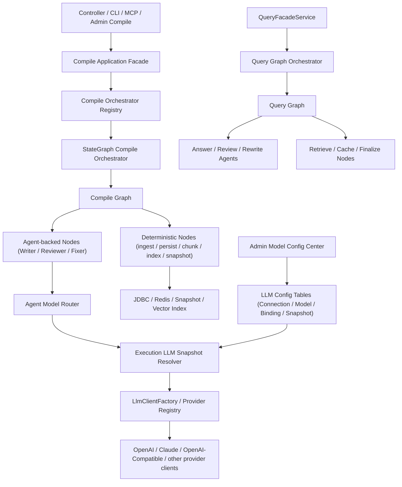
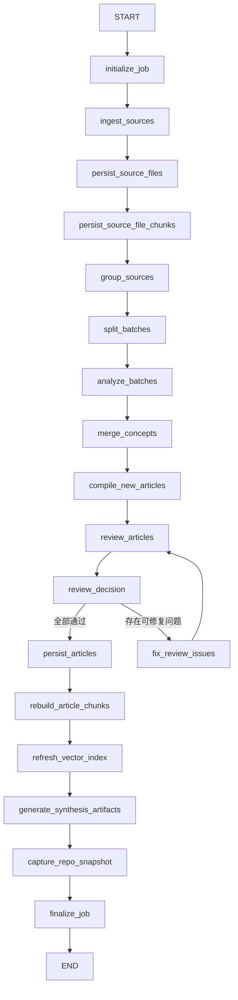
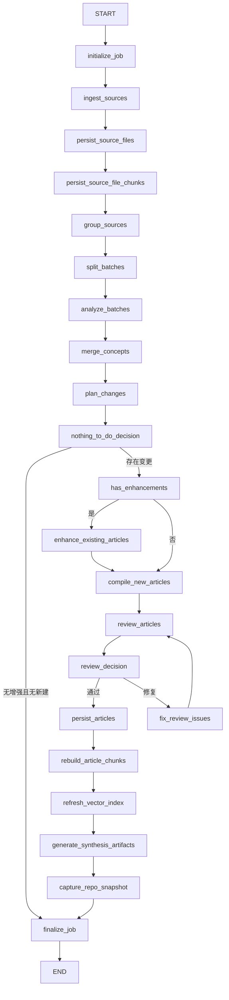
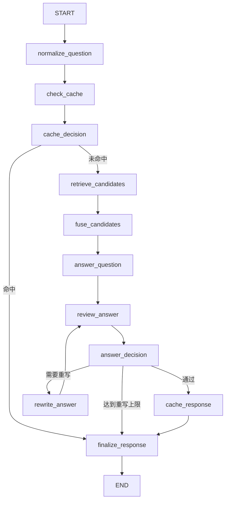

# Spring AI Alibaba Graph 完整接入设计方案

## 0. 实施进度台账

- [x] Phase 0：图能力验证与设计守门
  - 验收：`GraphSmokeTests` 已覆盖 `addConditionalEdges(...)`、`GraphLifecycleListener before/after` 与 `OverAllState` 中等载荷对象集合。
- [x] Phase 1：编译图骨架落地
  - 验收：`CompileGraphState`、`CompileGraphDefinitionFactory`、`CompileWorkingSetStore`、`CompileGraphLifecycleListener + GraphStepLogger` 已落地，`StateGraphCompileOrchestratorTests` 通过。
- [x] Phase 2：文章审查彻底图内化
  - 验收：`review_articles` / `fix_review_issues` 已进入编译图，`CompileArticleNode` 已收缩为 draft 主职责，规则型审查器与 `LocalReviewerGateway` 失败分支已落地。
- [x] Phase 3：增量编译并入统一图骨架
  - 验收：`plan_changes`、`nothing_to_do`、增强/新建分支已并入统一编译图，`StateGraphCompileOrchestratorTests` 已覆盖 full + incremental compile。
- [x] Phase 4：入口层统一
  - 验收：HTTP / CLI / MCP / Admin 已统一走编排门面或作业服务，`CompileControllerTests`、`AdminCompileJobControllerTests`、`LatticeMcpToolsB7Test` 通过。
- [x] Phase 5：问答侧图编排接入
  - 验收：`QueryFacadeService` 已切换为 graph 门面，新增 Query Graph 状态、工作集、条件边、重写分支与生命周期日志，`QueryGraphOrchestratorTests`、`QueryFacadeService*Tests`、`QueryControllerTests` 通过。
- [x] Phase 6：移除遗留 service 主流程
  - 验收：MCP 同步编译入口已强制走 `CompileApplicationFacade`，后台 UI 已移除 `service` 选项，`CompilePipelineService/IncrementalCompileService` 总控方法已收缩为同包可见，跨包测试基线准备已统一改走门面，`mvn -q -s .codex/maven-settings.xml -Dmaven.repo.local=/Users/sxie/maven/repository test` 通过。
- [x] Phase 7：Graph + Multi-Agent 混合架构升级
  - 验收：已完成编译侧 `WriterAgent / ReviewerAgent / FixerAgent` 契约、`AgentModelRouter`、失败子集回环、`accepted/reviewPartition` 工作集、`stepExecutionId + fail-open` 步骤日志协议，以及 Query Graph `queryId` 主键收口。
  - 验收：`StateGraphCompileOrchestratorTests` 已覆盖 `compile_job_steps.step_execution_id / agent_role / model_route`；新增 `ReviewDecisionPolicyTests`、`GraphStepLoggerTests`、`CompileGraphLifecycleListenerTests`、`QueryGraphStateMapperTests`。
  - 验收：`mvn -q -s .codex/maven-settings.xml -Dmaven.repo.local=/Users/sxie/maven/repository -Dtest=CompilerAgentAdaptersTests,LlmGatewayTests,LlmGatewayMaxInputCharsTests,CompileArticleReviewFlowTests,ReviewDecisionPolicyTests,GraphStepLoggerTests,CompileGraphLifecycleListenerTests,StateGraphCompileOrchestratorTests,QueryGraphStateMapperTests,QueryGraphOrchestratorTests,QueryFacadeServiceCacheTests,QueryFacadeServiceVectorTests,QueryControllerTests test` 通过。
- [x] Phase 8 前置收口
  - 验收：`StateGraphCompileOrchestrator` 双重初始化已完全收缩到 `jobId / sourceDir / compileMode`；`CompileGraphDefinitionFactory` 节点实现已拆至 `compiler/graph/node/`；`CompilePipelineService` 已委托至 `SourceIngestSupport / ArticleCompileSupport / ArticlePersistSupport`；`CompileArticleNode.compile(...)` 已标注 `@Deprecated`；`CompileOrchestrationModes` 死代码已清理。
  - 验收：`mvn -q -s .codex/maven-settings.xml -Dmaven.repo.local=/Users/sxie/maven/repository test` 通过；`mvn -q -s .codex/maven-settings.xml -Dmaven.repo.local=/Users/sxie/maven/repository -Dtest=StateGraphCompileOrchestratorTests,CompileControllerTests,AdminCompileJobControllerTests,LatticeMcpToolsB7Test test` 通过。
- [x] Phase 8：模型池与 Agent 绑定配置中心
  - 验收：已完成 compile 侧 `llm_provider_connections / llm_model_profiles / agent_model_bindings / execution_llm_snapshots` 四表、后台连接/模型/绑定配置页、运行时快照冻结、compile 调用链按快照选路、`apiKey` AES 加密落库，以及缓存键纳入 `routeLabel + bindingId + snapshotVersion`。
  - 验收：`GeneratedKeyHolder` 主键提取已统一兼容 PostgreSQL 返回整行 key map；`AgentModelRouter` 已统一 `reviewEnabled=false -> rule-based`；无 scope 的 Reviewer/Fixer 调用已回退旧签名，兼容过渡期测试替身与旧链路。
  - 验收：`mvn -q -s .codex/maven-settings.xml -Dmaven.repo.local=/Users/sxie/maven/repository -Dtest=CompileArticleReviewFlowTests,CompilerAgentAdaptersTests,AgentModelRouterSnapshotTests,ExecutionLlmSnapshotServiceTests,LlmConfigCenterIntegrationTests,AdminPageControllerTests test` 通过。
  - 验收：`mvn -q -s .codex/maven-settings.xml -Dmaven.repo.local=/Users/sxie/maven/repository test` 通过。
  - 边界：本轮仅覆盖 `compile` 侧模型池与 Agent 绑定配置中心；`query` 侧快照冻结与路由切换明确 deferred，后续单独推进。
- [ ] Phase 8 收尾：迁移压平为单基线 V1 并完成清库回归验证
  - 进行中：源码迁移已压平为仅保留 `V1__baseline_schema.sql`，实际使用数据库 `vector_db.ai-rag-knowledge` 已清库重建；待执行 `mvn clean test` 清掉旧 `target/classes` 后验证 classpath 不再残留 `V2/V3`。

## 1. 文档目标

本文档用于定义 `Lattice-java` 项目中 `Spring AI Alibaba Graph` 的完整接入方案，目标不是“补一个可选编排器”，而是把 Graph 升级为编译与审查链路的主执行骨架。

在 Phase 0 到 Phase 6 已完成 Graph 主骨架落地后，本文档同时作为下一阶段“Graph + Multi-Agent 混合架构”升级的唯一设计台账，约束后续角色拆分、模型路由与验收边界。

本文档面向：

- 当前项目维护者
- 后续参与实现或审查的 AI / 人类开发者
- 需要判断本次重构是否“真正用上 Spring AI Alibaba Graph”的评审者

本文档约束前提：

- 本项目按“从 0 到 1 重构”处理，不需要兼容旧数据、旧迁移策略、旧运行方式
- 可以接受对当前编译主链路、增量链路、审查链路做结构性重构
- 可以接受把 `state_graph` 升级为默认编排模式

配套技术验证记录见：

- [Spring AI Alibaba Graph 技术验证记录.md](/Users/sxie/xbk/Lattice-java/.codex/Spring AI Alibaba Graph 技术验证记录.md)

---

## 2. 现状评估

### 2.1 已引入但未真正用满 Graph

项目已经引入 `spring-ai-alibaba-graph-core` 依赖，见 [pom.xml](/Users/sxie/xbk/Lattice-java/pom.xml#L76)。

但当前 Graph 使用方式仍然是“单节点包装”：

- [StateGraphCompileOrchestrator.java](/Users/sxie/xbk/Lattice-java/src/main/java/com/xbk/lattice/compiler/service/StateGraphCompileOrchestrator.java#L57)
- 图中只有一个 `"compile"` 节点
- 节点内部仍然直接调用 `compilePipelineService.compile(...)` 或 `incrementalCompile(...)`

这意味着 Graph 目前只承担了“入口包装器”角色，并未承担真正的业务编排职责。

### 2.2 默认模式仍然不是 Graph

当前 `CompileOrchestrationModes.normalize(...)` 对空值或非法值会回退到 `service`，见 [CompileOrchestrationModes.java](/Users/sxie/xbk/Lattice-java/src/main/java/com/xbk/lattice/compiler/service/CompileOrchestrationModes.java#L27)。

数据库基线中 `compile_jobs.orchestration_mode` 的默认值也是 `service`，见 [V1__baseline_schema.sql](/Users/sxie/xbk/Lattice-java/src/main/resources/db/migration/V1__baseline_schema.sql#L273)。

这会直接导致 Graph 只是“可选模式”，而不是默认主路径。

### 2.3 编译主链路仍是大一统 Service

当前全量编译核心流程集中在 [CompilePipelineService.java](/Users/sxie/xbk/Lattice-java/src/main/java/com/xbk/lattice/compiler/service/CompilePipelineService.java#L220)：

1. `ingest`
2. `persistSourceFiles`
3. `persistSourceFileChunks`
4. `group`
5. `batchSplit`
6. `analyze`
7. `crossGroupMerge`
8. `compilationWalStore.stage`
9. `commitPendingConcepts`
10. `generateAll`
11. `captureRepoSnapshot`

这条链路目前没有节点级可观测性、条件边建模、分阶段重试能力。

### 2.4 增量编译仍是 Service 串联

当前增量编译核心逻辑集中在 [IncrementalCompileService.java](/Users/sxie/xbk/Lattice-java/src/main/java/com/xbk/lattice/compiler/service/IncrementalCompileService.java#L222)。

当前流程大致为：

1. ingest / persist
2. analyze merged concepts
3. `planIncrementalChanges`
4. enhance existing articles
5. create new articles
6. refresh synthesis artifacts
7. capture snapshot

它与全量链路共享大量阶段，但没有被统一到同一张图里。

### 2.5 审查逻辑被埋在文章编译节点内部

[CompileArticleNode.java](/Users/sxie/xbk/Lattice-java/src/main/java/com/xbk/lattice/compiler/service/CompileArticleNode.java#L116) 当前同时承担：

- 文章生成
- 文章审查
- 自动修复
- `review_status` 决策

这会导致以下问题：

- Graph 无法在“生成后、审查前、修复后、落库前”做显式分支
- 审查结果无法独立持久化或统计
- 自动修复无法作为可观察、可替换、可关闭的节点存在

### 2.6 问答侧审查也没有图编排

[QueryFacadeService.java](/Users/sxie/xbk/Lattice-java/src/main/java/com/xbk/lattice/query/service/QueryFacadeService.java#L112) 当前是线性串联：

1. 多路检索
2. RRF 融合
3. 答案生成
4. `ReviewerAgent.review(...)`
5. 缓存

[ReviewerAgent.java](/Users/sxie/xbk/Lattice-java/src/main/java/com/xbk/lattice/query/service/ReviewerAgent.java#L42) 仍是单次调用，且默认实现 [LocalReviewerGateway.java](/Users/sxie/xbk/Lattice-java/src/main/java/com/xbk/lattice/query/service/LocalReviewerGateway.java#L24) 基本恒定返回 pass。

因此，当前“编译 + 审查”并没有真正体现 Spring AI Alibaba Graph 的编排优势。

### 2.7 并非所有编译入口都走编排器注册表

后台作业入口已经可以通过 [CompileOrchestratorRegistry.java](/Users/sxie/xbk/Lattice-java/src/main/java/com/xbk/lattice/compiler/service/CompileOrchestratorRegistry.java#L46) 路由不同模式。

但以下入口仍然直连 `CompilePipelineService`：

- [CompileController.java](/Users/sxie/xbk/Lattice-java/src/main/java/com/xbk/lattice/api/compiler/CompileController.java#L43)
- [CompileCommand.java](/Users/sxie/xbk/Lattice-java/src/main/java/com/xbk/lattice/cli/command/CompileCommand.java#L28)
- [LatticeMcpTools.java](/Users/sxie/xbk/Lattice-java/src/main/java/com/xbk/lattice/mcp/LatticeMcpTools.java#L1156)

只要这些入口还绕过编排器，Graph 就不可能成为“唯一主骨架”。

### 2.8 当前 Graph API 能力已完成本地初步核验

针对“条件边是否可用、生命周期监听是否可挂、状态是否能承载复杂对象”这三个阻塞问题，已在本机依赖上完成初步核验。

本地依赖核验结论：

- `spring-ai-alibaba-graph-core:1.1.2.0` 的 `StateGraph` 确实提供：
  - `addConditionalEdges(...)`
  - `addParallelConditionalEdges(...)`
- `CompileConfig.Builder` 确实提供：
  - `withLifecycleListener(GraphLifecycleListener listener)`
- `OverAllState` 是 `Map<String, Object>` 语义容器，支持存取复杂对象

本地最小 Demo 已验证：

- 条件边可按布尔状态在 `nothing_to_do / compile_new_articles` 两个分支间切换
- `GraphLifecycleListener` 的 `before / after` 可被稳定触发
- `OverAllState` 可以承载 `List<DemoConcept>` 这类对象集合并跨节点读取

但需要强调：

- 这只能证明“API 能力存在且基础行为可用”
- 不能据此推出“适合长期承载全量大对象”
- 因此正式设计仍采用“轻状态 + 外部工作集存储”方案，而不是把全部大对象直接塞进图状态

建议在正式实现前保留一个可执行的仓内验证用例，作为 Phase 0 的准入门槛。

---

## 3. 重构目标

### 3.1 核心目标

1. 把 `Spring AI Alibaba Graph` 升级为编译与审查链路的默认主编排框架
2. 把全量编译与增量编译统一到共享图骨架中
3. 让 Graph 统一负责状态、边、条件分支、重试、回退、持久化时机与观测
4. 把高认知步骤升级为固定角色 Agent，优先从编译侧 `WriterAgent / ReviewerAgent / FixerAgent` 试点
5. 把文章生成、文章审查、自动修复、持久化、切块、向量索引、快照等阶段显式建模为节点
6. 让所有编译入口都经由统一编排层执行
7. 让问答侧答案生成与审查也具备 Graph 管理下的角色化升级空间
8. 为角色路由切换、节点级观测、失败定位、重试恢复与后续扩展留出结构空间

### 3.2 业务效果目标

1. 编译链路可清晰回答“卡在哪一步”
2. 审查链路可清晰回答“是生成失败、审查失败、修复失败还是落库失败”
3. 增量编译不再是平行的第二套大 service，而是共享主图骨架的分支流
4. 当某个模型或供应商不可用时，可按角色切换路由，而不必推翻图结构
5. 后续接多模型、多审查轮次、人工审核分流时无需再推翻结构

### 3.3 非目标

1. 本轮不追求把所有检索子系统都 graph 化到极致
2. 本轮不引入自由自治式的 Agent 社会，也不让 Agent 脱离 Graph 自主接管全流程
3. 本轮不做“对所有用户开放的裸模型 / 裸 provider / 裸密钥”配置台，但允许面向 Admin 提供受控的模型池与 Agent 绑定配置中心
4. 本轮不追求兼容旧数据或旧迁移历史
5. 本轮不以最小改动为优先级，而以结构正确为优先级

---

## 4. 设计原则

### 4.0 先验证框架能力，再铺开大图

在进入正式编码前，必须先完成仓内可执行 Demo 或测试，验证以下三点：

1. `addConditionalEdges(...)` 在当前依赖版本可正常工作
2. `GraphLifecycleListener` 能稳定拿到 `before / after / onError`
3. `OverAllState` 在放入中等体量对象集合时不会出现序列化或合并异常

若上述任一项失败，则本方案中的条件边与统一监听设计需要立即回退重评，而不能带着假设继续实现。

### 4.1 Graph 作为 Case 层主骨架

按 DDD / 六边形架构理解：

- Trigger 层：Controller / CLI / MCP
- Case 层：Graph Orchestrator
- Domain 层：各个编译、审查、修复、索引、合成服务与角色 Agent
- Infrastructure 层：JDBC / Redis / LLM Client / Repo Snapshot / Vector Store

也就是说，Graph 应当位于 Case 层，负责编排，而不是只是简单包装 Domain Service。

进一步明确：

- Graph 负责状态、边、条件分支、循环计数、重试、回退、步骤日志与执行时机
- Agent 负责规划、生成、审查、修复这类高认知动作
- Agent 不能反向决定全流程怎么走，分支权必须继续掌握在 Graph 手里

### 4.2 生成、审查、修复应 Agent 化，落库与索引保持节点化

同一个节点不应同时承担：

- 生成内容
- 审查内容
- 自动修复
- 决定最终状态
- 落库

这些动作必须拆开，否则 Graph 只会退化成“巨大节点的顺序调用器”。

混合架构下建议明确分层：

- `compile_new_articles`、`enhance_existing_articles` 优先由 `WriterAgent` 承担
- `review_articles` 优先由 `ReviewerAgent` 承担
- `fix_review_issues` 优先由 `FixerAgent` 承担
- `ingest`、`persist`、`chunk rebuild`、`vector index`、`repo snapshot` 仍保持普通节点 / service，不做 Agent 化

原则上只 Agent 化“需要推理和生成”的步骤，不 Agent 化“确定性副作用步骤”。

### 4.3 全量与增量统一骨架

全量和增量共享以下前半段步骤：

- ingest
- persist source files
- persist source file chunks
- group
- split
- analyze
- merge

差异主要在“merge 后如何处理文章”：

- 全量：直接面向全部 concept 新建文章
- 增量：先做 plan，再分别增强已有文章和创建新文章

因此应该使用统一图骨架加条件分支，而不是维护两套主流程。

### 4.4 所有入口只认编排层

无论是：

- HTTP API
- Admin 后台作业
- CLI
- MCP Tool

都必须只通过统一编排层触发编译，禁止再直连 `CompilePipelineService`。

### 4.5 节点必须可观测

每个关键节点都必须至少能输出：

- jobId
- stepName
- agentRole
- modelRoute
- startedAt
- finishedAt
- status
- summary
- errorMessage

否则 Graph 的价值会因为缺乏观察面而被抵消。

### 4.6 轻状态优先，重载荷外置

Graph 状态只承载：

- 路由判断所需的最小字段
- 当前步骤的引用键
- 计数器、布尔标记、摘要和错误信息
- 角色路由名或模型标签

以下大对象不直接长期驻留在 `OverAllState`：

- 全量 `RawSource`
- 全量 `SourceBatch`
- 全量 `AnalyzedConcept`
- 全量 `MergedConcept`
- 完整 Markdown `ArticleRecord`

这些对象统一放入 `CompileWorkingSetStore / QueryWorkingSetStore` 一类外部工作集存储，Graph 状态中只保留引用键和数量摘要。

补充约束：

- Graph 状态里允许存放 `compileRoute / reviewRoute / fixRoute` 这类轻量路由名
- Graph 状态里不允许放 provider 密钥、endpoint、完整 prompt 模板正文

### 4.7 写库节点独立事务 + 幂等写

本方案不假设 Spring AI Alibaba Graph 提供跨节点事务传播能力。

正式实现采用：

- 每个写库节点独立事务
- 所有写操作必须幂等
- 节点失败后通过补偿或重试恢复，而不是依赖跨节点大事务回滚

这是一条显式设计决策，不允许由实现者自由发挥。

### 4.8 配置中心与运行时快照分离

在引入“模型池 + Agent 绑定”后，必须明确区分：

- 可被 Admin 修改的在线配置
- 已启动任务正在使用的运行时快照

强制规则如下：

- 后台配置中心负责维护 `连接配置 / 模型配置 / Agent 绑定`
- `initialize_job / initialize_query` 必须把当前命中的绑定解析为不可变运行快照
- Graph 状态中只保存 `llmBindingSnapshotRef` 与轻量路由标签，不保存 `apiKey / baseUrl / modelName` 明细
- 后台修改配置默认只影响新任务，不影响已启动任务
- `apiKey` 必须加密存储、页面脱敏展示、日志禁止明文输出

这也是后续支持“Claude 不可用时把 Reviewer/Fixer 切到其他模型”而不让运行中任务漂移的前提。

---

## 5. 目标架构

## 5.1 总体结构



### 5.2 关键角色定义

| 角色 | 定位 | 说明 |
|---|---|---|
| CompileApplicationFacade | 编译统一门面 | 对外暴露单一调用入口，负责参数校验、默认 mode 选择、异常转换、同步/异步调用收口 |
| CompileOrchestratorRegistry | 编排器路由 | 只负责根据 mode 路由到具体 Orchestrator 实例，不承担参数校验与异常转换 |
| StateGraphCompileOrchestrator | 图编排执行器 | 负责构建、编译、执行全量/增量图，并维护 Agent 节点的图级控制 |
| CompileGraphDefinitionFactory | 图定义工厂 | 负责声明节点、边、条件边 |
| CompileGraphState | 图状态对象 | 只承载轻量状态、路由字段和工作集引用 |
| LlmConfigAdminService | 模型配置中心 | 维护连接配置、模型配置、Agent 绑定、脱敏展示与操作审计 |
| AgentModelRouter | 角色路由器 | 根据 `scene + agentRole + llmBindingSnapshotRef` 解析当前任务应使用的模型绑定 |
| ExecutionLlmSnapshotService | 运行时模型快照服务 | 在 `job/query` 初始化时冻结角色绑定、模型参数与连接版本 |
| LlmClientFactory | Provider Client 工厂 | 按 provider + connection + modelProfile 动态创建底层 client |
| WriterAgent | 编译写作 Agent | 负责从 concept 或增量计划生成结构化草稿 |
| ReviewerAgent | 审查 Agent | 负责输出结构化审查结论、问题列表与建议动作 |
| FixerAgent | 修复 Agent | 负责根据审查问题修订草稿，返回新的候选结果 |
| Deterministic Node Services | 确定性节点能力 | 只做 ingest、持久化、索引、快照等单阶段副作用动作 |
| QueryGraphOrchestrator | 问答图编排器 | 负责任务检索、生成、审查的图化执行 |
| CompileWorkingSetStore | 编译工作集存储 | 保存跨节点的大对象载荷，Graph 状态只保留 ref |
| CompileGraphLifecycleListener | 图生命周期监听器 | 把框架 `before/after/onError` 回调统一转换为步骤日志 |

---

## 6. 编译域目标设计

## 6.1 统一编译状态模型

建议新增 `CompileGraphState`，作为图内部唯一共享状态模型。

设计决策：

- `CompileGraphState` 只放轻量字段
- 大对象通过 `CompileWorkingSetStore` 外置
- 所有条件边只依赖轻量状态字段判断

建议字段如下：

| 字段 | 类型 | 用途 |
|---|---|---|
| jobId | String | 编译任务唯一标识 |
| sourceDir | Path/String | 输入目录 |
| compileMode | String | `full` / `incremental` |
| orchestrationMode | String | 固定为 `state_graph` |
| rawSourcesRef | String | 已摄入源文件集合引用 |
| groupedSourcesRef | String | 分组结果引用 |
| sourceBatchesRef | String | 分批结果引用 |
| analyzedConceptsRef | String | 分析结果引用 |
| mergedConceptsRef | String | 跨组归并结果引用 |
| incrementalPlanRef | String | 增量规划结果引用 |
| conceptsToEnhanceRef | String | 需增强概念映射引用 |
| conceptsToCreateRef | String | 需创建概念引用 |
| draftArticlesRef | String | 当前待审查或待重审文章集合引用 |
| reviewedArticlesRef | String | 当前轮审查输出 envelope 集合引用 |
| reviewPartitionRef | String | 当前轮审查分区结果引用 |
| acceptedArticlesRef | String | 已通过或允许落库的冻结文章集合引用 |
| needsHumanReviewArticlesRef | String | 最终待人工审查文章集合引用 |
| persistedArticleIds | List<String> | 已落库文章 conceptId 集合 |
| conceptCount | Integer | 当前概念数量摘要 |
| pendingReviewCount | Integer | 当前待审文章数量 |
| acceptedCount | Integer | 已冻结可落库文章数量 |
| needsHumanReviewCount | Integer | 待人工审查文章数量 |
| persistedCount | Integer | 实际落库数 |
| hasEnhancements | boolean | 是否存在增强对象 |
| hasCreates | boolean | 是否存在新建对象 |
| nothingToDo | boolean | 增量场景是否无变更 |
| autoFixEnabled | boolean | 本次运行固化的自动修复开关快照 |
| allowPersistNeedsHumanReview | boolean | 本次运行固化的人审落库开关快照 |
| llmBindingSnapshotRef | String | 本次运行冻结的 Agent 绑定与模型配置快照引用 |
| compileRoute | String | 本次运行固化的编译角色路由 |
| reviewRoute | String | 本次运行固化的审查角色路由 |
| fixRoute | String | 本次运行固化的修复角色路由 |
| fixAttemptCount | Integer | 当前图内修复轮次计数 |
| maxFixRounds | Integer | 最大修复轮次 |
| synthesisRequired | boolean | 是否需要刷新合成产物 |
| snapshotRequired | boolean | 是否需要生成 repo snapshot |
| stepLogFailureMode | String | 步骤日志失败策略：`warn` / `fail` |
| stepSummaries | List<String> | 节点摘要 |
| errors | List<String> | 过程错误信息 |

说明：

- Graph 内部不要依赖松散字符串键拼来拼去，建议引入强类型状态对象
- 若当前 Graph API 只接受 Map，可在编排层维护 `CompileGraphState <-> Map<String, Object>` 的适配器
- `CompileWorkingSetStore` 推荐以 `jobId + payloadType` 作为键组织数据，支持 TTL 或任务完成后清理
- `persistedArticleIds` 放在状态中是合理的，因为它是轻量主键集合，不是全文内容
- provider、`baseUrl`、`apiKey`、`modelName` 等运行细节不直接进入 `CompileGraphState`，统一通过 `llmBindingSnapshotRef` 关联

### 6.1.1 状态字段 / 配置快照 / 执行元信息分类

为避免实现时把“路由条件”“配置快照”“步骤日志元信息”混写到一起，必须按下表分类：

| 类别 | 典型字段 | 存放位置 | 规则 |
|---|---|---|---|
| 状态字段 | `jobId`、各类 `*Ref`、`pendingReviewCount`、`acceptedCount`、`nothingToDo`、`fixAttemptCount` | `CompileGraphState` | 可参与条件边判断，可跨节点持续演进 |
| 配置快照 | `autoFixEnabled`、`allowPersistNeedsHumanReview`、`maxFixRounds`、`llmBindingSnapshotRef`、`compileRoute`、`reviewRoute`、`fixRoute`、`stepLogFailureMode` | `CompileGraphState` | 仅在 `initialize_job` 时从外部配置读取并固化，图执行期间不可漂移 |
| 执行元信息 | `stepExecutionId`、`sequenceNo`、`agentRole`、`modelRoute`、`promptVersion`、`durationMs` | `compile_job_steps`、步骤上下文或工作集 | 默认不作为图路由输入，不允许代替强类型状态字段 |

补充约束：

- `autoFixEnabled` 这类影响分支的参数，必须先固化进 `CompileGraphState`，禁止节点在运行中临时回读 Spring 配置再决定路由。
- `agentRole / modelRoute` 属于执行元信息，默认写入步骤日志，不作为主状态字段长期持有。
- 角色路由名如 `compileRoute / reviewRoute / fixRoute` 属于配置快照，和实际某次命中的 `modelRoute` 不是同一层概念。
- `llmBindingSnapshotRef` 是图内唯一允许持有的 LLM 运行时引用键，真正的 provider/模型参数明细必须外置到快照表或快照仓库。

### 6.1.2 `CompileGraphStateMapper` 与 key 常量契约

这是 Phase 1 的必实现组件，目的是防止各节点直接面向 `OverAllState` 用字符串 key 读写。

建议最小接口：

```java
public interface CompileGraphStateMapper {

    CompileGraphState fromMap(Map<String, Object> state);

    Map<String, Object> toMap(CompileGraphState state);

    Map<String, Object> toDeltaMap(CompileGraphState state);
}
```

约束说明：

- `fromMap(...)`
  - 负责把 `OverAllState.data()` 或普通 `Map<String, Object>` 转换为强类型 `CompileGraphState`
- `toMap(...)`
  - 负责把完整 `CompileGraphState` 转成可注入 Graph 的 Map
- `toDeltaMap(...)`
  - 负责只输出当前节点应写回的增量字段，避免节点把整份状态全量覆盖回去

同时必须新增统一 key 常量定义，禁止在节点内手写裸字符串。

建议形式二选一：

- `CompileGraphStateKeys` 常量类
- 或 `CompileGraphStateKey` 枚举

建议至少覆盖这些 key：

- `JOB_ID`
- `SOURCE_DIR`
- `COMPILE_MODE`
- `ORCHESTRATION_MODE`
- `RAW_SOURCES_REF`
- `GROUPED_SOURCES_REF`
- `SOURCE_BATCHES_REF`
- `ANALYZED_CONCEPTS_REF`
- `MERGED_CONCEPTS_REF`
- `INCREMENTAL_PLAN_REF`
- `CONCEPTS_TO_ENHANCE_REF`
- `CONCEPTS_TO_CREATE_REF`
- `DRAFT_ARTICLES_REF`
- `REVIEWED_ARTICLES_REF`
- `REVIEW_PARTITION_REF`
- `ACCEPTED_ARTICLES_REF`
- `NEEDS_HUMAN_REVIEW_ARTICLES_REF`
- `PERSISTED_ARTICLE_IDS`
- `CONCEPT_COUNT`
- `PENDING_REVIEW_COUNT`
- `ACCEPTED_COUNT`
- `NEEDS_HUMAN_REVIEW_COUNT`
- `PERSISTED_COUNT`
- `HAS_ENHANCEMENTS`
- `HAS_CREATES`
- `NOTHING_TO_DO`
- `AUTO_FIX_ENABLED`
- `ALLOW_PERSIST_NEEDS_HUMAN_REVIEW`
- `COMPILE_ROUTE`
- `REVIEW_ROUTE`
- `FIX_ROUTE`
- `FIX_ATTEMPT_COUNT`
- `MAX_FIX_ROUNDS`
- `SYNTHESIS_REQUIRED`
- `SNAPSHOT_REQUIRED`
- `STEP_LOG_FAILURE_MODE`
- `STEP_SUMMARIES`
- `ERRORS`

实现要求：

- Graph Node 内部先通过 `CompileGraphStateMapper.fromMap(...)` 读取状态
- 节点输出统一通过 `CompileGraphStateMapper.toDeltaMap(...)` 返回
- 不允许在节点实现中出现未登记的状态 key 字符串常量

### 6.1.3 循环退出计数器与读取者

这是阻塞级设计约束，不能留给实现者自由发挥。

编译图：

- `fixAttemptCount` 放在 `CompileGraphState`
- `maxFixRounds` 放在 `CompileGraphState`
- `autoFixEnabled` 放在 `CompileGraphState` 的配置快照区
- 这两个字段只允许由以下两类组件读写：
  - `FixReviewIssuesNode`
    - 进入修复节点后把 `fixAttemptCount + 1`
  - `ReviewDecisionPolicy`
    - 读取 `fixAttemptCount / maxFixRounds / autoFixEnabled / reviewResult`
    - 决定走 `fix_review_issues` 还是 `persist_articles`

问答图：

- `rewriteAttemptCount` 放在 `QueryGraphState`
- `maxRewriteRounds` 放在 `QueryGraphState`
- 这两个字段只允许由以下两类组件读写：
  - `RewriteAnswerNode`
    - 每次重写后将 `rewriteAttemptCount + 1`
  - `QueryReviewDecisionPolicy`
    - 读取 `rewriteAttemptCount / maxRewriteRounds / reviewResult`
    - 决定走 `rewrite_answer`、`cache_response` 或 `finalize_response`

明确禁止：

- 在节点内部用局部变量记录循环次数
- 在条件边 lambda 中临时推断次数而不落状态
- 由 Controller/Facade 持有循环计数器

## 6.2 节点拆分方案

建议编译图最少拆成以下节点：

| 节点名 | 职责 | 输入 | 输出 |
|---|---|---|---|
| initialize_job | 初始化 jobId / mode / state | sourceDir, mode | 初始化状态 |
| ingest_sources | 读取输入目录 | sourceDir | rawSources |
| persist_source_files | 落盘源文件记录 | rawSources | source file rows |
| persist_source_file_chunks | 落盘源文件 chunks | rawSources | source chunks |
| group_sources | 源文件分组 | rawSources | groupedSources |
| split_batches | 组内切批 | groupedSources | sourceBatches |
| analyze_batches | LLM/规则分析批次 | sourceBatches | analyzedConcepts |
| merge_concepts | 概念归并 | analyzedConcepts | mergedConcepts |
| plan_changes | 仅增量时规划增强/新建 | mergedConcepts | incrementalPlan |
| enhance_existing_articles | 仅增量，调用 `WriterAgent` 增强旧文章 | incrementalPlan | draftArticles |
| compile_new_articles | 调用 `WriterAgent` 生成新文章草稿 | mergedConcepts / conceptsToCreate | draftArticles |
| review_articles | 调用 `ReviewerAgent` 做文章审查 | draftArticles | reviewedArticles |
| fix_review_issues | 调用 `FixerAgent` 自动修复 | reviewedArticles | reviewedArticles |
| persist_articles | 正式落库文章 | reviewedArticles | persistedArticles |
| rebuild_article_chunks | 文章切块重建 | persistedArticles | chunk rebuild result |
| refresh_vector_index | 向量索引刷新 | persistedArticles | vector index result |
| generate_synthesis_artifacts | 刷新 index/timeline/tradeoffs/gaps | mergedConcepts / persistedArticles | synthesis result |
| capture_repo_snapshot | 快照落盘 | persistedCount | snapshot result |
| finalize_job | 汇总结果并返回 | state | CompileResult |

## 6.3 节点职责边界

必须遵守以下边界：

- `CompileArticleNode` 或其后续替代适配器只负责调用 `WriterAgent` 把概念编译成文章草稿
- `ArticleReviewerGateway` / `ReviewerAgent` 只负责对文章做审查
- `ReviewFixService` / `FixerAgent` 只负责修复已知问题
- `ArticleJdbcRepository` 相关写入只在 `persist_articles` 节点发生
- `ArticleChunkJdbcRepository` 相关写入只在 `rebuild_article_chunks` 节点发生
- `ArticleVectorIndexService` 只在 `refresh_vector_index` 节点触发
- 所有节点只读写 `CompileGraphState` 的轻量字段与 `CompileWorkingSetStore` 的引用对象
- 路由条件统一由 `CompileGraphConditions / ReviewDecisionPolicy` 计算，不允许散落在各节点实现中
- Agent 不直接写库、不直接切块、不直接刷新向量索引、不直接生成快照

禁止再出现“一个节点里既生成又审查又修复又落库”的大而全逻辑。

## 6.4 编译侧 Agent 契约建议

下一阶段建议先为编译域定义三个固定角色 Port，而不是直接把现有 service 命名改成 Agent 就结束。

建议最小契约如下：

| Port | 输入 | 输出 | 约束 |
|---|---|---|---|
| `WriterAgent` | `WriterTask` | `WriterResult` | 输出必须是结构化草稿集合，不直接写库 |
| `ReviewerAgent` | `ReviewTask` | `ReviewResult` | 输出必须包含 pass/fail、问题列表、建议动作 |
| `FixerAgent` | `FixTask` | `FixResult` | 输出必须包含修订后的草稿与修复摘要 |

契约约束：

- Graph 节点只依赖 Port，不直接依赖具体 provider SDK
- Agent 输出必须是结构化对象，禁止只返回“自由文本 + 节点内再猜”
- `WriterTask / ReviewTask / FixTask` 中允许携带角色路由名，但不携带密钥
- Agent 执行元信息至少回填 `agentRole / modelRoute / promptVersion / durationMs`
- Graph 条件边只消费结构化结果，不消费 Agent 的自由文本推断

---

## 7. 全量编译图设计

## 7.1 全量编译流程



## 7.2 全量编译规则

1. `merge_concepts` 后得到的全部概念都默认进入“新文章编译”路径
2. `review_articles` 节点输出必须是“逐文章审查结果 + 当前轮分区结果”，而不是整批布尔值
3. `ReviewDecisionPolicy` 必须把当前轮结果至少分成三类：
   - `accepted`：本轮已通过，可冻结等待最终落库
   - `fixable`：允许进入自动修复
   - `needs_human_review`：不再继续自动修复
4. `accepted` 子集写入 `acceptedArticlesRef` 后冻结，不再跟随失败子集重复回环
5. `fix_review_issues` 只处理 `fixable` 子集，禁止整批回环
6. `CompileGraphState.fixAttemptCount` 在每次进入 `fix_review_issues` 后加一，计数的是“图级修复轮次”，不是单文章次数
7. `ReviewDecisionPolicy` 判断逻辑必须固定为：
   - `fixableCount > 0 && autoFixEnabled && fixAttemptCount < maxFixRounds` -> `fix_review_issues`
   - 其他情况 -> `persist_articles`
8. `persist_articles` 必须合并：
   - 全部 `accepted` 子集
   - 最终修复后转为 `accepted` 的子集
   - 若 `allowPersistNeedsHumanReview=true`，再额外合并 `needs_human_review` 子集
9. 若 `allowPersistNeedsHumanReview=false`，`needs_human_review` 子集不落库，但必须在任务摘要和 Admin 中明确显示 withheld 数量
10. `generate_synthesis_artifacts` 只在 `persistedCount > 0` 时执行
11. `capture_repo_snapshot` 只在存在实际持久化变更时执行
12. `synthesisRequired / snapshotRequired` 的跳过逻辑默认由节点内部读取状态标记决定，不额外拆条件边
13. 因此 flowchart 中 `generate_synthesis_artifacts`、`capture_repo_snapshot` 虽画为顺序边，但允许节点内部 no-op 返回

---

## 8. 增量编译图设计

## 8.1 增量编译流程



## 8.2 增量编译规则

`plan_changes` 节点需要产出两类计划：

- enhancement
- new_article

建议建模为：

- `conceptsToEnhance`
- `conceptsToCreate`
- `nothingToDo`

其中：

- `enhance_existing_articles` 根据文章与概念映射关系生成更新后的 draft
- `compile_new_articles` 只负责新文章的 draft
- 两路产物在 `review_articles` 前统一汇合
- `nothingToDo=true` 时直接跳转 `finalize_job`，禁止空跑后续节点
- 进入 `review_articles` 之后，沿用全量编译相同的“失败子集回环、通过子集冻结、待人审子集单独归档”规则，不再维护增量专用审查策略

实现说明：

- Mermaid 中的 `nothing_to_do_decision`、`has_enhancements` 是路由决策标记，不是实际 Node 类
- Phase 1 实现时不要额外创建这两个空节点
- 正式实现应通过 `StateGraph.addConditionalEdges(...)` 把条件函数挂在 `plan_changes` 之后
- 若实现上更简洁，也可以把“nothingToDo 判断”和“hasEnhancements 判断”合并为同一个条件函数，只要分支语义保持一致

这样可以保证：

- 审查、修复、持久化、切块、索引、合成不再区分全量/增量两套逻辑
- 增量链路只有“文章生成前”部分不同

---

## 9. 审查链路设计

## 9.1 编译侧文章审查图内化

当前 [CompileArticleNode.java](/Users/sxie/xbk/Lattice-java/src/main/java/com/xbk/lattice/compiler/service/CompileArticleNode.java#L123) 内嵌了审查和修复逻辑，这一设计必须拆解。

重构后建议形成“Graph 管理下的三 Agent 试点”职责：

| 组件 | 重构后职责 |
|---|---|
| CompileArticleNode / WriterAgentAdapter | 只负责调用 `WriterAgent` 生成草稿文章 |
| ArticleReviewNode | 调用 `ReviewerAgent.review(...)` 或 `ArticleReviewerGateway.review(...)` 审查 |
| ReviewFixNode | 调用 `FixerAgent.fix(...)` 或 `ReviewFixService.applyFix(...)` 修复 |
| ReviewDecisionPolicy | 根据审查结果做状态决策 |

这里的关键不是“类名换成 Agent”，而是：

- Graph 负责循环、退出条件和状态推进
- Agent 负责生成、审查、修复的认知动作
- 持久化和副作用步骤仍在普通节点内完成

## 9.2 审查输出统一封装

建议新增 `ArticleReviewEnvelope` 或等价对象，至少包含：

| 字段 | 含义 |
|---|---|
| article | 当前文章版本 |
| reviewResult | 原始审查结果 |
| reviewStatus | `pending / passed / needs_human_review` |
| decisionBucket | `accepted / fixable / needs_human_review` |
| fixed | 是否经过修复 |
| reviewAttemptCount | 审查轮次 |
| fixAttemptCount | 修复轮次 |
| reviewerRoute | 本次审查角色路由 |
| fixerRoute | 本次修复角色路由 |

这样可以避免把中间状态散落在多个变量和 YAML frontmatter 字符串替换里。

补充约束：

- `ArticleReviewEnvelope` 是图执行期间的临时中间对象
- 它不会在 Phase 2 单独持久化
- 在 `persist_articles` 节点统一 flatten 为最终 `ArticleRecord`
- 若后续确有“审查历史查询”需求，再单独新增 `article_review_runs` 表，而不是让 `ArticleReviewEnvelope` 直接入库

flatten 规则必须明确为：

1. `ArticleReviewEnvelope.article` 作为内容来源
2. `ArticleReviewEnvelope.reviewStatus` 回填到 `ArticleRecord.reviewStatus`
3. frontmatter 中的 `review_status` 由最终 Markdown 渲染器统一写入
4. `ArticleReviewEnvelope` 在 `persist_articles` 成功后即可从工作集存储释放

建议同步引入 `ReviewPartition` 或等价对象，并通过 `reviewPartitionRef` 存放，最少包含：

| 字段 | 含义 |
|---|---|
| acceptedRef | 本轮已通过子集引用 |
| fixableRef | 本轮待修复子集引用 |
| needsHumanReviewRef | 本轮待人审子集引用 |
| acceptedCount | 本轮已通过数量 |
| fixableCount | 本轮待修复数量 |
| needsHumanReviewCount | 本轮待人审数量 |

约束：

- `reviewedArticlesRef` 表示“当前轮全部 envelope”
- `reviewPartitionRef` 表示“当前轮路由结果”
- `acceptedArticlesRef` 表示“跨轮累积且冻结的最终可落库子集”

## 9.3 审查策略

推荐默认策略：

1. 草稿文章进入审查
2. 审查输出按文章粒度形成 `accepted / fixable / needs_human_review` 三类分区
3. `accepted` 子集立即冻结到 `acceptedArticlesRef`
4. `fixable` 子集进入自动修复
5. 自动修复后仅对修复过的失败子集再次审查
6. 再次失败且超出自动修复上限的文章标记 `needs_human_review`
7. 是否允许带 `needs_human_review` 落库由配置决定

角色约束：

- 编译侧先固定为 `WriterAgent / ReviewerAgent / FixerAgent`
- 不引入开放式“谁都可以接下一棒”的自由协商机制
- 是否更换模型，由角色路由配置决定，而不是让节点自己挑 provider

必须补充的非功能约束：

- 当 `lattice.llm.review-enabled=false` 时，不能继续使用“恒 pass”审查器
- Phase 2 必须引入一个 `RuleBasedArticleReviewerGateway`
- 该实现至少要能识别以下问题中的若干项：
  - 缺失 sources/frontmatter 字段
  - 内容存在 `TODO`、`TBD`、占位符
  - 正文为空或摘要为空
  - sources 与正文引用完全不一致

这样即使在无真实 LLM 审查时，也能真实触发 `fix_review_issues / needs_human_review` 分支，避免图编排流于形式。

对现有 `LocalReviewerGateway` 的处理决策：

- 不再保留“恒定通过”的实现语义
- Phase 2 开始时，`LocalReviewerGateway` 必须二选一：
  - 直接替换为 `RuleBasedArticleReviewerGateway`
  - 或保留类名，但内部实现改为规则审查

禁止继续存在“只要 prompt 非空就 pass”的默认实现，因为这会让审查分支失去验收价值。

## 9.4 Frontmatter 更新策略

不建议继续使用“先生成 Markdown 再正则替换 `review_status`”作为长期主方案。

建议改为：

1. 文章在内存中保持结构化元数据对象
2. 审查结束后统一渲染最终 Markdown
3. frontmatter 的 `review_status` 由最终渲染阶段写入

这样更稳，也更适合后续加入：

- `reviewed_at`
- `review_model`
- `review_issue_count`

---

## 10. 问答侧 Graph 设计

## 10.1 目标

问答侧不是本轮唯一重点，但如果要说“完整用上 Graph”，问答审查链路也应 graph 化，并为后续多 Agent 化保留固定角色位置。

## 10.2 建议图骨架



## 10.3 问答图节点建议

| 节点名 | 职责 |
|---|---|
| normalize_question | 规范化查询 |
| check_cache | 查询缓存 |
| retrieve_candidates | FTS / refkey / source / contribution / vector 检索 |
| fuse_candidates | RRF 融合 |
| answer_question | 调用 `AnswerAgent` 生成答案 |
| review_answer | 调用 `AnswerReviewerAgent` 审查答案 |
| rewrite_answer | 调用 `RewriteAgent` 基于审查意见重写 |
| cache_response | 写缓存 |
| finalize_response | 返回 QueryResponse |

建议同步定义 `QueryGraphState` 轻量字段：

| 字段 | 类型 | 用途 |
|---|---|---|
| queryId | String | 问答图统一主键，用于工作集、日志、缓存与收口关联 |
| question | String | 原始问题 |
| normalizedQuestion | String | 规范化问题 |
| cacheHit | boolean | 是否命中缓存 |
| fusedHitsRef | String | 融合结果引用 |
| draftAnswerRef | String | 草稿答案引用 |
| reviewResultRef | String | 审查结果引用 |
| llmBindingSnapshotRef | String | 本次运行冻结的问答侧 Agent 绑定与模型配置快照引用 |
| answerRoute | String | 本次运行固化的问答生成角色路由 |
| reviewRoute | String | 本次运行固化的问答审查角色路由 |
| rewriteRoute | String | 本次运行固化的问答重写角色路由 |
| rewriteAttemptCount | Integer | 重写轮次 |
| maxRewriteRounds | Integer | 最大重写轮次 |
| reviewStatus | String | 当前审查状态 |

问答图中的 `answer_decision` 判断逻辑必须固定为：

- 审查通过 -> `cache_response`
- 审查失败且 `rewriteAttemptCount < maxRewriteRounds` -> `rewrite_answer`
- 审查失败且 `rewriteAttemptCount >= maxRewriteRounds` -> `finalize_response`

禁止把退出条件留给具体节点的 if/else 自由发挥。

补充约束：

- `queryId` 在 `normalize_question` 之前就必须由 orchestrator 注入，禁止由后续节点临时生成多个不同标识。
- `QueryWorkingSetStore`、问答日志、缓存收口都统一以 `queryId` 关联，不再各自发明局部 request key。

问答侧同样遵守混合架构边界：

- 检索、缓存、收口仍由确定性节点负责
- 生成、审查、重写才考虑 Agent 化
- Graph 继续掌握缓存命中、重写上限、最终收口决策

## 10.4 QueryFacadeService 的新定位

[QueryFacadeService.java](/Users/sxie/xbk/Lattice-java/src/main/java/com/xbk/lattice/query/service/QueryFacadeService.java#L112) 不再直接串联所有步骤，而是改成：

- 参数规范化
- graph 调用
- 返回结果封装

也就是说，和编译域一样，`QueryFacadeService` 应当退居“门面”，而不是“总控流程 service”。

---

## 11. 入口层改造方案

## 11.1 统一编译入口

当前以下入口仍绕过编排层：

- [CompileController.java](/Users/sxie/xbk/Lattice-java/src/main/java/com/xbk/lattice/api/compiler/CompileController.java#L43)
- [CompileCommand.java](/Users/sxie/xbk/Lattice-java/src/main/java/com/xbk/lattice/cli/command/CompileCommand.java#L28)
- [LatticeMcpTools.java](/Users/sxie/xbk/Lattice-java/src/main/java/com/xbk/lattice/mcp/LatticeMcpTools.java#L1156)

必须改为统一走：

- `CompileApplicationFacade`
- `CompileOrchestratorRegistry`

建议规则：

1. 所有同步编译入口只调用统一门面
2. 所有异步作业入口只通过 `CompileJobService`
3. `CompilePipelineService` 不再对外暴露“总控能力”，只保留节点级支撑逻辑

职责边界明确化：

- `CompileApplicationFacade`
  - 校验 `sourceDir`
  - 归一化 `orchestrationMode`
  - 处理同步 / 异步入口差异
  - 做 API/CLI/MCP 统一异常转换
- `CompileOrchestratorRegistry`
  - 只负责 `mode -> orchestrator` 路由
  - 不做参数校验
  - 不做异常转换
  - 不处理作业提交语义

可执行边界表：

| 能力 | CompileApplicationFacade | CompileOrchestratorRegistry |
|---|---|---|
| sourceDir 校验 | 负责 | 不负责 |
| 默认 mode 选择 | 负责 | 不负责 |
| mode -> orchestrator 路由 | 不负责 | 负责 |
| 同步/异步调用收口 | 负责 | 不负责 |
| API/CLI/MCP 异常转换 | 负责 | 不负责 |
| 直接执行图编排 | 不负责 | 不负责 |

## 11.2 默认模式切换

建议直接调整为：

- `CompileOrchestrationModes.normalize(null)` 返回 `state_graph`
- `compile_jobs.orchestration_mode` 默认值改为 `state_graph`
- Admin 页面选项默认值改为 `state_graph`

补充说明：

- 当前代码已不再保留独立 `service` orchestrator 作为真实执行路径
- 因此文档中凡是“保留 `service` 作为短期回退开关”的说法，都应视为历史阶段描述，不再作为 Phase 8 前提
- 后续实现应继续以 `state_graph` 为唯一正式模式，`CompileOrchestrationModes.normalize(...)` 最终可收缩为纯 `state_graph` 归一化函数

---

## 12. 数据模型与持久化设计

## 12.1 现有表调整

建议直接调整 [compile_jobs](/Users/sxie/xbk/Lattice-java/src/main/resources/db/migration/V1__baseline_schema.sql#L273) 相关定义：

- `orchestration_mode` 默认值改为 `state_graph`
- `status` 语义保留，但细化过程状态由新表承载

## 12.2 新增编译步骤表

建议新增 `compile_job_steps`，用于记录节点级执行状态。

建议字段：

| 字段 | 类型 | 说明 |
|---|---|---|
| id | bigserial / uuid | 主键 |
| job_id | varchar(64) | 所属编译任务 |
| step_execution_id | varchar(64) | 单次步骤执行唯一标识 |
| step_name | varchar(64) | 节点名称 |
| agent_role | varchar(32) | 角色化 Agent 名称，确定性节点可为空 |
| model_route | varchar(128) | 本次步骤命中的模型路由或模型标签 |
| sequence_no | integer | 节点顺序 |
| status | varchar(32) | queued/running/succeeded/failed/skipped |
| summary | text | 节点摘要 |
| input_summary | text | 输入摘要 |
| output_summary | text | 输出摘要 |
| error_message | text | 错误信息 |
| started_at | timestamptz | 开始时间 |
| finished_at | timestamptz | 结束时间 |

用途：

- Admin 页面显示编译卡点
- 后续支持节点级重试
- 为 AI 审查或人类排障提供依据

`step_execution_id / sequence_no` 关联策略明确如下：

- `step_execution_id` 表示“某一次具体节点执行”的稳定关联令牌
- `sequence_no` 表示“本次 job 内步骤执行顺序”，不表示节点注册顺序
- `GraphStepLogger.beforeStep(...)` 必须返回 `StepExecutionHandle(stepExecutionId, sequenceNo)`
- Phase 1 推荐实现为进程内 `ConcurrentHashMap<String, AtomicInteger>`
- 每次 `beforeStep(...)` 调用时对对应 `jobId` 执行 `incrementAndGet()`，其返回值即 `sequence_no`
- `CompileGraphLifecycleListener` 必须在内存中维护“框架本次步骤执行上下文 -> StepExecutionHandle”映射
- 同一个步骤的 `after/fail` 更新必须复用创建该步骤记录时的 `stepExecutionId + sequenceNo`
- 明确禁止用 `jobId + stepName` 作为 after/fail 关联键，因为循环与并行场景下它不唯一
- 即使后续引入并行节点，该策略也仍然成立，因为它记录的是“事件发生顺序 + 执行唯一标识”

## 12.3 模型池与 Agent 绑定配置表

本项目按“全新系统”处理，不需要兼容历史数据库，因此建议直接在基线迁移中引入后台模型配置中心所需表，而不是先把路由写死在 `application.yml` 再二次搬迁。

推荐最少拆为 4 类持久化对象：

### 12.3.1 `llm_provider_connections`

用于存放“怎么连某个 provider”。

建议字段：

| 字段 | 类型 | 说明 |
|---|---|---|
| id | bigint / uuid | 主键 |
| connection_code | varchar(64) | 连接编码，供后台和快照引用 |
| provider_type | varchar(32) | `openai` / `anthropic` / `openai_compatible` 等 |
| base_url | varchar(512) | 目标 endpoint |
| api_key_ciphertext | text | 加密后的 `apiKey` |
| api_key_mask | varchar(128) | 脱敏展示值 |
| enabled | boolean | 是否启用 |
| remarks | varchar(512) | 备注 |
| created_by | varchar(64) | 创建人 |
| updated_by | varchar(64) | 更新人 |
| created_at | timestamptz | 创建时间 |
| updated_at | timestamptz | 更新时间 |

### 12.3.2 `llm_model_profiles`

用于存放“连上以后具体怎么调用哪个模型”。

建议字段：

| 字段 | 类型 | 说明 |
|---|---|---|
| id | bigint / uuid | 主键 |
| model_code | varchar(64) | 模型配置编码 |
| connection_id | bigint / uuid | 关联 `llm_provider_connections` |
| model_name | varchar(128) | 真实模型名称 |
| temperature | numeric(4,2) | 通用采样参数 |
| max_tokens | integer | 最大输出 token |
| timeout_seconds | integer | 超时设置 |
| extra_options_json | jsonb | provider 特有扩展参数 |
| enabled | boolean | 是否启用 |
| created_at | timestamptz | 创建时间 |
| updated_at | timestamptz | 更新时间 |

### 12.3.3 `agent_model_bindings`

用于存放“哪个场景下哪个 Agent 走哪个模型”。

建议字段：

| 字段 | 类型 | 说明 |
|---|---|---|
| id | bigint / uuid | 主键 |
| scene | varchar(32) | `compile` / `query` |
| agent_role | varchar(32) | `writer` / `reviewer` / `fixer` / `answer` / `rewrite` |
| primary_model_profile_id | bigint / uuid | 主模型配置 |
| fallback_model_profile_id | bigint / uuid | 可选备用模型配置 |
| route_label | varchar(128) | 面向日志和状态的稳定路由标签 |
| enabled | boolean | 是否启用 |
| created_at | timestamptz | 创建时间 |
| updated_at | timestamptz | 更新时间 |

设计约束：

- `scene + agent_role` 必须唯一，避免同一角色出现多份“当前生效绑定”
- V1 默认只启用单主模型绑定；`fallback_model_profile_id` 可以预留字段，但不要求第一版就做自动故障切换
- 不建议把“多选多个模型”直接暴露成运行时策略，否则节点如何选择、何时切换、失败如何记账都会失控

V1 语义进一步收口如下：

- `fallback_model_profile_id` 在 V1 只作为数据结构预留，不参与运行时自动切换
- V1 的“Claude 不可用时切到其他模型”指管理员在后台手动修改 `agent_model_bindings`，该变更仅影响新任务
- 若未来引入自动熔断或自动 fallback，必须单独补充故障检测、决策链、日志口径与计费规则，不能直接复用 V1 字段含义

### 12.3.4 `execution_llm_snapshots`

用于冻结“某次 job/query 启动时实际命中的连接 + 模型 + 绑定”。

建议字段：

| 字段 | 类型 | 说明 |
|---|---|---|
| id | bigint / uuid | 主键 |
| scope_type | varchar(32) | `compile_job` / `query_request` |
| scope_id | varchar(64) | `jobId` 或 `queryId` |
| scene | varchar(32) | `compile` / `query` |
| agent_role | varchar(32) | 角色名 |
| binding_id | bigint / uuid | 命中的绑定配置 |
| model_profile_id | bigint / uuid | 命中的模型配置 |
| connection_id | bigint / uuid | 命中的连接配置 |
| route_label | varchar(128) | 任务内稳定路由标签 |
| provider_type | varchar(32) | 快照时命中的 provider 类型 |
| base_url | varchar(512) | 快照时命中的 endpoint |
| model_name | varchar(128) | 快照时命中的模型名 |
| snapshot_version | integer | 同一 `scope_id` 下的快照版本 |
| created_at | timestamptz | 创建时间 |

设计约束：

- 后台配置变更默认只影响新任务；运行中任务继续使用 `execution_llm_snapshots`
- 快照允许复制 `baseUrl / modelName / providerType`，但 `apiKey` 仍优先通过加密连接配置按 `connection_id` 读取，不在普通查询接口明文暴露
- 若未来确有“绝对静态密钥快照”需求，再基于密文字段做版本化增强；V1 不要求把密钥复制多份
- Graph 状态中的 `llmBindingSnapshotRef` 应可稳定关联到一组 `execution_llm_snapshots`

唯一约束建议：

- V1 默认要求 `scope_type + scope_id + scene + agent_role` 唯一，确保同一任务同一角色只存在一条生效快照
- `snapshot_version` 在 V1 可固定为 `1`，主要为后续增强预留
- 若未来确需支持同一 `scope_id` 下的多版本快照，必须把 `llmBindingSnapshotRef` 明确升级为可定位 `snapshot_version` 的稳定引用，不能依赖“查最新一条”这种隐式规则

### 12.3.5 安全与审计要求

- `apiKey` 必须加密落库，且默认只支持“覆盖更新”，不支持后台明文回显
- Admin API 返回连接配置时只能返回 `apiKeyMask`
- 任何连接新增、修改、停用、绑定切换都应记录操作人和时间
- 日志、步骤摘要、异常信息中禁止打印明文 `apiKey`

## 12.4 工作集外置存储

为避免 `OverAllState` 持续膨胀，建议新增 `CompileWorkingSetStore`。

职责：

- 保存跨节点的大对象载荷
- 按 `jobId + payloadType` 组织引用
- 支持 TTL 或任务完成后清理
- 为节点失败后的重试与诊断提供中间态访问

建议承载内容：

- `RawSource` 列表
- 分组结果
- 批次结果
- `AnalyzedConcept` 列表
- `MergedConcept` 列表
- draft/reviewed articles

Graph 状态中只保留：

- `rawSourcesRef`
- `mergedConceptsRef`
- `draftArticlesRef`
- `reviewedArticlesRef`
- `reviewPartitionRef`
- `acceptedArticlesRef`
- `needsHumanReviewArticlesRef`
- 计数与布尔摘要

### 12.4.1 持久化能力边界

这是必须写死的设计边界：

- Phase 1 只承诺“同进程内诊断与从失败节点恢复”
- Phase 1 不承诺“跨应用重启恢复”
- Phase 1 不承诺“跨实例迁移恢复”
- 如果任务在重启后或切到其他实例继续执行，默认只保证“可重新从图起点全量重放”，不保证从中间节点续跑

这意味着：

- 异步作业若要使用“从失败节点恢复”，调度必须固定在同一应用进程内
- 若部署形态要求跨重启/跨实例恢复，则必须在启用该能力前提供持久化 `CompileWorkingSetStore`
- 文档与实现都不得把 `InMemoryCompileWorkingSetStore` 包装成通用恢复方案

### 12.4.2 `CompileWorkingSetStore` 接口建议

建议定义为编译域专用工作集仓库，而不是泛型 Map 工具类。

建议最小接口：

```java
public interface CompileWorkingSetStore {

    String saveRawSources(String jobId, List<RawSource> rawSources);

    List<RawSource> loadRawSources(String ref);

    String saveGroupedSources(String jobId, Map<String, List<RawSource>> groupedSources);

    Map<String, List<RawSource>> loadGroupedSources(String ref);

    String saveSourceBatches(String jobId, Map<String, List<SourceBatch>> sourceBatches);

    Map<String, List<SourceBatch>> loadSourceBatches(String ref);

    String saveAnalyzedConcepts(String jobId, List<AnalyzedConcept> analyzedConcepts);

    List<AnalyzedConcept> loadAnalyzedConcepts(String ref);

    String saveMergedConcepts(String jobId, List<MergedConcept> mergedConcepts);

    List<MergedConcept> loadMergedConcepts(String ref);

    String saveDraftArticles(String jobId, List<ArticleRecord> draftArticles);

    List<ArticleRecord> loadDraftArticles(String ref);

    String saveReviewedArticles(String jobId, List<ArticleReviewEnvelope> reviewedArticles);

    List<ArticleReviewEnvelope> loadReviewedArticles(String ref);

    void deleteByJobId(String jobId);
}
```

设计要求：

- 引用值 `ref` 必须可追踪到 `jobId + payloadType + version`
- `deleteByJobId(jobId)` 在 `finalize_job` 后触发
- 若任务失败，可按 TTL 延迟清理，便于诊断和重试

Phase 1 默认实现约束：

- 必须先提供 `InMemoryCompileWorkingSetStore`
- `InMemoryCompileWorkingSetStore` 使用进程内线程安全容器实现即可，例如 `ConcurrentHashMap`
- Phase 1 不默认引入 Redis 版工作集存储，避免为了图编排先扩大基础设施依赖面
- Redis 或数据库版实现只作为后续可选增强，不作为 Phase 1 前置条件

Phase 1 默认实现约束补充：

- `InMemoryCompileWorkingSetStore` 只用于单 JVM 进程内恢复与诊断
- 如果未来需要跨实例或重启后恢复，建议优先补 Redis / 数据库持久化实现
- 在持久化实现落地前，“失败节点恢复”验收口径必须限定为同进程

### 12.4.3 `QueryWorkingSetStore` 接口建议

问答侧同样采用轻状态策略。

建议最小接口：

```java
public interface QueryWorkingSetStore {

    String saveFusedHits(String queryId, List<QueryArticleHit> fusedHits);

    List<QueryArticleHit> loadFusedHits(String ref);

    String saveDraftAnswer(String queryId, String answer);

    String loadDraftAnswer(String ref);

    String saveReviewResult(String queryId, ReviewResult reviewResult);

    ReviewResult loadReviewResult(String ref);

    void deleteByQueryId(String queryId);
}
```

设计要求：

- `queryId` 必须作为问答图统一主键存在于 `QueryGraphState`
- `rewriteAttemptCount` 只放在 `QueryGraphState`
- 草稿答案正文和审查结果进入 `QueryWorkingSetStore`
- 问答图结束后清理工作集

建议与编译域保持一致：

- 若提前落问答图，默认实现也优先提供 `InMemoryQueryWorkingSetStore`
- 默认不为问答工作集引入额外远程依赖

## 12.5 事务与补偿策略

这是本方案的强制设计决策。

### 12.5.1 事务策略

- 不依赖跨节点共享事务
- 每个写库节点独立开启事务
- 所有写操作必须幂等

推荐视为“写库节点”的步骤：

1. `persist_source_files`
2. `persist_source_file_chunks`
3. `persist_articles`
4. `rebuild_article_chunks`
5. `refresh_vector_index`
6. `generate_synthesis_artifacts`
7. `capture_repo_snapshot`
8. `compile_job_steps` 写入

### 12.5.2 幂等要求

| 节点 | 幂等要求 |
|---|---|
| persist_source_files | 对 path 做 upsert |
| persist_source_file_chunks | 对 path 做 replace |
| persist_articles | 对 conceptId 做 upsert |
| rebuild_article_chunks | 对 conceptId 做 replace |
| refresh_vector_index | 对 conceptId 做覆盖式重建 |
| generate_synthesis_artifacts | 对 artifactType 做覆盖式重建 |
| capture_repo_snapshot | 允许重复生成，但需记录 trigger/jobId |

### 12.5.3 补偿 / 失败处理

| 场景 | 处理决策 |
|---|---|
| persist_articles 成功，rebuild_article_chunks 失败 | 任务失败，文章保留，chunks 视为待重建；后续允许从该步骤重试 |
| rebuild_article_chunks 成功，refresh_vector_index 失败 | 任务失败，向量索引视为过期；允许独立重建 |
| persist_source_files 成功，后续失败 | 不做回滚删除；源文件表视为 authoritative source mirror，后续全量/增量可幂等覆盖 |
| generate_synthesis_artifacts 失败 | 任务失败，但不回滚文章与 chunks |
| capture_repo_snapshot 失败 | 默认记失败并保留已落库结果；是否阻断由配置决定 |
| `compile_job_steps` 写入失败 | 默认记录 warn 并继续主流程；仅在显式配置为 `fail` 时才升级为任务失败 |

### 12.5.4 为什么不做跨节点大事务

原因明确如下：

1. 当前框架 API 没有提供可依赖的跨节点事务传播语义
2. 即使强行绑在同一事务里，也会把 LLM 调用和长流程副作用裹进数据库事务，风险更高
3. 幂等写 + 步骤级重试更符合图编排的运行方式

### 12.5.5 可观测性写入失败策略

`compile_job_steps` 属于观测链路，不是主业务真值源，默认采用 fail-open。

强制规则：

- 默认 `stepLogFailureMode=warn`
- `warn` 模式下，步骤日志写入失败只记警告，不回滚主业务节点事务
- `fail` 模式下，才允许将日志写入失败升级为任务失败
- 无论 `warn` 或 `fail`，步骤日志写入都必须与主业务写事务解耦，禁止因为日志表失败连带回滚已成功的文章落库事务

## 12.6 可选新增问答审查日志表

若希望问答链路也具备可观测性，可新增：

- `query_execution_logs`
- 或 `query_review_runs`

最少记录：

- queryId
- question
- reviewStatus
- issueCount
- reviewerModel
- regenerated
- createdAt

---

## 13. 配置设计

## 13.1 编排默认配置

建议新增或调整以下配置项：

| 配置项 | 建议值 | 说明 |
|---|---|---|
| `lattice.compiler.orchestration.default-mode` | `state_graph` | 默认编排模式 |
| `lattice.compiler.graph.enabled` | `true` | 是否启用 Graph |
| `lattice.compiler.graph.allow-service-fallback` | `true` | 是否允许短期回退 |
| `lattice.compiler.graph.persist-step-log` | `true` | 是否记录节点级日志 |
| `lattice.compiler.graph.step-log-failure-mode` | `warn` | 步骤日志写失败时是降级继续还是升级失败 |

## 13.2 审查相关配置

| 配置项 | 建议值 | 说明 |
|---|---|---|
| `lattice.llm.review-enabled` | `true/false` | 是否启用真实审查 |
| `lattice.compiler.review.auto-fix-enabled` | `true` | 是否启用自动修复 |
| `lattice.compiler.review.max-fix-rounds` | `1` | 最大修复轮次 |
| `lattice.compiler.review.allow-persist-needs-human-review` | `true` | 人审状态是否允许落库 |
| `lattice.query.review.rewrite-enabled` | `true` | 问答审查失败是否重写 |
| `lattice.query.review.max-rewrite-rounds` | `1` | 最大重写轮次 |
| `lattice.compiler.graph.working-set-ttl-seconds` | `86400` | 工作集临时存储 TTL |
| `lattice.compiler.snapshot.failure-mode` | `warn` / `fail` | 快照失败是否阻断任务 |

## 13.3 LLM 配置改为“后台优先，配置文件兜底”

进入“Graph + Multi-Agent + 模型池”阶段后，LLM 配置不应继续只依赖 [application.yml](/Users/sxie/xbk/Lattice-java/src/main/resources/application.yml#L1)。

推荐口径：

- 后台数据库配置中心是运行时首选配置源
- `application.yml + 环境变量` 退化为启动兜底、本地开发与灾备回退方案
- `spring.ai.*` 与 `lattice.llm.*` 中的旧字段仍可保留一段时间，但语义应调整为 bootstrap fallback，而不是长期唯一真值源
- Spring AI Alibaba Graph 主要负责图编排，不负责多 provider 动态路由；后者仍由项目内的 `LlmClientFactory + AgentModelRouter + ExecutionLlmSnapshotService` 负责

建议新增以下配置项：

| 配置项 | 建议值 | 说明 |
|---|---|---|
| `lattice.llm.config-source` | `hybrid` | `database / properties / hybrid` |
| `lattice.llm.bootstrap-enabled` | `true` | 数据库无配置时是否允许回退到本地配置 |
| `lattice.llm.admin.encrypt-secrets` | `true` | 是否启用密钥加密存储 |
| `lattice.llm.admin.mask-secrets` | `true` | Admin API 是否默认脱敏 |

本地联调仍可继续参考 [`.claude/t1.md`](/Users/sxie/xbk/Lattice-java/.claude/t1.md)，但该文件只作为本机调试参考，不作为仓库内固定配置源。

## 13.4 后台模型配置中心暴露范围

相比只暴露“编译 / 审查 / 修复”三个输入框，更推荐拆成三层可维护对象：

| 层级 | 后台暴露字段 | 作用 |
|---|---|---|
| 连接配置 | `providerType`、`baseUrl`、`apiKey(masked)`、`enabled` | 管理如何连接某个供应商 |
| 模型配置 | `modelName`、`temperature`、`maxTokens`、`timeoutSeconds`、`enabled` | 管理该连接下使用哪个模型及其参数 |
| Agent 绑定 | `scene`、`agentRole`、`primaryModelProfile`、`fallbackModelProfile(optional)`、`routeLabel` | 指定哪个 Agent 最终走哪个模型 |

产品边界：

- 仅 Admin 可见，不面向普通用户开放
- `apiKey` 只允许录入和覆盖，不允许明文回显
- V1 每个 Agent 先采用“单主模型单选绑定”，不直接开放多选编排
- 可额外提供“连通性测试”能力，但测试结果不得泄露敏感头信息

建议默认覆盖这些角色：

- `compile.writer`
- `compile.reviewer`
- `compile.fixer`
- `query.answer`
- `query.reviewer`
- `query.rewrite`

## 13.5 Agent 绑定与运行时快照

后台配置中心落地后，运行流程必须固定为：

1. `initialize_job / initialize_query` 读取当前生效 `agent_model_bindings`
2. 解析到具体 `llm_model_profiles + llm_provider_connections`
3. 生成 `execution_llm_snapshots`
4. 将 `llmBindingSnapshotRef + compileRoute/reviewRoute/fixRoute` 或问答侧对应 route 写入 Graph 状态
5. 后续所有 Agent 节点只按快照执行，不再回读实时后台配置

强制约束：

- 后台切换模型后，只影响新启动任务
- 运行中任务即使跨多个图节点，也必须继续使用启动时快照
- 步骤日志中的 `modelRoute` 记录的是本次节点真正命中的快照路由，而不是后台当前最新配置
- 若后续要支持自动 fallback，也必须在快照中显式记录“主路由 -> 备用路由”的决策链
- V1 不实现运行时自动 fallback，`fallback_model_profile_id` 不参与节点内自动决策

---

## 14. 包结构建议

建议新增如下包结构：

```text
src/main/java/com/xbk/lattice/compiler/
  agent/
    AgentModelRouter.java
    WriterAgent.java
    ReviewerAgent.java
    FixerAgent.java
    dto/
      WriterTask.java
      WriterResult.java
      ReviewTask.java
      ReviewResult.java
      FixTask.java
      FixResult.java
  graph/
    CompileGraphState.java
    CompileGraphStateMapper.java
    CompileGraphStateKeys.java
    CompileGraphDefinitionFactory.java
    StateGraphCompileOrchestrator.java
    CompileWorkingSetStore.java
    CompileGraphLifecycleListener.java
    node/
      InitializeJobNode.java
      IngestSourcesNode.java
      PersistSourceFilesNode.java
      PersistSourceFileChunksNode.java
      GroupSourcesNode.java
      SplitBatchesNode.java
      AnalyzeBatchesNode.java
      MergeConceptsNode.java
      PlanChangesNode.java
      EnhanceExistingArticlesNode.java
      CompileNewArticlesNode.java
      ReviewArticlesNode.java
      FixReviewIssuesNode.java
      PersistArticlesNode.java
      RebuildArticleChunksNode.java
      RefreshVectorIndexNode.java
      GenerateSynthesisArtifactsNode.java
      CaptureRepoSnapshotNode.java
      FinalizeJobNode.java
    support/
      GraphStepLogger.java
      ReviewDecisionPolicy.java
      QueryReviewDecisionPolicy.java
      CompileGraphConditions.java
      StepSummaryExtractor.java
```

问答侧建议：

```text
src/main/java/com/xbk/lattice/query/
  agent/
    AnswerAgent.java
    AnswerReviewerAgent.java
    RewriteAgent.java
  graph/
    QueryGraphState.java
    QueryWorkingSetStore.java
    QueryGraphDefinitionFactory.java
    QueryGraphOrchestrator.java
    node/
      NormalizeQuestionNode.java
      CheckCacheNode.java
      RetrieveCandidatesNode.java
      FuseCandidatesNode.java
      AnswerQuestionNode.java
      ReviewAnswerNode.java
      RewriteAnswerNode.java
      CacheResponseNode.java
      FinalizeResponseNode.java
```

模型配置中心建议新增：

```text
src/main/java/com/xbk/lattice/llm/
  admin/
    LlmConnectionConfigController.java
    LlmModelProfileController.java
    AgentModelBindingController.java
  domain/
    LlmProviderConnection.java
    LlmModelProfile.java
    AgentModelBinding.java
    ExecutionLlmSnapshot.java
  service/
    ExecutionLlmSnapshotService.java
    LlmClientFactory.java
    LlmConfigAdminService.java
  infra/
    LlmProviderConnectionRepository.java
    LlmModelProfileRepository.java
    AgentModelBindingRepository.java
    ExecutionLlmSnapshotRepository.java
```

说明：

- 若不希望大规模搬包，可先在现有 `service` 包下新增 `graph` 子包
- 重点不是包名，而是把“图编排定义”“角色 Agent 契约”“确定性节点能力”从“大一统 service”里解耦出来
- 若短期不想把 `AgentModelRouter` 从 `compiler/agent` 中抽出，也至少要把其底层依赖改成共享 `llm` 配置中心能力，而不是继续直接读固定 Spring 属性

---

## 15. 对现有类的重构建议

## 15.1 `CompilePipelineService`

当前定位：总控服务。

建议重构后定位：节点能力聚合服务或过渡适配层。

建议处理：

- 去掉它作为主流程总控的角色
- 保留其内部可复用的纯步骤能力
- 将 `compile(...) / incrementalCompile(...)` 逐步迁移到 Graph Orchestrator
- 对需要生成语义内容的能力，只保留为 `WriterAgent` 的上下文装配器或兼容适配层

进入 Phase 8 前必须继续收缩，至少满足：

- 不再同时持有 `WriterAgent / ReviewerAgent / FixerAgent`、`AgentModelRouter` 与大批确定性写库步骤能力
- `reviewDraftArticles / fixReviewedArticles / persistArticles / rebuildArticleChunks / refreshVectorIndex` 等节点能力要逐步下移到独立 Node 类或更细的 Step Service
- `CompilePipelineService` 允许作为过渡适配层短暂存在，但不应继续扮演“Graph 背后的超级枢纽”

## 15.2 `IncrementalCompileService`

当前定位：增量总控服务。

建议重构后定位：

- 增量规划能力提供者
- 已有文章增强能力提供者

建议将以下逻辑抽出为节点服务：

- `planIncrementalChanges(...)`
- `enhanceExistingArticle(...)`
- `refreshSynthesisArtifacts(...)`

其中 `enhanceExistingArticle(...)` 更适合演进为 `WriterAgent` 的增量增强输入装配器，而不是继续保留为总控方法。

## 15.3 `CompileArticleNode`

建议强制收缩职责：

- 保留“根据 `MergedConcept` 组装 `WriterTask` 并生成 draft article”能力
- 移除审查、自动修复、最终状态决策

补充约束：

- 现有 `compile(MergedConcept, Path)` 中遗留的审查/修复链路不应继续作为有效实现口径
- 进入 Phase 8 前，至少应显式 `@Deprecated` 或删除该遗留方法，避免维护者误判审查仍在 `CompileArticleNode` 内执行

## 15.4 `StateGraphCompileOrchestrator`

当前问题：主图骨架已经落地，但 `execute(...)` 仍提前注入了部分配置快照字段，和 `initialize_job` 节点存在双重初始化风险，见 [StateGraphCompileOrchestrator.java](/Users/sxie/xbk/Lattice-java/src/main/java/com/xbk/lattice/compiler/service/StateGraphCompileOrchestrator.java#L83)。

建议：

- 升级为真正的图定义与执行入口
- 不允许节点内部再调用全流程 service
- 图定义由 `CompileGraphDefinitionFactory` 统一维护

配置快照边界必须进一步收口：

- `StateGraphCompileOrchestrator.execute(...)` 只负责注入 `jobId / sourceDir / compileMode / orchestrationMode / fixAttemptCount`
- `autoFixEnabled / allowPersistNeedsHumanReview / maxFixRounds / compileRoute / reviewRoute / fixRoute / stepLogFailureMode` 这类配置快照统一由 `initialize_job` 节点一次性固化
- 禁止 Orchestrator 与 `initialize_job` 双重初始化同一批快照字段

## 15.5 `QueryFacadeService`

建议保留为门面，但主流程改为调用 `QueryGraphOrchestrator`。

## 15.6 `LlmGateway / AgentModelRouter`

当前现状：

- 编译侧与审查侧 client 仍以固定注入为主
- `compile-model` / `reviewer-model` 主要承担标识与估算含义
- Spring AI Alibaba Graph 负责的是流程编排，不是统一多 provider 路由

演进建议：

- `AgentModelRouter` 改为按 `scene + agentRole + llmBindingSnapshotRef` 解析当前命中模型
- 新增 `LlmClientFactory`，负责基于 `providerType + connection + modelProfile` 动态创建 client
- `LlmGateway` 下沉为 provider 能力适配与统一调用层，不再直接承担“编译一定走 OpenAI、审查一定走 Anthropic”这类角色决策
- Graph 节点只关心当前角色和快照引用，不直接写死使用哪个 provider client
- `compile-model` / `reviewer-model` 等旧配置保留为 bootstrap fallback，但不再作为后台可切换场景下的唯一运行时来源

推荐职责切分：

- `ExecutionLlmSnapshotService`：在任务启动时冻结本次运行的 Agent 绑定
- `AgentModelRouter`：从快照中解析当前角色的稳定路由标签
- `LlmClientFactory`：按 provider 创建或复用底层 client
- `LlmGateway`：统一处理缓存、预算、截断、调用、成本估算

Phase 8 的明确实现要求：

- `AgentModelRouter` 需要按“重写”为目标，而不是继续保留对 `LlmGateway.compileRoute()/reviewRoute()/fixRoute()` 的薄转发
- `LlmGateway.buildCacheKey(...)` 需要纳入 `bindingId / snapshotVersion / routeLabel` 之一，避免不同快照版本共享缓存键
- `LlmGateway.estimateCostUsd(...)` 不应继续依赖 `modelName.contains(...)` 这类硬编码判断，后续应从模型配置或定价配置中读取

## 15.7 `CompileGraphDefinitionFactory`

当前实现虽然已把主流程显式放进 Graph，但进入 Phase 8 前还需要进一步去 God Class 化。

强制演进方向：

- `CompileGraphDefinitionFactory` 只保留“注册节点、声明边、声明条件边”的职责
- 各节点执行逻辑应下沉到 `compiler/graph/node/` 下的独立类，例如 `InitializeJobNode / IngestSourcesNode / ReviewArticlesNode`
- 单个节点应可独立注入依赖并编写单测，避免每次改一个节点都触碰整张图定义文件

这不是纯代码风格优化，而是 Phase 8 之前必须还掉的架构债。

## 15.8 `LocalReviewerGateway`

当前问题：

- [LocalReviewerGateway.java](/Users/sxie/xbk/Lattice-java/src/main/java/com/xbk/lattice/query/service/LocalReviewerGateway.java#L24) 对非空输入几乎恒定返回 pass

重构建议：

- 不再作为默认“永远通过”的实现存在
- Phase 2 时要么直接删除并由 `RuleBasedArticleReviewerGateway` 取代
- 要么保留类名，但内部实现改为规则审查
- 若后续问答侧引入 `AnswerReviewerAgent`，本类应退化为本地规则审查适配器，而不是伪 Agent

验收要求：

- 在关闭真实 LLM 审查时，仍能用本地规则触发 `needs_human_review`
- 相关测试必须覆盖失败路径，而不是只覆盖 pass 路径

---

## 16. 错误处理与恢复策略

## 16.1 节点失败策略

推荐分类：

| 错误类型 | 处理建议 |
|---|---|
| 输入目录非法 | 初始化阶段直接失败 |
| LLM 超时 | 节点失败，可记录错误并按策略降级 |
| 审查失败 | 进入修复节点或标记人审 |
| 落库失败 | 任务失败，保留步骤日志 |
| 向量索引失败 | 视配置决定阻断或降级 |
| 快照失败 | 视配置决定阻断或记警告 |
| 增量无变更 | 直接进入 finalize，不执行后续空节点 |

## 16.2 重试策略

编译图中建议分三层重试：

1. 节点内部小范围重试
2. 节点失败后图级失败
3. 作业级重试重新进入图执行

后续如果要支持“从失败节点恢复”，`compile_job_steps` 表就是必要前提。

推荐的节点恢复粒度：

- `persist_articles` 之后失败：从 `rebuild_article_chunks` 继续
- `refresh_vector_index` 失败：从 `refresh_vector_index` 继续
- `generate_synthesis_artifacts` 失败：从该节点继续

前提是相关节点保持幂等。

## 16.3 人工审查兜底

当文章审查最终未通过时，建议支持两种模式：

- 阻断落库
- 允许以 `needs_human_review` 落库

默认更推荐第二种，因为知识文章仍有参考价值，同时状态可被后台识别。

---

## 17. 可观测性设计

## 17.1 日志

每个节点统一打点：

- `jobId`
- `stepExecutionId`
- `sequenceNo`
- `stepName`
- `agentRole`
- `modelRoute`
- `compileMode`
- `durationMs`
- `inputCount`
- `outputCount`
- `status`

## 17.1.1 GraphStepLogger 联动机制

本方案明确采用“框架生命周期监听 + 统一 logger 适配器”方案，不采用每个节点手写日志，也不依赖 AOP 猜测调用链。

具体机制：

1. `StateGraphCompileOrchestrator` 在 `CompileConfig.builder().withLifecycleListener(...)` 中注册 `CompileGraphLifecycleListener`
2. `CompileGraphLifecycleListener` 接收框架 `before / after / onError` 回调
3. `CompileGraphLifecycleListener` 调用 `GraphStepLogger` 统一落 `compile_job_steps`
4. 节点实现者无需手动写步骤日志，只需提供可选的 `StepSummaryExtractor`

建议接口：

- `StepExecutionHandle GraphStepLogger.beforeStep(jobId, stepName, agentRole, modelRoute, stateSummary, startedAt)`
- `GraphStepLogger.afterStep(StepExecutionHandle handle, outputSummary, finishedAt)`
- `GraphStepLogger.failStep(StepExecutionHandle handle, errorMessage, finishedAt)`

建议补一个最小关联对象：

```java
public record StepExecutionHandle(String stepExecutionId, int sequenceNo) {
}
```

`jobId` 的来源规则：

- 优先从 Graph 状态读取
- 初始化节点前若状态中无 `jobId`，由 orchestrator 在输入时先注入

这样可以保证：

- 步骤日志标准化
- Admin 展示字段稳定
- 节点实现者不会各自为政
- review -> fix -> review 循环与后续并行边也能正确关联同一次步骤执行

日志写入失败策略：

- 默认按 `stepLogFailureMode=warn` 处理
- `warn` 模式下，`CompileGraphLifecycleListener` 必须吞掉日志写入异常并记告警
- `fail` 模式下，才允许把日志写入失败继续向上抛出

## 17.2 Admin 展示与模型配置

后台编译任务页面建议增加：

- 当前执行节点
- 已完成节点数 / 总节点数
- 每一步状态
- 失败节点错误信息

后台同时建议增加模型配置中心页签：

- 连接配置页：维护 `provider / baseUrl / apiKey(masked) / enabled`
- 模型配置页：维护 `modelName / timeout / temperature / maxTokens`
- Agent 绑定页：维护 `scene + agentRole -> modelProfile`
- 任务详情页：只读展示本次任务冻结的 `routeLabel / provider / modelName`

设计约束：

- 模型配置中心只对 Admin 开放
- 任务详情页展示的是快照，不是后台当前实时配置
- 后台不得提供明文 `apiKey` 回显接口

## 17.3 AI 审查友好性

为便于后续 AI 审查，步骤日志最好具备：

- 输入摘要
- 输出摘要
- 审查问题数量
- 修复次数

这样其他 AI 可以直接判断“图结构是否按设计执行”。

---

## 18. 测试设计

## 18.1 单元测试

至少覆盖：

1. 图状态初始化
2. 全量图节点顺序
3. 增量图分支选择
4. `WriterAgent / ReviewerAgent / FixerAgent` 节点契约适配
5. 审查结果按文章粒度分区，并只对失败子集回环
6. 审查通过分支
7. 审查失败后修复分支
8. 修复失败后 `needs_human_review` 分支
9. 无持久化变更时跳过 snapshot / synthesis
10. `nothing_to_do` 分支直接结束
11. `fixAttemptCount` 达上限后不再循环
12. `GraphStepLogger` 的 `stepExecutionId / sequenceNo` 关联正确
13. `ExecutionLlmSnapshotService` 能在任务启动时冻结绑定，运行中修改后台配置不漂移
14. Admin API 返回连接配置时 `apiKey` 默认脱敏

## 18.2 集成测试

至少覆盖：

1. HTTP 触发全量编译走 Graph
2. CLI 触发增量编译走 Graph
3. MCP 编译入口走 Graph
4. Admin 异步作业走 Graph
5. 编译后的 `compile_job_steps` 正确记录
6. 编译侧角色路由切换后仍能完成 Graph 执行
7. 问答链路 Graph 执行并返回 `reviewStatus`
8. `GraphLifecycleListener` 驱动的步骤日志正常落表
9. 规则审查器能真实触发 fix / needs_human_review 分支
10. `stepLogFailureMode=warn` 时日志写失败不阻断主流程
11. Phase 1 的失败节点恢复只在同进程内验收，不做跨重启/跨实例验收
12. 后台切换 `compile.reviewer` 或 `compile.fixer` 绑定后，只影响新启动任务
13. `LlmGateway` 能按 `execution_llm_snapshots` 选择正确 provider client
14. 模型配置中心相关接口不返回明文 `apiKey`

## 18.3 回归验收

至少验证真实输入：

1. `.pdf`
2. `.xlsx`
3. 代码目录
4. 本地双模型联调配置

本地双模型联调约定：

- 测试时可使用 [`.claude/t1.md`](/Users/sxie/xbk/Lattice-java/.claude/t1.md) 作为本机联调参考，文件中已给出 OpenAI / Claude 两套模型接入信息
- 设计文档与仓库代码只引用该文件路径和用途，不记录其中的地址、密钥等敏感内容
- 真实联调或回归时，可先将该文件中的连接信息录入后台模型配置中心，再验证 `compile.writer / compile.reviewer / compile.fixer` 分别绑定到不同模型的效果

并验证：

1. 文章生成
2. 审查结果
3. 自动修复
4. 向量索引
5. 合成产物
6. 快照

---

## 19. 分阶段落地计划

## Phase 0：图能力验证与设计守门

目标：

- 在仓内保留最小可运行 Graph 验证用例
- 验证条件边、生命周期监听、大对象中等规模状态读写

完成标准：

- 至少 1 个测试或 demo 覆盖 `addConditionalEdges(...)`
- 至少 1 个验证用例证明 `GraphLifecycleListener` 可用
- 至少 1 个验证用例证明 `OverAllState` 可以承载中等规模对象集合
- 若验证失败，暂停进入 Phase 1

说明：

- 当前本机临时 Demo 已完成一次初步验证
- 但最终仍需把验证固化到仓内测试，避免“只在个人机器上跑通过一次”

## Phase 1：编译图骨架落地

目标：

- 引入 `CompileGraphState`
- 引入节点定义工厂
- 全量编译改为真正多节点图
- `state_graph` 成为默认模式

完成标准：

- Graph 不再只有单个 `"compile"` 节点
- `CompilePipelineService.compile(...)` 不再是 Graph 节点内部调用的总入口
- `CompileWorkingSetStore` 落地
- `CompileGraphLifecycleListener + GraphStepLogger` 落地
- 工作集恢复边界已明确限定为“同进程内恢复”，文档与测试均不虚标跨重启/跨实例能力

## Phase 2：文章审查彻底图内化

目标：

- 从 `CompileArticleNode` 中拆出审查和修复
- 引入 `review_articles` 与 `fix_review_issues`

完成标准：

- 文章生成与文章审查职责明确分离
- `review_status` 由图中决策节点统一控制
- `LocalReviewerGateway` 不再恒定 pass
- 至少存在一个规则型审查实现可覆盖失败分支

## Phase 3：增量编译并入统一图骨架

目标：

- 统一全量/增量前半段节点
- `plan_changes` 之后通过条件边分流

完成标准：

- 增量链路不再由独立总控 service 维护主流程
- `nothing_to_do` 分支已落地

## Phase 4：入口层统一

目标：

- HTTP / CLI / MCP / Admin 全部改走统一编排层

完成标准：

- 不再存在绕开 Graph 的主编译入口

## Phase 5：问答侧图编排接入

目标：

- `QueryFacadeService` 改成 graph 门面
- 答案审查和重写进入图

完成标准：

- 问答链路也具备显式编排、条件边和可观测性

## Phase 6：移除遗留 service 主流程

目标：

- 删除仅用于过渡的 service mode 主路径

完成标准：

- Graph 成为唯一正式主路径

## Phase 7：Graph + Multi-Agent 混合架构升级

目标：

- 保持 Graph 作为唯一编排骨架
- 将编译侧 `compile_new_articles / review_articles / fix_review_issues` 升级为角色化 Agent 节点
- 引入 `AgentModelRouter` 与结构化 Agent Port 契约

完成标准：

- 编译侧至少具备 `WriterAgent / ReviewerAgent / FixerAgent`
- Graph 继续掌握状态、边、计数器、重试与收口，不由 Agent 自由接管
- 角色路由可在配置层切换，且不要求前端暴露裸 provider 配置
- 节点日志可追踪 `agentRole / modelRoute`

## Phase 8：模型池与 Agent 绑定配置中心

目标：

- 建立 `连接配置 / 模型配置 / Agent 绑定 / 运行时快照` 四层模型
- 后台支持受控维护编译侧 `Writer / Reviewer / Fixer` 的模型绑定
- 让运行时模型切换不再依赖改配置重发版

本轮范围约束：

- Phase 8 本轮只覆盖 `compile` 侧
- `query` 侧模型池、Agent 绑定、快照冻结、调用链透传明确 deferred
- 不允许在本轮实施中“顺手半做” Query 侧 Phase 8 基础设施

进入本阶段前的前置收口：

- 收缩 `StateGraphCompileOrchestrator`，避免与 `initialize_job` 双重初始化配置快照
- 将 `CompileGraphDefinitionFactory` 中的节点实现拆到 `graph/node/` 独立类
- 继续拆分 `CompilePipelineService`，避免其继续扮演超级枢纽
- 清理 `CompileArticleNode.compile(...)` 遗留审查链路
- 删除与现状不一致的 `service` fallback 文档表述和死代码

完成标准：

- Admin 至少支持维护连接配置、模型配置、Agent 绑定三类对象
- `apiKey` 已实现加密存储、页面脱敏、日志不明文输出
- 编译任务在启动时会冻结 `execution_llm_snapshots`
- 运行中任务不因后台修改绑定而漂移
- `LlmGateway` 与 `AgentModelRouter` 已完成编译侧从固定注入到快照驱动路由的升级
- Query 侧 Phase 8 范围已在文档中显式标注 deferred

---

## 20. 验收标准

本次验收建议拆成两个层级：

### 20.1 Graph 完整接入验收

1. 编译主链路为多节点 Graph，而不是单节点包装
2. 全量和增量共享同一图骨架，仅通过条件边分流
3. 文章生成、审查、修复、落库、切块、索引、合成、快照均为显式节点
4. 默认编排模式为 `state_graph`
5. HTTP / CLI / MCP / Admin 不再绕开编排层
6. 节点级执行日志可见
7. 问答侧至少完成“答案生成 + 审查”图化
8. 不再存在把完整主流程藏在单个 service 方法中的情况
9. 修复/重写分支存在显式计数器与退出条件
10. Graph 状态只承载轻量字段，不以全文对象作为长期状态
11. Phase 1 的恢复边界已明确限定为“同进程内恢复”，不虚标跨重启/跨实例恢复能力
12. 审查失败后的回环粒度已明确限定为“只处理失败子集”，不是整批回环
13. 步骤日志已具备 `stepExecutionId / sequenceNo` 关联协议，且默认采用 fail-open

### 20.2 Graph + Multi-Agent 升级验收

1. Graph 仍是唯一流程控制者，Agent 不能脱离 Graph 自主编排
2. 编译侧至少具备 `WriterAgent / ReviewerAgent / FixerAgent` 三个固定角色
3. 角色 Agent 输出均为结构化对象，而不是仅返回自由文本
4. `agentRole / modelRoute` 能进入节点日志或结果摘要
5. 后台至少具备模型连接、模型配置、Agent 绑定三层配置能力
6. `apiKey` 已实现加密存储、页面脱敏与操作留痕
7. 任务在启动时冻结 LLM 绑定快照，运行中不因后台配置修改而漂移
8. V1 每个 Agent 至少支持单主模型绑定；是否启用自动 fallback 属于显式后续增强，不得暗含在多选 UI 中
9. Query 侧已统一以 `queryId` 作为工作集、日志与缓存收口的稳定主键

只有满足 `20.1`，才能认为项目“完整接入了 Spring AI Alibaba Graph”；满足 `20.1 + 20.2`，才算进入稳定的“Graph + Multi-Agent 混合架构”。

---

## 21. 风险与审查重点

建议其他 AI 或评审者重点审查以下问题：

1. Graph 是否真的承担了主编排职责，而不是再次退化为包装器
2. 全量与增量是否仍存在重复主流程
3. 审查与修复是否真正从文章编译节点中拆出
4. 所有入口是否都切到了统一编排层
5. 节点级状态是否可观测
6. `needs_human_review` 的状态流转是否清晰
7. 向量索引与合成产物是否仍被遗漏在图外
8. 多 Agent 是否只是“改了类名”，实际上仍由一个大节点串行完成
9. 角色路由是否与 provider/client 绑定过死，导致无法平滑切换
10. 后台模型配置中心是否错误暴露了裸模型配置、明文密钥或敏感头信息
11. 问答侧是否只是保留旧式串联，没有真正 graph 化
12. 工作集是否仍被误宣传为支持跨重启/跨实例恢复
13. 步骤日志是否仍在用 `jobId + stepName` 做不稳定关联
14. 是否错误地把大对象长期存进 `OverAllState`
15. 是否错误依赖跨节点事务
16. 任务启动后是否真的冻结了 `execution_llm_snapshots`，还是运行中仍回读后台实时配置
17. 是否把“多选多个模型”直接暴露成运行时策略，导致切换规则、计费和日志口径失控

---

## 22. 最终结论

当前项目的问题已经不再是“有没有把 Graph 接进来”，而是“Graph 落地之后，是否继续把高认知步骤升级为受控的多 Agent 系统”。

本方案的核心思想是：

- 让 Graph 成为 Case 层真正的编排器
- 让节点拆分到足够细，能表达真实业务阶段
- 让 Graph 负责状态、边、重试、回退、观测和收口
- 让 Agent 负责生成、审查、修复等高认知动作
- 让模型池、Agent 绑定与运行时快照成为可后台维护的基础设施
- 让全量、增量、审查、修复、落库、索引、合成、快照都进入图
- 让所有入口统一走图
- 让问答侧也具备同样的图编排能力与角色升级空间

如果按本方案继续推进，项目将不是“Graph 还是 Multi-Agent”的二选一，而是一个“Graph 驱动、模型池可配、Agent 绑定可控”的多 Agent 系统。
