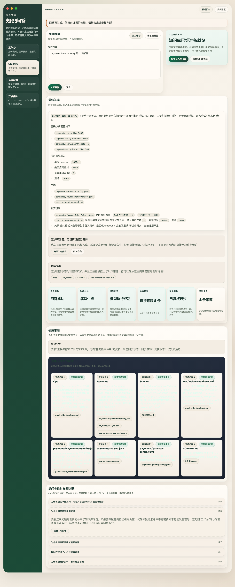
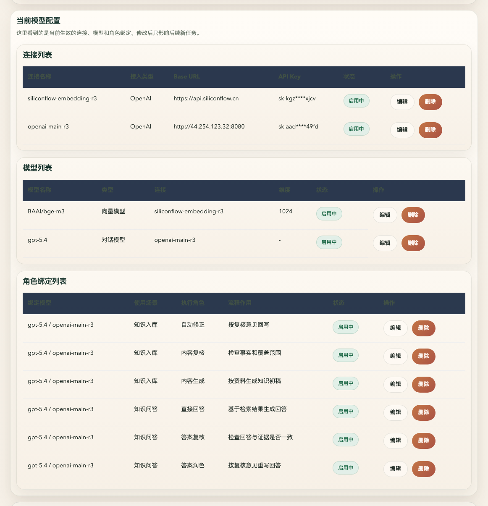
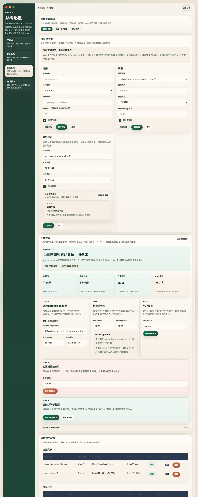
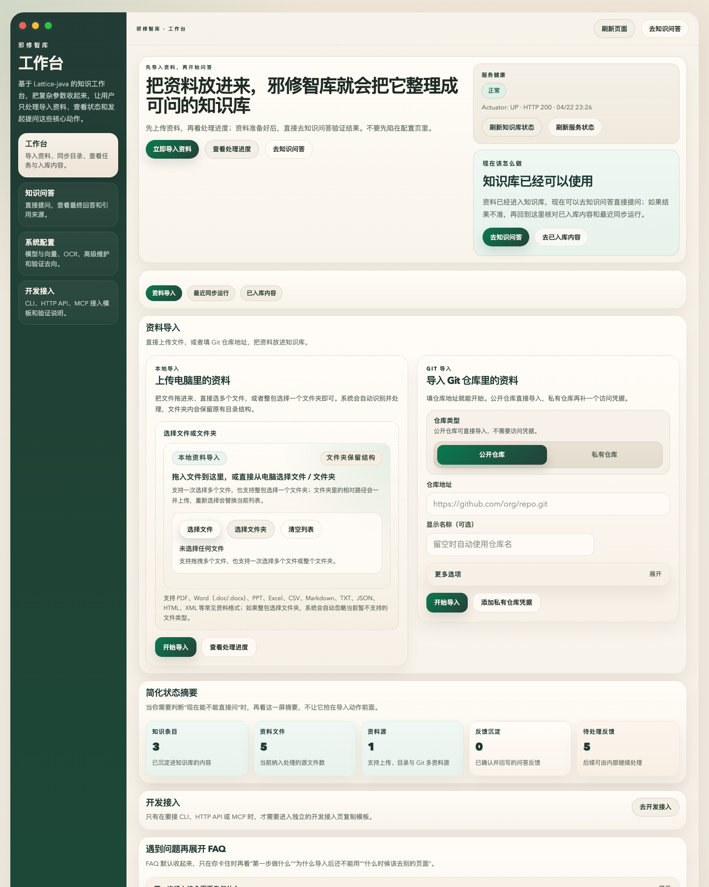
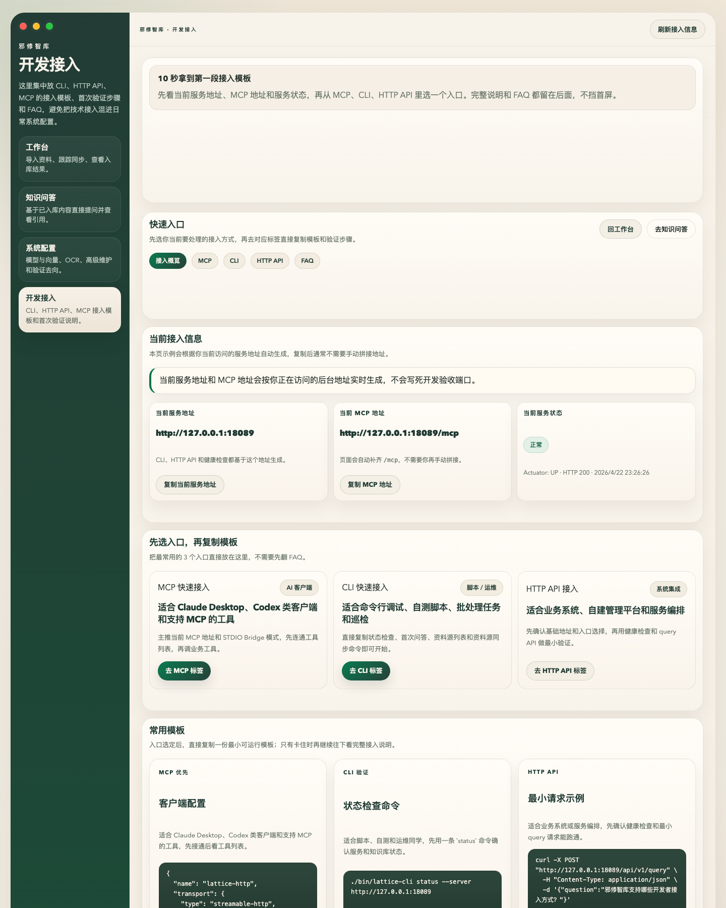

# 邪修智库（Lattice-java）

> 把 Markdown、YAML、代码、PDF、Excel、Git Repo 丢进炉里。<br>
> 炼的不是一次性答案，而是一套能被追责、能被回写、能被回滚的知识体。<br>
> 它不是传统 RAG，更像一个 `知识炼制系统 + Agent 仪轨 + 运行时封印层`。

判断它是不是普通 RAG，不用听口号，看系统里有没有这些“器官”就够了：

- `articles` / `article_chunks`：系统消费的是炼过的知识，不是裸 chunk。
- `pending_queries` / `contributions`：回答不是终点，还能被确认、纠偏、丢弃，再继续沉淀回系统。
- `execution_llm_snapshots`：每次 compile / query 都会留下运行时封印，知道当时到底是谁在出手。
- `article_snapshots` / `repo_snapshots`：知识资产自带历史、回档、导出，不是回答完就烟消云散。

邪修智库做的事很反常识：先把资料炼成知识资产，再把这层资产通过 Web、HTTP API、CLI、MCP 统一供给人和 AI。

它不相信原始文档天然就是知识，也不相信一次 prompt 就能把碎片召成真相。它更像先拆骨、归脉、审查、修补，再让知识开口说话。

`Spring Boot 3.5` · `Spring AI Alibaba Graph` · `PostgreSQL` · `Redis` · `Web / HTTP API / CLI / MCP`

---

## 此道不修传统 RAG

如果你第一眼把它当成“又一个知识库问答项目”，大概率会看错重点。这个仓库真正供奉的一等公民，不只是检索和回答，而是那些会留下痕迹、会继续演化、会反过来塑造系统本身的对象和链路：

| 传统 RAG 常见终点 | 邪修智库真正落地的一等公民 |
| --- | --- |
| 原始 chunk + 一次性 answer | `articles`、`article_chunks`、`metadata` 这类编译后的知识资产 |
| `retrieve -> answer` 单链路 | `compile graph` 和 `query graph` 两条显式主链 |
| 模型名只是一个字符串参数 | `connections`、`models`、`bindings`、`execution_llm_snapshots` |
| 回答停留在聊天记录里 | `pending_queries -> confirm/correct/discard -> contributions` |
| 配置改了就污染后续所有结果 | 运行时快照冻结，能追踪这次执行到底用了什么 |
| 只有页面能玩一下 | Web、HTTP API、CLI、MCP 共用同一后端能力 |

真正不对劲的地方，不是“支持 PDF / Excel / Git Repo”这种所有 README 都会写的能力，而是下面这些更硬的东西：

- 先编译知识，再问答，不是拿原始碎片临场拼 prompt。
- compile 和 query 都是图编排，并且都有固定职责 Agent 链。
- 问答结果不是一次性输出，而是可以进入 pending、被修正、被确认、继续沉淀回系统。
- 每次运行会冻结模型绑定与配置快照，不会因为后台改了配置就说不清历史结果。
- 知识资产本身可做 snapshot、history、rollback、vault export，不是回答完就结束。

如果你只想先看实际效果，可以先看下面的真实界面；如果你只想尽快启动，可以直接跳到后面的 [快速开始](#快速开始)。

---

## 四道邪门

### 1. 它先炼知识，不先切块

在邪修智库里，源资料不会直接等同于最终知识。系统会走一条显式编译链：

`source materials -> analyze -> writer -> reviewer -> fixer -> persist`

也就是说，问答消费的是编译后的知识资产，而不是只靠原始 chunk 临场拼装。

### 2. 它把 Agent 仪轨刻进了骨架

这里的 Agent 不是宣传话术，而是前后台、模型绑定和运行时快照里都能看到的真实角色：

- 编译侧：`writer / reviewer / fixer`
- 问答侧：`answer / reviewer / rewrite`

换句话说，Graph 负责流程，Agent 负责高认知动作，这个边界在系统里是明确存在的。

### 3. 它让回答死不掉，也散不掉

传统 RAG 常常在回答结束后就没有后文了。邪修智库把后续链路也做成了正式能力：

`pending query -> confirm/correct/discard -> contribution -> snapshot/rollback/export`

这意味着它更像一个会持续演进的知识系统，而不是一次性问答页。

### 4. 它记得这次到底是谁出的手

很多项目的模型配置只是个页面表单。邪修智库会把连接、模型、绑定和执行时快照接起来，所以系统能回答：

- 这次 compile / query 用的是哪条 binding
- 当时冻结下来的模型快照是什么
- 后续配置变更会影响哪些新任务，不会污染哪些历史结果

---

## 看它现形

### 第一张：问答现形



这张图不是 README 摆拍，而是 **2026-04-22** 在隔离实例 `18089 / lattice_e2e_ui_20260422_r3` 上跑出来的真实页面：

- 先导入 `SCHEMA.md`、`payments/*`、`ops/incident-runbook.md` 共 `5` 个文件
- 编译后形成 `3` 篇知识文章，并完成 `1024` 维向量刷新
- 再在 `/admin/ask` 提问 `payment timeout retry 是什么配置`
- 页面返回最终答案、`8` 条直接来源，并给出“回答成功 / 模型执行成功 / 已复核通过”

### 第二张：Agent 仪轨



这里能直接看到两条核心角色链：

- 编译侧：`writer / reviewer / fixer`
- 问答侧：`answer / reviewer / rewrite`

当前截图来自同一轮真实回归，`6` 个启用绑定统一挂在 `gpt-5.4 / openai-main-r3` 上。这也是这个项目和普通“带个模型配置页的知识库”差异很大的地方之一：Agent 编排不是文档概念，而是后台真实可维护、可冻结到运行时的系统骨架。

### 第三张：系统配置与向量维护



这张图对应同一实例的 `/admin/settings?tab=settings-llm`：

- 对话模型：`gpt-5.4 @ openai-main-r3`
- Embedding：`BAAI/bge-m3 @ siliconflow-embedding-r3`
- 当前向量状态：`profile 1024 维 / schema 1024 维 / 已建索引 3/3`

这也把这轮最新结论直接钉死了：`.claude/t1.md` 里的真实 OpenAI chat + SiliconFlow embedding 组合，不只是“能保存配置”，而是已经在独立 schema 上把 compile、vector refresh 和 ask 真链路一起跑通。

### 第四张：炉台与外门

<table>
  <tr>
    <td width="50%">
      <strong>知识库管理</strong><br/>
      资料导入、Git 仓库接入、同步运行和工作台总览。当前截图里能直接看到 `3` 篇文章、`5` 个源文件这组真实数据口径。<br/><br/>
      
    </td>
    <td width="50%">
      <strong>开发者接入</strong><br/>
      CLI、HTTP API、MCP 模板和首次验证路径集中展示。当前页面会按访问地址自动生成 `http://127.0.0.1:18089` 与 `/mcp` 接入模板。<br/><br/>
      
    </td>
  </tr>
</table>

从 GitHub 首页能直接看出来，这个项目已经不是“只有一个后台表单”的 demo，而是已经摆出了完整门面：

- 知识库工作台
- 真实问答页
- 系统配置与向量维护页
- Agent 编排与模型绑定页
- 开发者接入页

---

## 它走的不是正道

| 维度 | 传统 RAG | 邪修智库 |
| --- | --- | --- |
| 核心思路 | 先检索碎片，再现场生成答案 | 先把知识编译成资产，再基于资产问答 |
| 主链路 | 常见是 `retrieve -> answer` | 显式区分 `compile graph` 和 `query graph` |
| Agent 用法 | 常见是 prompt 内自检或单模型一步出结果 | 固定角色链：`writer / reviewer / fixer`、`answer / reviewer / rewrite` |
| 模型管理 | 配置常散落在页面参数或业务代码里 | 统一 connections、models、bindings、execution snapshots |
| 反馈沉淀 | 常停留在聊天记录里 | `pending -> confirm/correct/discard -> contribution` |
| 治理能力 | 很少追踪版本、回滚和导出 | 内建 snapshot、history、rollback、vault export |
| 对外交付 | 页面、API、CLI、MCP 常各自为政 | 多入口复用同一套知识后端 |

一句话说，传统 RAG 更像“从碎片里临时招魂”，邪修智库更像“先把知识炼成稳定形体，再基于这套形体回答、治理和演进”。

---

## 能炼什么

- 多源 ingest：已经在真实验收中覆盖 `md`、`yaml`、`json`、`java`、`pdf`、`xlsx`、`drawio`、`png` 等类型。
- 知识编译：不是直接切块入库，而是走 `analyze -> writer -> reviewer -> fixer -> persist` 的编译链。
- 知识问答：不只是 `search -> answer`，而是 `retrieve -> answer -> reviewer -> rewrite -> finalize` 的问答链。
- 反馈闭环：支持 `confirm`、`correct`、`discard`，确认后的结果可以沉淀为 contribution。
- 治理能力：支持 quality、coverage、lifecycle、snapshot、history、rollback、vault export。
- 多入口交付：Web、HTTP API、CLI、MCP 共用统一知识服务层。

---

## 架构海报

下面这张图把这个项目最有辨识度的 4 层关系放到了一张图里：`Graph`、`模型中心`、`知识资产`、`治理闭环`。

```mermaid
flowchart LR
    subgraph IN["多源知识输入"]
        IN1["Markdown / YAML / Code"]
        IN2["PDF / Excel / Images"]
        IN3["Git Repo / Upload / Server Dir"]
    end

    subgraph MC["模型中心"]
        MC1["Connections"]
        MC2["Models"]
        MC3["Bindings"]
        MC4["Execution Snapshots"]
        MC1 --> MC2 --> MC3 --> MC4
    end

    subgraph CG["Compile Graph"]
        CG1["Analyze"]
        CG2["Writer"]
        CG3["Reviewer"]
        CG4["Fixer"]
        CG5["Persist"]
        CG1 --> CG2 --> CG3
        CG3 -->|通过| CG5
        CG3 -->|需修复| CG4 --> CG3
    end

    subgraph KA["知识资产层"]
        KA1["Articles"]
        KA2["Article Chunks"]
        KA3["Sources & Metadata"]
        KA4["Article / Repo Snapshots"]
    end

    subgraph QG["Query Graph"]
        QG1["Retrieve & Fuse"]
        QG2["Answer"]
        QG3["Reviewer"]
        QG4["Rewrite"]
        QG5["Finalize"]
        QG1 --> QG2 --> QG3
        QG3 -->|通过| QG5
        QG3 -->|需改写| QG4 --> QG3
    end

    subgraph DS["交付入口"]
        DS1["Web"]
        DS2["HTTP API"]
        DS3["CLI"]
        DS4["MCP"]
    end

    subgraph GV["治理闭环"]
        GV1["Pending Feedback"]
        GV2["Confirm / Correct / Discard"]
        GV3["Contribution"]
        GV4["Lifecycle / Lint / Coverage"]
        GV5["Rollback / Vault Export"]
        GV1 --> GV2 --> GV3 --> GV4 --> GV5
    end

    IN1 --> CG1
    IN2 --> CG1
    IN3 --> CG1
    CG5 --> KA1
    CG5 --> KA2
    CG5 --> KA3
    KA1 --> QG1
    KA2 --> QG1
    KA3 --> QG1
    QG5 --> DS1
    QG5 --> DS2
    QG5 --> DS3
    QG5 --> DS4
    DS1 --> GV1
    DS2 --> GV1
    DS3 --> GV1
    DS4 --> GV1
    GV5 --> KA4
    MC3 -.角色路由.-> CG2
    MC3 -.角色路由.-> CG3
    MC3 -.角色路由.-> CG4
    MC3 -.角色路由.-> QG2
    MC3 -.角色路由.-> QG3
    MC3 -.角色路由.-> QG4
    MC4 -.运行时冻结.-> CG5
    MC4 -.运行时冻结.-> QG5

    style MC fill:#eef4ff,stroke:#2f6fdf,stroke-width:2px,color:#10213a
    style CG fill:#fff4e6,stroke:#ca7a1f,stroke-width:2px,color:#35210c
    style KA fill:#f7f7f7,stroke:#6b7280,stroke-width:2px,color:#1f2937
    style QG fill:#eef8f1,stroke:#2f8a57,stroke-width:2px,color:#143122
    style GV fill:#fff1ef,stroke:#cf4f3b,stroke-width:2px,color:#3a1713
    style DS fill:#f6f0ff,stroke:#7356d6,stroke-width:2px,color:#23173f
```



这张图想表达的核心关系只有一句：

- Graph 决定流程怎么走
- Agent 负责执行高认知动作
- 模型中心决定每个角色用什么模型
- 治理闭环把回答重新沉淀回知识资产

---

## 适合什么项目

- 你要做的不是聊天玩具，而是一个可长期演进的知识系统后端。
- 你的资料同时散落在文档、代码、配置、PDF、Excel、运维手册里。
- 你需要给 Web 页面、内部工具、CLI 或 MCP 客户端提供统一知识服务。
- 你关心回答质量、反馈沉淀、版本历史、回滚和导出，而不是只关心一次命中。
- 你希望模型路由是可配置、可冻结、可追踪的，不想把模型选择散在代码和页面参数里。

## 不太适合什么项目

- 你只想做一个最小向量检索 demo。
- 你只想验证“模型能不能答一句话”。
- 你不关心知识治理、反馈闭环、版本历史和多入口复用。
- 你只需要一个轻量聊天前台，不需要知识系统后端。

---

## 当前状态

截至 **2026-04-22**，仓库当前口径已经明确包含一轮基于 [`.claude/t1.md`](.claude/t1.md) 的真实端到端回归，而不是停留在“模型配置页能保存”的半通状态：

- 隔离实例：`http://127.0.0.1:18089`
- 隔离 schema：`lattice_e2e_ui_20260422_r3`
- 聊天模型：`gpt-5.4 @ http://44.254.123.32:8080`
- Embedding 模型：`BAAI/bge-m3 (1024) @ https://api.siliconflow.cn`
- 最小真实样本：`5` 个文件编译成 `3` 篇文章
- Query 真实结果：`answerOutcome=SUCCESS`、`generationMode=LLM`、`modelExecutionStatus=SUCCESS`
- 向量真实状态：`embeddingColumnType=vector(1024)`、`dimensionsMatch=true`、`indexedArticleCount=3`
- `/admin`、`/admin/ask`、`/admin/settings`、`/admin/developer-access` 四页已做浏览器验收，当前 README 截图就是这轮实例生成的实拍图

当前已经明确成立的结论包括：

- compile / query 已共享统一连接、模型、Agent 绑定与快照能力
- `.claude/t1.md` 里的真实 OpenAI chat + SiliconFlow embedding 组合已经把 compile、ask、vector refresh 真链路一起跑通
- Query 侧 `answer / reviewer / rewrite` 已真实冻结到 `execution_llm_snapshots`
- `2026-04-22` 的最新补验已确认空 schema 下也能自动对齐 `1024` 维向量列，不需要手工先改表再编译
- CLI remote 已补验 `compile / status / search / query / vault-export`
- MCP HTTP 端点已真实跑通 `initialize / tools/list / lattice_status / lattice_query`

当前仍需注意的点：

- 当前实例尚未检测到 ANN 索引类型，页面会显示“待补齐”；但 `1024` 维向量写入、索引刷新和真实问答检索都已通过
- 每次真实 query 都会产生 pending feedback，若要让工作台统计保持干净，需要继续执行 `confirm / correct / discard`

更细的样本、命令、日志和限制说明，请看 [`docs/项目全流程真实验收手册.md`](docs/%E9%A1%B9%E7%9B%AE%E5%85%A8%E6%B5%81%E7%A8%8B%E7%9C%9F%E5%AE%9E%E9%AA%8C%E6%94%B6%E6%89%8B%E5%86%8C.md)。

---

## 这轮补修掉的真实问题

- `ChatClient / OpenAiApi` 在 `.claude/t1.md` 这条 OpenAI 兼容网关前，原先会发送 `Transfer-Encoding: chunked`，网关把它判成 `Request body is empty`。现在已改成发送带 `Content-Length` 的普通 JSON 请求，并补了瞬时失败重试，所以 compile / query 主链会直接返回真实 `LLM + SUCCESS` 结果。
- 当空 schema 还保留默认 `vector(1536)`，而本轮 embedding 已切到 `BAAI/bge-m3 (1024)` 时，现在会在首次 compile 的向量刷新阶段自动把列维度对齐到 `vector(1024)`，不需要手工先改表。

---

## 快速开始

这里只保留一个对外阅读友好的最小启动口径，详细步骤请看独立文档。

### 环境

- JDK `21`
- PostgreSQL
- Redis
- Maven

### 最小启动命令

下面这组命令沿用仓库当前的真实验证口径，使用 `lattice` schema：

```bash
docker exec vector_db psql -U postgres -d ai-rag-knowledge \
  -c "DROP SCHEMA IF EXISTS lattice CASCADE; CREATE SCHEMA lattice;"

export SPRING_PROFILES_ACTIVE=jdbc
export SPRING_DATASOURCE_URL='jdbc:postgresql://127.0.0.1:5432/ai-rag-knowledge?currentSchema=lattice'
export SPRING_DATASOURCE_USERNAME=postgres
export SPRING_DATASOURCE_PASSWORD=postgres
export SPRING_FLYWAY_ENABLED=true
export SPRING_FLYWAY_SCHEMAS=lattice
export SPRING_FLYWAY_DEFAULT_SCHEMA=lattice
export LATTICE_REDIS_HOST=127.0.0.1
export LATTICE_REDIS_PORT=6379
export LATTICE_LLM_BOOTSTRAP_ENABLED=true
export LATTICE_LLM_SECRET_ENCRYPTION_KEY='请设置一个 32+ 字节密钥'

mvn -q spring-boot:run
```

如果你本地 Maven 镜像握手不稳定，再临时改用：

```bash
mvn -q -s .codex/maven-settings.xml spring-boot:run
```

如果你想复用本 README 这轮真实回归口径，可以在 `/admin/settings` 手动录入 [`.claude/t1.md`](.claude/t1.md) 里的 OpenAI chat 与 SiliconFlow embedding 配置；密钥只保留在本地，不要写进仓库。

### 为什么这里直接重建 schema

- 当前仓库的 Flyway 迁移已经收敛为单一基线 `V1__baseline_schema.sql`
- 如果你本地的 `lattice` schema 跑过旧版本迁移链，旧的 `flyway_schema_history` 可能还在
- 这时启动会报 `Migration checksum mismatch for migration version 1`
- 对首次上手最稳妥的做法，就是直接 `DROP SCHEMA ... CASCADE` 后重新启动

### 启动后 3 分钟验证

1. 访问 `http://127.0.0.1:8080/actuator/health`
2. 打开 `http://127.0.0.1:8080/admin/settings`，配置连接、模型和 Agent 绑定
3. 打开 `http://127.0.0.1:8080/admin`，导入文件或 Git 仓库，触发编译
4. 打开 `http://127.0.0.1:8080/admin/ask`，直接提问并确认回答与引用来源
5. 打开 `http://127.0.0.1:8080/admin/developer-access`，查看 CLI、HTTP API、MCP 接入方式

---

## 文档导航

### 想知道怎么启动

- [`docs/项目启动配置清单.md`](docs/%E9%A1%B9%E7%9B%AE%E5%90%AF%E5%8A%A8%E9%85%8D%E7%BD%AE%E6%B8%85%E5%8D%95.md)

### 想知道当前真实跑通了什么

- [`docs/项目全流程真实验收手册.md`](docs/%E9%A1%B9%E7%9B%AE%E5%85%A8%E6%B5%81%E7%A8%8B%E7%9C%9F%E5%AE%9E%E9%AA%8C%E6%94%B6%E6%89%8B%E5%86%8C.md)

### 想知道数据库对象和实体关系

- [`docs/数据库表结构详解.md`](docs/%E6%95%B0%E6%8D%AE%E5%BA%93%E8%A1%A8%E7%BB%93%E6%9E%84%E8%AF%A6%E8%A7%A3.md)

---

## 一句话总结

邪修智库不是“又一个带聊天页的 RAG demo”，而是一个把知识编译、Agent 编排、模型中心、反馈沉淀和治理能力真正落到工程里的 Java 知识后端。
