# 邪修智库（Lattice-java）

> 一个把资料编译成知识资产，再统一提供问答与治理能力的 Java 后端。<br>
> 它不是“上传文档 -> 检索碎片 -> 临时生成答案”的轻量 demo，<br>
> 而是面向长期演进场景的 `知识编译 + Agent 编排 + 模型中心 + 反馈闭环` 系统。

如果你想快速判断它值不值得看，先抓 3 件事：

- 它把 `Markdown / YAML / 代码 / PDF / Excel / Git Repo` 编译成可追踪的知识资产，而不是直接把原始 chunk 扔给模型。
- 它同时提供 `Web / HTTP API / CLI / MCP` 四类入口，复用同一套后端能力。
- 它把模型连接、角色绑定、执行快照、反馈回写、历史回滚都做成了正式能力。

如果继续往下看，可以重点留意这些核心对象：

- `articles` / `article_chunks`：系统消费的是编译后的知识资产，不是裸 chunk。
- `pending_queries` / `contributions`：回答不是终点，还能被确认、纠偏、丢弃，再沉淀回系统。
- `execution_llm_snapshots`：每次 compile / query 都会留下运行时快照，知道当时到底命中了什么连接、模型和绑定。
- `article_snapshots` / `repo_snapshots`：知识资产自带历史、回档、导出，不是回答完就烟消云散。

`Spring Boot 3.5` · `Spring AI Alibaba Graph` · `PostgreSQL` · `Redis` · `Web / HTTP API / CLI / MCP`

---

## 30 秒看懂

- 它是什么：一个面向知识编译、问答、反馈和治理的 Java 后端，不只是一个聊天页面。
- 它解决什么问题：把分散在文档、代码、配置、PDF、Excel、Git Repo 里的资料，整理成可追踪、可回写、可回滚的知识资产。
- 怎么试：如果你想先跑起来，直接跳到后面的 [快速开始](#快速开始)。

---

## 和传统 RAG 的区别

如果你第一眼把它当成“又一个知识库问答项目”，大概率会看错重点。这个仓库真正的一等公民，不只是检索和回答，而是那些会留下痕迹、会继续演化、会反过来塑造系统本身的对象和链路：

| 传统 RAG 常见终点 | 邪修智库真正落地的一等公民 |
| --- | --- |
| 原始 chunk + 一次性 answer | `articles`、`article_chunks`、`metadata` 这类编译后的知识资产 |
| `retrieve -> answer` 单链路 | `compile graph` 和 `query graph` 两条显式主链 |
| 模型名只是一个字符串参数 | `connections`、`models`、`bindings`、`execution_llm_snapshots` |
| 回答停留在聊天记录里 | `pending_queries -> confirm/correct/discard -> contributions` |
| 配置改了就污染后续所有结果 | 运行时快照冻结，能追踪这次执行到底用了什么 |
| 只有页面能玩一下 | Web、HTTP API、CLI、MCP 共用同一后端能力 |

真正重要的差异点，不是“支持 PDF / Excel / Git Repo”这种所有 README 都会写的能力，而是下面这些更硬的东西：

- 先编译知识，再问答，不是拿原始碎片临场拼 prompt。
- compile 和 query 都是图编排，并且都有固定职责 Agent 链。
- 问答结果不是一次性输出，而是可以进入 pending、被修正、被确认、继续沉淀回系统。
- 每次运行会冻结模型绑定与配置快照，不会因为后台改了配置就说不清历史结果。
- 知识资产本身可做 snapshot、history、rollback、vault export，不是回答完就结束。

如果你只想先建立整体理解，可以先看后面的 [系统架构图](#系统架构图)；如果你只想尽快启动，可以直接跳到后面的 [快速开始](#快速开始)。

---

## 核心能力

### 1. 先编译知识，再问答

在邪修智库里，源资料不会直接等同于最终知识。系统会走一条显式编译链：

`source materials -> analyze -> writer -> reviewer -> fixer -> persist`

也就是说，问答消费的是编译后的知识资产，而不是只靠原始 chunk 临场拼装。

### 2. Agent 角色链进入系统骨架

这里的 Agent 不是宣传话术，而是前后台、模型绑定和运行时快照里都能看到的真实角色：

- 编译侧：`writer / reviewer / fixer`
- 问答侧：`answer / reviewer / rewrite`

换句话说，Graph 负责流程，Agent 负责高认知动作，这个边界在系统里是明确存在的。

### 3. 问答结果能回写、能沉淀

传统 RAG 常常在回答结束后就没有后文了。邪修智库把后续链路也做成了正式能力：

`pending query -> confirm/correct/discard -> contribution -> snapshot/rollback/export`

这意味着它更像一个会持续演进的知识系统，而不是一次性问答页。

### 4. 运行时配置可冻结、可追踪

很多项目的模型配置只是个页面表单。邪修智库会把连接、模型、绑定和执行时快照接起来，所以系统能回答：

- 这次 compile / query 用的是哪条 binding
- 当时冻结下来的模型快照是什么
- 后续配置变更会影响哪些新任务，不会污染哪些历史结果

---

## 对比传统 RAG

| 维度 | 传统 RAG | 邪修智库 |
| --- | --- | --- |
| 核心思路 | 先检索碎片，再现场生成答案 | 先把知识编译成资产，再基于资产问答 |
| 主链路 | 常见是 `retrieve -> answer` | 显式区分 `compile graph` 和 `query graph` |
| Agent 用法 | 常见是 prompt 内自检或单模型一步出结果 | 固定角色链：`writer / reviewer / fixer`、`answer / reviewer / rewrite` |
| 模型管理 | 配置常散落在页面参数或业务代码里 | 统一 connections、models、bindings、execution snapshots |
| 反馈沉淀 | 常停留在聊天记录里 | `pending -> confirm/correct/discard -> contribution` |
| 治理能力 | 很少追踪版本、回滚和导出 | 内建 snapshot、history、rollback、vault export |
| 对外交付 | 页面、API、CLI、MCP 常各自为政 | 多入口复用同一套知识后端 |

一句话说，传统 RAG 更偏向“先检索，再临时生成”，邪修智库更偏向“先把知识编译成稳定资产，再基于这套资产回答、治理和演进”。

---

## 支持的能力

- 多源 ingest：支持 `md`、`yaml`、`json`、`java`、`pdf`、`xlsx`、`drawio`、`png` 等类型。
- 知识编译：不是直接切块入库，而是走 `analyze -> writer -> reviewer -> fixer -> persist` 的编译链。
- 知识问答：不只是 `search -> answer`，而是 `retrieve -> answer -> reviewer -> rewrite -> finalize` 的问答链。
- 反馈闭环：支持 `confirm`、`correct`、`discard`，确认后的结果可以沉淀为 contribution。
- 治理能力：支持 quality、coverage、lifecycle、snapshot、history、rollback、vault export。
- 多入口交付：Web、HTTP API、CLI、MCP 共用统一知识服务层。

---

## 系统架构图

如果只看一张图，先看这张。它现在只做一件事：把这个系统按层压平，让人一眼看清“入口在哪里、核心处理在哪一层、资产和存储落在哪里”。Compile / Query 的细链路不再塞进总览图里，而是交给下面两张时序图。


读这张图，只抓 3 件事就够了：

- 最上面是入口：无论从工作台、问答页、HTTP API、CLI 还是 MCP 进来，都会落到同一套后端能力。
- 中间三层是核心：应用服务层负责接入，编排与模型层负责真正的 Compile / Query 执行，资产层负责沉淀知识、反馈和快照。
- 最下面是落点：知识资产最终落到 PostgreSQL / Redis / 文件来源与 Spring Boot 运行时，不在页面层临时停留。

## 亮点功能时序图

上面的架构图看分层，下面两张时序图看两条最核心的真实链路：资料编译入库，以及问答后的证据与反馈闭环。

### 1. 资料编译入库时序

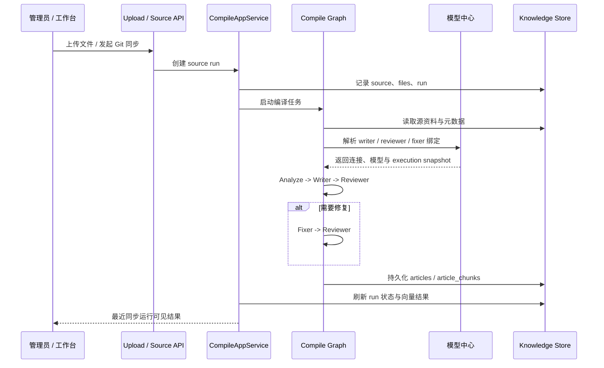

### 2. 问答、证据与反馈回写时序

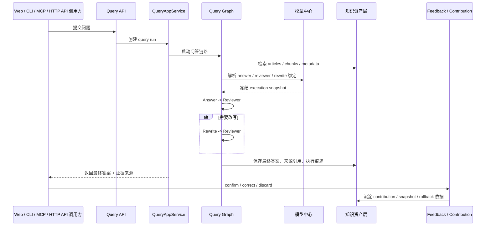

---

## 界面总览

下面这些图用于展示项目当前的主要界面与核心链路。截图重新整理于 **2026-04-23**，对应的是同一套演示数据：

- 导入 `SCHEMA.md`、`payments/*`、`ops/incident-runbook.md` 共 `5` 个文件
- 编译后形成 `3` 篇知识文章，并完成 `1024` 维向量刷新
- 在 `/admin/ask` 提问 `payment timeout retry 是什么配置`
- 最终返回 `部分答案`、`8` 条直接来源，并保留复核与反馈入口

### 1. 问答闭环不是一句答案，而是一整套证据链

<table>
  <tr>
    <td width="50%">
      <strong>提问入口</strong><br/>
      问题入口和当前知识库状态摆在同一屏，先判断“能不能问”，再决定是否回工作台或配置页。<br/><br/>
      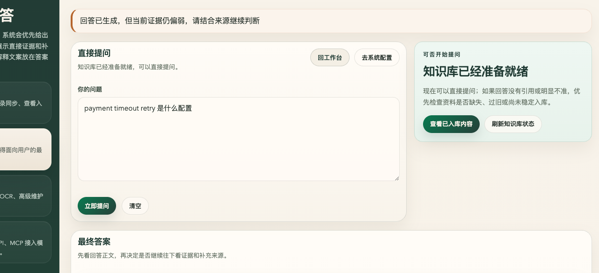
    </td>
    <td width="50%">
      <strong>最终答案</strong><br/>
      回答正文不是一句短回复，而是带结构化参数解释、来源引用和补充说明的可复核答案。<br/><br/>
      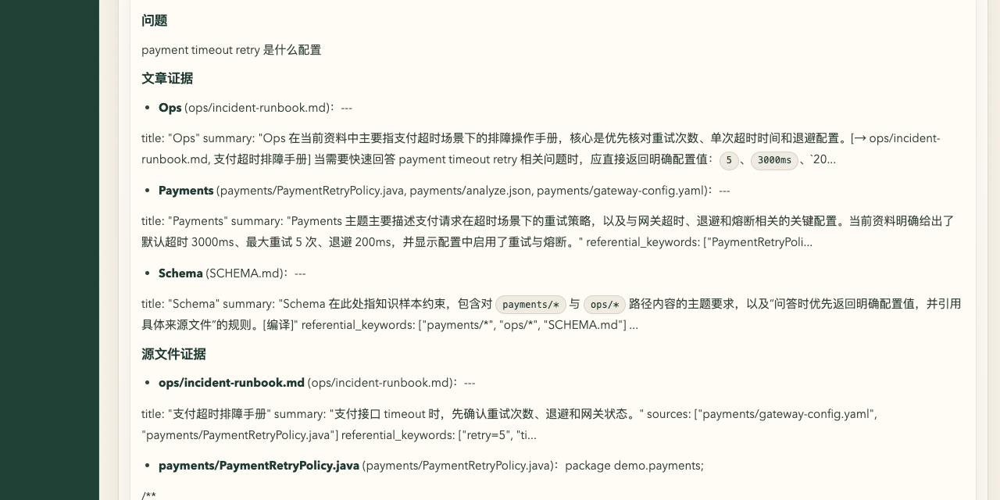
    </td>
  </tr>
  <tr>
    <td colspan="2">
      <strong>证据与引用来源</strong><br/>
      下面这一块单独裁出来，是为了强调项目真正的差异点不是“能答”，而是“答完还带证据状态、覆盖情况和直接来源卡片”。<br/><br/>
      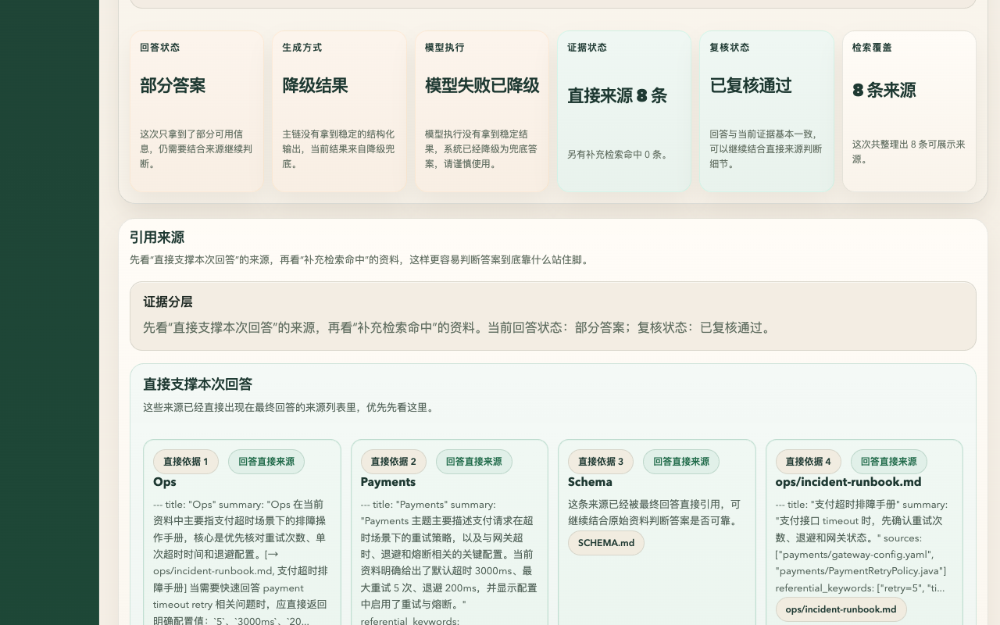
    </td>
  </tr>
</table>

这三块连起来，才是这个项目真正想表达的问答闭环：

- 先判断当前知识状态是否适合直接提问
- 再返回带结构化解释、来源引用和复核状态的回答结果
- 最后把证据状态、检索覆盖和直接来源显式摆出来，而不是藏在日志里

### 2. 模型中心、角色绑定和向量维护是可见、可配、可追踪的

<table>
  <tr>
    <td width="50%">
      <strong>模型中心</strong><br/>
      配置总览、连接表单和模型表单放在同一段主流程里，先看当前状态，再决定下一步补哪一块。<br/><br/>
      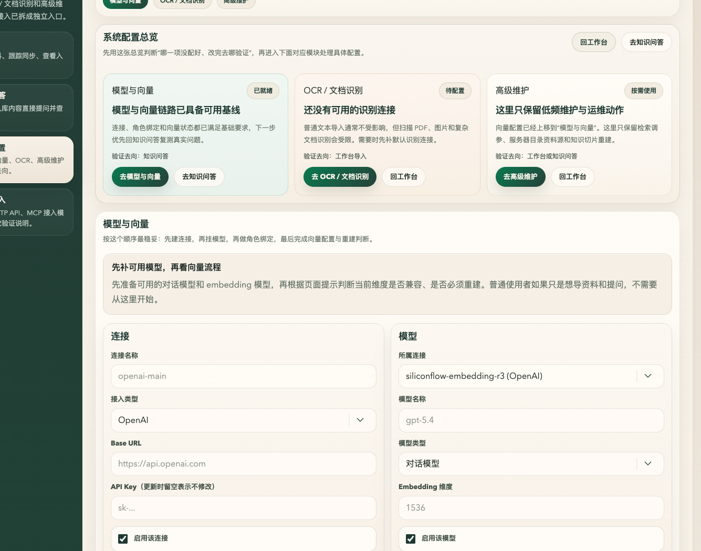
    </td>
    <td width="50%">
      <strong>向量维护</strong><br/>
      向量不是一个隐藏开关，而是有状态卡、兼容性判断、保存配置和按需重建四段显式流程。<br/><br/>
      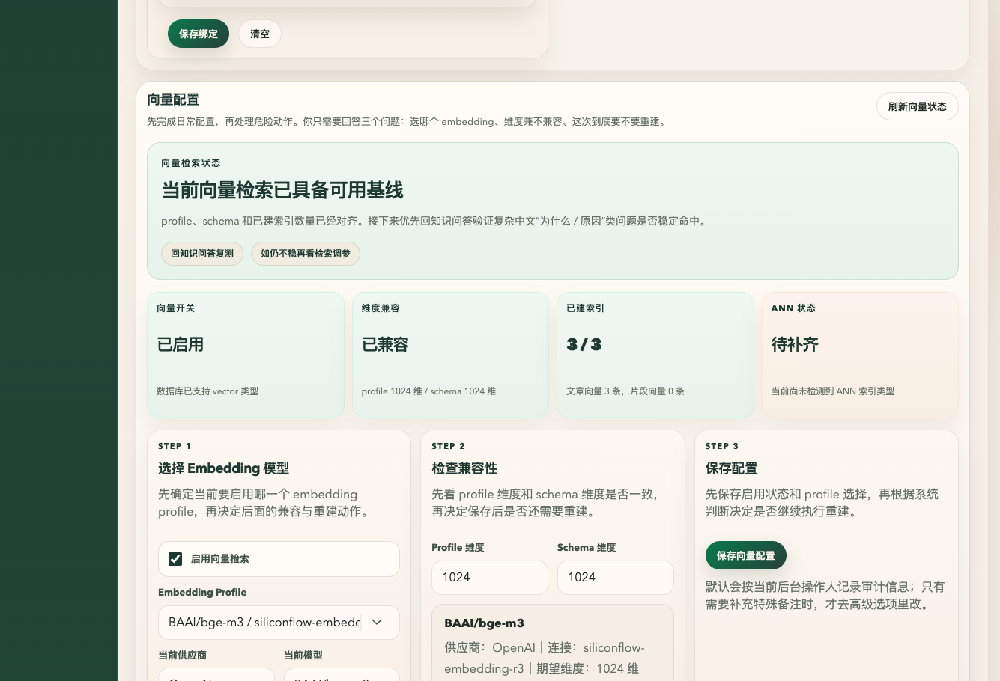
    </td>
  </tr>
  <tr>
    <td width="50%">
      <strong>连接与模型清单</strong><br/>
      直接截连接表和模型表本体，不再带整块容器，让人一眼看清当前启用的连接和模型到底是什么。<br/><br/>
      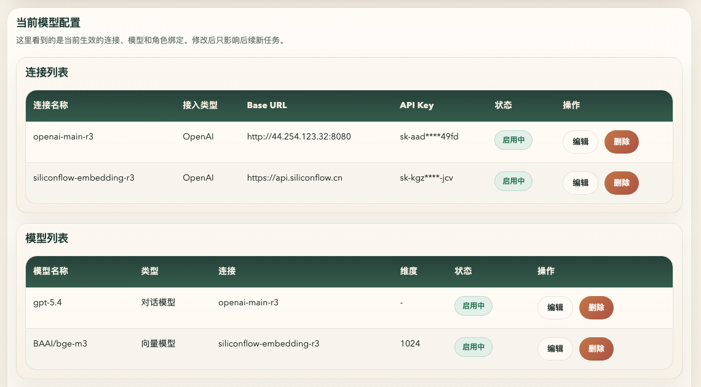
    </td>
    <td width="50%">
      <strong>角色链路清单</strong><br/>
      这里只保留角色绑定表本体，编译侧 `writer / reviewer / fixer` 与问答侧 `answer / reviewer / rewrite` 都能直接看到。<br/><br/>
      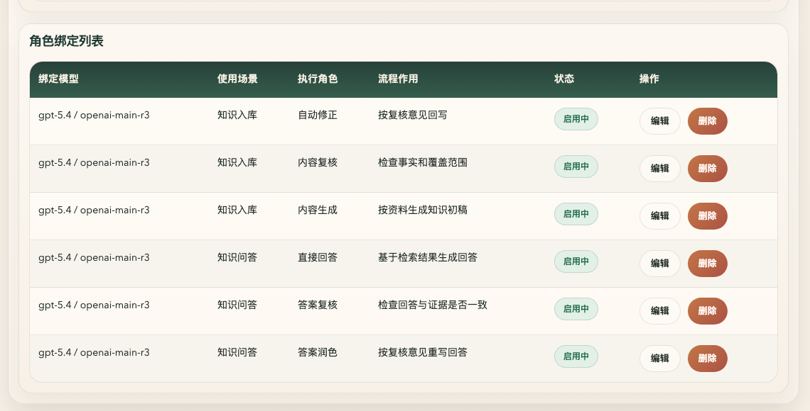
    </td>
  </tr>
</table>

这组截图主要想说明 3 件事：

- 连接、模型和角色绑定都统一归口到模型中心管理
- 向量维度、兼容性判断和重建状态都有显式页面，不是隐藏开关
- 编译侧与问答侧共用同一套模型中心与角色绑定体系

### 3. 工作台和开发接入页也按功能切片看，不再塞整页长图

<table>
  <tr>
    <td width="50%">
      <strong>工作台总览</strong><br/>
      首屏先给状态摘要、当前建议动作和服务健康，不让用户一进来就先埋在大表单里。<br/><br/>
      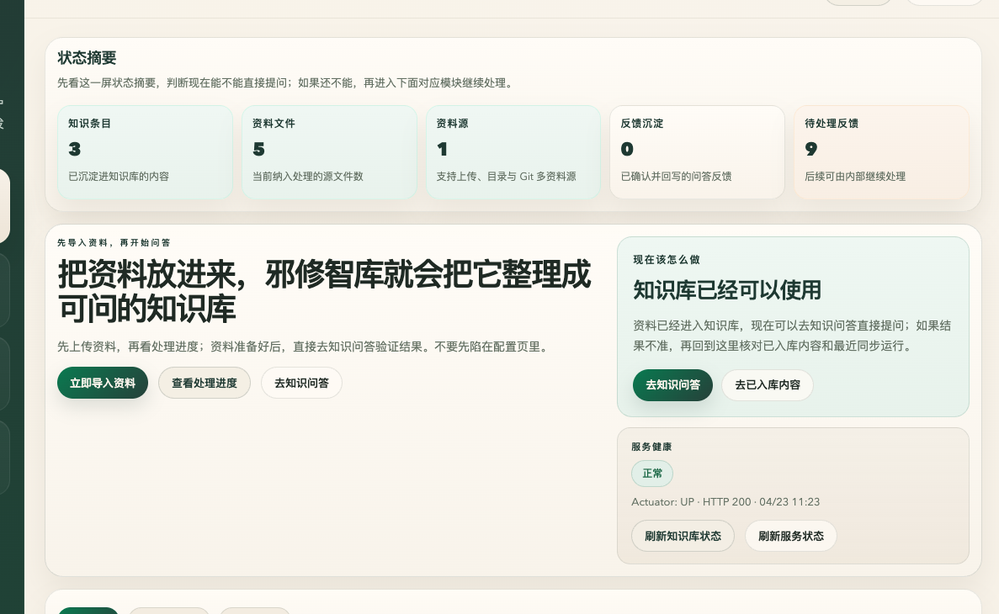
    </td>
    <td width="50%">
      <strong>资料导入</strong><br/>
      本地上传和 Git 导入拆成两块并列入口，导入动作、资料格式和后续处理进度都在这一屏闭环。<br/><br/>
      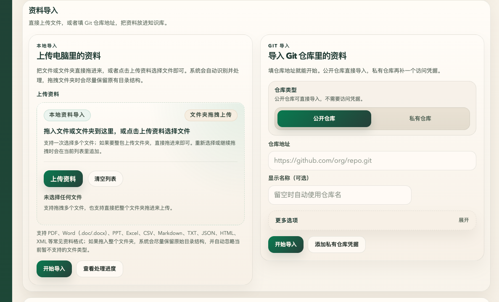
    </td>
  </tr>
  <tr>
    <td width="50%">
      <strong>接入地址与状态</strong><br/>
      开发接入页先把当前服务地址、MCP 地址和服务状态摆出来，方便先连通再选模板。<br/><br/>
      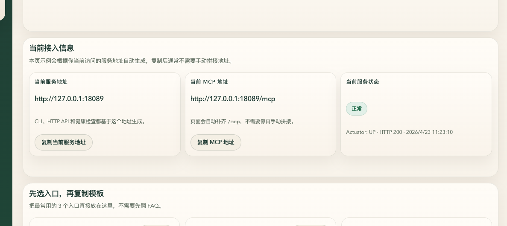
    </td>
    <td width="50%">
      <strong>入口模板</strong><br/>
      MCP、CLI、HTTP API 三种入口拆成各自独立卡片，先判断场景，再复制最小可运行模板。<br/><br/>
      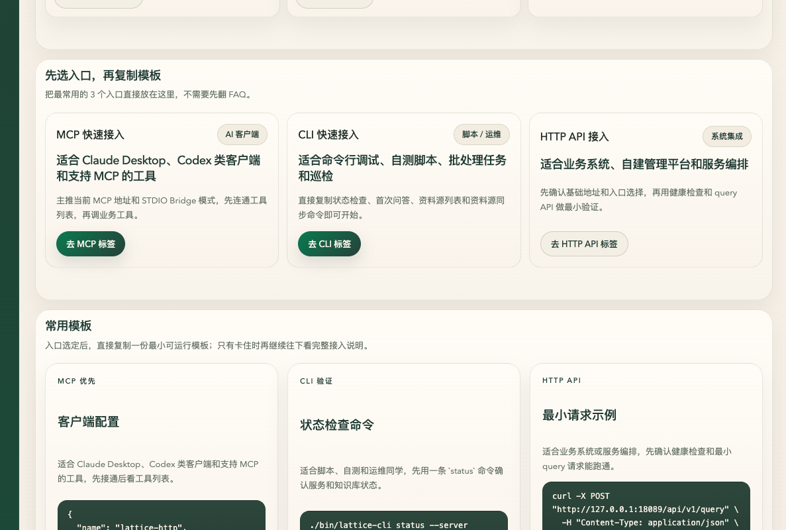
    </td>
  </tr>
</table>

从这些界面可以直接看出来，这个项目已经不是“只有一个后台表单”的 demo，而是已经具备完整的使用与接入入口：

- 知识库工作台
- 问答页
- 系统配置与向量维护页
- Agent 编排与模型绑定页
- 开发者接入页

---

## 适合什么项目

- 你要做的不是聊天玩具，而是一个可长期演进的知识系统后端。
- 你的资料同时散落在文档、代码、配置、PDF、Excel、运维手册里。
- 你需要给 Web 页面、内部工具、CLI 或 MCP 客户端提供统一知识服务。
- 你关心回答质量、反馈沉淀、版本历史、回滚和导出，而不是只关心一次命中。
- 你希望模型路由是可配置、可冻结、可追踪的，不想把模型选择散在代码和页面参数里。

## 不太适合什么项目

- 你只想做一个最小向量检索 demo。
- 你只想验证“模型能不能答一句话”。
- 你不关心知识治理、反馈闭环、版本历史和多入口复用。
- 你只需要一个轻量聊天前台，不需要知识系统后端。

---

## 快速开始

这里只保留一个对外阅读友好的最小启动口径，详细步骤请看独立文档。

### 环境

- JDK `21`
- PostgreSQL
- Redis
- Maven

### 最小启动命令

下面先给一组安全的最小启动命令，默认使用 `lattice` schema：

```bash
docker exec vector_db psql -U postgres -d ai-rag-knowledge \
  -c "CREATE SCHEMA IF NOT EXISTS lattice;"

export SPRING_PROFILES_ACTIVE=jdbc
export SPRING_DATASOURCE_URL='jdbc:postgresql://127.0.0.1:5432/ai-rag-knowledge?currentSchema=lattice'
export SPRING_DATASOURCE_USERNAME=postgres
export SPRING_DATASOURCE_PASSWORD=postgres
export SPRING_FLYWAY_ENABLED=true
export SPRING_FLYWAY_SCHEMAS=lattice
export SPRING_FLYWAY_DEFAULT_SCHEMA=lattice
export LATTICE_REDIS_HOST=127.0.0.1
export LATTICE_REDIS_PORT=6379
export LATTICE_LLM_BOOTSTRAP_ENABLED=true
export LATTICE_LLM_SECRET_ENCRYPTION_KEY='请设置一个 32+ 字节密钥'

mvn -q spring-boot:run
```

如果你本地 Maven 镜像握手不稳定，再临时改用：

```bash
mvn -q -s .codex/maven-settings.xml spring-boot:run
```

启动后，在 `/admin/settings` 配置你自己的对话模型、Embedding 模型和 Agent 绑定；密钥只保留在本地，不要写进仓库。

### 如果遇到旧迁移污染，再重建 schema

只有当你本地的 `lattice` schema 跑过旧版本迁移链时，才需要执行下面这组重建命令：

```bash
docker exec vector_db psql -U postgres -d ai-rag-knowledge \
  -c "DROP SCHEMA IF EXISTS lattice CASCADE; CREATE SCHEMA lattice;"
```

- 当前仓库的 Flyway 迁移已经收敛为单一基线 `V1__baseline_schema.sql`
- 如果你本地的 `lattice` schema 跑过旧版本迁移链，旧的 `flyway_schema_history` 可能还在
- 这时启动会报 `Migration checksum mismatch for migration version 1`
- 这时最稳妥的处理方式，就是先重建 schema 再重新启动

### 启动后 3 分钟验证

1. 访问 `http://127.0.0.1:8080/actuator/health`
2. 打开 `http://127.0.0.1:8080/admin/settings`，配置连接、模型和 Agent 绑定
3. 打开 `http://127.0.0.1:8080/admin`，导入文件或 Git 仓库，触发编译
4. 打开 `http://127.0.0.1:8080/admin/ask`，直接提问并确认回答与引用来源
5. 打开 `http://127.0.0.1:8080/admin/developer-access`，查看 CLI、HTTP API、MCP 接入方式

---

## 最小调用示例

下面这几组示例默认服务运行在 `http://127.0.0.1:8080`。如果你改了端口或域名，把示例里的 `BASE_URL` 一起替换掉就行。

### 1. HTTP API

先做健康检查，再直接走最小问答接口；如果你已经准备好了资料目录，也可以直接触发一次编译。

```bash
export BASE_URL=http://127.0.0.1:8080

# 健康检查
curl "$BASE_URL/actuator/health"

# 最小问答
curl -X POST "$BASE_URL/api/v1/query" \
  -H "Content-Type: application/json" \
  -d '{"question":"邪修智库支持哪些开发者接入方式？"}'

# 最小编译
curl -X POST "$BASE_URL/api/v1/compile" \
  -H "Content-Type: application/json" \
  -d '{"sourceDir":"/path/to/your-source-dir","incremental":false}'
```

### 2. CLI

如果你只是想确认服务通不通，先跑 `status`；确认通了以后，再跑第一次 `query`。

```bash
./bin/lattice-cli status --server http://127.0.0.1:8080
./bin/lattice-cli query --server http://127.0.0.1:8080 "邪修智库支持哪些开发者接入方式？"
```

如果你会反复调用 CLI，可以先写一次环境变量，后面就不用反复带 `--server`：

```bash
export LATTICE_SERVER_URL=http://127.0.0.1:8080
./bin/lattice-cli status
./bin/lattice-cli query "邪修智库支持哪些开发者接入方式？"
```

### 3. MCP

如果你的客户端支持远端 HTTP MCP，可以直接接这个地址：

```json
{
  "name": "lattice-http",
  "transport": {
    "type": "streamable-http",
    "url": "http://127.0.0.1:8080/mcp"
  }
}
```

如果你的客户端更适合本地命令方式，可以用仓库自带的 bridge：

```json
{
  "mcpServers": {
    "lattice-java": {
      "command": "bash",
      "args": [
        "-lc",
        "cd /path/to/lattice-java && ./bin/lattice-mcp-bridge http://127.0.0.1:8080/mcp"
      ]
    }
  }
}
```

接通后，建议按这个顺序做第一次验证：

1. 先执行 `tools/list`，确认能看到 `lattice_status`、`lattice_query` 等工具。
2. 再调用 `lattice_status`，确认返回健康状态与知识库统计。
3. 最后调用 `lattice_query`，确认返回 `answer`、`sourcePaths` 或 `pendingQueryId`。

如果 `lattice_query` 产生了 pending 结果，记得继续 `confirm`、`correct` 或 `discard`，不要把待处理记录一直留在队列里。

---

## 文档导航

### 想知道怎么启动

- [`docs/项目启动配置清单.md`](docs/%E9%A1%B9%E7%9B%AE%E5%90%AF%E5%8A%A8%E9%85%8D%E7%BD%AE%E6%B8%85%E5%8D%95.md)

### 想看端到端验收与回归示例

- [`docs/项目全流程真实验收手册.md`](docs/%E9%A1%B9%E7%9B%AE%E5%85%A8%E6%B5%81%E7%A8%8B%E7%9C%9F%E5%AE%9E%E9%AA%8C%E6%94%B6%E6%89%8B%E5%86%8C.md)

### 想看数据库对象与实体关系

- [`docs/数据库表结构详解.md`](docs/%E6%95%B0%E6%8D%AE%E5%BA%93%E8%A1%A8%E7%BB%93%E6%9E%84%E8%AF%A6%E8%A7%A3.md)

---

## 一句话总结

邪修智库不是“又一个带聊天页的 RAG demo”，而是一个把知识编译、Agent 编排、模型中心、反馈沉淀和治理能力真正落到工程里的 Java 知识后端。
