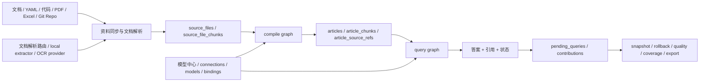
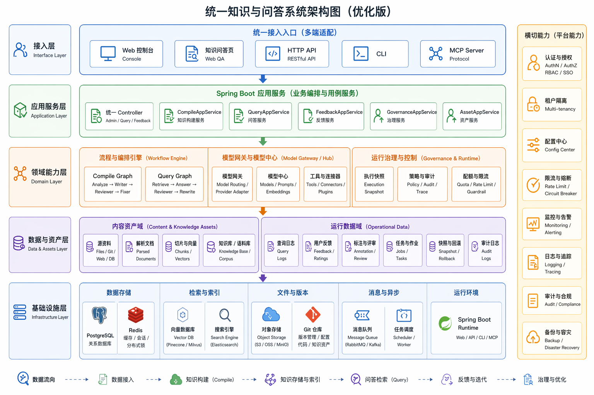
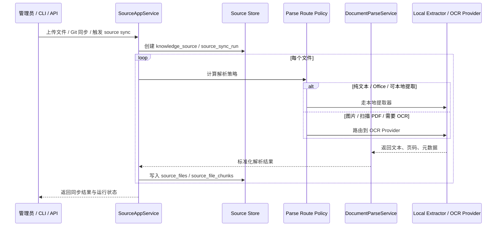
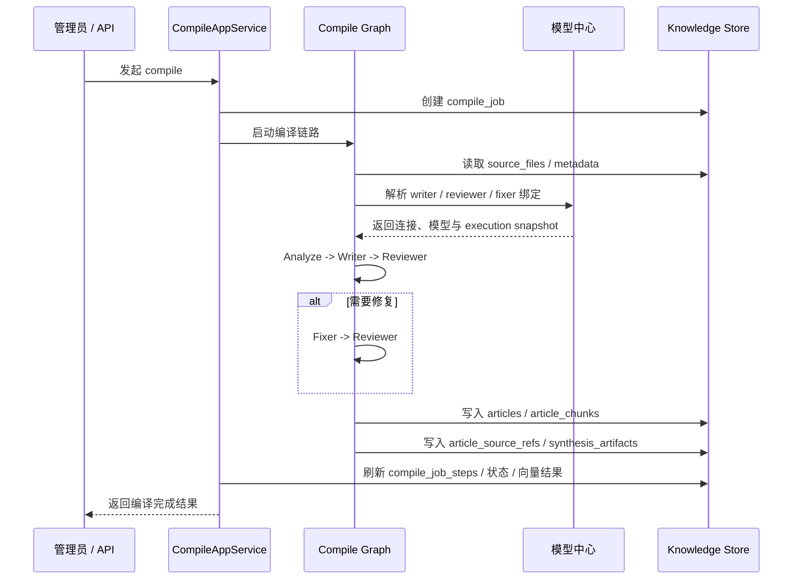
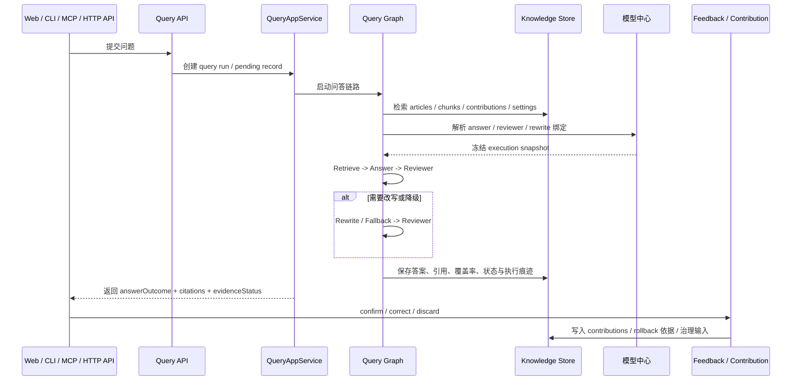
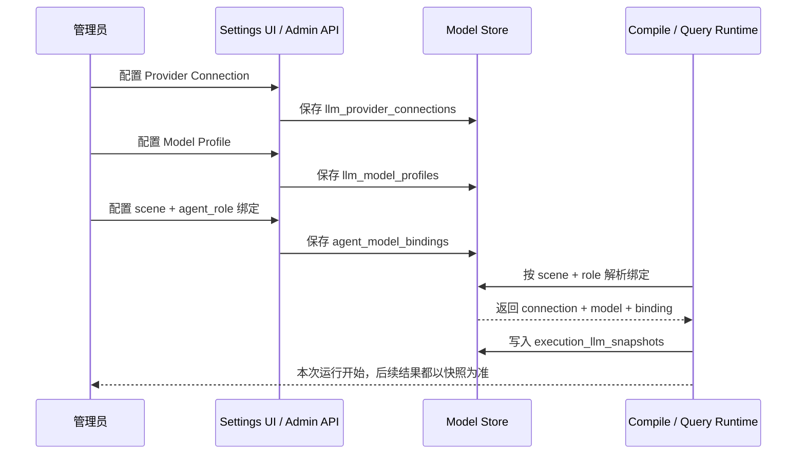

# 邪修智库（Lattice-java）

> 一个把资料编译成知识资产，再统一提供问答、反馈、治理和开发接入能力的 Java 后端。  
> 它的重点不是“上传文档 -> 检索 chunk -> 生成一句答案”，而是  
> `资料源 -> 知识编译 -> 证据化问答 -> 反馈沉淀 -> 快照治理 -> 多入口复用`。

如果你只想先判断这个项目值不值得继续看，先抓住 4 句话：

- 它消费的是编译后的知识资产，不是把原始 chunk 直接塞给模型。
- 它把 `compile graph` 和 `query graph` 做成了两条正式主链，而不是一条临时 prompt 流。
- 它把连接、模型、角色绑定和运行时快照做成了模型中心，而不是散落在页面和代码里的配置。
- 它把 Web、HTTP API、CLI、MCP 四类入口统一落到同一套知识后端，而不是各做各的。

`Spring Boot 3.5` · `Spring AI Alibaba Graph` · `PostgreSQL` · `Redis` · `OpenAI 兼容 / Anthropic / Ollama` · `Web / HTTP API / CLI / MCP`

---

## 30 秒看懂

- 它是什么：一个面向知识编译、问答、反馈和治理的 Java 后端，不只是一个聊天页面。
- 它解决什么问题：把散落在文档、代码、配置、PDF、Excel、Git Repo 里的资料，整理成可追踪、可回写、可回滚的知识资产。
- 它和普通 RAG 的分水岭：先编译知识，再问答；先冻结模型选路，再执行；先保留证据和状态，再决定是否沉淀为长期知识。
- 你应该怎么读它：先看本文的核心对象和主链路，再去看启动清单、验收手册和数据库结构文档。

## 项目精髓

这个项目真正的一等公民，不是“一次回答”，而是下面这些会留下痕迹、会继续演化、会反过来塑造系统的对象和链路：

- 资料源是正式对象，不只是一个目录路径。
- 知识资产是编译后的 `articles / article_chunks / article_source_refs`，不是裸 chunk。
- 问答结果不是终点，还会进入 `pending -> confirm/correct/discard -> contribution` 的反馈闭环。
- 模型配置不是临时参数，而是 `connection -> model -> binding -> execution snapshot` 的可追踪链路。
- 知识系统不只“能答”，还要能做 snapshot、history、rollback、lint、coverage、quality、vault export。

换句话说，邪修智库更像一个长期运行的知识后端，而不是一个临时问答 demo。

## 一等公民

| 维度 | 系统里的一等公民 | 为什么重要 |
| --- | --- | --- |
| 资料源 | `knowledge_sources`、`source_sync_runs`、`source_files` | 资料进入系统时就有身份、运行记录和来源边界，不是匿名文件堆 |
| 知识资产 | `articles`、`article_chunks`、`article_source_refs`、`article_snapshots` | 问答消费的是编译后的资产，同时保留证据和历史 |
| 编译任务 | `compile_jobs`、`compile_job_steps`、`synthesis_artifacts` | 编译不是黑盒，步骤、进度和产物都可观测 |
| 问答反馈 | `pending_queries`、`contributions` | 回答可以被确认、纠偏、丢弃，再沉淀回系统 |
| 模型中心 | `llm_provider_connections`、`llm_model_profiles`、`agent_model_bindings`、`execution_llm_snapshots` | 运行时到底走了哪个连接、模型和绑定，都能回溯 |
| 治理与版本 | `quality_metrics_history`、`repo_snapshots`、`repo_snapshot_items` | 知识库不是只会增长，还要能治理、导出、回滚和做质量分析 |

## 和传统 RAG 的分水岭

| 维度 | 常见 RAG | 邪修智库 |
| --- | --- | --- |
| 入口材料 | 原始 chunk 或临时切块 | 编译后的知识资产 |
| 主链路 | `retrieve -> answer` | 显式区分 `source sync`、`compile graph`、`query graph`、`feedback` |
| Agent 用法 | 一次 prompt 内自检 | 固定角色链：`writer / reviewer / fixer`、`answer / reviewer / rewrite` |
| 模型管理 | 页面参数或代码常量 | 连接、模型、绑定、快照四层拆开 |
| 证据处理 | 来源常停留在 prompt 上下文 | 引用、覆盖率、状态、demotion 进入正式返回结果 |
| 后续动作 | 回答结束即结束 | confirm/correct/discard、snapshot、rollback、vault export、治理工具链 |
| 对外能力 | 单页面或单接口 | Web、HTTP API、CLI、MCP 共用统一后端 |

---

## 系统真正的主链路



这张图只表达 3 件事：

- 资料先进入资料同步和解析层，再进入编译层，不会直接跳到问答层。
- 编译后的知识资产才是问答主链的输入，问答结果还会继续进入反馈和治理链路。
- 模型中心与文档解析路由都是横切能力，会同时影响编译和问答，但不会污染知识资产层的职责边界。

## 系统分层图



读这张图时，可以按下面的顺序理解：

- 入口层：`/admin`、`/admin/ask`、HTTP API、CLI、MCP 都是同一后端能力的不同入口。
- 应用服务层：负责把页面动作或外部调用整理成正式用例，而不是在 Controller 里硬堆逻辑。
- 编排与模型层：Compile / Query Graph、Agent 角色链、模型中心和执行快照都在这一层发生。
- 资产与治理层：知识文章、来源引用、Pending Query、Contribution、Snapshot、Quality、Coverage 都在这一层沉淀。
- 基础设施层：PostgreSQL、Redis、文档解析、Provider 连接、文件来源和 Spring Boot 运行时是最终落点。

---

## 关键时序图

### 1. 资料同步与文档解析



这一步的关键不是“能读文件”，而是：

- 文档解析层与编译层解耦，可以独立切换 Provider。
- 路由策略是显式配置，不需要改代码才能从本地提取器切到 OCR。
- 资料进入系统后先变成 `source_files / source_file_chunks`，再进入后续编译。

### 2. 编译入库与证据落盘



这条链路强调的是：

- 问答前先完成知识编译，系统消费的是文章资产而不是源文件碎片。
- 编译过程不仅产出文章，还会沉淀来源引用和步骤日志。
- 模型选路在运行时冻结成快照，后续配置变更不会改写历史执行事实。

### 3. 问答、证据校验与反馈沉淀



这里最重要的不是“答出来”，而是：

- 返回结果里不只有正文，还有引用、覆盖率、状态和执行痕迹。
- 问答失败、降级、部分回答和无知识命中都是正式状态，不是页面上的临时文案。
- 用户反馈会反哺系统，而不是停留在一条聊天记录里。

### 4. 模型中心与执行快照冻结



这一层是很多项目容易忽略、但这个项目很核心的部分：

- 连接、模型和绑定各自独立，避免“一个表单同时承载所有语义”。
- 运行时一定会冻结快照，才能解释“这次结果到底用了什么配置”。
- 编译侧和问答侧共用同一套模型中心，但可以绑定不同角色链。

## 模型中心里的 3 个 Scene

`/admin/settings` 里的角色绑定，不是随便配几行模型名，而是在给 3 条正式运行链路分配角色槽位：

| Scene | 角色 | 用在什么地方 | 什么时候会触发 |
| --- | --- | --- | --- |
| `compile` | `writer`、`reviewer`、`fixer` | 知识入库时的草稿生成、复核、修正 | 导入资料、Git 同步、触发 compile |
| `query` | `answer`、`reviewer`、`rewrite` | 常规问答时的直答、审查、改写 | 普通提问默认走这条链 |
| `deep_research` | `planner`、`researcher`、`synthesizer`、`reviewer` | 复杂问题的分层研究、证据抽取、综合收口 | `forceDeep=true`，或问题命中“对比 / 为什么 / 排查 / 调用链 / 影响 / 步骤”等复杂度规则 |

其中 `deep_research` 这一组最容易被忽略，但它其实是复杂问题链路的核心：

- `planner`：先把复杂问题拆成多层研究任务，不直接开答。
- `researcher`：对每个子任务做检索、抽事实、做证据卡，是最重的一步。
- `synthesizer`：把各层结果综合成最终答案，并做最后的引用收口。
- `reviewer`：作为深度研究场景的审查角色槽位一并冻结快照和校验完整性，保证这条链路不是“少配几个角色也照样糊弄跑”。

也就是说，页面里那组 `deep_research / planner / researcher / synthesizer / reviewer`，不是可有可无的展示项，而是系统在复杂问题场景下真正会用到的模型路由配置。

---

## 开发者应该怎么读这个仓库

### 先看哪些包

| 代码位置 | 主要职责 |
| --- | --- |
| `src/main/java/com/xbk/lattice/api/**` | HTTP 接口入口，分 admin、compiler、query 三类控制器 |
| `src/main/java/com/xbk/lattice/source/**` | 资料源、同步运行、源文件落库 |
| `src/main/java/com/xbk/lattice/documentparse/**` | 文档解析、Provider 连接、OCR 路由策略、本地提取器 |
| `src/main/java/com/xbk/lattice/compiler/**` | 编译 Graph、节点、Agent、Prompt、编译服务 |
| `src/main/java/com/xbk/lattice/query/**` | 检索、问答、证据、引用校验、deep research、Query Graph |
| `src/main/java/com/xbk/lattice/llm/**` | Provider 连接、模型档案、角色绑定、运行时快照 |
| `src/main/java/com/xbk/lattice/governance/**` | quality、coverage、lint、inspect、propagate、lifecycle、snapshot、rollback |
| `src/main/java/com/xbk/lattice/vault/**` | Vault 导出与同步 |
| `src/main/java/com/xbk/lattice/cli/**` | CLI 命令入口 |
| `src/main/java/com/xbk/lattice/mcp/**` | MCP 工具注册与桥接 |

### 推荐阅读顺序

1. 先从 `api/query` 或 `api/compiler` 看入口长什么样。
2. 再去 `query/**`、`compiler/**` 看两条主链怎么编排。
3. 然后看 `llm/**` 和 `documentparse/**`，理解横切配置层。
4. 最后再看 `governance/**`、`vault/**`，理解系统为什么不是“一问一答就结束”。

## 统一交付入口

这个项目不是只有一个后台页面。对开发者来说，真正需要记住的是下面这 4 个入口：

- `/admin`：资料导入、当前处理任务、编译任务、服务状态总览。
- `/admin/ask`：真实提问、查看答案正文、引用来源、证据状态、反馈入口。
- `/admin/settings`：Provider Connection、Model Profile、Agent Binding、向量配置、文档解析路由。
- `/admin/developer-access`：HTTP API、CLI、MCP 三种接入模板与服务地址。

这 4 个入口对应的是同一后端系统的 4 个面向，不是 4 套各自独立的产品。

## 适合什么项目

- 你要做的是一个可长期演进的知识系统后端，而不是聊天玩具。
- 你的资料同时散落在文档、代码、配置、PDF、Excel、运维手册和 Git Repo 里。
- 你需要让 Web 页面、内部工具、CLI、MCP 客户端复用同一套知识能力。
- 你关心回答质量、证据链、反馈沉淀、版本历史、回滚和导出。
- 你希望模型路由可配置、可冻结、可追踪，而不是散在页面参数和业务代码里。

## 不太适合什么项目

- 你只想搭一个最小向量检索 demo。
- 你只想验证“模型能不能答一句话”。
- 你不关心知识治理、反馈闭环、版本历史和多入口复用。
- 你只需要一个轻量聊天前台，不需要一个长期运行的知识后端。

---

## 快速开始

这里只保留稳定、长期有效的启动入口；按某一天、某一轮、某一套隔离环境得出的回归结果，请看独立验收手册。

### 环境

- JDK `21`
- PostgreSQL
- Redis
- Maven
- 可选：`pgvector`
- 可选：可用的 OpenAI 兼容 / Anthropic / Ollama / OCR Provider 密钥

### 最小启动命令

下面先给一组安全的最小启动命令，默认使用 `lattice` schema：

```bash
docker exec vector_db psql -U postgres -d ai-rag-knowledge \
  -c "CREATE SCHEMA IF NOT EXISTS lattice;"

export SPRING_PROFILES_ACTIVE=jdbc
export SPRING_DATASOURCE_URL='jdbc:postgresql://127.0.0.1:5432/ai-rag-knowledge?currentSchema=lattice'
export SPRING_DATASOURCE_USERNAME=postgres
export SPRING_DATASOURCE_PASSWORD=postgres
export SPRING_FLYWAY_ENABLED=true
export SPRING_FLYWAY_SCHEMAS=lattice
export SPRING_FLYWAY_DEFAULT_SCHEMA=lattice
export LATTICE_REDIS_HOST=127.0.0.1
export LATTICE_REDIS_PORT=6379
export LATTICE_LLM_BOOTSTRAP_ENABLED=true
export LATTICE_LLM_SECRET_ENCRYPTION_KEY='请设置一个 32+ 字节密钥'

mvn -q spring-boot:run
```

如果你本地 Maven 镜像握手不稳定，再临时改用：

```bash
mvn -q -s .codex/maven-settings.xml spring-boot:run
```

启动后，到 `/admin/settings` 配置你自己的对话模型、Embedding 模型、Agent 绑定和文档解析连接；密钥只保留在本地，不要写进仓库。

至少要配好的角色链有两组：

- 基础可用：`compile` 和 `query`
- 复杂问题可用：再补齐 `deep_research` 的 `planner / researcher / synthesizer / reviewer`

### 如果遇到旧迁移污染，再重建 schema

只有当你本地的 `lattice` schema 跑过旧版本迁移链时，才需要执行下面这组重建命令：

```bash
docker exec vector_db psql -U postgres -d ai-rag-knowledge \
  -c "DROP SCHEMA IF EXISTS lattice CASCADE; CREATE SCHEMA lattice;"
```

这是因为：

- 当前仓库的 Flyway 迁移已经收敛为单一基线 `V1__baseline_schema.sql`
- 如果你本地 schema 跑过旧迁移链，旧的 `flyway_schema_history` 可能还在
- 启动时会出现 `Migration checksum mismatch for migration version 1`
- 这时最稳妥的处理方式就是重建 schema，再重新启动

### 启动后 3 分钟首轮验证

下面这组步骤默认按常规启动口径使用 `8080`；如果你在做隔离验收，也可以把同样的步骤换成自己的独立端口。

1. 访问 `http://127.0.0.1:8080/actuator/health`
2. 打开 `http://127.0.0.1:8080/admin/settings`，配置连接、模型和 Agent 绑定
3. 打开 `http://127.0.0.1:8080/admin`，导入文件或 Git 仓库，触发编译
4. 打开 `http://127.0.0.1:8080/admin/ask`，提问并确认回答、引用和证据状态
5. 打开 `http://127.0.0.1:8080/admin/developer-access`，确认 HTTP API、CLI、MCP 接入方式

---

## 最小调用示例

下面这几组示例默认服务运行在 `http://127.0.0.1:8080`。如果你改了端口或域名，把示例里的 `BASE_URL` 一起替换掉就行。

### 1. HTTP API

先做健康检查，再走最小问答接口；如果你已经准备好了资料目录，也可以直接触发一次编译。

```bash
export BASE_URL=http://127.0.0.1:8080

curl "$BASE_URL/actuator/health"

curl -X POST "$BASE_URL/api/v1/query" \
  -H "Content-Type: application/json" \
  -d '{"question":"邪修智库支持哪些开发者接入方式？"}'

curl -X POST "$BASE_URL/api/v1/compile" \
  -H "Content-Type: application/json" \
  -d '{"sourceDir":"/path/to/your-source-dir","incremental":false}'
```

### 2. CLI

如果你只是想确认服务通不通，先跑 `status`；确认通了以后，再跑第一次 `query`。

```bash
./bin/lattice-cli status --server http://127.0.0.1:8080
./bin/lattice-cli query --server http://127.0.0.1:8080 "邪修智库支持哪些开发者接入方式？"
```

如果你会反复调用 CLI，可以先写一次环境变量：

```bash
export LATTICE_SERVER_URL=http://127.0.0.1:8080
./bin/lattice-cli status
./bin/lattice-cli query "邪修智库支持哪些开发者接入方式？"
```

#### CLI 子命令速查

| 子命令 | 说明 |
| --- | --- |
| `status` | 查看服务健康与知识库统计 |
| `query` | 提问并返回答案与来源引用 |
| `search` | 只检索，不生成答案 |
| `compile` | 触发编译任务 |
| `source-list` | 列出已注册的知识源 |
| `source-sync` | 触发指定知识源同步 |
| `lint` | 运行治理 lint 检查 |
| `history` | 查看文章快照历史 |
| `diff` | 查看 repo 变更对比 |
| `rollback` | 将文章回滚到指定快照 |
| `repo-baseline` | 设置 repo 基线 |
| `vault-export` | 导出知识库 vault |
| `vault-sync` | 同步 vault |
| `serve` | 以服务模式启动（内嵌 MCP stdio bridge） |

### 3. MCP

如果你的客户端支持远端 HTTP MCP，可以直接接这个地址：

```json
{
  "name": "lattice-http",
  "transport": {
    "type": "streamable-http",
    "url": "http://127.0.0.1:8080/mcp"
  }
}
```

如果你的客户端更适合本地命令方式，可以用仓库自带的 bridge：

```json
{
  "mcpServers": {
    "lattice-java": {
      "command": "bash",
      "args": [
        "-lc",
        "cd /path/to/lattice-java && ./bin/lattice-mcp-bridge http://127.0.0.1:8080/mcp"
      ]
    }
  }
}
```

接通后，建议按这个顺序做第一次验证：

1. 先执行 `tools/list`，确认能看到 30+ 个工具。
2. 再调用 `lattice_status`，确认返回健康状态与知识库统计。
3. 最后调用 `lattice_query`，确认返回 `answer`、`sourcePaths` 或 `pendingQueryId`。

MCP 工具覆盖的主要能力分组：

| 分组 | 工具 |
| --- | --- |
| 问答与反馈 | `lattice_query`、`lattice_query_pending`、`lattice_query_correct`、`lattice_query_confirm`、`lattice_query_discard` |
| 检索与文档 | `lattice_search`、`lattice_get`、`lattice_doc_toc`、`lattice_doc_read` |
| 编译与同步 | `lattice_compile`、`lattice_source_list`、`lattice_source_sync` |
| 治理 | `lattice_lint`、`lattice_lint_fix`、`lattice_quality`、`lattice_coverage`、`lattice_omissions`、`lattice_lifecycle`、`lattice_lifecycle_deprecate`、`lattice_lifecycle_archive`、`lattice_lifecycle_activate`、`lattice_link_enhance` |
| 巡检与传播 | `lattice_inspect`、`lattice_import_answers`、`lattice_correct`、`lattice_propagate` |
| 快照与历史 | `lattice_snapshot`、`lattice_history`、`lattice_rollback` |
| 状态 | `lattice_status` |

如果 `lattice_query` 产生了 pending 结果，记得继续 `confirm`、`correct` 或 `discard`，不要把待处理记录一直留在队列里。

---

## 文档导航

README 负责给出稳定总览；更细的启动、验收和表结构说明，分别在下面这些文档里：

### 想知道怎么启动与配环境

- [`docs/项目启动配置清单.md`](docs/%E9%A1%B9%E7%9B%AE%E5%90%AF%E5%8A%A8%E9%85%8D%E7%BD%AE%E6%B8%85%E5%8D%95.md)

### 想看全链路验收、页面回归与复杂样本

- [`docs/项目全流程真实验收手册.md`](docs/%E9%A1%B9%E7%9B%AE%E5%85%A8%E6%B5%81%E7%A8%8B%E7%9C%9F%E5%AE%9E%E9%AA%8C%E6%94%B6%E6%89%8B%E5%86%8C.md)

### 想看数据库对象、表关系和运行语义

- [`docs/数据库表结构详解.md`](docs/%E6%95%B0%E6%8D%AE%E5%BA%93%E8%A1%A8%E7%BB%93%E6%9E%84%E8%AF%A6%E8%A7%A3.md)

### 想看 benchmark / 指标对照

- [`docs/benchmark/ast-citation-deepresearch-gap-report.md`](docs/benchmark/ast-citation-deepresearch-gap-report.md)
- [`docs/benchmark/ast-citation-deepresearch-metrics.md`](docs/benchmark/ast-citation-deepresearch-metrics.md)

---

## 一句话总结

邪修智库不是“又一个带聊天页的 RAG demo”，而是一个把知识编译、模型中心、证据化问答、反馈沉淀、快照治理和多入口接入真正落到工程里的 Java 知识后端。
