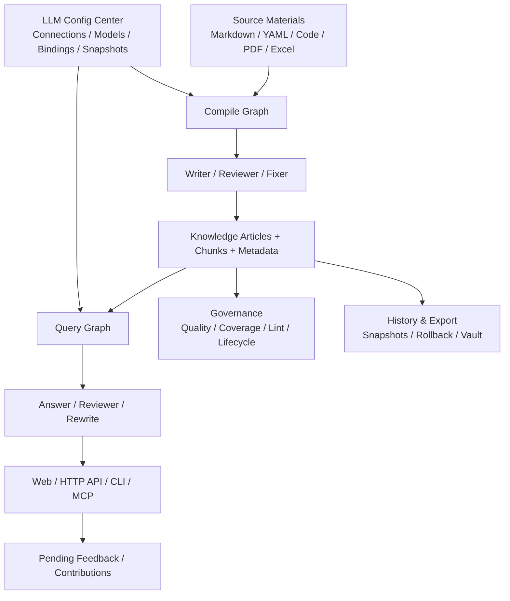

# Lattice

面向 AI 客户端的知识库与 MCP 后端。

**面向 AI 客户端的知识编译型知识库后端**

把分散在文档、配置、代码、PDF、Excel 等资料中的知识，编译成可审查、可治理、可回滚、可多入口消费的知识资产。

Lattice 不是一个“套壳聊天页面”，也不是一个只会做“切块 + 向量检索 + 生成答案”的传统 RAG Demo。它的核心目标，是把分散在文档、配置、代码、PDF、Excel 等资料里的知识，先编译成可治理、可审查、可回滚的知识资产，再通过 Web、HTTP API、CLI、MCP 等统一入口稳定地提供给人和 AI 客户端使用。

如果只用一句话概括：

> 传统 RAG 更像“从碎片里现找答案”，Lattice 更像“先把知识编译成结构化资产，再让系统基于这套资产回答、治理、沉淀和演进”。

---

## 30 秒快速理解

如果你只有半分钟，这个项目可以直接这样理解：

- 它不是聊天前台，而是知识系统后端。
- 它不是只做检索，而是先做知识编译，再做问答与治理。
- 它不是单次回答项目，而是把编译、问答、反馈、版本、导出连成闭环。
- 它不是单入口工具，而是同时面向 Web、HTTP API、CLI、MCP。

再压缩成 4 个关键词：

- 知识编译
- 图编排
- 反馈闭环
- 治理型 RAG

---

## 这份 README 适合谁看

如果你属于下面任意一种角色，这份 README 对你都应该有价值：

- 想做企业知识库后端，而不满足于一个简单 RAG Demo 的工程师
- 想给 AI 客户端接一个真正可治理知识后端的架构师
- 想理解“知识编译型系统”和“传统检索增强生成”差异的产品负责人
- 想评估 Spring AI Alibaba Graph、固定角色 Agent、模型快照治理是否真正落地的人

如果你主要关心的是“今天怎么把服务跑起来”，可以直接跳到后面的 [快速开始](#快速开始) 或 [文档导航](#文档导航)。

---

## 项目名片

| 维度 | 内容 |
| --- | --- |
| 项目定位 | 面向 AI 客户端的知识库与 MCP 后端 |
| 核心范式 | 知识编译型知识库，而不是纯检索拼接型 RAG |
| 主编排骨架 | Spring AI Alibaba Graph |
| 主要角色 | 编译侧：`writer / reviewer / fixer`；问答侧：`answer / reviewer / rewrite` |
| 主要入口 | Web、HTTP API、CLI、MCP |
| 核心资产 | `articles`、`contributions`、`execution_llm_snapshots`、`article_snapshots`、`repo_snapshots` |
| 产品面拆分 | `/admin`、`/admin/ask`、`/admin/ai` |
| 关键词 | 知识编译、治理型 RAG、MCP 后端、反馈闭环 |

---

## 项目是什么

`Lattice-java` 当前可以被准确理解为 4 个东西的组合：

1. 一个知识编译型知识库后端。
2. 一个以 Spring Boot + PostgreSQL + Redis 为基础设施的服务。
3. 一个以 Spring AI Alibaba Graph 为主编排骨架的 compile / query 系统。
4. 一个同时服务 Web 页面、HTTP API、CLI、MCP 客户端的统一知识服务层。

它不追求做“大而全平台”，而是聚焦在一件事上：

- 把复杂资料变成高质量知识资产。
- 把知识资产稳定暴露给 AI 客户端和人类使用者。
- 把回答、反馈、治理、导出、版本历史串成一个闭环。

---

## 它解决什么问题

传统企业知识库或传统 RAG，通常会遇到下面这些问题：

- 资料很多，但分散在 Markdown、YAML、Java、PDF、Excel、ADR、Runbook 里，难以统一消费。
- 检索只能命中碎片，答案容易拼凑、不稳定、上下文不完整。
- 资料更新后，系统不知道哪些知识该重编、哪些答案该修正。
- 用户反馈来了，往往只是留在聊天记录里，无法真正沉淀回知识库。
- 多入口系统经常各用各的逻辑，Web、API、CLI、MCP 之间语义不一致。
- 知识库缺少版本治理，出了问题很难回答“是谁改的、什么时候改的、能不能回滚”。
- 模型路由混乱，运行时到底用了哪个模型、哪条绑定、哪次快照，经常说不清楚。

Lattice 的设计，就是围绕这些问题展开的。

它不是把“检索”当成唯一核心，而是把下面这条链路当成主线：

`源资料 -> 编译 -> 审查 -> 修复 -> 持久化 -> 问答 -> 反馈 -> 治理 -> 导出/回滚`

---

## 一个具体例子

假设你的知识来源同时包含下面这些内容：

- 一份 Markdown 版支付熔断规则
- 一份 YAML 配置
- 一段 Java 重试逻辑
- 一份 PDF 操作手册
- 一份 Excel 补推模板

在传统 RAG 里，系统大概率会这样工作：

1. 把它们全部切块。
2. 问题来了以后检索若干片段。
3. 把片段拼进 prompt。
4. 让模型现场组织答案。

这类方式的问题是：

- 回答高度依赖临场检索命中。
- 同一问题在不同时间可能得到不同拼接结果。
- 用户纠错之后，系统通常没有真正沉淀机制。
- 很难治理“这条知识到底来自哪、改过几次、能不能回退”。

而在 Lattice 里，系统更倾向于先做这些事：

1. ingest 原始资料。
2. 分析并合并概念。
3. 生成知识文章草稿。
4. 审查草稿。
5. 必要时自动修复。
6. 持久化成文章、切片、元数据、来源关系。
7. 问答时再基于这层知识资产生成答案。
8. 用户反馈后进入 pending，再决定 confirm、correct 还是 discard。

这样做的直接收益是：

- 问答消费的是“编译后的知识”，不是只有原始碎片。
- 知识质量有显式审查环节。
- 反馈会沉淀，而不是消失在会话中。
- 文章、快照、导出、回滚都能纳入治理。

这就是 Lattice 和普通“检索增强聊天”最本质的差异。

---

## 它能做什么

当前项目已经形成 5 组清晰能力。

### 1. 知识编译

- 支持从目录型知识源导入资料。
- 已在真实验收中覆盖 `md`、`yaml`、`json`、`java`、`pdf`、`xlsx`、`drawio`、`png` 等类型。
- 把源资料转成文章、文章切片、来源关联、结构化元数据等知识资产。
- 支持全量编译与增量编译。
- 编译链路不是黑盒，而是可观察、可追踪、可回环的图编排流程。

### 2. 知识问答

- 提供基于知识库的问答能力。
- 不只依赖单一路径检索，而是融合 FTS、来源命中、文章命中、贡献命中等多种信号。
- Query 侧本身也走图编排，不是简单 `search -> answer` 一步到底。
- 问答链路支持 `answer / reviewer / rewrite` 三角色运行时快照冻结。
- 页面问答会展示引用来源，避免只给“黑盒答案”。

### 3. 反馈闭环

- 问答结果不会停留在一次性回答。
- 支持 `correct -> confirm`、直接 `confirm`、`discard`。
- 已确认的反馈可以沉淀为 contribution，进入长期知识资产。
- 反馈链路通过 pending query 管理，不是散落在聊天历史里。

### 4. 治理与版本

- 支持 quality、coverage、omissions、lint 等治理能力。
- 支持文章生命周期切换。
- 支持文章级 snapshot、history、rollback。
- 支持整库级 repo snapshot 能力。
- 支持 Vault export / sync，把知识资产导出到可管理目录。

### 5. 多入口交付

- Web 页面
- HTTP API
- CLI
- MCP

这意味着 Lattice 不只是一个“给人点点点的后台”，也不是一个“只能给 AI 用的 MCP 服务”，而是一个统一知识服务层。

---

## 核心理念

Lattice 的核心不是“多加几个模型”，而是下面几条设计原则。

### 1. 先编译知识，再消费知识

Lattice 不是直接把原始资料切块后丢给检索器，然后让模型现场拼答案。它更强调先把资料整理、归并、抽象、审查成知识文章，再在问答时消费这层知识资产。

这带来的变化是：

- 查询不再只能依赖原始碎片。
- 知识可以被治理、追踪和回滚。
- 资料和答案之间不再只有一次性的 prompt 关系。

### 2. Graph 是主骨架，不是装饰层

项目核心流程不是“大 Service 里串十几个方法”，而是基于 Spring AI Alibaba Graph 明确建模：

- compile graph
- query graph
- 条件边
- 生命周期监听
- 节点级步骤日志
- 失败后的修复回环

也就是说，Graph 在这里不是“包装器”，而是主编排层。

### 3. Agent 是固定角色，不是放飞自我的自治体

Lattice 里的 Agent 更像固定职责角色，而不是自由 Agent 社会。

当前核心角色包括：

- compile 侧：`writer / reviewer / fixer`
- query 侧：`answer / reviewer / rewrite`

Graph 决定流程怎么走，Agent 负责执行高认知动作，两者职责边界是明确的。

### 4. 模型路由必须可治理

Lattice 不把模型调用当成“前端随便传个 model name”这么简单。

它强调：

- 连接配置
- 模型配置
- Agent 绑定
- 运行时快照冻结

这让系统可以回答：

- 这次 compile 或 query 到底用了哪个连接、哪个模型、哪条绑定。
- 配置改动后会影响哪些新任务，不会污染哪些旧任务。

### 5. 用户页和内部配置页必须分离

普通用户的目标是：

- 导资料
- 看处理状态
- 提问题

不是去理解：

- temperature
- timeout
- fallback
- route label
- token 价格

所以当前产品面已经拆成：

- `/admin`
  - 面向用户的知识库管理页
- `/admin/ask`
  - 面向用户的知识问答页
- `/admin/ai`
  - 面向内部维护的 AI 接入页

这不是“多做一个页面”，而是在产品心智上把“用知识库”和“配模型”彻底分离。

---

## 核心架构

从职责上看，Lattice 可以概括为下面几层：



如果换成更偏工程视角的说法，当前系统可分为：

- Trigger 层
  - Web Controller
  - CLI
  - MCP Tools
- Case 层
  - Compile Application Facade
  - Query Facade
  - Graph Orchestrator
- Domain 层
  - 编译、审查、修复、持久化、检索、导出等核心服务
  - 固定角色 Agent
- Infrastructure 层
  - PostgreSQL
  - Redis
  - LLM Client
  - Vault / Repo Snapshot

---

## 核心对象

如果你第一次接触这个项目，理解下面几个对象会很有帮助。

| 对象 | 作用 | 不是谁 |
| --- | --- | --- |
| `source_files` | 原始资料文件记录 | 不是最终知识 |
| `source_file_chunks` | 源资料切片 | 不是最终回答单元 |
| `articles` | 编译后的知识文章 | 是系统最重要的知识资产之一 |
| `article_chunks` | 文章级切片 | 服务于检索和回答 |
| `pending_queries` | 待确认问答记录 | 不是最终沉淀结果 |
| `contributions` | 已确认反馈沉淀 | 是知识演进的一部分 |
| `execution_llm_snapshots` | 运行时冻结模型快照 | 解决“本次到底用了什么模型” |
| `article_snapshots` | 单篇文章历史版本 | 支持文章级回滚 |
| `repo_snapshots` | 整库级快照 | 支持整库级治理与审计 |

这个对象模型体现了一个很重要的观点：

- Lattice 不把“回答”当成唯一产出。
- 它同时把“知识资产”“反馈资产”“配置快照”“版本历史”都当成正式一等公民。

---

## 与传统 RAG 的区别

下面这张表，是理解 Lattice 最重要的一部分。

| 维度 | 传统 RAG | Lattice |
| --- | --- | --- |
| 核心思路 | 先检索碎片，再现场生成答案 | 先把知识编译成资产，再基于资产问答 |
| 知识单元 | 以 chunk 为主 | 同时有 source、article、chunk、contribution 多层资产 |
| 编译流程 | 往往很薄，甚至没有 compile 概念 | 有明确的 `compile -> review -> fix -> persist` 图编排 |
| 审查机制 | 常见做法是没有，或仅 prompt 内自检 | 审查和修复是显式节点与角色 |
| 增量更新 | 常见是重切块、重嵌入 | 有增量编译语义和图内分支 |
| 模型管理 | 通常散在业务代码或页面参数中 | 统一连接、模型、Agent 绑定、运行时快照 |
| 反馈闭环 | 多数停留在聊天日志 | 有 pending、confirm、discard、contribution 沉淀 |
| 治理能力 | 通常较弱 | 有 quality、coverage、lint、lifecycle、snapshot、rollback、export |
| 多入口一致性 | Web、API、CLI、MCP 常常各自为政 | 统一后端能力，对外多入口复用 |
| 产品心智 | 用户经常直接面对模型配置 | 用户页与内部 AI 接入页已经拆分 |

如果只看“能不能回答问题”，传统 RAG 和 Lattice 都可以做。但如果你关心的是：

- 知识质量是否稳定
- 回答是否可追踪
- 反馈能不能沉淀
- 模型路由能不能治理
- 版本问题能不能回滚
- 多入口能不能统一

那 Lattice 明显不是同一类产品。

---

## 这个项目的特别之处

下面这些点，是 Lattice 相比普通知识库项目真正有辨识度的地方。

### 1. 它是“知识编译型”而不是“检索拼接型”

这意味着系统更重视：

- 知识形成
- 知识质量
- 知识治理

而不是只重视“检索召回率”。

### 2. compile 和 query 都图化了

很多系统只会把离线导入做成脚本，把在线问答做成简单请求链。Lattice 把 compile 和 query 两条主链都纳入图编排，因而更适合做：

- 条件分支
- 失败回环
- 节点级观测
- 角色化路由

### 3. Agent 角色是固定职责，而不是概念噱头

Lattice 没有把 Agent 当成市场化词汇，而是落到了明确角色和明确职责上。

这让“Writer / Reviewer / Fixer”“Answer / Reviewer / Rewrite”不只是宣传语，而是系统骨架的一部分。

### 4. 模型配置中心不是摆设，而是运行时契约

很多项目的“模型配置”只是一个页面表单；Lattice 的模型配置中心会真正影响：

- compile 路由
- query 路由
- 运行时快照冻结
- 新旧任务隔离

这让模型配置从“运维杂项”升级成了系统契约。

### 5. 用户体验不是让所有人都懂 LLM

当前产品面有一个非常清楚的取舍：

- 普通用户只需要导资料、看状态、提问题
- 内部维护者才需要关心连接、模型、Agent 绑定

这个取舍看起来朴素，但其实非常重要，因为它避免了把单项目系统过度平台化。

### 6. 它天然适合做 AI 客户端后端

因为它本身就是：

- Web 可用
- HTTP 可用
- CLI 可用
- MCP 可用

所以它适合挂在 AI 客户端后面，成为“知识与治理后端”，而不只是一个页面后台。

---

## 核心亮点

如果把这个项目的亮点压缩成一组清单，可以概括为：

- 知识编译主线明确，不是一次性 prompt 项目。
- compile / query 双图编排。
- Graph + 固定角色 Agent 的混合架构。
- 统一模型中心与运行时快照冻结。
- 支持 Web、HTTP API、CLI、MCP 多入口复用。
- 具备 pending feedback 闭环。
- 具备 snapshot / rollback / vault export 等治理能力。
- 用户页面与内部 AI 接入页面彻底分离。

---

## 适合什么场景

Lattice 更适合下面这类问题：

- 企业内部知识散落在多种资料格式中，需要统一编译和查询。
- 不是只想做聊天，而是想沉淀“长期可治理的知识资产”。
- 需要给 AI 客户端提供 MCP 或 API 形式的知识后端。
- 希望问答、反馈、治理、导出在同一套系统里闭环。
- 希望模型调用不是不可见黑盒，而是可配置、可冻结、可追踪。

它尤其适合这种资料组合：

- SOP / Runbook
- ADR / 架构说明
- 配置文件
- 代码片段
- PDF 手册
- Excel 模板
- 运维文档

---

## 不适合什么场景

如果你的目标只是下面这些，Lattice 可能反而偏重：

- 做一个最小化的向量检索 Demo
- 只想快速验证“能不能回答一句话”
- 不关心反馈沉淀、治理、版本历史
- 不需要 CLI / MCP / 多入口统一

换句话说，Lattice 更像“知识系统后端”，而不是“一个轻量聊天玩具”。

---

## 当前项目状态

基于 **2026-04-18** 这轮真实验收，项目主链路已经真实跑通：

- 独立 schema 启动
- AI 接入页配置
- 复杂知识源全量编译
- 增量编译
- Query 问答
- pending query `correct -> confirm` / `discard`
- Admin 治理接口
- CLI remote / standalone
- MCP raw HTTP
- Vault 导出
- 文章级快照、历史与回滚

当前真实结论包括：

- compile / query 已共享统一连接、模型、Agent 绑定与快照能力
- `/admin`、`/admin/ask`、`/admin/ai` 三页已经拆分
- Query `answer / reviewer / rewrite` 已真实冻结到 `execution_llm_snapshots`
- CLI remote 已补验 `compile / status / search / query / vault-export`
- MCP HTTP 端点已真实跑通 `initialize / tools/list / lattice_status / lattice_query`

当前仍需接受的限制包括：

- 某些真实 embedding 网关下，向量检索仍可能因 embeddings 接口异常而降级
- Admin 文章纠错接口还没有在当前网关组合下完全打通
- 整库 repo diff / rollback 还没有完成最新一轮完整真实回归

更细的样本、命令、验收结果与限制，请看：

- [`docs/项目全流程真实验收手册.md`](docs/%E9%A1%B9%E7%9B%AE%E5%85%A8%E6%B5%81%E7%A8%8B%E7%9C%9F%E5%AE%9E%E9%AA%8C%E6%94%B6%E6%89%8B%E5%86%8C.md)

---

## 产品使用路径

当前最核心的实际使用路径是：

1. 启动服务。
2. 打开 `/admin/ai` 配好连接、模型、Agent 绑定。
3. 打开 `/admin` 上传资料或同步目录，触发知识编译。
4. 在 `/admin` 查看作业状态、文章列表和知识详情。
5. 打开 `/admin/ask` 直接提问，查看回答和引用来源。
6. 需要治理时，再通过 Admin 接口、CLI、MCP 做反馈、治理、导出、回滚。

这条路径体现的是一个非常明确的产品取向：

- 用户先接触知识，不先接触模型。
- 内部维护先维护路由和能力，再让用户使用知识库。

---

## 快速开始

这里只保留一个简版 Quick Start，详细步骤请看独立文档。

### 环境

- JDK `21`
- PostgreSQL
- Redis
- Maven

### 最小启动口径

```bash
docker exec vector_db psql -U postgres -d ai-rag-knowledge \
  -c "CREATE SCHEMA IF NOT EXISTS lattice;"

export SPRING_PROFILES_ACTIVE=jdbc
export SPRING_DATASOURCE_URL='jdbc:postgresql://127.0.0.1:5432/ai-rag-knowledge?currentSchema=lattice'
export SPRING_DATASOURCE_USERNAME=postgres
export SPRING_DATASOURCE_PASSWORD=postgres
export SPRING_FLYWAY_ENABLED=true
export SPRING_FLYWAY_SCHEMAS=lattice
export SPRING_FLYWAY_DEFAULT_SCHEMA=lattice
export LATTICE_REDIS_HOST=127.0.0.1
export LATTICE_REDIS_PORT=6379
export LATTICE_LLM_BOOTSTRAP_ENABLED=true
export LATTICE_LLM_SECRET_ENCRYPTION_KEY='请设置一个 32+ 字节密钥'

mvn -q -s .codex/maven-settings.xml spring-boot:run
```

### 启动后最小验证

```bash
curl http://127.0.0.1:8080/actuator/health
```

### 启动后第一轮页面验收

1. 打开 `http://127.0.0.1:8080/admin/ai`
2. 配置连接、模型、Agent 绑定
3. 打开 `http://127.0.0.1:8080/admin`
4. 导入资料或同步目录
5. 打开 `http://127.0.0.1:8080/admin/ask`
6. 直接提问并确认回答与引用来源

---

## 文档导航

### 想知道怎么启动

- [`.codex/项目启动配置清单.md`](.codex/%E9%A1%B9%E7%9B%AE%E5%90%AF%E5%8A%A8%E9%85%8D%E7%BD%AE%E6%B8%85%E5%8D%95.md)

### 想知道当前真实跑通了什么

- [`docs/项目全流程真实验收手册.md`](docs/%E9%A1%B9%E7%9B%AE%E5%85%A8%E6%B5%81%E7%A8%8B%E7%9C%9F%E5%AE%9E%E9%AA%8C%E6%94%B6%E6%89%8B%E5%86%8C.md)

### 想知道为什么这样设计

- [`.codex/Spring AI Alibaba Graph 完整接入设计方案.md`](.codex/Spring%20AI%20Alibaba%20Graph%20%E5%AE%8C%E6%95%B4%E6%8E%A5%E5%85%A5%E8%AE%BE%E8%AE%A1%E6%96%B9%E6%A1%88.md)

### 想知道数据库对象和实体关系

- [`docs/数据库表结构详解.md`](docs/%E6%95%B0%E6%8D%AE%E5%BA%93%E8%A1%A8%E7%BB%93%E6%9E%84%E8%AF%A6%E8%A7%A3.md)

---

## 一句话结论

Lattice 的特别之处，不在于“也能接大模型”，而在于它把企业知识系统真正做成了：

- 可编译
- 可审查
- 可修复
- 可查询
- 可反馈
- 可治理
- 可导出
- 可回滚

的统一后端。
