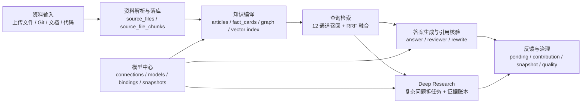

# 邪修智库（Lattice-java）

邪修智库是一个证据型知识问答与治理工作台：先把资料编译成可检索、可审计的知识资产，再通过 React 工作台、HTTP API、CLI 和 MCP 提供问答、Deep Research、反馈与知识治理能力。

它不是“上传文档 -> 切 chunk -> 问模型”的最小 RAG demo。当前项目的核心是四条主线：

| 主线 | 说明 | 入口文档 |
|---|---|---|
| 知识编译 | 原始资料如何变成文章、Fact Card、Terminal Unit、代码图谱和向量索引 | [`docs/核心架构/编译流水线.md`](docs/%E6%A0%B8%E5%BF%83%E6%9E%B6%E6%9E%84/%E7%BC%96%E8%AF%91%E6%B5%81%E6%B0%B4%E7%BA%BF.md) |
| 查询检索 | 用户问题如何经过短路、检索、RRF 融合、答案生成、审查和引用核验 | [`docs/核心架构/查询检索流水线.md`](docs/%E6%A0%B8%E5%BF%83%E6%9E%B6%E6%9E%84/%E6%9F%A5%E8%AF%A2%E6%A3%80%E7%B4%A2%E6%B5%81%E6%B0%B4%E7%BA%BF.md) |
| Deep Research | 复杂问题如何拆任务、检索证据、形成证据账本并合成引用答案 | [`docs/核心架构/Deep-Research流水线.md`](docs/%E6%A0%B8%E5%BF%83%E6%9E%B6%E6%9E%84/Deep-Research%E6%B5%81%E6%B0%B4%E7%BA%BF.md) |
| 模型中心 | Provider 连接、模型档案、Agent 绑定、执行快照、Embedding 旁路如何工作 | [`docs/核心架构/模型中心与执行快照.md`](docs/%E6%A0%B8%E5%BF%83%E6%9E%B6%E6%9E%84/%E6%A8%A1%E5%9E%8B%E4%B8%AD%E5%BF%83%E4%B8%8E%E6%89%A7%E8%A1%8C%E5%BF%AB%E7%85%A7.md) |

## 当前技术基线

| 项 | 当前口径 |
|---|---|
| JDK | 21 |
| Node / npm | `24.18.0` / `11.16.0` |
| 前端 | React 19 + TypeScript 6 + Vite 8，源码位于 `frontend/` |
| Spring Boot | 3.5.1 |
| Spring AI | 1.1.2 |
| Spring AI Alibaba Graph | 1.1.2.0 |
| 数据库 | PostgreSQL，业务 schema 固定为 `lattice` |
| 缓存 | Redis |
| 向量 | pgvector，当前索引表按 `src/main/resources/db/schema.sql` 创建 |
| DDL | 不使用 Flyway；显式执行 `scripts/reset-lattice-schema.sh` |
| 本地开发入口 | `scripts/run-local-dev.sh`，默认端口 `18082` |
| 生产制品 | Maven 内置隔离 Node/npm 工具链，将 `/app/*` 打入单一 Spring Boot JAR |

## 系统骨架


```mermaid
flowchart LR
    A["资料输入<br/>上传文件 / Git / 文档 / 代码"] --> B["资料解析与落库<br/>source_files / source_file_chunks"]
    B --> C["知识编译<br/>articles / fact_cards / graph / vector index"]
    C --> D["查询检索<br/>12 通道召回 + RRF 融合"]
    D --> E["答案生成与引用核验<br/>answer / reviewer / rewrite"]
    D --> F["Deep Research<br/>复杂问题拆任务 + 证据账本"]
    E --> G["反馈与治理<br/>pending / contribution / snapshot / quality"]
    F --> G
    H["模型中心<br/>connections / models / bindings / snapshots"] --> C
    H --> E
    H --> F
```

这张图只表达当前主干关系：资料先编译成知识资产，查询再消费这些资产；普通问答和 Deep Research 共用检索物料；模型中心横切编译、查询和 Deep Research。

## 主要入口

### Web 页面

| 页面 | 用途 |
|---|---|
| `/app/ask` | 智能/快速/深度问答、引用核验与反馈 |
| `/app/library/sources` | 本地文件、Git、Internal Mirror、服务端目录和直接编译入口 |
| `/app/library/articles` | 文章搜索、详情、来源追溯与文章治理 |
| `/app/library/quality` | 质量、覆盖率、知识检查、链接增强与 Fact Card |
| `/app/activity` | source run、processing task 和 compile job 统一处理中心 |
| `/app/reviews` / `/app/feedback` | 编译审核、Query Pending 和结果反馈治理 |
| `/app/settings/*` | 模型、向量、解析、检索参数和高风险维护 |
| `/app/developer` | HTTP API、CLI、MCP 接入说明与健康检查 |

`/app` 进入问答页，所有无扩展名的 `/app/*` 深链接支持 SPA fallback。旧 `/admin/*` 页面已直接退役并返回 404，`/api/v1/admin/*` 业务 API 不受影响。

### HTTP API

| API | 用途 |
|---|---|
| `POST /api/v1/compile` | 触发编译 |
| `POST /api/v1/compile/retry` | 重试编译 |
| `POST /api/v1/query` | 普通查询入口；内部可能路由到 Deep Research |
| `GET /api/v1/search` | 只检索，不生成答案 |
| `/api/v1/admin/llm/**` | Provider 连接、模型档案、Agent 绑定 |
| `/api/v1/admin/vector/**` | 向量配置、状态和重建 |

### CLI / MCP

| 入口 | 文件 |
|---|---|
| CLI | [`bin/lattice-cli`](bin/lattice-cli) |
| MCP bridge | [`bin/lattice-mcp-bridge`](bin/lattice-mcp-bridge) |
| HTTP MCP | `/mcp` |

## 快速启动

本地联调优先使用项目脚本，固定走 `local-dev` profile、`lattice` schema 和默认端口 `18082`。

```bash
./scripts/run-local-dev.sh --reset-schema
```

如果不需要重建 schema：

```bash
./scripts/run-local-dev.sh
```

启动后检查：

```bash
curl http://127.0.0.1:18082/actuator/health
```

然后打开：

- `http://127.0.0.1:18082/app/ask`
- `http://127.0.0.1:18082/app/library/sources`
- `http://127.0.0.1:18082/app/settings/models`

修改前端源码时，保持后端 `18082` 运行，另开终端启动 Vite HMR：

```bash
cd frontend
npm ci
npm run dev
```

开发态访问 `http://127.0.0.1:5173/app/ask`，Vite 会将 `/api`、`/actuator` 和 `/mcp` 代理到 `18082`。

更完整的依赖、数据库、容器和验收步骤见 [`docs/项目启动配置清单.md`](docs/%E9%A1%B9%E7%9B%AE%E5%90%AF%E5%8A%A8%E9%85%8D%E7%BD%AE%E6%B8%85%E5%8D%95.md)。

## 模型与向量配置

首次启动后，需要在 `/app/settings/models`、`/app/settings/vector`、`/app/settings/parsing` 或 Admin API 中配置：

| 配置 | 说明 |
|---|---|
| Provider Connection | OpenAI-compatible / Anthropic 等连接，API Key 加密保存 |
| Model Profile | CHAT 或 EMBEDDING 模型档案 |
| Agent Binding | `scene + role -> CHAT model profile` |
| Vector Config | 当前 Embedding profile |
| Document Parse Route | 文档解析 Provider 与后整理模型 |

当前 Agent 绑定角色：

| Scene | 角色 |
|---|---|
| `compile` | `writer`、`reviewer`、`fixer`、`field-alias-enricher` |
| `query` | `answer`、`reviewer`、`rewrite` |
| `deep_research` | `planner`、`researcher`、`synthesizer`、`reviewer` |

配置示例和注意事项见 [`docs/核心架构/模型绑定配置参考.md`](docs/%E6%A0%B8%E5%BF%83%E6%9E%B6%E6%9E%84/%E6%A8%A1%E5%9E%8B%E7%BB%91%E5%AE%9A%E9%85%8D%E7%BD%AE%E5%8F%82%E8%80%83.md)。

## 代码目录

| 目录 | 说明 |
|---|---|
| `src/main/java/com/xbk/lattice/api/**` | Web/API 入口，包含 admin、compiler、query 控制器 |
| `src/main/java/com/xbk/lattice/source/**` | 资料源、同步运行、源文件落库 |
| `src/main/java/com/xbk/lattice/documentparse/**` | 文档解析、OCR Provider、本地提取器、解析路由策略 |
| `src/main/java/com/xbk/lattice/compiler/**` | 编译 Graph、节点、Agent、Fact Card、图谱和索引服务 |
| `src/main/java/com/xbk/lattice/query/**` | 检索、普通问答、结构化查询、引用核验、Deep Research |
| `src/main/java/com/xbk/lattice/llm/**` | 模型中心、执行快照、Provider 客户端和调用网关 |
| `src/main/java/com/xbk/lattice/governance/**` | 质量、覆盖率、lint、inspect、propagate、snapshot、rollback |
| `src/main/java/com/xbk/lattice/cli/**` | CLI 命令入口 |
| `src/main/java/com/xbk/lattice/mcp/**` | MCP 工具注册与桥接 |
| `src/main/resources/db/schema.sql` | 当前唯一 DDL 基线 |
| `src/main/java/com/xbk/lattice/api/web/**` | `/app/*` SPA fallback 与静态资源缓存边界 |
| `frontend/src/**` | React 工作台源码、类型化 API Client 和组件测试 |
| `frontend/e2e/**` | Playwright 路由、可访问性与响应式门禁 |
| `target/generated-resources/frontend/static/app/**` | Vite 生产产物；由构建生成，不提交 Git |

## 常用命令

```bash
# 重建 lattice schema
./scripts/reset-lattice-schema.sh

# 本地开发启动
./scripts/run-local-dev.sh

# 本地开发启动并重建 schema
./scripts/run-local-dev.sh --reset-schema

# 查询回归
./scripts/run-query-regression.sh

# 红线扫描
bash scripts/scan-redline.sh special_cases_report.md

# 前端独立门禁
cd frontend
npm ci
npm run lint
npm run typecheck
npm run test
npm run build
npm run test:e2e

# JDK 21 Maven 单制品构建：会使用隔离 Node/npm 重跑前端门禁
cd ..
export JAVA_HOME="$(/usr/libexec/java_home -v 21)"
mvn -s .codex/maven-settings.xml clean package
```

如果本机 Maven 镜像握手不稳定，可临时使用项目内 `.codex/maven-settings.xml`。当前项目约定仍以全局本地仓库 `/Users/sxie/maven/repository` 为主。

## 文档导航

| 想了解 | 文档 |
|---|---|
| 项目如何启动、依赖哪些容器和配置 | [`docs/项目启动配置清单.md`](docs/%E9%A1%B9%E7%9B%AE%E5%90%AF%E5%8A%A8%E9%85%8D%E7%BD%AE%E6%B8%85%E5%8D%95.md) |
| 全链路真实验收怎么跑 | [`docs/项目全流程真实验收手册.md`](docs/%E9%A1%B9%E7%9B%AE%E5%85%A8%E6%B5%81%E7%A8%8B%E7%9C%9F%E5%AE%9E%E9%AA%8C%E6%94%B6%E6%89%8B%E5%86%8C.md) |
| 数据库表和关系 | [`docs/数据库表结构详解.md`](docs/%E6%95%B0%E6%8D%AE%E5%BA%93%E8%A1%A8%E7%BB%93%E6%9E%84%E8%AF%A6%E8%A7%A3.md) |
| 文档识别、OCR、解析路由 | [`docs/文档识别与OCR运行态说明.md`](docs/%E6%96%87%E6%A1%A3%E8%AF%86%E5%88%AB%E4%B8%8EOCR%E8%BF%90%E8%A1%8C%E6%80%81%E8%AF%B4%E6%98%8E.md) |
| 模型中心配置步骤 | [`docs/核心架构/模型绑定配置参考.md`](docs/%E6%A0%B8%E5%BF%83%E6%9E%B6%E6%9E%84/%E6%A8%A1%E5%9E%8B%E7%BB%91%E5%AE%9A%E9%85%8D%E7%BD%AE%E5%8F%82%E8%80%83.md) |
| 质量推进与踩坑记录 | [`docs/quality-progress-and-lessons.md`](docs/quality-progress-and-lessons.md) |

## 项目判断

如果你要理解这个项目，优先读四份核心文档，而不是从旧报告或历史计划里找入口。README 只保留稳定导航；具体流程以四份核心文档和启动/验收清单为准。
