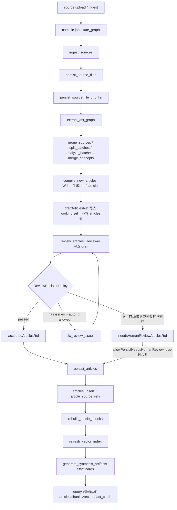

# 编译入库链路运行态审计报告

## 结论

结论归类：**F. 其他**。

最近一次编译作业没有发现“草稿文章直接对 query 可见”的实际数据实例：4 篇落库文章均为 `review_status=passed`，对应 19 个 `article_chunks`、4 条文章向量、19 条 chunk 向量也都关联 `passed` 文章。

但当前链路存在两个需要分开看的事实：

1. **真实 LLM reviewer 没有执行**：最近一次 `review_articles` 节点执行成功，但 `model_route=rule-based`。后台模型绑定和执行快照里有 compile reviewer/fixer 模型，未使用的直接原因是 `lattice.llm.review-enabled=false`。
2. **query 侧没有状态过滤**：文章 FTS、RefKey、article chunk lexical、文章向量、chunk 向量召回 SQL 都没有过滤 `review_status` 或 `lifecycle`。因此一旦 `pending` / `needs_human_review` 被写入 `articles` 并生成索引，就会对 query 可见。

本轮没有修改源码、配置、数据库、测试或脚本；只新增本报告。

## 基础检查

| 项 | 结果 |
|---|---|
| 分支 | `codex/qa-polish...origin/codex/qa-polish` |
| 扫描命令 | `bash scripts/scan-redline.sh special_cases_report.md` |
| redline BLOCKER | 0 |
| redline REVIEW | 1830 |
| redline ALLOWLIST | 219 |
| 工作区未提交修改 | 有，审计开始前已有多份报告删除、新增与 `special_cases_report.md` 修改；本轮不回滚、不处理 |

审计开始前可见变更包括：

| 类型 | 文件 |
|---|---|
| 已删除 | `deep_research_fact_card_anchor_fix_result_report.md`、`deep_research_graph_fact_projection_fix_result_report.md`、`query_baseline_exact_path_grounding_fix_result_report.md`、`query_baseline_ocr_eval_expectation_update_report.md`、`query_baseline_ocr_runtime_source_fix_result_report.md`、`swip_baseline_report.md`、`swip_compile_coverage_analysis_report.md`、`swip_docx_extraction_comparison_report.md`、`swip_embedding_regression_case_analysis_report.md` |
| 已修改 | `special_cases_report.md` |
| 未跟踪 | `cleanup_old_reports_result.md`、`current_project_status_after_phase12.md`、`swip_clean_rebuild_eval_report.md` |

## 编译入库真实流程图

源码入口：

| 阶段 | 入口 |
|---|---|
| 图定义 | `src/main/java/com/xbk/lattice/compiler/graph/CompileGraphDefinitionFactory.java:187` 到 `:245` |
| 草稿生成 | `src/main/java/com/xbk/lattice/compiler/graph/node/CompileNewArticlesNode.java:51` 到 `:66` |
| 审查 | `src/main/java/com/xbk/lattice/compiler/graph/node/ReviewArticlesNode.java:58` 到 `:97` |
| 自动修复 | `src/main/java/com/xbk/lattice/compiler/graph/node/FixReviewIssuesNode.java:50` 到 `:61` |
| 落库 | `src/main/java/com/xbk/lattice/compiler/graph/node/PersistArticlesNode.java:71` 到 `:96` |
| chunk / vector | `src/main/java/com/xbk/lattice/compiler/service/ArticlePersistSupport.java:243` 到 `:270` |
| 合成产物 / fact card | `src/main/java/com/xbk/lattice/compiler/graph/node/GenerateSynthesisArtifactsNode.java`、`src/main/java/com/xbk/lattice/compiler/service/SynthesisArtifactsService.java`、`FactCardGeneration*` |

## Draft 写库点

`CompileNewArticlesNode` 调用 `ArticleCompileSupport.compileDraftArticles(...)` 后只执行：

| 动作 | 位置 | 结论 |
|---|---|---|
| 保存 draft | `CompileNewArticlesNode.java:65` | 保存到 `CompileWorkingSetStore` 的 `draftArticlesRef` |
| 正式写 `articles` | `ArticlePersistSupport.java:224` 到 `:226` | 只在 `persist_articles` 阶段执行 `articleJdbcRepository.upsert(...)` |

因此当前 graph 主链中，draft article 不是直接写 `articles` 表，而是先写 working set。

补充：旧 service 路径 `CompilePipelineService.commitPendingConcepts(...)` 会调用 `CompileArticleNode.compile(...)` 后直接 upsert，但当前最近 job 的 `orchestration_mode=state_graph`，未走该旧路径。

## Review / Fix 是否存在

| 能力 | 是否存在 | 入口 | 运行规则 |
|---|---|---|---|
| Article review step | 存在 | `ReviewArticlesNode.execute(...)`、`ArticleCompileSupport.reviewDraftArticles(...)` | 每篇 draft 构造 `ArticleReviewEnvelope`，通过则置 `passed` |
| Article fix step | 存在 | `FixReviewIssuesNode.execute(...)`、`ArticleCompileSupport.fixReviewedArticles(...)` | 仅当 review 未通过、存在 issues、`autoFixEnabled=true` 且未超过 `maxFixRounds` 时进入 |
| LLM reviewer | 存在实现 | `ArticleReviewerGateway.review(...)` | 只有 `lattice.llm.review-enabled=true` 才调用 LLM；否则走规则审查 |
| Rule-based reviewer | 存在 | `RuleBasedArticleReviewer.review(...)` | 检查空文章、sources、review_status、TODO/TBD、标题、源文件正文 |
| LLM fixer | 存在实现 | `ReviewFixService.applyFix(...)` | 进入 fix step 后调用 `review-fix` |

关键跳转：

| 判断点 | 位置 | 结果 |
|---|---|---|
| Review 后分区 | `ReviewDecisionPolicy.java:25` 到 `:49` | `passed` -> accepted；有 issues 且可修复 -> fixable；否则 -> needs_human_review |
| Review 后路由 | `ReviewDecisionPolicy.java:59` 到 `:65` | 有 fixable 才进入 `fix_review_issues`，否则进入 `persist_articles` |
| 允许人工复核落库 | `PersistArticlesNode.java:73` 到 `:80` | `allowPersistNeedsHumanReview=true` 时会把 needs_human_review 合并落库 |

## 最近一次 Compile Job

| 项 | 值 |
|---|---|
| job_id | `fc155a9b-54f2-41af-87cc-0498c88521b9` |
| source_id | 1 |
| orchestration_mode | `state_graph` |
| incremental | false |
| status | `SUCCEEDED` |
| persisted_count | 4 |
| requested_at | `2026-05-15 11:39:50.436416+00` |
| finished_at | `2026-05-15 11:53:48.947624+00` |

步骤审计：

| sequence | step | agent_role | model_route | status | 关键输出 |
|---:|---|---|---|---|---|
| 10 | `compile_new_articles` | `WriterAgent` | `compile.writer.gpt-5.5` | succeeded | 生成 4 篇 draft |
| 11 | `review_articles` | `ReviewerAgent` | `rule-based` | succeeded | `acceptedCount=4`、`needsHumanReviewCount=0` |
| - | `fix_review_issues` | - | - | 未出现 | 因全部通过规则审查，没有 fixable |
| 12 | `persist_articles` | - | - | succeeded | `persistedCount=4` |
| 13 | `rebuild_article_chunks` | - | - | succeeded | 生成 article chunks |
| 14 | `refresh_vector_index` | - | - | succeeded | 刷新文章/分块向量 |
| 15 | `generate_synthesis_artifacts` | - | - | succeeded | 生成合成产物 |

结论：最近 job **经过了 review step**，但不是 LLM reviewer；**未经过 fix step**，原因是 review 全部通过而非 fix 被异常跳过。

## 当前数据状态

| 表 / 索引 | 当前结果 |
|---|---|
| `articles` | 4 篇，全部 `lifecycle=ACTIVE`、`review_status=passed` |
| `article_chunks` | 19 条，非 `passed` 关联数为 0 |
| `article_vector_index` | 4 条，非 `passed` 关联数为 0 |
| `article_chunk_vector_index` | 19 条，非 `passed` 关联数为 0 |
| `fact_cards` | 14 条，全部 `review_status=low_confidence` |
| `article_review_audits` | 0 条 |
| `article_snapshots` | 4 条，全部 `review_status=passed` |
| `compile_job_steps` | 最近 job 有完整 step 记录 |

当前实际数据没有发现 `pending` / `needs_human_review` article，也没有发现非 `passed` article 已进入 chunk/vector 索引。

## 状态隔离

| 对象 | 当前字段 | 能否区分 draft / reviewed / published |
|---|---|---|
| draft article | working set 引用 `draftArticlesRef` | draft 在 working set 中可区分，但不在 `articles` 表 |
| reviewed article | `ArticleReviewEnvelope.reviewStatus`、`articles.review_status` | 可区分 `passed` / `pending` / `needs_human_review` |
| published/query-visible article | 无独立字段 | 不可区分；`articles` 没有 `published` 状态 |
| lifecycle | `articles.lifecycle=ACTIVE` | 只有生命周期，不表达 review approval |

`articles` 表结构有 `review_status`，但没有 `draft_status`、`publish_status` 或 `query_visible` 字段。当前可证明“最近数据都是 passed”，但不能从表结构证明 query 只会读 published/reviewed。

## Query 可见性

query 召回 SQL 没有状态过滤：

| 通道 | SQL 位置 | 过滤情况 |
|---|---|---|
| Article FTS | `src/main/resources/com/xbk/lattice/query/service/mapper/ArticleFtsSearchMapper.xml:35` 到 `:38` | 只按 `search_tsv`，无 `review_status` / `lifecycle` 过滤 |
| RefKey | `src/main/resources/com/xbk/lattice/query/service/mapper/RefKeySearchMapper.xml:39` 到 `:47` | 无 `review_status` / `lifecycle` 过滤 |
| Article chunk lexical | `src/main/resources/com/xbk/lattice/infra/persistence/mapper/ArticleChunkMapper.xml:143` 到 `:152` | join `articles` 后无状态过滤 |
| Article vector | `src/main/resources/com/xbk/lattice/infra/persistence/mapper/ArticleVectorMapper.xml:143` 到 `:147` | join `articles` 后无状态过滤 |
| Article chunk vector | `src/main/resources/com/xbk/lattice/infra/persistence/mapper/ArticleChunkVectorMapper.xml:127` 到 `:132` | join `articles` 后无状态过滤 |
| Fact card lexical / vector | `FactCardMapper.xml`、`FactCardVectorMapper.xml` | fact card 有自己的 `review_status`，SQL 未过滤 |

判断：

- 当前没有 draft article 直接对 query 可见的实际样本。
- 如果未来 `articles.review_status=pending` 或 `needs_human_review` 被落库并建立 chunk/vector，则 query 会读到。
- 当前配置 `allow-persist-needs-human-review=true` 使 `needs_human_review` 文章具备进入 `articles` 表的路径。

## 日志 / Audit

| 检查项 | 结果 |
|---|---|
| 最近 compile job step audit | 有，`compile_job_steps` 记录 17 个节点 |
| review step 日志 | 有，`review_articles` succeeded |
| fix step 日志 | 最近 job 没有，因为没有 fixable |
| LLM reviewer 调用 | 未见，最近 job `model_route=rule-based` |
| fallback reviewer | 有规则审查路径；这是配置禁用真实 review 后的确定性路径，不是 LLM 调用失败后的 fallback |
| auto approve | 未发现显式 auto approve 日志；规则审查通过后被标记 `passed` |
| review/fix 记录表 | `article_review_audits` 存在但当前为空；它更像人工复核审计，不记录每次自动 review/fix |

历史 `.codex/run/db-rebuild-20260506/app-worker.log` 里也有多条 `compile article reviewer completed ... route: rule-based, passed: true`，说明规则审查不是本次偶发。

## 模型配置

`.claude/t1.md` 非敏感信息：

| 项 | 值 |
|---|---|
| compile | `deepseek-v4-flash` |
| review | `mimo-v2.5-pro` |
| current acceptance baseline | query/deep research reviewer 为 `gpt-5.5` |
| provider 备注 | 存在 OpenAI-compatible 与 Anthropic-compatible endpoint 说明 |

后台数据库运行态：

| scene | agent_role | route_label | model_name | provider_type | enabled |
|---|---|---|---|---|---|
| compile | writer | `compile.writer.gpt-5.5` | `gpt-5.5` | `openai_compatible` | true |
| compile | reviewer | `compile.reviewer.gpt-5.5` | `gpt-5.5` | `openai_compatible` | true |
| compile | fixer | `compile.fixer.gpt-5.5` | `gpt-5.5` | `openai_compatible` | true |

最近 job 的 `execution_llm_snapshots` 已冻结 writer/reviewer/fixer 三个角色，reviewer/fixer snapshot 都存在。实际没有调用 LLM reviewer 的原因不是绑定缺失，而是：

| 配置 | 当前默认 |
|---|---|
| `lattice.llm.review-enabled` | `${LATTICE_LLM_REVIEW_ENABLED:false}` |
| 触发代码 | `ArticleReviewerGateway.java:89` 到 `:90`：关闭时直接走 `RuleBasedArticleReviewer` |

## 问题判断

| 问题 | 判断 |
|---|---|
| draft 是否直接写 `articles` | 当前 state_graph 主链否；draft 写 working set |
| 最近 job 是否经过 review | 是，但为 `rule-based` |
| 最近 job 是否经过 fix | 否；原因是规则审查全部通过，没有 fixable |
| 最近 job 是否 LLM reviewer | 否；全局 review 开关关闭 |
| 最近 job 是否 fallback approve | 未发现 LLM 失败后 fallback approve；是配置禁用真实 review 后规则审查通过 |
| 当前是否有 draft 对 query 可见 | 当前数据未发现 |
| 未来是否可能非 passed 对 query 可见 | 可能；query SQL 无状态过滤，且 `allowPersistNeedsHumanReview=true` 可让 `needs_human_review` 入库 |
| 状态是否足够清楚 | 部分清楚；有 `review_status` 和 step log，但无 published/query-visible 状态，也无自动 per-article review/fix 审计记录 |

## 最小下一步

下一轮只分析 skip 条件：确认运行环境中 `LATTICE_LLM_REVIEW_ENABLED` 的实际来源、为什么被冻结模型存在但 review route 仍为 `rule-based`，以及是否应把“规则审查”和“LLM 审查”在后台状态里显式展示。

## 本轮变更声明

| 项 | 结果 |
|---|---|
| 是否修改源码 | 否 |
| 是否修改配置 | 否 |
| 是否修改数据库 | 否 |
| 是否修改测试 | 否 |
| 是否修改脚本 | 否 |
| 是否重新导入资料 | 否 |
| 是否重新 compile | 否 |
| 是否提交代码 | 否 |
