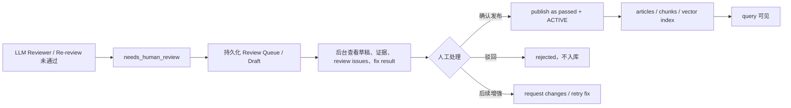

# Compile Human Review Publish Flow Design Report

## 1. 总体结论

- 当前没有面向 `needs_human_review` 编译草稿的“人工确认后入库”闭环入口。
- 现有后台人工审核能力只覆盖已经进入 `articles` 表的文章，不能直接处理 Redis working set 中的未入库草稿。
- 当前 `needs_human_review` 草稿可通过 compile job step 的 ref 追到 Redis working set，但不是可靠的长期人工复核队列。
- 最小可用闭环应先引入持久化 review queue / draft 表，再提供后台列表、详情、通过发布、驳回 API。
- 人工确认发布后，建议正式文章仍写为 `review_status=passed`、`lifecycle=ACTIVE`，并通过 audit / metadata 记录 `human_approved` 来源；未确认前不得进入 `articles`，也不得被 query 可见。

## 2. Redline

- `BLOCKER`: 0
- `REVIEW`: 1860
- `ALLOWLIST`: 244
- 本轮是否修改代码：否

执行结果来源：

- `bash scripts/scan-redline.sh special_cases_report.md`
- 扫描结果显示 `BLOCKER 0`。

## 3. 当前是否已有人工确认后入库入口

结论：没有，至少没有覆盖编译阶段 `needs_human_review` 草稿的入口。

现有可复用能力：

| 能力 | 入口 / 类 | 当前适用范围 | 是否可直接用于 needs_human_review 草稿 |
|---|---|---|---|
| 已入库文章人工通过 | `AdminArticleController#approveArticleReview` -> `ArticleManualReviewService#approve` | `articles` 表中已有文章 | 否 |
| 已入库文章要求修改 | `AdminArticleController#requestArticleChanges` -> `ArticleManualReviewService#requestChanges` | `articles` 表中已有文章 | 否 |
| 已入库文章审核审计 | `AdminArticleController#listArticleReviewAudits` | `article_review_audits` | 否 |
| Query 待确认答案 | `AdminPendingController` / `pending_queries` | Query 回答反馈 | 否 |
| 编译草稿 working set | `RedisCompileWorkingSetStore` | 编译运行时中间态 | 只能短期追踪，不能作为后台发布入口 |

关键限制：

- `ArticleManualReviewService` 通过 `ArticleIdentityResolver` 查找现有 article。
- `ArticleIdentityResolver` 依赖 `ArticleJdbcRepository` 读取 `articles` 表。
- 当前 `needs_human_review` 草稿没有进入 `articles` 表，因此无法被现有文章人工审核 API 定位。
- 前端现有文章审核面板只面向 article 列表中的记录；草稿不在 article 列表中，所以用户看不到这些待确认草稿。

## 4. needs_human_review 草稿当前存储位置

当前链路中，`needs_human_review` 文章主要存在于 Redis working set。

| 位置 | 是否保存草稿内容 | 当前观察 | 可靠性判断 |
|---|---:|---|---|
| Redis working set | 是 | `needs_human_review_articles` ref 可取回 3 篇草稿 | 短期可追踪，不适合作为持久队列 |
| `compile_job_steps` | 否，主要保存 ref / count / summary | 可定位到 working set ref 和阶段结果 | 可辅助追踪，但不保存完整草稿 |
| `articles` | 否 | 当前只存在 `passed` 文章，`needs_human_review` 数量为 0 | 正式库未污染 |
| `article_chunks` / vector index | 否 | 未入库文章不会生成正式 chunk / vector | 符合 query 不可见目标 |
| `article_review_audits` | 当前未记录这些草稿 | 计数为 0 | 不能支撑人工复核历史 |
| `article_snapshots` | 仅覆盖已入库文章快照 | 当前不包含未入库草稿 | 不能作为草稿库 |

Redis working set 可靠性：

- 配置默认 TTL 来自 `lattice.compiler.working-set.ttl-seconds=86400`，约 24 小时。
- 当前 job 的 `needs_human_review_articles` key 仍可读取，TTL 约 17 小时级别。
- TTL 到期后草稿会丢失。
- Redis 是否跨服务重启保留取决于 Redis 持久化和运行环境，不具备数据库级业务可靠性。
- clean rebuild、working set 清理、Redis flush 或环境切换都可能让草稿不可恢复。

因此，当前草稿“可追踪”不等于“可人工复核发布”。

## 5. allowPersistNeedsHumanReview 的语义问题

上一份报告已确认：

- `allowPersistNeedsHumanReview=true` 当前没有让 `needs_human_review` 文章进入正式 `articles`。
- `PersistArticlesNode` 实际只读取 `acceptedArticlesRef`。
- `acceptedArticlesRef` 只包含 `review_status=passed` 的文章。
- `needs_human_review` 被保留在 working set，而非正式 persist。

产品语义上，建议不要把 `allowPersistNeedsHumanReview` 解释为“允许未确认内容直接入库”。

更合理的治理语义应拆开：

- `needs_human_review`：进入人工确认队列，不进入正式知识库。
- `human approved`：人工确认后发布为正式知识。
- `rejected`：人工驳回，不进入正式知识库。

## 6. 最小可用人工确认发布闭环

推荐状态流：

### 6.1 建议新增持久化队列

建议新增一张面向编译草稿的持久化表，例如 `compile_article_review_queue`。

最小字段建议：

| 字段 | 用途 |
|---|---|
| `id` | 队列记录主键 |
| `job_id` | 来源 compile job |
| `source_id` / `source_code` | 来源资料 |
| `concept_id` | 来源 concept |
| `article_key` | 未来发布的 article key |
| `title` | 草稿标题 |
| `content` | 草稿正文 |
| `metadata_json` | draft metadata、source paths、citations |
| `review_status` | `needs_human_review` / `published` / `rejected` / `superseded` |
| `review_route` | rule-based / LLM |
| `reviewer_model` | reviewer 使用模型 |
| `review_issues_json` | reviewer issues |
| `fix_attempt_count` | 已自动修复次数 |
| `max_fix_rounds` | job 当时最大轮次快照 |
| `created_at` / `updated_at` | 生命周期时间 |
| `reviewed_by` / `reviewed_at` | 人工处理信息 |
| `review_comment` | 人工备注 |
| `published_article_key` | 发布后的正式文章 key |

最小索引建议：

- `status + created_at`
- `job_id`
- `source_id`
- `article_key`
- `concept_id`

唯一性建议：

- 同一 `job_id + concept_id` 不应产生多个活跃待确认草稿。
- 后续重编译可将旧记录标记为 `superseded`，避免用户发布过期草稿。

### 6.2 后台 API 建议

最小 API：

| API | 作用 |
|---|---|
| `GET /api/v1/admin/compile/review-queue?status=needs_human_review` | 查询待人工确认草稿列表 |
| `GET /api/v1/admin/compile/review-queue/{id}` | 查看草稿详情、review issues、fix result、来源信息 |
| `POST /api/v1/admin/compile/review-queue/{id}/approve` | 人工确认发布 |
| `POST /api/v1/admin/compile/review-queue/{id}/reject` | 人工驳回 |

详情 DTO 最小字段：

- `id`
- `jobId`
- `sourceId`
- `sourceCode`
- `conceptId`
- `articleKey`
- `title`
- `content`
- `sourcePaths`
- `reviewStatus`
- `reviewRoute`
- `reviewerModel`
- `reviewIssues`
- `fixAttemptCount`
- `maxFixRounds`
- `createdAt`
- `updatedAt`
- `reviewedBy`
- `reviewComment`

暂不建议第一步加入“重新修复”：

- 重新修复需要重新接入 compiler fixer、working set、状态图上下文和轮次控制。
- 这会扩大实现边界，也容易重新引入长耗时和归因复杂度。
- 第一版只做“查看、确认发布、驳回”即可闭合最核心治理问题。

### 6.3 人工确认发布动作

人工确认发布时建议：

1. 从持久化 review queue 读取草稿。
2. 校验记录仍是 `needs_human_review`，且未被更新 job supersede。
3. 构造正式 article persist envelope。
4. 写入 `articles`，`review_status=passed`，`lifecycle=ACTIVE`。
5. 写入 article source refs / chunks。
6. 刷新该 article 的 vector index。
7. 写入 article snapshot，reason 可用 `manual_review_publish`。
8. 写入 article review audit，记录人工确认来源和原始 reviewer issues。
9. 将 review queue 记录标记为 `published`。

发布失败时必须保持幂等：

- 如果 article 已按同一 queue id 发布，重复 approve 返回已发布结果。
- 如果正式 article key 被其他 job 更新，应要求人工确认是否覆盖，不应静默覆盖。

## 7. review_status / lifecycle / query visibility 建议

### 7.1 未确认前

- 不进入 `articles`。
- 不生成 article chunk / article vector。
- 不被 article-backed query 召回。
- 只出现在后台人工确认队列。

### 7.2 人工确认后

建议正式文章字段：

| 字段 | 推荐值 | 原因 |
|---|---|---|
| `review_status` | `passed` | 复用现有 persist gate 和 query hard filter |
| `lifecycle` | `ACTIVE` | 表示正式知识可用 |
| `metadata` / audit | `approvalSource=human`、`approvedBy`、`approvedAt` | 保留人工确认来源 |

不建议第一版新增 `review_status=human_approved`：

- 当前 query visibility hard filter 已明确过滤 `review_status='passed' AND lifecycle='ACTIVE'`。
- 新增 `human_approved` 会要求同步改 persist gate、query filter、后台筛选、统计和测试，范围更大。
- 人工确认本质是把草稿升级为正式通过内容，审计来源可通过 metadata / audit 表达。

### 7.3 人工驳回后

- queue 状态设为 `rejected`。
- 不写入 `articles`。
- 保留 reviewer issues、人工备注和驳回人。
- query 不可见。

## 8. 是否需要新增持久化 review queue / draft 表

结论：需要。

原因：

- Redis working set 有 TTL，不适合作为人工复核工作台。
- `compile_job_steps` 只保存 ref / summary，不保存可发布草稿正文。
- `article_review_audits` 以 article 为中心，当前没有 article 时无法成为草稿表。
- `article_snapshots` 记录已入库 article 的版本，不适合承载未入库草稿。
- Query pending flow 是回答反馈，不是编译文章发布流。

如果没有持久化 queue，后台入口即使做出来，也会遇到：

- 草稿过期消失。
- 服务重启 / 环境切换后不可恢复。
- 无法稳定分页和筛选。
- 无法审计谁在什么时候批准了哪一版草稿。
- 无法判断草稿是否已被后续 job supersede。

## 9. 现有能力复用边界

可以复用：

- `ArticleAtomicWriteService` / `ArticlePersistSupport` 的正式 article 写入能力。
- 现有 article snapshot / review audit 思路。
- 现有 query visibility hard filter：只让 `passed + ACTIVE` 可见。
- 现有后台文章详情展示组件的部分字段设计。

不宜直接复用：

- `ArticleManualReviewService#approve` 作为草稿发布入口，因为它要求 article 已存在。
- `AdminPendingController`，因为它处理的是 query pending answer，不是 compile draft article。
- Redis working set 作为唯一人工 review queue。

## 10. 下一轮是否建议实现

建议实现，但第一步必须控制范围。

唯一最小实现范围建议：

> 实现后端持久化人工确认队列和最小发布 API，不做重新修复，不做复杂前端，不改 query 主链。

最小文件范围建议：

- `src/main/resources/db/schema.sql`
  - 新增 `compile_article_review_queue` 表和索引。
- `src/main/java/com/xbk/lattice/compiler/**`
  - 在 review/re-review 最终产生 `needs_human_review` 时，将草稿和 issues 写入持久队列。
- `src/main/java/com/xbk/lattice/infra/persistence/**`
  - 新增队列 repository / mapper。
- `src/main/java/com/xbk/lattice/api/admin/**`
  - 新增列表、详情、approve、reject API。
- `src/main/java/com/xbk/lattice/admin/**`
  - 新增 admin service，approve 时复用 article persist 能力并写 audit。

第一轮不建议做：

- 重新触发 fixer。
- 修改 reviewer prompt。
- 放宽 persist gate。
- 修改 query visibility filter。
- 引入 `human_approved` 作为 query 可见状态。
- 直接把 `needs_human_review` 写入 `articles`。

## 11. 配置语义处理建议

`allowPersistNeedsHumanReview=true` 当前容易误导。

建议顺序：

1. 先实现持久化人工确认队列。
2. 再将配置语义收口为明确命名，例如：
   - `queueNeedsHumanReviewDrafts=true`
   - 或将旧配置标记废弃。
3. 不建议把该配置实现为“未确认文章也进入正式库”。

这样可以避免用户把 `allowPersistNeedsHumanReview` 理解成“人工复核文章已经正式入库”。

## 12. 风险与禁止事项

风险：

- 如果只做 UI，不做持久队列，草稿仍可能在人工处理前过期。
- 如果把 `needs_human_review` 直接写入 `articles`，即使 query filter 当前挡住，也会增加治理复杂度和误配置风险。
- 如果人工确认后使用新状态 `human_approved`，需要同步修改 query filter，否则确认后的文章仍不可见。
- 如果第一版加入“重新修复”，会引入 compiler 状态恢复、LLM 成本、轮次控制和并发归因问题。

禁止事项：

- 不允许未确认草稿进入 query 可见路径。
- 不允许跳过人工确认直接把 `needs_human_review` 标为正式知识。
- 不允许为了发布入口放宽 `passed + ACTIVE` 的 query hard filter。
- 不允许用 Redis working set 作为长期业务队列。
- 不允许写业务域、文件名、题目、答案片段特判。

## 13. 本轮修改说明

- 本轮只新增本报告。
- 未修改源码。
- 未修改测试。
- 未修改配置。
- 未修改前端。
- 未修改数据库。
- 未清库、未重新导入、未运行 eval。
