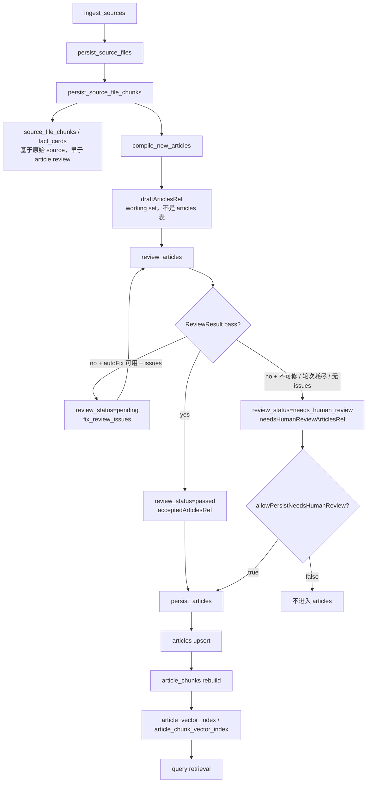

# Compile Review Persist / Visibility Governance Analysis

## 结论

当前编译主链不是“草稿生成后直接写 articles 表”：`compile_new_articles` 产出 draft 后先进入 working set，随后经过 `review_articles`，再由 `persist_articles` 写入正式文章表。

但当前治理不能保证“未审查通过不入库 / 不可 query”。原因是：

- 最近 job 的审查路由是 `rule-based`，只能称为结构审查通过，不是 LLM 事实审查。
- `persist_articles` 会先写 accepted/passed 文章；如果 `allowPersistNeedsHumanReview=true`，还会合并 `needs_human_review` 文章一起落库。
- 当前资源配置默认 `allow-persist-needs-human-review: ${LATTICE_COMPILER_REVIEW_ALLOW_PERSIST_NEEDS_HUMAN_REVIEW:true}`；数据库 `compile_review_settings` 当前为空，环境变量未见覆盖。
- Query 侧主要 SQL 没有统一硬过滤 `review_status='passed' AND lifecycle='ACTIVE'`；已有逻辑只是排序、降权或部分 fact card 使用策略，不是不可见门禁。
- 当前数据库样本中 articles 全部是 `passed/ACTIVE`，所以最近样本没暴露非 passed 可见问题；这是样本状态，不是设计保证。

下一轮最小治理动作建议：先做 persist gate。只允许 `passed` 文章进入 query-facing 的 `articles/article_chunks/vector` 链路；`needs_human_review` 先留在 working set / audit / 人工复核域，不进入正式知识库。

## 门禁与工作区

| 项 | 结果 |
|---|---|
| redline BLOCKER | 0 |
| redline REVIEW | 1852 |
| redline ALLOWLIST | 238 |
| `git status --short --branch` | `## codex/qa-polish...origin/codex/qa-polish`，写报告前无未提交代码改动 |
| `git diff --stat` | 写报告前为空 |
| 本轮是否运行 compile / 清库 / 重建 / query baseline | 否 |
| 本轮是否修改代码 | 否 |

## 当前状态流转图

关键点：

- `fix_review_issues -> review_articles` 是显式回边，自动修复后会重新 review。
- `pending` fixable 文章正常不会直接 persist；它会先进入 fix，再回到 review。
- `needs_human_review` 是否 persist 取决于 `allowPersistNeedsHumanReview`。
- `source_file_chunks` 和由 source chunks 派生的 `fact_cards` 不依赖 article review_status；它们属于 raw source / structured evidence 通道。

## Review 状态与来源

| 层级 | 状态 | 来源 / 含义 |
|---|---|---|
| `ReviewResult.status` | `PASSED` | reviewer 判定通过 |
| `ReviewResult.status` | `ISSUES_FOUND` | reviewer 发现问题 |
| `ReviewResult.status` | `PARSE_RESCUED` | LLM review 输出可救援解析，但仍非 pass |
| `ReviewResult.status` | `PARSE_FAILED` | LLM review 输出解析失败，非 pass |
| `ReviewResult.status` | `TIMEOUT_FALLBACK` | 超时兜底，非 pass |
| article `review_status` | `passed` | `ReviewResult.isPass()` 后进入 accepted |
| article `review_status` | `pending` | 初始非 pass / fixable / 修复后待复审 |
| article `review_status` | `needs_human_review` | 不可自动修、修复轮次耗尽、或非 pass 且无 issues |
| article `review_status` | `pending_review` / `rejected` | 当前 state_graph article review 主链未产出；若外部写入，query 也没有统一硬过滤 |
| fact card `review_status` | `valid` / `incomplete` / `conflict` / `low_confidence` / `needs_human_review` | fact card 自身质量状态，不等同于 article review_status |

`accepted` 是 working set 分区名，不是 articles 表中的持久化状态；落库状态为 `passed`。

## Rule-Based 与 LLM Reviewer

### 当前 rule-based route

最近 compile job：

- job：`fc155a9b-54f2-41af-87cc-0498c88521b9`
- status：`SUCCEEDED`
- orchestration：`state_graph`
- persisted_count：4
- `compile_new_articles` route：`compile.writer.gpt-5.5`
- `review_articles` route：`rule-based`
- `persist_articles` 随后执行成功
- 当前未看到 `fix_review_issues` 步骤执行记录

rule-based reviewer 检查项：

- article 是否为空；
- frontmatter 是否包含 `sources:`；
- frontmatter 是否包含 `review_status:`；
- 是否包含 `TODO` / `TBD`；
- 正文是否包含一级标题；
- source contents 是否为空。

rule-based reviewer 不做事实一致性审查，不验证每个结论是否被 source 支撑，不判断遗漏、冲突、幻觉或引用充分性。因此当前 route 下的 passed 只能称为“结构审查通过”。

### 开启 LLM reviewer 后

`lattice.llm.review-enabled` 当前资源默认值为 `false`。若开启：

- reviewer 会通过 `ArticleReviewerGateway` 调用 `llmGateway.invokeRaw / invokeRawWithScope`；
- scene 为 compile，role 为 reviewer，purpose 为 `compile-review`；
- route 来自 snapshot / model binding；默认 reviewer model 配置是 `LATTICE_LLM_REVIEWER_MODEL:anthropic`；
- LLM 返回仍会被解析为 `ReviewResult`，后续仍按 `isPass()` 和 issues 进入 accepted / fixable / needs_human_review；
- `ArticleReviewerGateway` 捕获 RuntimeException 后会 fallback 到 rule-based review。

所以“开启 LLM reviewer”只能提升 review 质量来源，不能自动提供 persist gate 或 query visibility gate。

## Persist Gate 现状

| 对象 | 当前是否检查 review_status | 结论 |
|---|---|---|
| `articles` | 入口由 `PersistArticlesNode` 决定：accepted 必写；`allowPersistNeedsHumanReview=true` 时合并 needs_human_review。`ArticlePersistSupport.persistArticles` 本身不二次校验状态。 | 部分 gate，但允许配置绕过 |
| `article_chunks` | `ArticleAtomicWriteService` 在文章 persist 后用同一批 reviewedArticles 重建 chunks。 | 跟随 persist 列表，无独立 gate |
| `article_vector_index` | `RefreshVectorIndexNode` 对 persist 后的 reviewedArticlesRef 建索引。 | 跟随 persist 列表，无独立 gate |
| `article_chunk_vector_index` | 与 article chunk vector indexing 同步。 | 跟随 persist 列表，无独立 gate |
| `source_file_chunks` | 在 article review 前由 raw source 持久化；表无 review_status 列。 | 不受 article review gate 管理 |
| `fact_cards` | 从 `source_file_chunks` 派生，有自己的 fact card review_status。 | 不受 article review_status gate 管理 |

当前配置证据：

- Java 属性默认：`CompileReviewProperties.allowPersistNeedsHumanReview=false`。
- 资源配置默认：`lattice-compiler.yml` 将 `allow-persist-needs-human-review` 设置为 `${LATTICE_COMPILER_REVIEW_ALLOW_PERSIST_NEEDS_HUMAN_REVIEW:true}`。
- `InitializeJobNode` 会把该值固化到 compile graph state。
- 当前数据库 `compile_review_settings` 行数为 0。
- 当前 shell 未见 `LATTICE_COMPILER_REVIEW_ALLOW_PERSIST_NEEDS_HUMAN_REVIEW` 环境变量覆盖。

有效风险判断：在当前资源默认下，若后续 LLM reviewer 产出 `needs_human_review`，该状态存在进入正式 `articles`、chunks 与 vector index 的路径。

## Query Visibility 现状

| 通道 | 当前 SQL / 策略 | 是否硬过滤 passed + ACTIVE |
|---|---|---|
| article FTS | `ArticleFtsSearchMapper` 查询 `articles`，读取 `review_status`，但 WHERE 仅基于 FTS。 | 否 |
| refKey | `RefKeySearchMapper` 查询 `articles`，WHERE 基于 refkey/title/metadata。 | 否 |
| article chunk lexical | `ArticleChunkMapper.searchLexical` join `article_chunks` + `articles`，不筛状态。 | 否 |
| article vector | `ArticleVectorMapper.searchNearestNeighbors` join vector + articles，不筛状态。 | 否 |
| article chunk vector | `ArticleChunkVectorMapper.searchNearestNeighbors` join chunk vector + articles，不筛状态。 | 否 |
| source file/source chunk | 查询 raw source 表，无 article review_status。 | 不适用；独立可见 |
| fact card lexical/vector | SQL 不筛状态；service 层只排除 `conflict`，低置信和需人工复核仍可进入候选或背景。 | 否 |

现有 query 侧质量逻辑不是可见性门禁：

- `KnowledgeSearchService.applyReviewQualityGuardrail` 只是把 passed article 命中排前；若有 non-passed，仍会保留在列表中；若没有 passed，原样返回。
- `QueryHitIntentReranker` 对 `passed` 加分，对 `needs_human_review` 降权，对其他非 passed 降权；这不是过滤。
- `FactCardReviewUsagePolicy` 只排除 `conflict`；`low_confidence` 仍允许作为 query candidate，并允许作为结构化主证据；`needs_human_review` 仍允许进入候选，但作为 background/downweighted。

因此：如果非 passed article 已落库并建索引，query 存在召回风险；如果 low_confidence fact cards 存在，query 也可能召回并使用。

## 当前数据库状态

| 表 / 对象 | 当前状态 |
|---|---|
| `articles` | `passed / ACTIVE`：4 |
| `article_chunks` | 对应 `passed / ACTIVE`：19 |
| `article_vector_index` | 对应 `passed / ACTIVE`：4 |
| `article_chunk_vector_index` | 对应 `passed / ACTIVE`：19 |
| `fact_cards` | `low_confidence`：14 |
| `source_files` | 2 |
| `source_file_chunks` | 5；列中无 `review_status` |
| `article_review_audits` | 0 |
| `compile_review_settings` | 0 |

当前样本没有 `needs_human_review` / `pending` / 非 ACTIVE article，因此最近 query 不一定能实际复现非 passed article 可见。但代码路径说明，一旦这些状态被 persist，query 侧没有硬门禁阻止召回。

## 当前设计能否保证

| 保证项 | 当前是否保证 | 判断 |
|---|---|---|
| 审查未通过不入库 | 否 | `needs_human_review` 可在 `allowPersistNeedsHumanReview=true` 时进入 persist |
| 审查未通过不可 query | 否 | 查询 SQL 无统一 `review_status/lifecycle` hard filter |
| fixer 修复后必须重新审查 | 是 | `fix_review_issues -> review_articles` 明确回边 |
| 人工复核状态不会被当作正式知识 | 否 | 可能 persist，且 query 不硬过滤 |
| 启用 LLM reviewer 后自动安全 | 否 | LLM 只改变 review 结果来源；persist/query gate 仍缺 |
| 当前 rule-based route 可称为事实审查通过 | 否 | 只能称为结构审查通过 |

## 最小治理缺口排序

1. **Persist gate**：先阻止非 `passed` article 进入正式 `articles/article_chunks/vector` 链路。
2. Query visibility hard filter：作为第二道防线，防止历史脏数据、人工写入或配置绕过进入 query。
3. `allowPersistNeedsHumanReview` 默认值治理：当前资源默认 true 与 Java 默认 false 不一致，应在 persist gate 后统一语义。
4. LLM reviewer enablement：有 gate 后再启用，否则更容易产出真实 `needs_human_review` 并暴露当前漏洞。
5. Article review status enum / 人工复核流程：需要产品确认，范围较大，不适合作为第一刀。
6. Per-article review/fix audit：有助于追溯，但不是阻断未审查通过入库的第一道门。

## 下一轮唯一最小动作

建议下一轮只做 **Persist gate**。

最小范围：

- `src/main/java/com/xbk/lattice/compiler/graph/node/PersistArticlesNode.java`
- 方法：`execute(...)`

目标语义：

- query-facing persist 只接收 `acceptedArticlesRef` 中最终 `review_status=passed` 的文章；
- `needsHumanReviewArticlesRef` 不合并进正式 `articles/article_chunks/vector` 链路；
- 如果仍需保留待人工复核内容，应保留在 working set、audit、后台人工复核域，而不是正式知识库表；
- 不写任何业务域、文档、术语、题目、答案片段特判。

为什么不是先改 query filter：

- Query filter 可以降低可见性风险，但不能解决“未通过审查的生成文章已经进入正式知识库并建索引”的产品疑问。
- Persist gate 是更靠前、更小、更符合“未通过不入库”的第一道治理。

为什么不是先启用 LLM reviewer：

- 当前缺少 persist/query gate；启用后如果 LLM 产出 `needs_human_review`，反而更容易触发非 passed 入库路径。
- LLM 调用异常仍会 fallback 到 rule-based，启用本身不等于“所有文章都经过 LLM 事实审查并安全落库”。

## 下一轮禁止事项

- 不要一轮同时启用 LLM reviewer、改 persist gate、改 query filter、改 enum、做人工复核后台。
- 不要修改 query eval、题集、redline 脚本或 allowlist。
- 不要加入任何业务域、文档名、术语、问题文本、答案片段特判。
- 不要清库、重建、重新导入或运行 compile，除非下一轮任务明确要求验证治理修复。
- 不要把 rule-based pass 表述为 LLM 内容审查通过。

## 本轮修改说明

本轮只新增本报告；未修改源码、测试、配置、脚本、数据库或模型配置。
