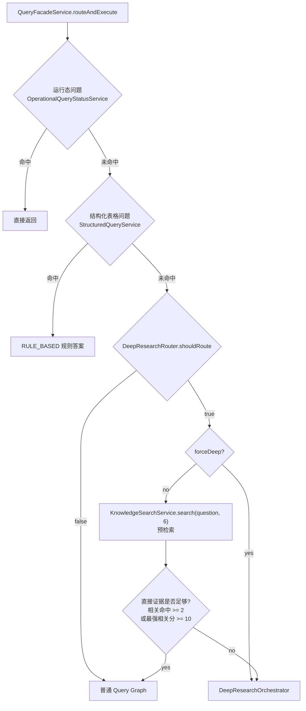
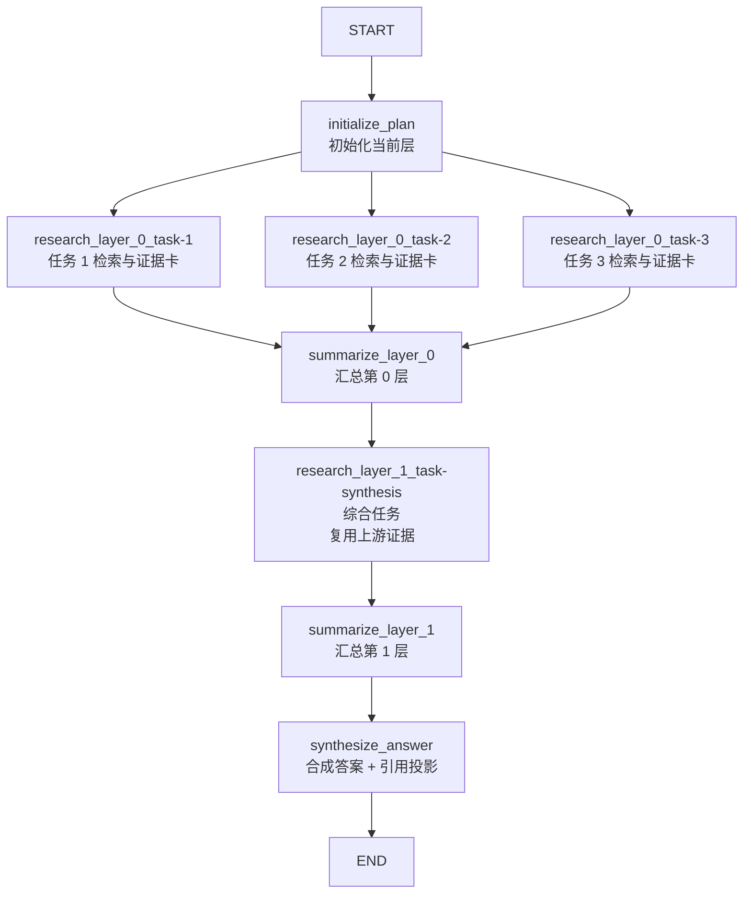
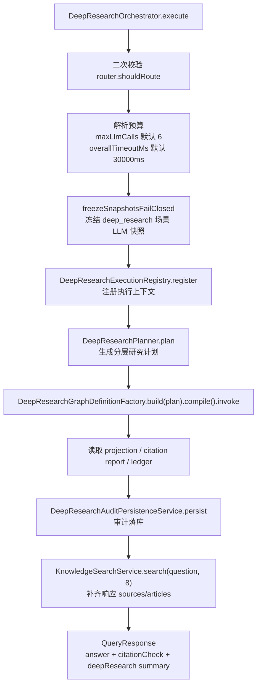
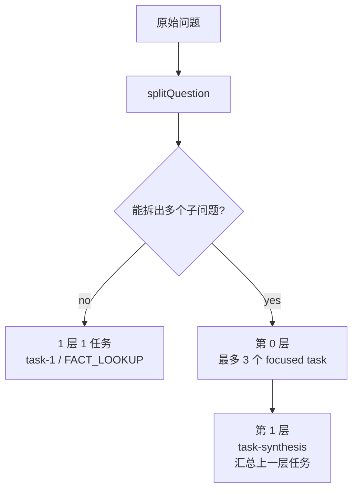
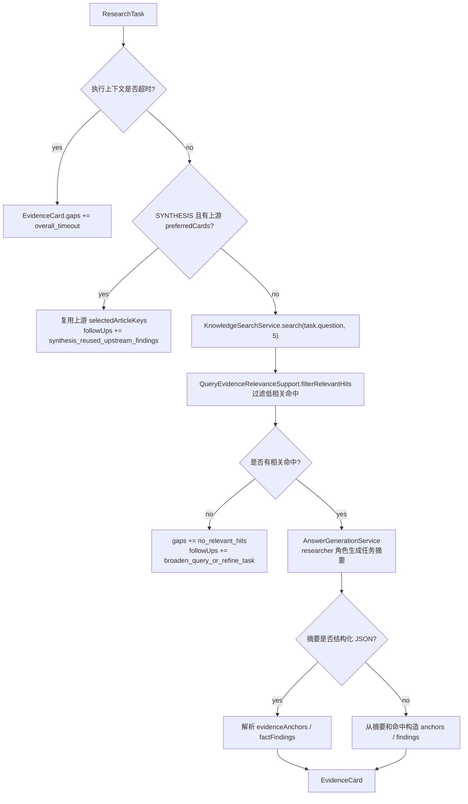
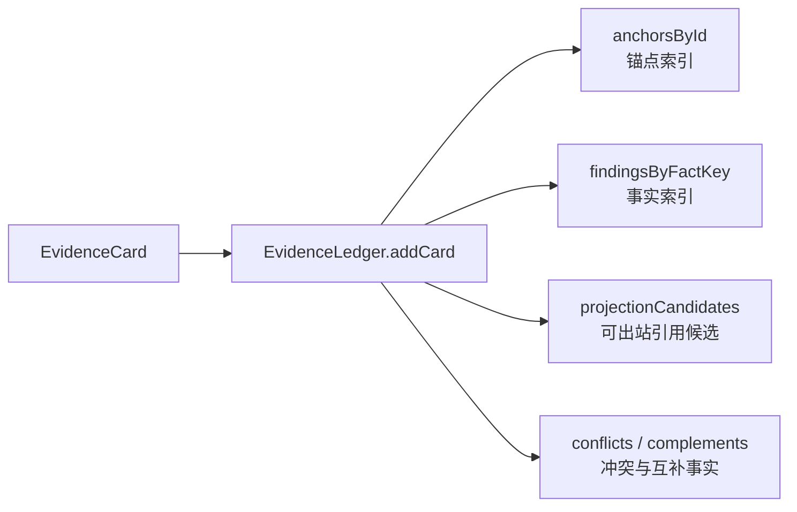
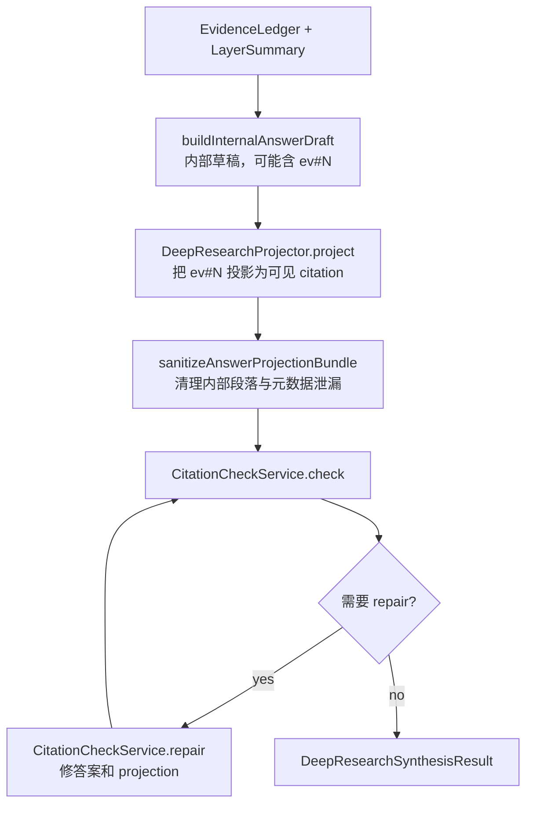
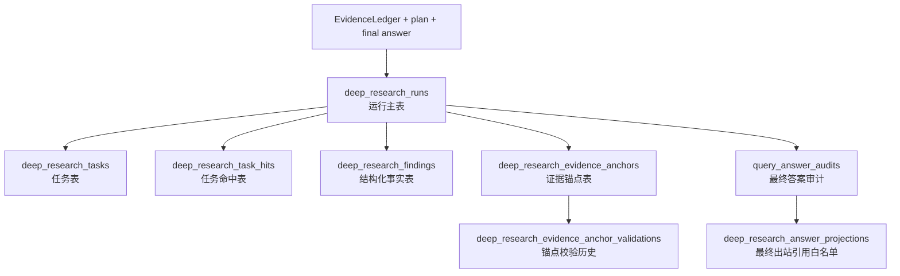
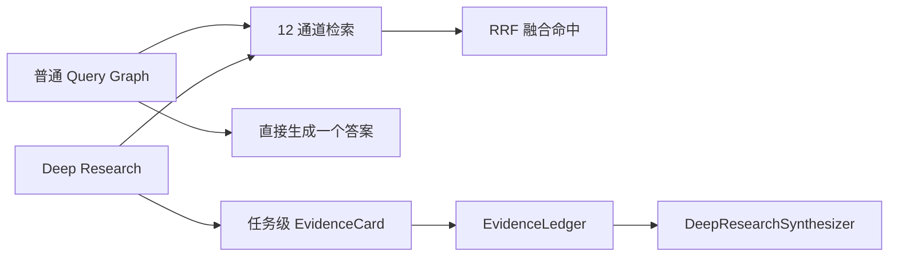

# Lattice Deep Research 流水线

## 概述

Deep Research 是查询检索流水线中的复杂问题分支。它不替代普通 Query Graph，也不是所有“为什么/影响/对比”问题都会进入。`QueryFacadeService` 会先做运行态短路、结构化查询短路，再用 Deep Research 路由器和一次轻量预检索判断是否真的需要升级。

普通查询主链见 [`查询检索流水线.md`](./查询检索流水线.md)，Deep Research 使用的基础物料来源见 [`编译流水线.md`](./编译流水线.md)。

### 用大白话说

普通 Query Graph 像“先搜一轮，再写一个答案”。Deep Research 像“把复杂问题拆成研究任务，每个任务都先搜证据，再整理成证据卡，最后把所有证据卡合成带引用的答案”。它仍然复用普通检索的 12 个通道，只是在任务拆分、证据账本、引用投影和审计落库上更重。

### 新手阅读路径

1. 先看“什么时候会进入 Deep Research”，避免误以为关键词直接触发深研。
2. 再看“动态 StateGraph”，理解它不是固定节点数，而是按 plan 生成。
3. 最后看“EvidenceCard / EvidenceLedger / Projection”，理解最终答案为什么必须能投影成可见引用。

---

## 一、什么时候会进入 Deep Research

入口仍然是 `QueryFacadeService`。Deep Research 只在普通短路失败后才有机会执行。



### 路由规则

| 输入/信号 | 行为 |
|---|---|
| `forceSimple=true` | 不走 Deep Research |
| `forceDeep=true` | 强制走 Deep Research，不再做证据充足性预检索 |
| 空问题 | 不走 Deep Research |
| 复杂对比题 | 满足多维度或多主体结构时命中 |
| 英文深研信号 | `why`、`troubleshoot`、`call chain`、`impact` |
| 中文/配置化深研信号 | 由 `QuerySemanticRules.containsAnyDeepResearchSignal` 判断 |
| 预检索证据充足 | 仍走普通 Query Graph |
| 预检索异常或检索服务缺失 | 倾向升级 Deep Research |

`DeepResearchRouter.routeReason` 当前返回三类：`force_simple`、`force_deep`、`complexity_rule_matched`。

---

## 二、系统骨架：动态 Deep Research Graph

Deep Research 使用 Spring AI Alibaba `StateGraph`，定义在 `DeepResearchGraphDefinitionFactory`。它不是固定节点数量，而是根据 `DeepResearchPlanner` 生成的 `LayeredResearchPlan` 动态展开。



上图是“多子问题对比题”的典型形态。实际节点数量由 plan 决定：

| plan 形态 | 图形态 |
|---|---|
| 单问题 | `initialize_plan -> research_layer_0_task-1 -> summarize_layer_0 -> synthesize_answer` |
| 对比/拆分问题 | `initialize_plan -> layer0 多任务 -> summarize_layer_0 -> layer1 synthesis -> summarize_layer_1 -> synthesize_answer` |

源码里的边关系：

- `START -> initialize_plan`
- 每一层的任务节点都从上一层 summary 节点扇出
- `summarize_layer_N` 等待该层全部任务节点完成
- 最后一层 summary 后进入 `synthesize_answer`
- `synthesize_answer -> END`

---

## 三、Orchestrator 执行顺序

`DeepResearchOrchestrator.execute` 是 Deep Research 的收口点。



### 默认预算

| 参数 | 默认值 | 来源 |
|---|---:|---|
| `maxLlmCalls` | 6 | `DeepResearchOrchestrator.DEFAULT_MAX_LLM_CALLS` |
| `overallTimeoutMs` | 30000 | `DeepResearchOrchestrator.DEFAULT_OVERALL_TIMEOUT_MS` |

`DeepResearchExecutionContext` 负责两件事：

- 维护总 LLM 调用预算：`tryAcquireLlmCall()` 超出后不再调 LLM。
- 维护总截止时间：超时后任务记录 `overall_timeout`，最终结果会倾向 partial。

### 快照冻结

执行前会调用 `ExecutionLlmSnapshotService.freezeSnapshots(DEEP_RESEARCH_SCOPE_TYPE, queryId, DEEP_RESEARCH_SCENE)`。如果快照服务存在且返回空列表，会抛出 `NoEvidenceException`，Deep Research 进入失败降级。

### 失败降级

`execute` 捕获异常后返回：

| 字段 | 值 |
|---|---|
| `answer` | `Deep Research 执行中断，当前仅能返回部分结果。` |
| `answerOutcome` | `PARTIAL_ANSWER` |
| `generationMode` | `FALLBACK` |
| `modelExecutionStatus` | `FAILED` |
| `deepResearch.partial` | `true` |

---

## 四、Planner：怎么拆任务

`DeepResearchPlanner.plan` 当前是规则规划，不在 `execute` 主链中调用 LLM 生成 plan。类里存在 `parseOrRepairPlan`，但 orchestrator 当前没有使用它。



### 拆分规则

| 场景 | plan |
|---|---|
| 不能拆分 | 第 0 层一个 `task-1`，类型 `FACT_LOOKUP` |
| 对比题可拆分 | 第 0 层最多 3 个子任务，第 1 层一个 `task-synthesis` |
| `why` 和 `how` 同时出现但未拆分 | 仍是单层单任务 |
| 超过 3 个子问题 | 只取前 3 个 |

### 任务类型推断

| 条件 | `ResearchTaskType` |
|---|---|
| compare/comparison/difference/vs/versus 或中文对比信号 | `COMPARE` |
| why/cause | `CAUSE` |
| how/policy/strategy | `POLICY` |
| 其他 | `FACT_LOOKUP` |
| 综合层任务 | `SYNTHESIS` |

每个任务默认要求证据类型：`ARTICLE`、`SOURCE`、`GRAPH`、`CONTRIBUTION`。这只是任务期望；实际检索仍走 `KnowledgeSearchService` 的 12 通道融合。

---

## 五、单个研究任务怎么产出 EvidenceCard

任务节点调用 `DeepResearchResearcherService.research`。它的核心产物是 `EvidenceCard`。



### EvidenceCard 字段

| 字段 | 含义 |
|---|---|
| `evidenceId` | 当前卡片主证据 ID，格式来自 `DeepResearchExecutionContext.nextEvidenceId()`，如 `ev#1` |
| `layerIndex` | 所属研究层 |
| `taskId` | 所属任务 |
| `scope` | 任务问题 |
| `factFindings` | 结构化事实结论 |
| `evidenceAnchors` | 支撑结论的证据锚点 |
| `taskHits` | 任务级检索命中快照 |
| `gaps` | 证据缺口或失败原因 |
| `followUps` | 后续建议 |
| `relatedLeads` | 上一层摘要或优选证据线索 |
| `selectedArticleKeys` | 选中的文章 key，供跨层综合复用 |

### 研究任务的降级路径

| 情况 | 行为 |
|---|---|
| 检索服务不可用 | `gaps += retrieval_unavailable` |
| 检索异常 | `gaps += retrieval_failed` |
| LLM 预算耗尽 | 用检索命中生成最小 fallback 摘要 |
| AnswerGeneration 不可用或失败 | `fallback_to_retrieved_evidence` |
| 结构化 JSON 解析失败 | 尝试一次 schema repair；失败后从命中恢复最小证据 |
| 没有 finding 但有命中 | 追加 anchor-only evidence 或标记 gap |

---

## 六、EvidenceLedger：证据账本

每层 `summarize_layer_N` 会读取该层所有 EvidenceCard，追加到 `EvidenceLedger`，再保存分层摘要。



### Ledger 质量门禁

| 对象 | 进入条件 |
|---|---|
| `EvidenceAnchor` | `anchorId` 非空、可复用身份完整，并通过 `DeepResearchAnchorValidator` |
| `FactFinding` | `canEnterLedger()` 为 true，`claimText` 非空，`confidence >= 0.55` |
| `ProjectionCandidate` | finding 通过质量门禁，anchor 存在，anchor 检索分数 `>= 0.55`，来源类型可投影 |

### Anchor 类型校验

| `sourceType` | 约束 |
|---|---|
| `ARTICLE` | 不允许携带 path 和行号 |
| `SOURCE_FILE` | `path` 必须与 `sourceId` 一致；行号必须成对出现；`lineStart <= lineEnd` |
| `GRAPH_FACT` | 不允许 path、行号、chunkId |
| `CONTRIBUTION` | 不允许 path、行号、chunkId |

只有 `ARTICLE` 和 `SOURCE_FILE` 会进入最终答案 projection。`GRAPH_FACT` 和 `CONTRIBUTION` 可以参与研究和审计，但不会直接渲染成最终用户可见引用。

### 分层摘要

`summarize_layer_N` 会生成 `LayerSummary`：

| 字段 | 来源 |
|---|---|
| `layerIndex` | 当前层序号 |
| `summaryMarkdown` | 每张卡的第一条 finding claim；没有 finding 时记录 gaps；全空时为 `REUSED_PRIOR_LAYER_EVIDENCE` |
| `taskIds` | 当前层任务 ID |
| `taskResultRefs` | 当前层任务结果工作集引用 |
| `evidenceIds` | 当前层证据卡 ID |
| `gapCount` | 当前层 gaps 总数 |

---

## 七、Synthesizer：合成答案与引用投影

最后一个图节点是 `synthesize_answer`。它调用 `DeepResearchSynthesizer.synthesize(question, layerSummaries, evidenceLedger)`。



### 内部草稿和出站答案的区别

内部草稿可以包含 `ev#N`。最终 HTTP 响应不能泄漏内部证据号，因此 `DeepResearchProjector` 会把可投影证据替换成可见引用：

| 来源类型 | 出站 citation |
|---|---|
| `ARTICLE` | `[[targetKey]]` |
| `SOURCE_FILE` | `[→ targetKey]` 或 `[→ targetKey, lines X-Y]` |

如果投影失败、最终答案为空，或答案里仍残留 `ev#N`，`DeepResearchGraphDefinitionFactory.resolveAnswerProjectionBundle` 会返回安全答案：

```text
证据不足，无法生成可核验引用版答案
```

### partial 的主要原因

| 原因 | 体现 |
|---|---|
| Citation 覆盖率低于阈值 | `DeepResearchSynthesisResult.partialAnswer=true` |
| 没有任何 projection | partial |
| Ledger 没有 finding | partial |
| 执行上下文超时 | partial |
| 合成结果为空或被安全投影替换 | partial |

---

## 八、审计落库

Deep Research 执行完成后，`DeepResearchAuditPersistenceService.persist` 会在一个事务里写入运行、任务、命中、finding、anchor、答案审计和 projection。



### 审计表说明

| 表 | 说明 |
|---|---|
| `deep_research_runs` | 一次 Deep Research 运行，记录问题、路由原因、plan、层数、任务数、LLM 调用数、引用覆盖率、partial、conflict |
| `deep_research_tasks` | plan 中的每个任务，记录层序号、任务类型、问题、期望 fact schema、状态 |
| `deep_research_task_hits` | 每个任务的检索命中快照，channel 当前写为 `knowledge_search` |
| `deep_research_findings` | EvidenceCard 中可落库的结构化事实 |
| `deep_research_evidence_anchors` | canonical 后的证据锚点，按 content hash 去重 |
| `deep_research_evidence_anchor_validations` | anchor 初始校验记录，`validated_by=STRUCTURE_RULE` |
| `query_answer_audits` | 最终答案统一审计，`source=deep_research` |
| `deep_research_answer_projections` | 最终用户可见引用白名单，只写 ARTICLE / SOURCE_FILE projection |

### 任务状态

| 状态 | 判定 |
|---|---|
| `SUCCEEDED` | EvidenceCard 有 fact findings |
| `PARTIAL` | 超时、有 gaps，或至少选中过文章 key 但没有完整 finding |
| `FAILED` | 没有 EvidenceCard，或没有 findings/gaps/selectedArticleKeys |

---

## 九、与普通 Query Graph 的关系



| 对比项 | 普通 Query Graph | Deep Research |
|---|---|---|
| 入口 | 默认主链 | 复杂问题且预检索证据不足时升级 |
| 图结构 | 固定 15 节点 | 按 plan 动态生成 |
| 检索 | 12 通道，默认 topK=8 | 每个任务调用 `KnowledgeSearchService.search(task.question, 5)` |
| 中间产物 | fused hits、draft answer、citation report | plan、EvidenceCard、LayerSummary、EvidenceLedger、projection bundle |
| 答案生成 | 直接基于 fused hits 生成 | 先任务研究，再合成最终答案 |
| 引用 | Query projection + citation check/repair | ev#N 内部锚点投影为 ARTICLE/SOURCE_FILE citation |
| 审计 | `query_answer_audits/claims/citations` | 额外写 deep_research 系列表 |

---

## 十、关键源码索引

| 主题 | 源码 |
|---|---|
| 总路由 | `src/main/java/com/xbk/lattice/query/service/QueryFacadeService.java` |
| Deep Research 路由器 | `src/main/java/com/xbk/lattice/query/deepresearch/service/DeepResearchRouter.java` |
| Deep Research 编排器 | `src/main/java/com/xbk/lattice/query/service/DeepResearchOrchestrator.java` |
| 研究计划生成 | `src/main/java/com/xbk/lattice/query/deepresearch/service/DeepResearchPlanner.java` |
| 动态 StateGraph | `src/main/java/com/xbk/lattice/query/deepresearch/graph/DeepResearchGraphDefinitionFactory.java` |
| 单任务研究 | `src/main/java/com/xbk/lattice/query/deepresearch/service/DeepResearchResearcherService.java` |
| 研究任务检索与过滤 | `DeepResearchHitSelectionSupport` |
| 证据解析与降级恢复 | `DeepResearchEvidenceAssemblySupport` |
| 证据账本 | `src/main/java/com/xbk/lattice/query/deepresearch/domain/EvidenceLedger.java` |
| 锚点校验 | `src/main/java/com/xbk/lattice/query/deepresearch/validator/DeepResearchAnchorValidator.java` |
| 答案综合 | `src/main/java/com/xbk/lattice/query/deepresearch/service/DeepResearchSynthesizer.java` |
| 引用投影 | `src/main/java/com/xbk/lattice/query/deepresearch/projector/DeepResearchProjector.java` |
| 审计落库 | `src/main/java/com/xbk/lattice/query/deepresearch/service/DeepResearchAuditPersistenceService.java` |

