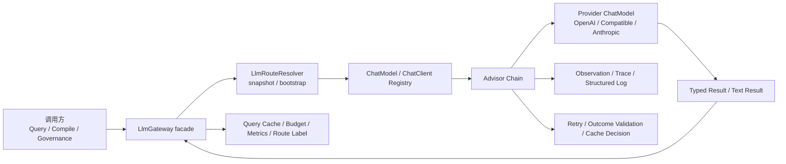

# LLM 调用迁移到 ChatClient + Advisor 渐进式改造技术方案

## 1. 文档信息

- 文档状态：待评审
- 面向对象：架构评审、后续实施负责人、测试与验收同学
- 适用范围：`OpenAI/Codex + 向量检索` 主回归链路；保留对 `openai_compatible / anthropic` 的架构兼容，但本轮不以 Claude 作为主验收路径
- 当前项目基线：
  - JDK：`21`
  - Spring Boot：`3.5.1`
  - Spring AI：`1.1.2`
  - Spring AI Alibaba Graph：`1.1.2.0`

## 2. 结论先行

结论是：**“迁到 `ChatClient + Advisor`”这个方向成立，但当前版本只能视为“可进入 Spike 与方案收敛”的文档，不能直接把所有组件当成既定可落地事实。**  
更准确的说法是：**必须保留 `LlmGateway` 作为上层 facade，并先完成动态 ChatModel/ChatClient 构造可行性验证，再在 facade 内部逐步切换执行栈。**

原因很明确：

1. 当前 `LlmGateway` 不只是“发一次模型请求”，它已经承担了动态路由、bootstrap fallback、快照选模、缓存、预算守卫、输入截断、成本估算、路由标签暴露等职责。
2. `ChatClient + Advisor` 更适合沉淀统一日志、trace、重试、结构化输出、请求标签、后续策略链，但它解决的是“调用管线统一化”问题，不会自动替代当前业务侧的作用域路由和缓存语义。
3. 现阶段最有收益的不是先迁 compile writer，而是先迁 `query-answer / query-rewrite / query-review`，因为这条链路直接影响“证据不足是否被误缓存”“前端如何展示可信度”“日志与排障是否统一”。
4. 但在真正进入 Query 迁移前，必须先补齐两个前置条件：
   - 双层缓存语义收敛，不再只修 QueryResponse 级缓存
   - 动态 `ChatModel / ChatClient` 构造 Spike 通过，确认 Spring AI `1.1.2` 基线下可落地

因此本方案采用：

- **架构层**：保留 `LlmGateway` API，不动上层调用面
- **执行层**：在 `LlmGateway` 内部引入 `ChatClientRegistry + AdvisorChain`，但先以 Spike 方式验证可行性
- **语义层**：优先把 query 回答迁成结构化输出，新增 `answerOutcome`
- **治理层**：把缓存、日志、观测、重试从“分散 if/else”升级成“统一策略链”

## 3. 背景与问题陈述

### 3.1 当前项目的真实背景

项目已经完成了：

- 基于运行时快照的多角色选模
- Query Graph + reviewer + rewrite 主链路
- 向量检索、FTS、ref key、source、contribution 的多路融合
- query cache、compile cache、向量索引重建与失效机制

本轮回归中已经暴露出一个更深层的问题：**LLM 调用本身已经成为横切关注点密集区，但当前实现仍以“字符串输入 + 字符串输出 + 调用方自行解释”的方式为主。**

这会带来几个典型后果：

1. 很多“业务语义”其实藏在回答文案里，而不是结构化字段里。
2. 缓存策略不得不依赖“字符串 marker”判断，例如“当前证据不足”“暂无法确认”。
3. 日志、trace、重试、调用元数据没有统一收口点。
4. Query、compile、governance 三条线的 LLM 调用风格不一致，后续很难统一接入观测和运营指标。

### 3.2 当前代码中的关键现状

#### 3.2.1 `LlmGateway` 已经是事实上的统一入口

当前 [`src/main/java/com/xbk/lattice/compiler/service/LlmGateway.java`](../src/main/java/com/xbk/lattice/compiler/service/LlmGateway.java) 至少承担了以下职责：

- 根据 `scene + agentRole + scopeId` 解析运行时路由
- 兼容 bootstrap fallback 与 snapshot 路由
- 根据 `LlmRouteResolution` 选择底层 client
- Redis 级别的 prompt 结果缓存
- 预算守卫与成本累计
- 输入截断
- 路由标签暴露给上游

这意味着它不能被“一刀切删除”，否则 compile/query/governance 现有能力会同时失守。

#### 3.2.2 路由能力依赖快照与动态客户端

当前：

- [`ExecutionLlmSnapshotService`](../src/main/java/com/xbk/lattice/llm/service/ExecutionLlmSnapshotService.java) 负责冻结和解析作用域快照
- [`LlmClientFactory`](../src/main/java/com/xbk/lattice/llm/service/LlmClientFactory.java) 负责按 `providerType/baseUrl/model/apiKey/options` 动态创建底层 client
- [`LlmRouteResolution`](../src/main/java/com/xbk/lattice/llm/service/LlmRouteResolution.java) 承载单次调用所需的完整路由信息

所以新方案不能只回答“怎么调 ChatClient”，还必须回答“**如何按运行时路由动态构造并缓存 ChatClient/ChatModel**”。

#### 3.2.3 Query 主链最值得优先迁移

当前 Query 相关调用集中在：

- [`AnswerGenerationService`](../src/main/java/com/xbk/lattice/query/service/AnswerGenerationService.java)
- [`LlmReviewerGateway`](../src/main/java/com/xbk/lattice/query/service/LlmReviewerGateway.java)
- [`QueryGraphDefinitionFactory`](../src/main/java/com/xbk/lattice/query/graph/QueryGraphDefinitionFactory.java)
- [`QueryGraphOrchestrator`](../src/main/java/com/xbk/lattice/query/service/QueryGraphOrchestrator.java)

这里已经出现两个清晰信号：

1. 回答是否可缓存，目前仍部分依赖文案 marker 判断。
2. 回答结果天然需要前端消费“结果状态”，但当前返回主体仍是 Markdown 文本。

这正是结构化输出最有价值的一段。

#### 3.2.4 compile / governance 里也存在大量结构化机会

当前 compile/governance 调用点包括：

- `AnalyzeNode`：让模型输出结构化概念，再由本地 JSON 解析
- `ArticleReviewerGateway`：模型审查后再本地解析成 `ReviewResult`
- `ArticleCorrectionService`：`cross-validate` 先返回 JSON，再据此 apply correction
- `PropagateExecutionService`：`check-propagation` 返回布尔/JSON，再决定是否传播

其中有一部分天然适合直接迁成 typed output，而另一部分仍应保留 Markdown/text 输出。

#### 3.2.5 本轮评审进一步确认的现状缺口

为了避免把“目标状态”误写成“当前事实”，这里补充明确四个已经由代码确认的缺口：

1. `LlmGateway.invoke(...)` 当前存在 **L1 prompt cache**，且是“命中即返回、返回即写入”的无条件缓存；它与 Query Graph 的 `QueryCacheStore` 不是同一层缓存。
2. Query Graph 当前只对 **L2 QueryResponse 缓存** 做了负向答案 marker 过滤，并未治理 L1 prompt cache。
3. `QueryGraphDefinitionFactory.buildSuccessResponse(...)` 当前返回 `QueryResponse(..., null, reviewStatus)`，也就是 **`queryId` 尚未写入最终 QueryResponse**。
4. compile 侧已经有 `compile_job_steps` 表级结构化步骤记录，但应用日志本身仍以普通 `log.info(...)` 字符串为主，**尚未进入统一结构化日志状态**。

## 4. 本次改造的目标与非目标

### 4.1 目标

本方案希望一次性回答并落地以下问题：

1. 如何在不推倒重来的前提下引入 `ChatClient + Advisor`
2. 如何保留现有 `LlmGateway`、快照路由和 provider 兼容性
3. 如何把 query 的“证据不足/明确回答”从文案判断升级为结构化 outcome
4. 如何统一日志、trace、重试、结构化输出、缓存判定
5. 如何给后续 compile / governance 迁移留出清晰的分阶段路线

### 4.2 非目标

以下内容不作为本方案的直接实施目标：

1. 不把 Query Graph 的检索编排改成 Spring AI 自带 RAG Advisor
2. 不在本轮把所有 `LlmGateway.compile(...)` 全部替换掉
3. 不把 Anthropic/Claude 兼容性作为本轮主验收入口
4. 不把 Spring AI 升级作为本轮前置条件

说明：

- 当前检索编排已经深度依赖 Spring AI Alibaba Graph，且有 FTS / ref key / source / contribution / vector / chunk vector 多路融合逻辑，自带 RAG Advisor 不是当前问题的主解。
- 当前官方文档页面已是 `1.1.4`，但项目基线为 `1.1.2 / 1.1.2.0`。因此本方案以“**当前基线可落地**”为原则，不把升级框架版本作为阶段一前置阻塞。

## 5. 官方能力映射与采用策略

本方案采用的官方能力依据如下：

- Spring AI `ChatClient`：用于统一 prompt 构造、响应读取、structured output、默认 advisor 链  
  参考：[ChatClient 官方文档](https://docs.spring.io/spring-ai/reference/api/chatclient.html)
- Spring AI `Advisor`：用于把日志、RAG、记忆、重试前后拦截等横切逻辑挂到统一调用链  
  参考：[Advisors 官方文档](https://docs.spring.io/spring-ai/reference/api/advisors.html)
- Spring AI `Observability`：用于统一接入 Micrometer observation / tracing  
  参考：[Observability 官方文档](https://docs.spring.io/spring-ai/reference/observability/index.html)
- OpenAI Chat Retry 配置：用于 OpenAI 路径下的标准化重试参数  
  参考：[OpenAI Chat 官方文档](https://docs.spring.io/spring-ai/reference/api/chat/openai-chat.html)
- Spring AI Alibaba 总览：明确 Spring AI Alibaba 是基于 Spring AI 构建的扩展体系  
  参考：[Spring AI Alibaba Overview](https://sca.aliyun.com/en/docs/ai/overview/)
- Spring AI Alibaba `ChatClient` 教程：说明在 Spring AI Alibaba 体系中同样采用 `ChatClient` 作为调用入口  
  参考：[Spring AI Alibaba ChatClient 教程](https://sca.aliyun.com/en/docs/ai/tutorials/chat-client/)
- Spring AI Alibaba Structured Output：用于将模型输出绑定到 Java 类型对象  
  参考：[Spring AI Alibaba Structured Output](https://sca.aliyun.com/en/docs/ai/tutorials/structured-output/)

### 5.1 对“Spring AI Alibaba 不是有拦截器吗”的回答

是的，站在架构语义上，**Advisor 就是这条链路里最适合承担“拦截器/切面”职责的能力点**。  
因此本方案不会再额外发明一套“自定义拦截器规范”，而是统一收口到：

- `ChatClient` 负责调用组织
- `Advisor` 负责横切逻辑
- `LlmGateway` 负责业务 facade、路由和兼容层

### 5.2 `ChatClient` 与 Spring AI Alibaba 的归属说明

这部分需要在评审文档里说清楚，避免概念混用：

1. `ChatClient` 与 `Advisor` 的核心归属是 **Spring AI**，不是 Spring AI Alibaba 独有能力。
2. Spring AI Alibaba 是**构建在 Spring AI 之上**的扩展体系，因此它的 Graph、结构化输出教程、阿里生态适配也会直接复用 `ChatClient`。
3. 对当前项目最准确的标准表述应该是：
   - **底层调用抽象采用 Spring AI `ChatClient + Advisor`**
   - **编排层继续采用 Spring AI Alibaba Graph**
   - **阿里生态兼容能力与相关教程参考 Spring AI Alibaba**

因此，后续文档和实现里建议统一使用下面这句标准说法：

> 本项目采用 Spring AI `ChatClient + Advisor` 作为 LLM 调用抽象，并继续使用 Spring AI Alibaba Graph 作为 Query / Compile 编排层。

## 6. 目标架构



### 6.1 目标分层

#### A. 调用 facade 层

仍然保留 `LlmGateway`，但职责从“自己做所有事”收敛成：

- 对上保持现有 API 稳定
- 对下委派给新的 `ChatClient` 执行器
- 继续承担预算、缓存、路由暴露、兼容回退

#### B. 路由与客户端装配层

新增建议组件：

- `ChatModelRouteFactory`
- `ChatClientRegistry`
- `AdvisorChainFactory`
- `LlmInvocationExecutor`

职责拆分：

- `ChatModelRouteFactory`：根据 `LlmRouteResolution` 创建 provider 对应 `ChatModel`
- `ChatClientRegistry`：缓存 route 级 `ChatClient`
- `AdvisorChainFactory`：按场景和角色拼接 advisor 链
- `LlmInvocationExecutor`：统一执行 text / entity 两类调用

#### C. 结果语义层

新增强类型结果模型，不再把“回答状态”埋在文本里：

- `QueryAnswerPayload`
- `QueryReviewPayload`
- `QueryRewritePayload`
- `PropagationCheckPayload`
- `CrossValidatePayload`

其中最关键的是新增：

- `AnswerOutcome`

建议枚举值：

- `SUCCESS`
- `INSUFFICIENT_EVIDENCE`
- `NO_RELEVANT_KNOWLEDGE`
- `PARTIAL_ANSWER`
- `MODEL_FAILURE`

说明：

- `MODEL_FAILURE` 只用于内部执行语义，不直接暴露给最终用户
- 前端和缓存系统只依赖 outcome，不再依赖回答文案 marker

## 7. 保留 `LlmGateway` 的设计原则

### 7.1 为什么不能直接让业务方改用 `ChatClient`

如果让各个调用点直接 new / 注入 `ChatClient`，会立刻失去以下统一能力：

- 作用域路由
- snapshot fallback
- route label 暴露
- 预算控制
- 调用缓存
- provider 兼容
- 历史调用面兼容

这会把架构从“一个统一网关”打散成“很多业务点各自调模型”，后面再接日志与重试会更难。

### 7.2 推荐形态

`LlmGateway` 保持 facade，但内部新增两条执行路径：

1. `legacyClientExecutor`
2. `chatClientExecutor`

再通过配置开关或按场景灰度启用：

- `query-answer`
- `query-rewrite`
- `query-review`
- `compile-review`
- `governance-json`

这样做的好处是：

- 回滚极快
- 风险按调用面隔离
- 单测和集成测试可以同时覆盖 legacy / new path

#### 7.2.1 建议的分支设计

为了避免实现阶段自由发挥，建议显式收敛为下面的分支结构：

```text
public Result invoke(...)
  -> resolve routeResolution
  -> resolve invocationPolicy(scene, agentRole, purpose)
  -> if policy.useChatClientPath()
       -> chatClientExecutor.invoke(routeResolution, requestContext, payload)
     else
       -> legacyClientExecutor.invoke(routeResolution, payload)
  -> apply shared budget/accounting/cache policy
```

关键约束：

1. 路由解析仍在 `LlmGateway` 完成，不下放给调用方。
2. `legacy/new` 两条路径只替换“底层调用实现”，不改变上层业务 API。
3. 预算、共享缓存策略、路由标签暴露尽量保留在 `LlmGateway` 或其近邻组件，不要分散到各 executor 内部。

#### 7.2.2 `scene / agentRole / route` 不能丢

后续实现中，`chatClientExecutor` 的 client 选择与 advisor 上下文必须保留以下维度：

- `scene`
- `agentRole`
- `routeLabel`
- `scopeType`
- `scopeId`

原因：

- Query answer 当前虽然复用 `compileWithScope(...)` 的方法名，但传入的 `scene=query`、`agentRole=answer` 仍是有效路由维度。
- 如果后续 `ChatClientRegistry` 的 key 只按 provider/model 构造，而忽略 `scene/role` 对应的调用策略和 advisor 语义，就会造成“底层 client 能复用，但语义上下文串用”的问题。

## 8. 目标组件设计

### 8.1 `ChatClientRegistry`

#### 目标

按 `LlmRouteResolution` 动态构造并缓存 `ChatClient`，避免每次请求重复创建底层模型对象。

#### 当前判断

这里要明确：**`ChatClientRegistry` 目前还是目标组件，不是已验证可直接落地的既定方案。**  
原因是当前代码里 [`LlmClientFactory`](../src/main/java/com/xbk/lattice/llm/service/LlmClientFactory.java) 动态创建的是自制 `LlmClient` 封装，不是 Spring AI 原生 `ChatModel` 工厂；因此从 `LlmRouteResolution` 动态构造 `ChatClient`，需要先验证 Spring AI `1.1.2` 下手工构造 OpenAI 路径对象图是否可行。

#### Phase 0 Spike 验证项

在把它纳入正式实施前，必须完成最小可行性 Spike：

1. 使用运行时 `baseUrl + apiKey + model + timeout + options` 手工构造 OpenAI 路径 `ChatModel`
2. 基于该 `ChatModel` 构造 `ChatClient`
3. 成功发起一次真实调用，并拿到 text response
4. 成功附着至少一个自定义 Advisor，并确认能拿到 per-request context
5. 验证当前 Spring AI `1.1.2` 基线下不需要升级框架即可完成上述流程

只有 Spike 通过后，`ChatClientRegistry` 才从“目标设计”升级为“正式实施组件”。

#### 缓存维度建议

至少纳入：

- provider type
- base url
- model name
- api key hash
- temperature
- max tokens
- timeout
- extra options json

这与当前 `LlmClientFactory` 的缓存维度基本一致，避免出现“不同路由命中同一个 ChatClient”的隐性串路由。

#### 注意事项

- route 是动态的，但 `ChatClient` 本身可以按 route 稳定缓存
- per-request 的 `scopeId / queryId / purpose / traceId` 不进入 registry key，而是通过 advisor context 传递
- registry key 除 provider/model/options 外，还要确保不会错误复用本应隔离的调用策略；推荐把“底层 client 缓存”与“per-request advisor context”明确分层，而不是试图把一切都塞进 registry key

### 8.2 `AdvisorChainFactory`

建议按“固定链 + 可选链”设计。

#### 固定 advisor

1. `LatticeRequestMetadataAdvisor`
   - 注入 `scene / agentRole / purpose / scopeId / routeLabel / bindingId / snapshotVersion`
2. `LatticeObservationAdvisor`
   - 对接 Micrometer observation / tracing
3. `LatticeStructuredLogAdvisor`
   - 输出统一结构化日志
4. `LatticeOutcomeValidationAdvisor`
   - 对结构化输出进行最小校验

#### 上下文传递机制

这部分必须写清楚，否则 Advisor 设计无法落地。

建议新增统一上下文对象：

- `LlmInvocationContext`

建议字段：

- `scene`
- `agentRole`
- `purpose`
- `scopeType`
- `scopeId`
- `queryId`
- `compileJobId`
- `sourceId`
- `traceId`
- `routeLabel`
- `bindingId`
- `snapshotId`
- `snapshotVersion`

阶段化约束建议直接写清：

1. **Phase 0 必填字段**
   - `scene`
   - `agentRole`
   - `purpose`
   - `scopeType`
   - `scopeId`
   - `routeLabel`
2. **按链路二选一必填**
   - query 场景：`queryId`
   - compile 场景：`compileJobId`
3. **Phase 0/1 可允许为空，待 Phase 0.5 补齐**
   - `traceId`
   - `sourceId`
   - `bindingId`
   - `snapshotId`
   - `snapshotVersion`

这样可以避免在 Spike 阶段把所有字段都当成“必须马上可用”，从而把问题边界不必要地扩大到 tracing 基础设施。

建议调用链：

```text
业务调用方
  -> LlmGateway
    -> build LlmInvocationContext
    -> LlmInvocationExecutor
      -> ChatClient.prompt(...)
      -> advisors(context -> attach LlmInvocationContext)
```

约束：

1. `LlmGateway.invoke(...)` 现有签名没有 `traceId` 等字段，因此需要新增内部 request context 构造步骤，而不是指望 Advisor 自己“凭空拿到”这些值。
2. Query 场景下，`queryId` 应来自 `scopeId/queryId` 同步传递。
3. Compile 场景下，`compileJobId` 应来自 `scopeId/jobId` 同步传递。
4. `traceId` 的**真实来源**建议是 Micrometer Observation / Tracing 上下文；MDC 只负责日志传播与输出，不作为 trace 真正来源。
5. 在 Phase 0 Spike 阶段，如果 tracing 栈尚未补齐，`traceId` 允许为空，但这不算 Phase 0.5 已完成。

#### 可选 advisor

1. `SimpleLoggerAdvisor`
   - 仅在本地 debug 或临时排障时启用
2. `RetryAdvisor` 或统一 retry 包装
   - 仅对可安全重试的调用启用
3. `PromptAuditAdvisor`
   - 需要记录 prompt hash、截断信息时启用

### 8.3 `LlmInvocationExecutor`

建议把执行分成两类：

#### 文本调用

适用于：

- compile article
- apply correction
- apply propagation
- fix article

特点：

- 输出主体仍是 Markdown / text
- 但日志、trace、route、retry 仍然受益于 `ChatClient + Advisor`

#### 结构化调用

适用于：

- query answer
- query rewrite
- query review
- cross validate
- check propagation
- analyze structured concepts

特点：

- 输出结果直接绑定为 Java 类型
- 不再依赖“字符串里有没有某句话”判断业务含义

#### 重试启用规则

`RetryAdvisor` 不应被理解为“所有调用默认可重试”。

建议明确为：

1. 是否启用 retry 由 `scene + purpose` 显式控制
2. 仅对幂等、无写副作用的模型调用启用 retry
3. 一旦调用点已经进入“持久化动作之后”的非幂等区域，必须直接禁用 retry

也就是说，“不在写入后重试”不是 Advisor 自己能推断出来的，而是调用方在构造 `AdvisorChainFactory` 时就要显式决策。

### 8.4 双层缓存治理

这一节是本轮评审后新增的关键修订。

当前项目实际存在两层缓存：

1. **L1 prompt cache**
   - 位置：`LlmGateway.invoke(...)`
   - 内容：`route + systemPrompt + userPrompt -> 原始 LLM 文本响应`
2. **L2 query response cache**
   - 位置：`QueryCacheStore / QueryGraphDefinitionFactory`
   - 内容：`normalizedQuestion -> QueryResponse`

当前问题不是只发生在 L2，而是：

- L2 已经开始做“负向结果不缓存”
- 但 L1 仍是“命中即返回、返回即写”

这意味着如果一次 query 的 prompt 级结果被 L1 缓存成“证据不足”，即使后续 compile 成功并清掉 L2，仍可能再次命中 L1 旧结果。

#### 治理目标

目标状态不是“把所有缓存都清空”，而是把双层缓存职责收敛清楚：

1. L1 用于短周期 prompt 级幂等复用，但必须受负向结果和失效策略约束
2. L2 用于最终 QueryResponse 复用，受 `answerOutcome` 统一控制

#### 推荐的实现路径

这里明确选择 **路径 B** 作为主方案：

- **把迁移后 Query/Reviewer 路径的 L1 写入责任从当前 `invoke()` 的“立即写缓存”逻辑中上移**

原因：

1. 当前 `LlmGateway.invoke(...)` 只拿得到原始文本，拿不到 `answerOutcome`
2. `answerOutcome`、reviewer pass/fail 这类语义只有在上层解析完成后才能稳定得到
3. 如果仍坚持在 `invoke()` 内部立即写 L1，就无法真正实现“按 outcome 决定是否写 L1”

建议内部接口演进为：

```text
legacy path:
  invokeWithLegacyPromptCache(...) -> String

migrated path:
  invokeRaw(...) -> LlmInvocationEnvelope
    - content
    - cacheKey
    - routeResolution
    - tokenUsage
    - latencyMs
  upper layer parse outcome/reviewer result
  PromptCacheCoordinator decides write / skip / evict
```

也就是说：

1. **legacy path** 继续保留旧的 write-through 行为，避免影响未迁移场景
2. **migrated path** 改为“先拿结果、再按策略决定是否写 L1”

#### `PromptCacheWritePolicy`

建议新增：

- `PromptCacheWritePolicy`

最小决策结果：

- `WRITE`
- `SKIP_WRITE`
- `EVICT_AFTER_READ`

第一阶段按 `purpose` 收敛策略：

- `query-answer`
  - 迁移后使用 outcome 决定 `WRITE / SKIP_WRITE`
- `query-rewrite`
  - 迁移后使用 outcome 决定 `WRITE / SKIP_WRITE`
- `query-review`
  - 在 reviewer payload 未完成前，默认 `SKIP_WRITE`
- `compile-review`
  - 在 reviewer 路径正式迁移前，维持 legacy 行为

这样可以避免“answer 已治理，但 reviewer JSON 仍被旧 L1 卡住”的问题。

补充说明：

- 对于 `query-answer / query-rewrite` 的 migrated path，`PromptCacheCoordinator` 建议在 `chatClientExecutor` 内部调用，在 structured output 反序列化完成、`answerOutcome` 可用后立即执行。
- text output 路径继续维持 legacy write-through，直到 Phase 4 再统一切换到底层新执行链。

#### 建议策略

L1：

- 对 `INSUFFICIENT_EVIDENCE / NO_RELEVANT_KNOWLEDGE / MODEL_FAILURE` 对应结果默认不写缓存
- compile 成功、文章持久化成功、向量重建成功后，应提供 **L1 失效策略**
- 第一阶段可接受“按统一前缀全量清理”；长期建议演进到按 `scope/source` 维度失效

补充说明：

- reviewer 路径也属于 L1 prompt cache 范围，不应只治理 answer 路径
- 在 reviewer 结构化 payload 未落地前，`query-review` 建议默认不写 L1，避免复用过期 reviewer 结论

L2：

- 继续由 `QueryCacheDecisionService` 基于 `answerOutcome` 决定是否写入
- `SUCCESS` 与部分 `PARTIAL_ANSWER` 才允许缓存

#### L1 失效的阶段性实现建议

考虑到当前 `LlmGateway` 的 cache key 是 `sha256(route + prompt)`，短期内不必一步到位做精细化索引，建议分两阶段：

1. 阶段一：
   - 暴露统一的 LLM prompt cache 清理入口
   - 在 compile 成功、向量重建、向量配置切换后同时清 L1 + L2
2. 阶段二：
   - 为 L1 引入 scope/source 级索引
   - 支持按 `compileJobId / sourceId / scene` 局部失效

### 8.5 `AnswerOutcome` 驱动的缓存决策

这是本次方案里最关键的一条设计。

当前已经通过“负向回答 marker 不缓存”降低了问题，但这仍是阶段性修复。  
目标状态应为：

- `SUCCESS`：可缓存
- `PARTIAL_ANSWER`：视业务策略决定，默认不缓存或短 TTL 缓存
- `INSUFFICIENT_EVIDENCE`：不缓存
- `NO_RELEVANT_KNOWLEDGE`：不缓存
- `MODEL_FAILURE`：不缓存

进一步建议新增：

- `QueryCacheDecisionService`

职责：

- 根据结构化 outcome 决定是否可缓存
- 统一 TTL 策略
- 为未来“按 evidence hash 缓存”预留扩展点

#### 与 L1/L2 的关系

`answerOutcome` 主要用于统一 L2 QueryResponse 缓存语义。  
对于 L1 prompt cache，阶段一可以先复用同一 outcome 语义决定“是否允许写入”，但不要求一开始就做到与 L2 一样精细的局部失效。

#### fallback 路径的 outcome 归属

为了避免降级场景语义混乱，建议 `QueryAnswerPayload` 同时引入：

- `generationMode`
- `modelExecutionStatus`

建议值：

- `generationMode`
  - `LLM`
  - `FALLBACK`
  - `RULE_BASED`
- `modelExecutionStatus`
  - `SUCCESS`
  - `FAILED`
  - `SKIPPED`

建议映射规则：

1. 无命中证据：
   - `answerOutcome = NO_RELEVANT_KNOWLEDGE`
   - `generationMode = RULE_BASED`
   - `modelExecutionStatus = SKIPPED`
2. LLM 成功并给出明确回答：
   - `answerOutcome = SUCCESS`
   - `generationMode = LLM`
   - `modelExecutionStatus = SUCCESS`
3. LLM 成功但表示证据不足：
   - `answerOutcome = INSUFFICIENT_EVIDENCE`
   - `generationMode = LLM`
   - `modelExecutionStatus = SUCCESS`
4. LLM 失败后，系统退回 `buildFallbackMarkdown(...)`，但仍基于命中证据返回结构化 Markdown：
   - `answerOutcome = PARTIAL_ANSWER`
   - `generationMode = FALLBACK`
   - `modelExecutionStatus = FAILED`
5. `AnswerGenerationService.generate(...)` 遇到 `queryArticleHits == null || queryArticleHits.isEmpty()` 并直接返回“未找到相关知识”：
   - `answerOutcome = NO_RELEVANT_KNOWLEDGE`
   - `generationMode = RULE_BASED`
   - `modelExecutionStatus = SKIPPED`
6. `AnswerGenerationService.generate(...)` 命中 `containsOnlyArticleEvidence(...)`，直接走单篇文章证据的确定性文本拼接：
   - 第一阶段建议按保守语义归为 `answerOutcome = PARTIAL_ANSWER`
   - `generationMode = RULE_BASED`
   - `modelExecutionStatus = SKIPPED`
   - 只有在后续为这条 deterministic path 增加“可确认已完整回答问题”的判定条件后，才建议升级为 `SUCCESS`
7. `llmGateway == null` 的测试/无模型路径：
   - 不应误标为模型失败
   - 若最终走的是单篇文章直出或 `buildFallbackMarkdown(...)`，第一阶段统一归为 `answerOutcome = PARTIAL_ANSWER`
   - `generationMode = RULE_BASED`
   - `modelExecutionStatus = SKIPPED`

这样可以避免把“有证据的降级答案”错误标成 `MODEL_FAILURE`，同时也不会和正常 `SUCCESS` 混淆。

### 8.6 预算与成本统计

预算守卫不建议放到 Advisor 内部彻底替代现有逻辑，而是分两段：

1. 调用前预算检查：仍由 `LlmGateway` 负责
2. 调用后 token/cost 回写：由 `LlmGateway` 或独立 `UsageAccountingService` 负责

原因：

- 预算是业务边界，不只是调用切面
- 当前项目已经有 `spentUsd` 语义，迁移时应避免把预算判断散落到多个 advisor 中
- 当前 `spentUsd` 还是 singleton bean 上的可变字段，正式实施前建议一并修复线程安全问题

## 9. Query 优先迁移方案

### 9.1 为什么 Query 要先做

Query 先做的收益最大：

1. 直接解决“证据不足是否缓存”的问题
2. 直接提升 `/admin/ask` 的状态表达能力
3. 直接形成后续 reviewer / compile 可复用的 advisor 模板

### 9.2 阶段一的目标能力

第一阶段只改 Query：

- `query-answer`
- `query-rewrite`
- `query-review`

并产出：

- typed payload
- answer outcome
- 统一 advisor 日志
- 统一 trace tags
- outcome 驱动缓存
- L1 write-suppression 策略落地

### 9.3 建议新增的 Query 输出模型

#### `QueryAnswerPayload`

建议字段：

- `answerMarkdown`
- `answerOutcome`
- `generationMode`
- `modelExecutionStatus`
- `confidenceLevel`
- `evidenceArticleIds`
- `evidenceSourceIds`
- `missingInformation`
- `suggestedNextAction`

#### `QueryReviewPayload`

建议字段：

- `approved`
- `rewriteRequired`
- `riskLevel`
- `issues`
- `userFacingRewriteHints`
- `cacheWritePolicy`

#### `QueryRewritePayload`

建议字段：

- `answerMarkdown`
- `answerOutcome`
- `generationMode`
- `modelExecutionStatus`
- `confidenceLevel`
- `missingInformation`

### 9.4 Query Graph 需要同步调整的点

`QueryGraphState` 建议新增字段：

- `answerOutcome`
- `answerConfidenceLevel`
- `answerCacheable`
- `answerPayloadRef`

`QueryGraphDefinitionFactory` 的 `cache_response` 节点不再依赖负向 marker，而是改为：

- 读取 `answerOutcome`
- 读取 `answerCacheable`
- 决定是否进入 cache store

同时必须补一项基础修复：

- `buildSuccessResponse(...)` 与无结果分支都应把 `state.getQueryId()` 写入最终 `QueryResponse`

否则前端、CLI、MCP 都无法按 `queryId` 做真正的全链路排障。

### 9.5 对前端的直接收益

一旦 query 结果结构化，`/admin/ask` 可以明确区分：

- 有明确答案
- 有部分答案但证据不完整
- 当前证据不足
- 没有相关知识
- 模型执行失败但已降级

这比今天只渲染一段 Markdown 更适合做：

- 状态徽标
- 证据可信度提示
- “建议换问法 / 建议补资料 / 建议查看引用”动作提示

### 9.6 Query 结构化输出的前置验证

在 Phase 1 正式实施前，建议先完成一个小型 prompt/structured-output Spike：

1. 验证 `gpt-5.4` 在当前语料形态下能稳定输出合法结构化结果
2. 验证 `answerMarkdown` 作为 JSON 字段时，Markdown 转义不会成为高频故障点
3. 验证当结构化输出失败时，系统是否能安全降级到旧文本路径
4. 验证 fallback 路径映射成 `PARTIAL_ANSWER + generationMode=FALLBACK` 后，缓存策略仍然自洽
5. 验证 `AnswerGenerationService` 的三条 `non-LLM` 路径在结构化输出接入后也都有明确的 outcome 映射，不会出现部分分支缺字段

也就是说，Phase 1 的前提不是“先写代码”，而是先证明结构化输出在当前项目语料上可用。

## 10. reviewer、compile、governance 的后续迁移顺序

### 10.1 第二阶段：reviewer 调用统一迁移

范围：

- `LlmReviewerGateway`
- `ArticleReviewerGateway`

目标：

- 统一 query review 与 compile review 的执行链
- 统一审查日志字段
- 统一审查输出结构
- reviewer 路径正式接入 L1 prompt cache 策略，而不是继续沿用 legacy write-through

为什么放第二阶段：

- reviewer 的输出已经天然偏结构化
- 但它对主链逻辑有较高影响，先用 Query 打样更稳

补充约束：

- 在 Phase 2 完成前，`query-review` 建议默认 `SKIP_WRITE`，避免旧 reviewer JSON 结论被 L1 长期复用
- 在 Phase 2 完成后，reviewer 路径也必须像 answer/rewrite 一样，走“先解析 payload，再决定是否写 L1”的模式

### 10.2 第三阶段：治理链路中的 JSON 型调用

范围：

- `ArticleCorrectionService.cross-validate`
- `PropagateExecutionService.check-propagation`
- `AnalyzeNode` 的 structured concept 抽取

目标：

- 去掉手写 JSON parse 分支
- 统一改为 typed output
- 降低模型返回轻微格式漂移导致的解析脆弱性

为什么优先于 compile writer：

- 这些点的输出天然是结构化对象，迁移收益高、改动边界清晰

### 10.3 第四阶段：compile / governance 文本生成调用切换到底层 ChatClient

范围：

- compile article
- apply correction
- apply propagation
- fixer rewrite

目标：

- 虽然输出仍是 text/markdown，但底层全部统一经过 `ChatClient + Advisor`
- 至此日志、trace、重试、route metadata 全面统一

## 11. 配置设计

建议新增一组显式开关，而不是一次性全局切换：

### 11.1 迁移开关

建议配置项：

- `lattice.llm.chat-client.enabled`
- `lattice.llm.chat-client.query-answer-enabled`
- `lattice.llm.chat-client.query-rewrite-enabled`
- `lattice.llm.chat-client.query-review-enabled`
- `lattice.llm.chat-client.compile-review-enabled`
- `lattice.llm.chat-client.governance-json-enabled`

推荐初始值：

- 全局 `false`
- 仅在灰度时单点打开 `query-answer / query-rewrite`

### 11.2 Advisor 开关

建议配置项：

- `lattice.llm.advisors.simple-logger-enabled`
- `lattice.llm.advisors.structured-log-enabled`
- `lattice.llm.advisors.observation-enabled`
- `lattice.llm.advisors.retry-enabled`

### 11.3 Retry 策略

建议规则：

- Query answer/review：允许有限次重试
- Compile review：允许有限次重试
- 已进入持久化事务后的写路径：不在写入后自动重试

原因：

- 重试应该围绕“模型调用”而不是“落库操作”
- 需要确保一次失败不会导致重复写文章或重复推进状态机

## 12. 全链路日志与追踪设计

### 12.1 设计目标

本节的目标不是“多打一批日志”，而是把以下两件事做成统一规范：

1. 用户导入资料到成功入库，能够通过统一链路键完整追踪。
2. 用户提问到回答完成，能够通过统一链路键完整追踪。

设计原则：

1. **业务链路 ID** 与 **技术链路 ID** 分开建模。
2. 每条日志都必须同时携带“当前业务主键”和“当前 trace 信息”。
3. 排障时优先按业务链路 ID 查，再按 `traceId` 补技术细节。
4. 日志、Graph 生命周期、LLM Advisor、数据库步骤记录使用同一套字段命名。

### 12.2 ID 体系与职责划分

#### 12.2.1 `compileJobId`

定义：

- 一次编译执行的业务主键。

当前事实：

- 编译图状态里已经以 `jobId` 为主键运行。
- Compile Graph 初始化阶段会把 `jobId` 冻结为 LLM 作用域 `scopeId`。
- `compile_job_steps` 表已经按 `job_id` 记录步骤日志。

使用规则：

1. `compileJobId` 是**编译链路的主检索键**。
2. 所有编译相关日志必须带 `compileJobId`。
3. 所有编译场景的 LLM 调用必须把 `compileJobId` 作为 `scopeId` 写入日志。
4. 后续查“为什么这次导入没有成功入库”时，首选按 `compileJobId` 聚合。

#### 12.2.2 `sourceId`

定义：

- 资料源的稳定业务主键。

当前事实：

- 资料源同步运行 `source_sync_runs` 已同时存 `source_id` 与 `compile_job_id`。
- 编译执行请求、文章、源文件、向量数据都能落到 `sourceId` 维度。

使用规则：

1. `sourceId` 是**资料实体主键**，不是单次执行主键。
2. `sourceId` 适合做过滤维度，不适合作为单次编译的唯一链路 ID。
3. 导入与编译排障时，应优先按 `sourceId + compileJobId` 联合定位。
4. 涉及文章、源文件、向量索引、缓存失效时，日志中应保留 `sourceId`。

#### 12.2.3 `queryId`

定义：

- 一次问答执行的业务主键。

当前事实：

- Query Graph 在执行开始时会生成 `queryId`。
- `queryId` 已进入 `QueryGraphState`。
- 当前最终 `QueryResponse` 尚未稳定写入 `queryId`，这一点属于待补齐项，不应误写为已完成事实。
- Query Graph 生命周期日志已经使用 `queryId`。

使用规则：

1. `queryId` 是**问答链路的主检索键**。
2. 所有 query 检索、融合、answer、review、rewrite、cache 决策日志都必须带 `queryId`。
3. 所有 query 场景的 LLM 调用必须把 `queryId` 作为 `scopeId` 写入日志。
4. 目标状态下，前端、CLI、MCP 都应能从最终响应中拿到 `queryId` 并反查整条问答链路。

#### 12.2.4 `traceId`

定义：

- 一次技术调用链的观测主键，由 tracing / observation 体系生成。

职责边界：

1. `traceId` 是**技术观测键**，不是业务唯一键。
2. `traceId` 用于串联 HTTP 入口、服务内部步骤、LLM 调用、数据库操作与外部 provider 请求。
3. 当业务链路已经明确时，优先按 `compileJobId` 或 `queryId` 查；当要看跨组件耗时、重试、异常传播时，再按 `traceId` 下钻。

使用规则：

1. 所有结构化日志必须带 `traceId`。
2. 如果底层 tracing 框架有 `spanId`，也应一并输出。
3. Query 同步链路可直接复用入口请求 `traceId`。
4. Compile 异步链路建议持久化 `rootTraceId`，使后台 worker 接手后能继续串链。

当前状态说明：

- 当前 schema 尚未稳定持久化 `rootTraceId`。
- 因此它在本方案中属于“必须设计 migration 与传播路径”的目标项，而不是现状能力。

#### 12.2.5 推荐新增的辅助键

虽然本节重点是 `compileJobId / sourceId / queryId / traceId`，但为了可执行性，建议同时标准化两个辅助键：

1. `sourceSyncRunId`
   - 资料导入与编译桥接键。
   - 适合定位“某次导入触发了哪次编译”。
2. `eventId`
   - 单条日志事件唯一键。
   - 用于 Kibana / Loki / ClickHouse 中精确定位某一条记录，而不是承担整条链路聚合职责。

### 12.3 日志字段规范

#### 12.3.1 通用必填字段

建议所有结构化日志统一输出以下字段：

- `eventId`
- `timestamp`
- `level`
- `service`
- `env`
- `traceId`
- `spanId`
- `eventName`
- `scene`
- `phase`
- `status`

#### 12.3.2 业务关联字段

按场景至少输出以下字段：

- 编译链路：
  - `compileJobId`
  - `sourceId`
  - `sourceSyncRunId`
  - `articleId` 或 `articleKey`
- 问答链路：
  - `queryId`
  - `normalizedQuestionHash`
  - `pendingQueryAttached`

#### 12.3.3 LLM 调用字段

所有通过 `LlmGateway / ChatClient / Advisor` 发起的模型调用统一输出：

- `scopeType`
- `scopeId`
- `agentRole`
- `purpose`
- `routeLabel`
- `providerType`
- `modelName`
- `bindingId`
- `snapshotId`
- `snapshotVersion`
- `retryCount`
- `latencyMs`
- `inputTokens`
- `outputTokens`
- `estimatedCostUsd`
- `promptHash`
- `cacheHit`
- `answerOutcome`

#### 12.3.4 检索与缓存字段

Query 链路额外输出：

- `retrievalMode`
- `retrievalChannel`
- `hitCount`
- `fusedHitCount`
- `cacheDecision`
- `cacheReason`
- `reviewStatus`

Compile 链路额外输出：

- `stepName`
- `stepExecutionId`
- `sequenceNo`
- `persistedArticleCount`
- `indexedArticleCount`
- `indexedChunkCount`
- `cacheEvictReason`

#### 12.3.5 字段使用约束

1. `compileJobId` 和 `queryId` 不允许互斥缺失，必须二选一至少存在一个。
2. `scopeId` 与业务主键要保持一致：
   - compile 场景 `scopeId = compileJobId`
   - query 场景 `scopeId = queryId`
3. `traceId` 不可替代业务主键。
4. `sourceId` 不可替代 `compileJobId`。
5. 观测 tag 中不直接写原始 `question`、`prompt`、`scopeId`，避免高基数与敏感信息扩散。

#### 12.3.6 标准日志样例

编译链路样例：

```json
{
  "eventId": "evt-4f7d0b5e",
  "timestamp": "2026-04-20T10:15:30.123+08:00",
  "level": "INFO",
  "service": "lattice-java",
  "env": "dev",
  "traceId": "8f1e1d7f2ab94f83",
  "spanId": "3a71dc19f921ab12",
  "eventName": "llm_call_succeeded",
  "scene": "compile",
  "phase": "review_articles",
  "status": "SUCCEEDED",
  "compileJobId": "job_20260420_101500_abcd",
  "sourceId": 12,
  "sourceSyncRunId": 98,
  "stepName": "review_articles",
  "stepExecutionId": "0f55d52d-b6e4-4ef5-9c79-7f0c5a2f5d41",
  "scopeType": "compile_job",
  "scopeId": "job_20260420_101500_abcd",
  "agentRole": "reviewer",
  "purpose": "review",
  "routeLabel": "openai/gpt-5.4",
  "providerType": "openai",
  "modelName": "gpt-5.4",
  "retryCount": 0,
  "latencyMs": 1840,
  "inputTokens": 2310,
  "outputTokens": 612,
  "estimatedCostUsd": 0.0187
}
```

#### 12.3.7 Phase 0.5 的最小技术栈与可执行验收

为了避免“日志开始变好了”这种无法做 pass/fail 判断的口号，建议把 Phase 0.5 收敛为下面这组**最小可落地规范**：

推荐技术栈：

1. `logstash-logback-encoder`
   - 负责把应用日志稳定输出为 JSON。
2. Micrometer Observation + Micrometer Tracing
   - 负责生成与传播 `traceId/spanId`。
3. `Tracer` / 当前 Observation 上下文
   - 作为 `traceId` 的权威读取来源。
4. MDC
   - 只作为日志输出载体，把 `traceId / spanId / queryId / compileJobId` 带到 JSON 日志中。

当前状态说明：

- 当前项目已经有 `spring-boot-starter-actuator`，代码中也已出现 `ObservationRegistry` 的使用痕迹。
- 但从现有 `pom.xml` 与代码可见范围看，**尚未看到显式的 Micrometer Tracing bridge 依赖，也未看到 JSON 日志 encoder 依赖**。
- 因此 Phase 0.5 不是“打开一个配置项”，而是明确的基础设施补齐工作。

Phase 0.5 最小必达事件：

1. 编译侧：
   - `compile_submitted`
2. 问答侧：
   - `query_received`
   - `llm_call_started`
   - `llm_call_succeeded` 或 `llm_call_failed`
   - `query_completed`

Phase 0.5 验收口径直接定义为：

1. 触发一次真实 query，请求日志中必须出现 `query_received -> llm_call_started -> llm_call_succeeded|failed -> query_completed` 的完整 JSON 事件链。
2. 触发一次真实导入/提交编译，日志中必须出现 `compile_submitted` JSON 事件。
3. 上述事件都必须带：
   - `eventName`
   - `timestamp`
   - `traceId`
   - `scene`
   - `status`
   - `queryId` 或 `compileJobId`
4. 问答接口响应中必须能拿到 `queryId`。
5. 如果 `traceId` 仍长期为空，或日志仍主要是自由文本拼接，则 Phase 0.5 不能判定通过。

#### 12.3.8 问答链路样例

问答链路样例：

```json
{
  "eventId": "evt-c91200ab",
  "timestamp": "2026-04-20T10:18:42.618+08:00",
  "level": "INFO",
  "service": "lattice-java",
  "env": "dev",
  "traceId": "c3a95d90d96642a3",
  "spanId": "4f8b9cb7d3c16e20",
  "eventName": "query_answer_generated",
  "scene": "query",
  "phase": "answer_question",
  "status": "SUCCEEDED",
  "queryId": "8bb9d16c-0c5f-4f80-9c2c-11ed4c03f4d2",
  "scopeType": "query_request",
  "scopeId": "8bb9d16c-0c5f-4f80-9c2c-11ed4c03f4d2",
  "agentRole": "answer",
  "purpose": "query-answer",
  "routeLabel": "openai/gpt-5.4",
  "providerType": "openai",
  "modelName": "gpt-5.4",
  "retrievalMode": "parallel",
  "fusedHitCount": 6,
  "cacheDecision": "SKIP_WRITE",
  "cacheReason": "INSUFFICIENT_EVIDENCE",
  "answerOutcome": "INSUFFICIENT_EVIDENCE",
  "reviewStatus": "pending",
  "latencyMs": 920
}
```

### 12.4 编译链路的全链路规范

目标链路：

`sourceId -> sourceSyncRunId -> compileJobId -> compile steps -> LLM calls -> article persist -> vector indexing -> cache evict`

#### 12.4.1 入口阶段

资料导入或同步创建时，日志必须输出：

- `sourceId`
- `sourceSyncRunId`
- `traceId`
- `status=QUEUED/MATCHING/MATERIALIZING`

一旦提交编译任务，必须立刻补一条桥接日志：

- `eventName=compile_submitted`
- `sourceId`
- `sourceSyncRunId`
- `compileJobId`
- `traceId`

这一步的意义是把“导入链路”和“编译链路”连起来。

当前状态说明：

- 这条桥接日志目前还未落地，现有代码只完成了 `source_sync_runs.compile_job_id` 的数据库桥接。
- 因此这里是明确的待实现要求，不应当被视为现状能力。

#### 12.4.2 编译图阶段

Compile Graph 运行过程中，节点生命周期统一按 `compileJobId` 记录。

当前项目已经有：

- `compile_job_steps` 表
- `CompileGraphLifecycleListener`
- `GraphStepLogger`

后续要求补齐：

1. 每个 step 的应用日志与 `compile_job_steps` 表字段保持一致。
2. 所有 writer / reviewer / fixer 的 LLM 调用日志都带 `compileJobId`。
3. 所有落库日志都带：
   - `compileJobId`
   - `sourceId`
   - `persistedArticleCount`
   - `articleIds`

#### 12.4.3 入库与索引阶段

文章持久化、向量索引、缓存失效日志必须明确记录：

- `compileJobId`
- `sourceId`
- `articleIds`
- `indexedArticleCount`
- `indexedChunkCount`
- `cacheEvictReason`

建议标准事件名：

- `articles_persisted`
- `vector_index_rebuilt`
- `query_cache_evicted_after_compile`

#### 12.4.4 编译链路的标准排障路径

如果用户反馈“资料导入了，但没有成功入库”，排障顺序固定为：

1. 按 `sourceId` 查最近 `sourceSyncRunId`
2. 从 `sourceSyncRunId` 查到对应 `compileJobId`
3. 按 `compileJobId` 查看 `compile_job_steps`
4. 按 `compileJobId` 查看 LLM 调用日志、落库日志、向量日志、缓存失效日志
5. 如果还不够，再按这批日志里的 `traceId` 下钻到 observation/tracing

### 12.5 问答链路的全链路规范

目标链路：

`queryId -> query graph steps -> retrieval -> answer/review/rewrite -> cache decision -> final response`

#### 12.5.1 入口阶段

问答入口一旦接收请求，必须在最早阶段生成并回传 `queryId`。  
当前项目已经在 Query Graph 内部生成 `queryId`，但尚未保证最终 `QueryResponse` 一定携带该字段。建议在 Phase 0.5 补齐为：

1. API 响应始终携带 `queryId`
2. 前端发起二次操作时持续回传 `queryId`
3. CLI / MCP 输出中保留 `queryId`

#### 12.5.2 Query Graph 阶段

Query Graph 节点日志统一按 `queryId` 输出。

当前项目已经有：

- `QueryGraphLifecycleListener`
- Query Graph 状态中的 `queryId`
- 最终 `QueryResponse.queryId` 当前仍待补齐，建议在 Phase 0.5 完成

后续要求补齐：

1. 每个 retrieval channel 的开始、结束、命中数都输出 `queryId`
2. `fuse_candidates` 输出 `fusedHitCount`
3. `cache_response` 输出 `cacheDecision` 与 `cacheReason`
4. `review_answer / rewrite_answer` 输出 `reviewStatus` 与 `answerOutcome`

#### 12.5.3 LLM 阶段

所有 query 侧 LLM 调用统一输出：

- `queryId`
- `agentRole=answer/reviewer/rewrite`
- `purpose=query-answer/query-review/query-rewrite`
- `routeLabel`
- `modelName`
- `retryCount`
- `latencyMs`
- `answerOutcome`

如果采用结构化输出，`answerOutcome` 必须成为日志与缓存的统一语义字段。

#### 12.5.4 问答链路的标准排障路径

如果用户反馈“这次明明有资料，为什么回答说没有证据”，在完成 `queryId` 回传修复后，排障顺序固定为：

1. 从接口响应拿到 `queryId`
2. 按 `queryId` 查 Query Graph 节点日志
3. 看 `check_cache` 是否命中缓存
4. 看各 retrieval channel 的 `hitCount`
5. 看 answer / review / rewrite 的 `answerOutcome`
6. 看 `cacheDecision` 与 `cacheReason`
7. 如需进一步确认底层时延与异常，再按对应 `traceId` 下钻

### 12.6 `traceId` 的落地规范

#### 12.6.1 同步链路

同步 HTTP 请求场景中：

1. Phase 0.5 推荐正式接入 **Micrometer Observation + Micrometer Tracing** 作为同步链路 tracing 基线。
2. 请求入口由 tracing/observation 体系创建当前 span，并生成 `traceId`。
3. 控制器、服务、Graph 生命周期、Advisor 日志统一复用同一个 `traceId`。
4. `LlmInvocationContext.traceId` 的读取优先级建议为：
   - 先从 `Tracer.currentSpan()` 或当前 Observation 上下文读取
   - 读不到时再看 MDC 中是否已有传播值
   - 两者都没有时允许记为 `null`，但这代表 tracing 基础设施尚未完成，不应视为 Phase 0.5 已验收
5. MDC 在这里是**日志携带介质**，不是 trace 生成来源。
6. 最终可以从一条 API 请求直接串到所有 LLM 调用。

#### 12.6.2 异步编译链路

异步编译是本项目最需要重点补齐的一段。

建议新增规范：

1. 提交 compile job 时，把当前入口 `traceId` 记为 `rootTraceId`
2. `compile_jobs` 与 `source_sync_runs` 建议持久化 `rootTraceId`
3. 后台 worker 拉起任务时，以 `rootTraceId` 作为父链路继续创建子 span
4. 所有编译子步骤日志同时输出：
   - `traceId`
   - `rootTraceId`
   - `compileJobId`

这样导入和异步执行就不会断链。

要把这件事做成真实能力，至少还需要补齐：

1. schema migration：
   - `compile_jobs`
   - `source_sync_runs`
2. tracing 技术栈落地：
   - 同步链路统一采用 Micrometer Observation + Micrometer Tracing
   - 入口 `traceId` 从 `Tracer` / Observation 上下文读取，而不是手写随机 ID
   - worker 侧恢复父链路时继续沿用同一套 tracing API
3. 应用层桥接：
   - 提交 compile 时落库 `rootTraceId`
   - worker 启动时恢复 `rootTraceId`

### 12.7 日志查询与排障 SOP

#### 12.7.1 编译链路

已知 `sourceId`：

1. 查 `source_sync_runs` 最近记录
2. 取 `sourceSyncRunId` 与 `compileJobId`
3. 按 `compileJobId` 查 `compile_job_steps`
4. 按 `compileJobId` 查结构化日志
5. 必要时按 `traceId/rootTraceId` 查 tracing

已知 `compileJobId`：

1. 直接聚合 compile 侧全部日志
2. 看 step 失败点、LLM route、persist、vector、cache evict

#### 12.7.2 问答链路

已知 `queryId`：

1. 查 Query Graph 生命周期日志
2. 查 retrieval/answer/review/rewrite 结构化日志
3. 查缓存决策与最终响应日志
4. 必要时按 `traceId` 下钻

已知 `traceId`：

1. 先定位入口请求
2. 再反查日志中的 `queryId` 或 `compileJobId`
3. 然后切回业务主键继续排障

### 12.8 建议的日志事件命名规范

为了让日志平台检索更稳定，建议统一使用以下事件名：

- 编译链路：
  - `source_sync_requested`
  - `source_materialized`
  - `compile_submitted`
  - `compile_step_started`
  - `compile_step_succeeded`
  - `compile_step_failed`
  - `llm_call_started`
  - `llm_call_succeeded`
  - `llm_call_failed`
  - `articles_persisted`
  - `vector_index_rebuilt`
  - `query_cache_evicted_after_compile`
- 问答链路：
  - `query_received`
  - `query_cache_checked`
  - `retrieval_channel_started`
  - `retrieval_channel_finished`
  - `retrieval_fused`
  - `query_answer_generated`
  - `query_review_completed`
  - `query_rewrite_completed`
  - `query_cache_written`
  - `query_completed`

### 12.9 与 `ChatClient + Advisor` 改造的直接关系

这套全链路设计之所以建议和 `ChatClient + Advisor` 一起做，是因为：

1. Advisor 是最适合统一注入 `compileJobId / queryId / traceId / routeLabel / answerOutcome` 的切入点。
2. 不迁到统一调用抽象时，日志字段会分散在 Query、Compile、Governance 各处，很难长期一致。
3. 一旦 `answerOutcome` 进入结构化日志，缓存问题就能从“猜文案”升级成“看 outcome”。

所以对缓存问题的直接收益是：

1. 可以明确看到某次 query 是不是因为 `INSUFFICIENT_EVIDENCE` 而未缓存。
2. 可以明确看到 compile 成功后是否触发了缓存失效。
3. 可以明确看到旧缓存命中、模型新回答、负向答案拦截三者的边界。

## 13. 兼容性、风险与回滚

### 13.1 主要风险

#### 风险一：Spring AI 1.1.2 与当前官方文档细节存在 API 差异

应对：

- 方案按 `1.1.x` 能力设计，但实现阶段以项目当前基线优先
- 若某一细节 API 在 `1.1.2` 不够顺手，优先通过适配层补齐
- 不把升级 Spring AI 作为阶段一前置条件

#### 风险二：动态路由下 `ChatModel` 创建复杂度高于当前 `RestClient` 方案

应对：

- 先做 OpenAI/Codex 路径的最小可行性 Spike，而不是直接承诺落地 `ChatClientRegistry`
- Spike 通过后，再正式引入 `ChatClientRegistry`
- Anthropic 兼容继续保留 legacy path，等 OpenAI 路径稳定后再迁
- 如果 Spike 失败，立即切到**后备路线**：
  - 保留 `LlmClientFactory + LlmClient` 作为底层调用实现
  - 仍引入统一的 `LlmInvocationExecutor` 抽象，但先只落 `legacy executor`
  - 把 metadata 注入、结构化日志、outcome 校验、retry 策略放到自定义 executor/advisor-like 包装层实现
  - `ChatClientRegistry` 与 Spring AI 原生 Advisor 迁移顺延到后续框架升级或专门技术预研后再做

#### 风险三：结构化输出提示词变更可能影响回答文风

应对：

- 把 `answerMarkdown` 作为明确字段保留下来
- 验收时同时比对“答案质量”和“结构化可解析率”

#### 风险四：重试策略若配置不当，可能导致延迟放大

应对：

- 只对幂等调用启用有限次重试
- 默认指数退避
- 监控 `retry_count` 与 `latency_p95`

#### 风险五：把“结构化日志目标”误当成“迁到 Advisor 后自动获得”

应对：

- 将结构化日志与 trace 基础设施拆成独立 phase
- 明确区分：
  - Graph 表级步骤日志
  - 应用结构化日志
  - Observation / tracing
- 不把“Advisor 已接入”等同于“全链路日志已完成”

### 13.2 回滚策略

回滚原则：**按调用面回滚，不做全局回滚。**

具体做法：

1. 保留 `LlmGateway` 旧路径
2. 通过配置关闭某个具体场景的 `chat-client` 开关
3. 对 Query、reviewer、governance 分开回滚

这样即使某一段 structured output 质量不稳，也不会影响 compile 主链。

## 14. 分阶段实施计划

### Phase 0：动态调用可行性 Spike

输出：

- OpenAI/Codex 路径 `ChatModel` 动态构造验证
- `ChatClient` + 自定义 Advisor 最小调用样例
- `LlmInvocationContext` 传递验证
- `queryId` 回传修复点确认
- 双层缓存治理方案定稿

验收：

- 在 Spring AI `1.1.2` 基线下完成一次真实动态调用
- 确认 per-request context 可进入 Advisor
- 确认当前版本无需升级框架即可推进
- bootstrap 路径当前已经存在 `ChatModelLlmClient(OpenAiChatModel)` 实例，因此本阶段 Spike 的核心验证项不是“Spring AI ChatModel 是否完全不可用”，而是“能否绕过 Spring Boot AutoConfig 动态实例化多个不同 `baseUrl/apiKey/model` 的 `OpenAiChatModel`”
- 若 Spike 失败，立即回退到“保留 `LlmClientFactory + LlmClient`，先在自定义 executor 包装层实现 metadata/logging/retry/outcome 语义”的后备路线，而不是让后续 phase 停在空白状态

### Phase 0.5：日志与追踪基础设施

输出：

- 结构化日志字段最小集
- `compile_submitted` 桥接日志
- `queryId` / `compileJobId` / `traceId` 的统一注入方式
- `QueryResponse.queryId` 正式回传
- `QueryResponse.queryId` 修复为 `state.getQueryId()`，并与日志链路一起发布，使前端拿到 `queryId` 后可以直接形成可排障闭环，而不是停留在孤立字段修改
- `rootTraceId` schema 与传播方案设计

验收：

- 编译链路可通过 `sourceId -> sourceSyncRunId -> compileJobId` 串联
- 问答链路可通过最终响应拿到 `queryId`
- 至少能稳定输出 `compile_submitted / query_received / llm_call_started / llm_call_succeeded|failed / query_completed` 这组 JSON 事件
- 上述事件都带 `traceId` 与 `queryId|compileJobId`，否则不能判定通过

### Phase 1：Query answer / rewrite / 双层缓存收敛

输出：

- `QueryAnswerPayload`
- `QueryRewritePayload`
- `AnswerOutcome`
- `generationMode / modelExecutionStatus`
- `LlmInvocationEnvelope`
- `PromptCacheWritePolicy`
- L1/L2 缓存治理策略落地
- outcome 驱动缓存

验收：

- “当前证据不足”不再依赖文案判断
- fallback 路径的语义稳定收敛为 `PARTIAL_ANSWER + generationMode=FALLBACK + modelExecutionStatus=FAILED`
- compile 成功后不再只清 L2，而是双层缓存语义一致
- `/admin/ask` 可明确区分状态
- OpenAI/Codex 路径回归通过

### Phase 2：Query review + compile review

输出：

- 统一 reviewer payload
- 统一 reviewer advisor 链
- reviewer 路径接入 `PromptCacheWritePolicy`

验收：

- query review 与 compile review 日志字段一致
- reviewer 不再沿用 legacy write-through，L1 写入策略与 answer/rewrite 一致
- rewrite 决策更可解释

### Phase 3：治理 JSON 调用

输出：

- `CrossValidatePayload`
- `PropagationCheckPayload`
- `AnalyzeConceptPayload`

验收：

- 去除关键 JSON parse 脆弱点
- 解析失败率显著下降

### Phase 4：全文本调用统一底层执行链

输出：

- compile/governance 文本调用全部走 ChatClient executor

验收：

- LLM 调用日志、trace、重试策略彻底统一

## 15. 验收标准

### 15.1 功能验收

1. Query answer / rewrite / review 能在 OpenAI/Codex 路径稳定运行
2. `queryId` 能稳定出现在最终 QueryResponse 中
3. 负向答案不缓存，明确答案可缓存
4. compile 成功后，L1/L2 缓存语义一致，不再只清理 QueryResponse 级缓存
5. compile / governance 旧链路在灰度未开启时不受影响

### 15.2 可观测性验收

1. 每次模型调用都有统一结构化日志
2. 可以按 `scene / agentRole / routeLabel` 观察调用量和延迟
3. 能区分 `cache hit / model call / retry / outcome`
4. 编译链路可以按 `sourceId -> sourceSyncRunId -> compileJobId` 追踪
5. 问答链路可以按 `queryId` 追踪到 retrieval / answer / review / rewrite / cache decision

### 15.3 工程验收

1. Phase 0 Spike 有独立验证记录
2. 关键单测覆盖 legacy/new 双路径
3. Query Graph 集成测试覆盖 `SUCCESS / INSUFFICIENT_EVIDENCE / MODEL_FAILURE`
4. 回滚只需改配置，不需要回退代码

## 16. 推荐的实施顺序

推荐按以下顺序执行：

1. 先做 `Phase 0`
2. 再做 `Phase 0.5`
3. 然后做 `Phase 1`
4. Query 验证稳定后，再推进 reviewer
5. 最后收 governance 和 compile 文本调用

不建议的顺序：

- 不建议先迁 compile writer
- 不建议先做全局切换
- 不建议在没有 `answerOutcome` 的情况下继续叠加缓存规则

## 17. 对当前项目的明确建议

如果目标是“以最稳、最像长期正确解的方式演进”，建议直接采纳下面这条主路线：

1. **保留 `LlmGateway`，不动上层业务调用面**
2. **新增 `ChatClientRegistry + AdvisorChainFactory + LlmInvocationExecutor`**
3. **先完成动态构造 Spike 与日志基础设施，再迁 Query**
4. **第一批只迁 `query-answer / query-rewrite / query-review`**
5. **把 `answerOutcome` 作为 query cache、前端状态、日志统计的统一语义源**
6. **同时显式治理 L1/L2 双层缓存，而不是只修 QueryResponse 缓存**
7. **等 Query 跑稳后，再迁 reviewer 与 governance JSON 调用**

这条路线的核心优点不是“更优雅”，而是：

- 风险最可控
- 回滚最容易
- 对产品体验提升最快
- 对统一日志、重试、trace 最友好
- 与当前项目已经做出的运行时路由和 Graph 架构不冲突

## 18. 参考资料

- [Spring AI ChatClient 官方文档](https://docs.spring.io/spring-ai/reference/api/chatclient.html)
- [Spring AI Advisors 官方文档](https://docs.spring.io/spring-ai/reference/api/advisors.html)
- [Spring AI Observability 官方文档](https://docs.spring.io/spring-ai/reference/observability/index.html)
- [Spring AI OpenAI Chat 官方文档](https://docs.spring.io/spring-ai/reference/api/chat/openai-chat.html)
- [Spring AI Alibaba Overview](https://sca.aliyun.com/en/docs/ai/overview/)
- [Spring AI Alibaba ChatClient 教程](https://sca.aliyun.com/en/docs/ai/tutorials/chat-client/)
- [Spring AI Alibaba Structured Output 官方文档](https://sca.aliyun.com/en/docs/ai/tutorials/structured-output/)
