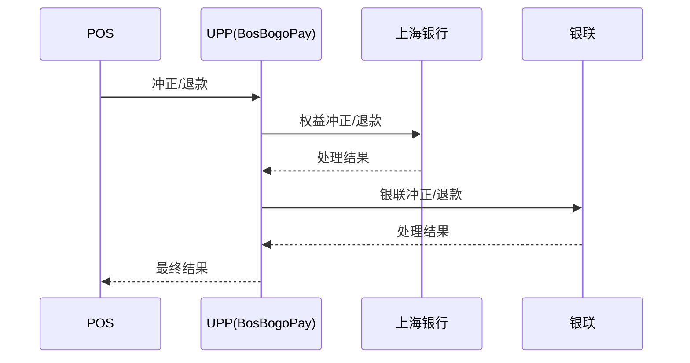
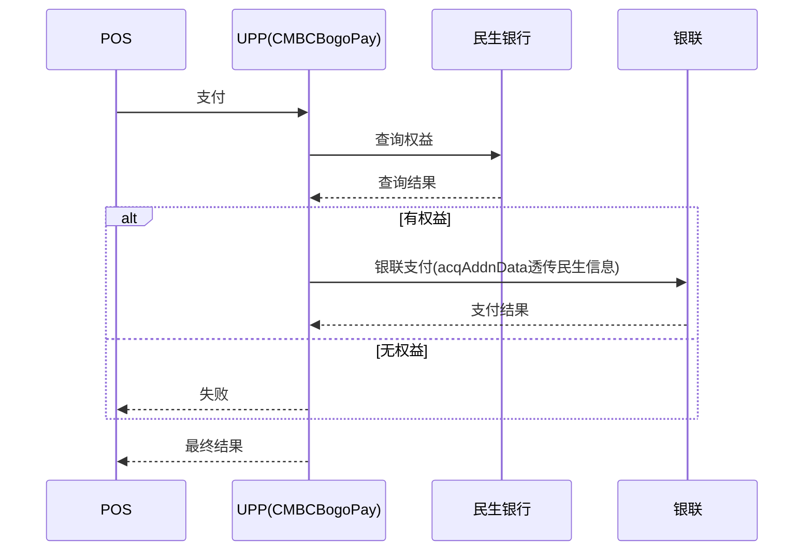
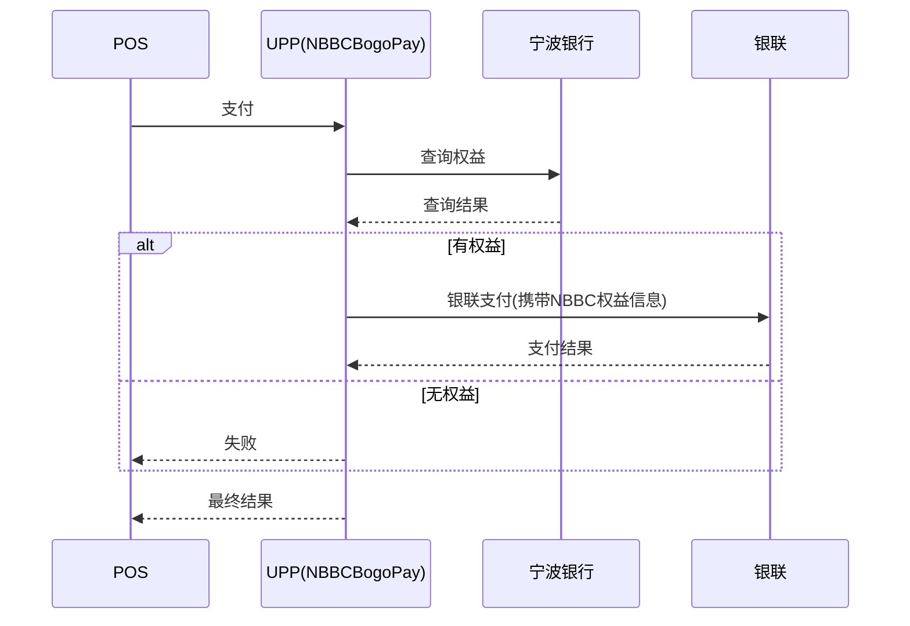
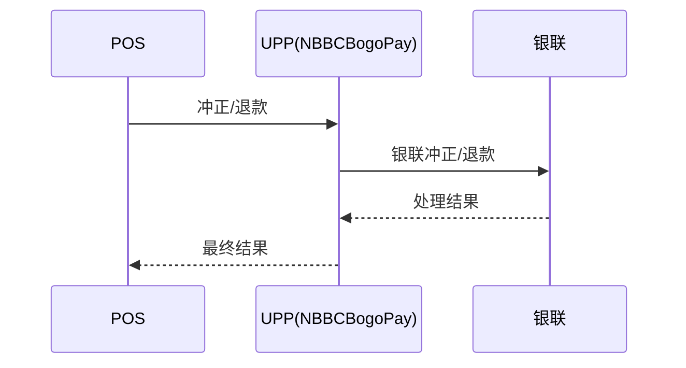
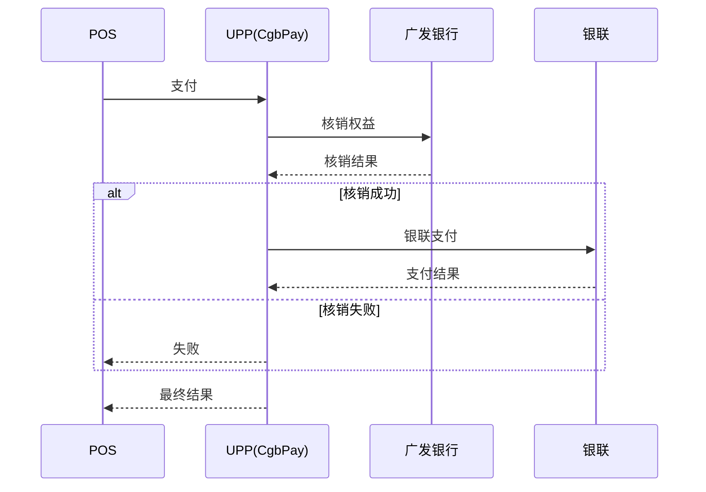
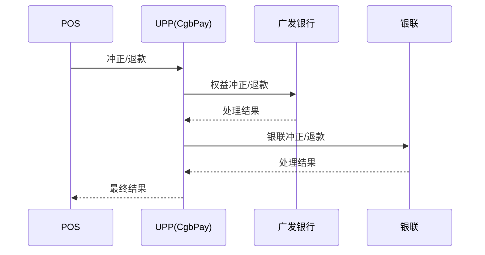
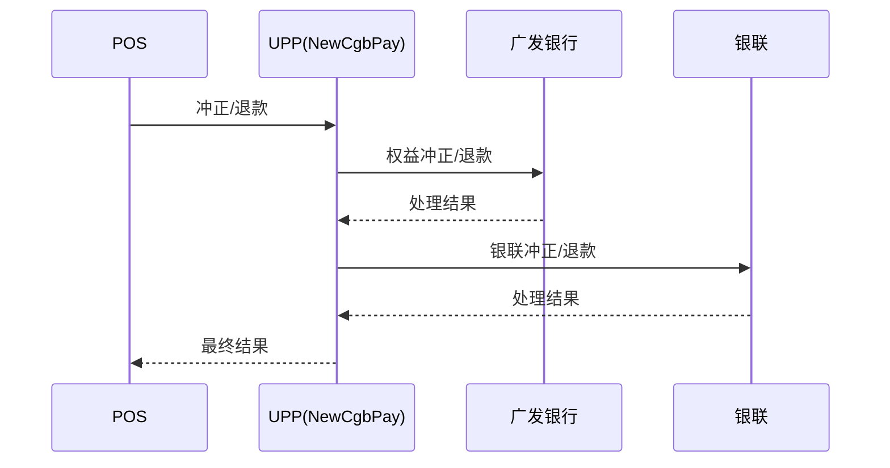
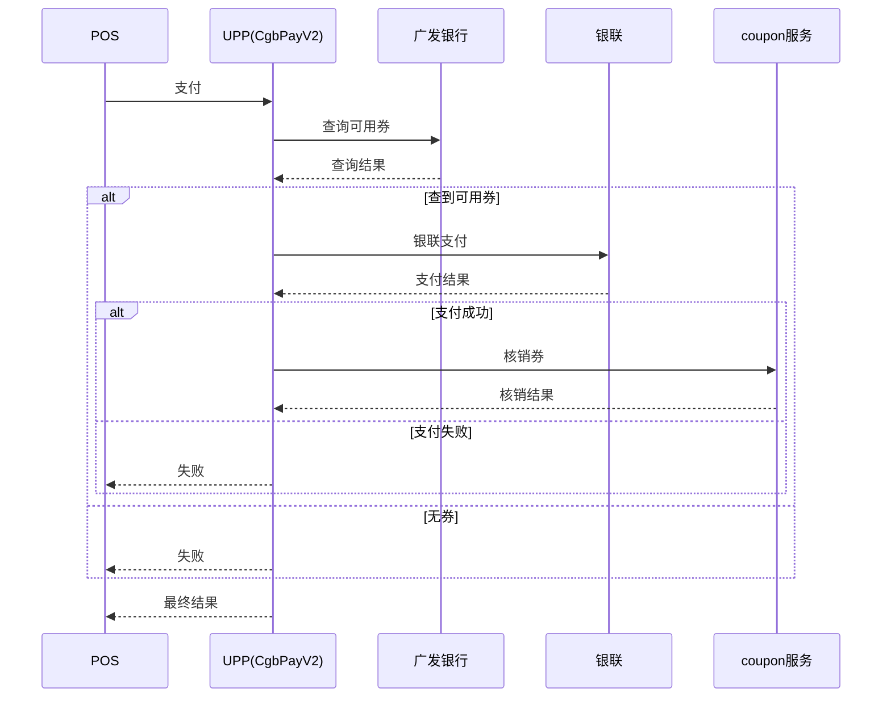
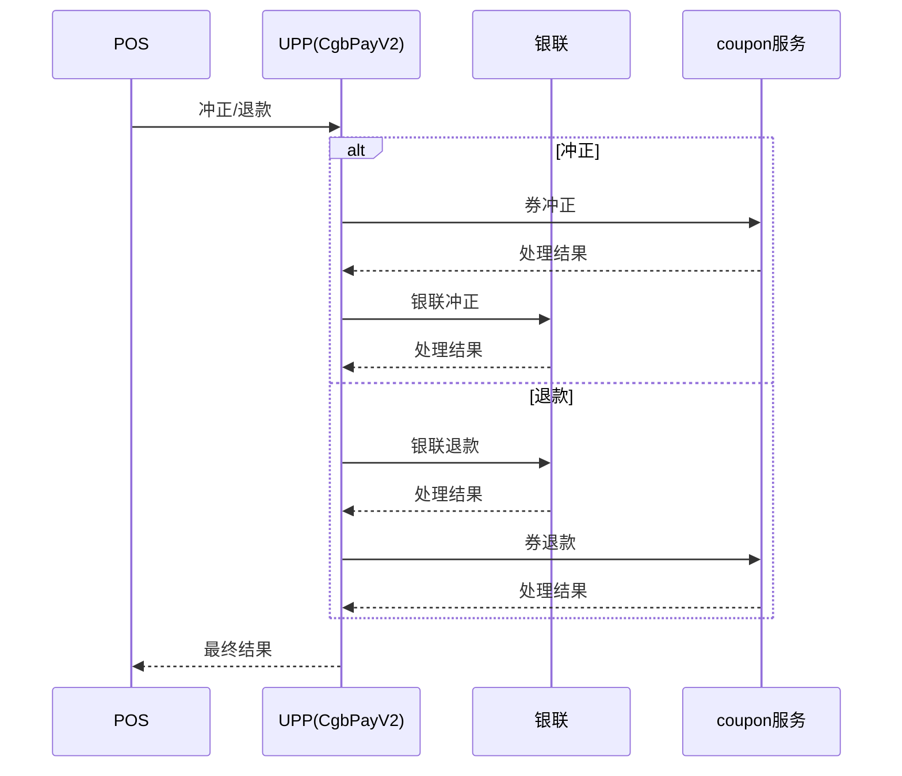

# 买一赠一渠道梳理

## 渠道总结

当前买一赠一相关银行渠道是 4 个：上海银行、民生银行、宁波银行、广发银行。

其中广发银行在代码里拆成了 3 条实现路径：旧版实现、新版实现、V2 实现，不是 3 个独立银行渠道。

上海银行、广发银行旧版实现、广发银行新版实现这 3 条路径的正向流程基本一致，都是先处理银行权益，再走银联支付；逆向也是先处理银行权益，再处理银联冲正或退款。

民生银行和宁波银行的正向流程都是先查银行权益，再走银联支付；逆向流程仅调银联，不存在单独的银行侧权益冲正/退款接口。

广发银行 V2 实现和前面几种不一样，正向是先查广发券，再走银联支付，成功后再调 `coupon` 服务核销；逆向里冲正是先处理 `coupon` 服务再冲正银联，退款则是先退银联再退 `coupon` 服务。

## 上海银行

- 实现类：`payment-cup/src/main/java/com/freemud/pay/bos/BosBogoPay.java`
- 正向：上海银行权益核销 -> 银联支付
- 逆向：上海银行权益冲正/退款 -> 银联冲正/退款

### 正向时序图

### 逆向时序图

## 民生银行

- 实现类：`payment-cup/src/main/java/com/freemud/pay/cmbc/CMBCBogoPay.java`
- 正向：民生查权益 -> 银联支付
- 逆向：仅银联冲正/退款
- 说明：没有民生侧权益冲正/退款接口，逆向时 UPP 只调银联

### 正向时序图

### 逆向时序图

## 宁波银行

- 实现类：`payment-cup/src/main/java/com/freemud/pay/nbbc/NBBCBogoPay.java`
- 正向：宁波查权益 -> 银联支付
- 逆向：仅银联冲正/退款
- 说明：没有宁波侧权益冲正/退款接口，逆向时 UPP 只调银联

### 正向时序图

### 逆向时序图

## 广发银行

- 说明：广发银行在代码里有 3 条实现路径，不是 3 个独立银行渠道
- 旧版实现：`payment/src/main/java/com/freemud/pay/cgb/CgbPay.java`
- 新版实现：`payment/src/main/java/com/freemud/pay/cgb/newest/NewCgbPay.java`
- V2 实现：`payment/src/main/java/com/freemud/pay/cgb/v2/CgbPayV2.java`
- 路由说明：
  - `CGB_BOGO(2)` 会在旧版实现和新版实现之间按配置切换
  - `CGB_BOGO_V2(11)` 走 V2 实现

### 旧版实现

- 实现类：`payment/src/main/java/com/freemud/pay/cgb/CgbPay.java`
- 正向：广发权益核销 -> 银联支付
- 逆向：广发权益冲正/退款 -> 银联冲正/退款

### 正向时序图

### 逆向时序图

### 新版实现

- 实现类：`payment/src/main/java/com/freemud/pay/cgb/newest/NewCgbPay.java`
- 正向：广发权益核销 -> 银联支付
- 逆向：广发权益冲正/退款 -> 银联冲正/退款

### 正向时序图

### 逆向时序图

### V2 实现

- 实现类：`payment/src/main/java/com/freemud/pay/cgb/v2/CgbPayV2.java`
- 公共逻辑：`payment/src/main/java/com/freemud/pay/cgb/v2/Common.java`
- 正向：广发查券 -> 银联支付 -> `coupon` 服务核销
- 逆向：冲正是 `coupon` 服务冲正 -> 银联冲正；退款是银联退款 -> `coupon` 服务退款

### 正向时序图

### 逆向时序图

