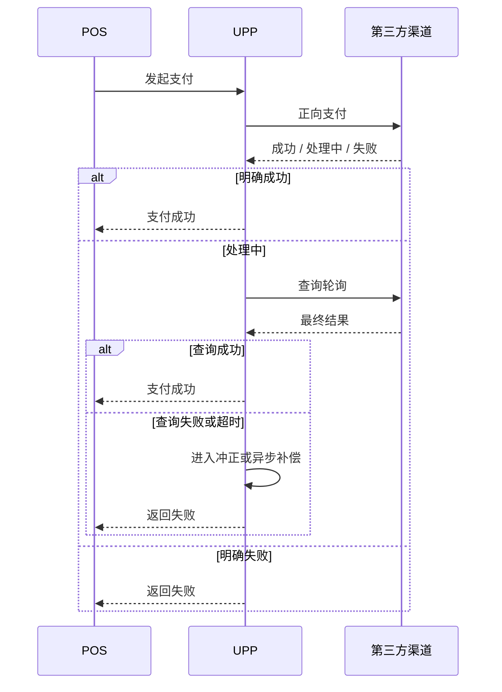
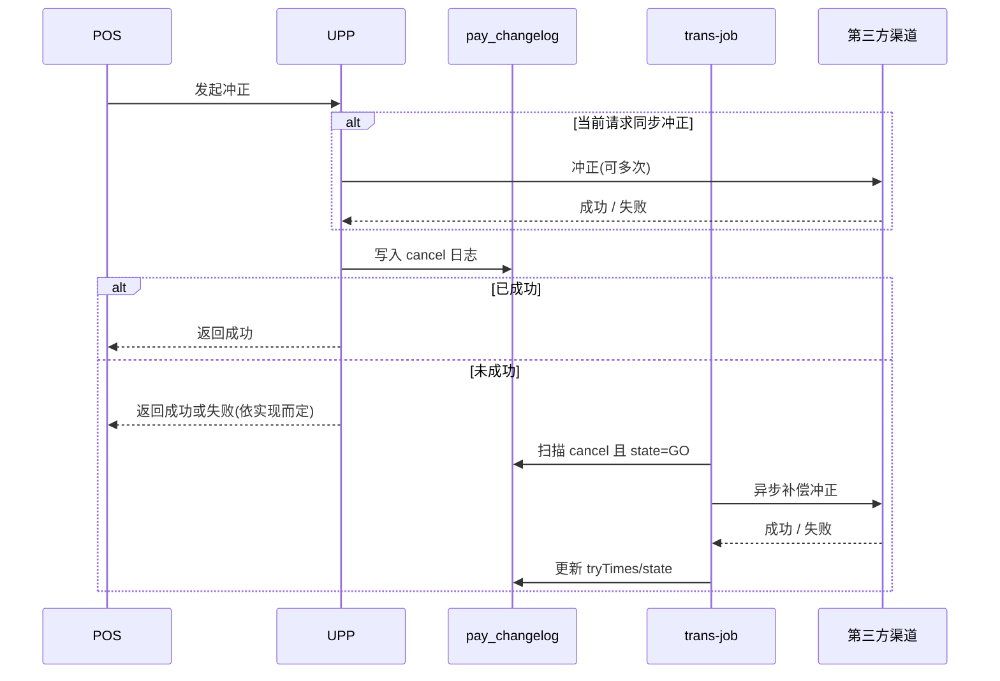
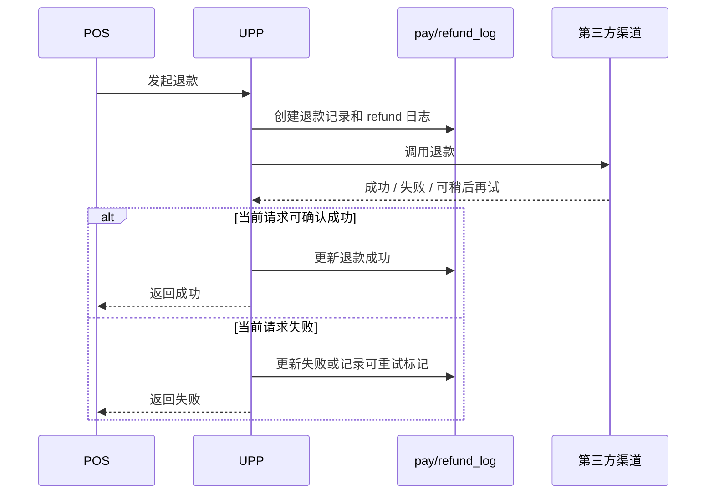
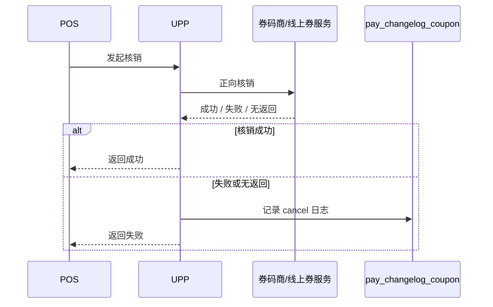
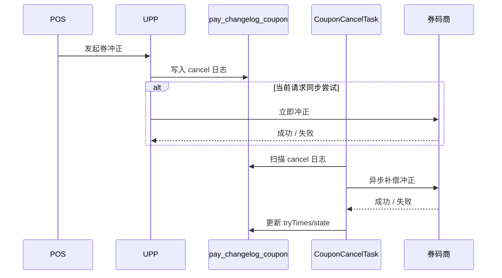
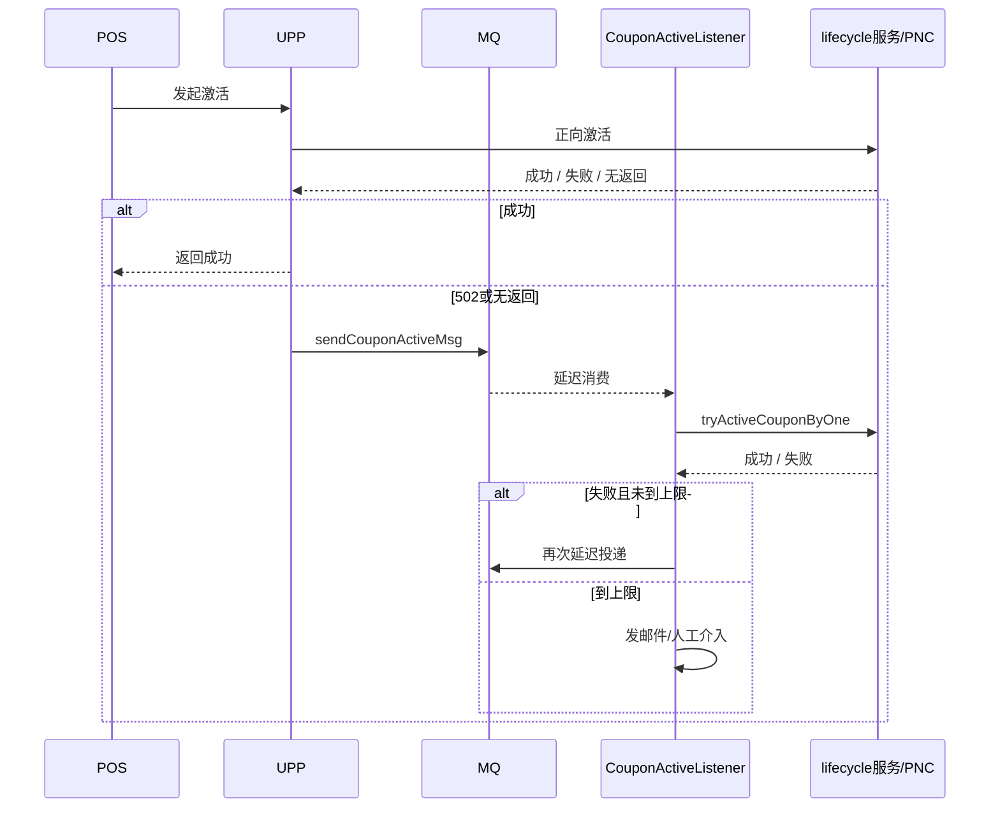
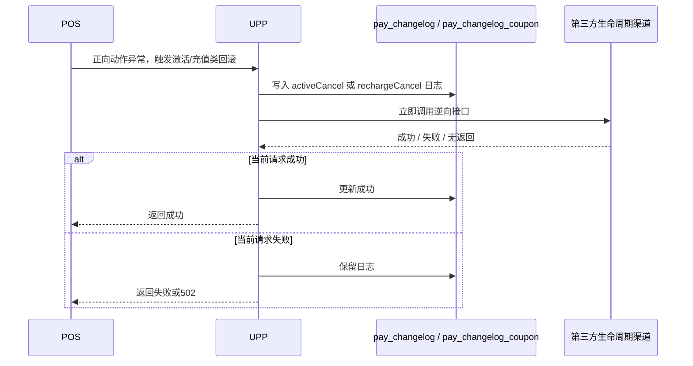
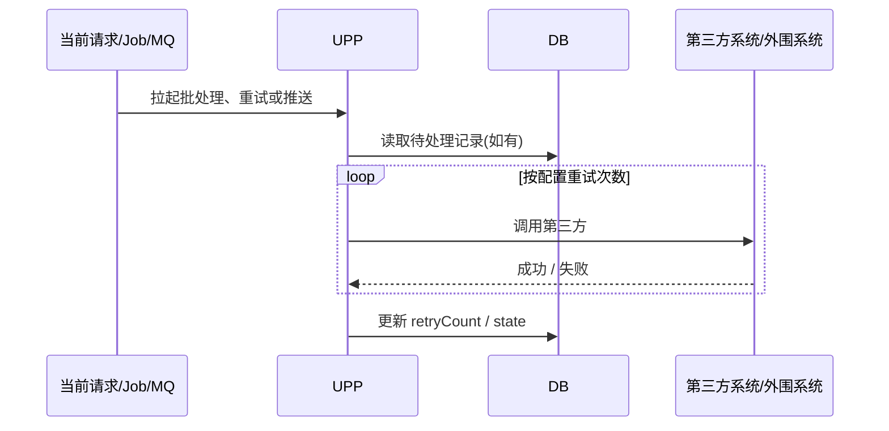

# 支付与卡券重试现状梳理

## 总览

- `trans-job` 只覆盖 `pay_changelog(cancel/refund/orderCancel)` 和 `pay_changelog_coupon(cancel/bogoCouponCancel)`；不覆盖 action 值 `activeCancel`、`rechargeCancel`。

| 类型 | 是否自动 | 典型形态 | 当前项目中的代表链路 |
|---|---|---|---|
| 同步轮询查询 | 是 | `for/while + sleep + query` | 支付宝支付、微信支付、银联支付/退款、数币支付/退款 |
| 同步多次重试 | 是 | 当前请求内重复调用同一动作 | 微信冲正、农业银行积分兑换/易百积分冲正、PE/CAC 推送 |
| MQ 延迟重投 | 是 | MQ + TTL / `@Retry` | 线上单券激活、批量券激活/核销、POS 星星核销 |
| Spring Retry | 是 | `@Retryable` | 批量单张券冲正 |
| 定时补偿 | 是 | `trans-job` / `xxljob` | 账户冲正、券冲正、SRKit 随单购 |
| 请求重入复用 | 否 | 当前失败先留状态；调用方后续再次发起同一笔退款请求时，复用原退款记录再尝试 | 微信退款 `REFUND_FAIL_TRY_AGAIN` |

## 补偿任务覆盖范围

| 任务 | 扫描范围 | 备注 |
|---|---|---|
| `PaymentCancelTask` | `pay_changelog.action = cancel and refund_id is null and state=0 and try_times<=cancelCount` | 账户类支付渠道冲正补偿（支付宝/微信/银联/积分支付等） |
| `PaymentRefundTask` | `pay_changelog.action = refund and refund_id is not null and state=0` | 代码存在；类注释写明“配置 未启用”，仓库内未看到明显调度引用 |
| `PaymentRefundCancelTask` | `pay_changelog.action = cancel and refund_id is not null and state=0 and try_times<=cancelCount` | 账户退款冲正补偿 |
| `OrderCancelTask` | `pay_changelog.action = orderCancel and state=0 and try_times<=cancelCount` | 订单冲正，类注释写明“暂未使用” |
| `CouponCancelTask` | `pay_changelog_coupon.action in (cancel, bogoCouponCancel) and refund_id is null and state=0 and try_times<=cancelCount` | 券冲正补偿 |
| 未覆盖 action 值 | `activeCancel`、`rechargeCancel` | 生命周期逆向日志不会被当前 `trans-job` 自动扫到 |

## 1. 账户支付

| 渠道组 | 处理方式 | 主要实现 |
|---|---|---|
| 支付宝 | SDK 内部支持“支付中 -> 轮询查询 -> 必要时异步撤销” | `payment-alipay/.../AliPay.java`、`alipay-trade-sdk/.../AlipayTradeServiceImpl.java` |
| 微信 | 支付后本地轮询查询结果 | `payment-wechat/.../WechatPay.java` |
| 银联 | 支付 / 退款都带查询轮询 | `payment-cup/.../UnionPayService.java`、`payment/.../PaymentUnionPayService.java` |
| 数币 | BOC / CCB 银行层都有查询循环 | `payment-ecny/.../ECNYBOCPayService.java`、`ECNYCCBPayService.java` |
| 农业银行积分兑换 | 支付处理中时按配置轮询 | `payment/.../ABCPointsPay.java` |
| 易百积分 / 直连浦发积分 | 支付后查询或递归查询交易结果 | `payment/.../EbuyPdbPay.java`、`SpdPointsPay.java` |
| 招行积分 | 当前按直调结果返回，未见统一支付后查询轮询 | `payment/.../EbuyCmbPay.java` |
| 星星 | 正向失败直接投 MQ，后续再重试 | `payment/.../StarPay.java` |

### 时序图

## 2. 账户类支付冲正

这里的“账户”指账户类支付渠道，不是会员余额账户。

- 典型范围：支付宝、微信、银联、数币、积分支付
- 不包括：券冲正、生命周期激活/充值类回滚

| 渠道组 | 冲正处理方式 | 主要实现 |
|---|---|---|
| 支付宝 | `asyncCancel=true`，先记 `cancel` 日志，再由 `trans-job` 补偿 | `payment-alipay/.../AliPay.java`、`ups-trans-service/.../AliPayCancelOrRefund.java` |
| 微信 | 当前请求内同步多次冲正；失败后继续由 `trans-job` 扫描 | `payment-wechat/.../WechatPay.java`、`ups-trans-service/.../WechatPayCancelImpl.java` |
| 银联 | 通用同步重试；失败后保留 `STATE_GO`，继续进入补偿任务 | `commons-pay/.../IPayImpl.java`、`ups-trans-service/.../UnionPayCancelImpl.java` |
| SVC / 索迪斯 / 猫享 / 招行支付 / 招行积分 | `asyncCancel=true`，以落库后异步补偿为主 | `SVCPay.java`、`PortalSVCPay.java`、`SodexoPay.java`、`MaoXiangPay.java`、`CMBPay.java`、`CmbPointPay.java` |
| 农业银行积分兑换 / 易百积分 / 招行积分 | 当前请求内最多 3 次重试 | `ABCPointsPay.java`、`EbuyPdbPay.java`、`EbuyCmbPay.java` |
| 数币 | 当前请求内单次 `doThirdCancel` | `payment-ecny/.../ECNYPayService.java` |

### 时序图

## 3. 账户退款

| 渠道组 | 退款处理方式 | 主要实现 |
|---|---|---|
| 支付宝 | 当前请求里对系统错误做退款查询兜底 | `payment-alipay/.../AliPay.java` |
| 微信 | 失败时可标记 `REFUND_FAIL_TRY_AGAIN`；后续同一笔退款请求再次进入时复用原退款记录 | `payment-wechat/.../WechatPay.java` |
| 银联 | 退款后查询轮询确认 | `payment-cup/.../UnionPayService.java`、`payment/.../PaymentUnionPayService.java` |
| 数币 | 银行层退款后查询循环 | `payment-ecny/.../ECNYBOCPayService.java`、`ECNYCCBPayService.java` |
| 广发新版 | 退款后继续 query 确认结果 | `payment/.../NewCgbPay.java` |
| 直连浦发积分 | 代码里保留 `refundQuery` 能力；当前退款主流程未启用查询确认 | `payment/.../SpdPointsPay.java` |
| 通用账户退款补偿 | 主流程创建退款记录和日志后立即 `doThridRefund`；代码中存在 `PaymentRefundTask` | `commons-pay/.../IPayImpl.java`、`trans-job/.../PaymentRefundTask.java` |

### 时序图

## 4. 券核销

| 券组 | 核销失败后的处理方式 | 主要实现 |
|---|---|---|
| Starbucks / ZHX 券 | 正向失败时常落 `pay_changelog_coupon cancel`，后续可进入冲正补偿 | `coupon/.../StarbucksCouponPay.java` |
| Freemud 券 | 无返回时直接落 cancel 日志 | `coupon/.../FreemudCouponPay.java` |
| Ebuy 券 | 失败时落 cancel 日志 | `coupon/.../EbuyCouponPay.java` |
| Hex 券 | 由子实现处理；逆向通过 wrapper 进入后续冲正流程 | `coupon/.../HexCouponPayWapper.java` |
| S4 学生券 | 正向失败会留 cancel 日志 | `coupon/.../S4StudentCouponPay.java` |
| POS 星星核销 | 失败直接投 MQ，后续重试 | `payment/.../StarPay.java` |

### 时序图

## 5. 券冲正

| 券组 | 冲正处理方式 | 主要实现 |
|---|---|---|
| Starbucks / ZHX 券 | 当前请求内尝试直连冲正；失败后日志保留 | `coupon/.../StarbucksCouponPay.java` |
| Freemud 券 | `doCancel` 主要负责记日志，后续依赖任务继续处理 | `coupon/.../FreemudCouponPay.java` |
| Ebuy 券 | 与 Freemud 类似，先记日志，再走后续补偿链路 | `coupon/.../EbuyCouponPay.java` |
| Hex 券 | `asyncCancel=true`，交给券补偿任务 | `coupon/.../HexCouponPayWapper.java` |
| 批量单张券冲正 | `@Retryable(maxAttempts=5)` | `coupon/.../BatchRedeemRetryService.java` |
| 券补偿任务 | `CouponCancelTask` 扫描 `cancel / bogoCouponCancel` | `trans-job/.../CouponCancelTask.java` |

### 时序图

## 6. 生命周期激活

| 动作 | 激活处理方式 | 主要实现 |
|---|---|---|
| 线上单券激活 | `502 / 无返回` 时发 MQ，再由监听器延迟重投 | `lifecycle/.../LifeCycleActiveService.java`、`mq-consumer/.../CouponActiveListener.java` |
| 批量券激活 | MQ 监听器 `@Retry(5, 30s)` | `mq-consumer/.../CouponBatchActivateListener.java` |
| PNC 卡激活 | 当前未做重试；代码注释写明“目前没有重试激活” | `lifecycle/.../ThirdLifecycleServicePNCImpl.java` |
| BaseLifecycle 线下激活 | 异常时一般立即调 `activeCancel` | `lifecycle/.../BaseLifecycleServiceImpl.java` |
| HEX 批量激活 | 多张券时直接发 MQ 做后续激活 | `lifecycle/.../ThirdLifecycleServiceHEXImpl.java` |

### 时序图

## 7. 激活/充值类动作的回滚

这部分说的不是账户支付，而是卡/券在生命周期域里的动作处理。

- 正向动作：激活、取消激活、充值、取消充值
- 逆向动作：上面这些动作失败、超时或结果不确定时触发的冲正/回滚
- 日志落点：卡类动作写 `pay_changelog`，券类动作写 `pay_changelog_coupon`
- 处理方式：请求内立即调用第三方逆向接口，并记录 action 值 `activeCancel` / `rechargeCancel`

| 场景 | 回滚处理方式 | 主要实现 |
|---|---|---|
| 激活失败后的回滚 | 会立即调用第三方冲正，并写 `activeCancel` 日志 | `BaseLifecycleServiceImpl.java`、`LifeCycleActiveService.java` |
| 取消激活失败后的回滚 | 同上 | `BaseLifecycleServiceImpl.java`、`LifeCycleActiveRevokeService.java` |
| 充值异常后的回滚 | 异常时立即调用 `rechargeCancel`，并写 `rechargeCancel` 日志 | `LifeCycleRechargeService.java` |
| 取消充值异常后的回滚 | 异常时立即调用 `rechargeRevokeCancel`，并写 `rechargeCancel` 日志 | `LifeCycleRechargeRevokeService.java` |
| 后台任务覆盖 | 当前 `trans-job` 不消费 `activeCancel / rechargeCancel` | `trans-job/.../TransJobDao.xml` |

### 时序图

## 8. 批量处理、重试循环与外部系统推送

这一节汇总的是批量处理、外围重试和结果推送，不按单一执行方式分类。

- 当前请求内重试：`while/for`、`@Retryable`
- 异步补做：MQ 重试、定时扫描
- 外部推送：对 PE / CAC 等外围系统的通知重试
- 共同模式：按配置重试次数继续调用，最后更新状态或重试次数

| 机制类型 | 模块 | 处理方式 | 主要实现 |
|---|---|---|---|
| Spring Retry | 批量单张券冲正 | `@Retryable(maxAttempts=5, delay=3s)` | `coupon/.../BatchRedeemRetryService.java` |
| 定时补偿 | 随单购 SRKit | XXLJob 周期扫描并按 `retryCount` 重做 | `coupon/.../RetryRedeemPropertyOrderJob.java` |
| 同步批处理 | Ebuy / ZHX 批量激活工具 | 当前请求内按配置 `retryTimes` 循环调用 | `commons-service/.../BatchCouponActiveServiceImpl.java` |
| MQ 重试 | 批量券激活 | `@Retry(5, 30s)` | `mq-consumer/.../CouponBatchActivateListener.java` |
| MQ 重试 | 批量券核销 | `@Retry(5, 30s)` | `mq-consumer/.../CouponBatchRedeemListener.java` |
| MQ 重试 | POS 星星核销重试 | `@Retry(3, 10s)` | `mq-consumer/.../RetryPosStarRedeemListener.java` |
| 外部推送重试 | PE 推送 | `while + retryCount--` | `commons-service/.../PushPEActiveService.java` |
| 外部推送重试 | CAC 推送 | `while + retryCount--` | `commons-service/.../PushActive2CACService.java` |

### 时序图

