# SRKIT/SVC 卡履约链路从 FC 平移至 DPFM
---

> 分析日期：2026-05-07
需求编号：REQ-20260402-001
版本：v1.5  
最近更新：2026-05-07
>

---

## 版本更新说明
### v1.5（2026-04-13 流量复核）
本次更新基于**附录 C.10 无流量场景的 30 天窗口复核**（2026-03-14 ~ 2026-04-13，索引 `gds*:p-fulfillment-center*`），修正 v1.3/v1.4 中基于 24h 窗口得出的错误结论：

1. **businessTypeCode=26（银行星礼包/B2B 银行）从"无流量"修正为"有流量"**
    - 30 天命中数：`"businessTypeCode":26` = **264,829** 条；channel=`b2bSRKit` = **496,578** 条
    - 24h 窗口的"无流量"结论系采样窗口过短导致，实为核心生产业务
    - **影响**：第 7.3 章灰度策略已同步调整 — 场景 3（银行星礼包）由原"第三批非主流量"上调至"第四批与场景 1 同批次"，需按主流量路径补压测和真实流量回归
2. **三方售卖星礼包（businessTypeCode=22）确认无流量**
    - 30 天 + all-time 双重验证均为 0 命中
    - 迁移时仅需保留接口契约和路由配置，功能验证可降级为代码走查 + Mock 测试
3. **POS SRKit Set 三个批量接口（5G/5H/5I）确认无流量**
    - 接口名（`posBatchSrkitActivate` / `batchBindSRKitMix` / `batchUnbindSRKit`）+ 中文日志关键词双查均为 0 命中
    - 维持 v1.4 的"合并到场景 5、灰度第六批最后验证"策略

> 本次复核证实"无流量不代表功能废弃"的提醒在 businessTypeCode=26 上是关键的 — 24h 窗口结论会严重误导迁移优先级排序。后续核验类似"无流量"标注时，统一采用 30 天窗口。
>

### v1.4（2026-04-02 二次修正）
本次更新基于 **FC 源码复核**，对 v1.3 中的两个重大认知错误进行修正：

1. **场景7（SVC卡）修正 — 只有2种业务场景，不是3种**
    - 代码证据：`ApiServiceImpl.java:586-590` 分支条件只区分 `1301`（建卡并充值）和 `svcReloadSubTypeCodeList`（充值）两类；`UppServiceImpl.java:182` 证实 1301 在 UPP 建卡成功后**立即自动**调用 `sendMessage(..., UPP_RELOAD_CARD_ROUTINGKEY)` 级联充值，属于同一流程内的串行动作。
    - 修正内容：
        * 场景标题由"SVC卡购买/充值/绑定"改为"**SVC卡建卡并充值/充值**"
        * 明确两种业务场景：`1301 = 建卡并充值`（APP 购卡场景，建卡后自动级联充值）、`1302/3401 = 充值`（APP/微信纯充值，入参必须带 cardNo）
        * **删除 "SVC 卡手动绑定" 的所有相关描述**（该概念属于实体星礼包/SRKIT，而非 SVC）
        * 同步删除：第4章 dpfm-api-service API 列表中 `/api/v2/fulfillment/request/add` 接口；第7.6章待确认事项中"SVC 卡手动绑定"项
        * 更新 PlantUML 时序图：明确 1301 建卡成功后自动级联 ReloadCard
        * 附录 C.9 标题改为"SVC卡 — 2个业务场景验证"，SubTypeCode 重新按 2 类组织
2. **场景8（SRkit Set）修正 — 本质是 POS 实体星礼包的批量版，合并到场景5**
    - 代码证据：`ApiController.java:476-528` 中 3 个接口的 `@ApiOperation` 明确标注为"POS批量XX**实体星礼包**"：
        * 第 477 行：`posBatchSrkitActivate` = "POS批量激活实体星礼包"
        * 第 506 行：`batchBindSRKitMix` = "POS混合批量绑定实体星礼包"（**Mix 指混合卡类型**，即 8 开头 / 7 开头 / 加密卡格式，而非混合 Set）
        * 第 522 行：`batchUnbindSRKit` = "POS批量解绑实体星礼包"
    - 修正内容：
        * **删除独立的"场景8：SRkit Set"**，将其 3 个批量接口并入场景5 作为新子场景：
            + **5G = posBatchSrkitActivate**（5B 批量版）
            + **5H = batchBindSRKitMix**（5C 批量版）
            + **5I = batchUnbindSRKit**（5D 批量版）
        * 场景编号：原场景 9（退款）→ 场景 8，原场景 9（后台）→ 场景 9（场景 8 SRkit Set 被合并到场景 5）
        * 目录删除"场景8：SRkit Set"条目，场景5 体现批量子场景 5G/5H/5I

### v1.3（2026-04-09）
本次更新基于 **2026-04-09 的全面 FC 代码扫描和生产日志验证**，补充了 v1.2 遗漏的 **17 个接口/任务/队列**。主要更新内容：

1. **新增场景8：星礼包退款链路**（高优先级）
    - 8A：一次性支付星礼包退款（`/api/v2/fulfillment/request/return`）
    - 8B：POS电子星礼包退货检查（`/api/v2/fulfillment/request/card/refund/check`）
    - 8C：OC回调SRKIT退款单号（`/api/v2/fulfillment/callback/refund/info`）
2. **新增子场景5F**：官网实体星礼包绑定（`/api/v2/fulfillment/request/add/web/bind`）
3. **场景6完善**：明确 `preGenerateSrkit` 和 `invalidPreGenerateSrkit` 两个独立接口
4. **新增第4.8章**：FC 定时任务迁移清单（8 个定时任务）
5. **MQ 队列补充**：6 个遗漏的 SRKIT 相关队列
6. **场景5补充**：明确 POS 批量操作的 3 个接口（原 SRkit Set，v1.4 合并为 5G/5H/5I）
7. **新增场景9**：运营后台管理接口（低优先级）
8. **附录B 追加接口表**：FC 其他 SRKIT/SVC 相关接口（非 fulfillDeal 入口）共 17 个接口

---

## 目录
+ [1. 需求概述](#1-需求概述)
+ [2. 业务场景分析](#2-业务场景分析)
    - [场景1：O2O随单购星礼包](#场景1o2o随单购星礼包)
    - [场景2：省心购售卖星礼包](#场景2省心购售卖星礼包)
    - [场景3：银行星礼包](#场景3银行星礼包)
    - [场景4：三方渠道售卖星礼包](#场景4三方渠道售卖星礼包)
    - [场景5：POS售卖实体/电子星礼包](#场景5pos售卖实体电子星礼包)（含子场景 5A–5I，5G/5H/5I 为批量）
    - [场景6：POS随单购星礼包](#场景6pos随单购星礼包)
    - [场景7：SVC卡建卡并充值/充值](#场景7svc卡建卡并充值充值)
    - [场景8：星礼包退款链路](#场景9星礼包退款链路)
    - [场景9：运营后台管理接口](#场景9运营后台管理接口)
+ [3. 服务影响总览表](#3-服务影响总览表)
+ [4. 各服务改造点汇总](#4-各服务改造点汇总)
    - [4.8 FC 定时任务迁移清单](#48-fc-定时任务迁移清单)
+ [5. MQ队列规划](#5-mq队列规划)
+ [6. 数据模型变更](#6-数据模型变更)
+ [7. 风险与注意事项](#7-风险与注意事项)
+ [附录：FC fulfillDeal 完整分支梳理](#附录fc-fulfilldeal-完整分支梳理)
+ [附录C：生产日志验证样本](#附录c生产日志验证样本)

---

## 1. 需求概述
### 1.1 业务背景
当前星礼包（SRKIT）和星礼卡（SVC Card）的履约链路由 FC（履约中台）系统中的 `fc-fulfillment-digital` 服务承担。该服务负责接收 FC Controller 通过 MQ 分发的履约任务，调用下游系统（DPFM、UPP、S4、CAC、OC、CRM 等）完成卡的创建、激活、绑定、充值、回调等全生命周期操作。

本次需求目标是将上述 SRKIT/SVC 卡履约能力**整体平移至 DPFM（数字商品履约管理）系统**，迁移完成后：

+ 上游 OMS 系统（O2O OMS、D OMS、DP OMS）及 POS 系统直接调用 DPFM 的 API 发起履约请求，不再经由 FC。
+ FC 中 `fc-fulfillment-digital` 服务不再承担 SRKIT/SVC 卡相关的履约逻辑，仅保留券（Coupon）和 CDK 相关能力。
+ DPFM 需承接原 FC fulfillment-digital 的所有 SRKIT/SVC 卡相关 MQ 队列、下游调用、回调逻辑。

### 1.2 迁移范围总览
| 维度 | 迁移范围 |
| --- | --- |
| 业务场景 | 7 个核心场景 + 1 个后台管理场景（v1.4 修正：原 v1.3 场景8 已合并到场景5） |
| MQ 队列 | 约 40+ 个队列（SRKIT 相关 + 三方权益 + 延时队列） |
| 下游系统 | DPFM（内部）、UPP、S4、CAC、OC、Online CRM、CRM Adapter、Digital OMS、3PP Gateway/TPES、天猫中间件、NC |
| 认证方式 | RSA 签名、apikey、appKey/appSecret 等多种方式需迁移 |


### 1.3 迁移原则
1. **功能对等**：迁移后新链路的业务功能与现有链路完全一致
2. **入口防腐层（强约束）**：DPFM 新链路入口侧必须设防腐层 —— **API path、请求参数、响应参数与 FC 旧接口完全一致**，不得发明 `/api/v1/srkit/*`、`/api/v1/svc/*` 等新路径。上游系统仅改目标地址（DNS/配置），**零代码改造**。内部领域模型、MQ topic、表结构可按 DPFM 规范演进，通过防腐层对外透明。
3. **上游感知最小化**：（由原则 2 落地保证）上游只需切换调用地址，接口契约字节级兼容
4. **MQ 消费者归属（强约束）**：迁移新增的所有 SRKIT / SVC 相关 MQ 消费者**统一落在 **`dpfm-callback-service`，**不新增到 **`dpfm-consumer-service`（后者仅保留原有电商券/订单/归档等消费职责）。`dpfm-api-service` 只做 API 接收、持久化、MQ 发送，不消费自己发的消息。
5. **MQ Topic 命名规范（强约束）**：所有 DPFM 新 MQ topic 采用 **DPFM 风格小写 dash 分隔**，格式 `dpfm-<domain>-<action>-queue`（如 `dpfm-srkit-create-card-queue`、`dpfm-svc-reload-queue`）。**禁止使用** FC 遗留的大写 `#` 分隔风格（`FULFILLMENT#*#*` 或 `DPFM#*#*`）。Java 常量变量名可保持大写驼峰，但常量值必须为小写 dash 形式。
6. **灰度可控**：支持按场景/渠道灰度切流
7. **可回滚**：迁移期间保留 FC 旧链路，支持快速回切

> ⚠️ **2026-04-15 新增原则 4/5 落地说明**：  
本文档全文已按原则 4 将所有新链路 MQ 消费节点从 `dpfm-consumer-service` 改为 `dpfm-callback-service`；按原则 5 将所有 `DPFM#*#*` 大写 hash topic 改为 `dpfm-*-*-queue` 小写 dash 形式。
>

> ⚠️ **防腐层落地（2026-04-15）**：  
本文档全文已按本原则统一 —— DPFM 入口 API path 与出入参全部对齐 FC 原接口。权威接口清单见**第 4.1 节 "API 接口（按入口防腐层原则保持与 FC 完全一致）"**。  
历史 v1.1–v1.4 版本中使用的 `/api/v1/*` 规划路径全部作废，不再在方案中出现。
>

---

## 2. 业务场景分析
---

### 场景1：O2O随单购星礼包
> **事实核对（2026-04-15 审计）**
>
> **已确认事实：**
>
> + `srkitTypeCodeList = [2, 12, 21, 22, 23, 26, 37, 43]`，来源：fc-controller `application-dev.yml:196-204`
> + 一次性支付路由由 `businessSubTypeCode` 决定（`ApiServiceImpl.java:609-616`），与 `businessTypeCode` 无关
> + 旧链路 MQ topics（`FULFILLMENT#DPMS#CREATE#CARD`、`FULFILLMENT#CARD#CALLBACK#OC`、`FULFILLMENT#ONLINE#CRM#UPDATE#CARD`、`FULFILLMENT#ENTITY#SRKIT#BIND#CAC`、`FULFILLMENT#ENTITY#COUPON#BIND#CAC`）均已在 `MQConstant.java` 中核实存在
> + 生产 7 天 `preGenerateSrkit` ≈ 96,700 次（2026-04-15 查询）
>
> **已证伪 → 已澄清（2026-04-16）：**
>
> + 原文"一次性支付 SubTypeCode 列表 8 项"：fc-controller（8 项，不含 `11001`）与 fc-digital ThirdBenefitServiceImpl（9 项，含 `11001`）存在差异，但**以入口侧 fc-controller 为准（8 项）**。`oneTimeSubTypeCodeList` 的作用是控制星礼包权益是否**自动发放**（一次性支付场景不自动发放权益）
> + 原文"`externalSrkitTypeCodeList = [22, 26, 43, 37]`"仅反映 fc-controller Nacos 配置；fc-digital（S4ServiceImpl / CrmAdapterServiceImpl / ThirdBenefitServiceImpl）硬编码为 `["22","26"]`，不含 43/37，**代码/配置分裂**
>
> **已确认（2026-04-16）：**
>
> + ✅ DPFM 侧尚无 SRKIT 逻辑是正常的 — 本项目的目标就是把 FC 能力迁移过来，方案需包含 DPFM 侧的架构设计
> + ✅ 路由判断使用 `businessTypeCode` / `businessSubTypeCode`，**不依赖 sourceCode**（FC sourceCode 不准确）
>
> **已确认（2026-04-17）：**
>
> + ✅ **代码/配置分裂以入口 fc-controller 为准** — `externalSrkitTypeCodeList = [22, 26, 43, 37]`（Nacos 配置）即权威定义；fc-digital 硬编码 `["22","26"]` 视为下游实现差异，迁移到 DPFM 后统一以入口配置为准，bt=43/37 归入 external 分支
>

#### 场景描述
用户在 O2O 渠道下单购买星礼包（随订单一起购买，即"一次性支付订单"）。订单完成后，O2O OMS 发起履约请求，系统需完成：建 SVC 卡、激活绑定星礼包（UPP）、三方权益绑定、多系统回调同步。

**涉及的 businessTypeCode（来自 FC controller srkitTypeCodeList 配置）**：

+ `2` — O2O 随单购星礼包
+ `12` — 星礼包场景
+ `21` — 星礼包场景
+ `22` — 3PP 电子星礼包
+ `23` — 星礼包场景
+ `26` — B2B 电子星礼包
+ `37` — 星礼包场景
+ `43` — 星礼包场景

**一次性支付渠道 businessSubTypeCode**（权威定义：`fulfillment-digital/ThirdBenefitServiceImpl.java:90`，9 项）：  
`301`, `501`, `1501`, `1801`, `1807`, `1811`, `2401`, `1821`, `11001`

> ⚠️ 注意：`fulfillment-controller/DigitalServiceImpl.java:110` 中该列表为 8 项，**不含 **`11001`，两个服务之间存在列表分裂。迁移前需统一以 `ThirdBenefitServiceImpl` 的 9 项版本为准。
>

> **重要修正（2026-04-07 生产日志验证）**：一次性支付分支的路由判断**完全靠 businessSubTypeCode**，**与 businessTypeCode 无关**。ApiServiceImpl 第609-616行直接判断 SubTypeCode 是否在 `[501,301,1501,1807,1801,1811,1821,2401]` 中，不同的 businessTypeCode（如 5、15、18、24 等）都可能搭配这些 SubTypeCode 进入一次性支付分支。例如生产日志中 O2O 随单购实际使用 `businessTypeCode=5, businessSubTypeCode=501`（产品：金星会员体验月卡），而非此前假设的 businessTypeCode=2。
>

> 注：FC controller 通过 `BusinessTypeConfig.srkitTypeCodeList`（Nacos 配置 `business.srkit.srkitTypeCodeList`）判断是否为 SRKIT 类型，匹配后走 BOM 配置拆解 + MQ 异步分发链路。但一次性支付分支在 srkitTypeCodeList 判断**之前**就被拦截（ApiServiceImpl 第609-616行），因此不要求 businessTypeCode 在 srkitTypeCodeList 中。
>

**新老链路判断逻辑（externalSrkitTypeCodeList）**：

+ fc-controller 侧 Nacos 配置：`externalSrkitTypeCodeList = [22, 26, 43, 37]`（`application-dev.yml:216-220`）
+ fc-digital 侧硬编码：`externalSrkitTypeCodeList = ["22", "26"]`（`S4ServiceImpl.java:96`、`CrmAdapterServiceImpl.java:90`、`ThirdBenefitServiceImpl.java:87` 三处一致，不含 43/37）
+ 当 businessTypeCode 在此列表中时，走**新链路**（S4 直接生成卡，卡由 S4 生成）
+ 当 businessTypeCode 不在此列表中时（如 2, 12, 21, 23），走**老链路**（卡由 DPFM 生成）
+ 具体判断：如果 UPP(S4) 返回的 srkitCardNo 不为空，或者 businessTypeCode 在 externalSrkitTypeCodeList 中，则为新链路
+ ⚠️ **代码与配置分裂**：迁移前必须对齐两侧列表，否则 bt=43/37 在 digital 侧实际走老链路（与 controller 配置意图不符）
+ 这个区别直接影响迁移后 DPFM 的设计：DPFM 需要同时支持两种建卡方式

#### 旧链路分析（现状）
```plain
O2O OMS
  -> [HTTP POST] FC fulfillment-controller (/api/v2/fulfillment/request/add, businessTypeCode in srkitTypeCodeList)
     -> FC controller 根据 BOM 配置拆解
     -> FC controller 判断 businessTypeCode 是否在 externalSrkitTypeCodeList (22,26,43,37) 中：
        -> 若在（新链路）：FC -> UPP(S4) 发券，S4直接返回 srkitCardNo
        -> 若不在（老链路，如 businessTypeCode=2）：
           -> [MQ] FULFILLMENT#DPMS#CREATE#CARD -> fc-fulfillment-digital
              -> [HTTP+RSA] DPFM 建 SVC 卡 -> 返回 cardNo
           -> 后续走 UPP 创建/激活、CAC 同步等
     -> [MQ] FULFILLMENT#UPP#CREATE#CARD -> fc-fulfillment-digital
        -> [HTTP+RSA] UPP 创建/激活绑定星礼包
     -> [MQ] FULFILLMENT#CARD#CALLBACK#SYSTEM -> fc-fulfillment-digital
        -> [HTTP] 回调 Digital OMS 卡号
     -> [MQ] FULFILLMENT#CARD#CALLBACK#OC -> fc-fulfillment-digital
        -> [HTTP] 回调 OC 卡号
     -> [MQ] FULFILLMENT#ONLINE#CRM#UPDATE#CARD -> fc-fulfillment-digital
        -> [HTTP+RSA] 调 Online CRM 更新卡号
     -> [MQ] FULFILLMENT#CAC#CALLBACK#CARD#AMOUNT -> fc-fulfillment-digital
        -> [HTTP] 调 CAC 卡余额同步
     -> [MQ] FULFILLMENT#THIRD#PARTY#*#BINDING -> fc-fulfillment-digital
        -> [HTTP+RSA] 调 3PP Gateway/TPES 三方权益绑定
     -> 若星礼包含 0 元 SVC 卡:
        fc-fulfillment-digital -> [HTTP+RSA] DPFM 建卡 -> UPP -> PNC
     -> SVC 卡同步: fc-fulfillment-digital -> S4/CAC/OC/OMS
     -> 星礼包及券同步至 CAC（两种机制并存，经生产日志验证）：
        机制A（activateAndBind 场景）：S4 内部异步推送
          S4 activateAndBindSRKit 完成后，S4 内部 SbuxNotifyServiceImpl 异步线程
          主动调 CAC /asset-service/asset/v1/srkit/sync + /asset-service/asset/v1/benefit/sync
          ！！！迁移后此机制不变（S4 内部行为，与 FC/DPFM 无关）
        机制B（实体星礼包绑定/解绑场景）：FC digital MQ 触发
          -> [MQ] FULFILLMENT#ENTITY#SRKIT#BIND#CAC -> fc-fulfillment-digital -> [HTTP] CAC /asset-service/asset/srkit/bind/tomember
          -> [MQ] FULFILLMENT#ENTITY#COUPON#BIND#CAC -> fc-fulfillment-digital -> [HTTP] CAC 券绑定
          ！！！迁移后此机制需由 DPFM 承接
```

#### 新链路设计（迁移后）
> ⚠️ **实现状态（2026-04-15）**：本节 DPFM MQ topics（`dpfm-srkit-create-card-queue` 等）及 API 路径 `/api/v2/fulfillment/request/add` 在 DPFM 代码库中**尚未实现**，属前瞻性设计。DPFM-consumer-service 现有代码为通用电商券发码架构。实际 DPFM 已有接口为 `/api/v2/fulfillment/request/add`（见 `FulfillmentAdapterController.java`）。
>

迁移后，O2O OMS 直接调用 DPFM API Service，由 DPFM 内部完成 BOM 拆解、MQ 分发和下游调用。

```plain
O2O OMS
  -> [HTTP POST] dpfm-api-service (/api/v2/fulfillment/request/add, businessTypeCode in srkitTypeCodeList)
     -> dpfm-api-service 接收请求，持久化履约单，根据 BOM 配置拆解
     -> [MQ] dpfm-srkit-create-card-queue -> dpfm-callback-service
        -> [HTTP+RSA] DPFM 内部建 SVC 卡（dpfm-send-core-service）-> 返回 cardNo
     -> [MQ] dpfm-srkit-upp-create-queue -> dpfm-callback-service
        -> [HTTP+RSA] UPP 创建/激活绑定星礼包
     -> [MQ] dpfm-srkit-callback-oms-queue -> dpfm-callback-service
        -> [HTTP] 回调 Digital OMS 卡号
     -> [MQ] dpfm-srkit-callback-oc-queue -> dpfm-callback-service
        -> [HTTP] 回调 OC 卡号
     -> [MQ] dpfm-srkit-crm-update-queue -> dpfm-callback-service
        -> [HTTP+RSA] 调 Online CRM 更新卡号
     -> [MQ] dpfm-srkit-cac-sync-queue -> dpfm-callback-service
        -> [HTTP] 调 CAC 卡余额同步
     -> [MQ] dpfm-srkit-3pp-binding-queue -> dpfm-callback-service
        -> [HTTP+RSA] 调 3PP Gateway/TPES 三方权益绑定
     -> 若含 0 元 SVC 卡:
        dpfm-send-core-service 内部建卡 -> [HTTP+RSA] UPP -> PNC
     -> SVC 卡同步: dpfm-callback-service -> S4/CAC/OC/OMS
     -> 星礼包及券同步至 CAC：
        机制A（activateAndBind 场景）：S4 内部异步推送，不需 DPFM 参与（保持不变）
        机制B（实体星礼包绑定/解绑场景）：由 DPFM 承接（替代原 FC digital）
          -> [MQ] dpfm-srkit-bind-cac-queue -> dpfm-callback-service -> [HTTP] CAC /asset-service/asset/srkit/bind/tomember
          -> [MQ] dpfm-coupon-bind-cac-queue -> dpfm-callback-service -> [HTTP] CAC 券绑定
```

#### 涉及服务
|  | 旧链路 | 新链路 |
| --- | --- | --- |
| 核心服务 | fc-fulfillment-controller, fc-fulfillment-digital | dpfm-api-service, dpfm-send-core-service, dpfm-callback-service, dpfm-retry-service |


#### 上下游系统
|  | 系统 |
| --- | --- |
| 上游 | O2O OMS |
| 下游 | UPP、S4、CAC、Online CRM、OC、Digital OMS、3PP Gateway/TPES、NC |


#### 新链路 PlantUML 时序图
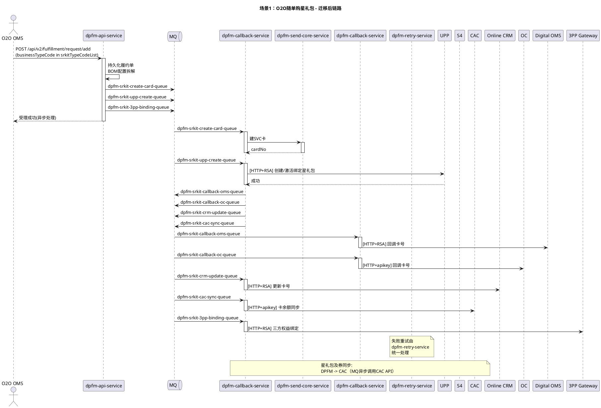

---

### 场景2：省心购售卖星礼包
> **事实核对（2026-04-15 审计）**
>
> **已确认事实：**
>
> + 省心购 APP 渠道 `businessTypeCode=2`、`businessSubTypeCode=100`（`XxlJobTimer.java:28` + `selfSrkitTypeCodeList=["2","21","23","12"]`）
> + 省心购微信渠道 `businessTypeCode=21`、`businessSubTypeCode=2101`（非 2）— ES 7 天 `"businessTypeCode":"21"` + `"2101"` 组合命中 **27,562** 次
> + 走标准 SRKIT 履约流程（selfSrkitTypeCodeList 分支，UPP 建卡），不走一次性支付分支
>
> **已证伪：**
>
> + 原文"`2101` 对应 businessTypeCode=2"错误 → 实为 **21**（ES: bt=2+st=2101 仅 2 hits，bt=21+st=2101 = 27,562 hits）
> + 原文新链路 API 曾标为 `/api/v1/srkit/fulfillment/request`（不存在）→ 按**入口防腐层原则**已统一对齐 FC 路径 `POST /api/v2/fulfillment/request/add`（`FulfillmentAdapterController.java:18,24`）
>
> **待确认：**
>
> + ✅（已落地）原规划 MQ 命名 `DPFM#SRKIT#*`（大写#分隔）已按第 1.3 章原则 5 统一改为 `dpfm-srkit-*-queue` 小写 dash 形式，与 DPFM 现有 `MQConstant`（`biocode_queue` / `code-bind-queue` 等）对齐
> + ✅（2026-04-16 已确认）FC 激活并绑定星礼包调用 S4，S4 同步回调 CAC — **两个逻辑都需收口到 DPFM**，时序图需补充 S4 下游节点
> + ✅ DPFM 侧尚无实现是正常的 — 本方案需包含架构设计
>

#### 场景描述
省心购渠道售卖星礼包，流程与 O2O 随单购基本一致，区别在于上游调用方与支付渠道。

**涉及的 businessTypeCode / businessSubTypeCode**：

+ `2` / `100` — 省心购星礼包（APP 渠道）
+ `21` / `2101` — 省心购星礼包（微信小程序渠道，注意 typeCode 不是 2）

> 注：两个渠道均走 `selfSrkitTypeCodeList`（包含 2 和 21）内的标准 SRKIT 履约流程（BOM 拆解 + MQ 异步分发 + UPP 建卡），SubTypeCode 100 和 2101 不在 `oneTimeSubTypeCodeList` 中，不走一次性支付分支。
>

#### 旧链路分析（现状）
```plain
上游渠道 (APP / 微信小程序)
  -> [HTTP POST] FC fulfillment-controller (/api/v2/fulfillment/request/add)
     (bt=2/subType=100 APP  或  bt=21/subType=2101 微信)
  -> 后续流程与场景1完全一致（BOM拆解 -> MQ -> fulfillment-digital -> 下游系统）
```

#### 新链路设计（迁移后）
> ⚠️ 实现状态同场景 1：按**入口防腐层原则**入口路径对齐 FC（`/api/v2/fulfillment/request/add`）；内部 `dpfm-srkit-*-queue` MQ topics 为本方案新增命名，消费落在 `dpfm-callback-service`，当前仍属前瞻设计待实现。
>

```plain
上游渠道
  -> [HTTP POST] dpfm-api-service (/api/v2/fulfillment/request/add)
     (bt=2/subType=100 或 bt=21/subType=2101)
  -> 后续流程与场景1新链路完全一致
```

#### 涉及服务
|  | 旧链路 | 新链路 |
| --- | --- | --- |
| 核心服务 | fc-fulfillment-controller, fc-fulfillment-digital | dpfm-api-service, dpfm-send-core-service, dpfm-callback-service, dpfm-retry-service |


#### 上下游系统
|  | 系统 |
| --- | --- |
| 上游 | APP 渠道（bt=2）/ 微信小程序渠道（bt=21） |
| 下游 | UPP、S4、CAC、Online CRM、OC、Digital OMS、3PP Gateway/TPES、NC |


#### 新链路 PlantUML 时序图
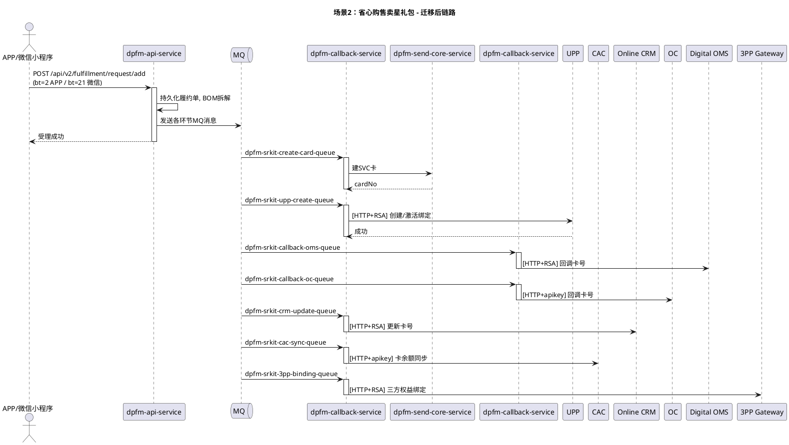

---

### 场景3：银行星礼包
#### 场景描述
银行渠道合作的星礼包售卖。**businessTypeCode = 26（B2B 银行）**，属于 FC `externalSrkitTypeCodeList = ["22","26"]` 外部生码 SRKIT 分类（不经 UPP 建卡）。业务流程与场景 1 不同，详见下方时序图。

#### 事实核对（来自 FC 代码 + 生产 ES 日志）
> **已确认事实**：
>
> + `businessTypeCode=26` 对应 B2B 银行（FC `XxlJobTimer.java:28` 注释与 `ThirdBenefitServiceImpl.B2BSubTypeCodeList=["26","20","901","40"]` 确证）
> + 归类为 `externalSrkitTypeCodeList`（FC `DigitalServiceImpl.java:146`、`ScheduleCron.java:55`、`ThirdBenefitServiceImpl.java:87`、`CrmAdapterServiceImpl.java:90`、`S4ServiceImpl.java:96`），走外部生码链路，**不经 UPP 建卡**
> + 生产流量真实：近 7 天 `gds*:p-fulfillment-center*` 命中 `businessTypeCode":"26"` 共 **104,891** 次
> + FC 日志中 `eBuy`/`ebuy` 命中 245,162 次、`ZHX`（资和信）命中 2,454 次、`createSrkitDpfm` 命中 37,190 次，证实外部生码由码商（eBuy/ZHX）完成，卡号由 DPFM（`createSrkitDpfm`）生成
> + 批量接口 `posBatchSrkitActivate`/`batchBind` 近 7 天 **0 流量**，本场景**不是批量发券模式**，为**逐单建卡+绑定**
>
> **已确认（2026-04-16）**：
>
> + ✅ 上游系统为 **DPOMS**（产品方确认）
> + ✅ **不存在** OSS/SFTP 结果文件回推银行渠道的场景（产品方确认，从方案中删除）
>
> **已确认（2026-04-17）**：
>
> + ✅ **本期星礼包场景不涉及 hold 单绑定** — hold 单场景仅在券场景出现（4.1 非预付费券），本期 SRKIT/SVC 迁移全部不涉及。CLAUDE.md 中提到的 DPFM "未注册用户 hold 单绑定"能力属于券链路范畴，不在本方案范围内
>

#### 旧链路分析（现状）
```plain
DPOMS
  -> [HTTP POST] FC fulfillment-controller (/api/v2/fulfillment/request/add)  [businessTypeCode=26]
  -> FC fulfillment-digital 按 externalSrkitTypeCodeList 分支
  -> DPFM createSrkitDpfm 建 SVC 卡号
  -> 外部码商（eBuy / ZHX 资和信）生券码
  -> CAC 绑定、CRM 同步、NC 通知、回调上游
```

#### 新链路设计（迁移后）
```plain
DPOMS
  -> [HTTP POST] dpfm-api-service (/api/v2/fulfillment/request/add)  [businessTypeCode=26]
  -> dpfm-callback-service 按 external 分支路由
  -> dpfm-send-core-service（策略模式：ZHX / eBuy，按 platformItemId 路由）
  -> CAC 绑定、CRM 同步、NC 通知、dpfm-callback-service 异步回调上游
```

#### 涉及服务
|  | 旧链路 | 新链路 |
| --- | --- | --- |
| 核心服务 | fc-fulfillment-controller, fc-fulfillment-digital | dpfm-api-service, dpfm-send-core-service, dpfm-callback-service, dpfm-retry-service |


#### 上下游系统
|  | 系统 |
| --- | --- |
| 上游 | DPOMS（✅ 2026-04-16 已确认） |
| 下游 | 码商（eBuy / ZHX 资和信）、S4、CAC、Online CRM、Digital OMS、3PP Gateway/TPES、NC |


#### 新链路 PlantUML 时序图
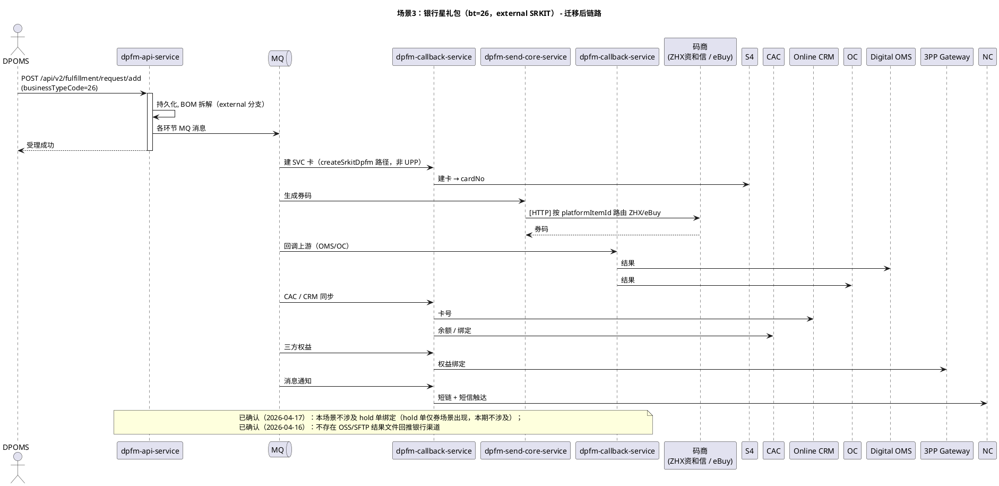

---

### 场景4：三方渠道售卖星礼包
#### 场景描述
第三方渠道（天猫、3PP 三方等）售卖星礼包。原方案将本场景按"DP OMS 转发+UPP 激活"统一描述，但实际应按 `businessTypeCode` 细分为三条子链路。

#### 事实核对（来自 FC 代码 + 生产 ES 日志）
> **已确认事实**：
>
> + FC 代码按 `selfSrkitTypeCodeList=["2","21","23","12"]` 与 `externalSrkitTypeCodeList=["22","26"]` 区分链路类型
> + **bt=12（天猫）** → 属于 `selfSrkitTypeCodeList`，走 **UPP 建卡**链路（`uppCreateCard`），不经码商
> + **bt=22（3PP 三方）** → 属于 `externalSrkitTypeCodeList`，走**外部码商**（eBuy / ZHX）+ `createSrkitDpfm`，**不经 UPP**
> + **bt=43（抖本，抖音本地生活）** → 不在两个列表中（注释中曾标注于 external，现已移除），独立链路
> + 生产流量（`gds*:p-fulfillment-center*` 近 7 天）：
>     - `"businessTypeCode":"12"`（天猫） = **0 次**
>     - `"businessTypeCode":"22"`（3PP 三方） = **0 次**
>     - `"businessTypeCode":"43"`（抖本） = **4,840 次**
> + 因此**原场景 4 所代表的"天猫 / 3PP 三方"在生产环境 7 天均零流量**，与 Lattice 知识库与 FC 设计文档"bt=22 无实际流量"一致
>
> **已确认（2026-04-16）**：
>
> + ✅ 天猫（bt=12）：**周期性业务场景，功能需保留**，不可从迁移范围剔除（虽 30 天流量为 0 但属周期性活动）
> + ✅ 3PP 三方（bt=22）：**周期性业务场景，功能需保留**，不可剔除（同上）
> + ✅ 抖本（bt=43）：保留在场景 4，**不独立成章**
> + ✅ 抖音 Token 刷新定时任务**需要迁移**（本方案涉及的定时任务全部需要迁移，包括权益相关的）
>
> **已确认（2026-04-17）**：
>
> + ✅ 抖本（bt=43）上游**是 DPOMS**（非直连抖音渠道）
>
> **待确认**：
>
> + ⚠️ 抖本（bt=43）的生码路径是 UPP 还是码商？代码列表归属不明确，需代码 owner 确认
>

#### 旧链路分析（现状）
**原描述为单一链路，实际应分拆：**

```plain
# 子链路 4A：天猫（bt=12，self SRKIT，零生产流量）
DP OMS -> FC fulfillment-controller (/api/v2/fulfillment/request/add)
       -> fulfillment-digital selfSrkit 分支
       -> UPP 建卡（uppCreateCard）+ 激活绑定
       -> 天猫中间件回调（FULFILLMENT#ENTITY#SRKIT#ACTIVATE#CALLBACK#TMALL）

# 子链路 4B：3PP 三方（bt=22，external SRKIT，零生产流量）
DP OMS -> FC fulfillment-controller (/api/v2/fulfillment/request/add)
       -> fulfillment-digital externalSrkit 分支
       -> DPFM 建 SVC 卡（createSrkitDpfm）+ 码商生码（eBuy/ZHX）
       -> 上游回调

# 子链路 4C：抖本（bt=43，4840 次/7d，上游=DPOMS，生码路径待确认）
DP OMS -> FC fulfillment-controller
       -> ⚠️ 生码路径（UPP 或码商）待代码 owner 确认
```

#### 新链路设计（迁移后）
```plain
# 4A 天猫: 若业务确需保留，迁入 dpfm-api-service 的 self 分支（保留 UPP 建卡）
# 4B 3PP 三方: 与场景3（bt=26）合并为统一 external 分支
# 4C 抖本: 独立迁移，需与抖音 Token 刷新、核销/冲正回调链路一并迁移
```

#### 涉及服务
|  | 旧链路 | 新链路 |
| --- | --- | --- |
| 核心服务（4A 天猫） | fc-fulfillment-controller, fc-fulfillment-digital, UPP | dpfm-api-service, dpfm-callback-service（self 分支） |
| 核心服务（4B 3PP） | fc-fulfillment-controller, fc-fulfillment-digital | dpfm-api-service, dpfm-send-core-service（码商策略） |
| 核心服务（4C 抖本） | fc-fulfillment-controller, fc-fulfillment-digital, fc-fulfillment-callback | dpfm-api-service, dpfm-send-core-service, dpfm-callback-service, dpfm-task-service（Token 刷新） |


#### 上下游系统
|  | 系统 |
| --- | --- |
| 上游 | DP OMS（2026-04-17 确认，抖本 bt=43 上游亦为 DPOMS，非直连抖音渠道） |
| 下游（4A 天猫） | UPP、Tmall Middleware、S4、CAC、CRM、NC |
| 下游（4B 3PP） | 码商（eBuy / ZHX）、S4、CAC、CRM、NC |
| 下游（4C 抖本） | ⚠️ 待确认（码商 or UPP）、抖音开放平台、S4、CAC、CRM、NC |


#### 新链路 PlantUML 时序图（按子链路分离）
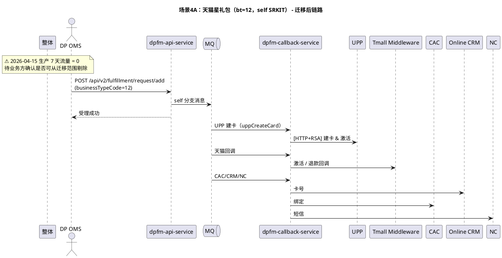

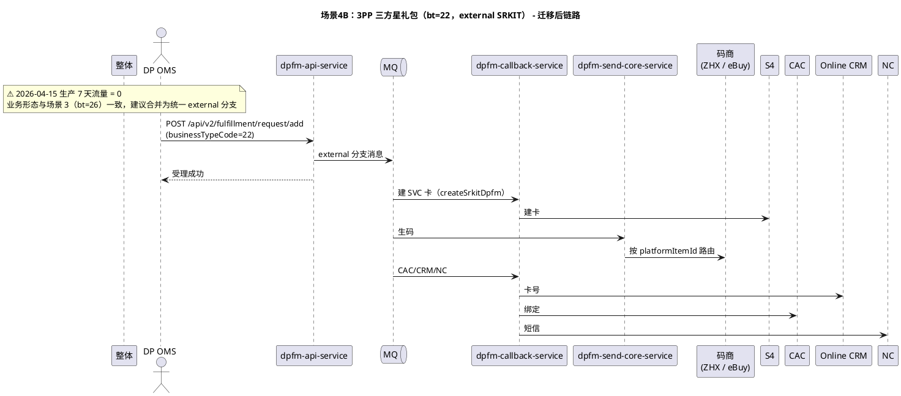

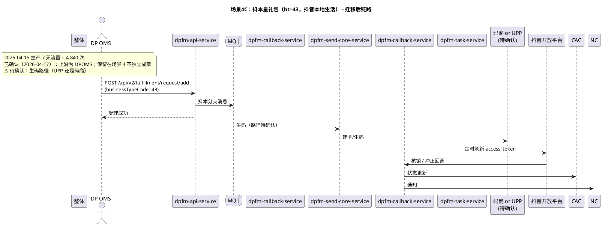

---

### 场景5：POS售卖实体/电子星礼包
> **事实核对（2026-04-15 审计）**
>
> **已确认事实：**
>
> + 5B MQ topic `FULFILLMENT#ENTITY#SRKIT#ACTIVATE` 存在（`DigitalServiceImpl.java:1354`，subTypeCode="11000"）；ES 7d=0，属低频激活
> + 5C `/add/bind` 与 5F `/add/web/bind` 独立路由（`ApiController.java:290,304`）
> + 5C/5H 卡号前缀路由：`startsWith("8")` → s4SrkitFlag；`startsWith("7")` → normal；else → encryptFlag（`DigitalServiceImpl.java:1818-1823`）
> + 5H `businessTypeCode=1000, subTypeCode=11001`（`S4ServiceImpl.java:52-54`）；ApiOperation 注解名全部匹配
> + 5I `subTypeCode=11002`（`S4ServiceImpl.java:55`）
> + POS SET 批量接口 ES 7d 全部为 0（posBatchSrkitActivate / POS混合批量绑定 / POS批量解绑）
>
> **已证伪：**
>
> + 5A 原文 `businessTypeCode=2301` → 实际 `businessTypeCode=23, businessSubTypeCode=2301`（`ApiController.java:425`）；POS 随单购激活场景为 `bt=302301/subType=302301`（`ApiServiceImpl.java:724`）
> + 5B 原文 `businessTypeCode=11000` → 实际 `businessTypeCode=1000, businessSubTypeCode=11000`（`S4ServiceImpl.java:52-53`）
> + 5E 原文 `businessTypeCode=27` → 退款检查接口本身不接受 bt=27；controller 查询 DB 时用 `bt="23"`，subType=`"2301"/"2302"` 判状态（`ApiController.java:418-436`），`bt=27` 仅属 `ApiServiceImpl` 订单状态初始化逻辑，与本接口无关
> + 5G 原文"业务逻辑与 5B 完全一致" → 实际 **5G 直接同步调 S4 **`handleS4SRKitSetActivate`（`S4ServiceImpl.java:518-529`），**不走 MQ、无 UPP 激活、无 CAC 绑定**；5B 才是完整异步多步链路
>
> **待确认：** 无（本场景全部通过代码 + ES 三方确认）
>

#### 场景描述
POS 终端售卖星礼包，包含以下子场景：

+ **5A 电子星礼包售卖**：POS 下单后系统创建电子星礼包
+ **5B 实体星礼包激活**：POS 扫码激活实体星礼包
+ **5C 实体星礼包绑定**：将实体星礼包绑定到用户账号
+ **5D 实体星礼包解绑**：解除用户与实体星礼包的绑定
+ **5E POS电子星礼包退款检查**：POS 售卖的电子星礼包退款前置检查（见下文链路分析）
+ **5F 官网实体星礼包绑定**：星巴克官网渠道实体星礼包绑定（v1.3 新增）
+ **5G POS批量激活实体星礼包**（v1.4 从原"场景8"合并）：对应 FC `posBatchSrkitActivate`，**业务逻辑与 5B 完全一致**，仅支持批量处理
+ **5H POS混合批量绑定实体星礼包**（v1.4 从原"场景8"合并）：对应 FC `batchBindSRKitMix`，**业务逻辑与 5C 完全一致**，仅支持批量处理。此处 **"Mix" 指混合卡类型**（8 开头 / 7 开头 / 加密卡格式），与 5C 的卡号前缀路由逻辑一致，**不是混合 Set**
+ **5I POS批量解绑实体星礼包**（v1.4 从原"场景8"合并）：对应 FC `batchUnbindSRKit`，**业务逻辑与 5D 完全一致**，仅支持批量处理

> **v1.4 修正说明**：原 v1.3 "场景8：SRkit Set" 的 3 个接口，经 FC 源码 `ApiController.java:476-528` 的 `@ApiOperation` 注解核对确认，全部标注为"POS批量XX**实体星礼包**"，本质是场景5（POS 实体星礼包）的批量化版本，业务逻辑与 5B/5C/5D 完全一致。因此在 v1.4 中将"场景8"合并为子场景 5G/5H/5I。
>

本场景较复杂，涉及同步调用（S4 查询）和异步处理，且包含卡号前缀路由逻辑。

#### 旧链路分析（现状）
**5A 电子星礼包**：

```plain
POS
  -> [HTTP POST] FC fulfillment-controller (/api/v2/fulfillment/request/add, businessTypeCode=23, businessSubTypeCode=2301)
     # 注：POS随单购激活场景使用 businessTypeCode=businessSubTypeCode=302301
     -> FC controller -> [HTTP+RSA] S4 同步查询SRKIT定义
     -> [MQ] -> fc-fulfillment-digital
        -> [HTTP+RSA] UPP 激活绑定
        -> [HTTP+RSA] 3PP Gateway/TPES 三方权益绑定
        -> FC fulfillment-digital 通过 MQ 调用 CAC API（星礼包及券同步）
     -> 若含 0 元 SVC 卡:
        fc-fulfillment-digital -> DPFM 建卡 -> UPP -> PNC
        SVC 卡同步: FC -> S4/CAC/OC
```

**5B 实体星礼包激活**：

```plain
POS
  -> [HTTP POST] FC fulfillment-controller (/api/v2/fulfillment/request/add/activate, businessTypeCode=1000, businessSubTypeCode=11000)
     -> [MQ] FULFILLMENT#ENTITY#SRKIT#ACTIVATE -> fc-fulfillment-digital
     -> [MQ] FULFILLMENT#ENTITY#SRKIT#BIND#S4 -> fc-fulfillment-digital -> [HTTP] S4 绑定
     -> [MQ] FULFILLMENT#ENTITY#SRKIT#BIND#CAC -> fc-fulfillment-digital -> [HTTP] CAC 绑定
     -> [MQ] FULFILLMENT#UPP#CREATE#CARD -> fc-fulfillment-digital -> [HTTP+RSA] UPP 激活
     -> 并行回调:
        [MQ] FULFILLMENT#ENTITY#SRKIT#ACTIVATE#CALLBACK#TMALL -> 天猫中间件
        [MQ] FULFILLMENT#CARD#CALLBACK#OC -> OC
```

**5C 实体星礼包绑定**：

```plain
POS
  -> [HTTP POST] FC fulfillment-controller (/api/v2/fulfillment/request/add/bind)
     -> [HTTP+RSA] S4 查询卡状态（同步）
     -> [HTTP+RSA] S4 绑定（同步）
     -> [MQ] 异步: CAC 绑定 + CRM 同步
     -> 卡号前缀路由:
        8 开头 -> S4 解密/校验 -> CAC 详情
        非 8 开头 -> S4 解密 -> UPP 校验 -> CAC 详情
```

**5D 实体星礼包解绑**：

```plain
POS
  -> FC fulfillment-controller
     -> [MQ] FULFILLMENT#ENTITY#SRKIT#UNBIND#S4 -> fc-fulfillment-digital -> [HTTP] S4 解绑
     -> [MQ] FULFILLMENT#ENTITY#SRKIT#UNBIND#CAC -> fc-fulfillment-digital -> [HTTP] CAC 解绑
```

**5E POS电子星礼包退款检查**：

```plain
POS
  -> [HTTP POST] FC fulfillment-controller (POST /api/v2/fulfillment/request/card/refund/check)
     # 注：内部查询 fulfillment_request 时用 businessTypeCode="23"，按 businessSubTypeCode 判状态：
     #       "2301"（退款待处理）与 "2302"（已退款解绑）
     #     bt=27 属 /request/add 接口的订单状态初始化逻辑，与本接口无关
     -> 获取 fulfillment_request 数据，判断 status
     -> [HTTP] 调用 S4 退款检查
     -> 返回退款检查结果（同步接口，全部在 controller 完成）
```

**5F 官网实体星礼包绑定**（v1.3 新增，已于 2026-04-09 生产验证）：

```plain
星巴克官网（Web）
  -> [HTTP POST] FC fulfillment-controller (POST /api/v2/fulfillment/request/add/web/bind)
     -> 与 5C 实体星礼包绑定逻辑基本一致，但入口独立：
        -> [HTTP+RSA] S4 查询卡状态（同步）
        -> [HTTP+RSA] S4 绑定（同步）
        -> [MQ] 异步: CAC 绑定 + CRM 同步
     -> 渠道区分：sourceCode 可能为 WEB
     -> 走与 5C 相同的卡号前缀路由（8 开头 vs 非 8 开头）
```

> **与 **`/add/bind`** 的区别**：`/add/web/bind` 是官网渠道（Web）独立入口，不与 POS 共用 `/add/bind` 接口。业务流程基本一致，但 sourceCode 不同（POS 为 CCO/SPCC 等，Web 为 WEB）。
>

**5G POS批量激活实体星礼包**（v1.4 从原场景8合并）：

```plain
POS
  -> [HTTP POST] FC fulfillment-controller (POST /api/v2/fulfillment/request/posBatchSrkitActivate)
     -> @ApiOperation("POS批量激活实体星礼包") [ApiController.java:477]
     -> [HTTP+RSA] 同步直接调 S4 SET批量激活（handleS4SRKitSetActivate，S4ServiceImpl.java:518-529）
     # 重要修正：5G 与 5B 业务逻辑【不同】——
     #   5B: MQ → fc-fulfillment-digital → S4 绑定 + CAC 绑定 + UPP 激活 + 并行回调（完整异步多步链路）
     #   5G: 直接同步调 S4 SET 激活接口一步完成，无 MQ、无 UPP、无 CAC、无回调
```

**5H POS混合批量绑定实体星礼包**（v1.4 从原场景8合并）：

```plain
POS
  -> [HTTP POST] FC fulfillment-controller (POST /api/v2/fulfillment/request/batchBindSRKitMix)
     -> @ApiOperation("POS混合批量绑定实体星礼包") [ApiController.java:506]
     -> businessTypeCode=1000, SubTypeCode=11001
     -> [HTTP+RSA] S4 查询卡状态（同步） + 批量绑定
     -> [MQ] 异步: CAC 绑定 + CRM 同步
     -> 业务逻辑与 5C（单个实体星礼包绑定）完全一致
     -> "Mix" 指混合卡类型（8 开头 / 7 开头 / 加密卡格式），走 5C 相同的卡号前缀路由
```

> **关于 "Mix" 的澄清**：`batchBindSRKitMix` 中的 "Mix" **不是**混合 Set，而是指入参列表中**混合了不同格式的卡号**（8 开头的实体卡号、7 开头、加密卡号格式），由同一批量接口统一处理，内部走与 5C 相同的卡号前缀路由逻辑。
>

**5I POS批量解绑实体星礼包**（v1.4 从原场景8合并）：

```plain
POS
  -> [HTTP POST] FC fulfillment-controller (POST /api/v2/fulfillment/request/batchUnbindSRKit)
     -> @ApiOperation("POS批量解绑实体星礼包") [ApiController.java:522]
     -> [MQ] -> fc-fulfillment-digital -> [HTTP+RSA] S4 批量解绑
     -> 业务逻辑与 5D（单个实体星礼包解绑）完全一致
```

#### 新链路设计（迁移后）
POS 直接调用 DPFM API Service，由 DPFM 统一处理电子/实体星礼包的售卖、激活、绑定、解绑。

**5A 电子星礼包**：

```plain
POS
  -> [HTTP POST] dpfm-api-service (/api/v2/fulfillment/request/add, businessTypeCode=2301)
     -> dpfm-api-service -> [HTTP+RSA] S4 同步查询SRKIT定义
     -> [MQ] dpfm-srkit-upp-create-queue -> dpfm-callback-service -> [HTTP+RSA] UPP 激活绑定
     -> [MQ] dpfm-srkit-3pp-binding-queue -> dpfm-callback-service -> [HTTP+RSA] 3PP 权益绑定
     -> 若含 0 元 SVC 卡:
        dpfm-send-core-service 建卡 -> UPP -> PNC
     -> SVC 卡同步: dpfm-callback-service -> S4/CAC/OC
```

**5B 实体星礼包激活**：

```plain
POS
  -> [HTTP POST] dpfm-api-service (/api/v2/fulfillment/request/add/activate, businessTypeCode=11000)
     -> [MQ] dpfm-entity-srkit-activate-queue -> dpfm-callback-service
     -> [MQ] dpfm-entity-srkit-bind-s4-queue -> dpfm-callback-service -> [HTTP] S4 绑定
     -> [MQ] dpfm-entity-srkit-bind-cac-queue -> dpfm-callback-service -> [HTTP] CAC 绑定
     -> [MQ] dpfm-srkit-upp-create-queue -> dpfm-callback-service -> [HTTP+RSA] UPP 激活
     -> 并行回调:
        [MQ] dpfm-entity-srkit-callback-tmall-queue -> dpfm-callback-service -> 天猫中间件
        [MQ] dpfm-srkit-callback-oc-queue -> dpfm-callback-service -> OC
```

**5C 实体星礼包绑定**：

```plain
POS
  -> [HTTP POST] dpfm-api-service (/api/v2/fulfillment/request/add/bind)
     -> [HTTP+RSA] S4 查询卡状态（同步）
     -> [HTTP+RSA] S4 绑定（同步）
     -> [MQ] 异步: dpfm-entity-srkit-bind-cac-queue + dpfm-srkit-crm-update-queue
     -> 卡号前缀路由逻辑迁移到 dpfm-api-service:
        8 开头 -> S4 解密/校验 -> CAC 详情
        非 8 开头 -> S4 解密 -> UPP 校验 -> CAC 详情
```

**5D 实体星礼包解绑**：

```plain
POS
  -> [HTTP POST] dpfm-api-service (/api/v2/fulfillment/request/add/unbind)
     -> [MQ] dpfm-entity-srkit-unbind-s4-queue -> dpfm-callback-service -> [HTTP] S4 解绑
     -> [MQ] dpfm-entity-srkit-unbind-cac-queue -> dpfm-callback-service -> [HTTP] CAC 解绑
```

**5E POS电子星礼包退款检查**：

```plain
POS
  -> [HTTP POST] dpfm-api-service (/api/v2/fulfillment/request/card/refund/check)
     -> 获取 fulfillment_request 数据，判断 status
     -> [HTTP] 调用 S4 退款检查
     -> 返回退款检查结果（同步接口）
```

**5F 官网实体星礼包绑定**（v1.3 新增）：

```plain
星巴克官网（Web）
  -> [HTTP POST] dpfm-api-service (/api/v2/fulfillment/request/add/web/bind)
     -> 与 5C 实体星礼包绑定新链路逻辑一致（dpfm-api-service 同一套处理逻辑）
     -> [HTTP+RSA] S4 查询卡状态 + 同步绑定
     -> [MQ] dpfm-entity-srkit-bind-cac-queue + dpfm-srkit-crm-update-queue
     -> DPFM 在同一服务中承接 /add/bind 与 /add/web/bind 两个入口
     -> 卡号前缀路由逻辑复用 5C
```

**5G POS批量激活实体星礼包**（v1.4 从原场景8合并）：

```plain
POS
  -> [HTTP POST] dpfm-api-service (/api/v2/fulfillment/request/posBatchSrkitActivate)
     -> 复用 5B 单个激活的业务逻辑，仅入参为批量 list
     -> [MQ] dpfm-entity-srkit-activate-queue（批量消息 or 拆单）-> dpfm-callback-service
        -> [HTTP+RSA] S4 批量激活
     -> [MQ] 后续 BIND#S4 / BIND#CAC / UPP#CREATE / CALLBACK 流程与 5B 一致
```

**5H POS混合批量绑定实体星礼包**（v1.4 从原场景8合并）：

```plain
POS
  -> [HTTP POST] dpfm-api-service (/api/v2/fulfillment/request/batchBindSRKitMix)
     -> 复用 5C 单个绑定的业务逻辑，支持混合卡类型（8开头/7开头/加密卡格式）
     -> 卡号前缀路由逻辑复用 5C（按单条卡号判断走 S4 校验或 UPP 校验）
     -> [HTTP+RSA] S4 查询卡状态 + 同步批量绑定
     -> [MQ] dpfm-entity-srkit-bind-cac-queue + dpfm-srkit-crm-update-queue
```

**5I POS批量解绑实体星礼包**（v1.4 从原场景8合并）：

```plain
POS
  -> [HTTP POST] dpfm-api-service (/api/v2/fulfillment/request/batchUnbindSRKit)
     -> 复用 5D 单个解绑的业务逻辑，仅入参为批量 list
     -> [MQ] dpfm-entity-srkit-unbind-s4-queue -> dpfm-callback-service -> [HTTP+RSA] S4 批量解绑
     -> [MQ] dpfm-entity-srkit-unbind-cac-queue -> dpfm-callback-service -> [HTTP+apikey] CAC 批量解绑
```

> **5G/5H/5I 设计原则**：3 个批量接口与 5B/5C/5D 共享底层的激活/绑定/解绑业务实现，dpfm-api-service 层仅增加"批量入口适配 + 拆分/聚合"逻辑。**不需要**单独的 SRKIT Set 队列，复用已有的 `dpfm-entity-srkit-*-queue` 队列即可。
>

#### 涉及服务
|  | 旧链路 | 新链路 |
| --- | --- | --- |
| 核心服务 | fc-fulfillment-controller, fc-fulfillment-digital | dpfm-api-service, dpfm-send-core-service, dpfm-callback-service, dpfm-retry-service |


#### 上下游系统
|  | 系统 |
| --- | --- |
| 上游 | POS、星巴克官网（Web，5F） |
| 下游 | S4、UPP、CAC、Online CRM、OC、3PP Gateway/TPES、天猫中间件、NC |


#### 新链路 PlantUML 时序图
**5A 电子星礼包售卖**：

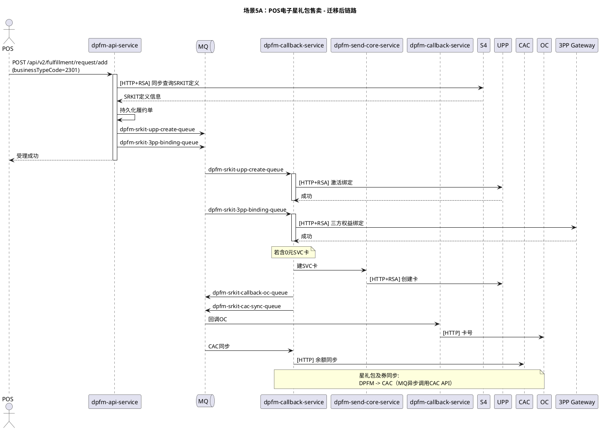

**5B 实体星礼包激活**：

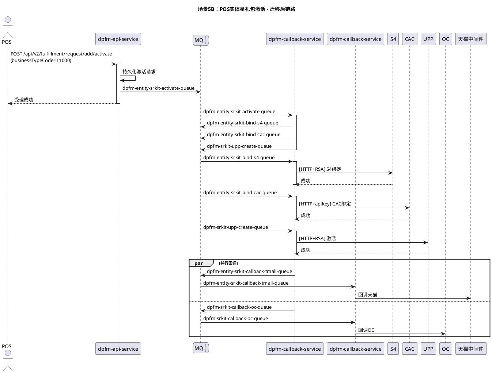

**5C 实体星礼包绑定**：

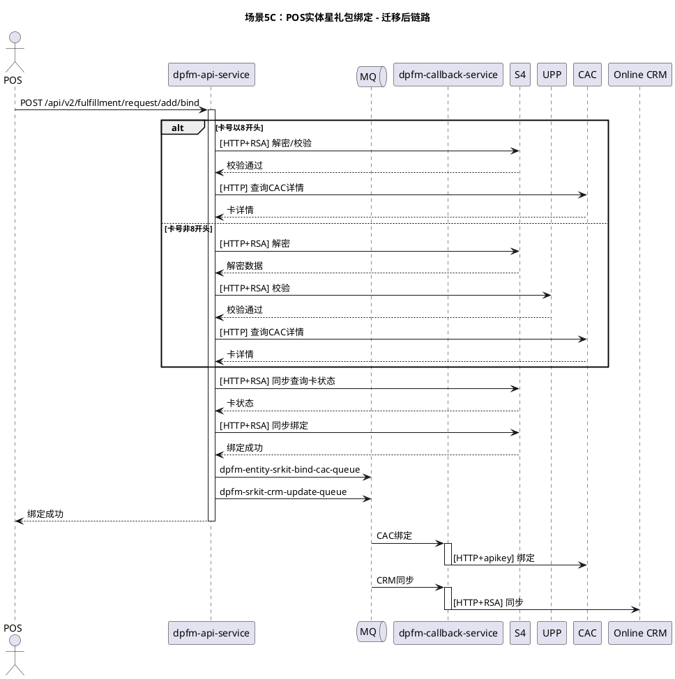

**5D 实体星礼包解绑**：

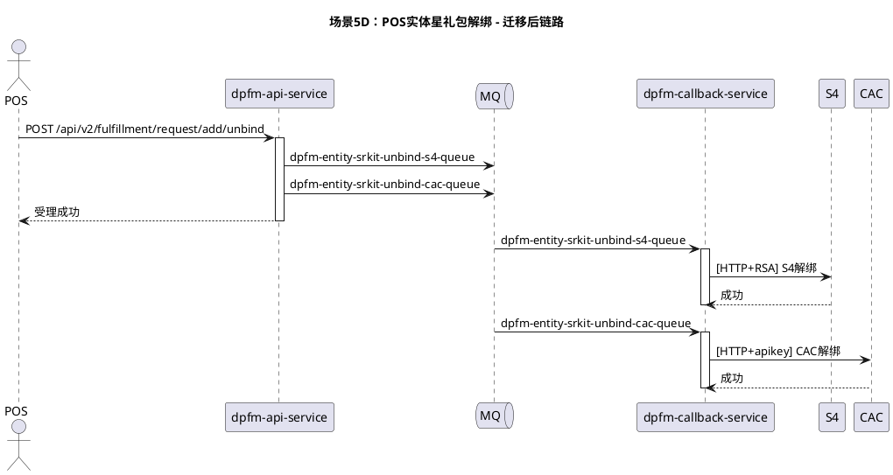

---

### 场景6：POS随单购星礼包
> **事实核对（2026-04-15 审计）**
>
> **已确认事实：**
>
> + 三阶段流程（预生成/作废/正式履约）均已代码核实：`ApiController.java:444-466` + POS随单购-定稿.puml
> + `preGenerateSrkit` 同步调 S4（`S4ServiceImpl.preGenerateSRKit`）；ES 7 天 **96,730 次**，与已知数据吻合
> + `invalidPreGenerateSrkit` 同步调 S4（`ApiController.java:460-466`）；ES 7 天 **17,965 次**
> + 阶段二链路：POS → UPP（支付完成通知）→ FC `/add`（`ApiServiceImpl.java:724-733` `activateAndBoundPreGenerateSRKit`）→ S4 正式绑定
> + `businessTypeCode=302301` 对应 POS 随单购（`BusinessTypeConstants.POS_SUIDANGOU_BUSINESS_TYPE_CODE`）；ES 7 天 **629,498 次** 命中
> + 旧链路阶段二含 MQ 三方权益分发 + FC→CAC 券同步（与 `ApiServiceImpl` 逻辑吻合）
>
> **已证伪：**
>
> + 原关联声明"`posBatchSrkitActivate` 属于本场景"不成立：`posBatchSrkitActivate` 为 **SRKit SET 批量激活**独立接口（`ApiController.java:470` 注释"仅支持SET星礼包的批量激活"），与 POS 随单购三阶段流程无关；ES 7 天 0 命中属正常
>
> **已确认（2026-04-16）：**
>
> + ✅ UPP 在阶段二的角色是"中间路由层"（POS 支付完成后 UPP 转发 `/add` 至 FC）；UPP 建卡路径 `businessSubTypeCode=1301` **不适用于**随单购
> + ✅ 路由判断**不依赖 sourceCode**（FC 的 sourceCode 不准确，如银行星礼包 sourceCode=APP），必须使用 `businessTypeCode` / `businessSubTypeCode`
>

#### 场景描述
POS 门店随单购星礼包场景，分为三个阶段：预生成 srkitNo、作废预生成、正式履约。该场景涉及 POS 和 UPP 双入口调用。

**v1.3 补充（2026-04-09 生产日志验证）**：两个独立的预生成接口已全部在生产环境验证存在流量：

| 接口路径 | 方法 | 功能 | 生产验证 | 耗时 |
| --- | --- | --- | --- | --- |
| `POST /api/v2/fulfillment/request/preGenerateSrkit` | POST | POS 预生成 srkitNo | 2026-04-09 17:00 | 56ms |
| `POST /api/v2/fulfillment/request/invalidPreGenerateSrkit` | POST | POS 作废预生成 | 2026-04-09 17:00 | 26ms |


> 注：这两个接口均为同步调用 S4，不走 MQ。
>

#### 旧链路分析（现状）
```plain
阶段一（预生成）：
POS -> [HTTP POST] FC fulfillment-controller (/api/v2/fulfillment/request/preGenerateSrkit) -> [HTTP+RSA] S4 (同步，返回预生成 srkitNo)

阶段一A（作废预生成）：
POS -> [HTTP POST] FC fulfillment-controller (/api/v2/fulfillment/request/invalidPreGenerateSrkit) -> [HTTP+RSA] S4

阶段二（正式履约）：
POS -> UPP（支付完成通知）-> [HTTP] FC fulfillment-controller (fulfillRequestAdd) -> [HTTP+RSA] S4 正式绑定
  -> [MQ] 三方权益: FC -> 3PP Gateway/TPES
  -> 星礼包及券同步: FC fulfillment-digital 通过 MQ 调用 CAC API
```

#### 新链路设计（迁移后）
```plain
阶段一（预生成）：
POS -> [HTTP] dpfm-api-service (/api/v2/fulfillment/request/preGenerateSrkit) -> [HTTP+RSA] S4 -> 返回 srkitNo

阶段一A（作废预生成）：
POS -> [HTTP] dpfm-api-service (/api/v2/fulfillment/request/invalidPreGenerateSrkit) -> [HTTP+RSA] S4

阶段二（正式履约）：
POS -> UPP（支付完成通知）-> [HTTP] dpfm-api-service (/api/v2/fulfillment/request/add) -> [HTTP+RSA] S4
  -> [MQ] dpfm-srkit-3pp-binding-queue -> dpfm-callback-service -> [HTTP+RSA] 3PP Gateway/TPES
  -> 星礼包及券同步: dpfm-callback-service 通过 MQ 调用 CAC API（DPFM -> CAC）
```

#### 涉及服务
|  | 旧链路 | 新链路 |
| --- | --- | --- |
| 核心服务 | fc-fulfillment-controller, fc-fulfillment-digital | dpfm-api-service, dpfm-callback-service, dpfm-retry-service |


#### 上下游系统
|  | 系统 |
| --- | --- |
| 上游 | POS（直接调用）、UPP（阶段二中间路由层，转发 POS 支付完成后的 `/add` 请求；UPP 建卡路径 `subType=1301` 不适用于本场景） |
| 下游 | S4、CAC、3PP Gateway/TPES |


#### 新链路 PlantUML 时序图
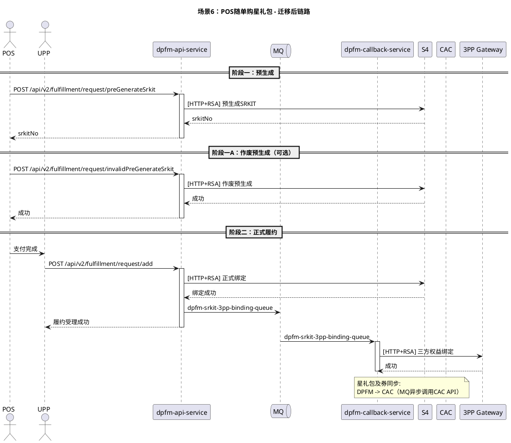

---

### 场景7：SVC卡建卡并充值/充值
> **v1.4 重大修正**：原 v1.3 描述 SVC 卡有"购买/充值/取消/手动绑定"等场景是**错误**的。经 FC 源码复核，SVC 卡实际**只有 2 种业务场景**：**建卡并充值**（1301）和 **充值**（1302/3401）。"手动绑定"概念属于实体星礼包（SRKIT），不属于 SVC。取消流程是建卡/充值失败后的补偿，不属于独立业务场景。
>

> **事实核对（2026-04-15 审计）**
>
> **已确认事实：**
>
> + 1301 → `UPP_CREATE_CARD_ROUTINGKEY`；[1302,3401] → `UPP_RELOAD_CARD_ROUTINGKEY`；无第三分支（`ApiServiceImpl.java:586-591`）
> + `svcTypeCodeList=["13","34"]`、`svcReloadSubTypeCodeList=["1302","3401"]`（`ApiServiceImpl.java:118-119`）
> + 1301 建卡成功后同一方法内立即级联 ReloadCard（`UppServiceImpl.java:182`）
> + 3401 使用独立 `uppWechatPartnerId`（`UppServiceImpl.java:209-212`）
> + SVC 卡**不经 S4**（S4 仅用于 SRKIT，ApiServiceImpl 576–592 SVC 代码块无任何 S4 调用）
> + `FULFILLMENT#UPP#CANCEL#CARD`/`CANCEL#RELOAD#CARD` 为异常补偿队列，非独立业务
>
> **已证伪：**
>
> + 原文"SVC 卡信息同步（两种场景共用 CRM 和 CAC）"错误 → 实际**互斥**（`UppServiceImpl.java:259-274`）：
>     - 1301 充值完成后：仅发 `ONLINE_CRM_UPDATE_SVC_CARD`（无 CAC 余额同步） + Digital OMS + OC
>     - 1302/3401 充值完成后：仅发 `CALLBACK_CAC_CARD_AMOUNT`（无 Online CRM 更新） + Digital OMS + OC
> + 原文遗漏：1301 建卡成功后还额外发送 `FULFILLMENT#GCP#TERM#SAVE`（`UppServiceImpl.java:183-184`）
>
> **已确认（2026-04-16）：**
>
> + ✅ DPFM 侧尚无 SVC 逻辑是正常的 — 本方案需包含 DPFM 侧承载 SVC 建卡/充值逻辑的架构设计
>

#### 场景描述
SVC 卡（星礼卡）的履约场景，**实际只有 2 种业务场景**：

| 业务场景 | SubTypeCode | businessTypeCode | 入参关键字段 | 流程特征 |
| --- | --- | --- | --- | --- |
| **建卡并充值** | `1301` | `13`（APP） | 无 cardNo | UPP CreateCard 成功后，**同一流程内立即自动**级联 UPP ReloadCard，实现建卡+充值 |
| **充值** | `1302`（APP） / `3401`（微信） | `13` / `34` | 必须带 `cardNo` | 仅调用 UPP ReloadCard |


#### 代码证据（FC 源码）
**证据1：ApiServiceImpl.java:586-590 — 请求分发只有两个分支**

```java
if("1301".equals(fulfillmentRequestParam.getBusinessSubTypeCode())) {
    sendMessage(messageJson, MQConstant.UPP_CREATE_CARD_ROUTINGKEY, traceId);
} else if(svcReloadSubTypeCodeList.contains(fulfillmentRequestParam.getBusinessSubTypeCode())) {
    messageJson.put("cardNumber", fulfillmentRequestParam.getCardNo());
    sendMessage(messageJson, MQConstant.UPP_RELOAD_CARD_ROUTINGKEY, traceId);
}
```

+ `1301`  走 `UPP_CREATE_CARD_ROUTINGKEY`（建卡队列）
+ `svcReloadSubTypeCodeList = [1302, 3401]` 走 `UPP_RELOAD_CARD_ROUTINGKEY`（充值队列），且**必须带 cardNo**
+ **没有第三个分支**，不存在 SVC 手动绑定的代码路径

**证据2：UppServiceImpl.java:182 — 1301 建卡成功后自动级联充值**

```java
// 1301 在 UPP CreateCard 成功后，立即在同一流程中自动发送 ReloadCard 消息
commonService.sendMessage(messageJson, MQConstant.UPP_RELOAD_CARD_ROUTINGKEY, traceId);
```

**结论**：1301 = "建卡 + 自动级联充值" 是**一个完整业务流程**，而不是独立的"建卡"和"充值"两个动作。因此 1301 对外表现为"购卡（含金额）"，与 1302/3401 的"纯充值"共同构成 SVC 卡的 **2 种业务场景**。

> 注：SVC 卡在 ApiServiceImpl.java 中独立处理，不走 srkitTypeCodeList 分支。FC controller 通过 `svcTypeCodeList = [13, 34]` 配置判断是否为 SVC 卡类型。
>

#### 旧链路分析（现状）
**场景 A：建卡并充值（SubTypeCode=1301）**：

```plain
D OMS -> [HTTP] FC fulfillment-controller (fulfillDeal, SubTypeCode=1301)
  -> [MQ] FULFILLMENT#UPP#CREATE#CARD -> fc-fulfillment-digital (UppServiceImpl)
     -> [HTTP+RSA] UPP CreateCard -> 返回 cardNo
     -> 同一流程内立即：
        [MQ] FULFILLMENT#UPP#RELOAD#CARD（自动级联）
        [MQ] FULFILLMENT#GCP#TERM#SAVE（GCP 终端存储，UppServiceImpl.java:183-184）
        -> fc-fulfillment-digital -> [HTTP+RSA] UPP ReloadCard
  -> 充值完成后仅发：ONLINE_CRM_UPDATE_SVC_CARD + Digital OMS 回调 + OC 回调（不发 CAC）
```

**场景 B：充值（SubTypeCode=1302 / 3401，入参带 cardNo）**：

```plain
D OMS / 微信 -> [HTTP] FC fulfillment-controller (fulfillDeal, SubTypeCode in [1302, 3401])
  -> 携带 cardNumber
  -> [MQ] FULFILLMENT#UPP#RELOAD#CARD -> fc-fulfillment-digital
     -> [HTTP+RSA] UPP ReloadCard
  -> 充值完成后仅发：CALLBACK_CAC_CARD_AMOUNT + Digital OMS 回调 + OC 回调（不发 Online CRM）
```

**SVC 卡信息同步**（按 subTypeCode 分支，**非共用**）：

+ `1301`（建卡并充值）：Online CRM 更新卡号（`ONLINE_CRM_UPDATE_SVC_CARD`） + Digital OMS 回调 + OC 回调
+ `1302/3401`（充值）：CAC 余额同步（`CALLBACK_CAC_CARD_AMOUNT`） + Digital OMS 回调 + OC 回调
+ ⚠️ 关键：CRM 更新与 CAC 同步**互斥**，不是两种场景共用（`UppServiceImpl.java:259-274`）

> **取消流程说明**：FC 中 `FULFILLMENT#UPP#CANCEL#CARD` / `FULFILLMENT#UPP#CANCEL#RELOAD#CARD` 队列是 UPP 建卡/充值**失败后的补偿取消流程**，属于**异常分支**而非独立业务场景，迁移时需承接但不列为独立业务。
>

#### 新链路设计（迁移后）
**场景 A：建卡并充值（1301）**：

```plain
D OMS -> [HTTP] dpfm-api-service (/api/v2/fulfillment/request/add, SubTypeCode=1301)
  -> dpfm-api-service 持久化订单
  -> [MQ] dpfm-svc-create-card-queue -> dpfm-callback-service
     -> [HTTP+RSA] UPP CreateCard -> 返回 cardNo
     -> 同一流程内立即：[MQ] dpfm-svc-reload-queue（自动级联，复用证据2的代码路径）
        -> dpfm-callback-service -> [HTTP+RSA] UPP ReloadCard
  -> [MQ] dpfm-svc-callback-oms-queue/OC/CRM/CAC -> dpfm-callback-service 多系统回调
```

**场景 B：充值（1302 / 3401）**：

```plain
D OMS / 微信 -> [HTTP] dpfm-api-service (/api/v2/fulfillment/request/add, SubTypeCode in [1302, 3401])
  -> 请求必须带 cardNo
  -> [MQ] dpfm-svc-reload-queue -> dpfm-callback-service -> [HTTP+RSA] UPP ReloadCard
  -> [MQ] dpfm-svc-callback-oms-queue/OC/CRM/CAC -> dpfm-callback-service 回调
```

**SVC 卡信息同步**（两种场景共用）：

```plain
dpfm-callback-service -> [HTTP] CRMA/CAC/OC
```

**异常补偿 — UPP 取消（非独立业务）**：

```plain
内部补偿触发 -> [MQ] dpfm-svc-cancel-queue / dpfm-svc-cancel-reload-queue
  -> dpfm-callback-service -> [HTTP+RSA] UPP 取消卡/取消充值
```

#### 涉及服务
|  | 旧链路 | 新链路 |
| --- | --- | --- |
| 核心服务 | fc-fulfillment-controller, fc-fulfillment-digital | dpfm-api-service, dpfm-callback-service, dpfm-retry-service |


#### 上下游系统
|  | 系统 |
| --- | --- |
| 上游 | D OMS（APP/微信渠道） |
| 下游 | UPP、CAC、CRM Adapter、OC、Digital OMS、Online CRM |


#### 新链路 PlantUML 时序图
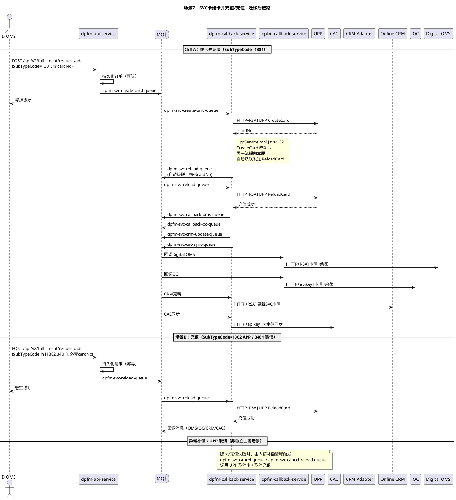

---

> **v1.4 说明**：原 v1.3 的"场景8：SRkit Set"已在 v1.4 中合并到场景5（作为子场景 5G/5H/5I），后续场景重新编号：原场景9（退款）→ 场景8，原场景10（后台）→ 场景9。详见场景5 及第 4.1 章节 dpfm-api-service 的批量接口说明。
>

---

### 场景8：星礼包退款链路
> **v1.3 新增场景**（高优先级）：基于 2026-04-09 代码扫描与生产日志验证补充。
>

> **事实核对（2026-04-15 审计）**
>
> **已确认事实（8A）：** `POST /api/v2/fulfillment/request/return` 存在（`ApiController.java:362` `returnSrkit`）；MQ `FULFILLMENT#DIGITAL#SRKIT#REFUND#S4` 存在（`DigitalFulfillmentListener.java:993`、`DigitalServiceImpl.java:2283`）；后续 MQ `FULFILLMENT#DATA#CALLBACK#DIGITAL#OMS` 在 `CallbackServiceImpl.java:83` 确认
>
> **已确认事实（8B）：** `POST /api/v2/fulfillment/request/card/refund/check` 存在（`ApiController.java:418`）；全同步链路无 MQ（`ApiController.java:420-435`）；ES 7 天 "星礼包退货检查" 命中 **173 次** — 与 `refund/check` 路径完全对应
>
> **已确认事实（8C）：** `POST /api/v2/fulfillment/callback/refund/info` 存在（`CallbackController.java:53` → `ocCallbackRefundDeal`）；查询 `fulfillment_request` 表后发送 `FULFILLMENT_DATA_CALLBACK_DIGITAL_OMS_ROUTINGKEY`（`CallbackServiceImpl.java:70-83`）；ES 7 天 `callback/refund/info` 命中 **12 次**，该接口活跃
>
> **已证伪：**
>
> + 8B 原文 "与场景 5E 重叠... **9B** 是从退款链路视角组织" — "9B" 是笔误，应为 **"8B"**
> + 8A 使用的 `oneTimeSubTypeCodeList`：`fulfillment-controller/DigitalServiceImpl.java:110` 为 8 项（**缺 **`11001`），`fulfillment-digital/ThirdBenefitServiceImpl.java:90` 为 9 项（含 `11001`），两服务列表不一致 — 与场景 1 同源问题
>
> **已确认（2026-04-16）：**
>
> + ✅ 8B 本地前置校验（2301/PENDING + 2302/SUCCESS）迁移时 DPFM **必须有相同校验**（产品方确认）
> + ✅ 8C 对下游系统回调字段（omsOrderNo/businessTypeCode/businessSubTypeCode/mlOrderNo）在新链路中**必须保持不变**，与防腐层原则一致。如需切新接口会特别注明
> + ✅ 8A/8C 新链路共用 `dpfm-srkit-callback-oms-queue`，dpfm-callback-service 需通过消息体字段区分处理路径
> + ✅ DPFM 侧新链路属前瞻设计（B1-B4），本方案需包含 DPFM 侧承载这些逻辑的架构设计（这正是迁移方案的核心产出）
>

#### 场景描述
星礼包退款链路是 v1.2 版本的高优先级遗漏项，涵盖**一次性支付星礼包退款**、**POS 电子星礼包退货检查**、**OC 回调 SRKIT 退款单号**三个子场景。这些接口全部在 FC 代码中存在并承担核心退款业务，必须纳入本次迁移范围。

#### 子场景8A：一次性支付星礼包退款
+ **入口接口**：`POST /api/v2/fulfillment/request/return`
+ **触发方**：上游 OMS 发起退款请求（对应一次性支付场景，见场景1）
+ **业务含义**：对一次性支付星礼包进行退款，触发 S4 退款接口并回调上游 OMS

**旧链路分析（现状）**：

```plain
上游 OMS（O2O OMS / D OMS / DP OMS）
  -> [HTTP POST] FC fulfillment-controller (/api/v2/fulfillment/request/return)
     -> [MQ] FULFILLMENT#DIGITAL#SRKIT#REFUND#S4 -> fc-fulfillment-digital
        -> [HTTP+RSA] S4 退款接口（退券 + 退星礼包）
     -> [MQ] FULFILLMENT#DATA#CALLBACK#DIGITAL#OMS -> fc-fulfillment-digital
        -> [HTTP+RSA] 回调 OMS 退款结果
```

**新链路设计（迁移后）**：

```plain
上游 OMS
  -> [HTTP POST] dpfm-api-service (/api/v2/fulfillment/request/return)
     -> dpfm-api-service 持久化退款请求
     -> [MQ] dpfm-srkit-refund-s4-queue -> dpfm-callback-service
        -> [HTTP+RSA] S4 退款接口
     -> [MQ] dpfm-srkit-callback-oms-queue -> dpfm-callback-service
        -> [HTTP+RSA] 回调 Digital OMS
```

#### 子场景8B：POS电子星礼包退货检查
+ **入口接口**：`POST /api/v2/fulfillment/request/card/refund/check`
+ **生产验证**：2026-04-09 16:58（traceId 未捕获，耗时 **182ms**）
+ **业务含义**：POS 退货前置校验，验证卡号是否可退
+ **注**：与场景 5E 重叠，5E 是从 POS 场景视角组织，8B 是从退款链路视角组织。迁移时同一接口仅需实现一次。

**旧链路分析（现状）**：

```plain
POS
  -> [HTTP POST] FC fulfillment-controller (/api/v2/fulfillment/request/card/refund/check, refundCheck)
     -> 查询 fulfillment_request 表进行本地前置校验：
        ① subType=2301 且 status=PENDING → 拒绝（未履约完成不可退）
        ② subType=2302 且 status=SUCCESS → 拒绝（已退款不可重复退）
     -> [HTTP+RSA] S4 退款检查接口（同步校验卡号是否可退）
     -> 同步返回检查结果
```

**新链路设计（迁移后）**：

```plain
POS
  -> [HTTP POST] dpfm-api-service (/api/v2/fulfillment/request/card/refund/check)
     -> [HTTP+RSA] S4 退款检查接口
     -> 同步返回结果（全流程同步，无 MQ）
```

#### 子场景8C：OC回调SRKIT退款单号
+ **入口接口**：`POST /api/v2/fulfillment/callback/refund/info`
+ **生产验证**：2026-04-09 00:42
+ **业务含义**：OC 完成退款后，异步回调 FC（将来改为 DPFM）告知退款单号，FC 再转发给 Digital OMS

**旧链路分析（现状）**：

```plain
OC
  -> [HTTP POST] FC fulfillment-controller (/api/v2/fulfillment/callback/refund/info, ocCallbackRefundDeal)
     -> 查询 fulfillment_request 表
     -> [MQ] FULFILLMENT#DATA#CALLBACK#DIGITAL#OMS -> fc-fulfillment-digital
        -> [HTTP+RSA] 转发退款信息给 Digital OMS
```

**新链路设计（迁移后）**：

```plain
OC
  -> [HTTP POST] dpfm-api-service (/api/v2/fulfillment/callback/refund/info)
     -> 查询 dpfm_srkit_fulfillment_order 表
     -> [MQ] dpfm-srkit-callback-oms-queue -> dpfm-callback-service
        -> [HTTP+RSA] 转发给 Digital OMS
```

#### 涉及服务
|  | 旧链路 | 新链路 |
| --- | --- | --- |
| 核心服务 | fc-fulfillment-controller, fc-fulfillment-digital | dpfm-api-service, dpfm-callback-service, dpfm-retry-service |


#### 上下游系统
|  | 系统 |
| --- | --- |
| 上游 | O2O OMS、D OMS、DP OMS、POS、OC |
| 下游 | S4、Digital OMS、OC |


#### 新链路 PlantUML 时序图
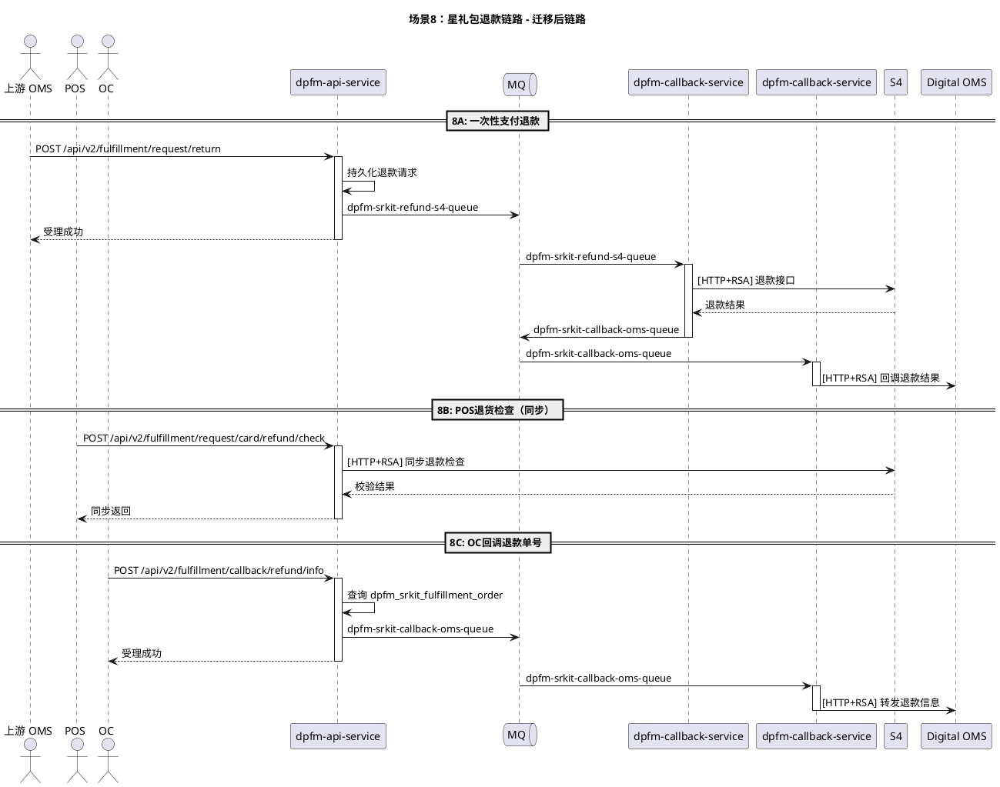

---

### 场景9：运营后台管理接口
> **v1.3 新增场景**（低优先级）：基于 2026-04-09 代码扫描补充。
>

> **事实核对（2026-04-15 审计）**
>
> **已确认事实：**
>
> + `GET /admin/request/{id}` 存在（`RequestController.java:57-62`）
> + `POST /admin/request/entity/srkit/import` 存在（`RequestController.java:65-66`）；`application.yml:58` 将其列入 `secure.ignored.urls` 白名单；ES 7 天命中 **8 次**
> + FC 应用 Spring name 为 `fulfillment-controller-rmq`（与日志/监控指标中的实际服务名对齐）
> + DPFM-backstage-service 使用 Shiro RBAC（`BizOpsAuthController` / `RoleController` / `UserController`）
> + ES 7 天 `/admin/request` 命中 **20 次** — 接口有真实生产流量
>
> **已证伪：**
>
> + 原文 `/admin/request/list` 方法为 **POST** → `RequestController.java:47-53` 实际为 `RequestMethod.GET`
>
> **已确认（2026-04-16）：**
>
> + ✅ DPFM-backstage-service 需**新建** SRKIT 相关 Controller/Mapper（迁移工作量）
> + ✅ 数据源：DPFM 需新增 FC 同构表结构 + FC 数据初始化到 DPFM（见第 7.6.1 节迁移清单）
>

#### 场景描述
FC 侧存在一组运营后台管理接口（`/admin/*`），由运营人员通过 Portal/UMS 登录后使用。这些接口与业务履约接口（`/api/v2/*`）共享底层数据，但属于独立的运营管理入口，需纳入迁移范围。

#### 接口清单
| 接口路径 | 方法 | 功能 | 鉴权 |
| --- | --- | --- | --- |
| `/admin/request/list` | **GET** | 查询履约请求列表（多条件） | Portal/UMS |
| `/admin/request/{id}` | GET | 查询履约请求详情 | Portal/UMS |
| `/admin/request/entity/srkit/import` | POST | 实体星礼包批量导入 | Portal/UMS |


#### 迁移策略
+ **迁移目标服务**：**dpfm-backstage-service**（DPFM 运营后台专用服务）
+ **⚠️**** 实现状态**：DPFM-backstage-service 当前代码中**无**任何 SRKIT 相关 Controller/Mapper（Grep 零命中），迁移前需**新建**列表查询、详情查询、实体批量导入三个接口，并建立 fulfillment order 相关 Mapper
+ **数据源**：推荐通过 RPC 调用 dpfm-api-service 暴露的内部查询接口（避免直连跨服务数据库）
+ **鉴权集成**：复用现有 DPFM 后台 Portal/UMS + Shiro RBAC 体系
+ **优先级**：低。可在核心业务迁移完成后再迁移后台接口，过渡期可保留 FC 后台继续查询历史数据

#### 涉及服务
|  | 旧链路 | 新链路 |
| --- | --- | --- |
| 核心服务 | fc-fulfillment-controller（Spring name: `fulfillment-controller-rmq`，admin 入口） | dpfm-backstage-service（需新建 SRKIT 相关接口） |


#### 上下游系统
|  | 系统 |
| --- | --- |
| 上游 | Portal / UMS（运营后台） |
| 下游 | DPFM 履约数据表（通过 dpfm-api-service RPC 调用；不建议直连） |


---

## 3. 服务影响总览表
| 服务 | 角色变化 | 改造类型 | 影响程度 |
| --- | --- | --- | --- |
| **dpfm-api-service** | 新增 SRKIT/SVC 卡履约入口 API | 新增 API 接口、请求路由、BOM 拆解逻辑 | **高** |
| **dpfm-callback-service** | 新增 SRKIT/SVC 卡 MQ 消费者 | 新增 MQ 消费逻辑、下游调用 | **高** |
| **dpfm-send-core-service** | 承接 SVC 卡建卡能力（原已有部分能力） | 扩展建卡接口 | **中** |
| **dpfm-callback-service** | 新增 SRKIT/SVC 卡回调逻辑 | 新增回调 OMS/OC/CRM/CAC 逻辑 | **高** |
| **dpfm-retry-service** | 新增 SRKIT/SVC 卡重试策略 | 新增重试队列配置和策略 | **中** |
| **dpfm-task-service** | 新增 8 个 FC 迁移的定时任务（重试/补偿/清理/到期提醒/死信处理） | 新增定时任务实现、XxlJob 注册、NC 推送 | **高**（v1.3 调整） |
| **dpfm-backstage-service** | 新增 SRKIT/SVC 卡运营后台功能（查询列表/详情、实体批量导入） | 新增查询、管理页面，Portal/UMS 鉴权集成 | **中**（v1.3 调整） |
| **fc-fulfillment-controller** | 移除 SRKIT/SVC 卡相关路由 | 删除/禁用接口、灰度切流配置 | **中** |
| **fc-fulfillment-digital** | 移除 SRKIT/SVC 卡相关消费者 | 删除/禁用 MQ 消费者 | **高** |
| O2O OMS | 切换调用地址 | 配置变更 | **低** |
| D OMS | 切换调用地址 | 配置变更 | **低** |
| DP OMS | 切换调用地址 | 配置变更 | **低** |
| POS | 切换调用地址 | 配置变更 | **低** |
| UPP | 无改造（仅场景6需更新回调地址配置） | 配置变更 | **低** |
| S4 / CAC / OC / Online CRM | 无改造 | 不变 | **无** |


---

## 4. 各服务改造点汇总
### 4.1 dpfm-api-service
#### API 接口（按**入口防腐层原则**保持与 FC 完全一致）
> 所有 DPFM 新接口的 path、请求参数、响应参数**必须与下表"对应 FC 接口"列完全一致**（字节级兼容），上游系统仅改调用地址。
>

| 接口路径（= FC 原路径） | 方法 | 说明 | 涉及场景 |
| --- | --- | --- | --- |
| `/api/v2/fulfillment/request/add` | POST | SRKIT 履约请求（O2O/省心购/银行/三方 + POS 电子 bt=23/sub=2301 + SVC 建卡并充值 1301 + SVC 充值 1302/3401） | 1,2,3,4,5A,7 |
| `/api/v2/fulfillment/request/preGenerateSrkit` | POST | POS 预生成 srkitNo（同步 S4） | 6 |
| `/api/v2/fulfillment/request/invalidPreGenerateSrkit` | POST | POS 作废预生成 | 6 |
| `/api/v2/fulfillment/request/add/activate` | POST | 实体星礼包激活（bt=1000/sub=11000） | 5B |
| `/api/v2/fulfillment/request/add/bind` | POST | 实体星礼包绑定 | 5C |
| `/api/v2/fulfillment/request/add/unbind` | POST | 实体星礼包解绑 | 5D |
| `/api/v2/fulfillment/request/add/verify` | POST | 实体星礼包卡密校验（调 S4/CAC/UPP/GCP） | 5 |
| `/api/v2/fulfillment/request/add/web/bind` | POST | 官网实体星礼包绑定 | 5F |
| `/v2/fulfillment/request/send/card` | POST | 星礼包预占卡号获取 | 5 |
| `/api/v2/fulfillment/request/card/refund/check` | POST | POS 电子星礼包退款检查（同步，含本地前置校验 2301/PENDING 与 2302/SUCCESS） | 5E / 8B |
| `/api/v2/fulfillment/request/return` | POST | 一次性支付星礼包退款 | 8A |
| `/api/v2/fulfillment/callback/refund/info` | POST | OC 回调退款单号 | 8C |
| `/api/v2/fulfillment/request/posBatchSrkitActivate` | POST | POS 批量激活实体星礼包（SRKit SET，**同步调 S4，无 MQ**） | 5G |
| `/api/v2/fulfillment/request/batchBindSRKitMix` | POST | POS 混合批量绑定（Mix=混合卡类型，8 开头/7 开头/加密卡） | 5H |
| `/api/v2/fulfillment/request/batchUnbindSRKit` | POST | POS 批量解绑实体星礼包 | 5I |
| `/api/v2/fulfillment/request/third/party/bind` | POST | 三方权益绑定 | 5,7 |
| `/api/v2/fulfillment/callback/third/party/iqiyi` | POST | 爱奇艺绑定结果回调 | 5,7 |
| `/api/v2/fulfillment/callback/third/party/xiecheng` | POST | 携程回调 | 5,7 |
| `/api/v2/fulfillment/callback/third/party/*` | POST | 其余三方（网易云 / 芒果 / 京东 PLUS / 腾讯视频 / B 站 / 万达 等） | 5,7 |


> **v1.4 + v1.5 历史修正说明**（已被入口防腐层原则覆盖）：
>
> 1. **SVC 卡无手动绑定场景**：v1.3 曾规划的 SVC 绑定接口为误写，已删除。场景 7 仅保留"建卡并充值（1301）/充值（1302/3401）"两种业务场景。
> 2. **UPP 取消卡/取消充值为异常补偿流程**（由内部补偿触发），不作为对外 API 暴露。
> 3. **SRkit Set 批量接口**（5G/5H/5I）实质为 POS 实体星礼包的批量版本，按防腐层原则统一沿用 FC 原路径（`posBatchSrkitActivate` / `batchBindSRKitMix` / `batchUnbindSRKit`）。
>
> v1.1–v1.4 中出现的所有 `/api/v1/*` 规划路径全部作废，本文档统一使用 FC 原路径。
>

#### 运营后台接口（迁移目标为 dpfm-backstage-service，按防腐层原则保持 FC 路径）
| 接口路径（= FC 原路径） | 方法 | 说明 | 涉及场景 |
| --- | --- | --- | --- |
| `/admin/request/list` | **GET** | 查询履约请求列表（`RequestController.java:47-53` 确认为 GET） | 9 |
| `/admin/request/{id}` | GET | 查询履约请求详情 | 9 |
| `/admin/request/entity/srkit/import` | POST | 实体星礼包批量导入 | 9 |


#### 业务逻辑迁移
+ **BOM 配置拆解逻辑**：从 FC controller 迁移，根据 BOM 配置拆解星礼包组成（SVC 卡 + 券 + 三方权益）
+ **卡号前缀路由逻辑**：从 FC controller 迁移，8 开头走 S4 校验，非 8 开头走 UPP 校验
+ **同步调用 S4**：预生成、查询 SRKIT 定义、查询卡状态、同步绑定等
+ **请求幂等性**：基于 requestId 去重

#### 配置新增
+ S4 连接配置（地址、RSA 密钥、apikey）
+ UPP 连接配置（地址、RSA 密钥、partnerId=1490、merchantId=10001）
+ 业务类型码映射配置（businessTypeCode）
+ BOM 配置数据源

---

### 4.2 dpfm-callback-service
#### MQ 消费者（新增）
**SRKIT 核心流程**：

| 队列 | 说明 | 下游调用 |
| --- | --- | --- |
| `dpfm-srkit-create-card-queue` | 建 SVC 卡 | dpfm-send-core-service |
| `dpfm-srkit-upp-create-queue` | UPP 创建/激活绑定 | UPP [HTTP+RSA] |
| `dpfm-svc-reload-queue` | UPP 充值 | UPP [HTTP+RSA] |
| `dpfm-svc-cancel-queue` | UPP 取消卡 | UPP [HTTP+RSA] |
| `dpfm-svc-cancel-reload-queue` | UPP 取消充值 | UPP [HTTP+RSA] |
| `dpfm-srkit-crm-update-queue` | Online CRM 更新卡号 | Online CRM [HTTP+RSA] |
| `dpfm-svc-crm-update-queue` | Online CRM 更新 SVC 卡号 | Online CRM [HTTP+RSA] |
| `dpfm-srkit-crm-add-star-queue` | Online CRM 发星星 | Online CRM [HTTP+RSA] |
| `dpfm-srkit-cac-sync-queue` | CAC 卡余额同步 | CAC [HTTP+apikey] |


**实体星礼包**：

| 队列 | 说明 | 下游调用 |
| --- | --- | --- |
| `dpfm-entity-srkit-activate-queue` | 实体星礼包激活 | 内部编排 |
| `dpfm-entity-srkit-bind-s4-queue` | S4 绑定 | S4 [HTTP+RSA] |
| `dpfm-entity-srkit-unbind-s4-queue` | S4 解绑 | S4 [HTTP+RSA] |
| `dpfm-entity-srkit-bind-cac-queue` | CAC 绑定 | CAC [HTTP+apikey] |
| `dpfm-entity-srkit-unbind-cac-queue` | CAC 解绑 | CAC [HTTP+apikey] |


**S4 相关**：

| 队列 | 说明 | 下游调用 |
| --- | --- | --- |
| `dpfm-srkit-refund-s4-queue` | S4 退款（一次性支付，场景 8A） | S4 [HTTP+RSA] |
| `dpfm-srkit-invalid-coupon-s4-queue` | S4 注销星礼包退款（v1.3 新增） | S4 [HTTP+RSA] |
| `dpfm-srkit-update-cardnum-s4-queue` | S4 更新卡号 | S4 [HTTP+RSA] |
| `dpfm-srkit-s4-send-coupon-queue` | S4 发券 | S4 [HTTP+RSA] |
| `dpfm-srkit-s4-refund-coupon-queue` | S4 退券 | S4 [HTTP+RSA] |


**其他（v1.3 新增）**：

| 队列 | 说明 | 下游调用 |
| --- | --- | --- |
| `dpfm-srkit-summary-email-queue` | 三方星礼包汇总邮件 | 邮件服务 |
| `dpfm-srkit-batch-create-order-queue` | 实体星礼包批量创建订单（场景 9 后台导入） | 内部编排 |
| `dpfm-update-card-no-cac-queue` | 更新卡号到 CAC | CAC [HTTP+apikey] |
| `dpfm-coupon-bind-notify-ebuy-queue` | 券绑定状态通知 EBUY | EBUY [HTTP] |


**三方权益**（11 种）：

| 队列 | 说明 |
| --- | --- |
| `dpfm-srkit-3pp-iqiyi-queue` | 爱奇艺 |
| `dpfm-srkit-3pp-xc-queue` | 携程 |
| `dpfm-srkit-3pp-wyy-queue` | 网易云 |
| `dpfm-srkit-3pp-mongotv-queue` | 芒果TV |
| `dpfm-srkit-3pp-jdplus-queue` | 京东PLUS |
| `dpfm-srkit-3pp-tencent-video-queue` | 腾讯视频 |
| `dpfm-srkit-3pp-bili-coupon-queue` | B站券 |
| `dpfm-srkit-3pp-bili-member-queue` | B站大会员 |
| `dpfm-srkit-3pp-bili-star-member-queue` | B站星星兑换大会员 |
| `dpfm-srkit-3pp-wanda-queue` | 万达 |
| `dpfm-srkit-3pp-one-time-queue` | 一次性三方权益 |


**POS 实体星礼包批量（v1.4：原"场景8 SRkit Set"修正，合并至场景 5G/5H/5I）**：

> 3 个 POS 批量接口的业务逻辑与 5B/5C/5D 单条处理**完全一致**，**复用现有的 **`dpfm-entity-srkit-*-queue*`** 队列**即可，不新增独立的 Set 专用队列。dpfm-api-service 层在接收批量请求后，按单条拆分或批量透传至同一套下游流程。
>

| 批量接口 | 复用的队列 | 对应单条子场景 |
| --- | --- | --- |
| `batch-activate` (5G) | `dpfm-entity-srkit-activate-queue` + 后续 `BIND#S4` / `BIND#CAC` / `UPP#CREATE` | 5B |
| `batch-bind-mix` (5H) | `dpfm-entity-srkit-bind-cac-queue` + `dpfm-srkit-crm-update-queue`（同步部分走 dpfm-api-service 直连 S4） | 5C |
| `batch-unbind` (5I) | `dpfm-entity-srkit-unbind-s4-queue` + `dpfm-entity-srkit-unbind-cac-queue` | 5D |


**补偿**：

| 队列 | 说明 |
| --- | --- |
| `dpfm-srkit-pos-makeup-queue` | POS 补偿 |


#### 业务逻辑迁移
+ 迁移 fc-fulfillment-digital 中所有 SRKIT/SVC 卡相关的消费者处理逻辑
+ 下游 HTTP 调用逻辑（UPP、S4、CAC、Online CRM、3PP Gateway/TPES）
+ RSA 签名/验签工具类
+ 重试与异常处理策略

#### 配置新增
+ 全套下游系统连接和认证配置
+ MQ 队列配置
+ 重试策略配置

---

### 4.3 dpfm-send-core-service
#### 业务逻辑
+ **SVC 卡建卡**：已有部分建卡能力，需扩展支持 SRKIT 场景下的 SVC 卡创建
+ 建卡后联动 UPP、PNC 的逻辑

#### 数据模型
+ 扩展卡信息表，增加 SRKIT 关联字段

---

### 4.4 dpfm-callback-service
#### MQ 消费者（新增）
| 队列 | 说明 | 下游调用 |
| --- | --- | --- |
| `dpfm-srkit-callback-oms-queue` | 回调 Digital OMS 卡号 | Digital OMS [HTTP+RSA] |
| `dpfm-srkit-callback-new-oms-queue` | 回调新 Digital OMS | Digital OMS [HTTP+RSA] |
| `dpfm-srkit-callback-oc-queue` | 回调 OC 卡号 | OC [HTTP+apikey] |
| `dpfm-srkit-callback-oc-status-queue` | 回调 OC 履约状态 | OC [HTTP+apikey] |
| `dpfm-entity-srkit-callback-tmall-queue` | 回调天猫 | 天猫中间件 [HTTP] |
| `dpfm-srkit-return-callback-tmall-queue` | 退回调天猫 | 天猫中间件 [HTTP] |


#### 业务逻辑
+ 迁移 fc-fulfillment-digital 中所有回调逻辑
+ 回调幂等性保证
+ 回调失败重试策略

#### 配置
+ Digital OMS 连接配置（RSA 签名）
+ OC 连接配置（apikey）
+ 天猫中间件连接配置

---

### 4.5 dpfm-retry-service
#### MQ 消费者（新增延时队列）
| 队列 | 说明 |
| --- | --- |
| `dpfm-srkit-crm-update-delay-queue` | CRM 卡号更新延时重试 |
| `dpfm-srkit-oc-update-delay-queue` | OC 卡号更新延时重试 |
| `dpfm-srkit-oc-status-callback-delay-queue` | OC 状态回调延时重试 |
| `dpfm-srkit-oms-callback-delay-queue` | Digital OMS 回调延时重试 |


#### 业务逻辑
+ 延时重试策略配置
+ 最大重试次数和退避策略
+ 死信队列处理

---

### 4.6 fc-fulfillment-controller
#### 改造点
+ **灰度路由**：新增灰度开关，按场景/渠道/比例将请求路由到 DPFM 或保持原链路
+ **关键配置**：`BusinessTypeConfig.srkitTypeCodeList`（Nacos: `business.srkit.srkitTypeCodeList`）定义了所有 SRKIT 类型码：`2, 12, 21, 22, 23, 26, 37, 43`；另有 `b2bSrkitTypeCodeList` 用于 B2B 场景。一次性支付渠道 SubTypeCode：`301, 501, 1501, 1801, 1807, 1811, 2401, 1821`。POS 随单购独立类型码：`302301`。
+ **接口下线**：迁移完成后，逐步下线以下接口的 SRKIT/SVC 卡逻辑：
    - `POST /api/v2/fulfillment/request/add`（businessTypeCode in srkitTypeCodeList: 2, 12, 21, 22, 23, 26, 37, 43）
    - `POST /api/v2/fulfillment/request/add/activate` — 实体星礼包激活
    - `POST /api/v2/fulfillment/request/add/bind` — 实体星礼包绑定
    - `POST /api/v2/fulfillment/request/add/web/bind` — **官网实体星礼包绑定**（v1.3 新增）
    - `POST /api/v2/fulfillment/request/add/unbind` — 实体星礼包解绑
    - `POST /api/v2/fulfillment/request/add/verify` — 卡密校验（调用S4/CAC/UPP/GCP）
    - `POST /v2/fulfillment/request/send/card` — 星礼包预占卡号获取
    - `POST /api/v2/fulfillment/request/card/refund/check` — 退款检查
    - `POST /api/v2/fulfillment/request/return` — **一次性支付星礼包退款**（v1.3 新增）
    - `POST /api/v2/fulfillment/request/preGenerateSrkit` — **POS 预生成**（v1.3 明确路径）
    - `POST /api/v2/fulfillment/request/invalidPreGenerateSrkit` — **POS 作废预生成**（v1.3 明确路径）
    - `POST /api/v2/fulfillment/request/posBatchSrkitActivate` — **POS 批量激活实体星礼包**（v1.4 修正：场景 5G，5B 的批量版本）
    - `POST /api/v2/fulfillment/request/batchBindSRKitMix` — **POS 混合批量绑定实体星礼包**（v1.4 修正：场景 5H，5C 的批量版本，Mix=混合卡类型）
    - `POST /api/v2/fulfillment/request/batchUnbindSRKit` — **POS 批量解绑实体星礼包**（v1.4 修正：场景 5I，5D 的批量版本）
    - `POST /api/v2/fulfillment/request/third/party/bind` — 三方权益绑定
    - `POST /api/v2/fulfillment/callback/refund/info` — **OC 回调 SRKIT 退款单号**（v1.3 新增）
    - `POST /api/v2/fulfillment/callback/third/party/iqiyi` — 爱奇艺回调
    - `POST /api/v2/fulfillment/callback/third/party/xiecheng` — 携程回调
    - `POST /admin/request/list` — **后台查询列表**（v1.3 新增）
    - `GET /admin/request/{id}` — **后台查询详情**（v1.3 新增）
    - `POST /admin/request/entity/srkit/import` — **后台实体星礼包批量导入**（v1.3 新增）
    - `fulfillRequestAdd`

---

### 4.7 fc-fulfillment-digital
#### 改造点
+ **MQ 消费者下线**：迁移完成后，逐步停止消费约 40+ 个 SRKIT/SVC 卡相关队列
+ **灰度期间**：保留全部消费者，确保可回切
+ **最终状态**：仅保留券（Coupon）和 CDK 相关的消费者（共 9 个队列）

---

### 4.8 FC 定时任务迁移清单
> **v1.3 新增章节**（高优先级）：基于 2026-04-09 代码扫描补充。
>

FC 侧存在多个与 SRKIT/SVC 履约直接相关的定时任务（Scheduled / XxlJob），必须一并迁移到 DPFM，否则迁移后将出现**失败重试缺失、死信堆积、到期提醒丢失、实体退单断链**等问题。

#### 定时任务清单
| 任务名 | 触发 | 功能 | 涉及业务 | 迁移目标 |
| --- | --- | --- | --- | --- |
| `posSrkitMakeUpOrder()` | 每 15 分钟 | 查询 OC 未履约 POS SRKIT 订单（状态 PAID），触发补偿 | POS 电子/实体星礼包 | **dpfm-task-service** 新增 |
| `fulfillmentSRKitRetryHandler()` | 每 5 分钟（XxlJob） | 30 分钟前失败的 SRKIT 履约重试（APP / 天猫 / 微信 / POS / 三方 / B2B） | **全部** SRKIT 场景 | **dpfm-task-service** 新增 |
| `deleteFulfillmentSRKitRetryHandler()` | 每天（XxlJob） | 删除 30 天前的 SRKIT 重试记录 | 全部 SRKIT | **dpfm-task-service** 新增 |
| `entitySrkitRefundOrder()` | 每日 5 点 | 查询实体星礼包退单 | 实体星礼包退款 | **dpfm-task-service** 新增 |
| `deadMessageTask()` | 每 5 分钟 | 处理死信队列回调 OC / OMS / TMALL 失败 | 全部 SRKIT / SVC | **dpfm-task-service** 新增 |
| `pushNCTask()` | 每日 | 推送 SRKIT 绑定即将失效（APP 省心购 100 / POS 电子 2301） | 省心购、POS 电子 | **dpfm-task-service** 新增 |
| `pushWechatNCTask()` | 每日 | 推送微信省心购 SRKIT 即将失效（2101） | 省心购微信 | **dpfm-task-service** 新增 |
| `pushBindExpireTask()` | 定时 | 推送静默绑定到期提醒 | 静默绑定 | **dpfm-task-service** 新增 |


#### 迁移要点
+ **dpfm-task-service 改造**：新增以上 8 个定时任务实现，复用 dpfm-callback-service 的下游调用能力与重试机制
+ **数据依赖**：定时任务依赖 `dpfm_srkit_fulfillment_order` / `dpfm_srkit_fulfillment_detail` 等新表，需在数据模型中确保字段齐全（特别是 `status`、`retry_count`、`created_at`）
+ **灰度策略**：迁移期间 FC 与 DPFM **不可同时运行**相同的定时任务，避免双重补偿/重试。建议先在 DPFM 侧开发并灰度，验证后一次性停止 FC 侧任务
+ **XxlJob 注册**：2 个 XxlJob 任务（`fulfillmentSRKitRetryHandler` / `deleteFulfillmentSRKitRetryHandler`）需在 DPFM 的 XxlJob 调度中心重新注册
+ **NC 推送通道**：3 个 push 类任务涉及 NC（Notification Center），DPFM 需配置 NC 连接与消息模板

#### 影响程度更新
由于新增 8 个定时任务，**dpfm-task-service** 的影响程度从 v1.2 的"低"提升为"**高**"，需在第 3 章服务影响总览表中同步更新。

---

## 5. MQ 队列规划
### 5.1 队列命名规范
| 维度 | 规范 |
| --- | --- |
| 旧队列前缀 | `FULFILLMENT#` |
| 新队列前缀 | `dpfm-srkit-*-queue` / `dpfm-svc-*-queue` / `dpfm-entity-srkit-*-queue` |


### 5.2 完整队列映射关系
| 旧队列（FC） | 新队列（DPFM） | 消费服务 |
| --- | --- | --- |
| FULFILLMENT#DPMS#CREATE#CARD | dpfm-srkit-create-card-queue | dpfm-callback-service |
| FULFILLMENT#UPP#CREATE#CARD | dpfm-srkit-upp-create-queue | dpfm-callback-service |
| FULFILLMENT#UPP#RELOAD#CARD | dpfm-svc-reload-queue | dpfm-callback-service |
| FULFILLMENT#UPP#CANCEL#RELOAD#CARD | dpfm-svc-cancel-reload-queue | dpfm-callback-service |
| FULFILLMENT#UPP#CANCEL#CARD | dpfm-svc-cancel-queue | dpfm-callback-service |
| FULFILLMENT#CAC#CALLBACK#CARD#AMOUNT | dpfm-srkit-cac-sync-queue | dpfm-callback-service |
| FULFILLMENT#ONLINE#CRM#UPDATE#CARD | dpfm-srkit-crm-update-queue | dpfm-callback-service |
| FULFILLMENT#ONLINE#CRM#UPDATE#SVC#CARD | dpfm-svc-crm-update-queue | dpfm-callback-service |
| FULFILLMENT#ONLINE#CRM#ADD#STAR | dpfm-srkit-crm-add-star-queue | dpfm-callback-service |
| FULFILLMENT#CARD#CALLBACK#SYSTEM | dpfm-srkit-callback-oms-queue | dpfm-callback-service |
| FULFILLMENT#CARD#CALLBACK#OC | dpfm-srkit-callback-oc-queue | dpfm-callback-service |
| FULFILLMENT#ENTITY#SRKIT#ACTIVATE | dpfm-entity-srkit-activate-queue | dpfm-callback-service |
| FULFILLMENT#ENTITY#SRKIT#ACTIVATE#CALLBACK#TMALL | dpfm-entity-srkit-callback-tmall-queue | dpfm-callback-service |
| FULFILLMENT#SRKIT#RETURN#CALLBACK#TMALL | dpfm-srkit-return-callback-tmall-queue | dpfm-callback-service |
| FULFILLMENT#ENTITY#SRKIT#BIND#S4 | dpfm-entity-srkit-bind-s4-queue | dpfm-callback-service |
| FULFILLMENT#ENTITY#SRKIT#UNBIND#S4 | dpfm-entity-srkit-unbind-s4-queue | dpfm-callback-service |
| FULFILLMENT#DIGITAL#SRKIT#REFUND#S4 | dpfm-srkit-refund-s4-queue | dpfm-callback-service |
| FULFILLMENT#SRKIT#UPDATE#CARD#NUM#S4 | dpfm-srkit-update-cardnum-s4-queue | dpfm-callback-service |
| FULFILLMENT#ENTITY#SRKIT#BIND#CAC | dpfm-entity-srkit-bind-cac-queue | dpfm-callback-service |
| FULFILLMENT#ENTITY#SRKIT#UNBIND#CAC | dpfm-entity-srkit-unbind-cac-queue | dpfm-callback-service |
| FULFILLMENT#S4#SEND#COUPON | dpfm-srkit-s4-send-coupon-queue | dpfm-callback-service |
| FULFILLMENT#S4#REFUND#COUPON | dpfm-srkit-s4-refund-coupon-queue | dpfm-callback-service |
| FULFILLMENT#POS#SRKIT#MAKE#UP | dpfm-srkit-pos-makeup-queue | dpfm-callback-service |
| FULFILLMENT#DATA#CALLBACK#DIGITAL#OMS | dpfm-srkit-callback-oms-queue | dpfm-callback-service |
| FULFILLMENT#DATA#CALLBACK#NEW#DIGITAL#OMS | dpfm-srkit-callback-new-oms-queue | dpfm-callback-service |
| FULFILLMENT#FULFILL#STATUS#CALLBACK#OC | dpfm-srkit-callback-oc-status-queue | dpfm-callback-service |
| FULFILLMENT#THIRD#PARTY#IQIYI#BINDING | dpfm-srkit-3pp-iqiyi-queue | dpfm-callback-service |
| FULFILLMENT#THIRD#PARTY#XC#BINDING | dpfm-srkit-3pp-xc-queue | dpfm-callback-service |
| FULFILLMENT#THIRD#PARTY#WYY#BINDING | dpfm-srkit-3pp-wyy-queue | dpfm-callback-service |
| FULFILLMENT#THIRD#PARTY#MONGOTV#BINDING | dpfm-srkit-3pp-mongotv-queue | dpfm-callback-service |
| FULFILLMENT#THIRD#PARTY#JDPLUS#BINDING | dpfm-srkit-3pp-jdplus-queue | dpfm-callback-service |
| FULFILLMENT#THIRD#PARTY#TENCENT#VIDEO#BINDING | dpfm-srkit-3pp-tencent-video-queue | dpfm-callback-service |
| FULFILLMENT#THIRD#PARTY#BILI#COUPON#BINDING | dpfm-srkit-3pp-bili-coupon-queue | dpfm-callback-service |
| FULFILLMENT#THIRD#PARTY#BILI#MEMBER#BINDING | dpfm-srkit-3pp-bili-member-queue | dpfm-callback-service |
| FULFILLMENT#THIRD#PARTY#BILI#STAR#MEMBER#BINDING | dpfm-srkit-3pp-bili-star-member-queue | dpfm-callback-service |
| FULFILLMENT#THIRD#PARTY#WANDA#BINDING | dpfm-srkit-3pp-wanda-queue | dpfm-callback-service |
| FULFILLMENT#ONE#TIME#TRD#BENEFIT#BINDING | dpfm-srkit-3pp-one-time-queue | dpfm-callback-service |
| FULFILLMENT#ONLINE#CRM#UPDATE#CARD#DELAY | dpfm-srkit-crm-update-delay-queue | dpfm-retry-service |
| FULFILLMENT#OC#UPDATE#CARD#DELAY | dpfm-srkit-oc-update-delay-queue | dpfm-retry-service |
| FULFILLMENT#FULFILL#STATUS#CALLBACK#OC#DELAY | dpfm-srkit-oc-status-callback-delay-queue | dpfm-retry-service |
| FULFILLMENT#DATA#CALLBACK#DIGITAL#OMS#DELAY | dpfm-srkit-oms-callback-delay-queue | dpfm-retry-service |


#### v1.3 补充队列（2026-04-09 代码扫描新增）
以下队列为 v1.2 遗漏、v1.3 补充，必须纳入迁移范围：

| 旧队列（FC） | 用途 | 新队列（DPFM） | 消费服务 |
| --- | --- | --- | --- |
| `FULFILLMENT#DIGITAL#SRKIT#REFUND#S4` | 一次性支付星礼包 S4 退款（场景 8A） | `dpfm-srkit-refund-s4-queue` | dpfm-callback-service |
| `FULFILLMENT#INVALID#SRKIT#COUPON#S4` | S4 注销星礼包退款 | `dpfm-srkit-invalid-coupon-s4-queue` | dpfm-callback-service |
| `FULFILLMENT#THIRD#SRKIT#SUMMARY#SENDEMAIL` | 三方星礼包汇总邮件 | `dpfm-srkit-summary-email-queue` | dpfm-callback-service |
| `FULFILLMENT#ENTITY#SRKIT#BATCH#CREATE#ORDER` | 实体星礼包批量创建订单（场景 9 后台导入） | `dpfm-srkit-batch-create-order-queue` | dpfm-callback-service |
| `FULFILLMENT#UPDATE#CARD#NO#CAC` | 更新卡号到 CAC 系统 | `dpfm-update-card-no-cac-queue` | dpfm-callback-service |
| `FULFILLMENT#COUPON#BIND#NOTIFY#EBUY` | 券绑定状态通知 EBUY | `dpfm-coupon-bind-notify-ebuy-queue` | dpfm-callback-service |


> 注：`FULFILLMENT#DIGITAL#SRKIT#REFUND#S4` 在 v1.2 的 5.2 表格中已存在重名行（dpfm-srkit-refund-s4-queue），v1.3 这里明确其对应的业务是"一次性支付星礼包 S4 退款"（场景 8A）。
>

### 5.3 不迁移的队列（保留在 FC digital）
以下队列与券（Coupon）和 CDK 相关，不在本次迁移范围内：

+ FULFILLMENT#dpfm-create-cdk-queue
+ FULFILLMENT#UPP#CREATE#COUPON
+ FULFILLMENT#ONLINE#CRM#CREATE#COUPON
+ FULFILLMENT#dpfm-create-coupon-queue
+ FULFILLMENT#ENTITY#COUPON#BIND#CAC
+ FULFILLMENT#DEFAULT#COUPON#BIND#CAC
+ FULFILLMENT#DEFAULT#CARD#BIND#CAC
+ FULFILLMENT#MERCHANT#COUPON#BIND#CAC
+ FULFILLMENT#COUPON#GIVE#CAC

---

## 6. 数据模型变更
### 6.1 DPFM 新增表
| 表名 | 说明 | 核心字段 |
| --- | --- | --- |
| `dpfm_srkit_fulfillment_order` | SRKIT 履约单 | id, request_id, business_type_code, channel, status, bom_config, card_no, srkit_no, member_id, created_at, updated_at |
| `dpfm_srkit_fulfillment_detail` | SRKIT 履约明细 | id, order_id, step_type (CREATE_CARD / UPP_BIND / 3PP_BIND / CAC_SYNC / ...), status, retry_count, response, created_at |
| `dpfm_svc_fulfillment_order` | SVC 卡履约单（v1.4 修正） | id, request_id, operation_type (CREATE_AND_RELOAD / RELOAD), card_no, amount, status, created_at |
| `dpfm_entity_srkit_record` | 实体星礼包记录 | id, srkit_no, card_no, card_prefix, status (ACTIVATED / BINDEDUNBINDED), member_id, created_at |
| `dpfm_srkit_batch_request` | POS 实体星礼包批量请求（v1.4 修正：原 `dpfm_srkit_set_batch`，对应场景 5G/5H/5I） | id, batch_id, operation_type (BATCH_ACTIVATE / BATCH_BIND_MIX / BATCH_UNBIND), total_count, success_count, fail_count, status, created_at |
| `dpfm_3pp_benefit_record` | 三方权益绑定记录 | id, order_id, benefit_type, external_order_no, status, created_at |
| `dpfm_callback_record` | 回调记录 | id, order_id, callback_type, target_system, status, retry_count, response, created_at |


### 6.2 FC 数据表处理
+ FC 中 SRKIT/SVC 卡相关的履约数据表在迁移期间保留，用于历史数据查询和回切
+ 迁移完成并稳定运行后，可考虑归档或标记为只读

---

## 7. 风险与注意事项
### 7.1 高风险项
| 风险 | 影响 | 缓解措施 |
| --- | --- | --- |
| **数据一致性** | 迁移期间新旧链路并行，可能出现数据不一致 | 1) 按场景灰度切流，不同场景不同时切换 2) 切流前确保无在途单 3) 双写比对机制 |
| **认证密钥迁移** | DPFM 需配置与 FC 相同的 RSA 密钥和 apikey | 1) 提前申请/同步所有认证信息 2) 逐个下游系统验证连通性 3) 注意 UPP 的 partnerId/merchantId 是否需要新申请 |
| **BOM 配置拆解逻辑复杂** | FC controller 中的 BOM 拆解逻辑是核心，迁移需完整覆盖 | 1) 详细梳理所有 BOM 配置项 2) 编写全面的测试用例 3) 使用线上流量回放验证 |
| **三方权益绑定** | 涉及 11 种三方权益，每种有不同的调用协议和参数 | 1) 逐个三方权益测试 2) 保留 FC 侧能力用于回切 |
| **新老链路兼容** | externalSrkitTypeCodeList (22,26,43,37) 走 S4 新链路生成卡，其余走 DPFM 老链路生成卡。DPFM 迁移后需同时支持两种建卡方式 | 1) 将 externalSrkitTypeCodeList 配置迁移到 DPFM 的 Nacos 中 2) DPFM 建卡逻辑需同时支持"S4直接返回卡号"和"DPFM自建卡"两种模式 3) 根据 businessTypeCode 自动路由到正确的建卡方式 |


### 7.2 中风险项
| 风险 | 影响 | 缓解措施 |
| --- | --- | --- |
| **MQ 消息格式** | 新旧 MQ 消息格式可能存在差异 | 保持消息体格式兼容，仅变更 topic 名称 |
| **卡号前缀路由逻辑** | 实体星礼包绑定的路由逻辑较复杂（8 开头 vs 非 8 开头） | 完整迁移路由逻辑，增加日志和监控 |
| **POS 随单购的双入口** | 场景 6 中 UPP 也会调用正式履约接口 | 确保 DPFM 接口同时支持 POS 和 UPP 调用，UPP 侧需配合更新回调地址 |
| **SVC 1301 的自动级联 ReloadCard**（v1.4 澄清） | UppServiceImpl.java:182 中 CreateCard 成功后在同一流程内自动发送 ReloadCard 消息，迁移时必须完整复现此级联行为，否则 1301 场景会缺金额 | 1) 迁移时保证 DPFM Consumer 在 CreateCard 成功回调路径上直接发送 `dpfm-svc-reload-queue` 2) 端到端压测验证 1301 -> 建卡 -> 充值 -> 回调 的完整链路 |
| **历史数据查询** | 迁移后查询历史履约记录需要跨系统 | 保留 FC 历史数据的查询接口，或做数据迁移 |
| **隔日预约单（bt=28）迁移** | businessTypeCode=28（2801/2805建卡，2802/2806退款）走 DPMS 建卡逻辑。2026-04-17 已确认纳入本期迁移范围 | 需额外梳理 DPMS 建卡逻辑，在 DPFM 侧复现；与 SRKIT/SVC 主链路同批次灰度 |
| **卡券绑定待确认** | businessSubTypeCode=12101(电子券)/12102(星礼卡)/12103(代金券) 的绑定逻辑，其中12102（星礼卡绑定）属于 SVC 范畴 | 确认12102的迁移方案，12101/12103是否保留在 FC |


### 7.3 灰度切流策略建议
| 批次 | 场景 | 理由 |
| --- | --- | --- |
| 第一批 | 场景 6（POS 随单购） | 流程明确，涉及系统较少，预生成/作废同步简单 |
| 第二批 | 场景 7（SVC 卡建卡并充值/充值） | 仅 2 种业务场景，独立性较强，可单独验证；注意 1301 的自动级联 ReloadCard |
| 第三批 | 场景 2/4（省心购/三方） | 流程与场景 1 一致，先验证非主流量渠道 |
| 第四批 | 场景 1 + **场景 3（银行星礼包）** | **v1.5 调整**：场景 3 经 30 天日志复核为高频生产业务（businessTypeCode=26 命中 26.5w，b2bSRKit channel 命中 49.6w），需与场景 1 同批次验证；场景 1 仍为最大主流量 |
| 第五批 | 场景 5 单条 5A/5B/5C/5D/5E/5F（POS 实体/电子星礼包，单条处理） | 子场景多、复杂度较高 |
| 第六批 | 场景 5 批量 5G/5H/5I（POS 实体星礼包批量） | 批量接口复用 5B/5C/5D 底层逻辑，且 30 天复核 0 流量，放在最后验证批量封装正确性 |


> **v1.5 修正**（2026-04-13）：基于附录 C.10 的 30 天窗口复核，**场景 3（银行星礼包）从原"第三批非主流量"上调至"第四批与场景 1 同批次"**。原 v1.3 24h 窗口将其标为"无流量"，30 天窗口复核证伪 — 该场景实为核心生产业务，必须按主流量路径验证（含压测和真实流量回归）。
>
> **v1.4 修正**：原 v1.3 "第一批：场景8（SRkit Set）" 已因场景8合并至场景5 而删除；批量场景 5G/5H/5I 调整到最后一批，确保先验证单条链路再验证批量封装。
>

### 7.4 上游系统配合事项
| 上游系统 | 改造内容 | 配合要点 |
| --- | --- | --- |
| O2O OMS | 调用地址从 FC 切换到 DPFM | 需支持灰度开关，接口契约对齐 |
| D OMS | 调用地址从 FC 切换到 DPFM | 同上 |
| DP OMS | 调用地址从 FC 切换到 DPFM | 同上 |
| POS | 调用地址从 FC 切换到 DPFM | 注意 POS 终端版本发布周期较长 |
| UPP | 回调地址从 FC 切换到 DPFM（场景 6） | 需 UPP 侧配合修改回调配置 |


### 7.5 监控与告警
迁移后需新增以下监控维度：

+ DPFM 各 API 接口的 QPS、RT、错误率
+ 各 MQ 队列的积压量、消费延迟
+ 下游系统调用的成功率、RT
+ 回调成功率（OMS/OC/CRM/CAC/天猫）
+ SVC 卡建卡/充值/取消成功率
+ 三方权益绑定成功率（按权益类型分别监控）
+ 灰度期间新旧链路对比监控（成功率、RT 对比）

### 7.6 待确认事项（2026-04-17 批量确认后更新）
1. ~~**SVC 卡手动绑定**~~ —— **v1.4 删除**：SVC 卡不存在手动绑定场景。
2. ~~**UPP partnerId/merchantId**~~ —— ✅ **复用** FC 现有值（partnerId=1490, merchantId=10001）。
3. **BOM 配置数据源** —— ✅ DPFM 需**新增 FC 同构表结构**，将 FC 数据**初始化到 DPFM**；Nacos 配置需列出清单，明确哪些要在 DPFM 侧新增。**（需产出迁移清单，见下方 7.6.1）**
4. ~~**DPFM 已有建卡能力**~~ —— ✅ `dpfm-send-core-service` 已有码商（eBuy/ZHX）适配器基础能力，本方案需包含在 DPFM 侧承载 FC SRKIT/SVC 逻辑时的**架构设计**（这正是迁移方案的核心产出）。
5. **S4 -> CAC 的同步链路** —— ✅ **两种机制都需收口到 DPFM**（2026-04-16 确认）：
    - **机制A（S4 内部推送 → 需 DPFM 收口）**：FC 激活并绑定星礼包调用 S4，S4 完成后同步回调 CAC — **这两个逻辑都需要收口到 DPFM**，不再仅视为"S4 内部行为保持不变"。
    - **机制B（FC MQ 触发）**：由 DPFM 承接，队列 `dpfm-entity-srkit-bind-cac-queue` 和 `dpfm-coupon-bind-cac-queue`。
    - **一次性支付路由判断**：已确认 — 不依赖 businessTypeCode，只看 SubTypeCode 是否在 `[501,301,1501,1807,1801,1811,1821,2401]`（以 fc-controller 8 项为准）。`oneTimeSubTypeCodeList` 作用：控制星礼包权益是否**自动发放**。
6. ~~**隔日预约单（bt=28）**~~ —— ✅ **2026-04-17 确认纳入本期迁移范围**：2801/2805 建卡、2802/2806 退款走 DPMS 建卡逻辑，需在 DPFM 侧复现；附录 B 表已同步标记为"是"。
7. ~~**卡券绑定（12101/12102/12103）**~~ —— ✅ **已在别的项目迁移到 DPFM**（开发中），本方案跳过此场景。
8. **externalSrkitTypeCodeList 配置迁移** —— ✅ 迁移到 DPFM 后在 Nacos 中同步维护（纳入 7.6.1 Nacos 配置清单）。
9. ~~**externalSrkitTypeCodeList 代码/配置分裂**~~ —— ✅ **2026-04-17 确认以入口 fc-controller（Nacos 配置 [22, 26, 43, 37]）为准**；fc-digital 硬编码 `["22","26"]` 视为下游实现差异，迁移到 DPFM 后统一以入口为准，bt=43/37 归入 external 分支。
10. ~~**场景 3 B2B 未注册用户 hold 单绑定**~~ —— ✅ **2026-04-17 确认本期不涉及**：hold 单场景仅在券（4.1 非预付费券）出现，SRKIT/SVC 全部不涉及。
11. ~~**场景 4C 抖本上游**~~ —— ✅ **2026-04-17 确认上游为 DPOMS**（非直连抖音渠道）。
12. **场景 4C 抖本生码路径（UPP / 码商）** —— ⚠️ **仍待确认**，需代码 owner 确认。

#### 7.6.1 待产出：数据 & 配置迁移清单（TODO）
> **2026-04-16 新增**：以下迁移清单需在实现计划阶段补充完整。
>

| 类型 | 内容 | 来源 |
| --- | --- | --- |
| **表结构** | DPFM 需新增的 FC 同构表（fulfillment_request、fulfillment_task 等）结构定义 | FC 数据库 DDL |
| **数据初始化** | FC 历史数据到 DPFM 新表的初始化/迁移方案（全量 or 增量，切换时间窗口） | DBA + 研发 |
| **Nacos 配置** | 需从 FC Nacos 迁移到 DPFM Nacos 的配置项清单（srkitTypeCodeList / externalSrkitTypeCodeList / UPP URL / S4 URL / CAC URL / 码商 URL 等） | 附录 A |
| **定时任务** | 需从 FC 迁移的全部定时任务清单（含权益相关、抖音 Token 刷新等） | FC XxlJob / ScheduleCron |


---

## 附录A：FC 生产 Nacos 配置关键数据（事实证据）
> 来源：Nacos 生产环境 nacosapi.starbucks.net，namespace=gds-changyi (4077003e-e1ce-4533-8af9-86e419d7fce9)，group=fulfillment，dataId=fulfillment-controller-rmq
>

```yaml
# SRKIT 类型码配置（决定 fulfillDeal 路由）
business.srkit.srkitTypeCodeList: [2, 12, 23, 21, 22, 26, 43, 37]
business.srkit.b2bSrkitTypeCodeList: [26, 43, 37]
business.srkit.digitalSrkitTypeCodeList: [2, 21, 22, 26, 43, 37]
business.srkit.externalSrkitTypeCodeList: [22, 26, 43, 37]

# UPP 配置
external.upp.partner-id: 1490
external.upp.merchant-id: 10001
external.upp.ver: 2
external.upp.wechat-partner-id: 2095
external.upp.create-srkit-coupon-url: https://upplifecycleservice.sbuxcf.net/onlineLifecycle/online/srkit/activateAndBind
external.upp.create-card-url: https://upplifecycleservice.sbuxcf.net/onlineLifecycle/online/card/create
external.upp.reload-card-url: https://upplifecycleservice.sbuxcf.net/onlineLifecycle/online/card/reload

# S4 配置
external.s4.apikey: ec0e430d8ace460ba01d0a2a2e3e2ccc
external.s4.get-srkit-define-url: https://sbuxcoupon.sbuxcf.net/cos/sbuxSrkit/qrySRKitDefine
external.s4.bind-srkit-url: https://sbuxcoupon.sbuxcf.net/cos/sbuxSrkit/bindSRKit
external.s4.preGenerateSRKitUrl: https://sbuxcoupon.sbuxcf.net/cos/sbuxSrkit/preGenerateSRKit
external.s4.srkitSetActivateUrl: https://sbuxcoupon.sbuxcf.net/cos/sbuxSrkit/generateAndActivateSrKitSet
external.s4.srkitSetUnbindUrl: https://sbuxcoupon.sbuxcf.net/cos/sbuxSrkit/refundSRKitSet

# CAC 配置
external.cac.apikey: 14ffd30b8b76484cb0fe930124d7593f
external.cac.bind-srkit-url: https://cac.sbuxcf.net/asset-service/asset/srkit/bind/tomember
external.cac.callback-card-amount-url: https://cac.sbuxcf.net/asset-service/asset/svc/card/synchronization
external.cac.svc-card-detail-url: https://cac.sbuxcf.net/asset-service/asset/svc/card/detail
external.cac.other-bind-srkit-url: https://cac.sbuxcf.net/asset-service/asset/svc/card/binding

# CRM Adapter 配置
external.crm-adapter.apikey: e51fc05d668e4cef8b8267566ba091f8
external.crm-adapter.appKey: 99d37a708e144bee9d25976cb2ba690e
external.crm-adapter.bind-svc-url: https://crmadapter.sbuxcf.net/api/v2/asset/card/bindSvcNoPin
external.crm-adapter.bound-digital-srkit-url: https://crmadapter.sbuxcf.net/api/v2/asset/srkit/boundDigitalSrKit

# DPFM 配置（FC 调 DPFM 建卡）
external.dpfm.create-card-url: https://dpfm.sbuxcf.net/dpfm/coupon/create

# O2O OMS 回调
external.o2ooms.svc-card-callback-url: https://delthirdpartyadapter.sbuxcf.net/thirdparty/fc/order/product/srkit/update

# OC 回调
external.oc.svc-card-callback-url: https://order-api.ordercenter.sbuxcf.net/api/v6/order/oms/status/update
external.oc.fulfill-callback-url: https://order-api.ordercenter.sbuxcf.net/api/v6/order/fulfill_callback/post
```

> 注：上述配置中的密钥/密码为 Nacos 中的原始值。认证方式汇总见场景分析各节。
>

---

## 附录B：FC fulfillDeal 完整分支梳理
以下为 FC fulfillDeal 入口的所有 businessTypeCode / businessSubTypeCode 分支，包含核心迁移范围及非迁移范围的完整列表：

| businessTypeCode | businessSubTypeCode | 场景 | 是否在迁移范围 | 说明 |
| --- | --- | --- | --- | --- |
| srkitTypeCodeList: 2,12,21,22,23,26,37,43 | 各渠道子码 | 电子星礼包履约 | **是** | 核心迁移范围 |
| 13, 34 | 1301,1302,3401 | SVC卡购买/充值 | **是** | 核心迁移范围 |
| 302301 | 302301 | POS随单购激活 | **是** | 核心迁移范围 |
| 1000 | 11000,11001,11002 | 实体SRKIT激活/绑定/解绑 + 三方权益 | **是** | 核心迁移范围 |
| - | 501,301,1501,1801,1807,1811,2401,1821 | 一次性支付星礼包（O2O随单购） | **是** | 核心迁移范围 |
| 27 | - | 退款检查 | **是** | 查询fulfillment_request判断status |
| 28 | 2801,2805 | 隔日预约单建卡 | **是** | 走DPMS建卡逻辑，2026-04-17 确认纳入本期迁移范围 |
| 28 | 2802,2806 | 隔日预约单退款 | **是** | 逆向逻辑，2026-04-17 确认纳入本期迁移范围 |
| 20 | 2003,2004 | 星星换券 | **否** | 走券链路，属于4.1非预付费券范围 |
| 40 | - | 星星兑换三方权益 | **否** | 走三方权益链路 |
| 901 | - | 三方权益领券 | **否** | 走三方权益链路 |
| - | 12001 | 慢必赔发券 | **否** | 走S4发券链路，属于4.1范围 |
| - | 12002 | EC-Sorry券 | **否** | 走S4发券链路，属于4.1范围 |
| - | 2005 | 非客制化杯子 | **否** | 特殊商品 |
| - | 2701,2703,2705,2005 | 电商出库 | **否** | 走ecom链路 |
| - | 2702,2006 | 电商入库 | **否** | 走ecom链路 |
| - | 12101 | 电子券绑定 | **待确认** | 卡券绑定，含星礼卡12102 |
| - | 12102 | 星礼卡绑定 | **是** | SVC卡绑定 |
| - | 12103 | 代金券绑定 | **否** | 券绑定 |


### 附录B.2：FC 其他 SRKIT/SVC 相关接口（非 fulfillDeal 入口）
> **v1.3 新增**：基于 2026-04-09 代码扫描整理。fulfillDeal 是 FC SRKIT 履约的核心分发入口（`POST /api/v2/fulfillment/request/add`），但 FC 还存在大量**非 fulfillDeal 入口**的独立接口，均需纳入迁移范围。
>

| 接口路径 | 方法 | 功能 | 是否在迁移范围 | 生产验证 |
| --- | --- | --- | --- | --- |
| `/api/v2/fulfillment/request/return` | POST | 一次性支付退款（场景 8A） | ✅ | 代码存在 |
| `/api/v2/fulfillment/request/card/refund/check` | POST | POS 星礼包退货检查（场景 5E / 8B） | ✅ | 已验证（2026-04-09 16:58, 182ms） |
| `/api/v2/fulfillment/callback/refund/info` | POST | OC 回调退款单号（场景 8C） | ✅ | 已验证（2026-04-09 00:42） |
| `/api/v2/fulfillment/request/add/web/bind` | POST | 官网实体星礼包绑定（场景 5F） | ✅ | 已验证（2026-04-09 16:22, 81ms） |
| `/api/v2/fulfillment/request/preGenerateSrkit` | POST | POS 预生成（场景 6） | ✅ | 已验证（2026-04-09 17:00, 56ms） |
| `/api/v2/fulfillment/request/invalidPreGenerateSrkit` | POST | POS 作废预生成（场景 6） | ✅ | 已验证（2026-04-09 17:00, 26ms） |
| `/api/v2/fulfillment/request/posBatchSrkitActivate` | POST | POS 批量激活实体星礼包（场景 5G，v1.4 修正：5B 的批量版） | ✅ | 无近期流量 |
| `/api/v2/fulfillment/request/batchBindSRKitMix` | POST | POS 混合批量绑定实体星礼包（场景 5H，v1.4 修正：5C 的批量版，Mix=混合卡类型） | ✅ | 无近期流量 |
| `/api/v2/fulfillment/request/batchUnbindSRKit` | POST | POS 批量解绑实体星礼包（场景 5I，v1.4 修正：5D 的批量版） | ✅ | 无近期流量 |
| `/api/v2/fulfillment/request/add/activate` | POST | 实体星礼包激活（场景 5B） | ✅ | 已验证 |
| `/api/v2/fulfillment/request/add/bind` | POST | 实体星礼包绑定（场景 5C） | ✅ | 已验证 |
| `/api/v2/fulfillment/request/add/unbind` | POST | 实体星礼包解绑（场景 5D） | ✅ | 已验证 |
| `/api/v2/fulfillment/request/add/verify` | POST | 卡密校验（场景 5） | ✅ | 已验证 |
| `/api/v2/fulfillment/request/info` | POST | 履约券查询 | ✅ | - |
| `/admin/request/list` | GET/POST | 后台查询列表（场景 9） | ✅ | - |
| `/admin/request/{id}` | GET | 后台查询详情（场景 9） | ✅ | - |
| `/admin/request/entity/srkit/import` | POST | 实体星礼包批量导入（场景 9） | ✅ | - |


**合计**：17 个非 fulfillDeal 入口接口。其中 **6 个是 v1.2 完全遗漏的接口**（`/request/return`、`/callback/refund/info`、`/add/web/bind`、`/preGenerateSrkit`、`/invalidPreGenerateSrkit`、`/admin/*` 3 个），必须在 v1.3 补充后的迁移计划中完整覆盖。

---

## 附录：系统认证信息迁移清单
| 下游系统 | 认证方式 | 需迁移的信息 |
| --- | --- | --- |
| DPFM（内部建卡） | RSA 签名 | 公私钥对（迁移后为内部调用，可简化） |
| UPP | RSA 签名 | RSA 公私钥、partnerId=1490、merchantId=10001 |
| S4 | RSA 签名 + apikey | RSA 公私钥、apikey |
| CAC | apikey + auth-key | apikey、auth-key |
| OC | apikey | apikey |
| CRM Adapter | apikey + appKey + appSecret | apikey、appKey、appSecret |
| Online CRM | RSA 签名 + apikey | RSA 公私钥、apikey |
| Digital OMS | RSA 签名 | RSA 公私钥 |
| 3PP BFF | RSA 签名 + apikey | RSA 公私钥、apikey |


---

## 附录C：生产日志验证样本
> 验证日期：2026-04-07  
验证方式：生产环境 ES 日志查询（24h 窗口）
>

### C.1 O2O随单购（一次性支付分支）— 8个SubTypeCode全部验证
| SubTypeCode | 含义 | 验证的businessTypeCode | traceId | sourceCode |
| --- | --- | --- | --- | --- |
| 501 | APP MOP 啡快 | 5 | 24b0052b-4ac8-4082-9f06-238945645dc2 | APP |
| 2401 | Wechat MOP 啡快 | 24 | 3105535a-fa3e-48d7-befd-db6dbbd9ff25 | MINI-WECHAT |
| 301 | APP MOD 专星送 | 3 | eed5042c-483b-4528-bf55-d5dd0966ded8 | APP |
| 1501 | WeChat MOD 专星送 | 15 | aa3939db-33c8-4be5-9f99-4ad8e24354e7 | MINI-WECHAT |
| 1807 | APP MOD 当日预约 | 18 | 5c39ea75-1d16-4891-bac1-19503651ab37 | APP |
| 1801 | Wechat MOP 当日预约 | 18 | 652e0218-5368-4f54-be43-5987e3354656 | APP |
| 1811 | Wechat MOP 当日预约 | 18 | 232a0741-074e-4ef7-8c49-85751e378a01 | MINI-WECHAT |
| 1821 | Wechat MOD 当日预约 | 18 | 393a6fc9-3325-4dc2-8c91-2ff9e65c6e12 | MINI-WECHAT |


**关键发现**：每个SubTypeCode对应不同的businessTypeCode（3/5/15/18/24），进一步证实一次性支付分支完全靠SubTypeCode判断。

businessTypeCode含义对照：3=APP专星送, 5=APP啡快, 15=微信专星送, 18=当日预约, 24=微信啡快

> **关键结论**：路由判断完全靠 businessSubTypeCode（ApiServiceImpl 第609-616行直接判断 SubTypeCode 是否在 [501,301,1501,1807,1801,1811,1821,2401] 中），与 businessTypeCode 无关。不同的 businessTypeCode（如3、5、15、18、24等）都可能搭配这些 SubTypeCode 进入一次性支付分支。
>

### C.2 省心购售卖星礼包 — 2个SubTypeCode验证
| SubTypeCode | 含义 | 验证的businessTypeCode | traceId |
| --- | --- | --- | --- |
| 100 | APP电子星礼包 | 2 | 948c1664-8282-44e4-a6b6-f0e69b20b3fe |
| 2101 | 微信电子星礼包 | 21 | 27dd78df-fa82-49dd-a380-382339bc0ca3 |


**关键发现**：SubTypeCode=2101对应businessTypeCode=21（微信），不是2。2和21都在srkitTypeCodeList中。

**验证结果**：与报告描述一致。

### C.3 POS实体星礼包激活
| 字段 | 值 |
| --- | --- |
| businessTypeCode | 1000 |
| businessSubTypeCode | 11000 |
| traceId | 87839b40d72c4b3d8e412754c55bf830 |
| sourceCode | CCO |
| shopId | 71398 |
| 关键链路 | FC controller -> MQ -> fc-fulfillment-digital -> S4/CAC/UPP |
| 备注 | srkitList 中含 sku、menuItemCode、cardNum、balance、activateDate |


**验证结果**：与报告描述一致。

### C.4 卡密校验
| 字段 | 值 |
| --- | --- |
| API | /api/v2/fulfillment/request/add/verify |
| traceId | ba16a1b5-5e08-4d88-b584-aa078ad579a6 |
| 请求参数 | pin, cardNum, customerId（无 businessTypeCode/businessSubTypeCode） |
| 返回 | hasTermFlag + terms（协议信息） |


**验证结果**：与报告描述一致。接口无 businessTypeCode 参数。

### C.5 实体星礼包绑定
| 字段 | 值 |
| --- | --- |
| businessTypeCode | 1000 |
| businessSubTypeCode | 11001 |
| traceId | ce91b9c7-7749-43c9-b592-1c4eedb09ff8 |
| sourceCode | APP |
| customerId | 1-5XH9E9E6 |
| 返回 | cardType, sku, cardNum, balance, artworkAssets, qrseed(token+openId+expiredAt) |


**验证结果**：与报告描述一致。

### C.6 实体星礼包解绑
| 字段 | 值 |
| --- | --- |
| businessTypeCode | 1000 |
| businessSubTypeCode | 11002 |
| traceId | 0a1cd2cc2b284878acc92b27720a727f |
| sourceCode | SPCC |
| shopId | 47137 |


**验证结果**：与报告描述一致。

### C.7 POS随单购-激活并绑定
| 字段 | 值 |
| --- | --- |
| businessTypeCode | 302301 |
| businessSubTypeCode | 302301 |
| traceId | 9364cdcd-8266-483f-aeba-6c2dcef4cb1f |
| omsOrderNo | 5116260407360000061873 |
| 关键链路 | FC controller -> FC digital（协议推送NC消息: push_term_ + status:done） |


**验证结果**：与报告描述一致。

### C.8 POS电子星礼包
| 字段 | 值 |
| --- | --- |
| businessTypeCode | 23 |
| businessSubTypeCode | 2301 |
| traceId | c89102eafeed48b88f55cc0fcf1d5f87 |
| omsOrderNo | 8600267540050459454 |
| 关键链路 | FC digital -> ONLINE-CRM发券 + 回调DOMS + 回调OC + 协议推送NC + 履约结果NC |


**验证结果**：与报告描述一致。

### C.9 SVC卡 — 2个业务场景验证
> **v1.4 修正**：按 ApiServiceImpl.java:586-590 的分支条件，SVC 卡只有 **2 种业务场景**。C.9 按业务场景（而非 SubTypeCode）重新组织：
>

**业务场景1：建卡并充值（SubTypeCode=1301，独占一组）**

| SubTypeCode | 含义 | 验证的businessTypeCode | traceId | 流程特征 |
| --- | --- | --- | --- | --- |
| 1301 | APP 建卡并充值 | 13 | abd1039b-f5da-45ef-b6b1-259bd19585f7 | UPP CreateCard → **同一流程内自动级联** UPP ReloadCard（UppServiceImpl.java:182） |


**业务场景2：充值（SubTypeCode=1302 + 3401，同一组）**

| SubTypeCode | 含义 | 渠道 | 验证的businessTypeCode | traceId | 流程特征 |
| --- | --- | --- | --- | --- | --- |
| 1302 | APP 充值 | APP | 13 | 81b4c6dd-818c-4058-8988-510b15c82570 | 仅调用 UPP ReloadCard（入参必须带 cardNo） |
| 3401 | 微信充值 | 微信 | 34 | aca113ea-5e2b-40e1-a535-5b41923c720b | 仅调用 UPP ReloadCard（入参必须带 cardNo） |


**验证结果**：3 个 SubTypeCode 的生产日志全部捕获，对应 **2 种业务场景**：

+ **1301**（建卡并充值）：1 个 SubTypeCode，触发 UPP_CREATE_CARD_ROUTINGKEY，建卡成功后自动级联 UPP_RELOAD_CARD_ROUTINGKEY
+ **1302/3401**（充值）：2 个 SubTypeCode，直接触发 UPP_RELOAD_CARD_ROUTINGKEY，`svcReloadSubTypeCodeList = [1302, 3401]`

**代码证据回放**：

```java
// ApiServiceImpl.java:586-590
if("1301".equals(fulfillmentRequestParam.getBusinessSubTypeCode())) {
    sendMessage(messageJson, MQConstant.UPP_CREATE_CARD_ROUTINGKEY, traceId);
} else if(svcReloadSubTypeCodeList.contains(fulfillmentRequestParam.getBusinessSubTypeCode())) {
    messageJson.put("cardNumber", fulfillmentRequestParam.getCardNo());
    sendMessage(messageJson, MQConstant.UPP_RELOAD_CARD_ROUTINGKEY, traceId);
}

// UppServiceImpl.java:182 — 1301 在 CreateCard 成功后立即自动级联 ReloadCard
commonService.sendMessage(messageJson, MQConstant.UPP_RELOAD_CARD_ROUTINGKEY, traceId);
```

**关键结论**：SVC 卡**不存在"手动绑定"业务场景**，原 v1.3 的 "SVC 卡手动绑定" 描述系误写（该概念属于实体星礼包 SRKIT）。

### C.10 流量复核（30天窗口）
> **2026-04-13 复核更新**：将查询窗口由 24h 扩大至最近 30 天（2026-03-14 ~ 2026-04-13），重新核验 v1.3 标注的"无流量"场景。索引：`gds*:p-fulfillment-center*`。复核后**银行星礼包（bt=26）从"无流量"翻转为"核心高频生产业务"**，已单独列出以避免误读。
>

#### C.10.1 ✅ 高频生产流量场景（v1.5 新增修正）
| 场景 | businessTypeCode | 命中数（30 天） | 迁移优先级 |
| --- | --- | --- | --- |
| **银行星礼包（B2B 电子星礼包）** | **26** | `"businessTypeCode":26` = **264,829**；`channel=b2bSRKit` = **496,578** | **高** — 核心生产业务，迁移必须按主流量路径完整验证（含压测 + 真实流量回归） |


**影响**：

+ v1.3 24h 窗口得出的"无流量"结论**被证伪**。
+ 场景 3（银行星礼包）灰度策略已上调至"第四批与场景 1 同批次"（详见第 7.3 章）。
+ 不可作为低优先级处理；必须补充压测和真实流量回归验证。

#### C.10.2 ❎ 无流量场景确认
| 场景 | businessTypeCode | 命中数 | 复核结论 |
| --- | --- | --- | --- |
| 三方售卖星礼包 | 22 | `"businessTypeCode":22` 命中 0（30 天窗口）；all-time 历史命中亦为 0 | ✅ 确认无流量 |
| POS SRKit Set 批量激活（`posBatchSrkitActivate`） | - | 接口名命中 0；中文日志关键词"POS批量激活实体星礼包"命中 0 | ✅ 确认无流量 |
| POS SRKit Set 混合批量绑定（`batchBindSRKitMix`） | - | 接口名命中 0；中文日志关键词"POS混合批量绑定"命中 0 | ✅ 确认无流量 |
| POS SRKit Set 批量解绑（`batchUnbindSRKit`） | - | 接口名命中 0；中文日志关键词"POS批量解绑实体星礼包"命中 0 | ✅ 确认无流量 |


**无流量场景影响**：

+ 三方售卖（bt=22）：迁移时保留接口契约和路由配置，功能验证可降级为代码走查 + Mock 测试，不要求生产灰度引流。
+ POS SRKit Set 三个批量接口（5G/5H/5I）：低优先级子项。迁移时按 API 契约平移即可，不强制要求生产回归测试。

#### C.10.3 复核方法学说明
> 30 天窗口覆盖了 24h 窗口可能遗漏的低频/周期性业务。本次复核证实"无流量不代表功能废弃"的提醒在 businessTypeCode=26 上是关键的 — 24h 窗口结论会严重误导迁移优先级排序。**后续核验"无流量"标注时，统一采用 30 天窗口。**
>

### C.11 银行星礼包（bt=26）— 核心生产流量验证
对应场景 3。由附录 C.10 翻转结论的核心高频业务，单独呈现生产日志证据与链路细节。

#### 流量规模（近 30 天，`gds*:p-fulfillment-center*`）
| 查询关键短语 | 30 天命中 | 备注 |
| --- | ---: | --- |
| `"businessTypeCode":"26"` | **260,434** | 履约入口请求体包含此字段的日志数 |
| `channel=b2bSRKit` | **489,006** | 贯穿下游回调/通知各节点的 channel 标识 |


> 两个命中数的差异（260,434 vs 489,006）说明：单次履约请求在 FC 链路中会触发多次日志打印（controller 入口、digital listener、回调 OC/OMS/NC、码商交互等），`channel=b2bSRKit` 命中更能反映下游节点活跃度。
>

#### 真实生产样本（2026-04-15 16:53）
| 字段 | 值 |
| --- | --- |
| businessTypeCode | 26 |
| traceId | 4a82f80b-ca50-4647-ae34-61815fe8e594 |
| orderId | 202604151653254782707352 |
| fulfillmentRequestId | 141558207 |
| fulfillmentTaskId | 141403759 |
| channel | b2bSRKit |
| sourceCode | APP |
| cardNo | SR00900568949192156938240（`SR009` 前缀） |
| customerId | MEM_00006918211 |
| orderType | 3 |
| longCode | `7310183050654012899=50CED9F27D30453F`（**码商生成的第三方长券码**） |
| posKey / sku | 8889163 / 1015179 |


#### 链路节点（从生产日志复现）
```plain
【入口】 上游 → FC controller (bt=26，走 externalSrkitTypeCodeList 分支)
【建卡】 FC digital → DPFM.createSrkitDpfm (生产 7 天命中 37,190 次)
【生码】 FC digital → 码商 (eBuy 245,162/7d 为主；ZHX 资和信 2,454/7d 为辅)
         -> longCode = <码商分配的长券码>
【回调】 FC digital → New DIGITAL-OMS 回调 (traceId 同)
         FC digital → 各种履约状态回调 OC
         FC digital → NC 推送（短信模板 templateType=sms）
【承接方】 lic-fulfillment-digital (DigitalFulfillmentListener 上游消费者)
```

#### 业务特征
+ **建卡路径**：bt=26 ∈ `externalSrkitTypeCodeList`（`DigitalServiceImpl.java:146` / `S4ServiceImpl.java:96` / `CrmAdapterServiceImpl.java:90` / `ThirdBenefitServiceImpl.java:87`），走 **DPFM 建卡 + 外部码商生码**，**不经 UPP 建卡**。
+ **非批量**：`posBatchSrkitActivate` / `batchBind` 7 天 0 命中，本场景为**逐单**建卡 + 绑定。
+ **sourceCode=APP 现象**：虽渠道为银行（B2B），实际 sourceCode 在日志中为 `APP`，说明银行渠道订单通过星巴克 APP 链路发起（需产品方确认此现象）。
+ **longCode 长券码**：码商（eBuy/ZHX）生成的格式为 `<cardNo-18位>=<加密串>`，区别于 POS 物理卡的 `SR009` 前缀短码。

#### 下游系统调用（生产日志佐证）
| 下游节点 | 命中关键词 | 备注 |
| --- | --- | --- |
| `createSrkitDpfm`（DPFM 建卡路径） | 37,190 / 7 天 | 主流量建卡路径 |
| `eBuy` / `ebuy`（码商） | 245,162 / 7 天 | 主要码商，通过 `platformItemId` 策略路由 |
| `ZHX`（资和信码商） | 2,454 / 7 天 | 次要码商 |
| `uppCreateCard`（UPP 建卡） | 1,224 / 7 天 | 近 0，印证 bt=26 不走 UPP 建卡 |
| `回调 New DIGITAL-OMS` | 命中上述 sample | 向 Digital OMS 同步卡号/履约结果 |
| `各种履约状态回调 OC` | 命中上述 sample | OC 状态回调 |
| `推送消息到 NC`（`templateType=sms`） | 命中上述 sample | NC 短信触达用户 |


#### 迁移优先级与验证要求
+ **优先级**：**高**（与场景 1 同批次，第四批灰度）
+ 压测：必须补充。单日流量 ≈ bt=26/30 天 ÷ 30 ≈ 8,700 请求级别
+ 回归：必须真实流量回归（不接受 Mock 验证降级）
+ DPFM 侧实现状态：`dpfm-send-core-service` 已有码商（eBuy/ZHX）适配器基础能力；入口 API 按防腐层原则沿用 `/api/v2/fulfillment/request/add`；B2B 相关下游节点（回调银行渠道、OSS/SFTP 结果文件、未注册用户 hold 单绑定）尚需核实是否已建（见场景 3 待确认项）

#### 关键结论
1. **bt=26 是真实高频生产业务，7 天 10 万+ / 30 天 26 万+ 命中**，v1.3 的"无流量"判断系采样窗口过短所致。
2. **bt=26 不走 UPP 建卡**，走 DPFM 建卡 + 外部码商生码；代码证据（4 处 `externalSrkitTypeCodeList` 硬编码）与生产日志（`createSrkitDpfm` 37k / `eBuy` 245k / `uppCreateCard` 仅 1.2k）双向印证。
3. **上游 sourceCode=APP**（而非"银行 Portal"）是一个生产日志发现的真实字段值，迁移时 DPFM 侧路由不得对 `sourceCode` 做银行特异假设。

---

_报告生成日期：2026-04-02_  
_最近更新日期：2026-04-13（v1.5 流量复核）_  
_需求编号：REQ-20260402-001_  
_版本：v1.5_

**v1.5 更新摘要**（2026-04-13）：基于附录 C.10 的 30 天日志窗口复核（2026-03-14 ~ 2026-04-13，索引 `gds*:p-fulfillment-center*`），修正 v1.3/v1.4 中 24h 窗口的"无流量"误判：

+ **businessTypeCode=26（银行星礼包/B2B 银行）从"无流量"翻转为"有流量"**（30 天命中 26.5w / b2bSRKit channel 49.6w）
+ 第 7.3 章灰度策略：场景 3 由"第三批非主流量"上调至"第四批与场景 1 同批次"
+ 三方售卖星礼包（22）+ POS SRKit Set 三批量接口（5G/5H/5I）经 30 天复核确认 0 流量
+ 后续核验"无流量"统一采用 30 天窗口

**v1.4 更新摘要**：基于 FC 源码复核，修正 v1.3 的两个重大认知错误：

1. **场景7（SVC卡）修正**：SVC 卡只有 **2 种业务场景**（不是 3 种），且**不存在手动绑定**。
    - 1301 = 建卡并充值（UPP CreateCard 后 UppServiceImpl.java:182 自动级联 ReloadCard）
    - 1302/3401 = 充值（必带 cardNo）
    - 删除 v1.3 规划的 SVC 手动绑定/取消/purchase 接口（全部为误写）；按防腐层原则统一使用 FC 原路径 `/api/v2/fulfillment/request/add`（按 SubTypeCode 分发至建卡并充值 1301 或充值 1302/3401）
    - 删除 7.6 待确认事项中"SVC 手动绑定"项
    - 附录 C.9 重新按 2 个业务场景组织
2. **场景8 合并到场景5**：原"SRkit Set"实际为 POS 实体星礼包的批量版本（代码注释：`@ApiOperation("POS批量XX实体星礼包")`）。
    - 场景8 整体合并为场景5 的子场景 **5G/5H/5I**
    - 澄清 `batchBindSRKitMix` 的 **"Mix" = 混合卡类型**（8开头/7开头/加密卡格式），不是混合 Set
    - 合并后：目录、第4.1章 API 列表、第4.2章 MQ 队列表、第4.6章 FC 下线清单、第7.3章灰度策略全部同步更新
    - MQ 层面**不新增** SET 专用队列，复用 `dpfm-entity-srkit-*-queue*` 系列队列

**v1.3 更新摘要**：基于 2026-04-09 全面 FC 代码扫描和生产日志验证，补充了 17 个 v1.2 遗漏的接口/任务/队列：

+ 新增场景 8（星礼包退款链路，3 个子场景；原编号场景 9，v1.4 重新编号）
+ 新增场景 9（运营后台管理接口；原编号场景 10，v1.4 重新编号）
+ 新增子场景 5F（官网实体星礼包绑定）
+ 新增第 4.8 章（FC 定时任务迁移清单，8 个定时任务）
+ 补充 6 个遗漏 MQ 队列
+ 明确场景 6 的预生成/作废预生成独立接口
+ 新增附录 B.2（FC 其他 SRKIT/SVC 相关接口清单，17 个接口）

