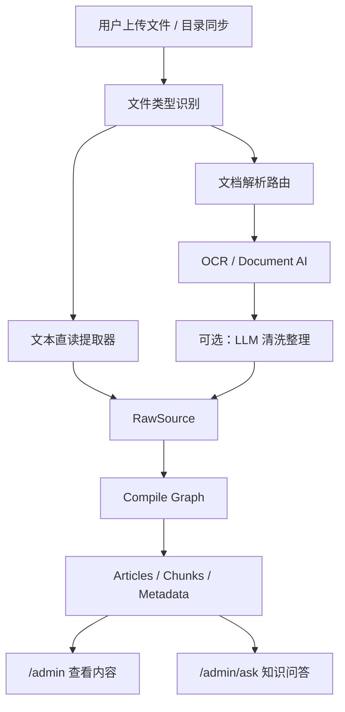

# 文档解析与 OCR 接入技术方案

> 版本：v1.0  
> 日期：2026-04-19  
> 状态：已确认的技术方案基线  
> 适用范围：Lattice 管理后台、文件导入链路、知识编译链路

---

## 1. 背景

当前项目已经完成了下面几项关键产品收口：

- 普通用户页与内部 AI 接入页已经拆分
- `/admin` 只保留上传、处理状态、内容浏览
- `/admin/ask` 只保留知识问答
- `/admin/ai` 只保留连接、模型、角色绑定

但随着导入能力继续往前走，新的问题已经非常明确：

- 普通用户不应该看到 LLM、OCR、价格、备注、JSON 这类配置噪音
- 知识库需要支持 `.doc`、图片、扫描 PDF 等更复杂的资料导入
- 如果目标是“识别效果优先”，图片和扫描件不能再停留在“占位采集”
- `Google Document AI`、腾讯云 OCR、阿里云 OCR 这类能力，本质上属于文档解析，不属于通用 LLM 配置

因此，这次方案的核心不是再扩张 Agent 角色，而是把“文档解析”从“模型配置”里清晰拆出来。

---

## 2. 已确认的产品与架构结论

本轮讨论已经确认如下结论，后续实现以此为准：

| 主题 | 确认结论 |
| --- | --- |
| 普通用户页 | 不展示 LLM 配置，不展示 OCR 配置 |
| 内部配置页 | 继续保留 `/admin/ai`，但内部拆分出独立的文档解析配置 |
| LLM 配置 | 保留连接、模型、角色绑定，用于知识编译与知识问答 |
| OCR / 文档解析 | 新增独立配置，不混入 Agent 角色体系 |
| Agent 角色 | 仍保留 `compile` 与 `query` 两条链路的角色绑定能力 |
| Google Document AI | 归类为“文档解析能力”，不归类为 LLM |
| 图片 / 扫描件主方案 | 优先走 OCR / Document AI，再交给 LLM 做后处理 |
| 多模态大模型 | 可以作为补充能力，但不作为 V1 主 OCR 方案 |
| 当前阶段知识库形态 | 前期只有一个知识库，保持单库心智，不做多租复杂化 |

一句话概括：

`文档解析` 负责“把文件看懂”，`LLM` 负责“把识别结果整理、编译、问答”。

---

## 3. 当前现状与缺口

结合当前仓库实现，现状如下：

### 3.1 已有能力

- 文本文件可直接读取
- `pdf`、`docx`、`pptx`、`xlsx`、`xls` 已有直读提取器
- LLM 配置中心已具备连接、模型、角色绑定与运行时快照冻结能力
- `/admin`、`/admin/ask`、`/admin/ai` 三页已完成用户页与内部页拆分

### 3.2 当前缺口

- `.doc` 还未纳入导入白名单
- 图片文件当前只是“占位采集”，并没有真正 OCR
- 扫描型 PDF 还没有“文本提取失败后自动转 OCR”的分支
- 系统还没有独立的 OCR / 文档解析配置模块
- 用户上传后虽然能看到处理记录，但无法清楚区分“文本直读”还是“OCR 识别”

### 3.3 当前代码事实

当前实现里，`IngestNode` 的支持情况是：

- 文本直读：`md`、`txt`、`yaml`、`json`、`java`、`html` 等
- 文档直读：`pdf`、`xlsx`、`xls`、`docx`、`pptx`
- 图片类：`png`、`jpg`、`jpeg`、`gif`、`svg`、`drawio`

但图片类实际走的是占位逻辑，不是 OCR。当前内容大致等价于：

- 只保存一段类似 `[Image file: xxx]` 的占位文本

这意味着“图片可上传”不等于“图片可识别入库”。

---

## 4. 总体设计目标

本方案的目标不是把后台做成一个大而全 AI 平台，而是在保持单项目、单知识库、低心智负担的前提下，把导入能力做完整。

### 4.1 产品目标

- 普通用户导入资料后，能立刻看懂系统正在处理什么
- 普通用户不需要理解 LLM、OCR、Provider、温度、超时这些概念
- 内部维护者可以独立配置 LLM 与文档解析能力
- `.doc`、图片、扫描 PDF 可以稳定进入知识编译链路
- 后续可扩展更多 OCR / Document AI 供应商，但 V1 不把页面做重

### 4.2 技术目标

- 保持现有 LLM 配置中心不被 OCR 逻辑污染
- 为 OCR / 文档解析增加独立配置、独立测试连接、独立运行语义
- 不新增“OCR Agent 角色”
- OCR 结果要能以统一 `RawSource` 形式进入现有 compile graph
- 对用户侧展示“解析方式”和“处理状态”，而不暴露底层复杂参数

### 4.3 非目标

下面这些内容不作为本轮 V1 目标：

- 不在用户页开放 OCR 供应商切换
- 不让普通用户逐角色配置模型
- 不把多模态 LLM 当成主 OCR 方案
- 不在当前阶段引入多知识库、多租户、多工作区复杂度
- 不把 OCR 硬塞进 `writer / reviewer / fixer / answer / rewrite` 角色体系

---

## 5. 目标产品结构

推荐继续保持三页心智，但在内部页内新增“文档解析配置”模块。

### 5.1 面向用户的页面

#### `/admin`

保留：

- 上传资料
- 目录同步
- 处理状态
- 已入库内容
- 去问答入口

不出现：

- LLM 连接
- 模型档案
- OCR 供应商
- API Key
- 高级参数

#### `/admin/ask`

保留：

- 输入问题
- 查看回答
- 查看引用来源

不出现：

- LLM 配置
- OCR 配置
- 模型测试

### 5.2 面向内部维护的页面

#### `/admin/ai`

继续保留一个内部页，但建议分成 4 个清晰区块：

1. `连接`
2. `模型`
3. `文档解析`
4. `角色绑定`

这样做的好处是：

- 不需要再开一个新后台页面，避免导航继续膨胀
- 但 OCR / Document AI 已经从 LLM 里独立成块，职责清晰
- 后续如果内部页继续变复杂，再考虑切换成 Tab 结构

---

## 6. 文档解析与 LLM 的职责边界

这是本方案最重要的边界定义。

### 6.1 文档解析负责什么

文档解析负责：

- 图片识字
- 扫描 PDF 识字
- 表格与版面解析
- 文档字段抽取
- 输出可进入知识编译链路的原始文本

典型能力来源：

- 腾讯云 OCR
- 阿里云 OCR
- Google Document AI

### 6.2 LLM 负责什么

LLM 负责：

- 把解析出的文本做清洗、归并、结构化
- 进入现有 `compile -> review -> fix -> persist`
- 在 Query 侧生成回答、审查和润色

### 6.3 为什么不能混在一起

如果把 OCR 混进 LLM 角色绑定，会有三个问题：

- 配置语义混乱，用户分不清“识别文件”和“回答问题”
- Google Document AI 这种能力会被误判成“又一个模型”
- 后续 OCR 供应商切换、故障排查、测试连接都会很难做

因此推荐的边界是：

- `LLM 配置中心`：模型与角色选路
- `文档解析配置`：OCR / Document AI 连接与调用

---

## 7. 目标导入链路

目标链路如下：



其中最关键的一点是：

- 无论文件最初来自文本直读还是 OCR，最终都统一落成 `RawSource`
- `DocumentParseRouter` 在 `SourceSyncWorker` 的预处理阶段调用，不在 compile graph 内部调用
- compile graph 只消费已解析完成的 `RawSource`，不感知图片、扫描 PDF、Office 等文件类型细节

`RawSource` 的目标边界契约建议固定为：

- `RawSource` 是文档解析层输出给编译层的输入 DTO / 工作集元素，不是工作目录描述
- V1 最小字段建议包括：
  - `sourceId`
  - `relativePath`
  - `extractedText`
  - `parseMode`
  - `parseProvider`
  - `contentHash`
  - `metadataJson`

这样 compile graph 不需要知道“这是图片、PDF 还是 Word”，它只消费统一输入。

---

## 8. 文件类型处理策略

### 8.1 V1 推荐处理矩阵

| 文件类型 | V1 处理策略 | 说明 |
| --- | --- | --- |
| `md` `txt` `json` `yaml` `java` `html` 等文本 | 直接读取 | 保持现状 |
| `docx` | 直接提取 | 保持现状 |
| `doc` | 直接提取 | 新增 Apache POI `poi-scratchpad` |
| `xlsx` `xls` | 直接提取 | 保持现状 |
| `pptx` | 直接提取 | 保持现状 |
| 文本型 `pdf` | 先走 PDF 文本提取 | 保持现状 |
| 扫描型 `pdf` | 文本提取失败后转 OCR | 新增分支 |
| `png` `jpg` `jpeg` `bmp` `webp` `tiff` | OCR / 文档解析 | V1 核心新增能力 |
| `gif` | 可选支持 | 仅取首帧或按供应商能力处理 |
| `svg` `drawio` | 暂不走 OCR | 建议后续单独做结构化文本提取，不作为本轮重点 |

### 8.2 扫描 PDF 的判定逻辑

推荐逻辑：

1. 先尝试 PDF 文本提取
2. 如果提取结果为空、极短、乱码明显，判定为“扫描型 PDF”
3. 将 PDF 页面转图片后走 OCR
4. OCR 完成后按统一文本结果进入编译链路

这样可以兼顾：

- 文本型 PDF 的速度
- 扫描件 PDF 的识别效果

---

## 9. 供应商策略

### 9.1 V1 建议支持

V1 建议先支持两类供应商：

- `腾讯云 OCR`
- `阿里云 OCR`

原因：

- 两者都适合当前中文业务场景
- 接入文档成熟
- 用户已经明确接受云 OCR 方案
- 可以给内部维护者保留供应商切换空间

### 9.2 Google Document AI 的定位

`Google Document AI` 也归类在“文档解析”这块，而不是 LLM。

它更适合放在后续扩展位，原因是：

- 它不只是 OCR，而是更强的文档理解能力
- 认证方式和供应商模型与腾讯 / 阿里不完全一致
- 若直接纳入 V1，会明显抬高后台配置复杂度

因此推荐：

- V1：腾讯云 OCR、阿里云 OCR
- V2：预留 Google Document AI 接入能力

### 9.3 多模态大模型的定位

虽然现在很多大模型可以直接看图，但在本项目里建议把它放在补充位，而不是主识别位：

- 主识别仍然走 OCR / Document AI
- 大模型仅用于 OCR 结果清洗、纠错、结构化

这样更稳，也更容易做成本与错误边界控制。

---

## 10. 后台页面设计

### 10.1 文档解析配置的页面原则

内部页里要新增“文档解析”区块，但仍然坚持“少而够用”。

建议展示字段：

- 配置名称
- 服务商
- Base URL
- Endpoint
- 区域
- 凭证
- 是否启用
- 测试连接
- 可选：OCR 后整理模型

不建议展示：

- 价格
- 备注
- 操作人
- 扩展 JSON
- 温度
- timeout
- fallback
- route label

### 10.2 按供应商动态显示字段

建议使用“按供应商切换表单字段”的方式，而不是把所有字段平铺出来。

#### 腾讯云 OCR

建议显示：

- 服务区域
- SecretId
- SecretKey
- Endpoint

#### 阿里云 OCR

建议显示：

- 区域
- AccessKey ID
- AccessKey Secret
- Endpoint

#### Google Document AI（预留）

建议显示：

- Project ID
- Location
- Processor ID
- 服务账号凭证

但由于它不建议纳入 V1，页面层面可以先不展示。

### 10.3 测试连接能力

OCR 配置必须和 LLM 一样提供“测试连接”。

测试应至少覆盖：

- 鉴权是否成功
- Endpoint 是否可达
- 是否能对一段最小样例完成识别

测试结果建议直接展示：

- 供应商
- 请求是否成功
- 耗时
- 摘要结果

---

## 11. 数据模型设计

### 11.1 设计原则

- 不复用 LLM 表去存 OCR 连接
- OCR 使用独立表，避免语义污染
- 不在 UI 暴露 JSON，但允许数据库内部保留少量供应商扩展字段
- 优先复用现有 `source_files.metadata_json` 保存解析结果元数据

### 11.2 新增表建议

#### `document_parse_provider_connections`

用于保存文档解析供应商连接。

建议字段：

| 字段 | 说明 |
| --- | --- |
| `id` | 主键 |
| `connection_code` | 配置编码 |
| `provider_type` | `tencent_ocr` / `aliyun_ocr` / `google_document_ai` |
| `base_url` | 基础地址 |
| `endpoint_path` | 接口路径 |
| `credential_ciphertext` | 加密后的凭证内容 |
| `credential_mask` | 脱敏展示值 |
| `extra_config_json` | 极少量供应商扩展配置 |
| `enabled` | 是否启用 |
| `created_by` / `updated_by` | 审计字段 |
| `created_at` / `updated_at` | 时间字段 |

说明：

- 凭证建议整体序列化后再加密，而不是在表里拆很多 Secret 字段
- UI 层依然只展示供应商对应的几个必要输入框

#### `document_parse_settings`

用于保存全局文档解析设置。

建议字段：

| 字段 | 说明 |
| --- | --- |
| `id` | 主键 |
| `config_scope` | 当前固定 `default` |
| `default_connection_id` | 默认使用的文档解析连接 |
| `image_ocr_enabled` | 是否启用图片 OCR |
| `scanned_pdf_ocr_enabled` | 是否启用扫描 PDF OCR |
| `cleanup_enabled` | 是否启用 OCR 后整理 |
| `cleanup_model_profile_id` | 可选的后整理模型 |
| `created_by` / `updated_by` | 审计字段 |
| `created_at` / `updated_at` | 时间字段 |

说明：

- 当前阶段只有一个知识库，因此全局单配置最合适
- 不需要在 V1 做多场景、多工作区、多供应商路由

### 11.3 复用现有表

`source_files.metadata_json` 建议记录文件解析结果，例如：

```json
{
  "parseMode": "ocr_image",
  "parseProvider": "tencent_ocr",
  "pageCount": 2,
  "ocrApplied": true,
  "cleanupApplied": false
}
```

补充约束：

- 这里只记录解析方式、页数、供应商、是否做过清洗等解析元数据
- 不在解析元数据中写入用户本地绝对路径或服务器物理路径
- 来源路径、上传来源、Git 导出位置等信息应由资料源模块负责记录，不由文档解析模块承担

这样做的好处是：

- 不必为了 V1 新增一张解析结果明细表
- 用户页能基于这些元数据展示“文本直读 / OCR 识别”
- 失败排查也能看到文件级解析信息

---

## 12. 后端模块设计

建议新建独立模块：

```text
com/xbk/lattice/documentparse/
├── domain/
├── service/
└── infra/
```

### 12.1 建议的核心职责

#### `documentparse/domain`

- `DocumentParseProviderConnection`
- `DocumentParseSettings`
- `DocumentParseResult`
- `DocumentParseMode`

#### `documentparse/service`

- `DocumentParseAdminService`
- `DocumentParseRouter`
- `DocumentParseConnectionProbeService`
- `DocumentParseResultNormalizer`

#### `documentparse/infra`

- `TencentOcrClient`
- `AliyunOcrClient`
- `JdbcDocumentParseConnectionRepository`
- `JdbcDocumentParseSettingsRepository`

### 12.2 与现有编译链路的集成方式

推荐采用“预编译解析”路线：`DocumentParseRouter` 在 `SourceSyncWorker` 的预处理阶段被调用，而不是在 compile graph 内部调用。

目标调用方式：

1. `SourceSyncWorker` 的预处理阶段扫描 staging / materialized 工作目录
2. 根据文件类型交给 `DocumentParseRouter`
3. `DocumentParseRouter` 决定：
   - 文本直读
   - Office 提取
   - PDF 文本提取
   - PDF 转 OCR
   - 图片 OCR
4. 最终统一产出 `RawSource`
5. compile graph 接收 `RawSource` 工作集继续编译，`IngestNode` 不再承担按文件类型做解析路由的职责

这样后续新增供应商时，不需要继续把复杂判断堆进 `IngestNode`，也能避免 OCR 超时直接拉长 compile graph 节点执行时间

---

## 13. `.doc` 支持设计

`.doc` 不属于 OCR，它属于传统 Office 文档直读能力。

### 13.1 实现建议

- 在 `pom.xml` 增加 `org.apache.poi:poi-scratchpad`
- 增加 `LegacyWordTextExtractor` 或扩展现有 `WordTextExtractor`
- 在导入白名单与前端 `accept` 中加入 `.doc`

### 13.2 运行语义

`.doc` 走的是：

- 文件直读
- 不是 OCR
- 不需要文档解析供应商

因此 `.doc` 的支持应和图片 OCR 分开实现，但可以一起作为“导入能力补齐”收口。

---

## 14. 运行状态与用户体验

为了让用户上传后“看得懂”，建议补充文件级解释，而不是只给任务级状态。

### 14.1 用户应该看到什么

上传完成后，用户页至少应能看到：

- 刚刚上传了哪些文件
- 每个文件当前状态
- 每个文件走的是哪种解析方式
- 哪些已入库成功
- 哪些失败，以及失败原因

### 14.2 建议的文件级展示文案

解析方式建议统一用中文展示：

- `文本直读`
- `OCR 识别`
- `扫描件 OCR`
- `暂不支持`

任务状态建议统一用中文展示：

- `已提交`
- `解析中`
- `编译中`
- `已入库`
- `部分失败`
- `失败`

### 14.3 为什么这很重要

这比展示一堆内部步骤名更符合普通用户心智。

用户真正关心的是：

- 我刚刚传的文件有没有被认出来
- 它有没有真正进知识库
- 失败到底是文件问题还是系统问题

---

## 15. 接口设计建议

### 15.1 后台管理接口

建议新增：

- `GET /api/v1/admin/document-parse/connections`
- `POST /api/v1/admin/document-parse/connections`
- `PUT /api/v1/admin/document-parse/connections/{id}`
- `DELETE /api/v1/admin/document-parse/connections/{id}`
- `POST /api/v1/admin/document-parse/connections/test`
- `GET /api/v1/admin/document-parse/settings`
- `PUT /api/v1/admin/document-parse/settings`

### 15.2 设计原则

- 与现有 `/api/v1/admin/llm/**` 风格保持一致
- 不对普通用户页暴露这些接口入口
- 文档解析测试接口与 LLM 测试接口相互独立

---

## 16. 安全与配置约束

### 16.1 密钥处理

OCR 供应商密钥应沿用当前 LLM 配置中心的思路：

- 明文只在提交时出现一次
- 数据库存密文
- 页面列表只显示脱敏值
- 更新时允许留空表示“不修改”

### 16.2 调用限制

建议在服务端统一控制：

- 单文件大小上限
- 单次上传文件数量上限
- OCR 超时与重试
- 单次扫描 PDF 最大页数

这些限制应写在配置文件或服务端默认值里，不应让用户在页面自由调参。

### 16.3 成本控制

OCR 通常按页或按次计费，因此建议默认：

- 文本能直读就不走 OCR
- PDF 优先尝试文本提取
- 只有识别到扫描件时才触发 OCR

---

## 17. 分阶段实施建议

### 阶段一：方案与配置层落地

目标：

- 新增文档解析配置的数据模型
- 新增后台管理接口
- `/admin/ai` 增加“文档解析”区块
- 增加 OCR 测试连接能力

验收标准：

- 内部页可配置至少一个 OCR 供应商
- 可完成连接测试
- 普通用户页仍然不暴露 OCR 配置

### 阶段二：导入能力补齐

目标：

- 支持 `.doc`
- 支持图片 OCR
- 支持扫描 PDF 转 OCR
- 将结果统一进入 `RawSource`

验收标准：

- `.doc` 可导入并产出正文
- `png/jpg/jpeg` 可识别为文本，并生成符合 `RawSource` 契约的解析结果；通过组件级编译夹具验证可入库
- 扫描 PDF 不再只返回空内容

实施说明：

- 本阶段默认采用组件级验收，不要求 `SourceSyncWorker` 已经落地。
- 为保持目标架构稳定，本阶段不引入“临时由 `IngestNode` 调用 `DocumentParseRouter`”的过渡写法。
- `DocumentParseRouter` 的正式调用位置仍固定为后续 `SourceSyncWorker` 的预处理阶段。

### 阶段三：用户体验收口

目标：

- 在上传结果里展示文件级解析方式与状态
- 在用户页更明确区分“解析中 / 编译中 / 已入库”

验收标准：

- 用户上传后能明确看到每个文件的处理结果
- 能区分文本直读与 OCR 识别

### 阶段四：增强能力

可选增强：

- OCR 后整理模型
- Google Document AI 接入
- `svg` / `drawio` 的结构化文本提取
- 更细的表格 / 字段抽取结果展示

---

## 18. 最终推荐方案

如果只保留一版最克制、最适合当前项目阶段的落地方案，建议如下：

### 18.1 页面结构

- `/admin`：用户导入与内容管理
- `/admin/ask`：用户知识问答
- `/admin/ai`：内部维护，包含连接、模型、文档解析、角色绑定

### 18.2 能力结构

- `LLM 配置`：负责编译、审查、修复、问答、润色
- `文档解析配置`：负责图片、扫描 PDF、复杂文档识别
- `角色绑定`：继续只管理 `compile/query` 两条链路，不引入 OCR Agent

### 18.3 文件处理策略

- `.doc`：直读
- 图片：OCR
- 扫描 PDF：OCR
- 普通 PDF：优先直读
- 多模态 LLM：只做可选后整理，不做主 OCR

### 18.4 供应商策略

- V1：腾讯云 OCR、阿里云 OCR
- V2：Google Document AI

---

## 19. 结论

这次方案的本质，不是“再给系统加一个模型入口”，而是把知识库导入链路补成一个完整闭环：

- 用户页足够简单
- 内部页职责清楚
- OCR 与 LLM 分层明确
- `.doc`、图片、扫描件都有合理归属
- 后续还能继续扩展而不把后台做乱

最终建议坚持这条主线：

`文件上传 -> 文档解析 -> 知识编译 -> 知识入库 -> 知识问答`

其中：

- 文档解析解决“文件怎么看懂”
- LLM 解决“识别结果怎么变成高质量知识”

这也是当前项目最合适、最稳的一条演进路线。
