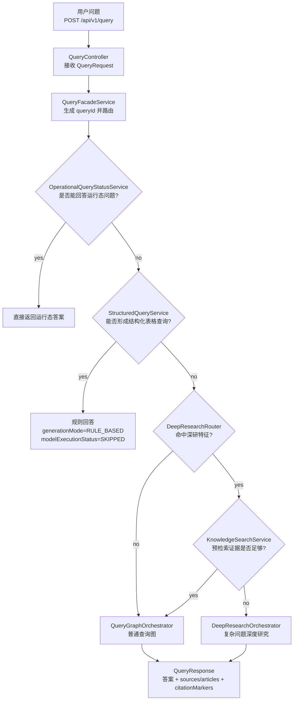
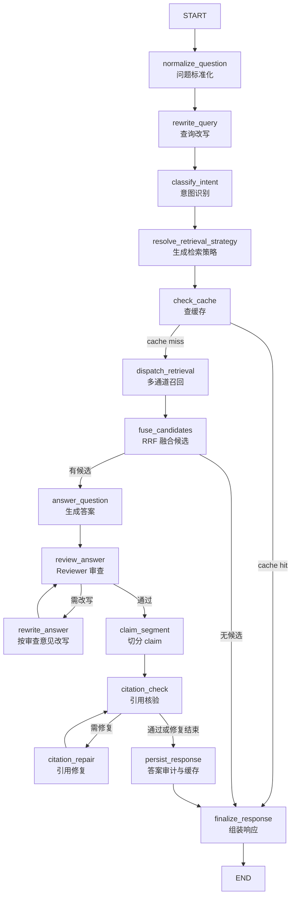
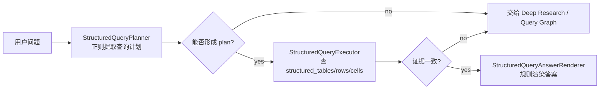
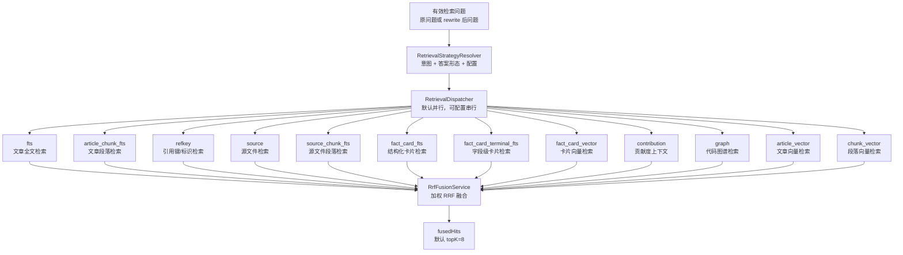
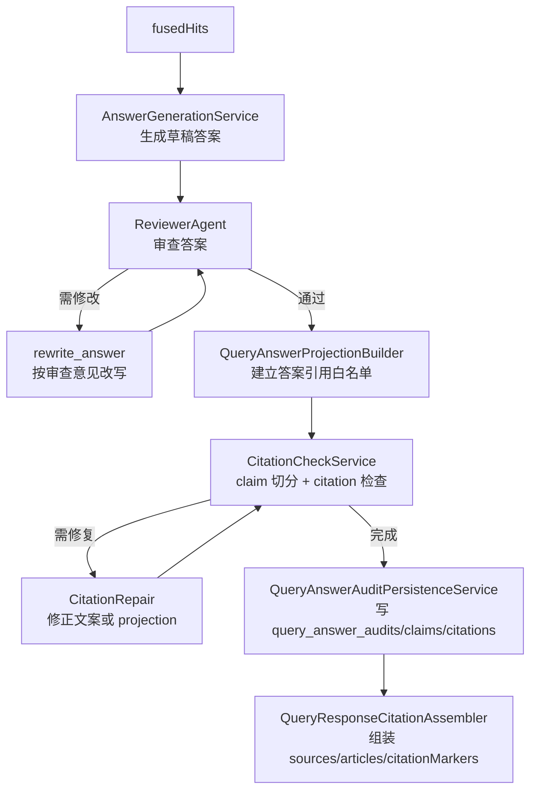
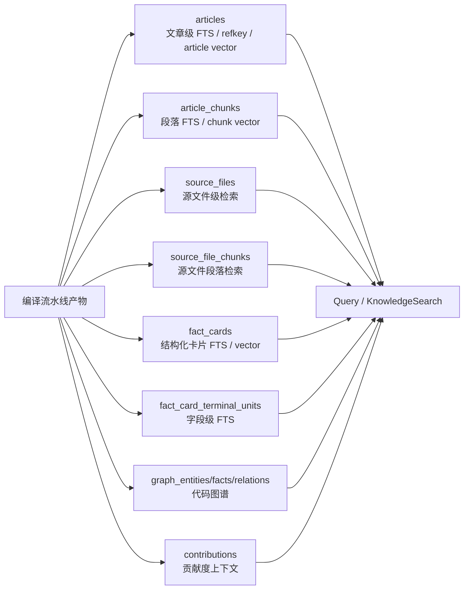

# Lattice 查询检索流水线

## 概述

查询检索流水线负责把用户问题变成可核验答案。它读取编译流水线产出的 `articles`、`article_chunks`、`source_files`、`source_file_chunks`、`fact_cards`、`fact_card_terminal_units`、代码图谱与向量索引，再通过普通 Query Graph 或 Deep Research 返回答案。编译物料来源见 [`编译流水线.md`](./编译流水线.md)，复杂问题升级路径见 [`Deep-Research流水线.md`](./Deep-Research流水线.md)。

### 用大白话说

用户问一句话后，系统不会只搜一张表。它先判断能不能用确定性规则直接回答；不能的话，再同时查文章、文章段落、源文件、源文件段落、Fact Card、Terminal Unit、代码图谱、Contribution 和向量索引。多路结果用加权 RRF 融合，交给 LLM 生成答案，再由 Reviewer、Citation Check 和 Repair 确保答案尽量可复核。

### 新手阅读路径

1. 先看“入口总览”，理解一个请求会不会进入普通 Query Graph。
2. 再看“12 个检索通道”，理解为什么同一个问题会查多张表。
3. 最后看“回答、审查与引用”，理解为什么答案生成后还要再审和修引用。

---

## 一、入口总览

HTTP 入口是 `QueryController`，核心门面是 `QueryFacadeService`。并不是所有请求都会进入 Query Graph。



**路由顺序：**

| 顺序 | 组件 | 作用 | 命中后是否继续 |
|---|---|---|---|
| 1 | `OperationalQueryStatusService` | 回答运行态/系统状态类问题 | 否，直接返回 |
| 2 | `StructuredQueryService` | 对 `structured_tables/rows/cells` 做确定性表格查询 | 否，直接返回 |
| 3 | `DeepResearchRouter` + 预检索 | 判断是否升级到 Deep Research | 证据不足才升级 |
| 4 | `QueryGraphOrchestrator` | 普通问答主链 | 是，进入 Query Graph |

**Deep Research 不是只靠关键词触发：**

- `forceSimple=true`：不走 Deep Research。
- `forceDeep=true`：跳过预检索，强制 Deep Research。
- 普通自动路由：先命中复杂问题特征，再用 `KnowledgeSearchService.search(question, 6)` 预检索；如果相关命中数不少于 2，或最强相关命中分数不少于 10，仍走普通 Query Graph。

---

## 二、Query Graph 主链

普通查询图使用 Spring AI Alibaba `StateGraph`，定义在 `QueryGraphDefinitionFactory`。当前源码是 **15 个节点、4 处条件分支、2 个循环**。



### 节点对照表

| 节点 | 核心实现 | 读写的关键状态 |
|---|---|---|
| `normalize_question` | `QueryGraphAnswerSupport.normalizeQuestion` | 原始问题、标准化问题、LLM scope |
| `rewrite_query` | `QueryRewriteService.rewrite` | 改写后检索问题、改写审计引用 |
| `classify_intent` | `QueryIntentClassifier`、`AnswerShapeClassifier` | `QueryIntent`、`AnswerShape` |
| `resolve_retrieval_strategy` | `RetrievalStrategyResolver.resolve` | 通道权重、启停策略、RRF K |
| `check_cache` | `QueryCacheStore` | 缓存命中响应 |
| `dispatch_retrieval` | `RetrievalDispatcher` | 各通道 hits、通道运行摘要 |
| `fuse_candidates` | `RrfFusionService.fuse` | fused hits、检索审计 |
| `answer_question` | `AnswerGenerationService.generatePayload` | 草稿答案、生成模式、答案 outcome |
| `review_answer` | `ReviewerAgent.review` | 审查状态、审查问题 |
| `rewrite_answer` | `AnswerGenerationService.rewriteFromReviewPayload` | 改写后的草稿答案 |
| `claim_segment` | `CitationCheckService.check` | claim segments、答案投影包 |
| `citation_check` | `CitationCheckService.check` | citation report |
| `citation_repair` | `CitationCheckService.repair` | 修复后的答案与 projection |
| `persist_response` | `QueryAnswerAuditPersistenceService`、`QueryCacheStore` | 答案审计、最终响应、缓存 |
| `finalize_response` | `QueryFinalizationGraphFragment` | 最终 `QueryResponse` |

---

## 三、结构化查询短路

结构化查询在 Query Graph 之前执行，目标是回答编译阶段从表格文件展开出的结构化数据问题。



| 查询类型 | 触发来源 | 数据表 | 返回特征 |
|---|---|---|---|
| `ROW_LOOKUP` | 识别 `字段=值` 过滤条件 | `structured_table_rows`、`structured_table_cells` | 返回匹配行和投影字段 |
| `COUNT` | 识别 count/数量类问题 | 同上 | 无命中也可返回 count 结果 |
| `GROUP_BY` | 识别“按/按照/以某字段统计” | 同上 | 返回每个分组的数量 |
| `ROW_COMPARE` | 识别两个过滤对象和差异字段 | 同上 | 至少需要两行证据 |

结构化查询命中后返回：

| 字段 | 值 |
|---|---|
| `generationMode` | `RULE_BASED` |
| `modelExecutionStatus` | `SKIPPED` |
| `fallbackReason` | `STRUCTURED_QUERY` |
| `articles` | 空列表 |
| `sources` | 结构化证据来源 |

---

## 四、检索核心：12 个通道

普通 Query Graph 和 `KnowledgeSearchService` 使用同一组固定顺序通道。区别是：Query Graph 后面会生成答案；`KnowledgeSearchService` 只返回融合后的命中，供 Deep Research 预检索、任务检索和治理侧使用。



### 通道表

| 通道 | 分组 | 实现类 | 主要表/索引 | 证据类型 | 说明 |
|---|---|---|---|---|---|
| `fts` | lexical | `FtsSearchService` | `articles.search_tsv` | `ARTICLE` | 文章级 PostgreSQL FTS，只取 `review_status='passed'` 且 `lifecycle='ACTIVE'` |
| `article_chunk_fts` | lexical | `ArticleChunkFtsSearchService` | `article_chunks.search_tsv` | `ARTICLE` | 段落级 FTS + LIKE 加分，返回可定位到 section anchor 的文章证据 |
| `refkey` | lexical | `RefKeySearchService` | `articles.refkey_text/concept_id/title/metadata_json` | `ARTICLE` | 适合精确标识、引用键、配置 key |
| `source` | source | `SourceSearchService` | `source_files` | `SOURCE` | 文件级源资料检索 |
| `source_chunk_fts` | source | `SourceChunkFtsSearchService` | `source_file_chunks` | `SOURCE` | 源文件段落检索，并扩展相邻 chunk |
| `fact_card_fts` | fact_card | `FactCardFtsSearchService` | `fact_cards.search_tsv` | `FACT_CARD` | 结构化卡片检索，受 Fact Card 审查策略约束 |
| `fact_card_terminal_fts` | fact_card | `FactCardTerminalUnitFtsSearchService` | `fact_card_terminal_units.search_tsv` | `FACT_CARD` | 字段级 key-value 检索，先放大候选再做意图 rerank |
| `fact_card_vector` | vector | `FactCardVectorSearchService` | `fact_card_vector_index` | `FACT_CARD` | Fact Card 向量检索；向量总开关、模型维度和索引存在性都满足才可用 |
| `contribution` | graph | `ContributionSearchService` | `contributions` | `CONTRIBUTION` | 贡献度/变更上下文检索 |
| `graph` | graph | `GraphSearchService` | `graph_entities`、`graph_facts`、`graph_relations` | `GRAPH` | 代码实体、属性、关系检索 |
| `article_vector` | vector | `VectorSearchService` | `article_vector_index` | `ARTICLE` | 文章级 pgvector 近邻检索 |
| `chunk_vector` | vector | `ChunkVectorSearchService` | `article_chunk_vector_index` | `ARTICLE` | 段落向量检索后聚合回文章命中 |

### 调度规则

| 规则 | 源码行为 |
|---|---|
| 默认并行 | `QueryRetrievalSettingsState.parallelEnabled=true` |
| 最大并发 | `QuerySearchProperties.RetrievalDispatchProperties.maxConcurrency=4` |
| 同组最大并发 | `maxConcurrencyPerGroup=2` |
| 单通道超时 | `channelTimeoutMillis=8000` 毫秒 |
| 总截止时间 | `totalDeadlineMillis=12000` 毫秒 |
| 失败隔离 | 单通道异常、超时、取消只让该通道返回空，不拖垮整次检索 |
| 禁用通道 | 权重为 0 或策略关闭时记录 `channel_disabled` |

---

## 五、策略与权重

`RetrievalStrategyResolver` 把运行时配置、问题意图和答案形态合成单次查询的通道策略。

### 默认权重

| 通道 | 默认权重 |
|---|---:|
| `fts` | 1.00 |
| `article_chunk_fts` | 1.25 |
| `refkey` | 1.45 |
| `source` | 1.00 |
| `source_chunk_fts` | 1.30 |
| `fact_card_fts` | 1.40 |
| `fact_card_terminal_fts` | 1.40 |
| `fact_card_vector` | 1.40 |
| `contribution` | 1.00 |
| `graph` | 1.20 |
| `article_vector` | 1.00 |
| `chunk_vector` | 1.35 |

默认 `rrfK=60`，默认启用 query rewrite，默认启用“意图感知向量通道”。

### 动态调整规则

| 信号 | 主要影响 |
|---|---|
| `CODE_STRUCTURE` | 提升 `graph`、`source`、`source_chunk_fts`，降低泛文章 lexical |
| `CONFIGURATION` | 提升 `refkey`、`source_chunk_fts`、`fact_card_terminal_fts`，降低泛文章 lexical |
| `TROUBLESHOOTING` | 提升 `contribution`、`source_chunk_fts`、`article_chunk_fts`、`graph` |
| `ARCHITECTURE` | 提升 `graph`、`article_vector`、`chunk_vector`、`article_chunk_fts` |
| 结构化答案形态 | 提升 Fact Card、Terminal Unit、Source Chunk；压低背景文章和向量 |
| 精确标识查值 | 提升 `refkey/source/source_chunk/fact_card`；必要时关闭图谱和向量背景通道 |
| 语义泛化题 | 对 `article_chunk_fts/article_vector/chunk_vector` 做受控提升 |

向量检索还有全局开关：`lattice.query.search.vector.enabled` 默认是 `false`。即使通道权重大于 0，向量服务不可用、索引不存在或 embedding 维度不匹配时，该通道也不会提供有效命中。

---

## 六、融合与补强

### RRF 怎么排

`RrfFusionService` 对每个通道的排名做加权 RRF：

```text
单通道贡献 = channelWeight / (rrfK + rank)
```

同一条证据在多个通道出现时会合并分数。普通 Query Graph 的候选上限是：

| 常量 | 值 | 含义 |
|---|---:|---|
| `RETRIEVAL_CANDIDATE_LIMIT` | 16 | 每个通道的候选数 |
| `TOP_K` | 8 | 融合后进入生成上下文的默认数量 |
| `EXACT_LOOKUP_SUPPORT_LIMIT` | 6 | 精确查值补强候选上限 |
| `EXACT_LOOKUP_CONTEXT_LIMIT` | 16 | 精确查值补强后的上下文上限 |

### 为什么 Fact Card 不容易被文章挤掉

当答案形态属于 `ENUM`、`COMPARE`、`SEQUENCE`、`STATUS`、`POLICY`，或 fused hits 中已经有强相关直接证据时，`RrfFusionService` 会启用结构化证据保护：优先保留 Fact Card、Terminal Unit、Source Chunk 这类可直接核验的主证据，避免长文章概述抢占 topK。

### 精确查值补强

`QueryGraphRetrievalSupport.enrichExactLookupSupportHits` 会对精确查值题额外补入 `source_chunk_fts`、`source`、`refkey` 中更直接的证据。这样用户问某个配置值、URL、状态、字段名时，生成上下文不会只剩背景文章。

---

## 七、回答、审查与引用

检索只解决“找到证据”，最终答案还要走生成、审查、引用核验和持久化。



### 无证据时怎么返回

如果 `fuse_candidates` 后没有 fused hits，`finalize_response` 返回确定性响应：

| 字段 | 值 |
|---|---|
| `answer` | `当前未找到与该问题直接相关的知识。` |
| `answerOutcome` | `NO_RELEVANT_KNOWLEDGE` |
| `generationMode` | `RULE_BASED` |
| `modelExecutionStatus` | `SKIPPED` |

### 引用修复的边界

Citation repair 会在引用质量不足时尝试修复答案和 projection。若答案原本是正常 LLM 生成或规则生成，repair 去掉坏引用后不代表答案正文一定无效；只有在特定非正常生成模式且 repair 已耗尽时，才会降级到 deterministic fallback。

---

## 八、与编译物料的对应关系



| 编译产物 | 查询侧使用方式 |
|---|---|
| `articles` | 文章 FTS、refkey、文章向量、最终 `articles` 引用 |
| `article_chunks` | 段落 FTS、段落向量、精确段落证据 |
| `source_files` | 文件级源资料检索 |
| `source_file_chunks` | 源文件段落检索和邻近 chunk 扩展 |
| `structured_tables/rows/cells` | 结构化查询短路 |
| `fact_cards` | 结构化卡片 FTS、Fact Card 向量 |
| `fact_card_terminal_units` | 单字段 key-value 检索 |
| `graph_entities/facts/relations` | 代码结构和关系检索 |
| `contributions` | 贡献度/变化上下文检索 |

---

## 九、关键源码索引

| 主题 | 源码 |
|---|---|
| HTTP 入口 | `src/main/java/com/xbk/lattice/api/query/QueryController.java` |
| 总路由 | `src/main/java/com/xbk/lattice/query/service/QueryFacadeService.java` |
| 普通 Query Graph | `src/main/java/com/xbk/lattice/query/graph/QueryGraphDefinitionFactory.java` |
| Query Graph 节点实现 | `QueryGraphAnswerSupport`、`QueryGraphRetrievalSupport`、`QueryFinalizationGraphFragment` |
| 多通道检索 | `src/main/java/com/xbk/lattice/query/service/RetrievalDispatcher.java` |
| 检索策略 | `src/main/java/com/xbk/lattice/query/service/RetrievalStrategyResolver.java` |
| RRF 融合 | `src/main/java/com/xbk/lattice/query/service/RrfFusionService.java` |
| 不生成答案的检索 | `src/main/java/com/xbk/lattice/query/service/KnowledgeSearchService.java` |
| 结构化查询 | `src/main/java/com/xbk/lattice/query/structured/*` |
| Deep Research 路由 | `src/main/java/com/xbk/lattice/query/deepresearch/service/DeepResearchRouter.java` |
| Deep Research 编排 | `src/main/java/com/xbk/lattice/query/service/DeepResearchOrchestrator.java` |
