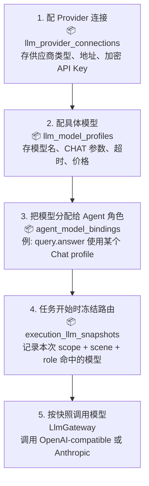
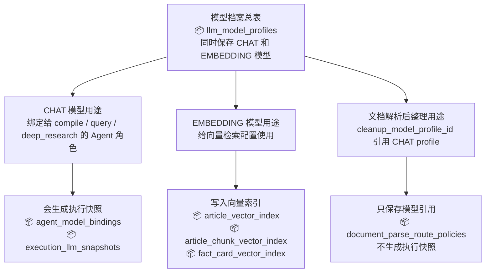
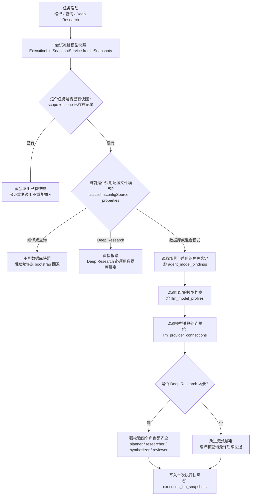
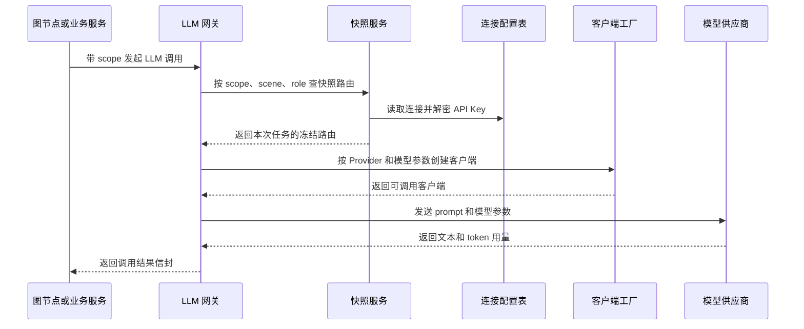
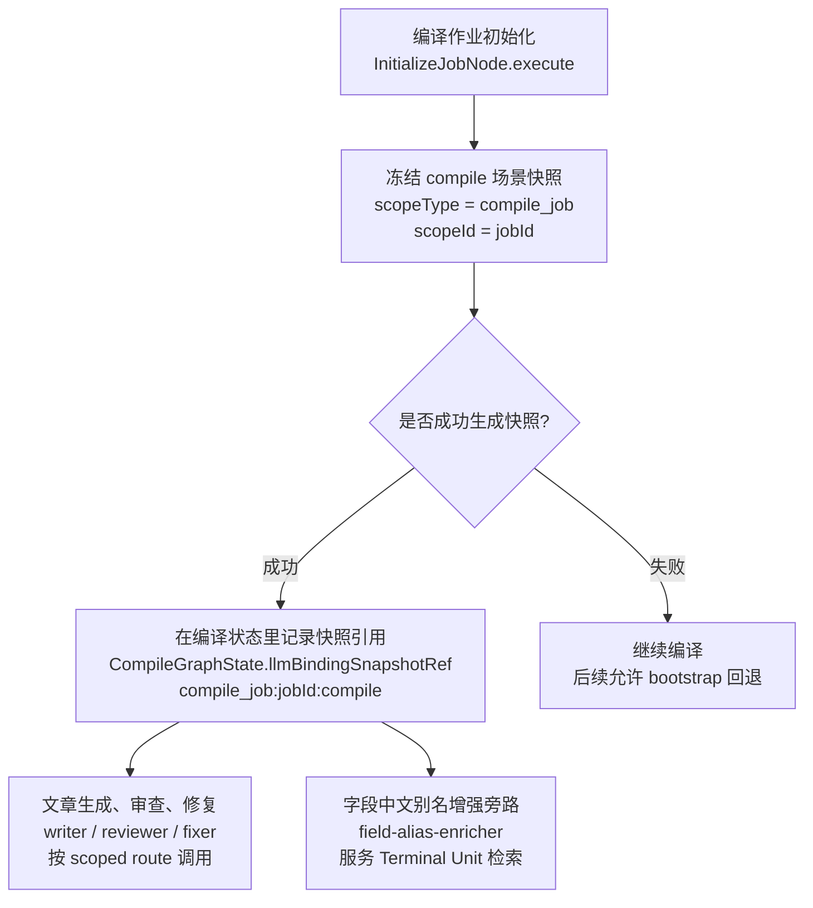
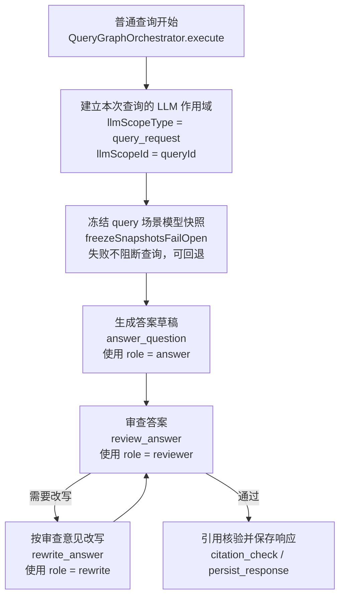
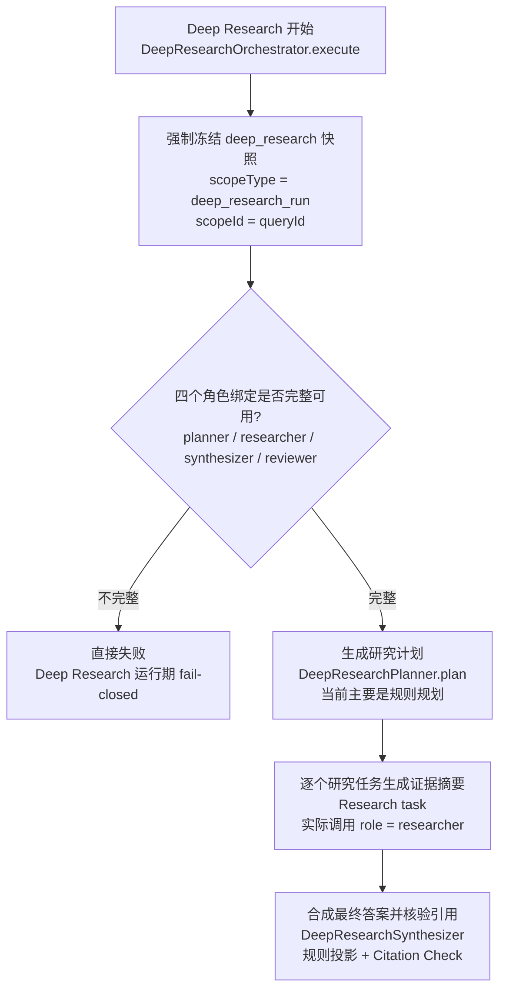
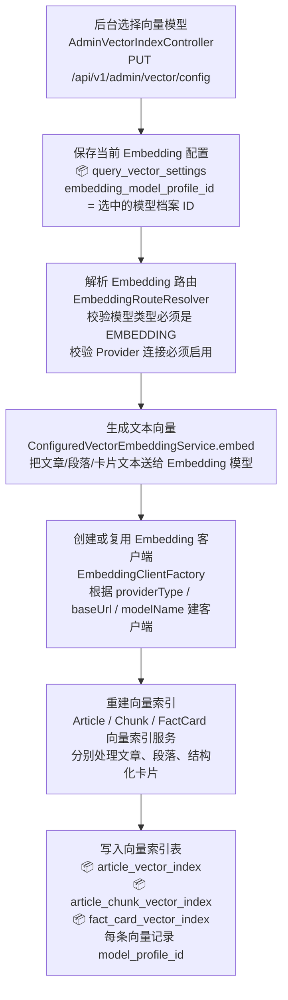

# Lattice 模型中心与执行快照

## 概述

模型中心与执行快照是编译、查询、Deep Research 共用的横切能力。它不产出知识物料，也不负责检索排序；它只回答一个问题：**这次执行里的某个 Agent 角色，实际调用哪个 Provider、哪个模型、哪些参数。**

编译主链见 [`编译流水线.md`](./编译流水线.md)，普通问答主链见 [`查询检索流水线.md`](./查询检索流水线.md)，复杂问题分支见 [`Deep-Research流水线.md`](./Deep-Research流水线.md)。具体怎么配置连接、模型和绑定，见 [`模型绑定配置参考.md`](./模型绑定配置参考.md)。

### 用大白话说

模型中心像一张“模型排班表”：`compile.writer` 用哪个模型、`query.answer` 用哪个模型、`deep_research.researcher` 用哪个模型，都在这里配。

执行快照像“开工前拍照”：一次编译、一次查询或一次 Deep Research 开始时，系统把当时命中的模型绑定、模型参数和 Provider 地址冻结下来。后续这次执行都按这张快照走，避免运行中后台改了模型配置，导致同一个任务前后调用不一致。

---

## 一、核心关系总览

### 1.1 Chat Agent 主链

编译、查询、Deep Research 里真正调用 Chat 模型时，走的是这条链路：

这张图只描述 **Chat Agent 调用主链**。它的关键点是：后台先配连接和模型，再把模型绑定到某个场景角色；任务开始后，绑定会被冻结成执行快照；真正调用模型时，`LlmGateway` 按快照走。

### 1.2 两个旁路

下面两类也会引用 `llm_model_profiles`，但它们**不走** `agent_model_bindings -> execution_llm_snapshots` 这条 Chat Agent 快照链。

### 四层对象

| 层 | 表 / 服务 | 解决什么问题 | 是否运行时冻结 |
|---|---|---|---|
| Provider 连接 | `llm_provider_connections` | 供应商类型、baseUrl、API Key、启用状态 | 部分冻结；API Key 不写入快照 |
| 模型档案 | `llm_model_profiles` | 模型名、CHAT/EMBEDDING、温度、token、超时、价格、向量维度 | Chat 角色会冻结到快照 |
| Agent 绑定 | `agent_model_bindings` | `scene + agent_role` 绑定到哪个 Chat 模型 | 会冻结绑定 ID 与路由标签 |
| 执行快照 | `execution_llm_snapshots` | 某次执行实际命中的路由 | 本身就是运行态冻结结果 |

`llm_model_profiles` 同时容纳 CHAT 和 EMBEDDING 两类模型。CHAT 模型主要走 `agent_model_bindings -> execution_llm_snapshots`；EMBEDDING 模型主要走 `query_vector_settings` 和向量索引服务，不走执行快照。

---

## 二、模型中心配置层

### 2.1 Provider 连接

`llm_provider_connections` 保存 Provider 连接信息。

| 字段 | 含义 |
|---|---|
| `connection_code` | 后台可读的连接编码 |
| `provider_type` | `openai` / `openai_compatible` / `anthropic` |
| `base_url` | Provider 基础地址 |
| `api_key_ciphertext` | 加密后的 API Key |
| `api_key_mask` | 脱敏展示值 |
| `enabled` | 是否启用 |

API Key 由 `LlmSecretCryptoService` 加密保存。执行快照只保存 `connection_id`、`provider_type` 和 `base_url`，不保存明文 API Key。

### 2.2 模型档案

`llm_model_profiles` 描述一个可调用模型。

| 字段 | CHAT 用法 | EMBEDDING 用法 |
|---|---|---|
| `model_name` | 传给 Chat Provider 的模型名 | 传给 Embedding Provider 的模型名 |
| `model_kind` | `CHAT` | `EMBEDDING` |
| `temperature` / `max_tokens` | 生成参数 | 不使用 |
| `timeout_seconds` | 可覆盖角色默认超时 | Embedding 调用超时 |
| `expected_dimensions` | 不允许填写 | 必须匹配向量维度 |
| `supports_dimension_override` | 不使用 | 是否支持维度覆盖 |
| `input_price_per_1k_tokens` / `output_price_per_1k_tokens` | 用于调用成本估算 | 当前主要服务 Chat 成本估算 |
| `extra_options_json` | Provider 扩展参数，如 top_p/top_k/response_format 辅助参数 | Provider 扩展参数 |

共享同一个 Chat profile 给多个角色时，`timeout_seconds` 要谨慎填写。它优先级高于 compile 的 writer/reviewer/fixer 角色默认超时，会影响所有命中该 profile 的角色。

### 2.3 Agent 绑定

`agent_model_bindings` 用 `scene + agent_role` 绑定一个 Chat 模型。

| Scene | 角色 | 用途 |
|---|---|---|
| `compile` | `writer` | 编译阶段写文章 |
| `compile` | `reviewer` | 编译阶段审查文章；审查关闭时可走规则路径 |
| `compile` | `fixer` | 编译阶段按审查意见修复文章 |
| `compile` | `field-alias-enricher` | Terminal Unit 英文字段中文检索别名增强旁路 |
| `query` | `answer` | 普通 Query Graph 生成结构化答案 |
| `query` | `reviewer` | 普通 Query Graph 审查答案；失败或关闭时回退本地规则 |
| `query` | `rewrite` | 按 Reviewer 意见改写答案 |
| `deep_research` | `planner` | Deep Research 规划角色契约；当前主链规划主要是规则实现 |
| `deep_research` | `researcher` | Deep Research 单任务证据摘要生成 |
| `deep_research` | `synthesizer` | Deep Research 合成角色契约；当前合成主要是规则投影和引用核验 |
| `deep_research` | `reviewer` | Deep Research 审查角色契约 |

后台角色白名单在 `AdminLlmConfigController.createSceneRoleOptions()`。数据库唯一键是 `(scene, agent_role)`，同一场景同一角色只能有一条绑定。

---

## 三、执行快照层

### 3.1 快照冻结什么

`execution_llm_snapshots` 保存一次执行中某个角色命中的稳定路由。

| 字段 | 含义 |
|---|---|
| `scope_type` / `scope_id` | 执行作用域，例如 `compile_job + jobId` |
| `scene` / `agent_role` | 场景与 Agent 角色 |
| `binding_id` | 命中的 `agent_model_bindings.id` |
| `model_profile_id` | 命中的 `llm_model_profiles.id` |
| `connection_id` | 命中的 `llm_provider_connections.id` |
| `route_label` | 任务内展示与审计用的稳定路由标签 |
| `provider_type` / `base_url` | 快照时的 Provider 类型和地址 |
| `model_name` | 快照时的模型名 |
| `temperature` / `max_tokens` / `timeout_seconds` | 快照时的调用参数 |
| `extra_options_json` | 快照时的 Provider 扩展参数 |
| `input_price_per_1k_tokens` / `output_price_per_1k_tokens` | 快照时的价格，用于成本估算 |
| `snapshot_version` | 快照版本，当前写入 `1` |

快照唯一键是 `(scope_type, scope_id, scene, agent_role)`。同一个任务重复调用冻结逻辑时，如果快照已存在，会直接返回已有快照，不会重复插入。

### 3.2 快照不冻结什么

快照不保存明文 API Key。真正调用时，`ExecutionLlmSnapshotService.resolveRoute()` 会根据快照里的 `connection_id` 读取当前连接记录，再解密 `api_key_ciphertext`。

这意味着：

| 配置项 | 是否被快照冻结 | 影响 |
|---|---|---|
| `provider_type` | 是 | 本次执行稳定 |
| `base_url` | 是 | 本次执行稳定 |
| `model_name` | 是 | 本次执行稳定 |
| `temperature/max_tokens/timeout/extra_options` | 是 | 本次执行稳定 |
| 价格字段 | 是 | 成本估算按快照时价格 |
| API Key 明文 | 否 | 调用时从当前连接解密 |
| 连接记录是否存在 | 否 | 删除连接会影响后续按快照解析路由 |

### 3.3 冻结流程

---

## 四、调用时怎么走到模型

`LlmRouteResolution` 是真正调用前的统一路由对象。它同时携带：

| 信息 | 用途 |
|---|---|
| scope / scene / role | 审计与日志定位 |
| bindingId / snapshotId / snapshotVersion | 证明来自模型中心快照 |
| routeLabel | 前端展示、执行记录和 Agent route 字段 |
| providerType / baseUrl / apiKey | 创建 Provider 客户端 |
| modelName / 参数 | 实际调用模型 |
| 价格 | 成本估算 |
| `snapshotBacked` | 区分数据库快照路由和 bootstrap fallback |

如果调用没有 scope，或者 compile/query 场景没有可用快照，`LlmGateway` 可以走 bootstrap fallback。Deep Research 不允许这种回退。

---

## 五、三条流水线怎么接入

### 5.1 编译流水线

编译图在 `initialize_job` 节点冻结快照。

编译场景是 fail-open：冻结失败只记录 warn，不中断编译。后续调用如果找不到快照，且 `lattice.llm.bootstrapEnabled=true`，会回退到配置文件里的 compile/reviewer bootstrap 模型。

注意两点：

| 点 | 说明 |
|---|---|
| Reviewer 不一定调 LLM | 如果审查关闭，或当前 reviewMode 不是 LLM，路由展示为 `rule-based` |
| `field-alias-enricher` 是旁路 | 它服务 Terminal Unit 字段中文别名，不属于 Writer → Reviewer → Fixer 主审查循环 |

### 5.2 查询检索流水线

普通 Query Graph 在进入图之前冻结快照。

查询场景也是 fail-open：

| 角色 | 主要调用点 | 失败时行为 |
|---|---|---|
| `answer` | `AnswerGenerationService.generatePayload` | 可回退证据拼装或规则答案 |
| `reviewer` | `LlmReviewerGateway.review` | 回退本地 Reviewer |
| `rewrite` | `AnswerRewriteService.rewriteFromReviewPayload` | 保留当前答案或走失败标记 |

### 5.3 Deep Research 流水线

Deep Research 在正式注册执行上下文和生成 plan 之前冻结快照。

Deep Research 是严格模式：

| 条件 | 行为 |
|---|---|
| `configSource=properties` | 抛错，不允许 properties/bootstrap |
| 缺少任一必需角色绑定 | 抛错 |
| 绑定的模型未启用 | 抛错 |
| 绑定的 Provider 连接未启用 | 抛错 |
| 快照存在但连接被删除 | 抛错 |
| API Key 解密失败 | 抛错 |

启动期还有 `DeepResearchBindingValidator`。它会检查 deep_research 绑定是否完整；如果不完整，只打 warn，应用继续启动。真正执行 Deep Research 时仍然 fail-closed。

当前源码里，`researcher` 是 Deep Research 中实际调用 LLM 生成任务证据摘要的主角色。`planner` 和 `synthesizer` 目前主要是规则规划、规则投影与引用核验，但仍然是 deep_research 场景的强约束角色契约。

---

## 六、Embedding 与文档解析旁路

### 6.1 Embedding 不走执行快照

向量检索使用的 Embedding 模型也在 `llm_model_profiles` 里，但它不通过 `agent_model_bindings`，也不写 `execution_llm_snapshots`。

切换 Embedding profile 后，`QueryVectorConfigService` 会：

| 行为 | 原因 |
|---|---|
| 更新运行时 `querySearchProperties.vector.embeddingModelProfileId` | 让新查询使用新 profile |
| 清理 query cache 和 prompt cache | 避免旧向量结果污染 |
| 发布 `EmbeddingProfileChangedEvent` | 通知相关客户端缓存 |
| 返回 `rebuildRecommended` | 提醒需要重建向量索引 |

向量索引表保存 `model_profile_id`，用于知道当前向量是由哪个 Embedding profile 生成的。

### 6.2 文档解析连接独立，后整理模型复用 LLM profile

文档解析有自己的连接表与策略表，不直接复用 `llm_provider_connections`。

| 能力 | 表 / 字段 | 说明 |
|---|---|---|
| OCR / 文档解析 Provider | `document_parse_connections` | 独立于 LLM Provider 连接 |
| 文档解析路由策略 | `document_parse_route_policies` | 按图片、扫描 PDF、原生 PDF、表格等能力选连接 |
| 解析后整理模型 | `document_parse_route_policies.cleanup_model_profile_id` | 引用 `llm_model_profiles`，且必须是 CHAT 模型 |

所以文档解析是“解析 Provider 独立配置 + 可选复用 Chat 模型做后整理”，不是 `scene + role` 的执行快照模式。

---

## 七、回退与严格规则

| 场景 | 快照冻结失败 | 快照解析失败 | 是否允许 bootstrap |
|---|---|---|---|
| `compile` | 记录 warn，继续 | 可回退 bootstrap | 默认允许，受 `lattice.llm.bootstrapEnabled` 控制 |
| `query` | 记录 warn，继续 | 可回退 bootstrap 或本地规则 | 默认允许，受 `lattice.llm.bootstrapEnabled` 控制 |
| `deep_research` | 抛错 | 抛错 | 不允许 |

### 常见边界

| 情况 | 行为 |
|---|---|
| `lattice.llm.configSource=properties` | compile/query 不写快照；deep_research 抛错 |
| `lattice.llm.bootstrapEnabled=false` | compile/query 找不到快照时也不能回退，会抛路由错误 |
| `fallback_model_profile_id` | 字段已预留，当前冻结逻辑实际使用 `primary_model_profile_id` |
| 调用无 scope 的 `generateText` / `invokeRaw` | 直接走 bootstrap route，不读取执行快照 |
| 调用带 scope 的 `generateTextWithScope` / `invokeRawWithScope` | 优先按执行快照解析路由 |
| 快照已存在但连接 API Key 改了 | 仍用当前连接记录解密出的 API Key |

---

## 八、源码映射

| 模块 | 文件 | 作用 |
|---|---|---|
| 表结构 | `src/main/resources/db/schema.sql` | 定义 `llm_provider_connections`、`llm_model_profiles`、`agent_model_bindings`、`execution_llm_snapshots` |
| 后台 API | `src/main/java/com/xbk/lattice/api/admin/AdminLlmConfigController.java` | 连接、模型、绑定 CRUD；定义 scene role 白名单 |
| 后台服务 | `src/main/java/com/xbk/lattice/llm/service/LlmConfigAdminService.java` | 模型中心配置读写服务 |
| 快照服务 | `src/main/java/com/xbk/lattice/llm/service/ExecutionLlmSnapshotService.java` | 冻结快照、校验 deep_research 绑定、解析快照路由、构造 bootstrap route |
| LLM 网关 | `src/main/java/com/xbk/lattice/compiler/service/LlmGatewayRouteSupport.java` | scoped route、bootstrap fallback、deep_research 严格路由 |
| LLM 调用入口 | `src/main/java/com/xbk/lattice/compiler/service/LlmGateway.java` | `generateTextWithScope`、`invokeRawWithScope` 等统一入口 |
| 客户端工厂 | `src/main/java/com/xbk/lattice/llm/service/LlmClientFactory.java` | 按 route 创建 OpenAI-compatible 或 Anthropic 客户端 |
| 调用执行器 | `src/main/java/com/xbk/lattice/llm/service/LlmInvocationExecutor.java` | 动态 ChatClient 调用、token usage、结构化 response_format |
| 编译接入 | `src/main/java/com/xbk/lattice/compiler/graph/node/InitializeJobNode.java` | 编译任务启动时 fail-open 冻结 compile 快照 |
| 查询接入 | `src/main/java/com/xbk/lattice/query/service/QueryGraphOrchestrator.java` | 普通查询启动时 fail-open 冻结 query 快照 |
| Deep Research 接入 | `src/main/java/com/xbk/lattice/query/service/DeepResearchOrchestrator.java` | Deep Research 启动时 fail-closed 冻结 deep_research 快照 |
| Deep Research 启动校验 | `src/main/java/com/xbk/lattice/llm/service/DeepResearchBindingValidator.java` | 启动期检查 deep_research 绑定，失败只告警 |
| Query 回答 LLM | `src/main/java/com/xbk/lattice/query/service/AnswerGenerationPayloadOrchestrator.java` | `query.answer` 的 scoped LLM 调用 |
| Query 审查 LLM | `src/main/java/com/xbk/lattice/query/service/LlmReviewerGateway.java` | `query.reviewer` 的 scoped LLM 调用与本地回退 |
| Query 改写 LLM | `src/main/java/com/xbk/lattice/query/service/AnswerRewriteService.java` | `query.rewrite` 的 scoped LLM 调用 |
| Deep Research 研究 LLM | `src/main/java/com/xbk/lattice/query/deepresearch/service/DeepResearchEvidenceAssemblySupport.java` | `deep_research.researcher` 的任务摘要生成 |
| 字段别名增强 | `src/main/java/com/xbk/lattice/compiler/service/LlmFactCardTerminalUnitFieldAliasEnricher.java` | `compile.field-alias-enricher` 的 scoped LLM 调用 |
| 向量模型配置 | `src/main/java/com/xbk/lattice/query/service/QueryVectorConfigService.java` | 保存并应用 Embedding profile 配置 |
| Embedding 路由 | `src/main/java/com/xbk/lattice/query/service/EmbeddingRouteResolver.java` | 解析 EMBEDDING profile 到 Provider 路由 |
| 文档解析策略 | `src/main/java/com/xbk/lattice/documentparse/service/DocumentParseRoutePolicyAdminService.java` | 校验 `cleanup_model_profile_id` 必须是 CHAT 模型 |

---

## 九、和三份流水线文档的关系

| 文档 | 关注点 | 与模型中心的关系 |
|---|---|---|
| [`编译流水线.md`](./编译流水线.md) | 原始资料如何变成文章、卡片、图谱和索引 | LLM Writer/Reviewer/Fixer 与字段别名增强用 compile 场景绑定 |
| [`查询检索流水线.md`](./查询检索流水线.md) | 用户问题如何召回证据、融合、生成答案和引用 | Answer/Reviewer/Rewrite 用 query 场景绑定；向量通道用 Embedding profile |
| [`Deep-Research流水线.md`](./Deep-Research流水线.md) | 复杂问题如何拆任务、建证据账本、合成答案 | deep_research 场景必须完整配置四个角色，运行期 fail-closed |
| [`模型绑定配置参考.md`](./模型绑定配置参考.md) | 怎么在后台/API 配连接、模型、绑定和向量 profile | 是操作手册；本文是源码行为说明 |
