# Lattice 编译流水线

## 概述

编译流水线将原始资料（代码、文档）加工成多种形态的检索物料，供后续查询检索使用。查询检索见 [`查询检索流水线.md`](./查询检索流水线.md)，Deep Research 见 [`Deep-Research流水线.md`](./Deep-Research流水线.md)。

### 用大白话说

把原始文档读完后，产出三种东西——（1）AI 帮你重写的百科全书条目（articles），（2）从文档里自动抠出来的知识点卡片（fact_cards），（3）从 Java 代码解析出的代码图谱（graph）。编译主链会给文章和文章分块刷新关键词索引、语义向量索引；Fact Card 向量由独立索引服务维护；代码图谱主要用于结构化关系查询。

### 数据表血缘总览

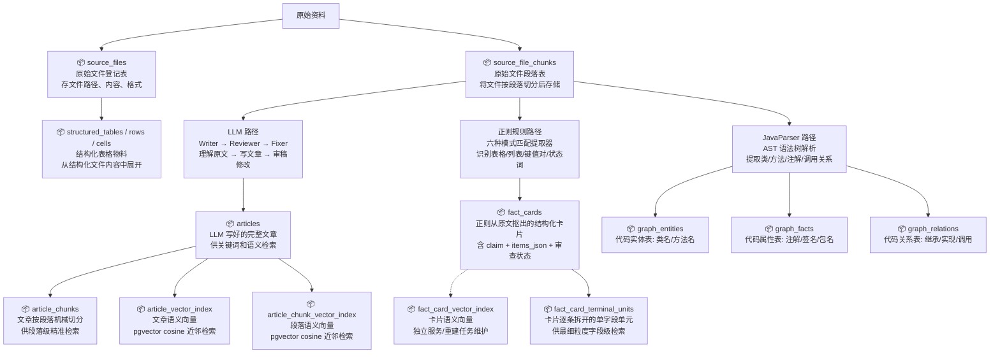

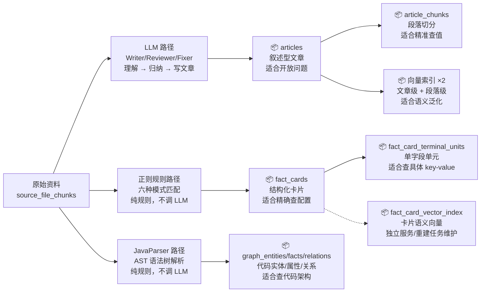

**三条独立的编译线：**

| | LLM 路径 | 正则规则路径 | JavaParser 路径 |
|---|---|---|---|
| 干什么 | 理解、归纳、写文章 | 识别列表/表格/键值对 | 解析 Java 代码结构 |
| 产出 | articles（叙述型文本） | fact_cards（结构化数据） | graph 实体/事实/关系 |
| 用什么 | LLM（Writer/Reviewer/Fixer） | 纯正则匹配 | JavaParser（AST 解析） |
| 适合什么 | "怎么设计容错机制" | "connectTimeout 默认值是 3000ms" | "PaymentService 有哪些方法" |

### 系统骨架：Compile Graph（Spring AI Alibaba StateGraph）

编译流水线由一条 Spring AI Alibaba `StateGraph` 状态机驱动——20 个节点，3 处条件分支，1 处审查循环。

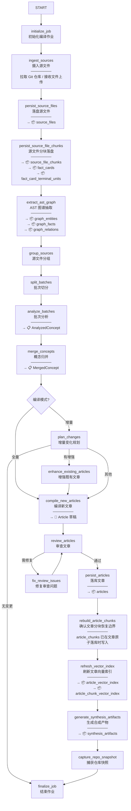

| 文档章节 | 对应图节点 |
|---|---|
| 阶段一：资料导入 | `initialize_job` → `ingest_sources` → `persist_source_files` → `persist_source_file_chunks` |
| 阶段一旁路：Fact Card 与 Terminal Unit | `persist_source_file_chunks` 后由 `FactCardGenerationService` 重建 |
| 1.5：AST 图谱提取 | `extract_ast_graph` |
| 阶段二：概念分析 | `group_sources` → `split_batches` → `analyze_batches` → `merge_concepts` |
| 阶段三：文章生成 | `compile_new_articles` |
| 阶段四：审查与修复 | `review_articles` ⇄ `fix_review_issues` |
| 阶段五：持久化与索引 | `persist_articles` → `rebuild_article_chunks` → `refresh_vector_index` |
| 阶段六：合成产物 | `generate_synthesis_artifacts` → `capture_repo_snapshot` → `finalize_job` |

条件分支：
- `merge_concepts` 后：全量模式 → `compile_new_articles`，增量模式 → `plan_changes`
- `plan_changes` 后：无变更 → `finalize_job`（短路），有增强 → `enhance_existing_articles`
- `review_articles` 后：通过 → `persist_articles`，不通过 → `fix_review_issues`（循环回 `review_articles`）

---

## 一、编译流水线

### 流程总览

> **图例**：📦 数据库表 ｜ 📋 内存/Redis 对象 ｜ 📝 中间产物（仅在内存中）

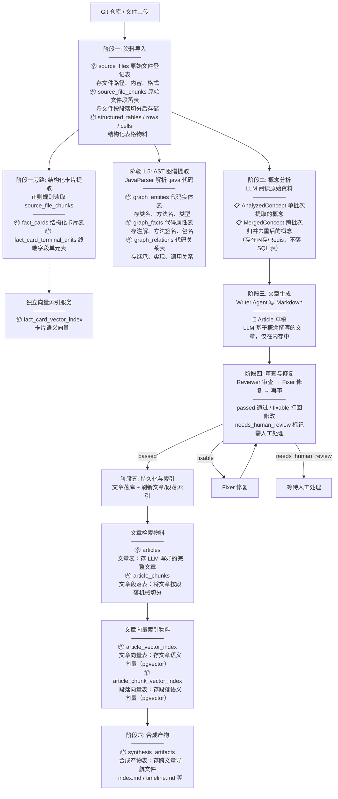

### 阶段一：资料导入

将外部资料（Git 仓库、文件上传）拉入系统，存储为源文件记录。

**产物**：

| 表 | 说明 |
|---|---|
| `source_files` | 源文件元数据与内容 |
| `source_file_chunks` | 源文件按段落切分后的分块 |
| `structured_tables` / `structured_table_rows` / `structured_table_cells` | 结构化表格、行、单元格物料 |
| `fact_cards` | 从 `source_file_chunks` 规则提取的结构化卡片 |
| `fact_card_terminal_units` | 从 key-value 型 Fact Card 展开的单字段单元 |

此时还没有 `articles`、`article_chunks`、`article_vector_index`、`article_chunk_vector_index`。Fact Card 已随 `source_file_chunks` 重建；`fact_card_vector_index` 有独立索引服务维护，不是 `refresh_vector_index` 节点的产物。

### 阶段一旁路：Fact Card 与 Terminal Unit

Fact Card 不是由 LLM 提取的，而是通过**正则规则/结构化模式匹配**从 `source_file_chunks` 中直接提取。它和文章生成是两条独立产出线：文章走 LLM Writer/Reviewer/Fixer；Fact Card 走纯规则提取。

**写入链路：**

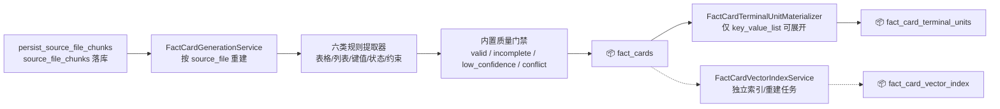

**规则提取器：**

| 提取器 | 识别什么 | 产出类型 | 置信度 |
|---|---|---|---|
| 表格提取 | Markdown 表格（≥2 列表格行） | ENUM / COMPARE | ENUM：0.86；COMPARE：0.84，字段缺失时 0.58 |
| 无序列表提取 | `- `、`* `、`+ ` 开头的 bullet 列表 | ENUM | 0.82 |
| 键值对提取 | `key: value`、`key = value`、JSON 缩进结构 | ENUM | 0.80 |
| 有序列表提取 | 数字序号或中文序号列表 | SEQUENCE | 0.83 |
| 状态词匹配 | 预定义状态标记（待确认/已确认/无流量等） | STATUS | 正常 0.81；互斥冲突 0.45 |
| 约束词匹配 | 预定义约束标记（必须/不得/禁止/应当等） | POLICY | 完整 0.80；缺少范围信息 0.56 |

**质量门禁：** 提取时即写入 `review_status`：证据可在 chunk 中定位为 `valid`，信息不完整为 `incomplete`，证据定位失败为 `low_confidence`，互斥状态词同时出现为 `conflict`。`FactCardReviewer` 和 `FactCardFixService` 是独立审查/修复能力，不是 `persist_source_file_chunks` 重建链路中的必经节点。

**`fact_cards` 关键字段：**

| 字段 | 含义 |
|---|---|
| `id` / `card_id` | 数据库主键 / 业务卡片 ID |
| `source_id` / `source_file_id` / `source_chunk_ids` | 来源资料、源文件、源 chunk |
| `card_type` | 卡片类型：`FACT_ENUM` / `FACT_COMPARE` / `FACT_SEQUENCE` / `FACT_STATUS` / `FACT_POLICY` |
| `answer_shape` | 回答形态：`ENUM` / `COMPARE` / `SEQUENCE` / `STATUS` / `POLICY` / `GENERAL` |
| `title` / `claim` | 卡片标题 / 可直接回答的问题结论 |
| `items_json` | 结构化条目，JSONB |
| `evidence_text` | 支撑卡片的原文证据 |
| `confidence` / `review_status` | 提取置信度 / 审查状态 |
| `article_ids` | 后续关联文章 |
| `content_hash` | 内容指纹 |
| `search_tsv` | PostgreSQL `TSVECTOR`，用于关键词检索 |

#### 1a. Terminal Unit（终端字段单元）

Terminal Unit 将 Fact Card 的 `items_json` 进一步展开为单字段检索单元。只处理 `card_type = FACT_ENUM` 且 `items_json.structure = "key_value_list"` 的卡片。

**为什么需要：** 一张 Fact Card 可能包含多个 key-value 项。Terminal Unit 把每个 key-value 拆成独立记录，用户搜 `periodSeconds` 时可以命中具体字段，而不是只返回整张配置卡片。

**可物化的 `items_json` 结构：**

```json
{
  "structure": "key_value_list",
  "pathAware": true,
  "items": [
    {
      "key": "port",
      "value": "8080",
      "parentPath": "readinessProbe.tcpSocket",
      "keyPath": "readinessProbe.tcpSocket.port",
      "pathSegments": ["readinessProbe", "tcpSocket", "port"],
      "displayText": "readinessProbe.tcpSocket.port = 8080"
    },
    {
      "key": "initialDelaySeconds",
      "value": "30",
      "parentPath": "readinessProbe",
      "keyPath": "readinessProbe.initialDelaySeconds",
      "pathSegments": ["readinessProbe", "initialDelaySeconds"],
      "displayText": "readinessProbe.initialDelaySeconds = 30"
    }
  ]
}
```

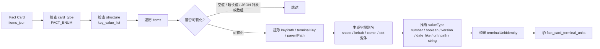

**字段别名增强（可选 LLM 调用）：** 仅对英文字段且规则生成的别名中不含中文的，调用 LLM 生成中文别名。比如 `readinessProbe` → `["就绪探针"]`。不需要的不调，避免浪费。

**`fact_card_terminal_units` 关键字段：**

| 字段 | 含义 |
|---|---|
| `id` / `unit_id` | 数据库主键 / 终端单元 ID |
| `terminal_unit_identity` | 可重复计算的终端单元唯一身份 |
| `fact_card_id` / `card_id` | 关联的 Fact Card |
| `source_id` / `source_file_id` / `source_chunk_ids` | 来源资料、源文件、源 chunk |
| `card_type` / `answer_shape` / `structure` | 来源卡片类型、回答形态、展开结构 |
| `item_index` | item 在 `items_json.items` 中的位置 |
| `terminal_key` / `key_path` / `parent_path` | 字段名、完整路径、父路径 |
| `path_segments_json` | 路径分段 |
| `field_label` / `field_aliases_json` / `field_description` | 字段展示名、别名、描述 |
| `display_text` / `value_text` / `normalized_value` | 展示文本、原始值、归一化值 |
| `value_type` | 值类型：`number` / `boolean` / `version` / `date_like` / `url` / `path` / `string` |
| `source_refs_json` | 支撑该字段的来源引用 |
| `confidence` / `review_status` | 置信度 / 审查状态 |
| `fts_text` / `search_tsv` | 关键词检索文本 / PostgreSQL `TSVECTOR` |
| `metadata_json` | 扩展元数据 |

### 阶段 1.5：AST 图谱提取

编译阶段从 Java 源代码中提取代码结构，生成知识图谱。使用 JavaParser（纯规则，不调 LLM）解析 `.java` 文件，提取三类数据：

**实体（graph_entities）：** 代码里有"什么"

| 实体 | 类型 | 系统标签 |
|---|---|---|
| `PaymentService` | `CLASS` | `java` |
| `RetryHandler` | `CLASS` | `java` |
| `PaymentService.search` | `METHOD` | `java` |

**事实（graph_facts）：** 每个实体有什么"属性"

| 实体 | 属性 | 值 | 提取器 |
|---|---|---|---|
| `PaymentService` | `package` | `com.xbk.payment` | `class_extractor` |
| `PaymentService` | `annotation` | `@Service` | `annotation_extractor` |
| `PaymentService.search` | `signature` | `search(String, int)` | `method_extractor` |
| `PaymentService.search` | `http_mapping` | `@GetMapping(...)` | `endpoint_extractor` |

**关系（graph_relations）：** 实体之间的"连线"

| 源实体 | 关系 | 目标实体 | 提取器 |
|---|---|---|---|
| `PaymentService` | `extends` | `BaseService` | `type_relation_extractor` |
| `PaymentService` | `implements` | `PaymentApi` | `type_relation_extractor` |
| `PaymentService` | `declares_method` | `PaymentService.search` | `method_extractor` |
| `PaymentService.search` | `calls` | `RetryHandler.execute` | `call_extractor` |

**提取过程：**

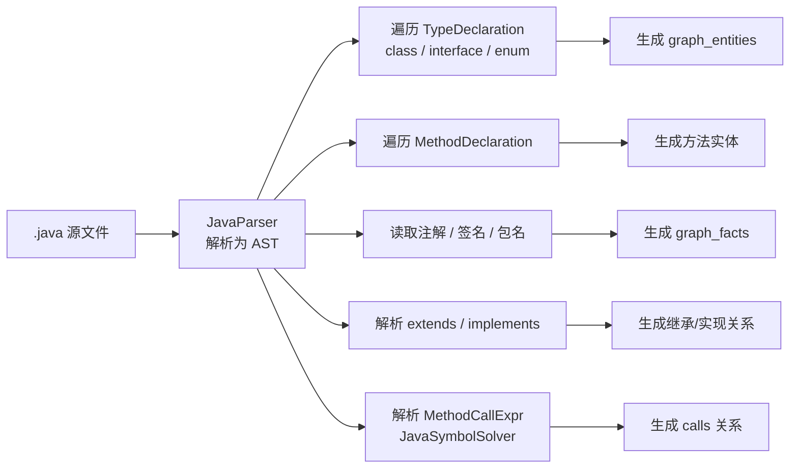

**置信度设计：**

| 提取类型 | 置信度 | 说明 |
|---|---|---|
| package / signature / declares_method | 1.0 | AST 直接可得，确定性高 |
| http_mapping | 0.95 | Spring 注解匹配，几乎确定 |
| annotation / extends / implements | 0.9 | AST 直接可得 |
| calls（已解析） | 0.8 | JavaSymbolSolver 成功解析目标 |
| calls（未解析） | 0.5 | 仅靠方法名匹配，不确定性高 |

**写入策略：** 按文件为单位，先删旧数据再插入新数据（DB 级幂等）。事实和关系直接 INSERT，实体用 `ON CONFLICT DO UPDATE`。

**局限：** 当前仅支持 `.java` 文件。其他语言（Python、Kotlin 等）未被处理。

**Graph 三张表关键字段：**

| 表 | 关键字段 |
|---|---|
| `graph_entities` | `id`、`canonical_name`、`simple_name`、`entity_type`、`system_label`、`source_file_id`、`anchor_ref`、`resolution_status`、`metadata_json` |
| `graph_facts` | `id`、`entity_id`、`predicate`、`value`、`source_ref`、`source_start_line`、`source_end_line`、`evidence_excerpt`、`confidence`、`extractor`、`tombstoned`、`superseded_by` |
| `graph_relations` | `id`、`src_id`、`edge_type`、`dst_id`、`source_ref`、`source_start_line`、`source_end_line`、`confidence`、`extractor`、`tombstoned`、`superseded_by` |

### 阶段二：概念分析

LLM 逐批阅读 `source_file_chunks`，提取"这些资料讲了哪些概念"。不同批次产出的概念经过跨组归并，消除重复。

**产物**：

| 产物 | 说明 |
|---|---|
| `AnalyzedConcept` | 单批次 LLM 分析提取的概念 |
| `MergedConcept` | 跨组归并去重后的概念 |

### 阶段三：文章生成

Writer Agent 基于每个 MergedConcept，调用 LLM 撰写 Markdown 格式的技术文章。文章会引用源文件中的具体内容作为证据支撑。

**产物**：Article 草稿（此时仅在内存中）

### 阶段四：审查与修复循环

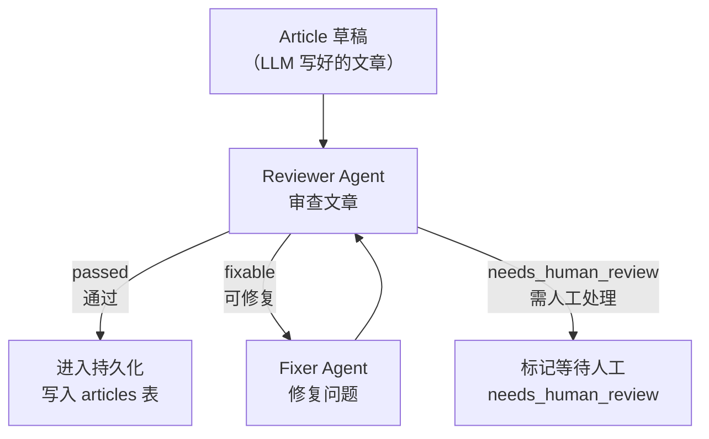

**审查状态流转**：

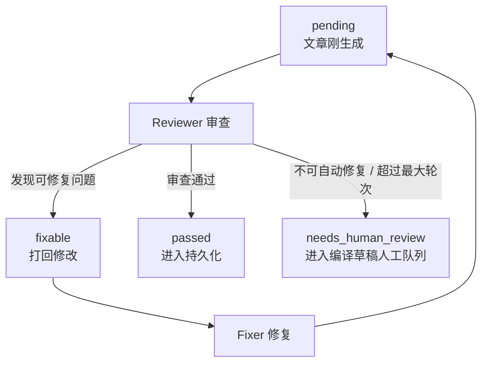

### 阶段五：持久化与索引构建

通过的 article 正式写入数据库，并在同一事务中写入 `article_chunks`。随后 `refresh_vector_index` 刷新文章级和段落级向量索引。Fact Card 相关物料不在阶段五生成。

#### 5a. 写入 articles 表（文章表）

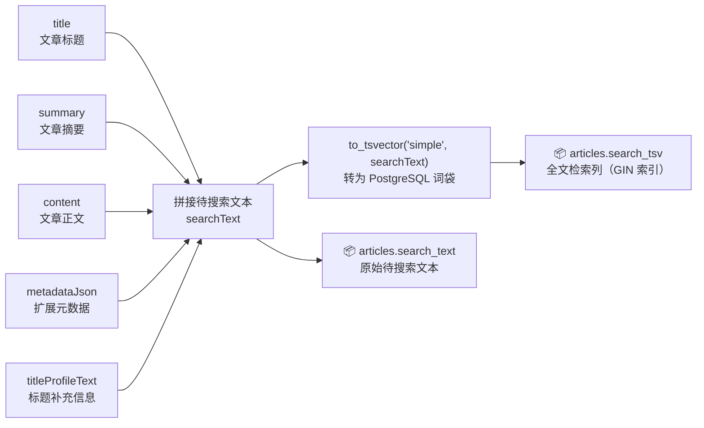

审查通过的 Article 正式写入 `articles` 表，同时将 title、summary、content、metadataJson、titleProfileText 五部分拼成 searchText，转为 tsvector 存入 `search_tsv` 列。GIN 倒排索引加速后续关键词检索。

#### 5b. 切分 article_chunks（文章段落）

将每篇 LLM 写好的文章按 Markdown 语义结构切分为多个 chunk。切分工具是 `SemanticChunker`，核心参数：**每块最大 3600 字符，相邻块重叠约 15%（~540 字符）**。

**切分三步走：**

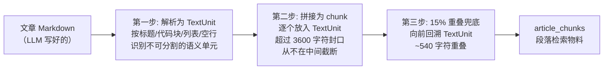

**第一步：解析为语义单元（TextUnit）**

先按行扫描文章，识别 Markdown 结构边界，形成不可分割的最小单元：

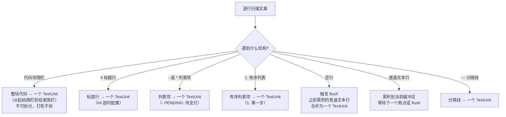

**第二步：拼接 TextUnit 为 chunk**

逐个将 TextUnit 放入当前 chunk，超过 3600 字符时封口，起一个新 chunk。关键原则：**从不在 TextUnit 中间截断**——一个代码块要么全进当前 chunk，要么全进下一个。

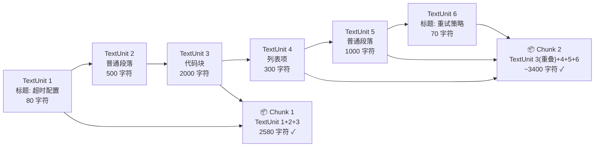

**第三步：15% 重叠兜底**

相邻 chunk 重叠约 540 字符（3600 × 15%）。实现方式不是简单复制最后 540 字，而是**向前回溯 TextUnit**——从切分点往回找几个完整的语义单元拼到下一个 chunk 开头。

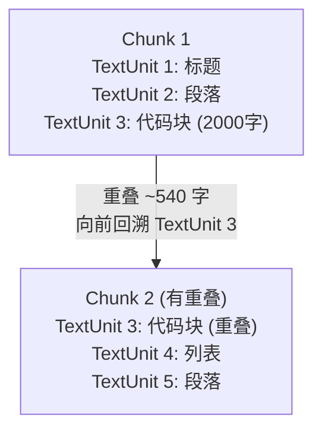

**为什么需要重叠：** 一段知识点可能刚好跨在 chunk 边界，用户搜的关键词分散在两个 chunk 里。重叠让边界附近的语义在相邻 chunk 中有交汇，减少"刚好被截断"导致的漏召回。

**写入链路：**

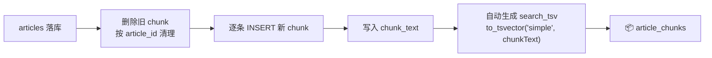

**`article_chunks` 关键字段：**

| 字段 | 含义 |
|---|---|
| `id` | chunk 记录主键 |
| `article_id` | 所属文章 |
| `chunk_index` | chunk 在文章中的顺序 |
| `chunk_text` | chunk 正文 |
| `search_tsv` | 写入时自动生成的 PostgreSQL `TSVECTOR`，用于关键词检索 |

**写入时机：** 文章落库后，在同一事务中先删旧 chunk，再逐条 INSERT 新 chunk，保证文章和 chunk 数据一致。

#### 5c. 刷新文章向量索引（Embedding）

`refresh_vector_index` 调用 embedding 模型，将已落库文章和文章 chunk 转为向量。

| 表 | embedding 输入 | 用途 |
|---|---|---|
| `article_vector_index` | 整篇文章内容 | 文章级语义检索 |
| `article_chunk_vector_index` | 单个 chunk 文本 | 段落级语义检索 |

向量索引表建有 HNSW 或 IVFFlat 近似近邻索引，用于加速 cosine 相似度查询。`fact_card_vector_index` 的 embedding 输入是 claim + items_json + evidence_text，但由 `FactCardVectorIndexService` 等独立服务/重建任务维护，不由 `refresh_vector_index` 节点刷新。

### 阶段六：合成产物

生成跨文章的索引文件（index.md、timeline.md、tradeoffs.md、gaps.md 等），主要用于 Obsidian Vault 浏览。

---

## 二、审查体系

系统中存在三类审查状态，分别服务不同对象。

### Article 草稿自动审查状态

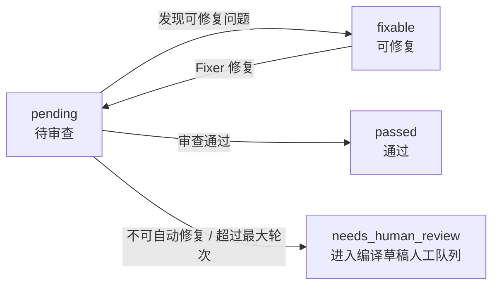

`passed` 的草稿进入 `persist_articles`。`needs_human_review` 的草稿不直接写入 `articles`，而是进入编译草稿人工队列。

### 编译草稿人工队列状态

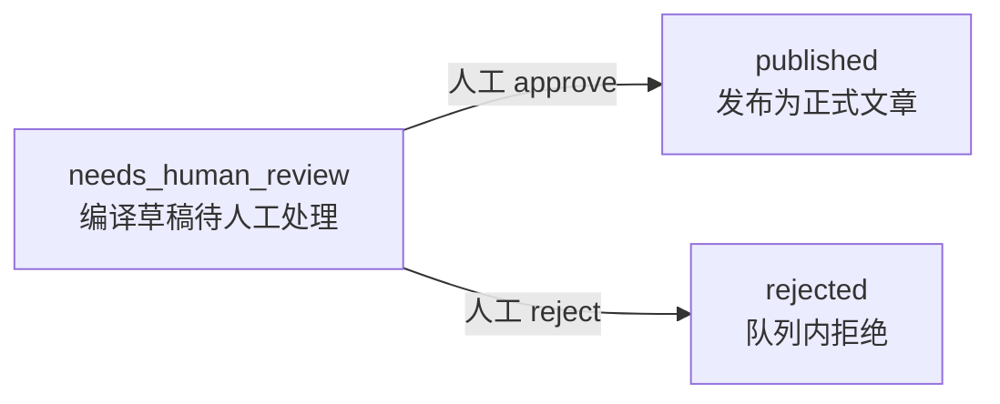

后台 approve 会将草稿写入 `articles`、重建 `article_chunks`，并调度文章/段落向量刷新。reject 只结束该队列项，不会生成 `needs_review` 正式文章状态。

### 正式文章人工复核状态

正式文章已有记录被人工要求修改时，才会进入 `needs_review`；这条链路和编译草稿队列不是同一个状态机。

### Fact Card 审查状态

| 状态 | 含义 | 检索策略 |
|---|---|---|
| `valid` | 证据可定位，结构完整 | 正常通过 |
| `incomplete` | 缺失必要字段 | 正常通过 |
| `low_confidence` | 证据定位不确定 | 分数 × 0.45 |
| `needs_human_review` | 需人工判断 | 分数 × 0.20，仅背景使用 |
| `conflict` | 存在结构化冲突 | 直接丢弃 |
