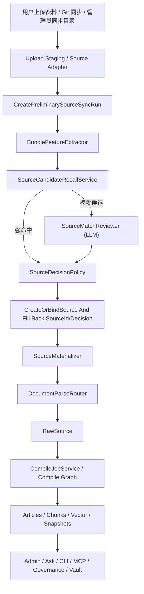

# 知识输入系统一体化技术方案

> 版本：v1.0  
> 日期：2026-04-19  
> 状态：待评审  
> 适用范围：Lattice 管理后台、资料输入链路、文档解析链路、知识编译链路、资料源同步链路  
> 说明：本文档用于整合“架构分层重构”“文档解析与 OCR 接入”“资料源管理与智能同步”三份方案，作为后续实现与 Claude 审查的主文档；本文档不是实施进度台账，若进入执行阶段，应另建执行清单并持续回写。

---

## 1. 文档定位

本文档整合以下三份既有方案：

- [架构分层重构实施方案](/Users/sxie/xbk/Lattice-java/docs/架构分层重构实施方案.md)
- [文档解析与OCR接入技术方案](/Users/sxie/xbk/Lattice-java/docs/文档解析与OCR接入技术方案.md)
- [资料源管理与智能同步技术方案](/Users/sxie/xbk/Lattice-java/docs/资料源管理与智能同步技术方案.md)

同时，本文档以当前 compile/query 主骨架设计为前提，不替代以下基线文档：

- [Spring AI Alibaba Graph 完整接入设计方案](/Users/sxie/xbk/Lattice-java/.codex/Spring%20AI%20Alibaba%20Graph%20%E5%AE%8C%E6%95%B4%E6%8E%A5%E5%85%A5%E8%AE%BE%E8%AE%A1%E6%96%B9%E6%A1%88.md)

本文档要解决的问题不是“把三份文档拼起来”，而是形成一条统一主线，回答下面 4 个问题：

1. 系统最终要围绕什么产品模型演进。
2. 文档解析、资料源同步、知识编译三层之间的职责边界是什么。
3. 当前代码基线下，正确且低风险的实施顺序是什么。
4. 哪些数据库与代码改造属于高风险项，必须提前让评审关注。

---

## 2. 当前基线与核心矛盾

结合当前仓库与既有方案，现阶段已经成立的基线如下：

- `/admin`、`/admin/ask`、`/admin/ai` 已完成用户页与内部页拆分。
- compile / query 主链路已切到 Graph 骨架，图编排不是待引入能力，而是当前主骨架。
- LLM 配置中心已经落地，具备连接、模型、角色绑定、运行时快照冻结能力。
- 当前系统仍以“单次上传 -> 直接 compile”为主要输入模式，尚未形成长期资料源模型。
- 当前文件解析能力对 `pdf/docx/pptx/xlsx/xls` 已有直读基础，但 `.doc`、图片 OCR、扫描 PDF OCR 仍未真正闭环。

当前真正的矛盾不在单点功能，而在三个层面同时存在结构缺口：

### 2.1 架构层缺口

- `compiler/service/` 仍承担过多职责，提取器、LLM 客户端、Prompt、节点实现等尚未完全收口到各自归属。
- `api/admin/` 仍混有业务服务类，导致 Trigger 层与业务层边界不稳。
- 当前若直接接入 OCR 或资料源同步，容易把新逻辑继续堆回旧结构。

### 2.2 解析层缺口

- 图片上传当前仍然只是占位采集，不是真正 OCR。
- 扫描 PDF 尚未形成“文本提取失败后自动转 OCR”的分支。
- 系统还没有独立的 `documentparse` 模块与配置中心。

### 2.3 资料源层缺口

- 当前系统只有 `compile_jobs`，没有 `Source` 与 `Source Sync Run` 模型。
- 上传工作区仍是一次性临时目录，不形成可持续维护的资料源身份。
- `articles.concept_id`、`source_files.file_path`、`pending_queries.selected_concept_ids/source_file_paths` 仍然基于单资料源假设。
- 现有 Query、Governance、Vector Index、Snapshot 链路大量直接依赖 `concept_id` 或 `file_path`，多资料源改造影响面很广。

一句话概括当前核心矛盾：

`系统已经有了较强的编译与问答骨架，但知识输入层仍停留在“单次导入 + 单资料源假设 + 文件解析能力不完整”的阶段。`

---

## 3. 总体目标

### 3.1 产品目标

- 用户围绕“资料源”而不是“目录路径”操作知识库。
- 普通用户始终只需要理解 `上传资料`、`查看处理结果`、`进入问答`。
- `.doc`、图片、扫描 PDF 都可以稳定进入知识编译链路。
- 系统能够识别“新资料源、已有资料源更新、已有资料源补充、待确认”四类结果。
- Git 仓库成为代码项目与持续文档仓的主来源能力。

### 3.2 技术目标

- 保持 compile graph 聚焦知识编译，不承担资料源识别、Git 操作、目录治理职责。
- 把文档解析从 LLM 配置中心独立出来，形成单独模块与配置语义。
- 引入 `Source` 与 `Source Sync Run` 领域模型，把“来源治理”和“编译执行”分层。
- 所有文件、文章、引用、快照、问答命中关系逐步演进到 source-aware 模型。
- 用渐进式迁移替代一次性推翻，降低数据库与查询链路改造风险。

### 3.3 非目标

- 不在本轮引入多租户、多知识库、多工作区体系。
- 不把 OCR 供应商暴露到普通用户页。
- 不把多模态大模型作为 V1 主 OCR 方案。
- 不在第一版就支持 Git SSH、submodule、LFS 深支持、实时目录监听。
- 不把资料源识别完全交给 LLM 独立决策。

---

## 4. 统一设计结论

三份方案整合后，建议以以下结论作为统一约束：

### 4.1 产品主模型

系统的知识输入主模型从“资料导入”升级为“资料源管理”。

- `资料包 Bundle`：一次上传或一次同步拿到的文件集合，是识别输入。
- `资料源 Source`：长期身份，表示一组可持续维护的知识来源。
- `同步运行 Source Sync Run`：某个资料源的一次实际处理执行。
- `编译任务 CompileJob`：同步运行下游触发的编译执行。

### 4.2 分层边界

- `Source Layer`：负责资料源识别、归并、同步编排、来源配置、运行状态。
- `Document Parse Layer`：负责把单个文件“看懂”，输出统一文本结果。
- `Materialization Layer`：负责把上传文件、Git、服务器目录统一物化为受控工作目录。
- `Compile Layer`：负责 ingest、analyze、merge、review、persist、chunk、vector index、snapshot。
- `Query/Governance Layer`：消费编译后知识资产，不参与上游资料源判定。

### 4.3 LLM 与 OCR 的边界

- `文档解析` 负责图片识字、扫描 PDF 识字、复杂文档结构提取。
- `LLM` 负责解析后清洗、知识编译、知识问答、审查与润色。
- 不新增 OCR Agent 角色，不把 OCR 供应商并入 Agent 绑定体系。

### 4.4 Source Sync 与 Compile 的边界

- 资料源识别、Git 操作、目录白名单校验不进入 compile graph。
- `SourceSyncService` 完成识别与物化后，再通过 `CompileJobService.submit(...)` 或 `CompileApplicationFacade.compile(...)` 触发编译。
- `SourceSyncRun` 成功不等于 compile 成功，只有识别、物化、编译全部走通，才算同步真正成功。

---

## 5. 推荐实施顺序

建议采用“先地基、后解析、再来源治理、最后收口增强”的主线顺序。

### 5.1 主线顺序

1. 架构分层重构
2. 文档解析配置层与执行层
3. 资料源领域骨架与统一上传收口
4. 多资料源 source-aware 数据兼容改造
5. Git 资料源与管理员高级能力
6. 前端与运维收口、增强能力

### 5.2 排序原因

- OCR 方案明确要求文件类型识别与 `DocumentParseRouter` 在 Source Sync 预处理阶段完成，compile graph 只接收统一 `RawSource`；如果不先做架构收口，新解析链路容易继续堆进 `compiler/service/`。
- 资料源方案明确要求“来源识别不进入 compile graph”，因此来源治理必须建立在已经稳定的编译骨架之上。
- 多资料源兼容改造会波及 `articles/source_files/pending_queries/article_snapshots/vector index/query` 等多个面向，属于整套方案技术风险最高的一段，适合放在来源骨架与解析链路跑通之后再推进。

### 5.3 可并行部分

在“架构地基阶段”完成后，下列内容可有限并行：

- `documentparse` 配置层建设
- `source` 模块领域骨架与 staging/materialization 接口定义

但下列内容不建议并行冲刺：

- OCR 执行链路改造 与 多资料源 source-aware 全量数据库改造
- 统一上传入口大改造 与 Query/Admin 全链路主键切换

原因是两者同时推进会放大回归面，难以定位问题来源。

---

## 6. 目标总体架构



整条链路的关键原则是：

- 来源治理在上游完成。
- 文件解析在进入 compile graph 前完成。
- compile graph 只消费统一 `RawSource`。
- 下游 Query/Governance/Vault 只消费已编译知识资产。

---

## 7. 目标模块设计

### 7.1 架构重构后的基础包结构

建议以 [架构分层重构实施方案](/Users/sxie/xbk/Lattice-java/docs/架构分层重构实施方案.md) 为基础，先把下面结构收口到位：

```text
com/xbk/lattice/
├── api/                          # Trigger：Controller + DTO
├── compiler/
│   ├── domain/
│   ├── graph/
│   │   └── node/
│   ├── infra/
│   │   ├── extractor/
│   │   └── wal/
│   ├── prompt/
│   └── service/
├── documentparse/
│   ├── domain/
│   ├── service/
│   └── infra/
├── source/
│   ├── domain/
│   ├── service/
│   └── infra/
├── llm/
│   ├── client/
│   ├── domain/
│   ├── infra/
│   └── service/
├── query/
│   ├── domain/
│   ├── graph/
│   └── service/
├── governance/
│   ├── domain/
│   └── service/
└── infra/
    ├── persistence/
    └── redis/
```

### 7.2 架构重构阶段的最低完成面

为保证后续两条业务方案落地不再写进旧结构，建议先完成以下阶段：

- LLM 客户端统一到 `llm/client/`
- 提取器与 WAL 下沉到 `compiler/infra/`
- Prompt 管理独立到 `compiler/prompt/`
- 图节点统一到 `compiler/graph/node/`
- `api/admin/` 中业务服务类下沉
- `compiler/governance/query` 三个模块补齐 `domain/` 子包

`infra/redis/` 统一与文档边界说明可放在后续阶段收口，但不建议拖到整个方案结束后再做。

### 7.3 `documentparse` 模块

建议新增独立模块：

```text
com/xbk/lattice/documentparse/
├── domain/
│   ├── DocumentParseProviderConnection
│   ├── DocumentParseSettings
│   ├── DocumentParseResult
│   └── DocumentParseMode
├── service/
│   ├── DocumentParseAdminService
│   ├── DocumentParseRouter
│   ├── DocumentParseConnectionProbeService
│   └── DocumentParseResultNormalizer
└── infra/
    ├── TencentOcrClient
    ├── AliyunOcrClient
    ├── JdbcDocumentParseConnectionRepository
    └── JdbcDocumentParseSettingsRepository
```

职责约束：

- 本方案明确选择“预编译解析”路线：`DocumentParseRouter` 在 `SourceSyncWorker` 的预处理阶段被调用，而不是在 compile graph 内部调用。
- `DocumentParseRouter` 决定文本直读、Office 提取、PDF 文本提取、PDF 转 OCR、图片 OCR。
- compile graph 的输入是已解析好的 `RawSource` 工作集，不是原始文件目录。
- `IngestNode` 在该方案下不再承担“按文件类型决定解析路由”的职责，而是消费已解析的 `RawSource` 输入并继续后续编译流程。

`RawSource` 的目标边界契约建议固定为：

- `RawSource` 是 DocumentParseLayer 输出给 CompileLayer 的输入 DTO / 工作集元素，不是工作目录描述。
- V1 最小字段建议包括：
  - `sourceId`
  - `relativePath`
  - `extractedText`
  - `parseMode`
  - `parseProvider`
  - `contentHash`
  - `metadataJson`
- 其中 `parseMode / parseProvider / metadataJson` 用于保留直读、OCR、扫描 PDF 等解析上下文，供后续 `source_files.metadata_json`、审计与问题排查复用。

### 7.4 `source` 模块

建议新增独立模块：

```text
com/xbk/lattice/source/
├── domain/
│   ├── KnowledgeSource
│   ├── SourceSyncRun
│   ├── BundleSummary
│   ├── SourceDecision
│   └── SourceRevision
├── service/
│   ├── SourceService
│   ├── SourceSyncService
│   ├── UploadStagingService
│   ├── BundleFeatureExtractor
│   ├── SourceCandidateRecallService
│   ├── SourceMatchReviewer
│   ├── SourceDecisionPolicy
│   ├── SourceMaterializer
│   └── SourceSyncWorker
└── infra/
    ├── JdbcKnowledgeSourceRepository
    ├── JdbcSourceSyncRunRepository
    ├── JdbcSourceSnapshotRepository
    ├── JdbcSourceCredentialRepository
    ├── GitSourceAdapter
    └── ServerDirSourceAdapter
```

职责约束：

- `SourceService` 负责资料源创建、查询、启停、详情。
- `SourceSyncService` 编排一次完整同步。
- `UploadStagingService` 只负责 staging，不做业务判定。
- `SourceMatchReviewer` 仅在模糊场景做 LLM 二次判断。
- `SourceDecisionPolicy` 是最终收口层，不让 LLM 单独做最终裁决。
- `SourceSyncWorker` 是上层异步执行单元，不把这部分逻辑塞回 `CompileJobWorker`。

---

## 8. 数据模型设计

### 8.1 新增表

统一约定：

- 新增表主键字段统一命名为 `id`。
- 如需对外展示或作为可读业务编码，统一额外增加 `*_code` 字段，不再把 `run_id`、`snapshot_id` 一类字段名直接作为主键名。

#### `document_parse_provider_connections`

用于保存 OCR / 文档解析供应商连接。

关键字段建议：

- `id`
- `connection_code`
- `provider_type`
- `base_url`
- `endpoint_path`
- `credential_ciphertext`
- `credential_mask`
- `extra_config_json`
- `enabled`
- `created_by/updated_by`
- `created_at/updated_at`

#### `document_parse_settings`

用于保存全局文档解析设置。

关键字段建议：

- `id`
- `config_scope`
- `default_connection_id`
- `image_ocr_enabled`
- `scanned_pdf_ocr_enabled`
- `cleanup_enabled`
- `cleanup_model_profile_id`
- `created_by/updated_by`
- `created_at/updated_at`

#### `source_credentials`

用于保存 `GIT` 或后续扩展来源所需凭据，`credentialRef` 只允许引用该表中的记录，禁止将明文凭据写入 `knowledge_sources.config_json`。

关键字段建议：

- `id`
- `credential_code`
- `credential_type`
- `secret_ciphertext`
- `secret_mask`
- `enabled`
- `created_by/updated_by`
- `created_at/updated_at`

#### `knowledge_sources`

资料源主表。

| 字段 | 说明 |
| --- | --- |
| `id` | 主键 |
| `source_code` | 稳定资料源编码 |
| `name` | 资料源名称 |
| `source_type` | `UPLOAD / GIT / SERVER_DIR` |
| `content_profile` | `CODE / DOCUMENT / MIXED / REPORT / ASSET_HEAVY` |
| `status` | `ACTIVE / DISABLED / ARCHIVED` |
| `visibility` | `NORMAL / ADMIN_ONLY` |
| `default_sync_mode` | `AUTO / FULL / INCREMENTAL` |
| `config_json` | 来源配置，不得存密钥明文 |
| `metadata_json` | 扩展元数据 |
| `latest_manifest_hash` | 最近一次成功同步的 manifest hash |
| `last_sync_run_id` | 最近一次同步运行 ID |
| `last_sync_status` | 最近一次同步结果 |
| `last_sync_at` | 最近一次同步时间 |
| `created_at` | 创建时间 |
| `updated_at` | 更新时间 |

说明：

- `source_code` 字符集限制为小写字母、数字、短横线，建议正则：`^[a-z0-9](?:[a-z0-9-]{0,30}[a-z0-9])?$`。
- `source_code` 不允许出现连续双连字符 `--`，为 `article_key` 预留安全分隔符。
- `config_json` 仅保存非敏感来源配置，例如 Git URL、branch、subPath、策略开关；敏感凭据统一通过 `credentialRef -> source_credentials` 间接引用。
- `DISABLED` 表示资料源暂停接收新的同步与自动归并，但历史已编译文章仍可被查询、查看，并继续参与普通查询召回；查询层不对 `DISABLED` 做默认过滤。
- `ARCHIVED` 表示资料源进入归档态，不再接收新的同步与自动归并；历史文章与快照保留用于审计和后台查看，但默认不再参与普通查询召回。
- `ARCHIVED` 资料源的向量索引记录默认保留，不做立即删除；查询阶段通过 `source_id -> knowledge_sources.status` 过滤掉归档资料源，避免索引重建成本与历史审计丢失。
- 当一次运行以 `SKIPPED_NO_CHANGE` 结束时，仍应更新 `last_sync_at` 作为“最近一次检查时间”，同时将 `last_sync_status` 记录为 `SKIPPED_NO_CHANGE` 与 `SUCCEEDED` 区分。
- `knowledge_sources.status` 的 V1 状态迁移建议固定为：
  - `ACTIVE -> DISABLED`：通过 `PATCH /api/v1/admin/sources/{sourceId}` 暂停后续同步与自动归并。
  - `DISABLED -> ACTIVE`：通过同一接口恢复。
  - `ACTIVE -> ARCHIVED`、`DISABLED -> ARCHIVED`：通过同一接口归档，归档后默认不再参与普通召回。
  - `ARCHIVED` 在 V1 视为受控终态，不在普通管理流程中直接恢复。

#### `source_sync_runs`

同步运行表。

| 字段 | 说明 |
| --- | --- |
| `id` | 主键 |
| `source_id` | 关联资料源；上传型异步识别阶段可暂为空，待决策完成后回填 |
| `trigger_type` | `INITIAL_UPLOAD / MANUAL_UPLOAD / MANUAL_SYNC / GIT_SYNC / ADMIN_SYNC / REBUILD` |
| `sync_action` | `CREATE / UPDATE / APPEND / REBUILD`；在 `AMBIGUOUS / WAIT_CONFIRM` 阶段允许暂为空，待人工确认后回填 |
| `sync_mode` | `AUTO / FULL / INCREMENTAL` |
| `status` | `QUEUED / MATCHING / MATERIALIZING / COMPILE_QUEUED / RUNNING / SUCCEEDED / FAILED / SKIPPED_NO_CHANGE / WAIT_CONFIRM` |
| `resolver_mode` | `RULE_ONLY / RULE_PLUS_LLM / MANUAL_OVERRIDE` |
| `resolver_decision` | `NEW_SOURCE / EXISTING_SOURCE_UPDATE / EXISTING_SOURCE_APPEND / AMBIGUOUS` |
| `resolver_confidence` | 判定置信度 |
| `matched_source_id` | 命中的既有资料源 |
| `decision_reason` | 简短判定说明 |
| `evidence_json` | 规则与 LLM 识别证据，建议包含 `bundleSummary` 摘要与人工确认审计信息 |
| `staging_dir` | 运行期 staging 目录，仅用于临时追踪 |
| `materialized_dir` | 运行期物化目录，仅用于当前执行 |
| `source_revision` | Git commit、目录快照版本或上传批次号 |
| `manifest_hash` | 本次资料包 hash |
| `file_count` | 文件数量 |
| `added_count` | 新增文件数 |
| `changed_count` | 变更文件数 |
| `removed_count` | 删除文件数 |
| `compile_job_id` | 对应编译任务；V1 约定一次同步运行最多触发一次编译任务 |
| `error_message` | 错误信息 |
| `requested_at` | 请求时间 |
| `started_at` | 开始时间 |
| `finished_at` | 结束时间 |
| `updated_at` | 最近一次状态或字段变更时间 |

#### `source_snapshots`

资料源成功同步后的快照摘要表。

| 字段 | 说明 |
| --- | --- |
| `id` | 主键 |
| `source_id` | 关联资料源 |
| `source_sync_run_id` | 关联同步运行 |
| `revision_ref` | 快照对应的 revision 引用 |
| `manifest_hash` | 快照内容 hash |
| `file_count` | 文件数量 |
| `summary_json` | 快照摘要，可选保存结构化统计 |
| `created_at` | 创建时间 |

说明：

- `source_snapshots` 不保存服务器物理目录路径。
- 版本比对与无变更判断以 `manifest_hash` 为主，必要时辅以 `revision_ref` 与 `summary_json`。

#### `article_source_refs`

文章与源文件正式关联表。

| 字段 | 说明 |
| --- | --- |
| `id` | 主键 |
| `article_id` | 文章主键 |
| `article_key` | 跨资料源全局文章键 |
| `source_id` | 所属资料源 |
| `source_file_id` | 所属源文件 |
| `relative_path` | 相对资料源根目录路径 |
| `ref_type` | `PRIMARY / SUPPLEMENTARY / INHERITED` |
| `created_at` | 创建时间 |

说明：

- `PRIMARY` 表示文章主来源文件。
- `SUPPLEMENTARY` 表示补充证据或辅助来源文件。
- `INHERITED` 表示通过聚合、继承或跨文档汇总间接纳入的来源关系。
- compile graph 的时序约束应固定为：`IngestNode` 在消费 `RawSource` 后，先按 `source_id + relative_path` upsert `source_files`，并把 `relative_path -> source_file_id` 映射写入 StateGraph context。
- 该表由 compile graph 的 `PersistArticlesNode` 在文章持久化阶段负责写入；当文章主键生成后，节点应同步落库 `article -> source_file` 关联。
- `PersistArticlesNode` 只消费已存在的 `source_file_id` 映射写入 `article_source_refs`；若映射缺失，应直接失败并记录错误，而不是写入空外键。
- Phase E 之后新编译的数据必须写入 `article_source_refs`；历史数据可在 Phase F 通过 `source_paths` 与 `source_files` 的兼容信息做增量回填。

### 8.2 现有表扩展与改造

#### `compile_jobs`

保留现有表，但补齐 source-aware 上下文：

- `source_id`
- `source_sync_run_id`
- `workspace_dir`
- `trigger_type`

这样编译任务从“目录级执行”升级为“某资料源某次同步的编译执行”。

#### `source_files`

目标状态从全局路径唯一升级为资料源内路径唯一。

建议字段演进：

- 新增 `source_id`
- 新增 `source_sync_run_id`
- `file_path` 语义迁移为 `relative_path`
- 新增 `content_hash`
- 唯一约束改为 `unique (source_id, relative_path)`

字段语义补充：

- `relative_path` 是相对资料源根目录的稳定路径，是 source 内唯一定位键。
- 不再保留 `raw_path` 作为正式字段；如需保留上传原路径、Git 导出原位置或服务器目录来源描述，统一写入 `metadata_json.originRef`。
- `IngestNode` 在 compile graph 内负责以 `source_id + relative_path` 为 upsert key 写入 `source_files`，并把生成后的 `source_file_id` 映射传给后续持久化节点。

`metadata_json` 中建议记录解析元数据，例如：

```json
{
  "parseMode": "ocr_image",
  "parseProvider": "tencent_ocr",
  "pageCount": 2,
  "ocrApplied": true,
  "cleanupApplied": false
}
```

#### `source_file_chunks`

目标状态不再按 `file_path` 关联，而改为 `source_file_id` 关联。

建议演进：

- 新增 `source_file_id`
- 逐步废弃 `file_path`
- 唯一约束改为 `unique (source_file_id, chunk_index)`

#### `articles`

目标状态从全局 `concept_id` 唯一升级为 source-aware 文章身份。

建议演进：

- 新增 `source_id`
- 新增 `article_key`
- 保留 `concept_id` 作为 source-scoped slug
- 约束改为 `unique (article_key)` 与 `unique (source_id, concept_id)`

建议 `article_key` 形如：

- `${source_code}--${concept_id}`

补充约束：

- `article_key` 作为 opaque key 使用，不要求运行时通过分隔符回拆字段。
- `source_code` 禁止包含 `--`。
- `concept_id` 继续沿用 slug 生成规则，并在生成时归一化重复短横线，避免与分隔符冲突。

#### `article_snapshots`

建议先新增：

- `source_id`
- `article_key`

后续逐步把快照主识别从 `concept_id` 迁到 `article_key`。

#### `pending_queries`

建议先新增：

- `selected_article_keys`

并暂时保留：

- `selected_concept_ids`
- `source_file_paths`

后续待 Query/Admin 全量切换后，再清理兼容字段。

### 8.3 代码事实带来的额外影响面

结合当前代码事实，source-aware 改造不能只停留在三张业务主表，至少还要一并评估以下对象：

- `ArticleJdbcRepository`、`ArticleSnapshotJdbcRepository`、`SourceFileJdbcRepository`、`SourceFileChunkJdbcRepository`
- `PendingQueryJdbcRepository`
- `ContributionJdbcRepository`
- `FtsSearchService`、`RefKeySearchService`
- `ArticleVectorJdbcRepository`、`ArticleChunkVectorJdbcRepository`
- `CoverageTrackingService`、`LintService`
- `VaultSyncService`
- `RepoSnapshotService`

原因是这些实现当前大量直接依赖：

- `concept_id`
- `source_paths`
- `file_path`

因此，多资料源兼容改造本质上是一轮“数据库 + Repository + Query/治理语义”的联合迁移，而不是单纯改表。

---

## 9. 关键链路设计

### 9.1 文档解析链路

推荐链路如下：

1. 文件类型识别
2. 文本直读或交给 `DocumentParseRouter`
3. `DocumentParseRouter` 决定：
   - 文本直读
   - Office 提取
   - PDF 文本提取
   - 扫描 PDF OCR
   - 图片 OCR
4. 可选执行 OCR 后整理
5. 统一产出 `RawSource`
6. 进入现有 compile graph

V1 文件处理策略建议：

- 文本文件：保持直读
- `docx/xlsx/xls/pptx`：保持直读
- `.doc`：新增 `poi-scratchpad` 支持，按直读处理
- 文本型 PDF：优先文本提取
- 扫描型 PDF：文本提取失败后转 OCR
- `png/jpg/jpeg/bmp/webp/tiff`：走 OCR
- 多模态 LLM：仅做可选后整理，不做主 OCR

### 9.2 统一上传与自动收口链路

普通用户只执行一个动作：

- `上传资料`

后端统一完成以下步骤：

1. 上传内容进入 staging
2. 生成 `BundleSummary`
3. 预创建 `SourceSyncRun`
4. 规则召回候选资料源
5. 必要时调用 LLM 做二次判断
6. `SourceDecisionPolicy` 收口为：
   - `NEW_SOURCE`
   - `EXISTING_SOURCE_UPDATE`
   - `EXISTING_SOURCE_APPEND`
   - `AMBIGUOUS`
7. 创建或绑定 `KnowledgeSource`，并回填 `source_id / decision`
8. 物化受控工作目录
9. 提交 compile job
10. 回填 Source / Sync Run 状态

用户侧最终应看到四类收口结果：

- `已创建新资料源`
- `已识别为已有资料源，正在更新`
- `已识别为已有资料源，正在补充`
- `检测到可能重复，进入待确认`

### 9.3 重复上传与无变更跳过

建议处理规则：

- 若命中已有资料源，且 `manifest_hash` 与最近成功快照一致，返回 `SKIPPED_NO_CHANGE`
- 若路径与内容主体高度重合，收口为 `UPDATE`
- 若主题一致但新增资料占主导，收口为 `APPEND`
- 若证据不足，收口为 `AMBIGUOUS`

### 9.4 资料源自动识别策略

`BundleSummary` 建议至少包含以下字段：

- `displayName`
- `fileCount`
- `dirCount`
- `topLevelNames`
- `extensionDistribution`
- `relativePathsSample`
- `signatureFiles`
- `contentProfile`
- `keywords`
- `titleHints`
- `pathFingerprint`
- `contentFingerprint`
- `summaryText`

`summaryText` 生成规则建议如下：

- V1 默认由 `BundleFeatureExtractor` 基于规则生成。
- 生成来源为 `README`、目录页、标题文件、文件名、关键词、扩展名分布、签名文件与少量结构化统计。
- `summaryText` 的基础生成不调用 LLM。
- 当进入模糊匹配场景时，LLM 消费的是 `BundleSummary` 及其结构化摘要，而不是反过来负责生成 `summaryText`。
- 为支持 `WAIT_CONFIRM` 后重新入队，`BundleSummary` 的关键字段建议持久化到 `source_sync_runs.evidence_json.bundleSummary`，避免重入时重复扫描 staging 目录才能恢复识别上下文。

规则层负责低成本、可解释的候选召回。

建议规则特征：

- 强特征：Git URL、branch、subPath、标准目录、文件 hash 命中
- 结构特征：目录树、路径重合率、扩展名分布、文件名集合
- 轻量语义特征：标题、关键词、主题摘要

补充说明：

- 这里的“轻量语义特征”不是字符串 `equals`。
- V1 建议采用 `TF-IDF`、`Jaccard`、标题归一化后的 token overlap 这类轻量相似度算法。
- 若后续需要 embedding 级相似度，应单独提升为更高成本的识别层，不与规则层混写。

LLM 只在以下条件触发：

- 规则层无法强判定
- Top1 / Top2 分差过小
- 上传的是补充包而非完整根目录
- `DOCUMENT / MIXED / REPORT` 类型资料包规则结果不稳定

最终收口规则：

- 规则强命中：直接判定
- 规则模糊：调用 LLM
- LLM 高置信且无硬冲突：允许自动归并
- LLM 中低置信：宁可转 `AMBIGUOUS`，不要激进误归并
- 任何硬冲突：禁止自动归并

### 9.5 Git 与管理员高级能力

`GIT` 作为代码项目主来源能力，V1 收敛为：

- HTTPS public repo
- HTTPS private repo + credentialRef

`credentialRef` 约束如下：

- `credentialRef` 只引用 `source_credentials.id` 或 `credential_code`。
- `knowledge_sources.config_json` 中禁止存储 token、用户名密码、私钥等敏感内容。
- 凭据展示仅保留脱敏值，明文只允许在提交时出现一次。

`SERVER_DIR` 只作为管理员高级能力保留，并强制：

- 白名单根目录
- 不直接用原目录 compile
- 先复制到受控物化目录

### 9.6 内容画像与特殊资料包处理

对 `ASSET_HEAVY` 资料包，V1 建议采用“元数据优先、全文提取克制”的策略：

- 默认不对全部二进制附件执行全量 OCR。
- 优先提取文件名、目录名、扩展名、基础元数据、相邻说明文档、封面页或索引页。
- 当存在 `README`、目录说明、清单文件、图册索引页时，优先围绕这些文本性入口构建知识。
- 对少量高价值图片或扫描件，可按规则或人工触发走 OCR。
- 编译侧更适合生成“附件索引/资料目录类文章”，而不是为每个二进制文件都生成全文知识文章。

### 9.7 Source Sync 运行控制

#### 并发控制

- 并发控制分两段进行。
- 第一段是“识别前并发控制”：当 `source_id` 尚为空时，服务端在 staging 完成后基于 `manifest_hash` 获取预绑定锁，并可结合客户端 `Idempotency-Key`/`clientRequestId` 做去重；若发现相同资料包已有活动中的预绑定 run，则直接返回已有 `sourceSyncRunId`。
- 预绑定锁禁止使用纯应用层的“先查后插”实现；V1 推荐采用数据库级原子载体，例如：
  - 在 `source_sync_runs` 上建立仅覆盖 `source_id is null` 且 `status in (QUEUED, MATCHING, MATERIALIZING, COMPILE_QUEUED, RUNNING)` 的 `manifest_hash` 唯一部分索引；或
  - 使用等价的 `source_sync_run_prelocks` 锁表承载同样的唯一性。
- 当出现唯一键冲突时，应回查并返回已存在的活动 run，而不是继续创建第二条活动 run。
- 第二段是“识别后并发控制”：当 `source_id` 已回填后，再执行现有的 `source_id` 级活动 run 检查。
- 活动态定义为：`QUEUED / MATCHING / MATERIALIZING / COMPILE_QUEUED / RUNNING`。
- 当同一 `source_id` 收到新的人工同步请求时，V1 直接拒绝并返回当前活动 run 信息，不做自动排队。
- 如后续需要排队能力，应单独引入队列语义，而不是在 V1 内隐式叠加。

#### `AUTO` 同步模式映射规则

- 当资料源不存在成功快照时，`AUTO -> FULL`。
- 当上一次成功快照存在，但当前来源无法稳定计算增量基线时，`AUTO -> FULL`。
- 当存在稳定基线，且来源适合做差异计算时，`AUTO -> INCREMENTAL`。
- 推荐的 V1 收敛规则可进一步落成：
  - 首次同步：`FULL`
  - 后续 Git/受控目录同步，且基线完整：`INCREMENTAL`
  - 上传型资料源在缺乏稳定差异依据时：`FULL`

#### 事务与补偿

- `SourceSyncService` 应先在本地事务中创建并提交 `source_sync_run`。
- 随后再调用 `CompileJobService` 创建编译任务。
- 如果编译任务创建失败，必须立即把对应 `source_sync_run` 更新为 `FAILED`，并写入 `error_message`。
- 不要求跨服务分布式事务，但要求补偿逻辑明确，避免 `source_sync_run` 长期停留在中间态。
- `MATCHING` 阶段应设置总超时上限，V1 建议不超过 5 分钟；超时后自动转 `FAILED`，并写入超时错误信息。

#### `WAIT_CONFIRM` 闭环

- 当自动归并无法决策时，`source_sync_run` 进入 `WAIT_CONFIRM`。
- 客户端通过 `POST /api/v1/admin/source-runs/{runId}/confirm` 提交人工确认或覆盖决策。
- 确认请求至少应支持：
  - 选择 `NEW_SOURCE`
  - 选择 `EXISTING_SOURCE_UPDATE`
  - 选择 `EXISTING_SOURCE_APPEND`
  - 指定目标 `sourceId`（当确认归并到已有资料源时）
- confirm 成功后，服务端应同时更新：
  - `resolver_mode = MANUAL_OVERRIDE`
  - `resolver_decision =` 用户确认值
  - `sync_action = CREATE / UPDATE / APPEND`，映射规则分别对应 `NEW_SOURCE / EXISTING_SOURCE_UPDATE / EXISTING_SOURCE_APPEND`
- 人工确认成功后，运行状态更新为 `QUEUED` 重新入队，再继续后续 `MATERIALIZING -> COMPILE_QUEUED -> RUNNING` 流程。
- 若 `WAIT_CONFIRM` 超过保留期仍未处理，则在清理 staging 前先将状态更新为 `FAILED`，并写入 `wait_confirm_timeout` 错误信息，而不是无限停留在 `WAIT_CONFIRM`。

### 9.8 Staging 生命周期与清理策略

建议引入定时清理任务，例如 `SourceStagingJanitor`，按以下策略处理 staging 临时文件：

- `SUCCEEDED`、`SKIPPED_NO_CHANGE`：保留 24 小时后清理。
- `FAILED`：保留 72 小时后清理，便于排障。
- `WAIT_CONFIRM`：保留 7 天；超时后先将运行状态更新为 `FAILED` 并写入 `wait_confirm_timeout`，再清理 staging，仅保留数据库证据。
- 无主 staging 目录：按“目录创建时间超过 24 小时且无关联 run 记录”定期扫描清理。

清理前提：

- `evidence_json`、`manifest_hash`、`summary_json` 等审计信息必须已经入库。
- staging 删除不应影响资料源、同步运行和编译任务的可追溯性。

### 9.9 后台接口约定

推荐统一以下接口语义：

- `GET /api/v1/admin/sources`
  - 分页参数：`page`、`size`
  - 过滤参数：`keyword`、`status`、`sourceType`
  - 默认 `page=1`、`size=20`，最大不超过 `100`
- `GET /api/v1/admin/source-runs/{runId}`
  - 查看单次同步详情
  - 适用于上传接口返回后、资料源尚未最终绑定的阶段
- `POST /api/v1/admin/source-runs/{runId}/confirm`
  - 对 `WAIT_CONFIRM` 状态的运行提交人工确认或覆盖决策
- `GET /api/v1/admin/sources/{sourceId}`
  - 查询资料源详情
- `PATCH /api/v1/admin/sources/{sourceId}`
  - 改名、启停、更新配置
- `POST /api/v1/admin/sources`
  - 创建 `GIT` 或 `SERVER_DIR` 类型资料源元数据
- `POST /api/v1/admin/uploads`
  - 统一上传入口
  - 支持“新建资料源”与“向已有 `UPLOAD` 资料源补充/更新”两种模式
  - 采用异步模式：在 staging 落盘并成功创建 `source_sync_run` 后立即返回
- `POST /api/v1/admin/sources/{sourceId}/sync`
  - 仅用于 `GIT` 与 `SERVER_DIR` 这类可重复物化的资料源
  - 当 `source_type=GIT` 时执行 fetch/checkout/materialize/sync
  - 当 `source_type=SERVER_DIR` 时执行目录复制/materialize/sync
- `GET /api/v1/admin/sources/{sourceId}/runs`
  - 查看某个资料源的同步历史
- `GET /api/v1/admin/sources/{sourceId}/runs/{runId}`
  - 查看某个资料源下的单次同步详情

说明：

- 不再定义第二个同路径但语义不同的 Git 专用 sync 端点。
- `UPLOAD` 类型的再次更新统一走上传入口，而不是无参 sync 端点。
- 上传接口返回的核心对象是 `sourceSyncRunId` 与初始 `status`，而不是最终 `decision`。
- 若上传型异步识别尚未完成绑定，返回中的 `sourceId` 可以为空。
- 客户端可先通过 `GET /api/v1/admin/source-runs/{runId}` 查询运行详情，再在 `sourceId` 明确后切换到资料源详情接口。
- 客户端通过 `GET /api/v1/admin/sources/{sourceId}/runs/{runId}` 轮询获取最终 `decision`、当前 `status`、`compileJobId` 与错误信息。

---

## 10. 渐进式迁移策略

多资料源兼容改造不建议“一步切换”，建议分五步完成。

### 10.1 第一步：加法迁移

- 新增 `knowledge_sources/source_sync_runs/source_snapshots/article_source_refs`
- 为 `compile_jobs/articles/article_snapshots/pending_queries/source_files/source_file_chunks` 增加新字段
- 保留旧读路径与兼容字段；但 `articles.concept_id`、`source_files.file_path` 上会阻塞多资料源写入的全局唯一约束不再长期保留

目标：

- 先让新链路有地方写，不立即破坏旧功能

### 10.2 第二步：历史单资料源数据回填

- 创建一个历史默认资料源，例如 `legacy-default`
- 将现有单资料源时代的 `articles/source_files/article_snapshots/compile_jobs` 回填到该 `source_id`
- 历史数据若无法精确还原到某次同步运行，允许 `source_sync_run_id` 暂时为空
- 回填完成前，不启动新的上传型资料源正式写入流程

目标：

- 先把历史单库数据纳入 `source_id` 语义，避免后续新老数据混杂

### 10.3 第三步：双写阶段

- 在第一次多资料源真实写入前，先移除旧的全局唯一约束：`articles.concept_id` 全局唯一、`source_files.file_path` 全局唯一。
- 同步建立新约束：`unique(article_key)`、`unique(source_id, concept_id)`、`unique(source_id, relative_path)`，必要时补齐 `source_file_id` 方向的新外键。
- 新的上传、同步、解析、编译链路开始写新字段与新表
- 旧字段继续保留，作为兼容输出
- Query/Admin/治理仍以旧主键读取，但必要时可透出 `article_key/source_id`

目标：

- 先消除 Phase E 首次真实写库时的唯一键冲突窗口，再保证新链路真实可运行，最后推进查询消费切换

### 10.4 第四步：读路径切换

- Query、Admin、Governance、Vector Index、Snapshot、Pending 逐步切换到 `article_key/source_file_id/source_id`
- `article_source_refs` 成为来源关联主入口
- `source_paths` 退化为兼容字段或展示缓存

目标：

- 完成从单资料源语义到多资料源语义的真正切换

### 10.5 第五步：兼容清理

- 清理 `selected_concept_ids/source_file_paths` 等兼容字段
- 清理对 `file_path` 直接做外键与唯一键的历史实现

目标：

- 收束历史包袱，避免长期双轨维护

---

## 11. 分阶段实施建议

### Phase A：架构地基收口

目标：

- 完成架构分层重构中的关键阶段
- 为 `documentparse/source` 两个新模块预留清晰归属

阶段验收：

- `compiler/service/` 中不再承载 LLM 客户端、提取器、Prompt、节点实现
- `api/admin/` 不再承载业务 Service
- `compiler/governance/query` 均有稳定 `domain/` 子包

### Phase B：文档解析配置层

目标：

- 建立 `document_parse_provider_connections/document_parse_settings`
- `/admin/ai` 增加文档解析区块
- 增加 OCR 测试连接能力

阶段验收：

- 内部页可配置并测试至少一个 OCR 供应商
- 普通用户页不暴露 OCR 配置

### Phase C：文档解析执行层

目标：

- 支持 `.doc`
- 支持图片 OCR
- 支持扫描 PDF 转 OCR
- 解析结果统一进入 `RawSource`

阶段验收：

- `.doc` 可导入并产出正文
- 图片可识别后生成符合 `RawSource` 契约的解析结果，并通过组件级编译夹具验证可入库
- 扫描 PDF 不再只返回空内容

实施说明：

- Phase C 不要求 `SourceSyncWorker` 已存在；该阶段以 `DocumentParseRouter` 组件级测试、解析集成测试和编译夹具验证为主。
- 为避免与目标架构冲突，Phase C 不引入“临时由 `IngestNode` 调用 `DocumentParseRouter`”的过渡设计。
- `DocumentParseRouter` 的正式调用位置仍固定为 Phase D 之后的 `SourceSyncWorker` 预处理阶段。

### Phase D：资料源领域骨架

目标：

- 建立 `knowledge_sources/source_sync_runs/source_snapshots`
- 建立 `source_files/source_file_chunks/articles/article_snapshots/pending_queries` 的 source-aware 基线字段
- 落地 `SourceService/SourceSyncService/BundleFeatureExtractor`
- `compile_jobs` 补齐 source-aware 关联

阶段验收：

- 系统可以记录“资料源”和“同步运行”
- 上传型资料源在第一次正式写入前，相关主表已经具备 `source_id/article_key/source_file_id` 等基线字段
- 编译任务可以回溯到 `source_id/source_sync_run_id`

### Phase E：统一上传与自动归并

目标：

- 普通用户入口统一收敛为 `上传资料`
- staging + 自动识别 + 新建/归并/待确认
- `SKIPPED_NO_CHANGE` 跑通
- `article_source_refs` 对新编译数据开始正式写入

前置依赖：

- Phase D 已完成 `source_id/source_sync_run_id` 字段与新表落地
- 第 10.2 节历史数据回填已经完成
- 第 10.3 节中的旧全局唯一约束替换已经完成：`articles.concept_id`、`source_files.file_path` 的全局唯一约束已移除，并替换为 `unique(article_key)`、`unique(source_id, concept_id)`、`unique(source_id, relative_path)`

阶段验收：

- 用户无需判断新建还是更新
- 重复上传不会机械生成重复资料源
- `WAIT_CONFIRM` 已具备人工确认、重入执行与超时失败闭环

### Phase F：多资料源兼容改造

目标：

- `source_files/source_file_chunks/articles/article_snapshots/pending_queries` 升级为 source-aware
- Query/Admin/治理开始从 `concept_id/file_path` 迁到 `article_key/source_file_id`
- `article_source_refs` 成为正式来源关联主入口
- 历史数据按需回填 `article_source_refs`

阶段验收：

- 同一系统内允许多个资料源都拥有 `README.md`、`overview`
- 不再因为全局 `concept_id/file_path` 冲突而写错数据
- Phase E 首次真实写库前已经完成旧全局唯一约束替换，Phase F 只负责完成剩余读路径切换与兼容清理

### Phase G：Git 资料源与高级能力

目标：

- Git 资料源创建与同步
- commit 级追踪
- 管理员 `SERVER_DIR` 能力收口

阶段验收：

- Git 资料源支持无变更跳过
- 管理员高级能力不污染普通用户心智

### Phase H：前端与运维收口

目标：

- 用户页展示文件级解析方式与状态
- 资料源详情页与同步历史增强
- CLI/MCP 视需求补齐 `source list/source sync`

阶段验收：

- 用户能明确区分“解析中 / 编译中 / 已入库”
- 管理员可查看同步历史、错误与证据

---

## 12. 主要风险与对策

### 12.1 最大技术风险：多资料源主键与唯一约束冲突

风险：

- `articles.concept_id` 目前全局唯一
- `source_files.file_path` 目前全局唯一
- 多个 Repository、Query 与 Vector 实现直接依赖这两个字段

对策：

- 把 source-aware 改造明确列为独立阶段
- 采用“加法迁移 -> 历史回填 -> 双写 -> 切读 -> 清理”五步策略
- 在切读前，补全回归测试与真实验收样本

### 12.2 最大产品风险：自动归并误判

风险：

- 把新资料源误归并到旧资料源

对策：

- 规则层优先，LLM 只做模糊裁判
- 任何中低置信场景宁可转 `AMBIGUOUS`
- 所有自动归并保留证据、支持回退

### 12.3 最大结构风险：新能力继续写入旧层

风险：

- OCR、来源识别、Git 操作继续塞进 `compiler/service/` 或 `api/admin/`

对策：

- 把架构分层重构作为整套方案前置阶段
- 在评审时明确检查模块归属，不只检查功能是否可用

### 12.4 最大实施风险：回归面过大

风险：

- 解析能力、来源治理、主键切换同时推进，导致问题定位困难

对策：

- 分阶段切换读写路径
- 每一阶段只解决一个核心问题
- 优先让链路“可观察”，再扩功能面

---

## 13. Claude 审查建议关注点

建议 Claude 在审查本文档时，重点关注以下问题：

### 13.1 架构边界是否足够稳定

- `documentparse` 与 `llm` 的职责划分是否清晰
- `source` 与 `compiler` 的职责划分是否清晰
- `IngestNode` 是否真的被收缩为消费统一 `RawSource`，而不是继续承担文件类型路由与复杂解析

### 13.2 数据迁移策略是否可执行

- `article_key/source_id/source_file_id` 的引入路径是否足够平滑
- 双写阶段是否会造成数据不一致
- `Query/Admin/Governance/Vector` 的切换顺序是否合理

### 13.3 自动归并策略是否保守

- 是否存在误归并风险过高的默认策略
- `AMBIGUOUS` 路径是否足够明确
- `UPDATE` 与 `APPEND` 的判定边界是否清晰

### 13.4 资料源与问答链路的耦合度是否过高

- 是否把来源治理错误地压进 compile graph
- 是否过早要求 Query 全量理解复杂来源上下文

### 13.5 前后端心智是否一致

- 普通用户是否真正只需要理解“上传资料 -> 看结果 -> 去问答”
- 管理员高级能力是否被有效隔离
- OCR / LLM / Source Sync 是否都保留了面向内部人员的调试入口

---

## 14. 与既有文档的关系

本文档与既有文档的关系如下：

- [架构分层重构实施方案](/Users/sxie/xbk/Lattice-java/docs/架构分层重构实施方案.md)
  - 继续作为架构地基重构方案与阶段台账来源
- [文档解析与OCR接入技术方案](/Users/sxie/xbk/Lattice-java/docs/文档解析与OCR接入技术方案.md)
  - 继续作为文件解析与 OCR 能力的专题细化方案
- [资料源管理与智能同步技术方案](/Users/sxie/xbk/Lattice-java/docs/资料源管理与智能同步技术方案.md)
  - 继续作为资料源模型、同步运行、自动归并的专题细化方案
- [Spring AI Alibaba Graph 完整接入设计方案](/Users/sxie/xbk/Lattice-java/.codex/Spring%20AI%20Alibaba%20Graph%20%E5%AE%8C%E6%95%B4%E6%8E%A5%E5%85%A5%E8%AE%BE%E8%AE%A1%E6%96%B9%E6%A1%88.md)
  - 继续作为 compile/query 主骨架设计基线

本文档新增的整合价值主要有三点：

- 给出三份方案之间唯一推荐的主线顺序
- 把边界从“专题内边界”提升为“跨方案统一边界”
- 补上 source-aware 渐进迁移与 Claude 审查视角

---

## 15. 一句话结论

这轮改造的本质，不是分别做三个功能点，而是把 Lattice 的知识输入体系升级为：

`以资料源为主模型、以文档解析为文件入口、以 Source Sync 为上游编排、以 Compile Graph 为下游执行骨架、以 source-aware 数据模型支撑长期演进的知识输入系统。`
