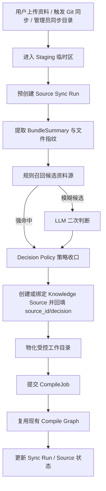

# 资料源管理与智能同步技术方案

> 版本：v1.0  
> 日期：2026-04-19  
> 状态：待实施的目标技术方案基线  
> 适用范围：Lattice 管理后台、资料导入链路、同步任务编排、知识编译链路  
> 说明：本文档是产品与技术方案，不作为当前实施进度台账；若后续进入开发，请另建执行清单并按清单持续回写进度。

---

## 1. 背景

当前项目已经完成了一轮重要产品收口：

- `/admin`、`/admin/ask`、`/admin/ai` 三页已经拆分，普通用户不再直接暴露 LLM 配置心智
- 编译主链路已经切到 `StateGraph` 骨架，`compile_jobs + compile_job_steps` 可以提供编译级与步骤级状态追踪
- 后台已经支持上传资料、目录同步、处理记录查看与问答使用

但继续往前推进后，一个新的产品问题已经非常明确：

- 用户真正理解的是“这批资料是谁、从哪来、后续怎么继续更新”
- 用户不理解也不应该理解“源目录、增量处理、后台执行、知识切片重建”这些实现概念
- 对代码项目来说，`Git 仓库` 比“手填服务器目录”更自然
- 对非代码项目来说，上传的也可能是一个多文件资料包、交付包、培训包或混合文档包，而不是代码仓库

因此，这次方案的核心不是继续扩张“资料导入页”的零散功能，而是把现有导入能力升级为：

- `资料源 Source`
- `资料源同步`
- `统一上传入口`
- `后端自动识别归并`
- `Git 仓库资料源`
- `管理员高级能力`

一句话概括：

`系统不再只处理一次性的上传动作，而是开始管理可持续维护的资料源。`

---

## 2. 已确认的产品与架构结论

基于本轮讨论，后续设计与实现以如下结论为准：

| 主题 | 确认结论 |
| --- | --- |
| 主产品模型 | 从“资料导入”升级为“资料源管理” |
| 用户主入口 | 保持一个统一入口：`上传资料` |
| 后端职责 | 自动判断本次上传是新资料源、已有资料源更新、已有资料源补充，还是待确认 |
| 资料源类型 | 支持 `UPLOAD`、`GIT`、`SERVER_DIR` 三类来源 |
| 识别对象 | 识别“资料集合/资料包”，不是只识别“代码项目” |
| 内容画像 | 需要区分 `CODE / DOCUMENT / MIXED / REPORT / ASSET_HEAVY` 等内容画像 |
| Git 仓库 | 作为主产品能力补齐，优先级高于服务器目录同步 |
| 服务器目录 | 仅作为管理员高级能力保留，默认不在普通页面展示 |
| 识别策略 | 采用“规则初筛 + LLM 二次判断 + 策略收口” |
| 用户体验 | 用户不需要先判断自己是不是在更新已有资料源 |
| 编译链路 | 继续复用现有 `compile graph`，不推翻现有编译骨架 |
| 任务追踪 | 继续复用现有 `compile_jobs + compile_job_steps`，在其上新增资料源同步层 |

---

## 3. 当前现状与核心问题

### 3.1 前端入口仍然暴露实现层概念

当前 `src/main/resources/static/admin/index.html` 直接把下面几类能力并排暴露给用户：

- 上传资料
- 目录同步
- 增量处理
- 后台执行
- 知识切片重建

这会导致用户必须先理解实现细节，才能完成“把资料放进知识库”这件本应简单的事。

### 3.2 当前系统只有编译任务，没有资料源模型

当前后台入口最终都落到：

- `src/main/java/com/xbk/lattice/api/admin/AdminCompileController.java`
- `src/main/java/com/xbk/lattice/compiler/service/CompileJobService.java`

当前核心持久化对象是 `compile_jobs`，任务只知道：

- `job_id`
- `source_dir`
- `incremental`
- `status`
- `persisted_count`

它不知道：

- 这批资料属于哪个项目或资料源
- 这次是首次导入还是再次同步
- 这次是补充资料还是覆盖更新
- 用户后续应该从哪里再次更新

### 3.3 上传只是一次性临时工作区，不形成可持续来源

当前上传文件会先由 `AdminUploadWorkspaceService` 存到：

- `lattice.compiler.jobs.upload-root-dir`
- 默认目录为 `${java.io.tmpdir}/lattice-admin-uploads`

然后直接提交一次编译任务。

这意味着：

- 上传后不会形成一个可持续维护的“资料源”
- 用户下一次如果还想更新，只能继续上传
- 系统无法天然判断“这是新资料”还是“这是上次资料的更新”

### 3.4 目录同步依赖用户知道服务器路径

当前“目录同步”本质上是：

- 页面收集 `sourceDir`
- 后端直接对该目录发起一次 compile

这要求调用者预先知道后端机器上的真实目录路径。这个心智天然属于部署/运维，不属于普通用户。

### 3.5 多资料源模型与当前数据库唯一约束存在结构冲突

当前数据库基线 `src/main/resources/db/migration/V1__baseline_schema.sql` 存在以下约束：

- `articles.concept_id` 全局唯一
- `source_files.file_path` 全局唯一
- `source_file_chunks.file_path` 依赖 `source_files(file_path)`
- `pending_queries.selected_concept_ids` 按全局 `concept_id` 记录
- `pending_queries.source_file_paths` 按全局 `file_path` 记录

这在单资料源时代没有问题，但一旦支持多个资料源，会直接出现冲突：

- 两个不同项目都可能有 `overview`、`readme`、`architecture` 这类概念 ID
- 两个不同资料源都可能有 `README.md`、`docs/api.yaml`、`design/system-overview.md`

所以，这次方案不能只停留在页面改造，必须补齐数据模型。

---

## 4. 设计目标

### 4.1 产品目标

- 用户始终围绕“资料源”而不是“目录路径”操作知识库
- 用户每次都可以只点击 `上传资料`，不需要自己判断是不是已有资料源
- 系统可以自动识别本次上传应当：
  - 创建新资料源
  - 归并为已有资料源更新
  - 归并为已有资料源补充
  - 进入待确认
- 代码项目可以通过 `Git 仓库` 接入并持续同步
- 非代码项目、混合资料包也能被正确建模和归并

### 4.2 技术目标

- 在现有 `compile graph` 之上增加资料源同步层，而不是推翻现有编译主链
- 引入 `Source` 领域模型和 `Source Sync Run` 运行模型
- 把不同来源统一“物化”为受控工作目录，再复用现有编译链
- 支持规则识别与 LLM 辅助识别
- 解决多资料源下的路径冲突与概念 ID 冲突
- 保持现有 `compile_jobs + compile_job_steps` 的可观测性价值

### 4.3 非目标

本轮方案不以以下内容为目标：

- 不把服务器目录作为普通用户入口
- 不做实时文件夹监听
- 不做多租户、多知识库、多工作区体系
- 不在第一版就支持 SSH、子模块、LFS、自动轮询 Git 同步
- 不把资料源识别完全交给 LLM 单独决策

---

## 5. 术语定义

### 5.1 资料源 Source

资料源是“这批资料的长期身份”，表示一组可以持续维护、持续同步、持续追踪的知识输入来源。

资料源可能来自：

- 用户上传的文件/文件夹
- Git 仓库
- 服务器目录

### 5.2 同步运行 Source Sync Run

一次同步运行表示对某个资料源发起的一次实际处理。

它可能由以下动作触发：

- 首次上传
- 再次上传
- Git 拉取最新
- 管理员手动同步服务器目录
- 全量重建

### 5.3 资料包 Bundle

资料包表示“一次上传或一次同步中被系统拿到的文件集合”，是一次识别与处理的输入对象，不等于长期资料源身份。

### 5.4 内容画像 Content Profile

内容画像不是来源类型，而是资料内容本身的主导形态。建议包括：

- `CODE`
- `DOCUMENT`
- `MIXED`
- `REPORT`
- `ASSET_HEAVY`

---

## 6. 总体方案

### 6.1 总体思路

系统从“收到一批文件就直接编译”升级为：

1. 先把输入视作一个 `资料包`
2. 提取资料包画像与摘要
3. 识别它是否属于已有资料源
4. 生成一次 `Source Sync Run`
5. 把资料包物化到受控工作目录
6. 再复用现有 compile pipeline / compile graph

### 6.2 总体流程图

### 6.3 分层原则

建议明确分成三层：

- `Source Layer`
  负责资料源、归并、同步、来源配置、来源状态
- `Materialization Layer`
  负责把上传文件、Git 仓库、服务器目录统一转换成受控工作目录
- `Compile Layer`
  继续负责 ingest、analyze、merge、review、persist、chunk、vector index、snapshot

这意味着：

- 资料源识别不直接塞进现有 compile graph
- 现有 compile graph 不承担“这批资料属于哪个资料源”的判断职责
- 资料源同步成功后，再调用现有编译主链

---

## 7. 目标架构

### 7.1 关键组件

建议新增或补齐以下组件：

- `SourceService`
  负责资料源创建、更新、启停、详情查询
- `SourceSyncService`
  负责编排一次完整的资料源同步
- `UploadStagingService`
  负责上传资料包的临时落盘
- `BundleFeatureExtractor`
  负责生成资料包画像与结构化摘要
- `SourceCandidateRecallService`
  负责规则召回候选资料源
- `SourceMatchReviewer`
  负责 LLM 二次判断
- `SourceDecisionPolicy`
  负责最终收口策略
- `SourceMaterializer`
  负责把不同来源统一转换成编译工作目录
- `GitSourceAdapter`
  负责 Git clone / fetch / checkout / export
- `ServerDirSourceAdapter`
  负责受限目录读取与复制
- `SourceSyncWorker`
  负责异步执行 Source Sync Run

### 7.2 与现有编译链的衔接

现有编译链继续保留：

- `CompileApplicationFacade`
- `CompileJobService`
- `CompileJobWorker`
- `CompileOrchestratorRegistry`
- `StateGraphCompileOrchestrator`

衔接方式建议是：

- `SourceSyncService` 完成识别与物化后
- 通过 `CompileJobService.submit(...)` 或 `CompileApplicationFacade.compile(...)` 触发编译
- 编译结果再回填到 `Source Sync Run`

---

## 8. 数据模型设计

### 8.1 总体原则

- 资料源要有长期身份
- 同步运行要有独立记录
- 文件与文章要绑定资料源
- 现有 compile job 可以继续存在，但要补齐 `source_id / source_sync_run_id` 关联
- 目标状态下，所有与文件、文章、引用有关的数据都必须 source-aware

### 8.2 `knowledge_sources`

新增 `knowledge_sources` 表，作为资料源主表。

建议字段：

| 字段 | 说明 |
| --- | --- |
| `id` | 主键 |
| `source_code` | 稳定资料源编码，便于拼接外部 ID |
| `name` | 资料源名称 |
| `source_type` | `UPLOAD / GIT / SERVER_DIR` |
| `content_profile` | `CODE / DOCUMENT / MIXED / REPORT / ASSET_HEAVY` |
| `status` | `ACTIVE / DISABLED / ARCHIVED` |
| `visibility` | `NORMAL / ADMIN_ONLY` |
| `default_sync_mode` | `AUTO / FULL / INCREMENTAL` |
| `config_json` | 来源配置，如 Git URL、branch、subPath 等，不得存密钥明文 |
| `metadata_json` | 扩展元数据 |
| `latest_manifest_hash` | 最近一次成功同步的资料清单 hash |
| `last_sync_run_id` | 最近一次同步运行 |
| `last_sync_status` | 最近一次同步结果 |
| `last_sync_at` | 最近一次同步时间 |
| `created_at` | 创建时间 |
| `updated_at` | 更新时间 |

说明：

- `UPLOAD` 类型的 `config_json` 不应保存用户本地路径，只保存托管副本与策略元数据
- `SERVER_DIR` 类型只在管理员模式可创建
- `source_code` 字符集建议限制为小写字母、数字、短横线，推荐正则：`^[a-z0-9](?:[a-z0-9-]{0,30}[a-z0-9])?$`
- `source_code` 不允许出现连续双连字符 `--`，为 `article_key` 的安全分隔符预留边界
- `config_json` 仅保存非敏感配置；Git 等来源的敏感凭据统一通过 `credentialRef` 间接引用凭据表，不直接写入 JSON
- `DISABLED` 表示资料源暂停接收新的同步与自动归并，但历史已编译文章仍可被查询、查看，并继续参与普通查询召回；查询层不对 `DISABLED` 做默认过滤
- `ARCHIVED` 表示资料源进入归档态，不再接收新的同步与自动归并；历史文章与快照保留用于审计和后台查看，但默认不再参与普通查询召回
- `ARCHIVED` 资料源的向量索引记录默认保留，不做立即删除；查询阶段通过 `source_id -> knowledge_sources.status` 过滤掉归档资料源，避免索引重建成本与历史审计丢失
- 当一次运行以 `SKIPPED_NO_CHANGE` 结束时，仍应更新 `last_sync_at` 作为“最近一次检查时间”，同时将 `last_sync_status` 记录为 `SKIPPED_NO_CHANGE` 与 `SUCCEEDED` 区分
- `knowledge_sources.status` 的 V1 状态迁移建议固定为：
  - `ACTIVE -> DISABLED`：通过 `PATCH /api/v1/admin/sources/{sourceId}` 暂停后续同步与自动归并
  - `DISABLED -> ACTIVE`：通过同一接口恢复
  - `ACTIVE -> ARCHIVED`、`DISABLED -> ARCHIVED`：通过同一接口归档，归档后默认不再参与普通召回
  - `ARCHIVED` 在 V1 视为受控终态，不在普通管理流程中直接恢复

### 8.3 `source_credentials`

建议新增 `source_credentials` 表，用于保存 `GIT` 或后续扩展来源所需凭据，`credentialRef` 只允许引用该表中的记录。

建议字段：

| 字段 | 说明 |
| --- | --- |
| `id` | 主键 |
| `credential_code` | 凭据编码 |
| `credential_type` | 凭据类型，如 `HTTP_TOKEN` |
| `secret_ciphertext` | 加密后的凭据内容 |
| `secret_mask` | 脱敏展示值 |
| `enabled` | 是否启用 |
| `created_by` / `updated_by` | 审计字段 |
| `created_at` / `updated_at` | 时间字段 |

### 8.4 `source_sync_runs`

新增 `source_sync_runs` 表，承载每次同步运行。

建议字段：

| 字段 | 说明 |
| --- | --- |
| `id` | 主键 |
| `source_id` | 关联资料源；上传型异步识别阶段可暂为空，待决策完成后回填 |
| `trigger_type` | `INITIAL_UPLOAD / MANUAL_UPLOAD / MANUAL_SYNC / GIT_SYNC / ADMIN_SYNC / REBUILD` |
| `sync_action` | `CREATE / UPDATE / APPEND / REBUILD`；在 `AMBIGUOUS / WAIT_CONFIRM` 阶段允许暂为空，待人工确认后回填 |
| `sync_mode` | `AUTO / FULL / INCREMENTAL` |
| `status` | `QUEUED / MATCHING / MATERIALIZING / COMPILE_QUEUED / RUNNING / SUCCEEDED / FAILED / SKIPPED_NO_CHANGE / WAIT_CONFIRM` |
| `resolver_mode` | `RULE_ONLY / RULE_PLUS_LLM / MANUAL_OVERRIDE` |
| `resolver_decision` | `NEW_SOURCE / EXISTING_SOURCE_UPDATE / EXISTING_SOURCE_APPEND / AMBIGUOUS` |
| `resolver_confidence` | 识别置信度 |
| `matched_source_id` | 若发生自动归并，可记录命中的目标资料源 |
| `decision_reason` | 简短判定说明 |
| `evidence_json` | 规则与 LLM 识别证据，建议包含 `bundleSummary` 摘要与人工确认审计信息 |
| `staging_dir` | 临时上传目录 |
| `materialized_dir` | 物化后的编译工作目录 |
| `source_revision` | Git commit / 目录快照版本 / 上传批次号 |
| `manifest_hash` | 本次资料包整体 hash |
| `file_count` | 文件数量 |
| `added_count` | 新增文件数 |
| `changed_count` | 变更文件数 |
| `removed_count` | 删除文件数 |
| `compile_job_id` | 对应的编译任务；V1 约定一次同步运行最多触发一次编译任务 |
| `error_message` | 错误信息 |
| `requested_at` | 请求时间 |
| `started_at` | 开始时间 |
| `finished_at` | 结束时间 |
| `updated_at` | 最近一次状态或字段更新时间 |

### 8.5 `source_snapshots`

新增 `source_snapshots` 表，记录资料源每次成功同步后的快照摘要。

| 字段 | 说明 |
| --- | --- |
| `id` | 主键 |
| `source_id` | 关联资料源 |
| `source_sync_run_id` | 关联同步运行 |
| `revision_ref` | 快照对应的 revision 引用 |
| `manifest_hash` | 快照内容 hash |
| `file_count` | 文件数量 |
| `summary_json` | 快照摘要，可选保存结构化统计 |
| `created_at` | 创建时间 |

用途：

- 比对两次同步是否真的发生变化
- 支持“无变更跳过”
- 为识别服务提供最近一次稳定基线
- 不保存服务器物理路径，避免重启、迁移或目录漂移后失效

### 8.6 `compile_jobs` 扩展

当前 `compile_jobs` 可以继续保留，但需要增加 source-aware 关联：

- `source_id`
- `source_sync_run_id`
- `workspace_dir`
- `trigger_type`

这样编译任务就不再只是“某个目录的编译”，而是“某个资料源某次同步的编译”。

### 8.7 `source_files` 改造

当前 `source_files.file_path` 全局唯一，这一设计在多资料源下不可继续沿用。

目标状态建议为：

| 字段 | 说明 |
| --- | --- |
| `id` | 主键 |
| `source_id` | 所属资料源 |
| `source_sync_run_id` | 最近一次写入该版本的同步运行 |
| `relative_path` | 相对资料源根目录的路径 |
| `content_hash` | 内容 hash |
| `content_preview` | 内容预览 |
| `format` | 文件格式 |
| `file_size` | 文件大小 |
| `indexed_at` | 最近一次索引时间 |
| `content_text` | 全文文本 |
| `metadata_json` | 扩展信息 |
| `is_verbatim` | 是否逐字提取 |

唯一约束改为：

- `unique (source_id, relative_path)`

说明：

- `relative_path` 是相对资料源根目录的稳定路径，是 source 内唯一定位键
- 不再保留 `raw_path` 作为正式字段；如需保留上传原路径、Git 导出原位置或服务器目录来源描述，统一写入 `metadata_json.originRef`
- `IngestNode` 在 compile graph 内负责以 `source_id + relative_path` 为 upsert key 写入 `source_files`，并把生成后的 `source_file_id` 映射传给后续持久化节点

### 8.8 `source_file_chunks` 改造

目标状态不应再按 `file_path` 关联，而应改为：

- `source_file_id`
- `chunk_index`
- `chunk_text`
- `is_verbatim`
- `indexed_at`

唯一约束：

- `unique (source_file_id, chunk_index)`

这样才能彻底消除多资料源下的路径冲突。

### 8.9 `articles` 改造

当前 `articles.concept_id` 全局唯一，也需要升级。

建议目标状态：

- 新增 `source_id`
- 新增 `article_key`
- 保留 `concept_id` 作为 source-scoped slug

推荐约束：

- `unique (article_key)`
- `unique (source_id, concept_id)`

建议 `article_key` 形如：

- `${source_code}--${concept_id}`

说明：

- `concept_id` 继续保留概念可读性
- `article_key` 负责跨资料源全局唯一
- 后续 Admin、Query、Snapshot、Pending 流程逐步迁移到 `article_key`
- `article_key` 作为 opaque key 使用，不要求运行时通过分隔符回拆字段
- `source_code` 禁止包含 `--`

### 8.10 `article_snapshots`、`pending_queries` 兼容演进

建议分两步走：

第一步：

- `article_snapshots` 新增 `source_id`、`article_key`
- `pending_queries` 新增 `selected_article_keys`
- 保留现有 `selected_concept_ids` 作为兼容字段

第二步：

- Query 侧、Admin 侧全部切换到 `article_key`
- `selected_concept_ids` 退场

### 8.11 `article_source_refs`

建议新增 `article_source_refs` 表，作为文章与源文件之间的正式关联表。

建议字段：

- `id`
- `article_id`
- `article_key`
- `source_id`
- `source_file_id`
- `relative_path`
- `ref_type`
- `created_at`

作用：

- 让引用溯源不再依赖文章正文里的文本数组
- 后续支持文章详情页、引用来源页、差异分析页的精确展示

`ref_type` 建议枚举值：

- `PRIMARY`
- `SUPPLEMENTARY`
- `INHERITED`

写入责任与迁移约束：

- compile graph 的时序约束应固定为：`IngestNode` 在消费 `RawSource` 后，先按 `source_id + relative_path` upsert `source_files`，并把 `relative_path -> source_file_id` 映射写入 StateGraph context
- 该表由 compile graph 的 `PersistArticlesNode` 在文章持久化阶段负责写入；当文章主键生成后，节点应同步落库 `article -> source_file` 关联
- `PersistArticlesNode` 只消费已存在的 `source_file_id` 映射写入 `article_source_refs`；若映射缺失，应直接失败并记录错误，而不是写入空外键
- Phase 2 起新编译数据就必须写入 `article_source_refs`
- 历史数据可在 Phase 3 通过 `source_paths`、`source_files` 与兼容快照信息按需增量回填

### 8.12 受影响的存储与治理组件

除主表改造外，下列组件也应纳入 source-aware 影响面评估：

- `ContributionJdbcRepository` / `contributions`
  - 若仍持有 `concept_id`、`file_path` 或来源路径引用，需要同步补齐 `source_id`、`article_key` 或 `source_file_id`
- `RepoSnapshotService`
  - “整库快照”语义在多资料源下需要重新界定，至少要明确是否包含 `DISABLED / ARCHIVED` 资料源，以及快照输出如何透传 `source_id`

---

## 9. 统一上传入口与后端自动收口

### 9.1 设计原则

前端对普通用户只保留一个主动作：

- `上传资料`

用户不需要事先判断：

- 这是不是已有资料源
- 这次该不该增量
- 这是更新还是补充

这些判断统一由后端收口。

### 9.2 后端四类收口结果

每次上传后，系统自动收敛到四类结果：

1. `已创建新资料源`
2. `已识别为已有资料源，正在更新`
3. `已识别为已有资料源，正在补充`
4. `检测到可能重复，进入待确认`

### 9.3 重复上传处理

同一个用户或同一项目连续重复上传，不应该简单视为“重复创建新资料源”。

建议后端处理规则：

- 如果识别为已有资料源，且 `manifest_hash` 与最近成功快照一致，则直接返回：
  - `SKIPPED_NO_CHANGE`
- 如果识别为已有资料源，且文件主体高度重合，则按 `UPDATE`
- 如果识别为已有资料源，且以新增资料为主，则按 `APPEND`
- 如果无法确定，则进入 `AMBIGUOUS`

这样用户即使始终只点“上传资料”，系统也不会机械地产生一堆重复资料源。

---

## 10. 资料源自动识别设计

### 10.1 识别对象

系统识别的不是“代码项目”，而是“资料集合/资料包”。

因此，一次上传可能是：

- Java 项目代码目录
- 文档包
- 培训资料包
- 产品方案包
- 标书资料包
- 混合型交付包

### 10.2 `BundleSummary`

每次上传或同步前，先生成 `BundleSummary`，作为识别输入。

建议字段：

- `bundleId`
- `displayName`
- `fileCount`
- `dirCount`
- `topLevelNames`
- `extensionDistribution`
- `relativePathsSample`
- `signatureFiles`
- `contentProfile`
- `keywords`
- `titleHints`
- `pathFingerprint`
- `contentFingerprint`
- `summaryText`

说明：

- `summaryText` 在 V1 默认由 `BundleFeatureExtractor` 基于规则生成
- 生成来源主要是 `README`、目录页、标题文件、文件名、关键词、扩展名分布、签名文件与少量结构化统计
- `summaryText` 的基础生成不调用 LLM
- LLM 消费的是 `BundleSummary` 及其结构化摘要，不反向承担 `summaryText` 的基础生成职责
- 为支持 `WAIT_CONFIRM` 后重新入队，`BundleSummary` 的关键字段建议持久化到 `source_sync_runs.evidence_json.bundleSummary`

### 10.3 规则初筛

规则层负责做快、稳、低成本的候选召回。

规则特征建议分三类：

1. 强特征
   - Git URL 完全一致
   - branch + subPath 完全一致
   - 服务器目录规范化路径一致
   - 文件 hash 高比例命中
   - 标志文件完全一致

2. 结构特征
   - 相对路径重合率
   - 顶层目录树相似度
   - 文件类型分布相似度
   - 文件名集合交集

3. 轻量语义特征
   - README 标题相似
   - 文档关键词集合相似
   - 业务词和主题摘要相似

说明：

- 这里的“轻量语义特征”不是字符串 `equals`
- V1 建议采用 `TF-IDF`、`Jaccard`、标题归一化后 token overlap 这类轻量相似度算法
- 若后续需要 embedding 级相似度，应单独提升为更高成本的识别层，不与规则层混写

### 10.4 LLM 二次判断

LLM 的定位是“模糊场景的语义裁判”，不做第一层召回，也不做唯一裁决来源。

LLM 触发条件建议是：

- 规则层无法强判定
- Top1 / Top2 候选分差过小
- 上传的是补充包，不是完整项目根目录
- 资料包属于 `DOCUMENT` 或 `MIXED` 类型，规则结果不稳定

LLM 输入应当是结构化摘要，而不是整包原文件。

建议输入内容：

- 当前上传资料包摘要
- 候选资料源最近一次成功快照摘要
- 路径重合与 hash 命中情况
- 标志文件信息
- 主题摘要与差异摘要

建议输出 JSON：

- `decision`
- `matchedSourceId`
- `confidence`
- `reason`
- `keySignals`
- `riskSignals`
- `recommendedAction`

### 10.5 决策收口策略

建议最终策略如下：

- 规则强命中：直接判定，不调用 LLM
- 规则模糊：调用 LLM
- LLM 高置信且无硬冲突：自动归并
- LLM 中低置信：宁可转 `AMBIGUOUS`，不要激进误归并
- 任何硬冲突：禁止自动归并

硬冲突示例：

- 候选资料源类型明显不兼容
- 关键标志文件指向不同产品或不同项目
- 多个候选资料源置信度接近但无法区分

### 10.6 文档型与混合型资料包策略

对 `DOCUMENT / REPORT / MIXED` 类型，必须作为一等公民处理，而不是只围绕代码项目建模。

重点比较信号建议是：

- 文档标题
- 目录页/索引页
- 文件命名规则
- 章节结构
- 高频业务词
- 同名附件集合
- 图示与表格命名模式

`UPDATE` 与 `APPEND` 的判定建议：

- `UPDATE`
  - 路径重合率高
  - 核心文档同名且正文相似
  - 主要是替换旧版本
- `APPEND`
  - 新增文件为主
  - 主题与某个已有资料源高度一致
  - 资料明显是在原资料源上继续扩展

### 10.7 `ASSET_HEAVY` 资料包策略

对 `ASSET_HEAVY` 内容画像，V1 建议采用“元数据优先、全文提取克制”的策略：

- 默认不对全部二进制附件执行全量 OCR
- 优先提取文件名、目录名、扩展名、基础元数据、相邻说明文档、封面页或索引页
- 当存在 `README`、目录说明、清单文件、图册索引页时，优先围绕这些文本入口构建知识
- 对少量高价值图片或扫描件，可按规则或人工触发走 OCR
- 编译侧更适合生成“附件索引/资料目录类文章”，而不是为每个二进制文件都生成全文知识文章

---

## 11. 资料源类型设计

### 11.1 `UPLOAD`

面向普通用户的主入口。

特点：

- 支持上传文件
- 支持上传文件夹
- 上传后进入 staging，再由系统自动归并
- 不保存用户本地绝对路径
- 后续更新继续走统一上传入口或资料源详情页中的“补充上传/重新上传”

### 11.2 `GIT`

面向代码项目与持续维护文档仓的主能力。

建议字段：

- `repoUrl`
- `branch`
- `subPath`
- `credentialRef`
- `cloneStrategy`

Git 同步流程：

1. clone/fetch
2. checkout 指定 branch
3. 导出指定 subPath 到物化目录
4. 生成 `BundleSummary`
5. 创建 `Source Sync Run`
6. 提交编译

V1 建议先支持：

- HTTPS public repo
- HTTPS private repo + credentialRef

凭据安全约束：

- `credentialRef` 只允许引用凭据表中的记录，如 `source_credentials.id` 或 `credential_code`
- `knowledge_sources.config_json` 中禁止存储 token、用户名密码、私钥等敏感内容
- 凭据展示仅保留脱敏值，明文只允许在提交时出现一次

V1 非目标：

- SSH
- submodule
- Git LFS 深支持

### 11.3 `SERVER_DIR`

只保留为管理员高级能力，不作为普通用户主入口。

设计约束：

- 必须启用白名单根目录
- 不允许浏览整个服务器文件系统
- 同步时不直接拿原目录做 compile 输入，而是先复制到受控物化目录

---

## 12. 前端方案

### 12.1 页面定位

`/admin` 中的“资料导入”应升级为“资料源管理”。

首屏应该展示：

- 资料源列表
- 最近同步结果
- 新增资料源/上传资料入口
- 去问答入口

不应再把以下概念直接平铺给普通用户：

- 源目录
- 增量处理
- 后台执行
- 重建知识切片

### 12.2 推荐信息架构

普通用户首屏：

- 顶部主按钮：`上传资料`
- 资料源列表
- 每个资料源卡片展示：
  - 名称
  - 类型
  - 最近同步状态
  - 最近同步时间
  - 文件数/文章数
  - 最近错误

资料源详情页：

- 基础信息
- 最近同步记录
- 本次/最近一次处理了哪些文件
- 触发按钮：
  - `补充上传`
  - `重新上传`
  - `同步最新`
  - `查看处理记录`

管理员高级区：

- `同步服务器目录`
- `后台执行`
- `全量/增量`
- 系统维护入口

### 12.3 上传文件夹

前端建议支持选择整个文件夹并保留相对路径。

这样：

- 对用户来说是自然的“上传一个项目目录/资料包”
- 对后端来说可以拿到稳定的相对路径集合

---

## 13. 后端接口设计

### 13.1 资料源接口

- `POST /api/v1/admin/sources`
  - 创建资料源元数据
- `GET /api/v1/admin/sources`
  - 查询资料源列表
  - 分页参数：`page`、`size`
  - 过滤参数：`keyword`、`status`、`sourceType`
  - 默认 `page=1`、`size=20`，最大不超过 `100`
- `GET /api/v1/admin/sources/{sourceId}`
  - 查询资料源详情
- `PATCH /api/v1/admin/sources/{sourceId}`
  - 改名、启停、更新配置

### 13.2 统一上传接口

建议新增统一上传入口：

- `POST /api/v1/admin/uploads`

它负责：

- 接收上传文件/文件夹
- 进入 staging
- 预创建 `source_sync_run`
- 提取 bundle summary
- 自动识别资料源
- 创建或归并资料源
- 回填 `source_id / decision`
- 触发编译

执行模式建议：

- 上传接口采用异步模式
- 接口在 staging 落盘并成功创建 `source_sync_run` 后立即返回，不等待完整识别、编译链路完成
- 若在请求生命周期内已经完成了强规则判定，可作为附加信息返回 `acceptedDecision`
- 最终 `decision`、`status`、`compileJobId` 以运行详情接口为准

返回结果至少应包括：

- `sourceSyncRunId`
- `status`
- `message`

建议补充：

- `accepted = true`
- `acceptedDecision`（可选）
- `sourceId`（可选，仅在已完成绑定时返回）
- `sourceName`（可选，仅在已完成绑定时返回）

客户端后续通过以下接口轮询：

- `GET /api/v1/admin/source-runs/{runId}`
  - 适用于上传接口返回后、资料源尚未最终绑定的阶段
  - 获取最终 `decision`
  - 获取当前 `status`
  - 获取 `sourceId`
  - 获取 `compileJobId`
  - 获取错误信息与识别证据摘要
- `GET /api/v1/admin/sources/{sourceId}/runs/{runId}`
  - 适用于资料源已绑定后的详情查看
  - 获取最终 `decision`
  - 获取当前 `status`
  - 获取 `compileJobId`
  - 获取错误信息与识别证据摘要

### 13.3 资料源同步接口

- `GET /api/v1/admin/source-runs/{runId}`
  - 查看单次同步详情
  - 适用于上传接口返回后、资料源尚未最终绑定的阶段
- `POST /api/v1/admin/source-runs/{runId}/confirm`
  - 对 `WAIT_CONFIRM` 状态的运行提交人工确认或覆盖决策
  - 支持选择 `NEW_SOURCE / EXISTING_SOURCE_UPDATE / EXISTING_SOURCE_APPEND`
  - 当确认归并到已有资料源时，需同时指定目标 `sourceId`
- `POST /api/v1/admin/sources/{sourceId}/sync`
  - 对已有资料源发起一次同步
  - 仅用于 `GIT` 与 `SERVER_DIR` 这类可重复物化的资料源
  - 当 `source_type=GIT` 时执行 fetch/checkout/materialize/sync
  - 当 `source_type=SERVER_DIR` 时执行目录复制/materialize/sync
- `GET /api/v1/admin/sources/{sourceId}/runs`
  - 查看同步历史
- `GET /api/v1/admin/sources/{sourceId}/runs/{runId}`
  - 查看单次同步详情

### 13.4 Git 资料源接口

- `POST /api/v1/admin/sources/git`
  - 新建 Git 资料源
- `POST /api/v1/admin/sources/{sourceId}/validate`
  - 测试 Git 可达性和认证有效性

### 13.5 兼容接口策略

现有接口建议保留一段过渡期：

- `POST /api/v1/admin/compile/upload`
- `POST /api/v1/admin/compile/jobs`

但主前端不再直接调用它们，而是逐步统一迁移到 `uploads` 与 `sources/{id}/sync`。

---

## 14. Worker 与状态流转

### 14.1 为什么需要 `SourceSyncWorker`

资料源同步并不等于编译任务。

它还包含：

- staging
- 特征提取
- 候选召回
- LLM 二次判断
- 物化工作目录
- Git 网络操作

这些步骤不应全部塞进 `CompileJobWorker`。

因此建议新增：

- `SourceSyncWorker`

并发控制建议：

- 识别前并发控制：当 `source_id` 尚为空时，服务端在 staging 完成后基于 `manifest_hash` 获取预绑定锁，并可结合客户端 `Idempotency-Key` / `clientRequestId` 做去重；若发现相同资料包已有活动中的预绑定 run，则直接返回已有 `sourceSyncRunId`
- 预绑定锁禁止使用纯应用层的“先查后插”实现；V1 推荐采用数据库级原子载体，例如：
  - 在 `source_sync_runs` 上建立仅覆盖 `source_id is null` 且 `status in (QUEUED, MATCHING, MATERIALIZING, COMPILE_QUEUED, RUNNING)` 的 `manifest_hash` 唯一部分索引；或
  - 使用等价的 `source_sync_run_prelocks` 锁表承载同样的唯一性
- 当出现唯一键冲突时，应回查并返回已存在的活动 run，而不是继续创建第二条活动 run
- 识别后并发控制：当 `source_id` 已回填后，同一 `source_id` 在任意时刻只允许一个活动中的 `source_sync_run`
- 活动态定义为：`QUEUED / MATCHING / MATERIALIZING / COMPILE_QUEUED / RUNNING`
- 当同一 `source_id` 收到新的人工同步请求时，V1 直接拒绝并返回当前活动运行信息，不做自动排队

### 14.2 推荐状态机

`source_sync_runs.status` 推荐状态：

- `QUEUED`
- `MATCHING`
- `MATERIALIZING`
- `COMPILE_QUEUED`
- `RUNNING`
- `SUCCEEDED`
- `FAILED`
- `SKIPPED_NO_CHANGE`
- `WAIT_CONFIRM`

说明：

- `updated_at` 应在每次状态变更时刷新，单靠 `requested_at / started_at / finished_at` 不足以覆盖中间态追踪

### 14.3 与现有编译任务的关系

建议关系是：

- `SourceSyncRun` 是上层同步运行
- `CompileJob` 是下层编译执行

`SourceSyncRun` 成功不一定等于 compile 成功，只有：

- 识别完成
- 物化完成
- compile 成功

三者全部走通，才算同步真正成功。

事务与补偿建议：

- `SourceSyncService` 应先在本地事务中创建并提交 `source_sync_run`
- 随后再调用 `CompileJobService` 创建编译任务
- 如果编译任务创建失败，必须立即把对应 `source_sync_run` 更新为 `FAILED`，并写入 `error_message`
- 不要求跨服务分布式事务，但要求补偿逻辑明确，避免 `source_sync_run` 长期停留在中间态
- `MATCHING` 阶段应设置总超时上限，V1 建议不超过 5 分钟；超时后自动转 `FAILED`，并写入超时错误信息

### 14.4 `WAIT_CONFIRM` 闭环

- 当自动归并无法决策时，`source_sync_run` 进入 `WAIT_CONFIRM`
- 客户端通过 `POST /api/v1/admin/source-runs/{runId}/confirm` 提交人工确认或覆盖决策
- 确认请求至少应支持：
  - 选择 `NEW_SOURCE`
  - 选择 `EXISTING_SOURCE_UPDATE`
  - 选择 `EXISTING_SOURCE_APPEND`
  - 指定目标 `sourceId`（当确认归并到已有资料源时）
- confirm 成功后，服务端应同时更新：
  - `resolver_mode = MANUAL_OVERRIDE`
  - `resolver_decision =` 用户确认值
  - `sync_action = CREATE / UPDATE / APPEND`，映射规则分别对应 `NEW_SOURCE / EXISTING_SOURCE_UPDATE / EXISTING_SOURCE_APPEND`
- 人工确认成功后，运行状态更新为 `QUEUED` 重新入队，再继续后续 `MATERIALIZING -> COMPILE_QUEUED -> RUNNING` 流程
- 若 `WAIT_CONFIRM` 超过保留期仍未处理，则在清理 staging 前先将状态更新为 `FAILED`，并写入 `wait_confirm_timeout` 错误信息，而不是无限停留在 `WAIT_CONFIRM`

### 14.5 步骤日志复用

现有 `compile_job_steps` 已经能记录编译图节点级执行日志。

建议本轮：

- 编译内步骤继续复用 `compile_job_steps`
- Source Sync 层先在 `source_sync_runs` 记录阶段状态与证据
- 如果后续需要更细粒度的 Source Sync 步骤日志，再单独引入 `source_sync_steps`

### 14.6 Staging 清理策略

建议引入定时清理任务，按以下策略处理 staging 临时文件：

- `SUCCEEDED`、`SKIPPED_NO_CHANGE`：保留 24 小时后清理
- `FAILED`：保留 72 小时后清理，便于排障
- `WAIT_CONFIRM`：保留 7 天；超时后先将运行状态更新为 `FAILED` 并写入 `wait_confirm_timeout`，再清理 staging，仅保留数据库证据
- 无主 staging 目录：按“目录创建时间超过 24 小时且无关联 run 记录”定期扫描清理

---

## 15. 与现有编译图的集成策略

### 15.1 保持 compile graph 聚焦编译

资料源识别与归并不建议并入现有 `CompileGraphDefinitionFactory`。

原因：

- compile graph 当前职责清晰，已经负责 ingest/analyze/review/persist
- 资料源识别属于更上游的来源编排逻辑
- 如果把来源识别、Git 操作、目录白名单校验都塞进 compile graph，会让图语义混乱

### 15.2 统一编译入口

建议资料源同步最终统一调用：

- `CompileJobService.submit(...)`

并通过新增字段传递：

- `sourceId`
- `sourceSyncRunId`
- `workspaceDir`
- `triggerType`

这样可以最大限度复用现有 compile graph 和任务状态追踪。

### 15.3 增量模式收口

资料源同步层可以决定：

- `AUTO`
- `FULL`
- `INCREMENTAL`

最终编译层仍然只接受：

- `incremental = true/false`

这样“用户不理解增量”与“系统仍然有增量编译能力”这两个要求可以同时满足。

`AUTO` 的建议映射规则：

- 首次同步：`AUTO -> FULL`
- 已存在成功快照但当前来源无法稳定计算增量基线：`AUTO -> FULL`
- 存在稳定基线，且来源适合做差异计算时：`AUTO -> INCREMENTAL`
- 对 V1 而言，可进一步收敛为：
  - Git/受控目录且基线完整：优先 `INCREMENTAL`
  - 上传型资料源缺乏稳定差异依据时：优先 `FULL`

---

## 16. 模型中心与 LLM 绑定扩展

当前项目已经有 LLM 配置中心与 Agent 绑定能力。

本方案建议：

- 资料源匹配的 LLM 调用继续复用现有模型中心
- 为资料源识别增加独立场景或角色，例如：
  - scene：`source_sync`
  - role：`source_match_reviewer`

这样做的好处：

- 不需要再造一套 LLM 配置体系
- 资料源识别也可以纳入运行时快照与路由冻结
- 当未配置该角色时，可自动回退为规则-only 模式

### 16.1 回退原则

如果 LLM 不可用或未配置：

- 规则强命中仍可自动判定
- 模糊候选全部转 `AMBIGUOUS`
- 不应强行自动归并

---

## 17. 实施顺序

### Phase 1：数据模型与领域骨架

目标：

- 新增 `knowledge_sources`
- 新增 `source_credentials`
- 新增 `source_sync_runs`
- 新增 `source_snapshots`
- 扩展 `compile_jobs`
- 为 `source_files/source_file_chunks/articles/article_snapshots/pending_queries` 增加 source-aware 基线字段
- 设计 `SourceService / SourceSyncService / BundleFeatureExtractor`
- 为历史单资料源数据补齐 `source_id`

说明：

- 这是整套方案的根基
- 如果没有 `Source` 模型，后续上传、Git、再次同步都会继续碎片化
- 在 Phase 1 完成历史数据回填前，不启动新的上传型资料源正式写入流程
- 在进入 Phase 2 首次真实写库前，必须先完成旧全局唯一约束替换：移除 `articles.concept_id`、`source_files.file_path` 的全局唯一约束，并替换为 `unique(article_key)`、`unique(source_id, concept_id)`、`unique(source_id, relative_path)`

### Phase 2：上传型资料源接入

目标：

- 新增统一上传入口
- staging + 自动识别 + 新建/归并
- 资料源列表页初版
- 上传重复时支持 `SKIPPED_NO_CHANGE`

说明：

- 先把普通用户最常用的场景跑通
- 该阶段以前提是 source-aware 基线字段与历史数据回填已经完成，上传链路从第一天起就写入新字段
- 从该阶段开始，`PersistArticlesNode` 对新编译数据同步写入 `article_source_refs`
- 该阶段开始前，旧的全局唯一约束必须已经完成替换，否则首次多资料源编译写库就会触发 DB 冲突

### Phase 3：多资料源数据库兼容改造

目标：

- 收紧 `source_files/source_file_chunks/articles` 的新唯一约束与关联约束
- Query/Admin 逐步从 `concept_id / file_path` 迁移到 source-aware 标识
- 将 `article_source_refs` 提升为正式来源关联主入口

说明：

- 这是技术风险最高的一段
- 但也是多资料源真正可用的必要条件
- 历史数据按需回填 `article_source_refs`
- Phase 3 不再负责首次移除旧的全局唯一约束；这些约束必须已在 Phase 2 首次真实写库前完成替换，Phase 3 只负责完成剩余读路径切换与兼容清理

### Phase 4：Git 资料源

目标：

- Git 资料源创建
- Git 同步
- commit 级追踪
- 无变更跳过

说明：

- 这是代码项目主场景的价值释放阶段

### Phase 5：管理员高级能力

目标：

- 服务器目录同步
- 白名单根目录
- 高级同步参数

说明：

- 默认隐藏
- 只在确有场景时开放

### Phase 6：收口与增强

目标：

- 前端资料源详情页增强
- 同步历史与错误回放
- 待确认处理
- CLI/MCP 视需求补齐 `source list/source sync`

---

## 18. 风险与对策

### 18.1 最大技术风险：多资料源唯一约束冲突

风险：

- `concept_id` 全局唯一
- `file_path` 全局唯一

对策：

- 必须把 source-aware 改造列为正式实施阶段，而不是“以后再说”

### 18.2 最大产品风险：自动归并误判

风险：

- 误把新资料源归并进旧资料源

对策：

- LLM 只做二次判断，不做唯一裁决
- 宁可误判为新资料源，也不要轻易误合并
- 所有自动归并都保存证据与回退能力

### 18.3 Git 范围膨胀

风险：

- 一开始就支持 SSH、LFS、submodule，导致实现与验收复杂度爆炸

对策：

- 第一版只收敛 HTTPS + 基础私仓凭据

### 18.4 用户心智回退

风险：

- 前端虽然改了名字，但仍把“增量/异步/目录路径”暴露到首屏

对策：

- 普通用户首屏严格只保留资料源与上传入口
- 高级参数全部收进管理员区

---

## 19. 验收标准

本方案进入实现后，至少应满足以下验收标准：

1. 普通用户可以始终只点击 `上传资料`，不需要先判断“是新建还是更新”。
2. 同一份资料重复上传时，系统不会机械地产生重复资料源。
3. 当本次上传与最近一次快照完全一致时，系统可以返回 `SKIPPED_NO_CHANGE`。
4. 同一个系统内可以存在多个资料源，且都含有 `README.md`、`overview` 等常见名字，不发生路径或概念冲突。
5. Git 资料源可以记录最近一次同步的 commit，并支持“无变更跳过”。
6. 资料源同步历史可以追到对应编译任务和编译步骤日志。
7. 普通用户页面不再要求理解：
   - 源目录
   - 增量处理
   - 后台执行
   - 知识切片重建
8. 管理员仍可在高级模式下使用服务器目录同步。

---

## 20. 与现有文档的关系

本文档与现有文档的关系如下：

- `.codex/Spring AI Alibaba Graph 完整接入设计方案.md`
  - 继续作为当前 compile/query graph 主骨架设计台账
- `docs/项目全流程真实验收手册.md`
  - 继续记录已真实跑通的链路与限制
- `docs/文档解析与OCR接入技术方案.md`
  - 继续聚焦文档解析与 OCR 能力，不承担资料源管理设计

本文档补齐的是：

- 资料源 Source 模型
- 统一上传入口
- 自动识别与智能归并
- Git 资料源同步
- 管理员高级目录同步

---

## 21. 一句话结论

这次改造的关键，不是再给“资料导入页”堆功能，而是把系统升级成：

`以资料源为核心、以统一上传为入口、以后端自动识别与同步编排为收口、以现有 compile graph 为执行骨架的知识输入系统。`
